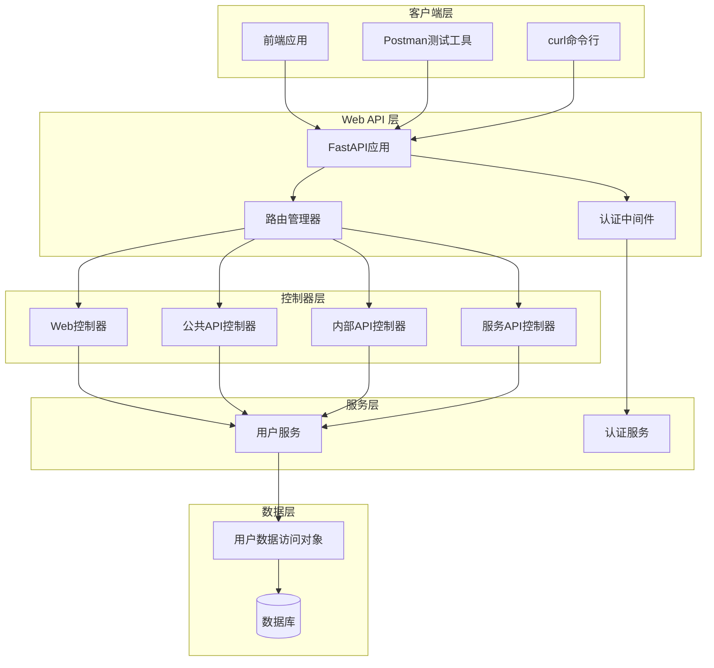
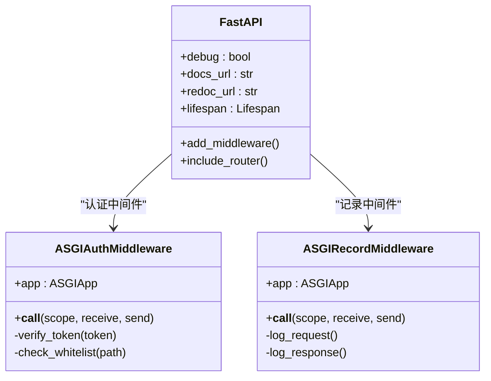
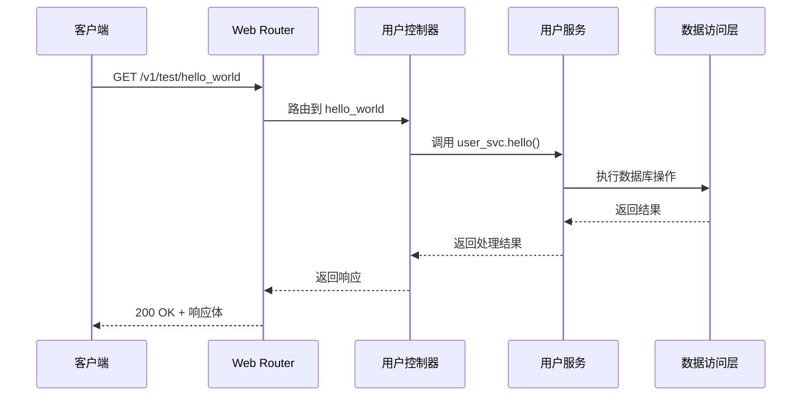
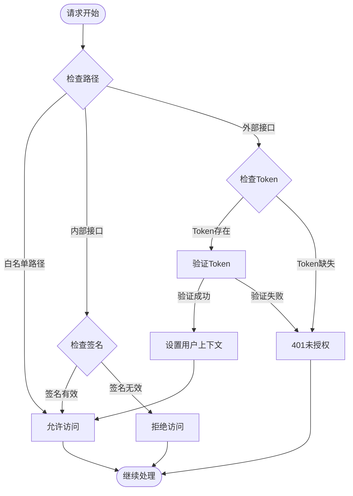
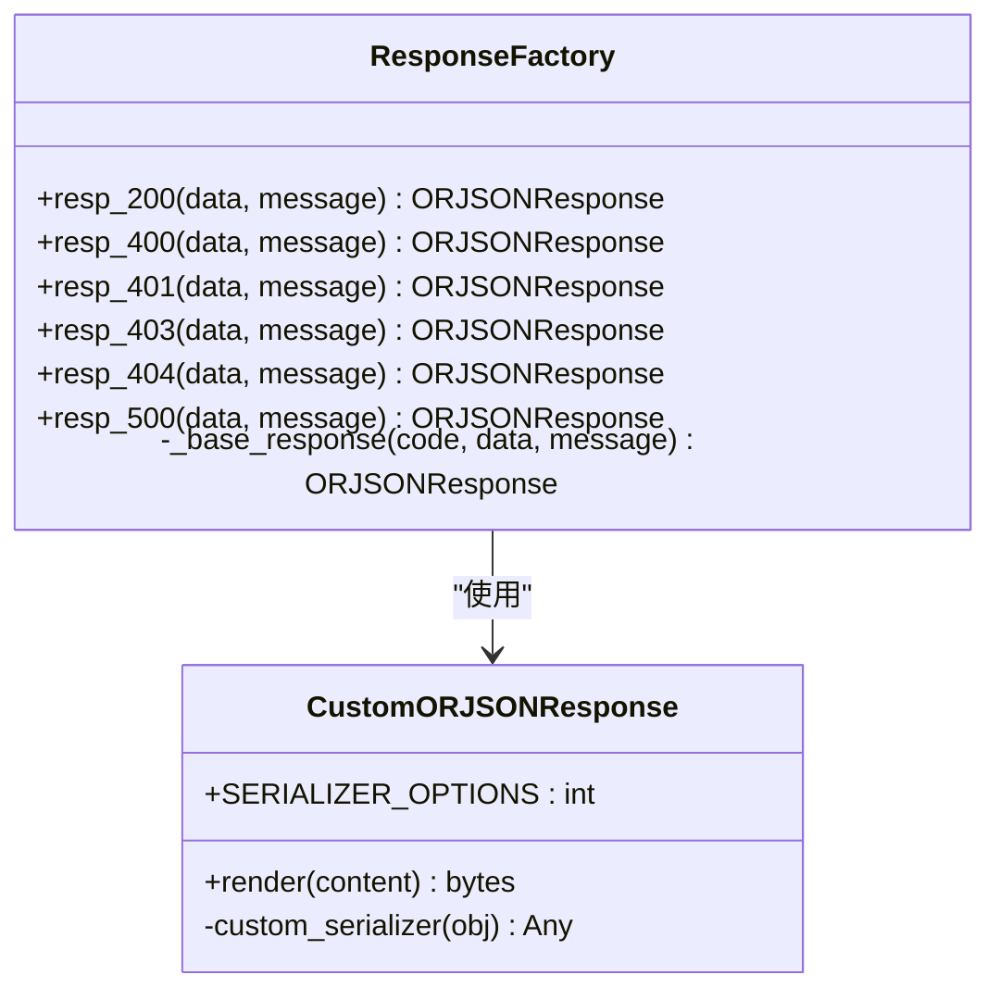
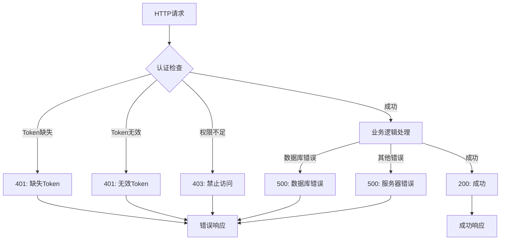

# Web API 接口文档

<cite>
**本文档中引用的文件**
- [internal/controllers/publicapi/test.py](file://internal/controllers/publicapi/test.py)
- [internal/controllers/web/user.py](file://internal/controllers/web/user.py)
- [internal/services/user.py](file://internal/services/user.py)
- [pkg/resp_tool.py](file://pkg/resp_tool.py)
- [internal/middleware/auth.py](file://internal/middleware/auth.py)
- [internal/app.py](file://internal/app.py)
- [main.py](file://main.py)
</cite>

## 目录
1. [简介](#简介)
2. [系统架构概览](#系统架构概览)
3. [核心组件分析](#核心组件分析)
4. [/test/hello_world 端点详细说明](#testhello_world-端点详细说明)
5. [认证机制](#认证机制)
6. [响应格式规范](#响应格式规范)
7. [调用示例](#调用示例)
8. [错误处理](#错误处理)
9. [性能考虑](#性能考虑)
10. [故障排除指南](#故障排除指南)

## 简介

本文档详细说明了基于 FastAPI 框架构建的 Web API 接口，重点关注 `/test/hello_world` 端点的实现细节。该系统采用分层架构设计，包含控制器层、服务层、数据访问层和基础设施层，提供了完整的认证、授权和响应处理机制。

## 系统架构概览



**图表来源**
- [internal/app.py](file://internal/app.py#L17-L31)
- [internal/middleware/auth.py](file://internal/middleware/auth.py#L22-L93)
- [internal/controllers/web/user.py](file://internal/controllers/web/user.py#L1-L12)

**章节来源**
- [internal/app.py](file://internal/app.py#L17-L31)
- [internal/middleware/auth.py](file://internal/middleware/auth.py#L22-L93)

## 核心组件分析

### 应用程序入口

应用程序通过 `create_app()` 函数创建 FastAPI 实例，注册了多个路由器和中间件：



**图表来源**
- [internal/app.py](file://internal/app.py#L17-L31)
- [internal/middleware/auth.py](file://internal/middleware/auth.py#L22-L93)

### 路由器架构

系统采用模块化的路由器设计，每个控制器都有独立的命名空间：

| 路由器名称 | 前缀路径 | 功能描述 | 访问级别 |
|-----------|----------|----------|----------|
| Web Router | `/v1` | 前端可访问的 Web API | 公开 |
| Public Router | `/v1/public` | 公共 API 接口 | 公开 |
| Internal Router | `/v1/internal` | 内部服务接口 | 内部 |
| Service Router | `/v1/service` | 服务间通信接口 | 内部 |

**章节来源**
- [internal/app.py](file://internal/app.py#L33-L41)

## /test/hello_world 端点详细说明

### 端点基本信息

| 属性 | 值 |
|------|-----|
| HTTP 方法 | GET |
| 请求路径 | `/v1/test/hello_world` |
| 路由器 | Web Router |
| 认证要求 | JWT Token |
| 响应格式 | JSON |
| 状态码 | 200 |

### 路由器配置



**图表来源**
- [internal/controllers/web/user.py](file://internal/controllers/web/user.py#L9-L12)

### 业务逻辑流程

该端点的业务逻辑相对简单，主要涉及以下步骤：

1. **请求接收**: 接收 HTTP GET 请求
2. **服务调用**: 调用 `user_svc.hello()` 方法
3. **响应生成**: 使用 `pkg.resp_tool.resp_200()` 生成标准响应

**章节来源**
- [internal/controllers/web/user.py](file://internal/controllers/web/user.py#L9-L12)

## 认证机制

### JWT Token 认证

系统采用基于 JWT 的认证机制，通过认证中间件进行 Token 验证：



**图表来源**
- [internal/middleware/auth.py](file://internal/middleware/auth.py#L33-L93)

### 认证要求

| 请求头字段 | 必填 | 格式 | 描述 |
|-----------|------|------|------|
| Authorization | 是 | Bearer <token> | JWT 认证令牌 |

### 白名单路径

以下路径无需认证即可访问：
- `/auth/login`
- `/auth/register`
- `/docs`
- `/openapi.json`
- `/v1/auth/login_by_account`
- `/v1/auth/login_by_phone`
- `/v1/auth/verify_token`
- `/test/*` (所有测试路径)

**章节来源**
- [internal/middleware/auth.py](file://internal/middleware/auth.py#L11-L18)

## 响应格式规范

### 成功响应模板

系统使用统一的响应格式，基于 `pkg.resp_tool.ResponseFactory` 类：



**图表来源**
- [pkg/resp_tool.py](file://pkg/resp_tool.py#L75-L209)

### /test/hello_world 响应格式

对于 `/test/hello_world` 端点，成功响应格式如下：

```json
{
    "code": 20000,
    "message": "",
    "data": null
}
```

### 响应码说明

| 状态码 | 含义 | 使用场景 |
|--------|------|----------|
| 20000 | 成功 | 请求处理成功 |
| 40000 | 请求错误 | 参数验证失败 |
| 40001 | 未授权 | Token 无效或缺失 |
| 40003 | 禁止访问 | 权限不足 |
| 40004 | 资源不存在 | 请求的资源不存在 |
| 50000 | 服务器错误 | 内部服务器错误 |

**章节来源**
- [pkg/resp_tool.py](file://pkg/resp_tool.py#L143-L175)

## 调用示例

### curl 命令示例

```bash
# 成功调用示例
curl -X GET "http://localhost:8000/v1/test/hello_world" \
     -H "Authorization: Bearer YOUR_JWT_TOKEN" \
     -H "Content-Type: application/json"

# 响应示例
{
    "code": 20000,
    "message": "",
    "data": null
}
```

### Python requests 示例

```python
import requests

# 设置请求头
headers = {
    "Authorization": "Bearer YOUR_JWT_TOKEN",
    "Content-Type": "application/json"
}

# 发送 GET 请求
response = requests.get(
    "http://localhost:8000/v1/test/hello_world",
    headers=headers
)

# 处理响应
if response.status_code == 200:
    result = response.json()
    print(f"成功: {result}")
else:
    print(f"错误: {response.status_code} - {response.text}")
```

### JavaScript Fetch 示例

```javascript
// 使用 Fetch API 调用
const token = 'YOUR_JWT_TOKEN';
const response = await fetch('http://localhost:8000/v1/test/hello_world', {
    method: 'GET',
    headers: {
        'Authorization': `Bearer ${token}`,
        'Content-Type': 'application/json'
    }
});

const result = await response.json();
console.log(result);
```

## 错误处理

### 常见错误场景



### 错误响应格式

```json
{
    "code": 40001,
    "message": "invalid or missing token",
    "data": null
}
```

**章节来源**
- [internal/middleware/auth.py](file://internal/middleware/auth.py#L70-L85)

## 性能考虑

### 响应时间优化

1. **连接池管理**: 使用 SQLAlchemy 连接池
2. **序列化优化**: 使用 ORJSON 提升 JSON 处理性能
3. **中间件顺序**: 认证中间件放在首位，快速过滤无效请求
4. **GZip 压缩**: 自动启用响应压缩

### 并发处理

系统支持异步处理，能够有效处理高并发请求：

- 使用 `asyncio` 异步框架
- 支持并发数据库查询
- 内置任务管理器 (`AnyIO Task Manager`)

## 故障排除指南

### 常见问题及解决方案

| 问题 | 可能原因 | 解决方案 |
|------|----------|----------|
| 401 Unauthorized | Token 无效或缺失 | 检查 Authorization 头部格式 |
| 403 Forbidden | 权限不足 | 确认用户权限设置 |
| 500 Internal Server Error | 服务器内部错误 | 查看服务器日志 |
| 连接超时 | 网络或数据库问题 | 检查网络连接和数据库状态 |

### 调试建议

1. **启用调试模式**: 设置 `DEBUG=True` 获取详细错误信息
2. **查看日志**: 检查服务器日志输出
3. **使用 Swagger UI**: 通过 `/docs` 访问交互式 API 文档
4. **验证 Token**: 使用 `/v1/auth/verify_token` 验证 Token 有效性

**章节来源**
- [internal/app.py](file://internal/app.py#L18-L23)