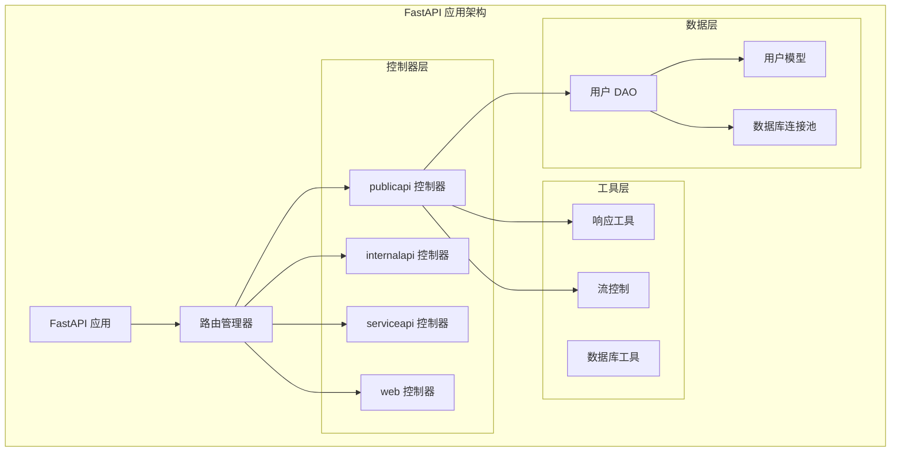
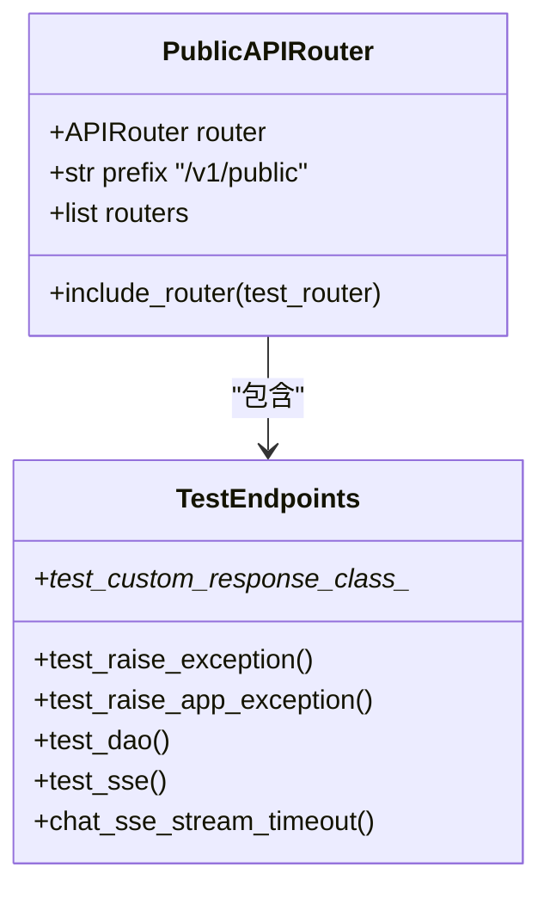
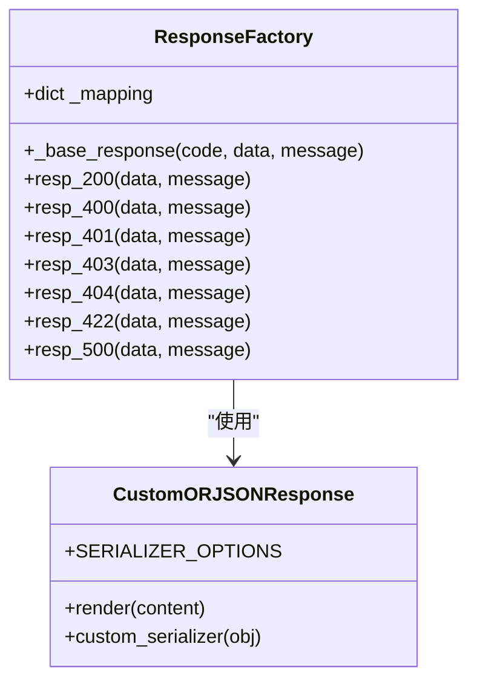
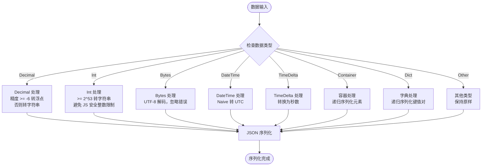
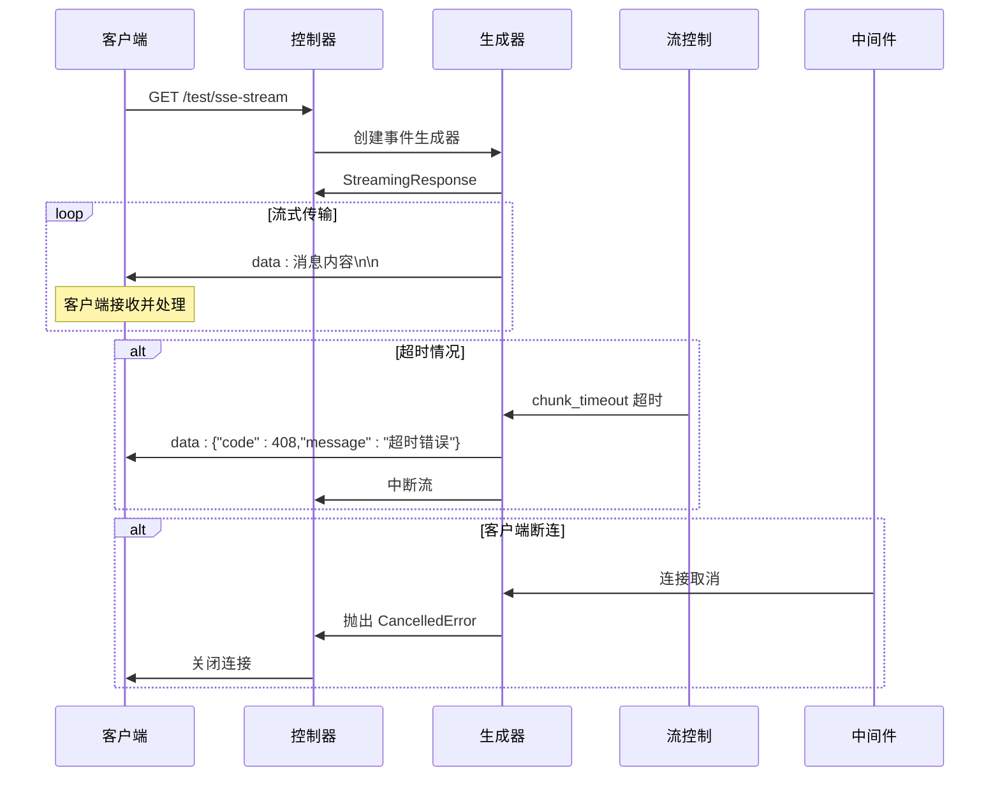
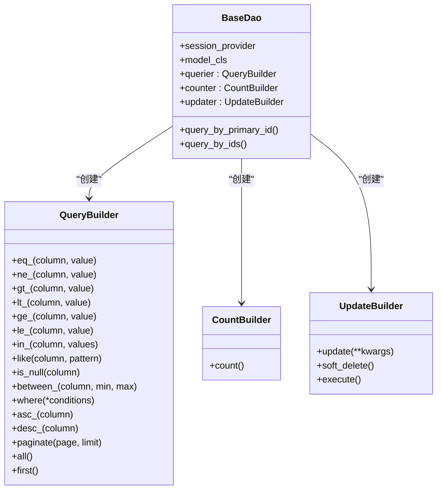
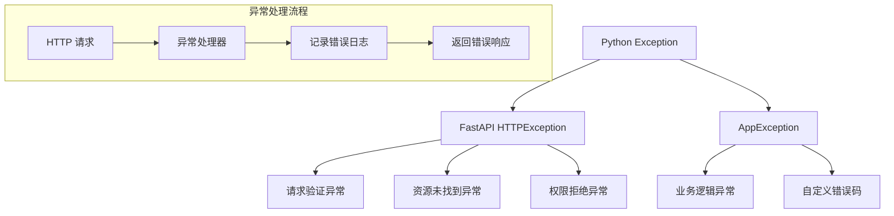

# 公共 API 接口文档

<cite>
**本文档中引用的文件**
- [test.py](file://internal/controllers/publicapi/test.py)
- [__init__.py](file://internal/controllers/publicapi/__init__.py)
- [resp_tool.py](file://pkg/resp_tool.py)
- [stream_control.py](file://pkg/stream_control.py)
- [user.py](file://internal/dao/user.py)
- [database.py](file://pkg/database.py)
- [app.py](file://internal/app.py)
</cite>

## 目录
1. [简介](#简介)
2. [项目架构概览](#项目架构概览)
3. [核心组件分析](#核心组件分析)
4. [详细接口分析](#详细接口分析)
5. [响应工厂机制](#响应工厂机制)
6. [流式传输实现](#流式传输实现)
7. [数据库操作测试](#数据库操作测试)
8. [异常处理机制](#异常处理机制)
9. [性能考虑](#性能考虑)
10. [故障排除指南](#故障排除指南)
11. [总结](#总结)

## 简介

本文档详细介绍了 FastAPI 后端项目中的公共 API 接口，这些接口位于 `publicapi` 控制器中，专门用于测试和调试目的。所有接口均无需认证，支持快速验证系统功能和响应能力。

公共 API 接口主要包含以下功能模块：
- 异常测试接口：模拟各种异常场景
- 响应工厂测试：验证自定义响应类对不同数据类型的序列化能力
- 数据库操作测试：展示链式查询和数据库操作功能
- 流式传输演示：展示 SSE（Server-Sent Events）流式响应实现

## 项目架构概览



**图表来源**
- [app.py](file://internal/app.py#L33-L41)
- [__init__.py](file://internal/controllers/publicapi/__init__.py#L1-L11)

**章节来源**
- [app.py](file://internal/app.py#L17-L41)
- [__init__.py](file://internal/controllers/publicapi/__init__.py#L1-L11)

## 核心组件分析

### 公共 API 路由器

公共 API 控制器使用专门的路由器配置，前缀为 `/v1/public`，标签为 `public v1 test`，便于识别和管理测试接口。



**图表来源**
- [__init__.py](file://internal/controllers/publicapi/__init__.py#L4-L11)
- [test.py](file://internal/controllers/publicapi/test.py#L20-L28)

### 响应工厂设计模式

系统采用响应工厂模式统一处理 API 响应，提供标准化的响应格式和错误处理机制。



**图表来源**
- [resp_tool.py](file://pkg/resp_tool.py#L75-L187)
- [resp_tool.py](file://pkg/resp_tool.py#L11-L56)

**章节来源**
- [resp_tool.py](file://pkg/resp_tool.py#L75-L187)
- [test.py](file://internal/controllers/publicapi/test.py#L20-L28)

## 详细接口分析

### 异常测试接口

#### /test/test_raise_exception
触发未捕获的 Python 异常，用于测试全局异常处理机制。

**功能特点：**
- 抛出原生 Python Exception
- 模拟系统级错误场景
- 验证异常捕获和日志记录

**请求示例：**
```bash
curl -X GET "http://localhost:8000/v1/public/test/test_raise_exception"
```

**预期响应：**
```json
{
  "code": 50000,
  "message": "Internal Server Error",
  "data": null
}
```

#### /test/test_raise_app_exception
抛出自定义 AppException，用于测试应用级异常处理。

**功能特点：**
- 使用自定义异常类
- 支持自定义错误码和消息
- 展示业务逻辑异常处理

**请求示例：**
```bash
curl -X GET "http://localhost:8000/v1/public/test/test_raise_app_exception"
```

**预期响应：**
```json
{
  "code": 500,
  "message": "test_raise_app_exception",
  "data": null
}
```

### 响应工厂测试接口

#### /test/test_custom_response_class_basic_types
测试基本数据类型的序列化能力，包括大整数、浮点数、布尔值和空值。

**测试数据类型：**
- 超过 JavaScript 安全整数范围的大整数
- 标准整数和浮点数
- 布尔值和 None 值

**预期响应结构：**
```json
{
  "code": 20000,
  "message": "",
  "data": {
    "large_int": "9007199254740993",
    "normal_int": 42,
    "float_num": 3.1415926535,
    "boolean": true,
    "none_value": null
  }
}
```

#### /test/test_custom_response_class_containers
测试容器类型（集合、元组、日期时间）的序列化处理。

**测试数据类型：**
- Python 集合自动转换为列表
- 元组自动转换为列表
- 日期时间对象序列化

#### /test/test_custom_response_class_nested
测试嵌套结构的深度序列化能力，包括多层嵌套和混合数据类型。

#### /test/test_custom_response_class_third_party
测试第三方库数据类型的序列化，如 NumPy 数组和整数。

#### /test/test_custom_response_class_edge_cases
测试边界情况和特殊场景的处理能力。

#### /test/test_custom_response_class_complex
测试复杂数据结构的序列化，包括空容器和高精度数值。

#### /test/test_custom_response_class_special_types
测试特殊数据类型的序列化，如 Decimal、字节串、时间差等。

**章节来源**
- [test.py](file://internal/controllers/publicapi/test.py#L23-L106)

### 数据库操作测试接口

#### /test/test_dao
全面测试 DAO 链式查询和数据库操作功能，包括各种查询操作符和更新操作。

**测试的操作符：**
- **eq_**: 等于查询
- **ne_**: 不等于查询  
- **gt_**: 大于查询
- **lt_**: 小于查询
- **ge_**: 大于等于查询
- **le_**: 小于等于查询
- **in_**: 包含查询
- **like**: 模糊查询
- **is_null**: 空值查询
- **between_**: 范围查询

**组合查询测试：**
- **AND 组合**: 多条件同时满足
- **OR 组合**: 多条件任一满足
- **where 组合**: 动态条件组合

**更新操作测试：**
- 字段更新（关键字参数）
- 字典更新（**kwargs 方式）

**事务处理：**
- 自动回滚机制
- 测试数据清理

**预期响应：**
```json
{
  "code": 20000,
  "message": "",
  "data": null
}
```

**章节来源**
- [test.py](file://internal/controllers/publicapi/test.py#L121-L244)
- [user.py](file://internal/dao/user.py#L6-L23)

### 流式传输演示接口

#### /test/sse-stream
展示 Server-Sent Events（SSE）流式响应的完整实现。

**流式响应阶段：**
1. **初始化阶段**: 返回欢迎消息和开始查询提示
2. **处理阶段**: 返回处理进度信息
3. **内容阶段**: 逐字返回文本内容
4. **异步生成器阶段**: 使用异步生成器返回内容
5. **结束阶段**: 返回完成消息

**SSE 格式规范：**
```
data: 消息内容\n\n
```

**预期响应示例：**
```
data: hello，正在查询资料

data: 正在组织回答

data: 开始回答

data: =========

data: 演示了SSE的基本用法, 逐字返回文本答案

data: =========

data: 演示用异步生成器陆续返回文本答案

data: =========

data: 回答结束

```

#### /chat/sse-stream/timeout
展示带超时控制的 SSE 流式响应，包含客户端断连检测和超时处理。

**超时控制特性：**
- **Chunk 超时**: 单个数据块生成超时控制
- **总超时**: Middleware 统一超时控制
- **客户端断连检测**: 自动检测客户端连接状态
- **优雅降级**: 超时时返回错误信息而非中断连接

**超时错误响应：**
```json
{
  "code": 408,
  "message": "Stream chunk timed out. No data received for 2.0s"
}
```

**章节来源**
- [test.py](file://internal/controllers/publicapi/test.py#L255-L301)
- [stream_control.py](file://pkg/stream_control.py#L13-L62)

## 响应工厂机制

### 自定义序列化器

响应工厂使用自定义序列化器处理各种复杂数据类型：



**图表来源**
- [resp_tool.py](file://pkg/resp_tool.py#L22-L46)

### 响应格式标准化

所有接口均使用统一的响应格式：

```json
{
  "code": 20000,
  "message": "成功消息",
  "data": {}
}
```

**状态码体系：**
- **20000**: 成功响应
- **40000**: 请求错误
- **40001**: 未授权
- **40003**: 禁止访问
- **40004**: 资源不存在
- **40005**: 无法处理的实体
- **50000**: 内部服务器错误

**章节来源**
- [resp_tool.py](file://pkg/resp_tool.py#L143-L175)

## 流式传输实现

### SSE 流式响应架构



**图表来源**
- [test.py](file://internal/controllers/publicapi/test.py#L255-L283)
- [stream_control.py](file://pkg/stream_control.py#L13-L62)

### 超时控制机制

流式传输包含多层次的超时控制：

1. **Chunk 超时**: 单个数据块生成超时（可配置）
2. **总超时**: Middleware 统一超时控制
3. **客户端断连检测**: 自动检测客户端连接状态

**超时处理策略：**
- **Chunk 超时**: 发送超时错误消息，继续传输
- **总超时**: 立即中断流，关闭连接
- **客户端断连**: 清理资源，释放连接

**章节来源**
- [stream_control.py](file://pkg/stream_control.py#L13-L62)

## 数据库操作测试

### DAO 查询链式操作



**图表来源**
- [user.py](file://internal/dao/user.py#L6-L23)
- [database.py](file://pkg/database.py#L523-L611)

### 查询操作符详解

| 操作符 | 功能 | 示例 |
|--------|------|------|
| `eq_` | 等于查询 | `user_dao.querier.eq_(User.id, 1)` |
| `ne_` | 不等于查询 | `user_dao.querier.ne_(User.id, 1)` |
| `gt_` | 大于查询 | `user_dao.querier.gt_(User.id, 100)` |
| `lt_` | 小于查询 | `user_dao.querier.lt_(User.id, 100)` |
| `ge_` | 大于等于查询 | `user_dao.querier.ge_(User.id, 100)` |
| `le_` | 小于等于查询 | `user_dao.querier.le_(User.id, 100)` |
| `in_` | 包含查询 | `user_dao.querier.in_(User.id, [1,2,3])` |
| `like` | 模糊查询 | `user_dao.querier.like(User.username, "%test%")` |
| `is_null` | 空值查询 | `user_dao.querier.is_null(User.deleted_at)` |
| `between_` | 范围查询 | `user_dao.querier.between_(User.id, 1, 100)` |

### 组合查询示例

```python
# AND 组合查询
users = await (
    user_dao.querier
    .eq_(User.username, "admin")
    .eq_(User.status, "active")
    .all()
)

# OR 组合查询  
users = await user_dao.querier.or_(
    User.role == "admin",
    User.role == "superuser"
).all()

# 动态条件组合
conditions = []
if username:
    conditions.append(User.username == username)
if status:
    conditions.append(User.status == status)
    
users = await user_dao.querier.where(*conditions).all()
```

**章节来源**
- [database.py](file://pkg/database.py#L335-L444)
- [test.py](file://internal/controllers/publicapi/test.py#L137-L218)

## 异常处理机制

### 异常层次结构



**图表来源**
- [test.py](file://internal/controllers/publicapi/test.py#L23-L32)
- [app.py](file://internal/app.py#L44-L52)

### 错误响应格式

所有异常均返回标准化的错误响应格式：

```json
{
  "code": 50000,
  "message": "Internal Server Error: 异常详情",
  "data": null
}
```

**错误码映射：**
- **40000**: BadRequest - 请求参数错误
- **40001**: Unauthorized - 未授权访问
- **40003**: Forbidden - 权限不足
- **40004**: NotFound - 资源不存在
- **40005**: UnprocessableEntity - 无法处理的实体
- **50000**: InternalServerError - 内部服务器错误

**章节来源**
- [app.py](file://internal/app.py#L44-L52)
- [resp_tool.py](file://pkg/resp_tool.py#L59-L72)

## 性能考虑

### 响应序列化优化

1. **ORJSON 高效序列化**: 使用 ORJSON 提供的 OPT_SERIALIZE_* 选项
2. **自定义序列化器**: 针对特定类型进行优化处理
3. **内存管理**: 避免大对象的重复序列化

### 数据库查询优化

1. **连接池管理**: 使用数据库连接池减少连接开销
2. **查询优化**: 使用链式查询构建器优化 SQL 生成
3. **事务管理**: 合理使用事务减少数据库锁定

### 流式传输优化

1. **异步生成器**: 使用异步生成器避免阻塞
2. **超时控制**: 及时检测和处理超时情况
3. **资源清理**: 自动清理超时和断连的资源

## 故障排除指南

### 常见问题及解决方案

#### 1. 响应序列化失败
**症状**: 接收到无效的 JSON 响应
**原因**: 数据类型无法被序列化
**解决方案**: 
- 检查数据类型是否在序列化器支持范围内
- 添加自定义序列化规则
- 使用更简单的数据结构

#### 2. 数据库连接超时
**症状**: /test/test_dao 接口响应缓慢或超时
**原因**: 数据库连接池耗尽或查询过于复杂
**解决方案**:
- 检查数据库连接池配置
- 优化查询语句
- 增加连接池大小

#### 3. SSE 流中断
**症状**: 流式响应意外终止
**原因**: 超时控制或客户端断连
**解决方案**:
- 调整超时参数
- 检查网络连接稳定性
- 实现重连机制

#### 4. 异常处理失效
**症状**: 异常未被正确捕获和处理
**原因**: 异常类型不在处理范围内
**解决方案**:
- 扩展异常处理逻辑
- 添加新的异常类型处理
- 检查中间件配置

### 调试技巧

1. **启用调试模式**: 设置 DEBUG=True 获取详细错误信息
2. **查看日志**: 检查应用日志和数据库日志
3. **使用 Swagger UI**: 通过交互式界面测试接口
4. **单元测试**: 运行相关测试用例验证功能

**章节来源**
- [test.py](file://internal/controllers/publicapi/test.py#L23-L32)
- [resp_tool.py](file://pkg/resp_tool.py#L56-L57)

## 总结

公共 API 接口提供了全面的测试和调试功能，涵盖了异常处理、响应序列化、数据库操作和流式传输等多个方面。这些接口的设计体现了以下特点：

### 核心优势

1. **完整性**: 涵盖了系统的主要功能模块
2. **易用性**: 统一的响应格式和清晰的接口设计
3. **可扩展性**: 基于工厂模式和链式操作的设计
4. **可靠性**: 完善的异常处理和资源管理

### 应用价值

- **开发调试**: 快速验证系统功能和性能
- **集成测试**: 作为 API 集成测试的基础
- **性能测试**: 测试系统的响应能力和并发处理
- **学习参考**: 展示最佳实践和设计模式

### 最佳实践

1. **遵循统一的响应格式**: 使用标准化的响应结构
2. **合理处理异常**: 实现完善的异常捕获和处理机制
3. **优化性能**: 使用高效的序列化和数据库操作
4. **保证稳定性**: 实现可靠的超时控制和资源管理

通过这些公共 API 接口，开发者可以快速验证系统功能，确保各个组件正常工作，并为后续的生产部署提供可靠的基础。