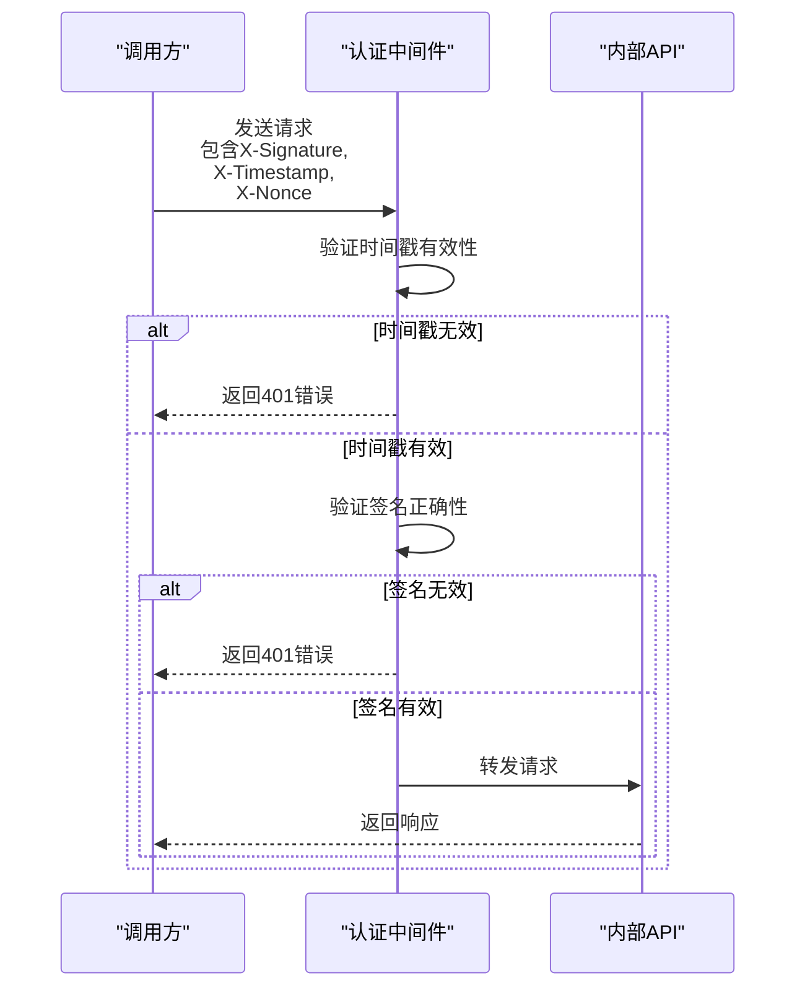
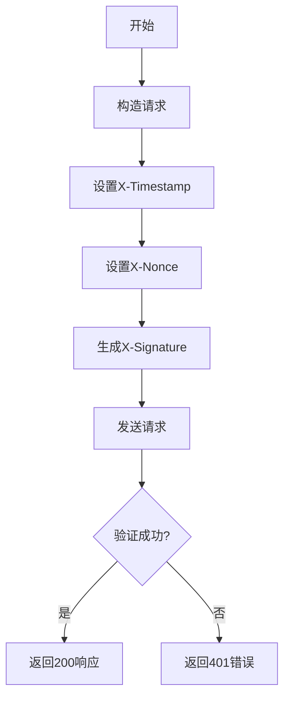
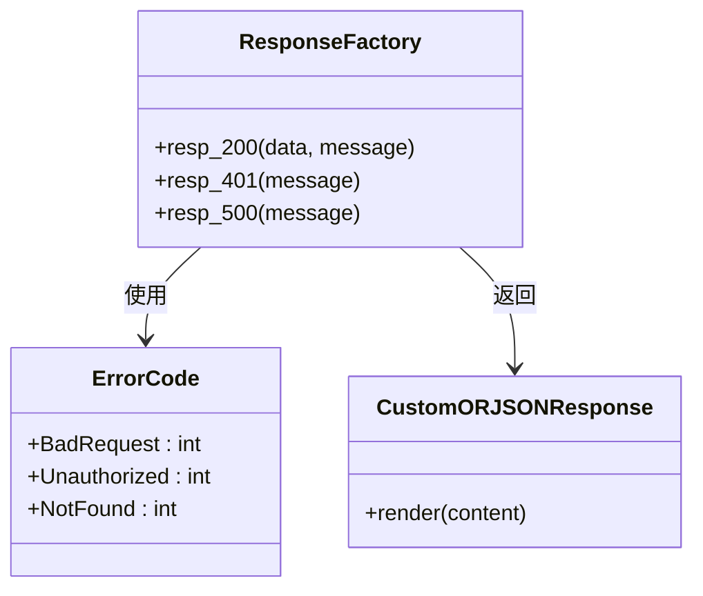
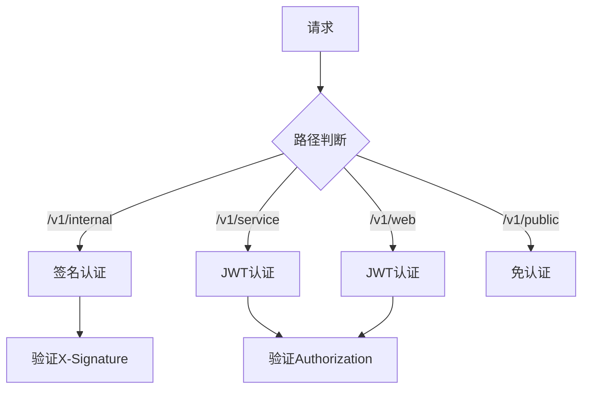

# 内部服务 API 接口

<cite>
**本文档引用文件**  
- [user.py](file://internal/controllers/internalapi/user.py)
- [signature.py](file://pkg/signature.py)
- [auth.py](file://internal/middleware/auth.py)
- [resp_tool.py](file://pkg/resp_tool.py)
- [setting.py](file://internal/config/setting.py)
- [app.py](file://internal/app.py)
</cite>

## 目录
1. [简介](#简介)
2. [安全机制](#安全机制)
3. [接口规范](#接口规范)
4. [签名生成逻辑](#签名生成逻辑)
5. [调用示例](#调用示例)
6. [响应格式](#响应格式)
7. [与其它认证方式的区别](#与其他认证方式的区别)

## 简介
本文档描述了 `internalapi` 接口的安全机制与接口规范。该类接口专用于服务间安全调用，采用基于 `X-Signature`、`X-Timestamp`、`X-Nonce` 的签名认证方式，不使用 JWT 令牌。重点说明 `/user/hello-world` 端点的使用方法和安全要求。

**Section sources**
- [user.py](file://internal/controllers/internalapi/user.py#L8-L10)
- [app.py](file://internal/app.py#L36-L37)

## 安全机制
内部服务 API 使用基于 HMAC 的签名认证机制，通过 `X-Signature`、`X-Timestamp`、`X-Nonce` 三个请求头实现安全验证。该机制由 `pkg.signature.SignatureAuthHelper` 类实现，并在 `internal.middleware.auth.ASGIAuthMiddleware` 中集成。

认证流程如下：
1. 所有以 `/v1/internal` 开头的请求都会被中间件拦截
2. 从请求头中提取 `X-Signature`、`X-Timestamp`、`X-Nonce`
3. 验证时间戳是否在允许的误差范围内（默认300秒）
4. 使用预共享密钥对 `timestamp` 和 `nonce` 进行 HMAC 签名验证
5. 只有通过验证的请求才会被转发到业务逻辑



**Diagram sources**
- [auth.py](file://internal/middleware/auth.py#L43-L58)
- [signature.py](file://pkg/signature.py#L84-L101)

**Section sources**
- [auth.py](file://internal/middleware/auth.py#L43-L58)
- [signature.py](file://pkg/signature.py#L84-L101)

## 接口规范
### /user/hello-world 端点
该端点用于健康检查或基础连通性测试。

- **HTTP 方法**: GET
- **URL 路径**: `/v1/internal/user/hello-world`
- **必需请求头**:
  - `X-Signature`: 请求签名
  - `X-Timestamp`: UTC 秒级时间戳
  - `X-Nonce`: 随机字符串，防止重放攻击



**Diagram sources**
- [user.py](file://internal/controllers/internalapi/user.py#L8-L10)
- [auth.py](file://internal/middleware/auth.py#L45-L47)

**Section sources**
- [user.py](file://internal/controllers/internalapi/user.py#L8-L10)

## 签名生成逻辑
签名生成使用 HMAC 算法，具体步骤如下：

1. 准备数据字典：`{"timestamp": "1700000000", "nonce": "random123"}`
2. 将所有键值对转换为字符串并按键名排序
3. 拼接成查询字符串格式：`nonce=random123&timestamp=1700000000`
4. 使用预共享密钥对此字符串进行 HMAC-SHA256 签名
5. 将签名结果转换为十六进制字符串

伪代码实现：
```
function generateSignature(timestamp, nonce, secretKey):
    data = {
        "timestamp": timestamp,
        "nonce": nonce
    }
    sortedPairs = sort(data.entries())
    queryString = join(sortedPairs, "&", "=")
    signature = hmac_sha256(queryString, secretKey)
    return hex_encode(signature)
```

**Section sources**
- [signature.py](file://pkg/signature.py#L30-L45)

## 调用示例
### curl 调用示例
```bash
# 假设当前时间戳为 1700000000，随机数为 abc123，密钥为 my-secret-key

# 1. 计算签名
# 数据: {"timestamp": "1700000000", "nonce": "abc123"}
# 排序后: nonce=abc123&timestamp=1700000000
# HMAC-SHA256("nonce=abc123&timestamp=1700000000", "my-secret-key") = 计算得到的签名

curl -X GET 'http://localhost:8000/v1/internal/user/hello-world' \
  -H 'X-Signature: f30ad6e8b1c7a2d5e6f4a3b2c1d0e9f8a7b6c5d4e3f2a1b0c9d8e7f6a5b4c3d' \
  -H 'X-Timestamp: 1700000000' \
  -H 'X-Nonce: abc123'
```

**Section sources**
- [signature.py](file://pkg/signature.py#L30-L45)
- [user.py](file://internal/controllers/internalapi/user.py#L8-L10)

## 响应格式
该接口返回标准的 `resp_200` 响应，用于健康检查。

响应示例：
```json
{
    "code": 20000,
    "message": "",
    "data": null
}
```

`resp_200` 是一个预定义的标准响应，表示请求成功。该响应由 `pkg.resp_tool.ResponseFactory` 提供。



**Diagram sources**
- [resp_tool.py](file://pkg/resp_tool.py#L143-L144)
- [resp_tool.py](file://pkg/resp_tool.py#L59-L72)

**Section sources**
- [resp_tool.py](file://pkg/resp_tool.py#L143-L144)
- [user.py](file://internal/controllers/internalapi/user.py#L10)

## 与其他认证方式的区别
内部服务 API 的认证方式与 `web` 和 `serviceapi` 有本质区别：

| 认证方式 | internalapi | web/serviceapi |
|---------|------------|---------------|
| 认证机制 | 签名认证 (X-Signature) | JWT 令牌 (Authorization) |
| 安全要素 | 时间戳 + 随机数 + HMAC 签名 | Token 签名验证 |
| 适用场景 | 服务间调用 | 用户端调用 |
| 密钥管理 | 预共享密钥 | 公私钥体系 |
| 重放防护 | 时间窗口 + 随机数 | Token 过期机制 |

关键区别在于：**internalapi 不使用 JWT**，而是采用更轻量级的签名认证机制，适用于可信服务之间的高效通信。



**Diagram sources**
- [auth.py](file://internal/middleware/auth.py#L34-L60)
- [app.py](file://internal/app.py#L36-L41)

**Section sources**
- [auth.py](file://internal/middleware/auth.py#L34-L60)