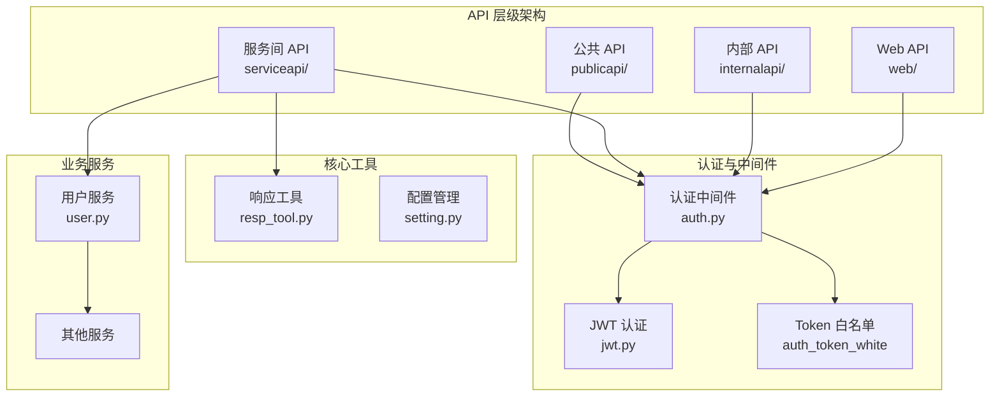
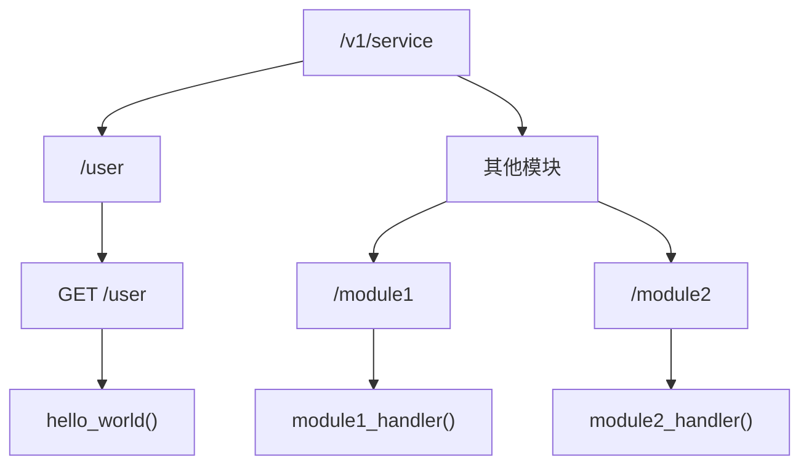
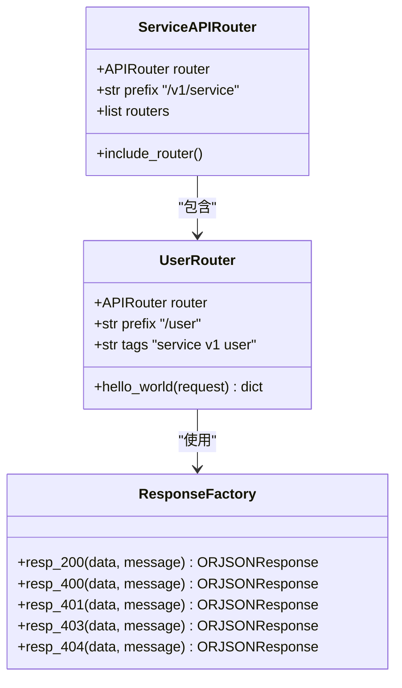
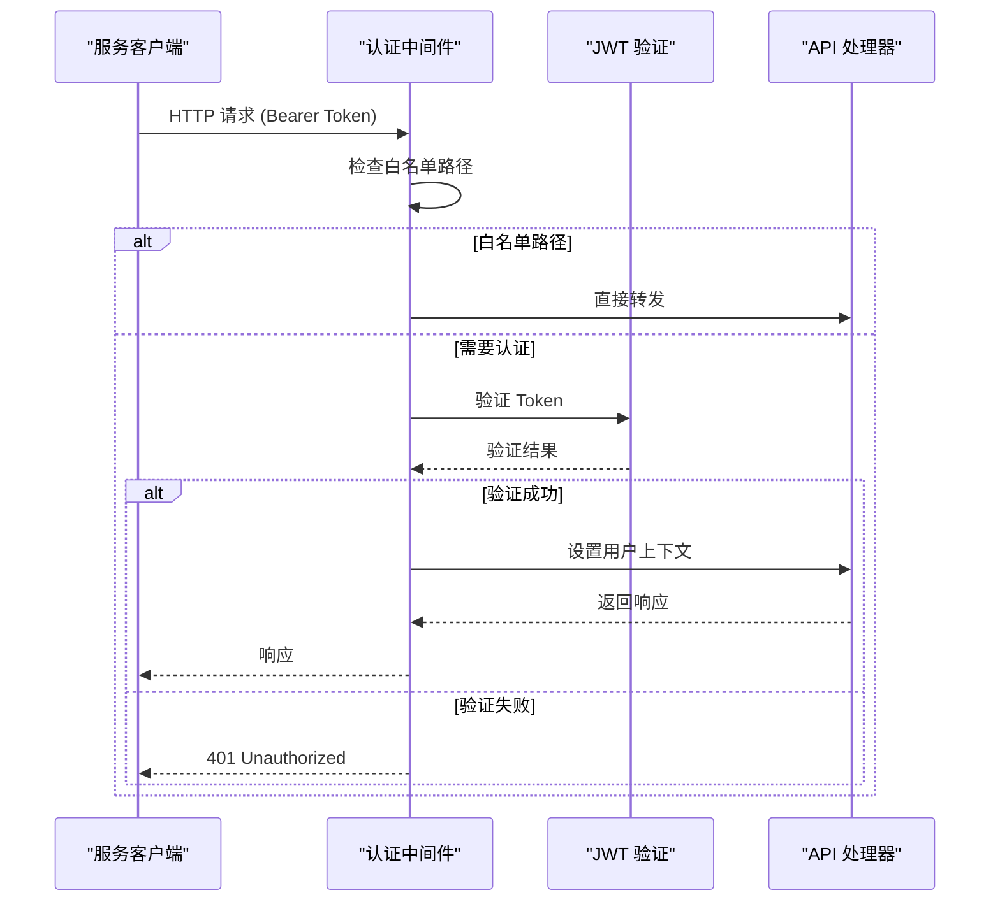
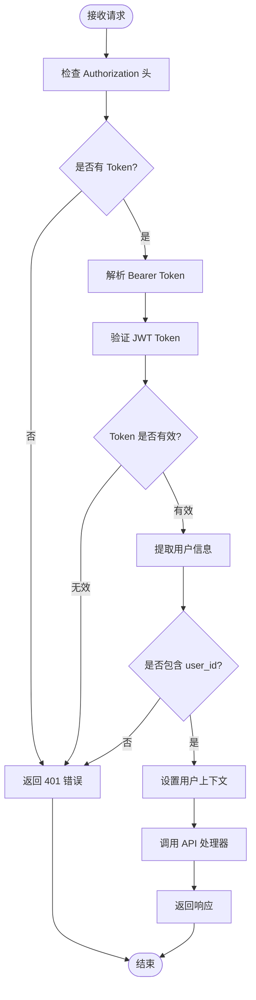
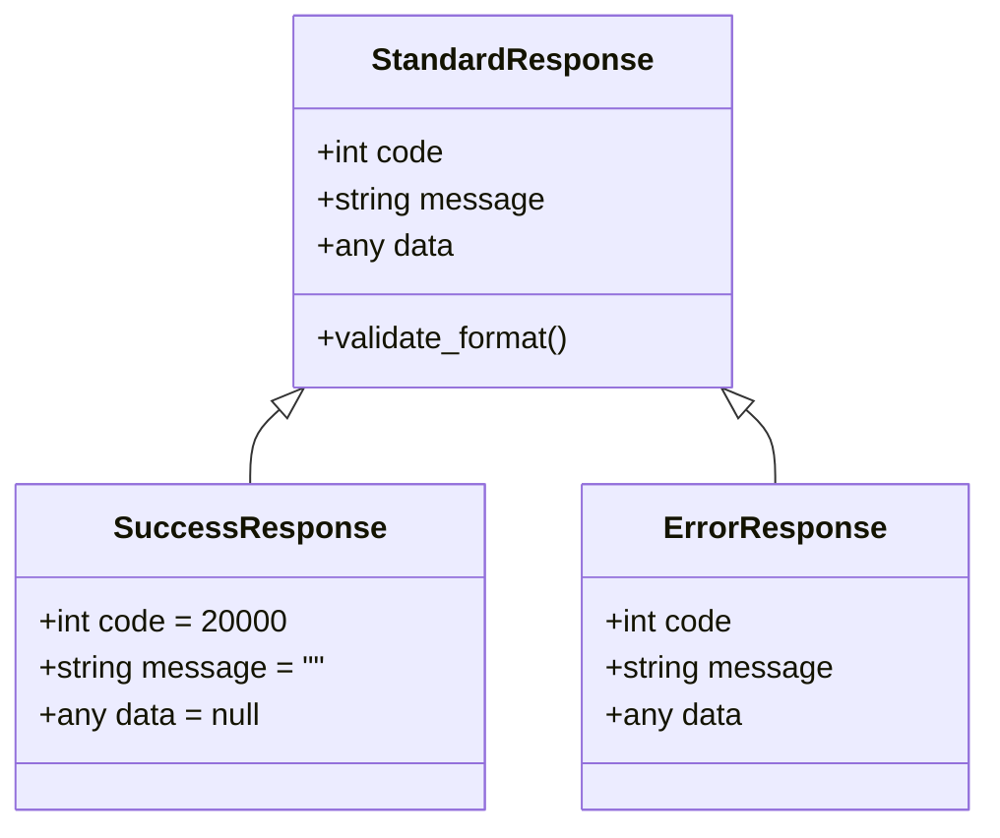
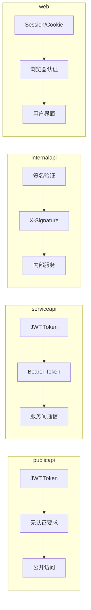

# 服务间 API 接口文档

<cite>
**本文档中引用的文件**
- [serviceapi/user.py](file://internal/controllers/serviceapi/user.py)
- [serviceapi/__init__.py](file://internal/controllers/serviceapi/__init__.py)
- [publicapi/test.py](file://internal/controllers/publicapi/test.py)
- [internalapi/user.py](file://internal/controllers/internalapi/user.py)
- [web/user.py](file://internal/controllers/web/user.py)
- [jwt.py](file://pkg/jwt.py)
- [resp_tool.py](file://pkg/resp_tool.py)
- [auth.py](file://internal/middleware/auth.py)
- [app.py](file://internal/app.py)
- [setting.py](file://internal/config/setting.py)
</cite>

## 目录
1. [简介](#简介)
2. [项目架构概览](#项目架构概览)
3. [服务间 API 架构](#服务间-api-架构)
4. [核心组件分析](#核心组件分析)
5. [认证与授权机制](#认证与授权机制)
6. [接口规范详解](#接口规范详解)
7. [响应格式标准](#响应格式标准)
8. [调用示例](#调用示例)
9. [与其他 API 层对比](#与其他-api-层对比)
10. [性能考虑](#性能考虑)
11. [故障排除指南](#故障排除指南)
12. [总结](#总结)

## 简介

服务间 API 接口（Service API）是 FastAPI 后端系统中的重要组成部分，专门设计用于微服务架构下的服务间通信。该接口层位于公共 API 和内部 API 之间，提供比公共 API 更高的安全性，同时又不像内部 API 那样严格限制访问范围。

### 主要特点

- **微服务通信专用**：专为服务间通信设计，支持分布式系统的松耦合架构
- **JWT 认证机制**：采用标准的 JWT Token 进行身份验证
- **统一响应格式**：遵循标准化的响应格式，便于客户端处理
- **中间件保护**：通过认证中间件确保请求的安全性
- **灵活的路由配置**：支持模块化的路由注册和管理

## 项目架构概览



**图表来源**
- [app.py](file://internal/app.py#L33-L41)
- [auth.py](file://internal/middleware/auth.py#L11-L19)

**章节来源**
- [app.py](file://internal/app.py#L17-L41)
- [serviceapi/__init__.py](file://internal/controllers/serviceapi/__init__.py#L1-L12)

## 服务间 API 架构

### 路由层次结构

服务间 API 采用分层的路由架构，通过 `/v1/service` 前缀统一管理所有服务间接口：



**图表来源**
- [serviceapi/__init__.py](file://internal/controllers/serviceapi/__init__.py#L5)
- [serviceapi/user.py](file://internal/controllers/serviceapi/user.py#L5)

### 安全层级定位

服务间 API 在系统安全架构中处于中间位置：

| API 层级 | 访问范围 | 认证要求 | 安全级别 | 用途 |
|---------|---------|---------|---------|------|
| publicapi | 公开访问 | 无 | 最低 | 前端公开接口 |
| serviceapi | 服务间通信 | JWT Token | 中等 | 微服务通信 |
| internalapi | 内部服务 | 签名验证 | 较高 | 内部服务调用 |
| web | Web 应用 | Session/Cookie | 最高 | 前端应用 |

**章节来源**
- [serviceapi/__init__.py](file://internal/controllers/serviceapi/__init__.py#L1-L12)
- [internalapi/__init__.py](file://internal/controllers/internalapi/__init__.py#L1-L11)

## 核心组件分析

### 服务间 API 控制器

服务间 API 的核心控制器实现了简洁而高效的服务间通信接口：



**图表来源**
- [serviceapi/__init__.py](file://internal/controllers/serviceapi/__init__.py#L5-L12)
- [serviceapi/user.py](file://internal/controllers/serviceapi/user.py#L5-L10)
- [resp_tool.py](file://pkg/resp_tool.py#L75-L209)

### 认证中间件架构

认证中间件负责验证所有服务间 API 请求的合法性：



**图表来源**
- [auth.py](file://internal/middleware/auth.py#L26-L93)

**章节来源**
- [serviceapi/user.py](file://internal/controllers/serviceapi/user.py#L1-L11)
- [auth.py](file://internal/middleware/auth.py#L22-L93)

## 认证与授权机制

### JWT Token 验证流程

服务间 API 使用 JWT Token 进行身份验证，确保只有合法的服务能够访问接口：



**图表来源**
- [jwt.py](file://pkg/jwt.py#L7-L28)
- [auth.py](file://internal/middleware/auth.py#L60-L93)

### Token 配置参数

| 参数 | 默认值 | 说明 |
|------|--------|------|
| JWT_ALGORITHM | HS256 | JWT 签名算法 |
| ACCESS_TOKEN_EXPIRE_MINUTES | 30 | Token 有效期（分钟） |
| SECRET_KEY | CHANGE_ME | JWT 密钥（生产环境必须修改） |

**章节来源**
- [jwt.py](file://pkg/jwt.py#L1-L39)
- [setting.py](file://internal/config/setting.py#L15-L36)

## 接口规范详解

### /user/hello-world 端点

#### 基本信息

| 属性 | 值 |
|------|-----|
| HTTP 方法 | GET |
| 请求路径 | `/v1/service/user` |
| 实际路径 | `/user`（前缀已包含在路由中） |
| 标签 | `service v1 user` |
| 摘要 | service hello world |

#### 认证要求

- **必需**：Bearer Token
- **格式**：`Authorization: Bearer <token>`
- **验证方式**：JWT Token 验证
- **有效期**：30 分钟（可配置）

#### 请求示例

```bash
curl -X GET "http://localhost:8000/v1/service/user" \
  -H "Authorization: Bearer YOUR_JWT_TOKEN"
```

#### 响应格式

服务间 API 的响应严格遵循统一的 `resp_200` 标准格式：

```json
{
    "code": 20000,
    "message": "",
    "data": null
}
```

**章节来源**
- [serviceapi/user.py](file://internal/controllers/serviceapi/user.py#L8-L10)
- [resp_tool.py](file://pkg/resp_tool.py#L143-L144)

## 响应格式标准

### 统一响应结构

所有服务间 API 响应都遵循标准化的 JSON 结构：



**图表来源**
- [resp_tool.py](file://pkg/resp_tool.py#L126-L140)

### 响应码规范

| 响应码 | 含义 | 使用场景 |
|--------|------|----------|
| 20000 | 成功 | 请求处理成功 |
| 40000 | 请求错误 | 参数验证失败 |
| 40001 | 未授权 | Token 无效或缺失 |
| 40003 | 禁止访问 | 权限不足 |
| 40004 | 资源不存在 | 请求的资源不存在 |
| 50000 | 服务器错误 | 内部服务器错误 |

**章节来源**
- [resp_tool.py](file://pkg/resp_tool.py#L59-L72)
- [resp_tool.py](file://pkg/resp_tool.py#L143-L175)

## 调用示例

### Python Requests 示例

以下是使用 Python requests 库调用服务间 API 的完整示例：

```python
import requests

# 配置 API 地址和 Token
BASE_URL = "http://localhost:8000/v1/service"
TOKEN = "your_jwt_token_here"

# 创建请求头
headers = {
    "Authorization": f"Bearer {TOKEN}",
    "Content-Type": "application/json"
}

# 发送 GET 请求
try:
    response = requests.get(
        f"{BASE_URL}/user",
        headers=headers,
        timeout=30
    )
    
    # 检查响应状态码
    if response.status_code == 200:
        result = response.json()
        print(f"成功: {result}")
    else:
        print(f"错误 ({response.status_code}): {response.text}")
        
except requests.exceptions.RequestException as e:
    print(f"请求错误: {e}")
```

### curl 命令示例

```bash
# 基本 GET 请求
curl -X GET "http://localhost:8000/v1/service/user" \
  -H "Authorization: Bearer YOUR_JWT_TOKEN" \
  -H "Content-Type: application/json"

# 带超时的请求
curl -X GET "http://localhost:8000/v1/service/user" \
  -H "Authorization: Bearer YOUR_JWT_TOKEN" \
  -m 30
```

### 其他编程语言示例

#### JavaScript (Fetch API)

```javascript
const baseUrl = 'http://localhost:8000/v1/service';
const token = 'YOUR_JWT_TOKEN';

fetch(`${baseUrl}/user`, {
    method: 'GET',
    headers: {
        'Authorization': `Bearer ${token}`,
        'Content-Type': 'application/json'
    },
    timeout: 30000
})
.then(response => {
    if (!response.ok) {
        throw new Error(`HTTP error! status: ${response.status}`);
    }
    return response.json();
})
.then(data => console.log('Success:', data))
.catch(error => console.error('Error:', error));
```

## 与其他 API 层对比

### API 层对比表

| 特性 | publicapi | serviceapi | internalapi | web |
|------|-----------|------------|-------------|-----|
| 访问范围 | 公开 | 服务间 | 内部服务 | Web 应用 |
| 认证方式 | 无 | JWT Token | 签名验证 | Session/Cookie |
| 安全级别 | 最低 | 中等 | 较高 | 最高 |
| 目标调用方 | 前端应用 | 后端服务 | 内部服务 | 用户浏览器 |
| Token 有效期 | 可配置 | 30分钟 | 可配置 | Session |
| 响应格式 | 标准化 | 标准化 | 标准化 | 标准化 |

### JWT 使用对比

虽然所有 API 层都使用 JWT 进行认证，但存在以下差异：



**图表来源**
- [auth.py](file://internal/middleware/auth.py#L34-L58)
- [auth.py](file://internal/middleware/auth.py#L60-L93)

**章节来源**
- [publicapi/test.py](file://internal/controllers/publicapi/test.py#L1-L301)
- [internalapi/user.py](file://internal/controllers/internalapi/user.py#L1-L11)
- [web/user.py](file://internal/controllers/web/user.py#L1-L13)

## 性能考虑

### 响应优化

服务间 API 采用了多种性能优化措施：

1. **ORJSON 响应**：使用高性能的 ORJSON 序列化库
2. **自定义序列化器**：处理复杂数据类型的序列化
3. **GZip 压缩**：自动压缩响应内容
4. **连接池**：数据库连接池优化

### 并发处理

- 支持异步处理，适合高并发场景
- 使用 FastAPI 的异步特性
- 内置的 AnyIO 任务管理器

### 缓存策略

- Redis 缓存支持
- 数据库查询优化
- 适当的缓存失效策略

## 故障排除指南

### 常见错误及解决方案

#### 1. 401 Unauthorized

**原因**：Token 无效或缺失

**解决方案**：
- 检查 Token 格式是否正确（Bearer Token）
- 验证 Token 是否已过期
- 确认 Token 来源是否可信

#### 2. 403 Forbidden

**原因**：权限不足

**解决方案**：
- 检查服务权限配置
- 验证服务账户权限
- 联系管理员确认权限

#### 3. 500 Internal Server Error

**原因**：服务器内部错误

**解决方案**：
- 检查服务日志
- 验证依赖服务状态
- 重启相关服务

### 调试技巧

1. **启用调试模式**：设置 `DEBUG=True` 查看详细错误信息
2. **检查日志**：查看应用日志中的错误详情
3. **网络诊断**：使用 curl 或 Postman 测试接口
4. **Token 验证**：使用 JWT 解码工具验证 Token 格式

**章节来源**
- [auth.py](file://internal/middleware/auth.py#L70-L85)
- [resp_tool.py](file://pkg/resp_tool.py#L149-L175)

## 总结

服务间 API 接口是 FastAPI 后端系统中不可或缺的一部分，它为微服务架构提供了安全、高效的通信机制。通过 JWT 认证、统一响应格式和完善的中间件保护，确保了服务间通信的安全性和可靠性。

### 关键优势

1. **安全性**：JWT Token 提供了强认证机制
2. **标准化**：统一的响应格式便于客户端处理
3. **灵活性**：模块化的路由设计支持扩展
4. **性能**：异步处理和优化的序列化提升性能
5. **可维护性**：清晰的架构分层便于维护和升级

### 最佳实践建议

1. **Token 管理**：妥善保管 JWT Token，定期轮换密钥
2. **错误处理**：实现完善的错误处理和重试机制
3. **监控告警**：建立 API 使用情况的监控体系
4. **版本控制**：合理规划 API 版本策略
5. **文档维护**：及时更新 API 文档，保持与代码同步

服务间 API 接口的设计充分体现了现代微服务架构的最佳实践，为构建可扩展、可维护的企业级应用奠定了坚实的基础。