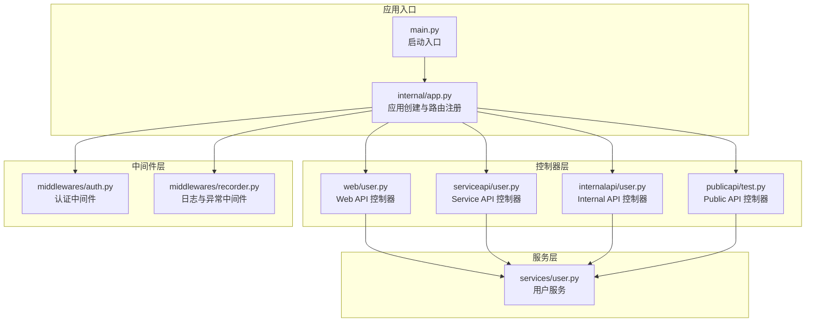
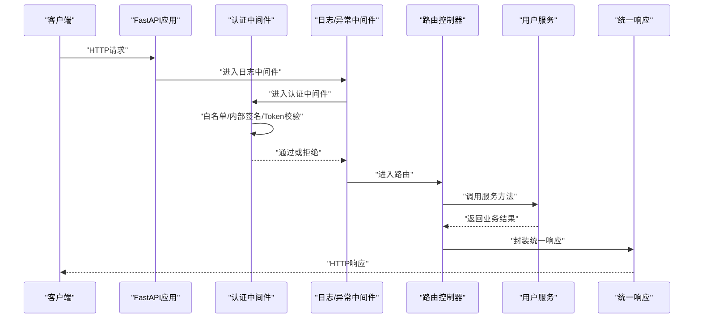
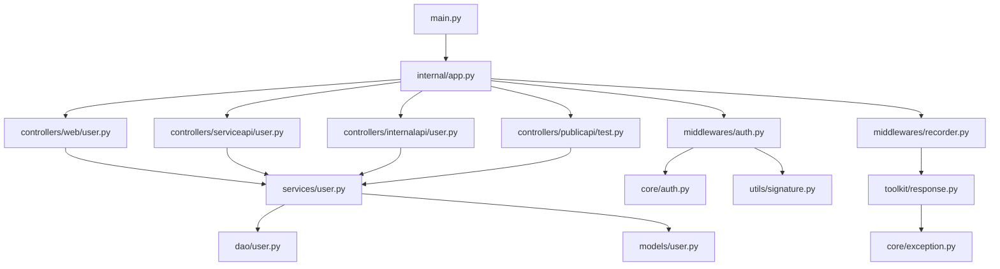

# API接口文档

<cite>
**本文档引用的文件**
- [main.py](file://main.py)
- [internal/app.py](file://internal/app.py)
- [internal/controllers/web/user.py](file://internal/controllers/web/user.py)
- [internal/controllers/serviceapi/user.py](file://internal/controllers/serviceapi/user.py)
- [internal/controllers/internalapi/user.py](file://internal/controllers/internalapi/user.py)
- [internal/controllers/publicapi/test.py](file://internal/controllers/publicapi/test.py)
- [internal/middlewares/auth.py](file://internal/middlewares/auth.py)
- [internal/middlewares/recorder.py](file://internal/middlewares/recorder.py)
- [internal/core/exception.py](file://internal/core/exception.py)
- [internal/core/auth.py](file://internal/core/auth.py)
- [internal/services/user.py](file://internal/services/user.py)
- [internal/config/load_config.py](file://internal/config/load_config.py)
- [pkg/toolkit/response.py](file://pkg/toolkit/response.py)
- [internal/utils/signature.py](file://internal/utils/signature.py)
</cite>

## 目录
1. [简介](#简介)
2. [项目结构](#项目结构)
3. [核心组件](#核心组件)
4. [架构总览](#架构总览)
5. [详细组件分析](#详细组件分析)
6. [依赖关系分析](#依赖关系分析)
7. [性能考虑](#性能考虑)
8. [故障排除指南](#故障排除指南)
9. [结论](#结论)
10. [附录](#附录)

## 简介
本文件为该FastAPI后端项目的API接口规范文档，涵盖Web API、Service API、Internal API与Public API四类接口的完整规范。文档包含：
- RESTful端点的HTTP方法、URL模式、请求/响应结构与认证方式
- 参数说明、返回值结构、错误处理策略
- 具体请求/响应示例与代码片段路径
- 不同API层级的安全考虑与访问控制
- API版本管理、速率限制与性能优化建议
- 客户端实现指导与最佳实践

## 项目结构
该项目采用模块化分层设计，API控制器按功能域划分：
- Web API：面向前端或外部用户的接口，位于web目录
- Service API：服务间调用接口，位于serviceapi目录
- Internal API：内部服务间调用接口，位于internalapi目录
- Public API：公开测试与示例接口，位于publicapi目录

图表来源
- [main.py](file://main.py#L1-L18)
- [internal/app.py](file://internal/app.py#L17-L46)
- [internal/controllers/web/user.py](file://internal/controllers/web/user.py#L1-L17)
- [internal/controllers/serviceapi/user.py](file://internal/controllers/serviceapi/user.py#L1-L21)
- [internal/controllers/internalapi/user.py](file://internal/controllers/internalapi/user.py#L1-L11)
- [internal/controllers/publicapi/test.py](file://internal/controllers/publicapi/test.py#L1-L90)
- [internal/middlewares/auth.py](file://internal/middlewares/auth.py#L88-L149)
- [internal/middlewares/recorder.py](file://internal/middlewares/recorder.py#L66-L123)
- [internal/services/user.py](file://internal/services/user.py#L1-L21)

章节来源
- [main.py](file://main.py#L1-L18)
- [internal/app.py](file://internal/app.py#L17-L46)

## 核心组件
- 应用创建与生命周期管理：负责初始化日志、数据库、Redis、签名认证、雪花ID生成器等，并注册路由、异常处理与中间件。
- 中间件体系：
  - 认证中间件：处理白名单放行、内部接口签名认证、Token认证与用户上下文设置。
  - 日志与异常中间件：统一记录访问日志、响应耗时与追踪ID；捕获业务异常与系统异常并返回标准化错误响应。
- 统一响应与错误模型：定义统一响应体结构、成功/错误响应工厂与错误码集合。
- 配置系统：集中管理环境变量、数据库与Redis连接、JWT与AES密钥等。

章节来源
- [internal/app.py](file://internal/app.py#L17-L109)
- [internal/middlewares/auth.py](file://internal/middlewares/auth.py#L88-L149)
- [internal/middlewares/recorder.py](file://internal/middlewares/recorder.py#L66-L123)
- [pkg/toolkit/response.py](file://pkg/toolkit/response.py#L14-L233)
- [internal/core/exception.py](file://internal/core/exception.py#L1-L38)
- [internal/config/load_config.py](file://internal/config/load_config.py#L46-L243)

## 架构总览
下图展示请求从客户端到服务层的完整流转，包括认证、日志、服务调用与响应返回。

图表来源
- [internal/app.py](file://internal/app.py#L33-L82)
- [internal/middlewares/auth.py](file://internal/middlewares/auth.py#L88-L149)
- [internal/middlewares/recorder.py](file://internal/middlewares/recorder.py#L70-L123)
- [internal/controllers/web/user.py](file://internal/controllers/web/user.py#L13-L16)
- [internal/services/user.py](file://internal/services/user.py#L9-L21)
- [pkg/toolkit/response.py](file://pkg/toolkit/response.py#L181-L200)

## 详细组件分析

### Web API（Web v1 用户）
- 路由前缀：/test
- 标签：web v1 user
- 端点
  - GET /test/hello_world
    - 功能：返回“Hello World”
    - 认证：受Token认证保护（非白名单）
    - 请求参数：无
    - 返回：统一响应体（code=20000，message为空，data为字符串“Hello World”）
    - 示例请求/响应
      - 请求：GET /test/hello_world（需携带有效Token）
      - 响应：{"code": 20000, "message": "", "data": "Hello World"}
- 依赖注入：UserService通过依赖注入函数new_user_service提供

章节来源
- [internal/controllers/web/user.py](file://internal/controllers/web/user.py#L1-L17)
- [internal/services/user.py](file://internal/services/user.py#L18-L21)
- [pkg/toolkit/response.py](file://pkg/toolkit/response.py#L181-L200)

### Service API（Service v1 用户）
- 路由前缀：/user
- 标签：service v1 user
- 端点
  - GET /user/hello_world
    - 功能：返回“Hello World”
    - 认证：受Token认证保护（非白名单）
    - 请求参数：无
    - 返回：统一响应体（code=20000）
    - 示例请求/响应
      - 请求：GET /user/hello_world（需携带有效Token）
      - 响应：{"code": 20000, "message": "", "data": null}
- 依赖注入：UserService通过依赖注入函数new_user_service提供

章节来源
- [internal/controllers/serviceapi/user.py](file://internal/controllers/serviceapi/user.py#L1-L21)
- [internal/services/user.py](file://internal/services/user.py#L18-L21)
- [pkg/toolkit/response.py](file://pkg/toolkit/response.py#L181-L200)

### Internal API（Internal v1 用户）
- 路由前缀：/user
- 标签：internal v1 user
- 端点
  - GET /user/hello-world
    - 功能：返回“Hello World”
    - 认证：内部接口，需签名认证（X-Signature/X-Timestamp/X-Nonce）
    - 请求参数：无
    - 返回：统一响应体（code=20000）
    - 示例请求/响应
      - 请求：GET /user/hello-world（需携带签名头）
      - 响应：{"code": 20000, "message": "", "data": null}
- 注意：该端点不依赖Token认证，而是依赖签名认证

章节来源
- [internal/controllers/internalapi/user.py](file://internal/controllers/internalapi/user.py#L1-L11)
- [internal/middlewares/auth.py](file://internal/middlewares/auth.py#L119-L131)
- [pkg/toolkit/response.py](file://pkg/toolkit/response.py#L181-L200)

### Public API（Public v1 测试）
- 路由前缀：/test
- 标签：public v1 test
- 端点
  - GET /test/test_raise_exception
    - 功能：主动抛出普通异常
    - 认证：白名单路径（无需Token），但异常将被日志/异常中间件捕获并返回统一错误响应
    - 返回：统一错误响应（默认内部错误）
  - GET /test/test_raise_app_exception
    - 功能：主动抛出业务异常（AppException）
    - 认证：白名单路径（无需Token）
    - 返回：统一错误响应（根据错误码与消息定制）
  - GET /test/test_contextvars_on_asyncio_task
    - 功能：在异步任务中使用上下文变量
    - 认证：白名单路径（无需Token）
    - 返回：统一成功响应
  - GET /test/test/sse-stream
    - 功能：Server-Sent Events流式输出
    - 认证：白名单路径（无需Token）
    - 返回：text/event-stream，分块返回数据
  - GET /test/chat/sse-stream/timeout
    - 功能：带超时控制的SSE流
    - 认证：白名单路径（无需Token）
    - 返回：text/event-stream，按块超时控制
- 示例请求/响应
  - 请求：GET /test/test_raise_exception
  - 响应：{"code": 50000, "message": "服务器内部错误", "data": null}

章节来源
- [internal/controllers/publicapi/test.py](file://internal/controllers/publicapi/test.py#L1-L90)
- [internal/middlewares/recorder.py](file://internal/middlewares/recorder.py#L104-L123)
- [pkg/toolkit/response.py](file://pkg/toolkit/response.py#L195-L200)

### 统一响应与错误模型
- 响应结构
  - 字段：code（业务状态码）、message（提示信息）、data（业务数据）
  - 成功：code=20000，message为空或简要描述，data为实际数据
  - 错误：code为错误码，message为错误描述
- 错误码
  - 客户端错误：40000~49999（如请求参数错误、未授权、签名无效、权限不足、资源不存在、请求载荷过大、无法处理的实体）
  - 服务端错误：50000~59999（如服务器内部错误）
- 响应工厂
  - success_response：成功响应
  - success_list_response：分页列表响应
  - error_response：错误响应

章节来源
- [pkg/toolkit/response.py](file://pkg/toolkit/response.py#L14-L233)
- [internal/core/exception.py](file://internal/core/exception.py#L19-L38)

### 认证与安全
- 认证中间件行为
  - 白名单路径：无需认证（如文档、开放接口等）
  - 内部接口：必须提供签名头（X-Signature、X-Timestamp、X-Nonce），由签名认证处理器校验
  - 外部接口：必须提供Token，Token经缓存校验并通过后设置用户上下文
- Token校验
  - 从缓存获取用户元数据与Token列表，校验通过后设置用户ID上下文
- 签名认证
  - 使用JWT密钥初始化签名处理器，校验签名头有效性
- 安全建议
  - 内部接口严格使用签名认证
  - 外部接口严格使用Token认证
  - 所有接口均应启用CORS配置（生产环境建议限定来源）

章节来源
- [internal/middlewares/auth.py](file://internal/middlewares/auth.py#L88-L149)
- [internal/core/auth.py](file://internal/core/auth.py#L4-L19)
- [internal/utils/signature.py](file://internal/utils/signature.py#L9-L27)
- [internal/app.py](file://internal/app.py#L67-L77)

### 日志与异常处理
- 日志中间件
  - 记录请求与响应日志，注入X-Process-Time与X-Trace-ID
  - 在异常发生时区分业务异常与系统异常，统一返回错误响应
- 异常处理
  - RequestValidationError：统一返回请求参数错误
  - AppException：按错误码返回业务错误
  - 其他异常：返回服务器内部错误

章节来源
- [internal/middlewares/recorder.py](file://internal/middlewares/recorder.py#L66-L123)
- [internal/app.py](file://internal/app.py#L48-L53)
- [internal/core/exception.py](file://internal/core/exception.py#L4-L17)

### 服务层与DAO
- 用户服务
  - hello_world：静态方法，返回“Hello World”
  - get_user_by_phone：通过DAO按手机号查询用户
- DAO与模型
  - UserDao：数据访问对象
  - User：用户模型

章节来源
- [internal/services/user.py](file://internal/services/user.py#L1-L21)

## 依赖关系分析

图表来源
- [main.py](file://main.py#L1-L18)
- [internal/app.py](file://internal/app.py#L33-L46)
- [internal/controllers/web/user.py](file://internal/controllers/web/user.py#L1-L17)
- [internal/controllers/serviceapi/user.py](file://internal/controllers/serviceapi/user.py#L1-L21)
- [internal/controllers/internalapi/user.py](file://internal/controllers/internalapi/user.py#L1-L11)
- [internal/controllers/publicapi/test.py](file://internal/controllers/publicapi/test.py#L1-L90)
- [internal/middlewares/auth.py](file://internal/middlewares/auth.py#L88-L149)
- [internal/middlewares/recorder.py](file://internal/middlewares/recorder.py#L66-L123)
- [internal/services/user.py](file://internal/services/user.py#L1-L21)
- [internal/core/auth.py](file://internal/core/auth.py#L1-L19)
- [internal/utils/signature.py](file://internal/utils/signature.py#L1-L27)
- [pkg/toolkit/response.py](file://pkg/toolkit/response.py#L1-L233)
- [internal/core/exception.py](file://internal/core/exception.py#L1-L38)

## 性能考虑
- 压缩传输
  - 启用GZip中间件，减少响应体积，提升传输效率
- 序列化性能
  - 使用高性能ORJSON响应类，避免重复编码
- 并发与异步
  - 使用异步任务管理器处理后台任务，保持请求快速返回
- 日志与追踪
  - 注入X-Process-Time与X-Trace-ID，便于性能分析与问题定位
- 建议
  - 生产环境开启限流与熔断
  - 对热点接口增加缓存
  - 使用连接池优化数据库与Redis访问

章节来源
- [internal/app.py](file://internal/app.py#L56-L59)
- [pkg/toolkit/response.py](file://pkg/toolkit/response.py#L62-L81)
- [internal/middlewares/recorder.py](file://internal/middlewares/recorder.py#L54-L63)

## 故障排除指南
- 常见错误与处理
  - 未授权/缺少Token：检查Authorization头或签名头是否正确
  - 签名无效：确认X-Signature、X-Timestamp、X-Nonce是否齐全且未过期
  - 请求参数错误：检查请求体与参数格式
  - 服务器内部错误：查看日志追踪ID定位具体异常
- 排查步骤
  - 检查中间件日志与响应头（X-Process-Time、X-Trace-ID）
  - 确认认证中间件是否正确放行白名单路径
  - 核对配置文件与密钥是否正确加载
- 参考
  - 统一错误响应与错误码定义
  - 异常捕获与日志记录机制

章节来源
- [internal/middlewares/auth.py](file://internal/middlewares/auth.py#L119-L149)
- [internal/middlewares/recorder.py](file://internal/middlewares/recorder.py#L104-L123)
- [pkg/toolkit/response.py](file://pkg/toolkit/response.py#L195-L200)
- [internal/core/exception.py](file://internal/core/exception.py#L19-L38)

## 结论
本项目提供了清晰的API分层设计与完善的中间件体系，结合统一响应与错误模型，能够满足Web、Service、Internal与Public四类接口的安全与性能需求。建议在生产环境中进一步完善限流、缓存与监控策略，并持续优化签名与Token的生命周期管理。

## 附录

### API版本管理
- 版本前缀
  - 内部接口：/v1/internal
  - 公共接口：/v1/public
  - 测试接口：/test
- 建议
  - 以URL前缀区分版本，保持向后兼容
  - 对废弃版本提供迁移指引与过渡期

章节来源
- [internal/middlewares/auth.py](file://internal/middlewares/auth.py#L27-L42)

### 速率限制与配额
- 建议
  - 基于Token或IP维度实施限流
  - 对内部接口采用更严格的限流策略
  - 使用Redis实现分布式限流

[本节为通用建议，无需特定文件来源]

### 客户端实现最佳实践
- 认证
  - 外部接口：在Authorization头中携带Token
  - 内部接口：按签名算法生成X-Signature、X-Timestamp、X-Nonce
- 响应处理
  - 解析统一响应体，优先检查code字段
  - 对SSE流进行断线重连与超时控制
- 性能
  - 启用HTTP/2与连接复用
  - 对大响应启用GZip解压
- 可观测性
  - 透传X-Trace-ID便于链路追踪
  - 记录请求与响应日志，保留关键指标

[本节为通用建议，无需特定文件来源]