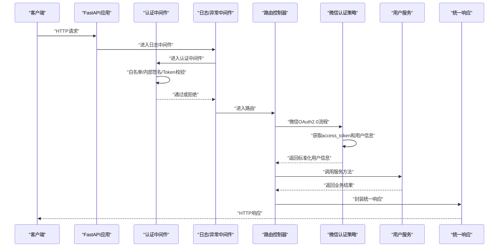
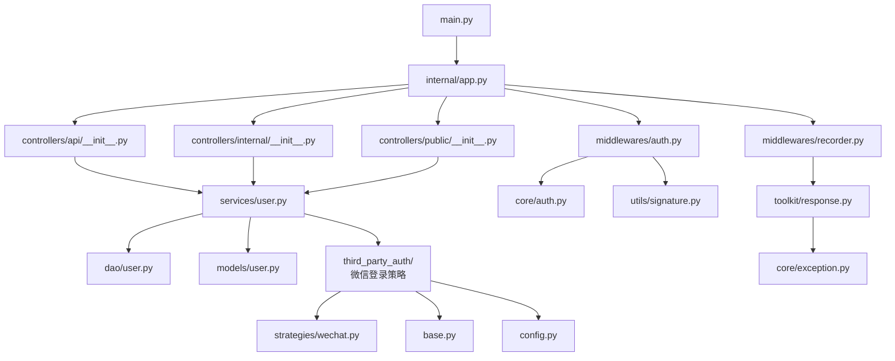

# API接口文档

<cite>
**本文档引用的文件**
- [main.py](file://main.py)
- [internal/app.py](file://internal/app.py)
- [internal/controllers/api/__init__.py](file://internal/controllers/api/__init__.py)
- [internal/controllers/api/user.py](file://internal/controllers/api/user.py)
- [internal/controllers/api/auth.py](file://internal/controllers/api/auth.py)
- [internal/controllers/internal/__init__.py](file://internal/controllers/internal/__init__.py)
- [internal/controllers/public/__init__.py](file://internal/controllers/public/__init__.py)
- [internal/controllers/public/test.py](file://internal/controllers/public/test.py)
- [internal/middlewares/auth.py](file://internal/middlewares/auth.py)
- [internal/middlewares/recorder.py](file://internal/middlewares/recorder.py)
- [internal/core/exception.py](file://internal/core/exception.py)
- [internal/core/auth.py](file://internal/core/auth.py)
- [internal/services/user.py](file://internal/services/user.py)
- [internal/config/settings.py](file://internal/config/settings.py)
- [pkg/toolkit/response.py](file://pkg/toolkit/response.py)
- [internal/utils/signature.py](file://internal/utils/signature.py)
- [pkg/third_party_auth/strategies/wechat.py](file://pkg/third_party_auth/strategies/wechat.py)
- [pkg/third_party_auth/base.py](file://pkg/third_party_auth/base.py)
- [pkg/third_party_auth/config.py](file://pkg/third_party_auth/config.py)
- [internal/schemas/user.py](file://internal/schemas/user.py)
- [internal/dao/user.py](file://internal/dao/user.py)
- [internal/models/user.py](file://internal/models/user.py)
</cite>

## 更新摘要
**变更内容**
- 新增微信登录API接口：添加/wechat/login端点，支持微信OAuth2.0授权登录
- 新增第三方认证策略：实现微信登录策略，支持通过授权码换取access_token和用户信息
- 新增微信配置支持：在Settings中添加WECHAT_APP_ID和WECHAT_APP_SECRET配置项
- 新增微信用户信息存储：在User模型中添加微信相关字段（openid、unionid、头像、昵称）
- 更新认证中间件：将/wechat/login加入白名单路径

## 目录
1. [简介](#简介)
2. [项目结构](#项目结构)
3. [核心组件](#核心组件)
4. [架构总览](#架构总览)
5. [详细组件分析](#详细组件分析)
6. [依赖关系分析](#依赖关系分析)
7. [性能考虑](#性能考虑)
8. [故障排除指南](#故障排除指南)
9. [结论](#结论)
10. [附录](#附录)

## 简介
本文件为该FastAPI后端项目的API接口规范文档，涵盖API、Internal、Public三类接口的完整规范。文档包含：
- RESTful端点的HTTP方法、URL模式、请求/响应结构与认证方式
- 参数说明、返回值结构、错误处理策略
- 具体请求/响应示例与代码片段路径
- 不同API层级的安全考虑与访问控制
- API版本管理、速率限制与性能优化建议
- 客户端实现指导与最佳实践

## 项目结构
该项目采用模块化分层设计，API控制器按功能域划分：
- API：面向前端或外部用户的接口，位于api目录，前缀为/v1
- Internal：内部服务间调用接口，位于internal目录，前缀为/v1/internal
- Public：公开测试与示例接口，位于public目录，前缀为/v1/public

```mermaid
graph TB
subgraph "应用入口"
MAIN["main.py<br/>启动入口"]
APP["internal/app.py<br/>应用创建与路由注册"]
end
subgraph "控制器层"
API["api/__init__.py<br/>API 控制器"]
INTERNAL["internal/__init__.py<br/>Internal 控制器"]
PUBLIC["public/__init__.py<br/>Public 控制器"]
end
subgraph "中间件层"
AUTH["middlewares/auth.py<br/>认证中间件"]
RECORDER["middlewares/recorder.py<br/>日志与异常中间件"]
end
subgraph "服务层"
SVC_USER["services/user.py<br/>用户服务"]
end
subgraph "第三方认证层"
THIRD_PARTY["third_party_auth/<br/>第三方认证策略"]
END
MAIN --> APP
APP --> API
APP --> INTERNAL
APP --> PUBLIC
API --> SVC_USER
INTERNAL --> SVC_USER
PUBLIC --> SVC_USER
APP --> AUTH
APP --> RECORDER
SVC_USER --> THIRD_PARTY
```

**图表来源**
- [main.py](file://main.py#L1-L4)
- [internal/app.py](file://internal/app.py#L31-L40)
- [internal/controllers/api/__init__.py](file://internal/controllers/api/__init__.py#L5-L13)
- [internal/controllers/internal/__init__.py](file://internal/controllers/internal/__init__.py#L3)
- [internal/controllers/public/__init__.py](file://internal/controllers/public/__init__.py#L5)
- [pkg/third_party_auth/strategies/wechat.py](file://pkg/third_party_auth/strategies/wechat.py#L1-L138)

**章节来源**
- [main.py](file://main.py#L1-L4)
- [internal/app.py](file://internal/app.py#L31-L40)

## 核心组件
- 应用创建与生命周期管理：负责初始化日志、数据库、Redis、签名认证、雪花ID生成器等，并注册路由、异常处理与中间件。
- 中间件体系：
  - 认证中间件：处理白名单放行、内部接口签名认证、Token认证与用户上下文设置。
  - 日志与异常中间件：统一记录访问日志、响应耗时与追踪ID；捕获业务异常与系统异常并返回标准化错误响应。
- 统一响应与错误模型：定义统一响应体结构、成功/错误响应工厂与错误码集合。
- 配置系统：集中管理环境变量、数据库与Redis连接、JWT与AES密钥等。
- 第三方认证系统：支持微信、支付宝等第三方平台的OAuth2.0认证流程。

**章节来源**
- [internal/app.py](file://internal/app.py#L15-L28)
- [internal/middlewares/auth.py](file://internal/middlewares/auth.py#L84-L147)
- [internal/middlewares/recorder.py](file://internal/middlewares/recorder.py#L68-L148)
- [pkg/toolkit/response.py](file://pkg/toolkit/response.py#L14-L233)
- [internal/core/exception.py](file://internal/core/exception.py#L1-L38)
- [internal/config/settings.py](file://internal/config/settings.py#L1-L200)
- [pkg/third_party_auth/base.py](file://pkg/third_party_auth/base.py#L1-L85)

## 架构总览
下图展示请求从客户端到服务层的完整流转，包括认证、日志、服务调用与响应返回。

```mermaid
sequenceDiagram
participant Client as "客户端"
participant App as "FastAPI应用"
participant AuthMW as "认证中间件"
participant RecorderMW as "日志/异常中间件"
participant Router as "路由控制器"
participant Strategy as "微信认证策略"
participant Svc as "用户服务"
participant Resp as "统一响应"
Client->>App : "HTTP请求"
App->>RecorderMW : "进入日志中间件"
RecorderMW->>AuthMW : "进入认证中间件"
AuthMW->>AuthMW : "白名单/内部签名/Token校验"
AuthMW-->>RecorderMW : "通过或拒绝"
RecorderMW->>Router : "进入路由"
Router->>Strategy : "微信OAuth2.0流程"
Strategy->>Strategy : "获取access_token和用户信息"
Strategy-->>Router : "返回标准化用户信息"
Router->>Svc : "调用服务方法"
Svc-->>Router : "返回业务结果"
Router->>Resp : "封装统一响应"
Resp-->>Client : "HTTP响应"
```

**图表来源**
- [internal/app.py](file://internal/app.py#L50-L76)
- [internal/middlewares/auth.py](file://internal/middlewares/auth.py#L88-L147)
- [internal/middlewares/recorder.py](file://internal/middlewares/recorder.py#L105-L148)
- [internal/controllers/api/user.py](file://internal/controllers/api/user.py#L13-L16)
- [internal/services/user.py](file://internal/services/user.py#L9-L25)
- [pkg/toolkit/response.py](file://pkg/toolkit/response.py#L181-L200)
- [pkg/third_party_auth/strategies/wechat.py](file://pkg/third_party_auth/strategies/wechat.py#L50-L137)

## 详细组件分析

### API（API v1 用户）
- 路由前缀：/v1
- 标签：api user
- 端点
  - GET /v1/user/hello-world
    - 功能：返回"Hello World"
    - 认证：受Token认证保护（非白名单）
    - 请求参数：无
    - 返回：统一响应体（code=20000）
    - 示例请求/响应
      - 请求：GET /v1/user/hello-world（需携带有效Token）
      - 响应：{"code": 20000, "message": "", "data": null}
- 依赖注入：UserService通过依赖注入函数new_user_service提供

**章节来源**
- [internal/controllers/api/user.py](file://internal/controllers/api/user.py#L8-L16)
- [internal/services/user.py](file://internal/services/user.py#L9-L25)
- [pkg/toolkit/response.py](file://pkg/toolkit/response.py#L181-L200)

### API（API v1 认证）
- 路由前缀：/v1/auth
- 标签：Authentication
- 端点
  - POST /v1/auth/login
    - 功能：用户登录，生成并返回Token
    - 认证：无需Token（登录接口）
    - 请求参数：用户名、密码（Schema：UserLoginReqSchema）
    - 返回：UserLoginRespSchema（包含用户信息和token）
    - 示例请求/响应
      - 请求：POST /v1/auth/login
      - 响应：{"user": {"id": 1, "name": "test", "phone": "13800000000"}, "token": "tk_xxxxxxxxxxxxxxxx"}
  - POST /v1/auth/logout
    - 功能：用户登出，使Token失效
    - 认证：受Token认证保护
    - 请求参数：Authorization头（可选Bearer前缀）
    - 返回：{"message": "登出成功"}
  - GET /v1/auth/me
    - 功能：获取当前用户信息
    - 认证：受Token认证保护
    - 请求参数：无
    - 返回：UserDetailSchema（用户基本信息）
  - POST /v1/auth/wechat/login
    - 功能：微信OAuth2.0登录
    - 认证：无需Token（微信登录接口）
    - 请求参数：授权码（Schema：WeChatLoginReqSchema）
    - 返回：UserLoginRespSchema（包含用户信息和token）
    - 示例请求/响应
      - 请求：POST /v1/auth/wechat/login
      - 响应：{"user": {"id": 1, "name": "test", "phone": "13800000000"}, "token": "tk_xxxxxxxxxxxxxxxx"}
- 依赖注入：UserService通过依赖注入函数new_user_service提供

**更新** 新增微信登录端点，支持通过微信授权码进行OAuth2.0登录

**章节来源**
- [internal/controllers/api/auth.py](file://internal/controllers/api/auth.py#L17-L143)
- [internal/controllers/api/auth.py](file://internal/controllers/api/auth.py#L219-L299)
- [internal/services/user.py](file://internal/services/user.py#L17-L25)
- [internal/schemas/user.py](file://internal/schemas/user.py#L30-L33)

### Internal（Internal v1）
- 路由前缀：/v1/internal
- 标签：internal
- 端点
  - 当前为空：/v1/internal
    - 功能：预留内部接口
    - 认证：内部接口，需签名认证（X-Signature/X-Timestamp/X-Nonce）
    - 请求参数：无
    - 返回：预留响应
- 注意：该端点不依赖Token认证，而是依赖签名认证

**章节来源**
- [internal/controllers/internal/__init__.py](file://internal/controllers/internal/__init__.py#L3-L8)
- [internal/middlewares/auth.py](file://internal/middlewares/auth.py#L115-L127)

### Public（Public v1 测试）
- 路由前缀：/v1/public/test
- 标签：public test
- 端点
  - POST /v1/public/test/test_validation_error
    - 功能：测试请求验证异常
    - 认证：白名单路径（无需Token）
    - 请求参数：TestValidationRequest（name、age、email）
    - 返回：统一成功响应
  - GET /v1/public/test/test_raise_exception
    - 功能：主动抛出普通异常
    - 认证：白名单路径（无需Token）
    - 返回：统一错误响应（默认内部错误）
  - GET /v1/public/test/test_raise_app_exception
    - 功能：主动抛出业务异常（AppException）
    - 认证：白名单路径（无需Token）
    - 返回：统一错误响应（根据错误码与消息定制）
  - GET /v1/public/test/test_contextvars_on_asyncio_task
    - 功能：在异步任务中使用上下文变量
    - 认证：白名单路径（无需Token）
    - 返回：统一成功响应
  - GET /v1/public/test/test/sse-stream
    - 功能：Server-Sent Events流式输出
    - 认证：白名单路径（无需Token）
    - 返回：text/event-stream，分块返回数据
  - GET /v1/public/test/chat/sse-stream/timeout
    - 功能：带超时控制的SSE流
    - 认证：白名单路径（无需Token）
    - 返回：text/event-stream，按块超时控制
- 示例请求/响应
  - 请求：GET /v1/public/test/test_raise_exception
  - 响应：{"code": 50000, "message": "服务器内部错误", "data": null}

**章节来源**
- [internal/controllers/public/test.py](file://internal/controllers/public/test.py#L12-L113)
- [internal/middlewares/recorder.py](file://internal/middlewares/recorder.py#L139-L148)
- [pkg/toolkit/response.py](file://pkg/toolkit/response.py#L195-L200)

### 第三方认证系统
- 微信登录策略
  - 功能：实现微信OAuth2.0认证流程
  - 端点：通过微信API获取access_token和用户信息
  - 认证：使用WeChatConfig配置进行OAuth2.0授权
  - 流程：授权码换取access_token → 获取用户信息 → 标准化用户数据
- 第三方认证基础类
  - BaseThirdPartyAuthStrategy：定义统一的第三方认证接口
  - ThirdPartyUserInfo：标准化第三方用户信息结构
- 配置管理
  - WeChatConfig：微信开放平台配置（app_id、app_secret、grant_type）
  - AlipayConfig：支付宝开放平台配置（预留）

**更新** 新增微信登录策略和第三方认证基础设施

**章节来源**
- [pkg/third_party_auth/strategies/wechat.py](file://pkg/third_party_auth/strategies/wechat.py#L12-L137)
- [pkg/third_party_auth/base.py](file://pkg/third_party_auth/base.py#L8-L84)
- [pkg/third_party_auth/config.py](file://pkg/third_party_auth/config.py#L6-L47)

### 统一响应与错误模型
- 响应结构
  - 字段：code（业务状态码）、message（提示信息）、data（业务数据）
  - 成功：code=20000，message为空或简要描述，data为实际数据
  - 错误：code为错误码，message为错误描述
- 错误码
  - 客户端错误：40000~49999（如请求参数错误、未授权、签名无效、权限不足、资源不存在、请求载荷过大、无法处理的实体）
  - 服务端错误：50000~59999（如服务器内部错误）
- 响应工厂
  - success_response：成功响应
  - success_list_response：分页列表响应
  - error_response：错误响应

**章节来源**
- [pkg/toolkit/response.py](file://pkg/toolkit/response.py#L14-L233)
- [internal/core/exception.py](file://internal/core/exception.py#L19-L38)

### 认证与安全
- 认证中间件行为
  - 白名单路径：无需认证（如文档、开放接口、微信登录等）
  - 内部接口：必须提供签名头（X-Signature、X-Timestamp、X-Nonce），由签名认证处理器校验
  - 外部接口：必须提供Token，Token经缓存校验并通过后设置用户上下文
- Token校验
  - 从缓存获取用户元数据与Token列表，校验通过后设置用户ID上下文
- 签名认证
  - 使用JWT密钥初始化签名处理器，校验签名头有效性
- 安全建议
  - 内部接口严格使用签名认证
  - 外部接口严格使用Token认证
  - 所有接口均应启用CORS配置（生产环境建议限定来源）

**更新** 将/wechat/login加入白名单路径，支持微信登录无需Token认证

**章节来源**
- [internal/middlewares/auth.py](file://internal/middlewares/auth.py#L13-L43)
- [internal/middlewares/auth.py](file://internal/middlewares/auth.py#L84-L147)
- [internal/core/auth.py](file://internal/core/auth.py#L4-L19)
- [internal/utils/signature.py](file://internal/utils/signature.py#L9-L27)
- [internal/app.py](file://internal/app.py#L62-L71)

### 日志与异常处理
- 日志中间件
  - 记录请求与响应日志，注入X-Process-Time与X-Trace-ID
  - 在异常发生时区分业务异常与系统异常，统一返回错误响应
- 异常处理
  - RequestValidationError：统一返回请求参数错误
  - AppException：按错误码返回业务错误
  - 其他异常：返回服务器内部错误

**章节来源**
- [internal/middlewares/recorder.py](file://internal/middlewares/recorder.py#L68-L148)
- [internal/app.py](file://internal/app.py#L43-L48)
- [internal/core/exception.py](file://internal/core/exception.py#L4-L17)

### 服务层与DAO
- 用户服务
  - hello_world：静态方法，返回"Hello World"
  - get_user_by_phone：通过DAO按手机号查询用户
  - get_user_by_username：通过DAO按用户名查询用户
  - get_or_create_user_by_third_party：根据第三方用户信息获取或创建用户
  - bind_third_party_account：将第三方账号绑定到现有用户
- DAO与模型
  - UserDao：数据访问对象，支持微信openid查询和存在性检查
  - User：用户模型，包含微信相关字段（openid、unionid、头像、昵称）

**更新** 新增第三方登录相关服务方法和微信用户字段支持

**章节来源**
- [internal/services/user.py](file://internal/services/user.py#L1-L187)
- [internal/dao/user.py](file://internal/dao/user.py#L23-L30)
- [internal/models/user.py](file://internal/models/user.py#L15-L27)

## 依赖关系分析

```mermaid
graph TB
MAIN["main.py"] --> APP["internal/app.py"]
APP --> API["controllers/api/__init__.py"]
APP --> INTERNAL["controllers/internal/__init__.py"]
APP --> PUBLIC["controllers/public/__init__.py"]
API --> SVC_USER["services/user.py"]
INTERNAL --> SVC_USER
PUBLIC --> SVC_USER
APP --> AUTH["middlewares/auth.py"]
APP --> RECORDER["middlewares/recorder.py"]
SVC_USER --> DAO_USER["dao/user.py"]
SVC_USER --> MODEL_USER["models/user.py"]
AUTH --> CORE_AUTH["core/auth.py"]
AUTH --> SIG_UTIL["utils/signature.py"]
RECORDER --> RESP["toolkit/response.py"]
RESP --> ERR["core/exception.py"]
SVC_USER --> THIRD_PARTY["third_party_auth/<br/>微信登录策略"]
THIRD_PARTY --> STRATEGY_WECHAT["strategies/wechat.py"]
THIRD_PARTY --> BASE["base.py"]
THIRD_PARTY --> CONFIG["config.py"]
```

**图表来源**
- [main.py](file://main.py#L1-L4)
- [internal/app.py](file://internal/app.py#L31-L40)
- [internal/controllers/api/__init__.py](file://internal/controllers/api/__init__.py#L1-L14)
- [internal/controllers/internal/__init__.py](file://internal/controllers/internal/__init__.py#L1-L9)
- [internal/controllers/public/__init__.py](file://internal/controllers/public/__init__.py#L1-L11)
- [internal/middlewares/auth.py](file://internal/middlewares/auth.py#L84-L147)
- [internal/middlewares/recorder.py](file://internal/middlewares/recorder.py#L68-L148)
- [internal/services/user.py](file://internal/services/user.py#L1-L187)
- [internal/core/auth.py](file://internal/core/auth.py#L1-L19)
- [internal/utils/signature.py](file://internal/utils/signature.py#L1-L27)
- [pkg/toolkit/response.py](file://pkg/toolkit/response.py#L1-L233)
- [internal/core/exception.py](file://internal/core/exception.py#L1-L38)
- [pkg/third_party_auth/strategies/wechat.py](file://pkg/third_party_auth/strategies/wechat.py#L1-L138)

## 性能考虑
- 压缩传输
  - 启用GZip中间件，减少响应体积，提升传输效率
- 序列化性能
  - 使用高性能ORJSON响应类，避免重复编码
- 并发与异步
  - 使用异步任务管理器处理后台任务，保持请求快速返回
- 日志与追踪
  - 注入X-Process-Time与X-Trace-ID，便于性能分析与问题定位
- 建议
  - 生产环境开启限流与熔断
  - 对热点接口增加缓存
  - 使用连接池优化数据库与Redis访问

**章节来源**
- [internal/app.py](file://internal/app.py#L50-L76)
- [pkg/toolkit/response.py](file://pkg/toolkit/response.py#L62-L81)
- [internal/middlewares/recorder.py](file://internal/middlewares/recorder.py#L56-L65)

## 故障排除指南
- 常见错误与处理
  - 未授权/缺少Token：检查Authorization头或签名头是否正确
  - 签名无效：确认X-Signature、X-Timestamp、X-Nonce是否齐全且未过期
  - 请求参数错误：检查请求体与参数格式
  - 服务器内部错误：查看日志追踪ID定位具体异常
  - 微信授权失败：检查授权码是否有效、微信配置是否正确
- 排查步骤
  - 检查中间件日志与响应头（X-Process-Time、X-Trace-ID）
  - 确认认证中间件是否正确放行白名单路径
  - 核对配置文件与密钥是否正确加载
  - 验证微信授权码的有效性和微信API响应
- 参考
  - 统一错误响应与错误码定义
  - 异常捕获与日志记录机制

**更新** 新增微信登录相关故障排除指导

**章节来源**
- [internal/middlewares/auth.py](file://internal/middlewares/auth.py#L115-L147)
- [internal/middlewares/recorder.py](file://internal/middlewares/recorder.py#L139-L148)
- [pkg/toolkit/response.py](file://pkg/toolkit/response.py#L195-L200)
- [internal/core/exception.py](file://internal/core/exception.py#L19-L38)

## 结论
本项目提供了清晰的API分层设计与完善的中间件体系，结合统一响应与错误模型，能够满足API、Internal与Public三类接口的安全与性能需求。路由系统重构后，API结构更加清晰，认证机制更加完善。新增的微信登录API进一步丰富了第三方认证能力，通过OAuth2.0标准流程实现了安全便捷的用户登录体验。建议在生产环境中进一步完善限流、缓存与监控策略，并持续优化签名与Token的生命周期管理。

## 附录

### API版本管理
- 版本前缀
  - API接口：/v1
  - 内部接口：/v1/internal
  - 公共接口：/v1/public
- 建议
  - 以URL前缀区分版本，保持向后兼容
  - 对废弃版本提供迁移指引与过渡期

**章节来源**
- [internal/middlewares/auth.py](file://internal/middlewares/auth.py#L27-L29)

### 速率限制与配额
- 建议
  - 基于Token或IP维度实施限流
  - 对内部接口采用更严格的限流策略
  - 使用Redis实现分布式限流

### 客户端实现最佳实践
- 认证
  - 外部接口：在Authorization头中携带Token
  - 内部接口：按签名算法生成X-Signature、X-Timestamp、X-Nonce
  - 微信登录：直接调用/wechat/login端点，传入授权码
- 响应处理
  - 解析统一响应体，优先检查code字段
  - 对SSE流进行断线重连与超时控制
- 性能
  - 启用HTTP/2与连接复用
  - 对大响应启用GZip解压
- 可观测性
  - 透传X-Trace-ID便于链路追踪
  - 记录请求与响应日志，保留关键指标

### 微信登录集成指南
- 集成步骤
  1. 在微信开放平台申请应用，获取AppID和AppSecret
  2. 配置环境变量WECHAT_APP_ID和WECHAT_APP_SECRET
  3. 前端引导用户授权，获取授权码
  4. 调用/wechat/login端点，传入授权码
  5. 处理返回的用户信息和Token
- 注意事项
  - 授权码有效期较短，需及时使用
  - 微信用户信息可能包含UnionID，可用于多应用关联
  - 首次登录用户会自动创建账户，后续登录直接返回用户信息

**章节来源**
- [internal/controllers/api/auth.py](file://internal/controllers/api/auth.py#L219-L299)
- [pkg/third_party_auth/strategies/wechat.py](file://pkg/third_party_auth/strategies/wechat.py#L50-L137)
- [internal/config/settings.py](file://internal/config/settings.py#L1-L200)