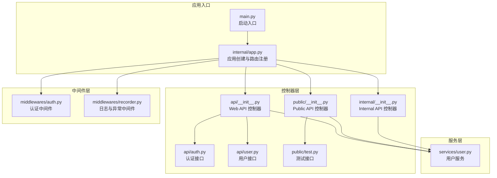
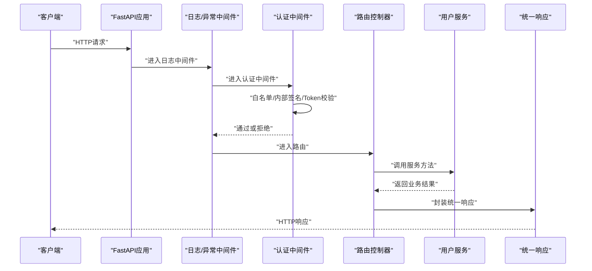
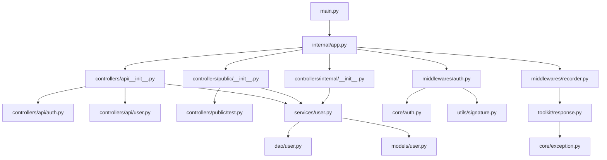

# API接口文档

<cite>
**本文档引用的文件**
- [main.py](file://main.py)
- [internal/app.py](file://internal/app.py)
- [internal/controllers/api/__init__.py](file://internal/controllers/api/__init__.py)
- [internal/controllers/api/auth.py](file://internal/controllers/api/auth.py)
- [internal/controllers/api/user.py](file://internal/controllers/api/user.py)
- [internal/controllers/public/__init__.py](file://internal/controllers/public/__init__.py)
- [internal/controllers/public/test.py](file://internal/controllers/public/test.py)
- [internal/controllers/internal/__init__.py](file://internal/controllers/internal/__init__.py)
- [internal/middlewares/auth.py](file://internal/middlewares/auth.py)
- [internal/middlewares/recorder.py](file://internal/middlewares/recorder.py)
- [internal/core/exception.py](file://internal/core/exception.py)
- [internal/core/auth.py](file://internal/core/auth.py)
- [internal/services/user.py](file://internal/services/user.py)
- [internal/utils/signature.py](file://internal/utils/signature.py)
- [pkg/toolkit/response.py](file://pkg/toolkit/response.py)
</cite>

## 更新摘要
**所做更改**
- 更新路由架构以反映从web→api, internalapi→internal, serviceapi→public的完全重组
- 新增版本化路由结构，引入/v1、/v1/internal、/v1/public前缀
- 重构API分层结构，明确Web API、Internal API、Public API的职责边界
- 更新认证中间件以支持新的路由前缀和认证策略

## 目录
1. [简介](#简介)
2. [项目结构](#项目结构)
3. [核心组件](#核心组件)
4. [架构总览](#架构总览)
5. [详细组件分析](#详细组件分析)
6. [依赖关系分析](#依赖关系分析)
7. [性能考虑](#性能考虑)
8. [故障排除指南](#故障排除指南)
9. [结论](#结论)
10. [附录](#附录)

## 简介
本文件为该FastAPI后端项目的API接口规范文档，涵盖Web API、Service API、Internal API与Public API四类接口的完整规范。文档包含：
- RESTful端点的HTTP方法、URL模式、请求/响应结构与认证方式
- 参数说明、返回值结构、错误处理策略
- 具体请求/响应示例与代码片段路径
- 不同API层级的安全考虑与访问控制
- API版本管理、速率限制与性能优化建议
- 客户端实现指导与最佳实践

## 项目结构
该项目采用模块化分层设计，API控制器按功能域划分：
- Web API：面向前端或外部用户的接口，位于api目录，前缀为/v1
- Service API：服务间调用接口，位于serviceapi目录，前缀为/v1
- Internal API：内部服务间调用接口，位于internal目录，前缀为/v1/internal
- Public API：公开测试与示例接口，位于public目录，前缀为/v1/public

```mermaid
graph TB
subgraph "应用入口"
MAIN["main.py<br/>启动入口"]
APP["internal/app.py<br/>应用创建与路由注册"]
end
subgraph "控制器层"
API["api/__init__.py<br/>Web API 控制器"]
AUTH["api/auth.py<br/>认证接口"]
USER["api/user.py<br/>用户接口"]
PUBLIC["public/__init__.py<br/>Public API 控制器"]
TEST["public/test.py<br/>测试接口"]
INTERNAL["internal/__init__.py<br/>Internal API 控制器"]
end
subgraph "中间件层"
AUTH_MW["middlewares/auth.py<br/>认证中间件"]
RECORDER["middlewares/recorder.py<br/>日志与异常中间件"]
end
subgraph "服务层"
SVC_USER["services/user.py<br/>用户服务"]
end
MAIN --> APP
APP --> API
APP --> PUBLIC
APP --> INTERNAL
API --> AUTH
API --> USER
PUBLIC --> TEST
API --> SVC_USER
PUBLIC --> SVC_USER
INTERNAL --> SVC_USER
APP --> AUTH_MW
APP --> RECORDER
```

**图表来源**
- [main.py](file://main.py#L1-L4)
- [internal/app.py](file://internal/app.py#L31-L40)
- [internal/controllers/api/__init__.py](file://internal/controllers/api/__init__.py#L1-L13)
- [internal/controllers/api/auth.py](file://internal/controllers/api/auth.py#L24)
- [internal/controllers/api/user.py](file://internal/controllers/api/user.py#L8)
- [internal/controllers/public/__init__.py](file://internal/controllers/public/__init__.py#L1-L10)
- [internal/controllers/public/test.py](file://internal/controllers/public/test.py#L12)
- [internal/controllers/internal/__init__.py](file://internal/controllers/internal/__init__.py#L3)

**章节来源**
- [main.py](file://main.py#L1-L4)
- [internal/app.py](file://internal/app.py#L31-L40)

## 核心组件
- 应用创建与生命周期管理：负责初始化日志、数据库、Redis、签名认证、雪花ID生成器等，并注册路由、异常处理与中间件。
- 中间件体系：
  - 认证中间件：处理白名单放行、内部接口签名认证、Token认证与用户上下文设置。
  - 日志与异常中间件：统一记录访问日志、响应耗时与追踪ID；捕获业务异常与系统异常并返回标准化错误响应。
- 统一响应与错误模型：定义统一响应体结构、成功/错误响应工厂与错误码集合。
- 配置系统：集中管理环境变量、数据库与Redis连接、JWT与AES密钥等。

**章节来源**
- [internal/app.py](file://internal/app.py#L50-L76)
- [internal/middlewares/auth.py](file://internal/middlewares/auth.py#L85-L148)
- [internal/middlewares/recorder.py](file://internal/middlewares/recorder.py#L68-L148)
- [pkg/toolkit/response.py](file://pkg/toolkit/response.py#L14-L236)
- [internal/core/exception.py](file://internal/core/exception.py#L1-L38)

## 架构总览
下图展示请求从客户端到服务层的完整流转，包括认证、日志、服务调用与响应返回。

```mermaid
sequenceDiagram
participant Client as "客户端"
participant App as "FastAPI应用"
participant RecorderMW as "日志/异常中间件"
participant AuthMW as "认证中间件"
participant Router as "路由控制器"
participant Svc as "用户服务"
participant Resp as "统一响应"
Client->>App : "HTTP请求"
App->>RecorderMW : "进入日志中间件"
RecorderMW->>AuthMW : "进入认证中间件"
AuthMW->>AuthMW : "白名单/内部签名/Token校验"
AuthMW-->>RecorderMW : "通过或拒绝"
RecorderMW->>Router : "进入路由"
Router->>Svc : "调用服务方法"
Svc-->>Router : "返回业务结果"
Router->>Resp : "封装统一响应"
Resp-->>Client : "HTTP响应"
```

**图表来源**
- [internal/app.py](file://internal/app.py#L50-L76)
- [internal/middlewares/auth.py](file://internal/middlewares/auth.py#L85-L148)
- [internal/middlewares/recorder.py](file://internal/middlewares/recorder.py#L105-L148)
- [internal/controllers/api/user.py](file://internal/controllers/api/user.py#L13-L16)
- [internal/services/user.py](file://internal/services/user.py#L13-L15)
- [pkg/toolkit/response.py](file://pkg/toolkit/response.py#L184-L188)

## 详细组件分析

### Web API（/v1 用户）
- 路由前缀：/v1
- 标签：api user
- 端点
  - GET /v1/user/hello-world
    - 功能：返回"Hello World"
    - 认证：受Token认证保护（非白名单）
    - 请求参数：无
    - 返回：统一响应体（code=20000）
    - 示例请求/响应
      - 请求：GET /v1/user/hello-world（需携带有效Token）
      - 响应：{"code": 20000, "message": "", "data": null}
- 依赖注入：UserService通过依赖注入函数new_user_service提供

**章节来源**
- [internal/controllers/api/user.py](file://internal/controllers/api/user.py#L1-L17)
- [internal/services/user.py](file://internal/services/user.py#L13-L15)
- [pkg/toolkit/response.py](file://pkg/toolkit/response.py#L184-L188)

### Web API 认证接口（/v1/auth）
- 路由前缀：/v1/auth
- 标签：authentication
- 端点
  - POST /v1/auth/login
    - 功能：用户登录，返回用户信息和token
    - 认证：白名单路径（无需Token）
    - 请求参数：用户名、密码
    - 返回：统一响应体（包含用户详情和token）
    - 示例请求/响应
      - 请求：POST /v1/auth/login
      - 响应：{"code": 20000, "message": "", "data": {"user": {...}, "token": "tk_xxxxxxxxx"}}
  - POST /v1/auth/logout
    - 功能：用户登出，使token失效
    - 认证：受Token认证保护
    - 请求参数：Authorization头
    - 返回：统一响应体（message: "登出成功"）
  - POST /v1/auth/register
    - 功能：用户注册，自动登录并返回token
    - 认证：白名单路径（无需Token）
    - 请求参数：用户名、手机号、密码
    - 返回：统一响应体（包含用户详情和token）
  - GET /v1/auth/me
    - 功能：获取当前用户信息
    - 认证：受Token认证保护
    - 请求参数：无
    - 返回：统一响应体（用户详情）
  - POST /v1/auth/wechat/login
    - 功能：微信登录
    - 认证：白名单路径（无需Token）
    - 请求参数：微信授权码
    - 返回：统一响应体（包含用户详情和token）

**章节来源**
- [internal/controllers/api/auth.py](file://internal/controllers/api/auth.py#L50-L299)
- [internal/services/user.py](file://internal/services/user.py#L41-L69)

### Internal API（/v1/internal）
- 路由前缀：/v1/internal
- 标签：internal
- 端点
  - GET /v1/internal/hello-world
    - 功能：返回"Hello World"
    - 认证：内部接口，需签名认证（X-Signature、X-Timestamp、X-Nonce）
    - 请求参数：无
    - 返回：统一响应体（code=20000）
    - 示例请求/响应
      - 请求：GET /v1/internal/hello-world（需携带签名头）
      - 响应：{"code": 20000, "message": "", "data": null}
- 注意：该端点不依赖Token认证，而是依赖签名认证

**章节来源**
- [internal/controllers/internal/__init__.py](file://internal/controllers/internal/__init__.py#L1-L9)
- [internal/middlewares/auth.py](file://internal/middlewares/auth.py#L116-L127)
- [pkg/toolkit/response.py](file://pkg/toolkit/response.py#L184-L188)

### Public API（/v1/public 测试）
- 路由前缀：/v1/public/test
- 标签：public test
- 端点
  - POST /v1/public/test/test_validation_error
    - 功能：测试请求验证异常
    - 认证：白名单路径（无需Token）
    - 请求参数：name（2-20字符）、age（0-150）、email（邮箱格式）
    - 返回：统一成功响应
  - GET /v1/public/test/test_raise_exception
    - 功能：主动抛出普通异常
    - 认证：白名单路径（无需Token）
    - 返回：统一错误响应（默认内部错误）
  - GET /v1/public/test/test_raise_app_exception
    - 功能：主动抛出业务异常（AppException）
    - 认证：白名单路径（无需Token）
    - 返回：统一错误响应（根据错误码与消息定制）
  - GET /v1/public/test/test_contextvars_on_asyncio_task
    - 功能：在异步任务中使用上下文变量
    - 认证：白名单路径（无需Token）
    - 返回：统一成功响应
  - GET /v1/public/test/test/sse-stream
    - 功能：Server-Sent Events流式输出
    - 认证：白名单路径（无需Token）
    - 返回：text/event-stream，分块返回数据
  - GET /v1/public/test/chat/sse-stream/timeout
    - 功能：带超时控制的SSE流
    - 认证：白名单路径（无需Token）
    - 返回：text/event-stream，按块超时控制
- 示例请求/响应
  - 请求：GET /v1/public/test/test_raise_exception
  - 响应：{"code": 50000, "message": "服务器内部错误", "data": null}

**章节来源**
- [internal/controllers/public/test.py](file://internal/controllers/public/test.py#L25-L113)
- [internal/middlewares/recorder.py](file://internal/middlewares/recorder.py#L139-L148)
- [pkg/toolkit/response.py](file://pkg/toolkit/response.py#L198-L202)

### 统一响应与错误模型
- 响应结构
  - 字段：code（业务状态码）、message（提示信息）、data（业务数据）
  - 成功：code=20000，message为空或简要描述，data为实际数据
  - 错误：code为错误码，message为错误描述
- 错误码
  - 客户端错误：40000~49999（如请求参数错误、未授权、签名无效、权限不足、资源不存在、请求载荷过大、无法处理的实体）
  - 服务端错误：50000~59999（如服务器内部错误）
- 响应工厂
  - success_response：成功响应
  - success_list_response：分页列表响应
  - error_response：错误响应

**章节来源**
- [pkg/toolkit/response.py](file://pkg/toolkit/response.py#L14-L236)
- [internal/core/exception.py](file://internal/core/exception.py#L19-L38)

### 认证与安全
- 认证中间件行为
  - 白名单路径：无需认证（如文档、开放接口等）
  - 内部接口：必须提供签名头（X-Signature、X-Timestamp、X-Nonce），由签名认证处理器校验
  - 外部接口：必须提供Token，Token经缓存校验并通过后设置用户上下文
- Token校验
  - 从缓存获取用户元数据与Token列表，校验通过后设置用户ID上下文
- 签名认证
  - 使用JWT密钥初始化签名处理器，校验签名头有效性
- 安全建议
  - 内部接口严格使用签名认证
  - 外部接口严格使用Token认证
  - 所有接口均应启用CORS配置（生产环境建议限定来源）

**章节来源**
- [internal/middlewares/auth.py](file://internal/middlewares/auth.py#L13-L44)
- [internal/middlewares/auth.py](file://internal/middlewares/auth.py#L85-L148)
- [internal/core/auth.py](file://internal/core/auth.py#L5-L23)
- [internal/utils/signature.py](file://internal/utils/signature.py#L9-L27)

### 日志与异常处理
- 日志中间件
  - 记录请求与响应日志，注入X-Process-Time与X-Trace-ID
  - 在异常发生时区分业务异常与系统异常，统一返回错误响应
- 异常处理
  - RequestValidationError：统一返回请求参数错误
  - AppException：按错误码返回业务错误
  - 其他异常：返回服务器内部错误

**章节来源**
- [internal/middlewares/recorder.py](file://internal/middlewares/recorder.py#L68-L148)
- [internal/app.py](file://internal/app.py#L43-L47)
- [internal/core/exception.py](file://internal/core/exception.py#L4-L17)

### 服务层与DAO
- 用户服务
  - hello_world：静态方法，返回"Hello World"
  - get_user_by_phone：通过DAO按手机号查询用户
  - get_user_by_username：通过DAO按用户名查询用户
  - verify_password：验证用户密码
  - create_user：创建新用户（带密码加密）
  - get_or_create_user_by_third_party：根据第三方用户信息获取或创建用户
- DAO与模型
  - UserDao：数据访问对象
  - User：用户模型

**章节来源**
- [internal/services/user.py](file://internal/services/user.py#L8-L186)

## 依赖关系分析

```mermaid
graph TB
MAIN["main.py"] --> APP["internal/app.py"]
APP --> API["controllers/api/__init__.py"]
APP --> PUBLIC["controllers/public/__init__.py"]
APP --> INTERNAL["controllers/internal/__init__.py"]
API --> AUTH["controllers/api/auth.py"]
API --> USER["controllers/api/user.py"]
PUBLIC --> TEST["controllers/public/test.py"]
API --> SVC_USER["services/user.py"]
PUBLIC --> SVC_USER
INTERNAL --> SVC_USER
APP --> AUTH_MW["middlewares/auth.py"]
APP --> RECORDER["middlewares/recorder.py"]
SVC_USER --> DAO_USER["dao/user.py"]
SVC_USER --> MODEL_USER["models/user.py"]
AUTH_MW --> CORE_AUTH["core/auth.py"]
AUTH_MW --> SIG_UTIL["utils/signature.py"]
RECORDER --> RESP["toolkit/response.py"]
RESP --> ERR["core/exception.py"]
```

**图表来源**
- [main.py](file://main.py#L1-L4)
- [internal/app.py](file://internal/app.py#L31-L40)
- [internal/controllers/api/__init__.py](file://internal/controllers/api/__init__.py#L1-L13)
- [internal/controllers/public/__init__.py](file://internal/controllers/public/__init__.py#L1-L10)
- [internal/controllers/internal/__init__.py](file://internal/controllers/internal/__init__.py#L1-L9)
- [internal/controllers/api/auth.py](file://internal/controllers/api/auth.py#L1-L299)
- [internal/controllers/api/user.py](file://internal/controllers/api/user.py#L1-L17)
- [internal/controllers/public/test.py](file://internal/controllers/public/test.py#L1-L113)
- [internal/middlewares/auth.py](file://internal/middlewares/auth.py#L1-L148)
- [internal/middlewares/recorder.py](file://internal/middlewares/recorder.py#L1-L148)
- [internal/services/user.py](file://internal/services/user.py#L1-L186)
- [internal/core/auth.py](file://internal/core/auth.py#L1-L24)
- [internal/utils/signature.py](file://internal/utils/signature.py#L1-L27)
- [pkg/toolkit/response.py](file://pkg/toolkit/response.py#L1-L236)
- [internal/core/exception.py](file://internal/core/exception.py#L1-L38)

## 性能考虑
- 压缩传输
  - 启用GZip中间件，减少响应体积，提升传输效率
- 序列化性能
  - 使用高性能ORJSON响应类，避免重复编码
- 并发与异步
  - 使用异步任务管理器处理后台任务，保持请求快速返回
- 日志与追踪
  - 注入X-Process-Time与X-Trace-ID，便于性能分析与问题定位
- 建议
  - 生产环境开启限流与熔断
  - 对热点接口增加缓存
  - 使用连接池优化数据库与Redis访问

**章节来源**
- [internal/app.py](file://internal/app.py#L50-L76)
- [pkg/toolkit/response.py](file://pkg/toolkit/response.py#L62-L81)
- [internal/middlewares/recorder.py](file://internal/middlewares/recorder.py#L56-L65)

## 故障排除指南
- 常见错误与处理
  - 未授权/缺少Token：检查Authorization头或签名头是否正确
  - 签名无效：确认X-Signature、X-Timestamp、X-Nonce是否齐全且未过期
  - 请求参数错误：检查请求体与参数格式
  - 服务器内部错误：查看日志追踪ID定位具体异常
- 排查步骤
  - 检查中间件日志与响应头（X-Process-Time、X-Trace-ID）
  - 确认认证中间件是否正确放行白名单路径
  - 核对配置文件与密钥是否正确加载
- 参考
  - 统一错误响应与错误码定义
  - 异常捕获与日志记录机制

**章节来源**
- [internal/middlewares/auth.py](file://internal/middlewares/auth.py#L116-L148)
- [internal/middlewares/recorder.py](file://internal/middlewares/recorder.py#L139-L148)
- [pkg/toolkit/response.py](file://pkg/toolkit/response.py#L198-L202)
- [internal/core/exception.py](file://internal/core/exception.py#L19-L38)

## 结论
本项目提供了清晰的API分层设计与完善的中间件体系，结合统一响应与错误模型，能够满足Web、Service、Internal与Public四类接口的安全与性能需求。路由架构重组后，通过/v1、/v1/internal、/v1/public的版本化结构，实现了更清晰的API层次划分和更严格的访问控制。建议在生产环境中进一步完善限流、缓存与监控策略，并持续优化签名与Token的生命周期管理。

## 附录

### API版本管理
- 版本前缀
  - Web API：/v1
  - Internal API：/v1/internal
  - Public API：/v1/public
- 建议
  - 以URL前缀区分版本，保持向后兼容
  - 对废弃版本提供迁移指引与过渡期

**章节来源**
- [internal/middlewares/auth.py](file://internal/middlewares/auth.py#L26-L29)

### 速率限制与配额
- 建议
  - 基于Token或IP维度实施限流
  - 对内部接口采用更严格的限流策略
  - 使用Redis实现分布式限流

### 客户端实现最佳实践
- 认证
  - 外部接口：在Authorization头中携带Token
  - 内部接口：按签名算法生成X-Signature、X-Timestamp、X-Nonce
- 响应处理
  - 解析统一响应体，优先检查code字段
  - 对SSE流进行断线重连与超时控制
- 性能
  - 启用HTTP/2与连接复用
  - 对大响应启用GZip解压
- 可观测性
  - 透传X-Trace-ID便于链路追踪
  - 记录请求与响应日志，保留关键指标