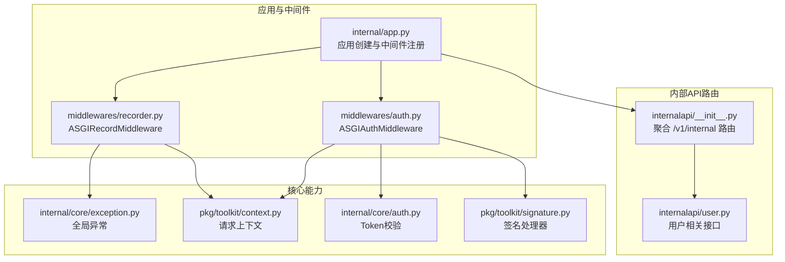
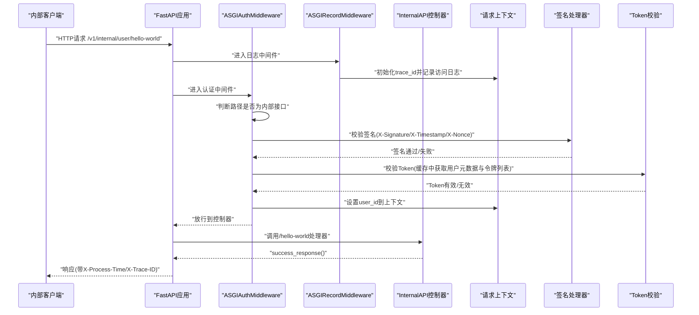
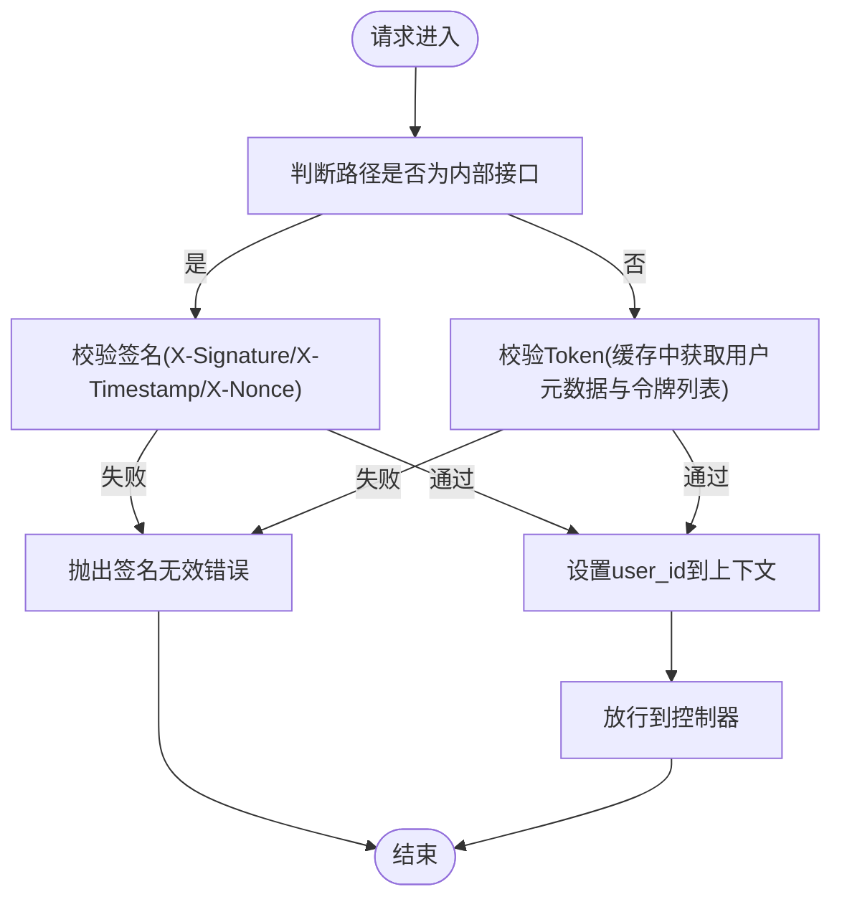
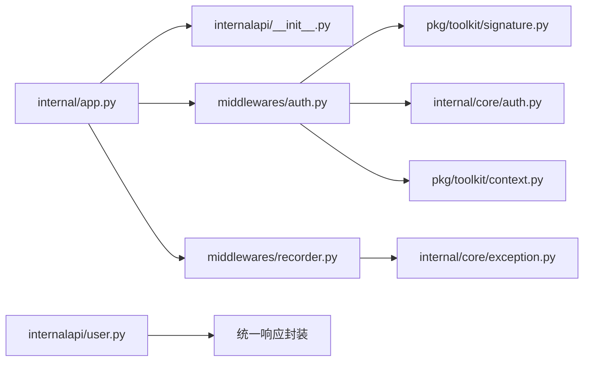

# Internal API接口

<cite>
**本文引用的文件**
- [internal/controllers/internalapi/__init__.py](file://internal/controllers/internalapi/__init__.py)
- [internal/controllers/internalapi/user.py](file://internal/controllers/internalapi/user.py)
- [internal/app.py](file://internal/app.py)
- [internal/middlewares/auth.py](file://internal/middlewares/auth.py)
- [internal/middlewares/recorder.py](file://internal/middlewares/recorder.py)
- [internal/core/auth.py](file://internal/core/auth.py)
- [internal/core/exception.py](file://internal/core/exception.py)
- [internal/dao/user.py](file://internal/dao/user.py)
- [internal/services/user.py](file://internal/services/user.py)
- [pkg/toolkit/context.py](file://pkg/toolkit/context.py)
- [pkg/toolkit/signature.py](file://pkg/toolkit/signature.py)
- [internal/config/load_config.py](file://internal/config/load_config.py)
- [configs/.env.dev](file://configs/.env.dev)
- [pyproject.toml](file://pyproject.toml)
</cite>

## 目录
1. [简介](#简介)
2. [项目结构](#项目结构)
3. [核心组件](#核心组件)
4. [架构总览](#架构总览)
5. [详细组件分析](#详细组件分析)
6. [依赖关系分析](#依赖关系分析)
7. [性能与监控](#性能与监控)
8. [故障排查指南](#故障排查指南)
9. [结论](#结论)
10. [附录](#附录)

## 简介
本文件为 Internal API 接口的权威技术文档，面向内部系统与开发者，描述在受信任网络内运行的内部接口规范与实现细节。Internal API 通过签名认证保障请求来源可信，结合统一异常与日志体系，提供可审计、可观测、可调试的运行基线。本文涵盖：
- 认证流程与权限验证机制
- 访问控制策略与安全边界
- 内部用户管理接口规范与调用示例
- 与 Web API 的差异与使用场景
- 监控、审计日志与性能指标配置
- 调试技巧与常见问题排查

## 项目结构
Internal API 所属模块位于 internal/controllers/internalapi，采用“路由聚合 + 中间件统一鉴权”的组织方式，配合全局中间件完成签名认证与访问日志记录。

图表来源
- [internal/controllers/internalapi/__init__.py](file://internal/controllers/internalapi/__init__.py#L1-L12)
- [internal/controllers/internalapi/user.py](file://internal/controllers/internalapi/user.py#L1-L11)
- [internal/app.py](file://internal/app.py#L33-L82)
- [internal/middlewares/auth.py](file://internal/middlewares/auth.py#L88-L149)
- [internal/middlewares/recorder.py](file://internal/middlewares/recorder.py#L66-L123)
- [pkg/toolkit/context.py](file://pkg/toolkit/context.py#L70-L107)
- [pkg/toolkit/signature.py](file://pkg/toolkit/signature.py#L9-L95)
- [internal/core/auth.py](file://internal/core/auth.py#L5-L19)
- [internal/core/exception.py](file://internal/core/exception.py#L19-L38)

章节来源
- [internal/controllers/internalapi/__init__.py](file://internal/controllers/internalapi/__init__.py#L1-L12)
- [internal/controllers/internalapi/user.py](file://internal/controllers/internalapi/user.py#L1-L11)
- [internal/app.py](file://internal/app.py#L33-L82)

## 核心组件
- Internal API 路由聚合：统一挂载 /v1/internal 前缀，并包含用户相关子路由。
- ASGIAuthMiddleware：负责白名单放行、内部接口签名认证、Token认证与用户上下文注入。
- ASGIRecordMiddleware：统一记录访问日志、响应耗时与异常处理。
- 签名处理器：基于 HMAC 的签名生成与校验，支持时间戳容忍度，防止重放攻击。
- Token 校验：从缓存中读取用户元数据与令牌列表，进行有效性校验。
- 请求上下文：通过 contextvars 传递 trace_id、user_id 等请求级信息。
- 全局异常：统一业务异常与系统异常的错误码与消息封装。

章节来源
- [internal/middlewares/auth.py](file://internal/middlewares/auth.py#L88-L149)
- [internal/middlewares/recorder.py](file://internal/middlewares/recorder.py#L66-L123)
- [pkg/toolkit/signature.py](file://pkg/toolkit/signature.py#L9-L95)
- [internal/core/auth.py](file://internal/core/auth.py#L5-L19)
- [pkg/toolkit/context.py](file://pkg/toolkit/context.py#L70-L107)
- [internal/core/exception.py](file://internal/core/exception.py#L19-L38)

## 架构总览
Internal API 的调用链路如下：客户端发起请求 → 应用中间件层进行认证与日志 → 控制器处理业务 → 返回统一响应。

图表来源
- [internal/app.py](file://internal/app.py#L55-L82)
- [internal/middlewares/auth.py](file://internal/middlewares/auth.py#L119-L149)
- [internal/middlewares/recorder.py](file://internal/middlewares/recorder.py#L70-L103)
- [internal/controllers/internalapi/user.py](file://internal/controllers/internalapi/user.py#L8-L11)
- [pkg/toolkit/signature.py](file://pkg/toolkit/signature.py#L77-L95)
- [internal/core/auth.py](file://internal/core/auth.py#L5-L19)
- [pkg/toolkit/context.py](file://pkg/toolkit/context.py#L78-L86)

## 详细组件分析

### Internal API 路由与控制器
- 路由前缀：/v1/internal
- 用户接口示例：GET /v1/internal/user/hello-world
- 控制器返回统一成功响应，便于内部系统快速集成与联调。

章节来源
- [internal/controllers/internalapi/__init__.py](file://internal/controllers/internalapi/__init__.py#L4-L12)
- [internal/controllers/internalapi/user.py](file://internal/controllers/internalapi/user.py#L8-L11)

### 认证与访问控制
- 白名单路径：公共接口与文档路径无需认证，便于内部系统自检与联调。
- 内部接口签名认证：要求携带 X-Signature、X-Timestamp、X-Nonce，使用签名处理器进行校验。
- Token 认证：当路径不属于内部接口时，走 Token 校验；Internal API 路径不接受 Bearer Token。
- 用户上下文：Token 校验通过后，将 user_id 注入请求上下文，供后续业务使用。

图表来源
- [internal/middlewares/auth.py](file://internal/middlewares/auth.py#L119-L149)
- [internal/core/auth.py](file://internal/core/auth.py#L5-L19)
- [pkg/toolkit/signature.py](file://pkg/toolkit/signature.py#L77-L95)

章节来源
- [internal/middlewares/auth.py](file://internal/middlewares/auth.py#L13-L46)
- [internal/middlewares/auth.py](file://internal/middlewares/auth.py#L119-L149)
- [internal/core/auth.py](file://internal/core/auth.py#L5-L19)

### 日志与审计
- 访问日志：记录客户端IP、方法、路径、查询参数等。
- 响应日志：记录处理耗时（毫秒级）。
- 异常处理：区分业务异常与系统异常，统一输出标准错误响应。
- 追踪ID：X-Trace-ID 注入响应头，便于跨服务串联定位问题。

章节来源
- [internal/middlewares/recorder.py](file://internal/middlewares/recorder.py#L15-L42)
- [internal/middlewares/recorder.py](file://internal/middlewares/recorder.py#L91-L123)

### 请求上下文与用户标识
- 上下文初始化：中间件在请求开始时初始化上下文并注入 trace_id。
- 用户标识：Token 校验通过后设置 user_id，后续业务可直接读取。
- 安全约束：若未初始化上下文或未设置 user_id，读取时会抛出异常，避免误用。

章节来源
- [pkg/toolkit/context.py](file://pkg/toolkit/context.py#L70-L107)
- [internal/middlewares/auth.py](file://internal/middlewares/auth.py#L144-L147)

### 签名认证机制
- 签名生成：对键值对进行排序拼接后，使用 HMAC 与指定哈希算法生成摘要。
- 时间戳校验：允许一定容忍范围内的时钟偏差，防止重放。
- 校验入口：统一 verify(x_signature, x_timestamp, x_nonce)，返回布尔结果。

章节来源
- [pkg/toolkit/signature.py](file://pkg/toolkit/signature.py#L9-L95)

### Token 校验流程
- 缓存读取：从缓存获取用户元数据与令牌列表。
- 有效性检查：确认用户ID存在且令牌在列表中。
- 结果返回：返回用户元数据与校验状态，供中间件设置上下文。

章节来源
- [internal/core/auth.py](file://internal/core/auth.py#L5-L19)

### 数据访问与服务层
- DAO 层：基于通用 BaseDao 封装查询，如按手机号查询用户。
- Service 层：提供业务方法，如 hello_world，以及按手机号获取用户。
- 依赖注入：通过工厂函数创建 Service 实例，便于测试与替换。

章节来源
- [internal/dao/user.py](file://internal/dao/user.py#L6-L24)
- [internal/services/user.py](file://internal/services/user.py#L5-L21)

## 依赖关系分析
- 应用启动：注册路由、异常处理与中间件，初始化日志、数据库、Redis、签名处理器与任务管理器。
- 中间件耦合：认证中间件依赖签名处理器与 Token 校验；日志中间件依赖上下文与异常模块。
- 控制器依赖：控制器依赖统一响应封装与上下文读取。

图表来源
- [internal/app.py](file://internal/app.py#L33-L82)
- [internal/controllers/internalapi/__init__.py](file://internal/controllers/internalapi/__init__.py#L4-L12)
- [internal/middlewares/auth.py](file://internal/middlewares/auth.py#L88-L149)
- [internal/middlewares/recorder.py](file://internal/middlewares/recorder.py#L66-L123)
- [pkg/toolkit/signature.py](file://pkg/toolkit/signature.py#L9-L95)
- [internal/core/auth.py](file://internal/core/auth.py#L5-L19)
- [pkg/toolkit/context.py](file://pkg/toolkit/context.py#L70-L107)
- [internal/core/exception.py](file://internal/core/exception.py#L19-L38)
- [internal/controllers/internalapi/user.py](file://internal/controllers/internalapi/user.py#L3)

章节来源
- [internal/app.py](file://internal/app.py#L33-L82)

## 性能与监控
- 响应耗时：日志中间件在响应头注入 X-Process-Time，便于前端或上游系统统计延迟。
- 压缩传输：启用 GZip 中间件，降低带宽占用。
- 并发与事件循环：项目依赖高性能事件循环与异步运行时，适合高并发内部调用。
- 配置项：可通过环境变量调整数据库、Redis、CORS 等参数，满足不同环境需求。

章节来源
- [internal/middlewares/recorder.py](file://internal/middlewares/recorder.py#L54-L63)
- [internal/app.py](file://internal/app.py#L55-L82)
- [configs/.env.dev](file://configs/.env.dev#L1-L20)
- [pyproject.toml](file://pyproject.toml#L9-L70)

## 故障排查指南
- 签名失败
  - 检查请求头是否包含 X-Signature、X-Timestamp、X-Nonce。
  - 确认时间戳在容忍范围内，随机串唯一且未被重放。
  - 核对签名算法与密钥配置一致。
- Token 失败
  - 确认 Token 存在于用户令牌列表中。
  - 检查缓存可用性与用户元数据完整性。
- 未授权/无用户上下文
  - 确保请求路径属于内部接口或已正确携带 Token。
  - 检查中间件是否正确设置 user_id。
- 异常与日志
  - 业务异常与系统异常分别记录到 warning 与 error 级别。
  - 通过 X-Trace-ID 在日志中检索完整调用链。

章节来源
- [internal/middlewares/auth.py](file://internal/middlewares/auth.py#L119-L149)
- [internal/middlewares/recorder.py](file://internal/middlewares/recorder.py#L104-L123)
- [internal/core/exception.py](file://internal/core/exception.py#L19-L38)

## 结论
Internal API 通过“签名认证 + Token校验 + 统一日志”的组合，在受信任网络内提供了高可靠、可审计、易调试的内部接口能力。其清晰的路由组织、中间件分层与上下文管理，使得内部系统能够以最小成本接入并稳定运行。

## 附录

### Internal API 与 Web API 的区别与使用场景
- Internal API
  - 适用场景：内部系统间通信、后台任务调度、运维与监控系统对接。
  - 安全边界：仅在受信任网络内暴露，使用签名认证与白名单放行。
  - 认证方式：主要依赖签名认证，必要时可叠加 Token 校验。
- Web API
  - 适用场景：面向外部用户的公开接口。
  - 安全边界：需更强的防护与合规要求，通常采用 Token/JWT、限流与 WAF。
  - 认证方式：以 Token/JWT 为主，辅以多因子与风控策略。

[本节为概念性说明，不涉及具体源码分析]

### 接口调用示例与集成模式
- 调用模式
  - 内部系统通过 /v1/internal 前缀访问接口。
  - 内部接口请求需携带签名头：X-Signature、X-Timestamp、X-Nonce。
  - 响应头包含 X-Process-Time 与 X-Trace-ID，便于性能与追踪分析。
- 集成要点
  - 在内部系统侧实现签名生成逻辑，确保时间戳与随机串符合要求。
  - 使用统一的 HTTP 客户端封装，自动注入签名头与追踪ID。
  - 建立日志采集与告警，关注异常级别与处理耗时。

[本节为概念性说明，不涉及具体源码分析]

### 配置说明
- 环境变量
  - APP_ENV：决定加载的配置文件与密钥。
  - DB_* / REDIS_*：数据库与缓存连接参数。
  - JWT_*：JWT 相关配置（与 Internal API 主要使用签名不同）。
- 配置加载
  - 通过 .secrets 与 .env.{env} 文件加载，支持敏感字段 AES 解密。
  - 启动时打印配置详情（可选），便于排障与审计。

章节来源
- [internal/config/load_config.py](file://internal/config/load_config.py#L179-L243)
- [configs/.env.dev](file://configs/.env.dev#L1-L20)