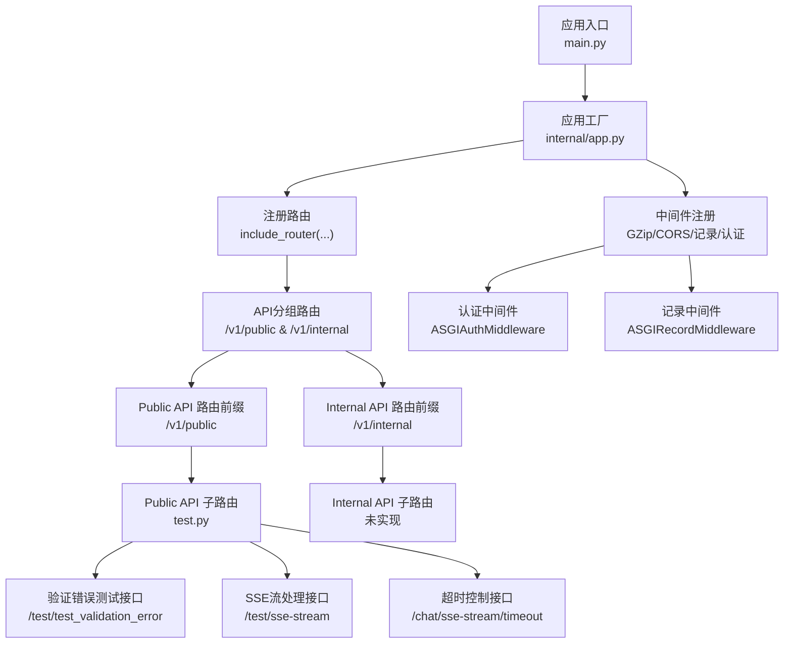
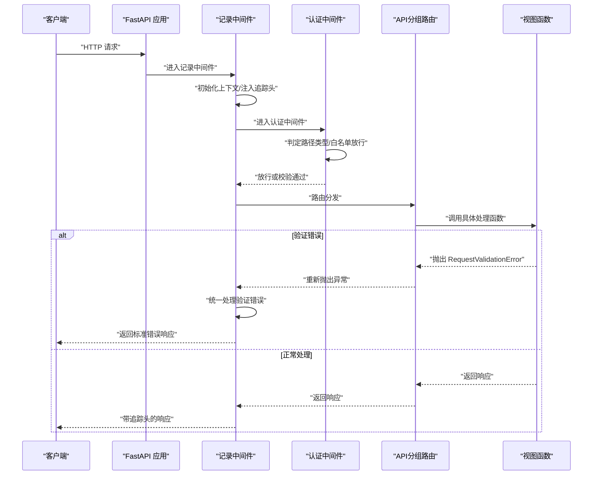
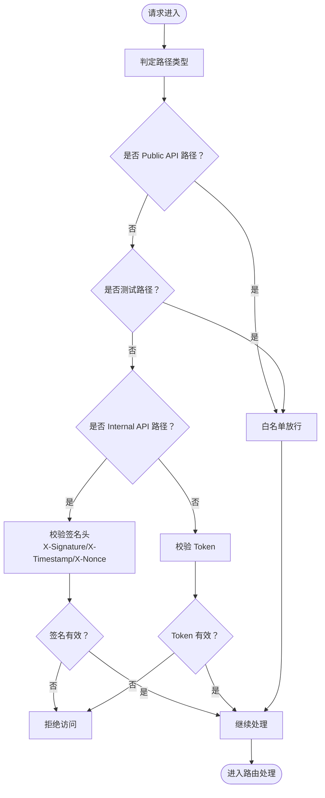
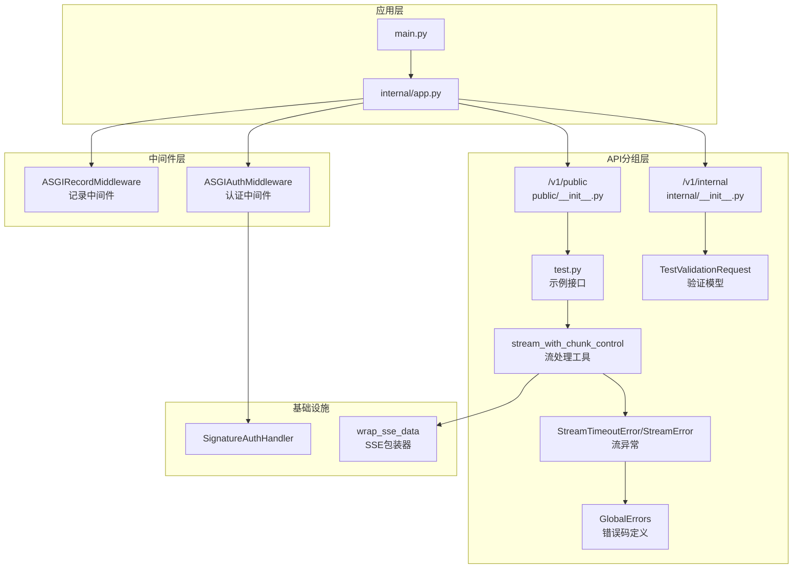

# Public API接口

<cite>
**本文档引用的文件**
- [internal/controllers/public/__init__.py](file://internal/controllers/public/__init__.py)
- [internal/controllers/public/test.py](file://internal/controllers/public/test.py)
- [internal/controllers/internal/__init__.py](file://internal/controllers/internal/__init__.py)
- [internal/controllers/api/__init__.py](file://internal/controllers/api/__init__.py)
- [internal/middlewares/auth.py](file://internal/middlewares/auth.py)
- [internal/middlewares/recorder.py](file://internal/middlewares/recorder.py)
- [internal/app.py](file://internal/app.py)
- [main.py](file://main.py)
- [internal/core/exception.py](file://internal/core/exception.py)
- [pkg/toolkit/response.py](file://pkg/toolkit/response.py)
- [internal/utils/signature.py](file://internal/utils/signature.py)
- [pkg/toolkit/signature.py](file://pkg/toolkit/signature.py)
- [internal/core/auth.py](file://internal/core/auth.py)
- [internal/utils/stream.py](file://internal/utils/stream.py)
- [pkg/decorators/__init__.py](file://pkg/decorators/__init__.py)
- [internal/core/errors.py](file://internal/core/errors.py)
</cite>

## 更新摘要
**变更内容**
- 更新流处理实现：修正了导入路径，从 pkg.decorators.stream_with_chunk_control 更新为 internal.utils.stream.stream_with_chunk_control
- 新增/v1/public和/v1/internal API分组的详细说明
- 新增测试路径白名单的配置说明
- 完善API路由结构和认证策略的文档描述
- 更新中间件白名单路径的实现细节

## 目录
1. [简介](#简介)
2. [项目结构](#项目结构)
3. [核心组件](#核心组件)
4. [架构总览](#架构总览)
5. [详细组件分析](#详细组件分析)
6. [依赖关系分析](#依赖关系分析)
7. [性能考量](#性能考量)
8. [故障排查指南](#故障排查指南)
9. [结论](#结论)
10. [附录](#附录)

## 简介
本文件面向第三方开发者，系统性梳理并说明 Public API（公开接口）的设计原则、安全机制、稳定性保障与可维护性策略。Public API 采用统一的路由前缀与认证策略，结合中间件链路实现请求拦截、日志记录、异常处理与响应标准化。本文档同时给出接口规范、使用示例、SDK集成建议、版本管理与废弃策略，以及API文档生成与在线测试的配置说明。

**更新** 新增/v1/public和/v1/internal API分组的详细说明，完善测试路径白名单的配置说明。更新流处理实现的导入路径，反映新的模块结构。

## 项目结构
Public API 的路由组织位于公共控制器模块中，通过统一的 APIRouter 注册到应用生命周期内。认证与日志中间件贯穿请求处理链路，确保安全性与可观测性。

```mermaid
graph TB
A["应用入口<br/>main.py"] --> B["应用工厂<br/>internal/app.py"]
B --> C["注册路由<br/>include_router(...)"]
C --> D["API分组路由<br/>/v1/public & /v1/internal"]
D --> E["Public API 路由前缀<br/>/v1/public"]
D --> F["Internal API 路由前缀<br/>/v1/internal"]
E --> G["Public API 子路由<br/>test.py"]
F --> H["Internal API 子路由<br/>未实现"]
G --> I["验证错误测试接口<br/>/test/test_validation_error"]
G --> J["SSE流处理接口<br/>/test/sse-stream"]
G --> K["超时控制接口<br/>/chat/sse-stream/timeout"]
B --> L["中间件注册<br/>GZip/CORS/记录/认证"]
L --> M["认证中间件<br/>ASGIAuthMiddleware"]
L --> N["记录中间件<br/>ASGIRecordMiddleware"]
```

**图表来源**
- [main.py](file://main.py#L1-L4)
- [internal/app.py](file://internal/app.py#L31-L41)
- [internal/controllers/public/__init__.py](file://internal/controllers/public/__init__.py#L5-L11)
- [internal/controllers/internal/__init__.py](file://internal/controllers/internal/__init__.py#L3)
- [internal/middlewares/auth.py](file://internal/middlewares/auth.py#L85-L148)
- [internal/middlewares/recorder.py](file://internal/middlewares/recorder.py#L70-L122)

**章节来源**
- [internal/controllers/public/__init__.py](file://internal/controllers/public/__init__.py#L1-L11)
- [internal/controllers/internal/__init__.py](file://internal/controllers/internal/__init__.py#L1-L9)
- [internal/app.py](file://internal/app.py#L31-L41)

## 核心组件
- API分组架构
  - Public API 路由前缀为 /v1/public，所有公开接口在此命名空间下注册
  - Internal API 路由前缀为 /v1/internal，所有内部接口在此命名空间下注册
- 认证与白名单
  - 认证中间件支持三类路径判定：白名单放行、内部接口签名校验、普通接口 Token 校验
  - Public API 路径属于白名单范畴，无需 Token 即可访问
  - **新增** 测试路径 /test 也属于白名单，便于联调和验证错误测试
  - 其他固定路径（如登录、OpenAPI）同样白名单放行
- 日志与追踪
  - 记录中间件自动注入 X-Process-Time 与 X-Trace-ID 响应头，便于问题定位与性能分析
- 异常与响应
  - 统一异常体系与响应体结构，确保错误信息与国际化文案一致
  - 验证错误通过 RequestValidationError 统一处理，返回标准错误响应
- 文档与调试
  - Debug 模式下启用 /docs 与 /redoc，在线交互式文档便于联调与测试

**章节来源**
- [internal/controllers/public/__init__.py](file://internal/controllers/public/__init__.py#L5-L11)
- [internal/controllers/internal/__init__.py](file://internal/controllers/internal/__init__.py#L3)
- [internal/middlewares/auth.py](file://internal/middlewares/auth.py#L26-L40)
- [internal/middlewares/recorder.py](file://internal/middlewares/recorder.py#L15-L42)
- [internal/app.py](file://internal/app.py#L17-L22)
- [pkg/toolkit/response.py](file://pkg/toolkit/response.py#L47-L81)
- [internal/core/exception.py](file://internal/core/exception.py#L19-L37)

## 架构总览
Public API 的请求处理链路如下：

```mermaid
sequenceDiagram
participant Client as "客户端"
participant App as "FastAPI 应用"
participant Recorder as "记录中间件"
participant Auth as "认证中间件"
participant Router as "API分组路由"
participant Handler as "视图函数"
Client->>App : "HTTP 请求"
App->>Recorder : "进入记录中间件"
Recorder->>Recorder : "初始化上下文/注入追踪头"
Recorder->>Auth : "进入认证中间件"
Auth->>Auth : "判定路径类型/白名单放行"
Auth-->>Recorder : "放行或校验通过"
Recorder->>Router : "路由分发"
Router->>Handler : "调用具体处理函数"
alt 验证错误
Handler-->>Router : "抛出 RequestValidationError"
Router-->>Recorder : "重新抛出异常"
Recorder->>Recorder : "统一处理验证错误"
Recorder-->>Client : "返回标准错误响应"
else 正常处理
Handler-->>Router : "返回响应"
Router-->>Recorder : "返回响应"
Recorder-->>Client : "带追踪头的响应"
end
```

**图表来源**
- [internal/app.py](file://internal/app.py#L50-L77)
- [internal/middlewares/recorder.py](file://internal/middlewares/recorder.py#L70-L102)
- [internal/middlewares/auth.py](file://internal/middlewares/auth.py#L89-L115)
- [internal/controllers/public/test.py](file://internal/controllers/public/test.py#L25-L36)

## 详细组件分析

### API分组架构
- Public API 分组
  - 路由前缀：/v1/public
  - 子路由注册：通过 include_router 将 test 子路由挂载到公共前缀下
  - 特点：清晰的版本化命名空间，便于后续演进与废弃策略实施
- Internal API 分组
  - 路由前缀：/v1/internal
  - 当前状态：包含基础路由器但未注册具体子路由
  - 设计目的：为内部服务间通信预留认证和签名机制

**章节来源**
- [internal/controllers/public/__init__.py](file://internal/controllers/public/__init__.py#L5-L11)
- [internal/controllers/internal/__init__.py](file://internal/controllers/internal/__init__.py#L3)

### 认证中间件（白名单与签名）
- 白名单路径判定
  - Public API 路径前缀 /v1/public 属于白名单，无需 Token 即可访问
  - **新增** 测试路径 /test 也属于白名单，便于联调和验证错误测试
  - 其他固定路径（如登录、OpenAPI）同样白名单放行
- 内部接口签名校验
  - 内部接口前缀 /v1/internal 需要签名头：X-Signature、X-Timestamp、X-Nonce
  - 使用 HMAC+密钥进行签名校验，支持时间戳容忍度，防止重放攻击
- Token 校验
  - 普通接口需携带 Authorization 或等效头，内部通过 verify_token 校验
  - 校验通过后将用户上下文写入全局上下文，便于审计与日志追踪

```mermaid
flowchart TD
Start(["请求进入"]) --> PathCheck["判定路径类型"]
PathCheck --> IsPublic{"是否 Public API 路径？"}
IsPublic --> |是| Whitelist["白名单放行"]
IsPublic --> |否| IsTest{"是否测试路径？"}
IsTest --> |是| Whitelist
IsTest --> |否| IsInternal{"是否 Internal API 路径？"}
IsInternal --> |是| VerifySig["校验签名头<br/>X-Signature/X-Timestamp/X-Nonce"]
VerifySig --> SigOK{"签名有效？"}
SigOK --> |否| Deny["拒绝访问"]
SigOK --> |是| Next["继续处理"]
IsInternal --> |否| VerifyToken["校验 Token"]
VerifyToken --> TokenOK{"Token 有效？"}
TokenOK --> |否| Deny
TokenOK --> |是| Next
Whitelist --> Next
Next --> End(["进入路由处理"])
```

**图表来源**
- [internal/middlewares/auth.py](file://internal/middlewares/auth.py#L55-L60)
- [internal/middlewares/auth.py](file://internal/middlewares/auth.py#L109-L111)
- [internal/middlewares/auth.py](file://internal/middlewares/auth.py#L129-L147)

**章节来源**
- [internal/middlewares/auth.py](file://internal/middlewares/auth.py#L14-L40)
- [internal/middlewares/auth.py](file://internal/middlewares/auth.py#L85-L148)
- [internal/utils/signature.py](file://internal/utils/signature.py#L9-L26)
- [pkg/toolkit/signature.py](file://pkg/toolkit/signature.py#L9-L26)
- [internal/core/auth.py](file://internal/core/auth.py#L4-L18)

### 记录中间件（日志与追踪）
- 上下文初始化
  - 以请求头中的 X-Trace-ID 作为追踪 ID，若无则生成新的 UUID v6 字符串
- 响应头注入
  - 注入 X-Process-Time（处理耗时）与 X-Trace-ID（追踪 ID）
- 异常处理
  - 区分业务异常与系统异常，分别记录 warning 与 error
  - 验证错误统一处理，返回标准错误响应
  - 若尚未开始响应，构造统一错误响应；若响应已开始，则记录严重告警

**章节来源**
- [internal/middlewares/recorder.py](file://internal/middlewares/recorder.py#L15-L42)
- [internal/middlewares/recorder.py](file://internal/middlewares/recorder.py#L66-L122)

### 异常与响应标准化
- 统一异常
  - AppException 支持任意错误码与消息，配合 GlobalErrors 提供中英文文案
- 统一响应体
  - _ResponseBody 结构包含 code、message、data
  - CustomORJSONResponse 基于 orjson 高性能序列化，确保一致性
- 错误响应工厂
  - error_response/error 支持多语言文案拼接与错误码映射
- 验证错误处理
  - RequestValidationError 通过中间件统一捕获和处理
  - 返回标准错误响应，包含详细的验证错误信息

**章节来源**
- [internal/core/exception.py](file://internal/core/exception.py#L4-L37)
- [pkg/toolkit/response.py](file://pkg/toolkit/response.py#L47-L81)
- [pkg/toolkit/response.py](file://pkg/toolkit/response.py#L88-L170)
- [pkg/toolkit/response.py](file://pkg/toolkit/response.py#L195-L200)

### Public API 示例接口
- **新增** 验证错误测试
  - POST /v1/public/test/test_validation_error：测试请求验证异常，使用Pydantic模型进行参数验证
  - 支持的验证规则：name长度2-20字符、age范围0-150、email格式验证
- 测试异常
  - GET /v1/public/test/test_raise_exception：触发系统异常，由中间件捕获并返回统一错误响应
  - GET /v1/public/test/test_raise_app_exception：触发业务异常，返回统一错误响应
- 上下文与任务
  - GET /v1/public/test/test_contextvars_on_asyncio_task：在异步任务中传递 trace_id 上下文
- 事件流（SSE）
  - GET /v1/public/test/test/sse-stream：逐步返回文本片段，演示 SSE 基本用法
  - GET /v1/public/chat/sse-stream/timeout：按块超时控制的 SSE 流，结合装饰器 stream_with_chunk_control

**更新** 流处理实现已迁移到 internal.utils.stream 模块，导入路径从 pkg.decorators.stream_with_chunk_control 更新为 internal.utils.stream.stream_with_chunk_control

**章节来源**
- [internal/controllers/public/test.py](file://internal/controllers/public/test.py#L25-L36)
- [internal/controllers/public/test.py](file://internal/controllers/public/test.py#L38-L48)
- [internal/controllers/public/test.py](file://internal/controllers/public/test.py#L56-L60)
- [internal/controllers/public/test.py](file://internal/controllers/public/test.py#L70-L99)
- [internal/controllers/public/test.py](file://internal/controllers/public/test.py#L107-L113)

### 流处理实现详解
- **更新** 导入路径变更
  - 从 pkg.decorators.stream_with_chunk_control 更新为 internal.utils.stream.stream_with_chunk_control
  - 流处理工具模块位于 internal/utils/stream.py，提供 SSE 流超时控制功能
- 超时控制机制
  - 基于 AnyIO 的单 Chunk 超时控制，支持总超时由 Middleware 统一控制
  - chunk_timeout 参数控制单个 chunk 的等待时间
  - is_sse 参数决定错误处理方式：SSE 模式自动处理错误响应，非 SSE 模式抛出异常
- 错误处理策略
  - TimeoutError：当 chunk 生成超时时，SSE 模式返回错误数据并记录日志，非 SSE 模式抛出 StreamTimeoutError
  - Exception：流处理异常时，SSE 模式返回错误数据并记录日志，非 SSE 模式抛出 StreamError
  - CancelledError：Middleware 触发的总超时取消或客户端断连，直接向上抛出

**章节来源**
- [internal/controllers/public/test.py](file://internal/controllers/public/test.py#L8-L8)
- [internal/controllers/public/test.py](file://internal/controllers/public/test.py#L109-L111)
- [internal/utils/stream.py](file://internal/utils/stream.py#L16-L99)
- [internal/core/errors.py](file://internal/core/errors.py#L36-L58)

### 验证错误测试能力
- **新增** Pydantic模型验证
  - TestValidationRequest 模型定义了严格的参数验证规则
  - 支持字符串长度、数值范围、正则表达式等多种验证方式
- **新增** 统一错误处理
  - 验证失败时抛出 RequestValidationError
  - 中间件捕获并转换为标准错误响应
  - 返回详细的错误信息，便于前端处理和用户反馈

**章节来源**
- [internal/controllers/public/test.py](file://internal/controllers/public/test.py#L16-L22)
- [internal/controllers/public/test.py](file://internal/controllers/public/test.py#L25-L36)
- [internal/app.py](file://internal/app.py#L44-L47)
- [internal/middlewares/recorder.py](file://internal/middlewares/recorder.py#L100-L101)

## 依赖关系分析
Public API 的运行依赖于应用生命周期初始化与中间件链路，各组件耦合度低、职责清晰。

```mermaid
graph TB
subgraph "应用层"
M["main.py"]
A["internal/app.py"]
end
subgraph "中间件层"
R["ASGIRecordMiddleware<br/>记录中间件"]
T["ASGIAuthMiddleware<br/>认证中间件"]
end
subgraph "API分组层"
P["/v1/public<br/>public/__init__.py"]
I["/v1/internal<br/>internal/__init__.py"]
S["test.py<br/>示例接口"]
V["TestValidationRequest<br/>验证模型"]
ST["stream_with_chunk_control<br/>流处理工具"]
ERR["StreamTimeoutError/StreamError<br/>流异常"]
END["GlobalErrors<br/>错误码定义"]
end
subgraph "基础设施"
SIG["SignatureAuthHandler"]
WRAP["wrap_sse_data<br/>SSE包装器"]
end
M --> A
A --> R
A --> T
A --> P
A --> I
P --> S
I --> V
T --> SIG
S --> ST
ST --> WRAP
ST --> ERR
ERR --> END
```

**图表来源**
- [main.py](file://main.py#L1-L4)
- [internal/app.py](file://internal/app.py#L31-L41)
- [internal/controllers/public/__init__.py](file://internal/controllers/public/__init__.py#L5-L11)
- [internal/controllers/internal/__init__.py](file://internal/controllers/internal/__init__.py#L3)
- [internal/utils/signature.py](file://internal/utils/signature.py#L9-L26)
- [pkg/toolkit/signature.py](file://pkg/toolkit/signature.py#L9-L26)
- [internal/utils/stream.py](file://internal/utils/stream.py#L16-L99)
- [pkg/toolkit/response.py](file://pkg/toolkit/response.py#L205-L213)
- [internal/core/errors.py](file://internal/core/errors.py#L36-L58)

**章节来源**
- [internal/app.py](file://internal/app.py#L79-L107)
- [internal/middlewares/auth.py](file://internal/middlewares/auth.py#L85-L148)

## 性能考量
- 压缩传输
  - 启用 GZip 中间件，降低网络传输体积，提升吞吐
- 高性能序列化
  - 使用 orjson 进行 JSON 序列化，减少 CPU 开销
- 超时与流控
  - SSE 场景可通过装饰器对块级超时进行控制，避免长时间占用连接
  - **更新** 流处理工具提供精确的超时控制机制，支持 SSE 和非 SSE 两种模式
- 日志与追踪
  - 记录中间件提供 X-Process-Time 与 X-Trace-ID，便于性能分析与问题定位
- **新增** 验证错误处理性能
  - 验证错误通过中间件统一处理，避免重复代码和性能损耗

**章节来源**
- [internal/app.py](file://internal/app.py#L51-L54)
- [pkg/toolkit/response.py](file://pkg/toolkit/response.py#L62-L81)
- [internal/controllers/public/test.py](file://internal/controllers/public/test.py#L107-L113)
- [internal/middlewares/recorder.py](file://internal/middlewares/recorder.py#L54-L63)
- [internal/utils/stream.py](file://internal/utils/stream.py#L16-L99)

## 故障排查指南
- 常见错误与定位
  - 业务异常：记录为 warning，查看日志中的业务异常堆栈
  - 系统异常：记录为 error，查看日志中的系统异常堆栈
  - 验证错误：查看详细的验证错误信息，确认参数格式是否符合要求
  - 响应已开始：若响应头已发送，将无法再返回错误响应，记录为 critical 并附带 trace_id
- 认证相关
  - Public API 无需 Token，若出现 401/403，请确认请求路径是否正确
  - **新增** 测试路径 /test 无需认证，可用于验证接口连通性
  - Internal API 需提供正确的签名头，检查时间戳是否在容忍范围内
  - 普通接口需提供有效的 Authorization Token
- 响应头
  - 检查 X-Trace-ID 与 X-Process-Time，用于定位问题与评估性能
- 验证错误排查
  - 查看错误响应中的详细验证信息
  - 确认请求参数是否符合 Pydantic 模型定义的约束条件
- **更新** 流处理故障排查
  - SSE 超时：检查 chunk_timeout 设置是否合理，查看日志中的超时警告
  - 非 SSE 模式：捕获 StreamTimeoutError 和 StreamError 异常进行处理
  - 客户端断连：检查 AnyIO 取消异常的处理逻辑

**章节来源**
- [internal/middlewares/recorder.py](file://internal/middlewares/recorder.py#L104-L122)
- [internal/middlewares/auth.py](file://internal/middlewares/auth.py#L109-L147)
- [internal/utils/stream.py](file://internal/utils/stream.py#L67-L98)

## 结论
Public API 通过清晰的路由前缀、白名单放行与统一的中间件链路，实现了高安全性、高可观测性与良好的用户体验。配合统一的异常与响应体系，第三方开发者可以快速集成并稳定地使用公开接口。**新增的/v1/public和/v1/internal API分组架构为未来的功能扩展提供了清晰的组织结构**。**新增的测试路径白名单配置进一步简化了开发和测试流程**。**更新的流处理实现反映了模块结构的优化，提供了更清晰的代码组织和更好的可维护性**。建议在生产环境中严格遵循签名策略与日志追踪规范，持续优化性能指标。

## 附录

### 接口规范与使用示例
- API分组架构
  - Public API：/v1/public 前缀，无需 Token 认证
  - Internal API：/v1/internal 前缀，需要签名认证
  - **新增** 测试路径：/test 前缀，无需认证，便于联调
  - 普通接口：默认需要 Token 认证
- **新增** 验证错误测试接口
  - POST /v1/public/test/test_validation_error：测试请求验证异常
  - 请求体：JSON格式，包含 name、age、email 字段
  - 验证规则：name长度2-20字符、age范围0-150、email格式验证
- 示例接口
  - GET /v1/public/test/test_raise_exception
  - GET /v1/public/test/test_raise_app_exception
  - GET /v1/public/test/test_contextvars_on_asyncio_task
  - GET /v1/public/test/test/sse-stream
  - GET /v1/public/chat/sse-stream/timeout

**章节来源**
- [internal/controllers/public/__init__.py](file://internal/controllers/public/__init__.py#L5-L11)
- [internal/controllers/internal/__init__.py](file://internal/controllers/internal/__init__.py#L3)
- [internal/middlewares/auth.py](file://internal/middlewares/auth.py#L26-L40)
- [internal/controllers/public/test.py](file://internal/controllers/public/test.py#L25-L36)
- [internal/controllers/public/test.py](file://internal/controllers/public/test.py#L38-L48)
- [internal/controllers/public/test.py](file://internal/controllers/public/test.py#L56-L60)
- [internal/controllers/public/test.py](file://internal/controllers/public/test.py#L70-L99)
- [internal/controllers/public/test.py](file://internal/controllers/public/test.py#L107-L113)

### SDK 集成指导
- 基础调用
  - 使用 HTTPS 访问 /v1/public 下的接口
  - 对于 SSE 接口，使用浏览器或支持 EventSource 的客户端订阅
- **新增** 验证错误处理
  - 对于验证错误接口，正确设置 Content-Type: application/json
  - 按照 Pydantic 模型定义提供参数，避免验证错误
  - 解析统一响应体中的 code 与 message，结合语言参数选择展示文案
- **更新** 流处理集成
  - 导入路径：from internal.utils.stream import stream_with_chunk_control
  - SSE 模式：自动处理超时和错误，适合实时流处理场景
  - 非 SSE 模式：需要手动捕获 StreamTimeoutError 和 StreamError 异常
  - 合理设置 chunk_timeout 参数，平衡响应速度和稳定性
- 追踪与日志
  - 记录 X-Trace-ID 以便问题定位
  - 关注 X-Process-Time 评估接口性能

**章节来源**
- [pkg/toolkit/response.py](file://pkg/toolkit/response.py#L47-L81)
- [pkg/toolkit/response.py](file://pkg/toolkit/response.py#L195-L200)
- [internal/middlewares/recorder.py](file://internal/middlewares/recorder.py#L54-L63)
- [internal/utils/stream.py](file://internal/utils/stream.py#L16-L99)

### 版本管理与废弃策略
- 版本化前缀
  - 使用 /v1/public 和 /v1/internal 作为版本前缀，便于未来升级与兼容
  - API分组架构为未来的功能扩展提供了清晰的组织结构
- 废弃策略
  - 新增接口时保持向后兼容，旧接口在下一个主版本中移除
  - 在文档中标注废弃时间与替代方案，提前通知开发者
- **更新** 模块迁移策略
  - 流处理工具从 pkg.decorators 迁移到 internal.utils，体现模块重构
  - 保持 API 兼容性，更新导入路径即可

**章节来源**
- [internal/controllers/public/__init__.py](file://internal/controllers/public/__init__.py#L5-L11)
- [internal/controllers/internal/__init__.py](file://internal/controllers/internal/__init__.py#L3)
- [internal/utils/stream.py](file://internal/utils/stream.py#L1-L4)

### API 文档生成与在线测试
- 在线文档
  - Debug 模式下启用 /docs（Swagger UI）与 /redoc（ReDoc），便于联调与测试
- 文档生成
  - OpenAPI 规范由 FastAPI 自动生成，接口注释与标签有助于生成清晰的文档页面
- **新增** 验证错误测试
  - Swagger UI 中可直接测试验证错误接口
  - 支持参数验证和错误响应的可视化测试

**章节来源**
- [internal/app.py](file://internal/app.py#L17-L22)

### 请求模式定义
- **新增** 验证错误测试请求模式
  - 接口：POST /v1/public/test/test_validation_error
  - 内容类型：application/json
  - 请求体字段：
    - name: string（必填，2-20字符）
    - age: integer（必填，0-150）
    - email: string（必填，邮箱格式）
  - 成功响应：返回验证通过的参数数据
  - 错误响应：返回标准错误响应，包含详细的验证错误信息
- **更新** 流处理请求模式
  - 接口：GET /v1/public/chat/sse-stream/timeout
  - 参数：chunk_timeout（秒），控制单个 chunk 的超时时间
  - 响应：SSE 格式的流数据，包含超时控制和错误处理

**章节来源**
- [internal/controllers/public/test.py](file://internal/controllers/public/test.py#L16-L22)
- [internal/controllers/public/test.py](file://internal/controllers/public/test.py#L25-L36)
- [internal/controllers/public/test.py](file://internal/controllers/public/test.py#L107-L113)
- [internal/middlewares/recorder.py](file://internal/middlewares/recorder.py#L100-L101)
- [internal/utils/stream.py](file://internal/utils/stream.py#L16-L99)