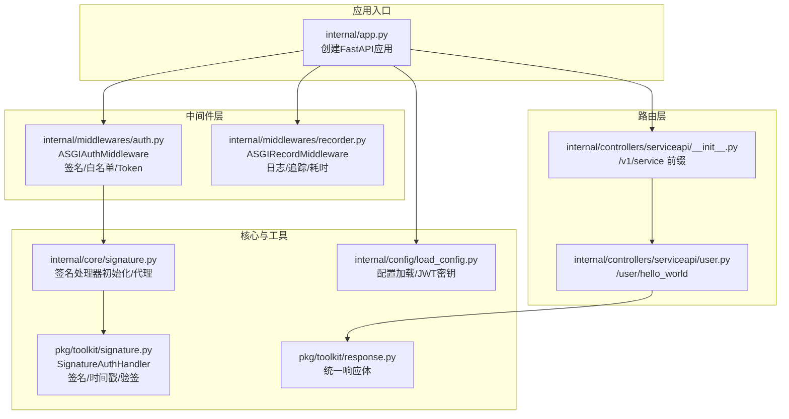
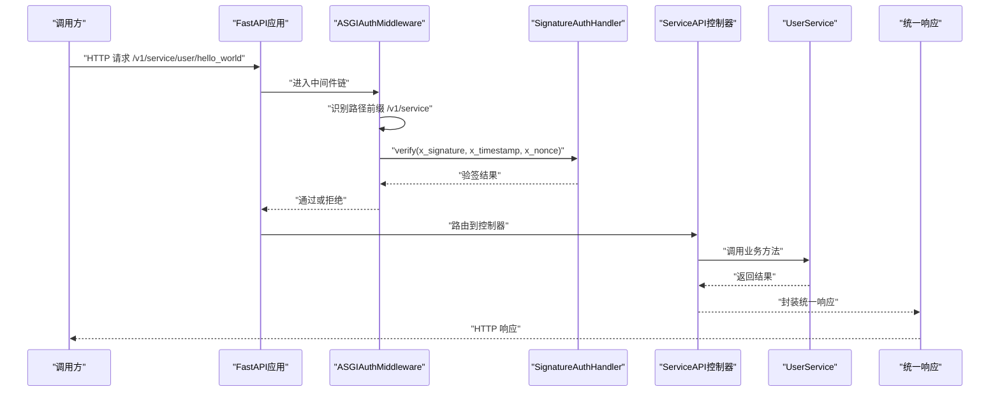
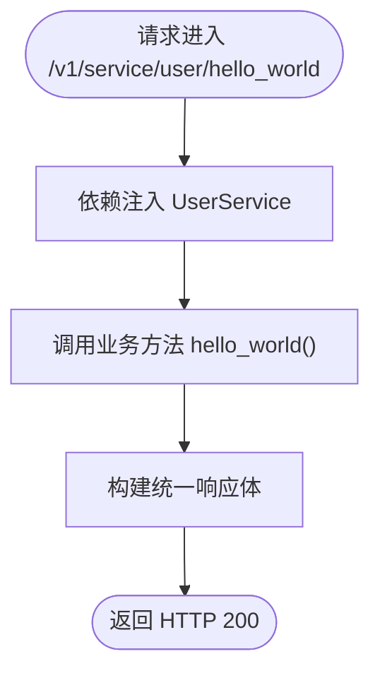
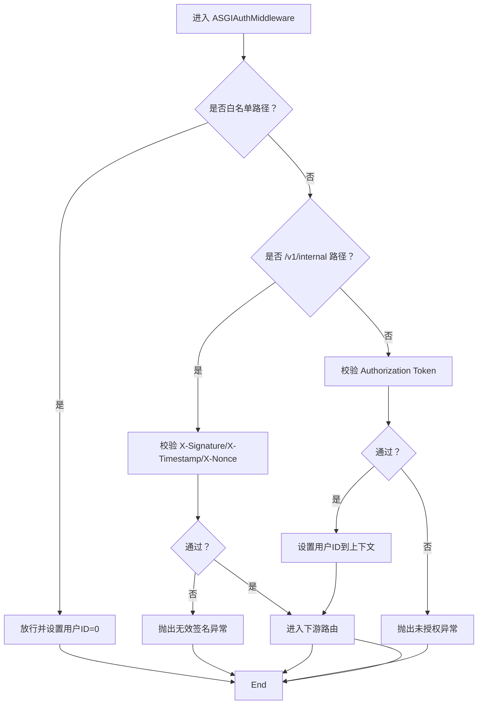
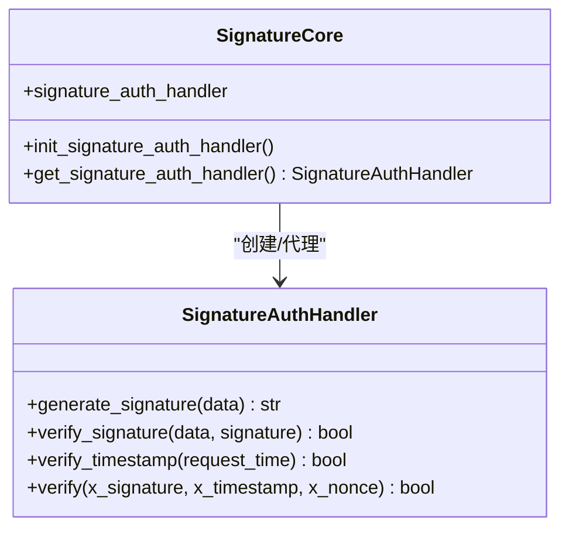
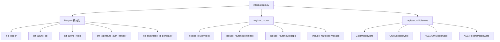

# Service API接口

<cite>
**本文引用的文件**
- [internal/controllers/serviceapi/user.py](file://internal/controllers/serviceapi/user.py)
- [internal/controllers/serviceapi/__init__.py](file://internal/controllers/serviceapi/__init__.py)
- [internal/middlewares/auth.py](file://internal/middlewares/auth.py)
- [internal/core/signature.py](file://internal/core/signature.py)
- [pkg/toolkit/signature.py](file://pkg/toolkit/signature.py)
- [internal/app.py](file://internal/app.py)
- [internal/config/load_config.py](file://internal/config/load_config.py)
- [pkg/toolkit/response.py](file://pkg/toolkit/response.py)
- [pkg/toolkit/http_cli.py](file://pkg/toolkit/http_cli.py)
- [internal/middlewares/recorder.py](file://internal/middlewares/recorder.py)
- [configs/.env.dev](file://configs/.env.dev)
</cite>

## 目录
1. [简介](#简介)
2. [项目结构](#项目结构)
3. [核心组件](#核心组件)
4. [架构总览](#架构总览)
5. [详细组件分析](#详细组件分析)
6. [依赖关系分析](#依赖关系分析)
7. [性能考量](#性能考量)
8. [故障排查指南](#故障排查指南)
9. [结论](#结论)
10. [附录](#附录)

## 简介
本文件面向服务间通信的Service API接口，提供完整的接口规范、安全架构说明、访问控制策略、监控机制以及微服务集成与运维建议。Service API采用更严格的安全要求，通过签名认证、时间戳校验与防重放机制保障消息完整性与可信性；同时结合中间件链路实现统一鉴权、日志与监控。

## 项目结构
Service API位于“/v1/service”前缀下，由FastAPI路由注册并经由认证中间件拦截，最终交由业务服务层处理。整体结构如下：

图表来源
- [internal/app.py](file://internal/app.py#L33-L45)
- [internal/controllers/serviceapi/__init__.py](file://internal/controllers/serviceapi/__init__.py#L5-L12)
- [internal/controllers/serviceapi/user.py](file://internal/controllers/serviceapi/user.py#L8-L21)
- [internal/middlewares/auth.py](file://internal/middlewares/auth.py#L88-L150)
- [internal/middlewares/recorder.py](file://internal/middlewares/recorder.py#L66-L123)
- [internal/core/signature.py](file://internal/core/signature.py#L9-L27)
- [pkg/toolkit/signature.py](file://pkg/toolkit/signature.py#L9-L95)
- [internal/config/load_config.py](file://internal/config/load_config.py#L46-L84)
- [pkg/toolkit/response.py](file://pkg/toolkit/response.py#L47-L170)

章节来源
- [internal/app.py](file://internal/app.py#L33-L45)
- [internal/controllers/serviceapi/__init__.py](file://internal/controllers/serviceapi/__init__.py#L5-L12)
- [internal/controllers/serviceapi/user.py](file://internal/controllers/serviceapi/user.py#L8-L21)

## 核心组件
- 路由与控制器
  - Service API路由前缀为/v1/service，当前暴露/hello_world示例接口。
  - 控制器通过依赖注入获取UserService实例，返回统一响应体。
- 认证中间件
  - ASGIAuthMiddleware负责白名单放行、内部接口签名校验、Token校验。
  - 内部接口路径以/v1/internal开头，Service API路径以/v1/service开头，两者走不同的认证路径。
- 签名与时间戳
  - SignatureAuthHandler提供签名生成、验签与时间戳校验，支持可配置哈希算法与时间容差。
  - 签名处理器由internal/core/signature.py进行延迟初始化与代理。
- 统一响应
  - 所有接口返回统一响应体结构，便于前端与服务间解析。
- 监控与追踪
  - ASGIRecordMiddleware记录访问日志、处理耗时与追踪ID，便于问题定位与性能分析。

章节来源
- [internal/controllers/serviceapi/user.py](file://internal/controllers/serviceapi/user.py#L8-L21)
- [internal/middlewares/auth.py](file://internal/middlewares/auth.py#L88-L150)
- [internal/core/signature.py](file://internal/core/signature.py#L9-L27)
- [pkg/toolkit/signature.py](file://pkg/toolkit/signature.py#L9-L95)
- [pkg/toolkit/response.py](file://pkg/toolkit/response.py#L47-L170)
- [internal/middlewares/recorder.py](file://internal/middlewares/recorder.py#L66-L123)

## 架构总览
Service API的安全架构围绕“签名+时间戳+防重放”展开，结合中间件链路实现统一接入控制与可观测性。

图表来源
- [internal/middlewares/auth.py](file://internal/middlewares/auth.py#L119-L130)
- [pkg/toolkit/signature.py](file://pkg/toolkit/signature.py#L77-L95)
- [internal/controllers/serviceapi/user.py](file://internal/controllers/serviceapi/user.py#L14-L21)
- [pkg/toolkit/response.py](file://pkg/toolkit/response.py#L181-L186)

## 详细组件分析

### Service API控制器与路由
- 路由前缀与命名
  - /v1/service 前缀由serviceapi/__init__.py定义，便于区分公共API、内部API与Service API。
- 示例接口
  - /user/hello_world：演示服务间调用的最小可用接口，返回统一成功响应。
- 依赖注入
  - 控制器通过Annotated依赖注入UserService，便于单元测试与替换实现。

图表来源
- [internal/controllers/serviceapi/user.py](file://internal/controllers/serviceapi/user.py#L14-L21)
- [pkg/toolkit/response.py](file://pkg/toolkit/response.py#L181-L186)

章节来源
- [internal/controllers/serviceapi/__init__.py](file://internal/controllers/serviceapi/__init__.py#L5-L12)
- [internal/controllers/serviceapi/user.py](file://internal/controllers/serviceapi/user.py#L8-L21)

### 认证中间件与访问控制
- 白名单放行
  - 对公开路径（如文档、登录等）与测试路径直接放行，设置上下文用户ID为0。
- 内部接口签名校验
  - 对/v1/internal路径进行Token校验；对/v1/service路径进行签名校验。
- Token校验
  - 从Authorization头中提取Token并验证有效性，失败则抛出未授权异常。
- 上下文设置
  - Token校验通过后，将用户ID写入上下文，便于后续审计与日志追踪。

图表来源
- [internal/middlewares/auth.py](file://internal/middlewares/auth.py#L97-L150)

章节来源
- [internal/middlewares/auth.py](file://internal/middlewares/auth.py#L88-L150)

### 签名认证与防重放
- 签名算法
  - 基于HMAC，支持SHA-256/SHA-1/MD5；签名输入为按键排序后的键值对拼接。
- 时间戳校验
  - 以UTC秒级时间戳为基准，允许配置容差窗口，防止时钟漂移导致的误判。
- 防重放
  - 引入随机串nonce，结合时间戳共同参与验签，有效降低重放风险。
- 密钥来源
  - 签名密钥来自配置系统中的JWT_SECRET，确保密钥安全存储与加载。

图表来源
- [pkg/toolkit/signature.py](file://pkg/toolkit/signature.py#L9-L95)
- [internal/core/signature.py](file://internal/core/signature.py#L9-L27)

章节来源
- [pkg/toolkit/signature.py](file://pkg/toolkit/signature.py#L27-L95)
- [internal/core/signature.py](file://internal/core/signature.py#L9-L27)
- [internal/config/load_config.py](file://internal/config/load_config.py#L55-L59)

### 统一响应与错误处理
- 统一响应体
  - 包含code、message、data三段式结构，支持Pydantic模型自动序列化。
- 错误处理
  - 业务异常与系统异常分别记录并返回相应错误码与消息。
- 成功响应
  - 通过success_response快速构造成功响应，保持前后端一致性。

章节来源
- [pkg/toolkit/response.py](file://pkg/toolkit/response.py#L47-L170)

### 监控与追踪
- 追踪ID
  - 自动生成UUID v6风格追踪ID，支持从请求头透传，贯穿全链路。
- 处理耗时
  - 记录请求开始时间与结束时间，计算处理耗时并注入响应头。
- 日志记录
  - 访问日志与响应日志分离，便于问题定位与性能分析。

章节来源
- [internal/middlewares/recorder.py](file://internal/middlewares/recorder.py#L66-L123)

## 依赖关系分析
- 应用生命周期
  - 应用启动时初始化日志、数据库、Redis、签名处理器与Snowflake ID生成器。
- 路由注册
  - 将web/internal/public/service四类路由统一注册到FastAPI应用。
- 中间件注册
  - 注册GZip、CORS、认证与记录中间件，形成完整的请求处理链。

图表来源
- [internal/app.py](file://internal/app.py#L85-L109)
- [internal/app.py](file://internal/app.py#L33-L45)
- [internal/app.py](file://internal/app.py#L55-L82)

章节来源
- [internal/app.py](file://internal/app.py#L85-L109)
- [internal/app.py](file://internal/app.py#L33-L45)
- [internal/app.py](file://internal/app.py#L55-L82)

## 性能考量
- 压缩传输
  - 启用GZip中间件，降低网络带宽占用，提升大响应场景下的吞吐。
- 长连接与超时
  - httpx异步客户端支持长连接与可配置超时，适合高并发服务间调用。
- 序列化优化
  - 统一使用高性能JSON序列化，减少CPU开销与内存拷贝。
- 监控指标
  - 通过响应头注入处理耗时与追踪ID，便于Prometheus/Grafana等平台采集。

章节来源
- [internal/app.py](file://internal/app.py#L56-L60)
- [pkg/toolkit/http_cli.py](file://pkg/toolkit/http_cli.py#L38-L75)
- [pkg/toolkit/response.py](file://pkg/toolkit/response.py#L62-L81)
- [internal/middlewares/recorder.py](file://internal/middlewares/recorder.py#L54-L63)

## 故障排查指南
- 签名失败
  - 检查X-Signature、X-Timestamp、X-Nonce是否正确传递；确认时间戳在容差范围内；核对签名算法与密钥一致。
- 未授权访问
  - 确认Authorization头格式与Token有效性；检查白名单路径与内部接口路径是否匹配。
- 响应异常
  - 查看统一错误响应体中的code与message；结合追踪ID在日志中检索上下文。
- 性能问题
  - 关注X-Process-Time响应头；检查GZip/CORS中间件配置；评估上游服务调用耗时。

章节来源
- [internal/middlewares/auth.py](file://internal/middlewares/auth.py#L123-L127)
- [pkg/toolkit/signature.py](file://pkg/toolkit/signature.py#L77-L95)
- [pkg/toolkit/response.py](file://pkg/toolkit/response.py#L151-L169)
- [internal/middlewares/recorder.py](file://internal/middlewares/recorder.py#L92-L102)

## 结论
Service API通过严格的签名认证、时间戳校验与防重放机制，结合统一的中间件链路与监控体系，实现了高安全性与高可观测性的服务间通信能力。建议在生产环境中：
- 使用强健的密钥管理与轮换策略；
- 合理设置时间容差与日志级别；
- 在网关层实施限流与熔断；
- 利用追踪ID与指标进行持续观测与优化。

## 附录

### 接口规范与调用示例（概念性说明）
- 路由前缀
  - /v1/service
- 示例接口
  - GET /v1/service/user/hello_world
- 请求头
  - X-Signature：基于签名算法生成的摘要
  - X-Timestamp：UTC秒级时间戳
  - X-Nonce：随机字符串
- 响应
  - 统一响应体包含code、message、data；成功时code为20000，message为空字符串。

章节来源
- [internal/controllers/serviceapi/__init__.py](file://internal/controllers/serviceapi/__init__.py#L5-L12)
- [internal/controllers/serviceapi/user.py](file://internal/controllers/serviceapi/user.py#L14-L21)
- [pkg/toolkit/response.py](file://pkg/toolkit/response.py#L47-L170)

### 安全配置要点
- 密钥与算法
  - 签名密钥来源于JWT_SECRET；支持SHA-256/SHA-1/MD5；建议使用SHA-256。
- 时间容差
  - 默认容差窗口为300秒，可根据网络抖动调整。
- 环境变量
  - 开发环境示例包含JWT_ALGORITHM与ACCESS_TOKEN_EXPIRE_MINUTES等配置项。

章节来源
- [internal/config/load_config.py](file://internal/config/load_config.py#L55-L59)
- [configs/.env.dev](file://configs/.env.dev#L1-L20)
- [pkg/toolkit/signature.py](file://pkg/toolkit/signature.py#L12-L25)