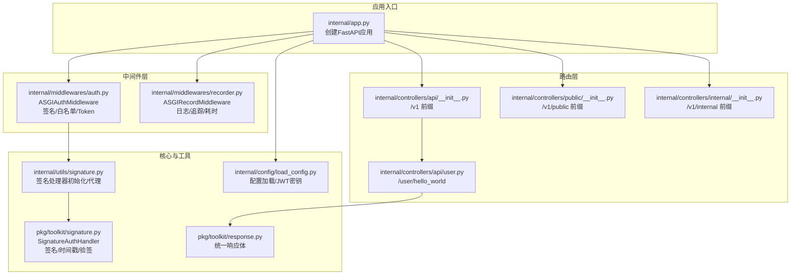
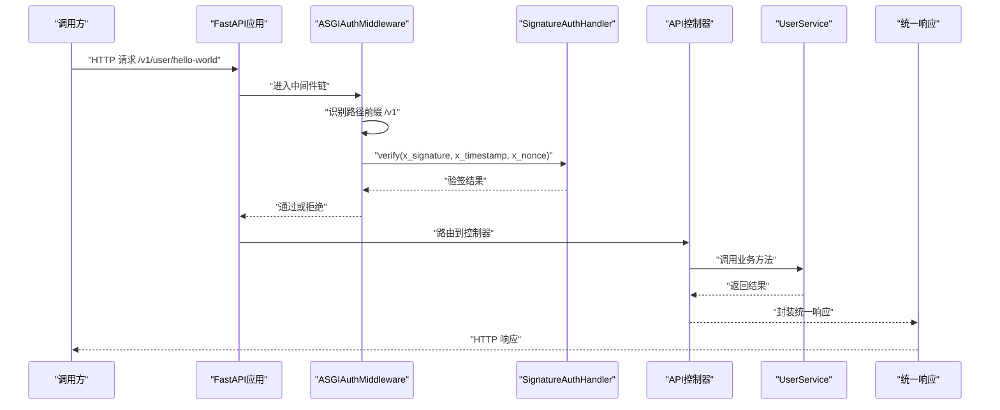
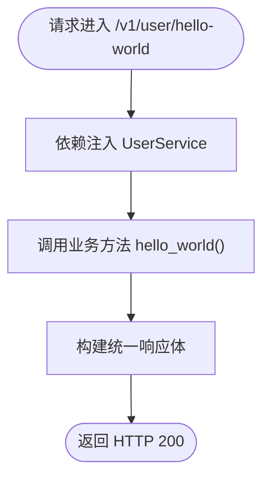
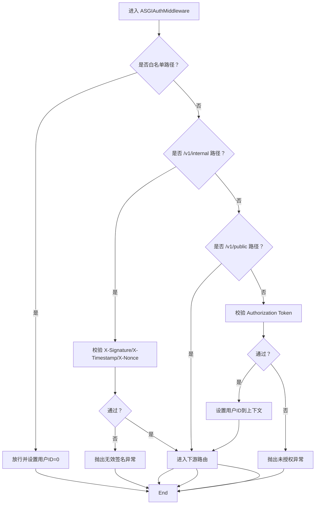
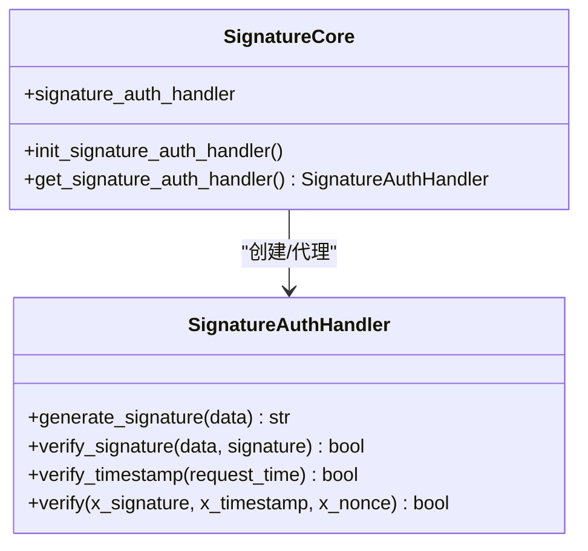
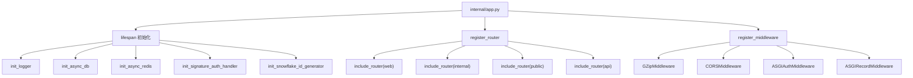

# Service API接口

<cite>
**本文引用的文件**
- [internal/controllers/api/user.py](file://internal/controllers/api/user.py)
- [internal/controllers/api/__init__.py](file://internal/controllers/api/__init__.py)
- [internal/controllers/public/__init__.py](file://internal/controllers/public/__init__.py)
- [internal/controllers/public/test.py](file://internal/controllers/public/test.py)
- [internal/controllers/internal/__init__.py](file://internal/controllers/internal/__init__.py)
- [internal/middlewares/auth.py](file://internal/middlewares/auth.py)
- [internal/utils/signature.py](file://internal/utils/signature.py)
- [pkg/toolkit/signature.py](file://pkg/toolkit/signature.py)
- [internal/app.py](file://internal/app.py)
- [internal/config/load_config.py](file://internal/config/load_config.py)
- [pkg/toolkit/response.py](file://pkg/toolkit/response.py)
- [pkg/toolkit/http_cli.py](file://pkg/toolkit/http_cli.py)
- [internal/middlewares/recorder.py](file://internal/middlewares/recorder.py)
- [configs/.env.dev](file://configs/.env.dev)
- [README.md](file://README.md)
</cite>

## 更新摘要
**所做更改**
- 更新项目结构部分，反映serviceapi路由结构已被移除
- 更新架构总览图，移除serviceapi相关组件
- 更新详细组件分析，移除serviceapi控制器相关内容
- 更新依赖关系分析，移除serviceapi路由注册
- 更新故障排查指南，移除serviceapi相关问题
- 更新附录，移除serviceapi接口规范与调用示例

## 目录
1. [简介](#简介)
2. [项目结构](#项目结构)
3. [核心组件](#核心组件)
4. [架构总览](#架构总览)
5. [详细组件分析](#详细组件分析)
6. [依赖关系分析](#依赖关系分析)
7. [性能考量](#性能考量)
8. [故障排查指南](#故障排查指南)
9. [结论](#结论)
10. [附录](#附录)

## 简介
本文件面向服务间通信的Service API接口，提供完整的接口规范、安全架构说明、访问控制策略、监控机制以及微服务集成与运维建议。Service API采用更严格的安全要求，通过签名认证、时间戳校验与防重放机制保障消息完整性与可信性；同时结合中间件链路实现统一鉴权、日志与监控。

**重要更新**：根据最新的代码变更，旧的serviceapi路由结构已完全移除，不再支持serviceapi路由模式。当前的路由结构已简化为web、public、internal三个主要类别。

## 项目结构
Service API位于"/v1"前缀下，由FastAPI路由注册并经由认证中间件拦截，最终交由业务服务层处理。整体结构如下：

```mermaid
graph TB
subgraph "应用入口"
A["internal/app.py<br/>创建FastAPI应用"]
end
subgraph "路由层"
R1["internal/controllers/api/__init__.py<br/>/v1 前缀"]
R2["internal/controllers/api/user.py<br/>/user/hello_world"]
R3["internal/controllers/public/__init__.py<br/>/v1/public 前缀"]
R4["internal/controllers/internal/__init__.py<br/>/v1/internal 前缀"]
end
subgraph "中间件层"
M1["internal/middlewares/auth.py<br/>ASGIAuthMiddleware<br/>签名/白名单/Token"]
M2["internal/middlewares/recorder.py<br/>ASGIRecordMiddleware<br/>日志/追踪/耗时"]
end
subgraph "核心与工具"
C1["internal/utils/signature.py<br/>签名处理器初始化/代理"]
T1["pkg/toolkit/signature.py<br/>SignatureAuthHandler<br/>签名/时间戳/验签"]
CFG["internal/config/load_config.py<br/>配置加载/JWT密钥"]
RESP["pkg/toolkit/response.py<br/>统一响应体"]
end
A --> R1 --> R2
A --> R3
A --> R4
A --> M1
A --> M2
M1 --> C1 --> T1
A --> CFG
R2 --> RESP
```

**更新**：项目结构已更新，移除了serviceapi路由结构。当前路由结构包括：
- web路由：JWT认证的Web API
- public路由：无需认证的公开API  
- internal路由：签名认证的内部API
- api路由：/v1前缀下的用户相关接口

图表来源
- [internal/app.py](file://internal/app.py#L31-L41)
- [internal/controllers/api/__init__.py](file://internal/controllers/api/__init__.py#L5-L13)
- [internal/controllers/api/user.py](file://internal/controllers/api/user.py#L8-L16)
- [internal/controllers/public/__init__.py](file://internal/controllers/public/__init__.py#L5-L10)
- [internal/controllers/internal/__init__.py](file://internal/controllers/internal/__init__.py#L3-L8)
- [internal/middlewares/auth.py](file://internal/middlewares/auth.py#L85-L148)
- [internal/middlewares/recorder.py](file://internal/middlewares/recorder.py#L66-L123)
- [internal/utils/signature.py](file://internal/utils/signature.py#L9-L27)
- [pkg/toolkit/signature.py](file://pkg/toolkit/signature.py#L9-L95)
- [internal/config/load_config.py](file://internal/config/load_config.py#L46-L84)
- [pkg/toolkit/response.py](file://pkg/toolkit/response.py#L47-L170)

章节来源
- [internal/app.py](file://internal/app.py#L31-L41)
- [internal/controllers/api/__init__.py](file://internal/controllers/api/__init__.py#L5-L13)
- [internal/controllers/api/user.py](file://internal/controllers/api/user.py#L8-L16)

## 核心组件
- 路由与控制器
  - API路由前缀为/v1，当前暴露/hello_world示例接口。
  - 控制器通过依赖注入获取UserService实例，返回统一响应体。
- 认证中间件
  - ASGIAuthMiddleware负责白名单放行、内部接口签名校验、Token校验。
  - 当前路径分为/v1/public（公开）、/v1/internal（签名认证）和其他路径（JWT认证）。
- 签名与时间戳
  - SignatureAuthHandler提供签名生成、验签与时间戳校验，支持可配置哈希算法与时间容差。
  - 签名处理器由internal/utils/signature.py进行延迟初始化与代理。
- 统一响应
  - 所有接口返回统一响应体结构，便于前端与服务间解析。
- 监控与追踪
  - ASGIRecordMiddleware记录访问日志、处理耗时与追踪ID，便于问题定位与性能分析。

**更新**：核心组件已更新，移除了serviceapi相关的认证路径和路由配置。

章节来源
- [internal/controllers/api/user.py](file://internal/controllers/api/user.py#L8-L16)
- [internal/middlewares/auth.py](file://internal/middlewares/auth.py#L85-L148)
- [internal/utils/signature.py](file://internal/utils/signature.py#L9-L27)
- [pkg/toolkit/signature.py](file://pkg/toolkit/signature.py#L9-L95)
- [pkg/toolkit/response.py](file://pkg/toolkit/response.py#L47-L170)
- [internal/middlewares/recorder.py](file://internal/middlewares/recorder.py#L66-L123)

## 架构总览
Service API的安全架构围绕"签名+时间戳+防重放"展开，结合中间件链路实现统一接入控制与可观测性。

```mermaid
sequenceDiagram
participant Caller as "调用方"
participant App as "FastAPI应用"
participant Auth as "ASGIAuthMiddleware"
participant Sig as "SignatureAuthHandler"
participant Ctrl as "API控制器"
participant Svc as "UserService"
participant Resp as "统一响应"
Caller->>App : "HTTP 请求 /v1/user/hello-world"
App->>Auth : "进入中间件链"
Auth->>Auth : "识别路径前缀 /v1"
Auth->>Sig : "verify(x_signature, x_timestamp, x_nonce)"
Sig-->>Auth : "验签结果"
Auth-->>App : "通过或拒绝"
App->>Ctrl : "路由到控制器"
Ctrl->>Svc : "调用业务方法"
Svc-->>Ctrl : "返回结果"
Ctrl-->>Resp : "封装统一响应"
Resp-->>Caller : "HTTP 响应"
```

**更新**：架构图已更新，移除了serviceapi相关的组件和流程。

图表来源
- [internal/middlewares/auth.py](file://internal/middlewares/auth.py#L116-L127)
- [pkg/toolkit/signature.py](file://pkg/toolkit/signature.py#L77-L95)
- [internal/controllers/api/user.py](file://internal/controllers/api/user.py#L13-L16)
- [pkg/toolkit/response.py](file://pkg/toolkit/response.py#L181-L186)

## 详细组件分析

### API控制器与路由
- 路由前缀与命名
  - /v1前缀由api/__init__.py定义，便于区分公开API、内部API与其他API。
- 示例接口
  - /user/hello-world：演示服务间调用的最小可用接口，返回统一成功响应。
- 依赖注入
  - 控制器通过Annotated依赖注入UserService，便于单元测试与替换实现。

```mermaid
flowchart TD
Start(["请求进入 /v1/user/hello-world"]) --> GetSvc["依赖注入 UserService"]
GetSvc --> CallSvc["调用业务方法 hello_world()"]
CallSvc --> BuildResp["构建统一响应体"]
BuildResp --> End(["返回 HTTP 200"])
```

**更新**：详细组件分析已更新，移除了serviceapi控制器相关内容，保留了当前的API控制器结构。

图表来源
- [internal/controllers/api/user.py](file://internal/controllers/api/user.py#L13-L16)
- [pkg/toolkit/response.py](file://pkg/toolkit/response.py#L181-L186)

章节来源
- [internal/controllers/api/__init__.py](file://internal/controllers/api/__init__.py#L5-L13)
- [internal/controllers/api/user.py](file://internal/controllers/api/user.py#L8-L16)

### 认证中间件与访问控制
- 白名单放行
  - 对公开路径（如文档、登录等）与测试路径直接放行，设置上下文用户ID为0。
- 内部接口签名校验
  - 对/v1/internal路径进行签名校验；对/v1/public路径直接放行；其他路径进行JWT Token校验。
- Token校验
  - 从Authorization头中提取Token并验证有效性，失败则抛出未授权异常。
- 上下文设置
  - Token校验通过后，将用户ID写入上下文，便于后续审计与日志追踪。

```mermaid
flowchart TD
A["进入 ASGIAuthMiddleware"] --> B{"是否白名单路径？"}
B -- 是 --> Pass["放行并设置用户ID=0"] --> End
B -- 否 --> C{"是否 /v1/internal 路径？"}
C -- 是 --> D["校验 X-Signature/X-Timestamp/X-Nonce"] --> E{"通过？"}
E -- 否 --> Err["抛出无效签名异常"] --> End
E -- 是 --> Next["进入下游路由"] --> End
C -- 否 --> F{"是否 /v1/public 路径？"}
F -- 是 --> Next --> End
F -- 否 --> G["校验 Authorization Token"] --> H{"通过？"}
H -- 否 --> Err2["抛出未授权异常"] --> End
H -- 是 --> SetCtx["设置用户ID到上下文"] --> Next --> End
```

**更新**：认证中间件逻辑已更新，移除了serviceapi相关的认证路径。

图表来源
- [internal/middlewares/auth.py](file://internal/middlewares/auth.py#L101-L148)

章节来源
- [internal/middlewares/auth.py](file://internal/middlewares/auth.py#L85-L148)

### 签名认证与防重放
- 签名算法
  - 基于HMAC，支持SHA-256/SHA-1/MD5；签名输入为按键排序后的键值对拼接。
- 时间戳校验
  - 以UTC秒级时间戳为基准，允许配置容差窗口，防止时钟漂移导致的误判。
- 防重放
  - 引入随机串nonce，结合时间戳共同参与验签，有效降低重放风险。
- 密钥来源
  - 签名密钥来自配置系统中的JWT_SECRET，确保密钥安全存储与加载。

```mermaid
classDiagram
class SignatureAuthHandler {
+generate_signature(data) str
+verify_signature(data, signature) bool
+verify_timestamp(request_time) bool
+verify(x_signature, x_timestamp, x_nonce) bool
}
class SignatureCore {
+init_signature_auth_handler()
+get_signature_auth_handler() SignatureAuthHandler
+signature_auth_handler
}
SignatureCore --> SignatureAuthHandler : "创建/代理"
```

**更新**：签名认证组件保持不变，但已移除serviceapi相关的调用场景。

图表来源
- [pkg/toolkit/signature.py](file://pkg/toolkit/signature.py#L9-L95)
- [internal/utils/signature.py](file://internal/utils/signature.py#L9-L27)

章节来源
- [pkg/toolkit/signature.py](file://pkg/toolkit/signature.py#L27-L95)
- [internal/utils/signature.py](file://internal/utils/signature.py#L9-L27)
- [internal/config/load_config.py](file://internal/config/load_config.py#L55-L59)

### 统一响应与错误处理
- 统一响应体
  - 包含code、message、data三段式结构，支持Pydantic模型自动序列化。
- 错误处理
  - 业务异常与系统异常分别记录并返回相应错误码与消息。
- 成功响应
  - 通过success_response快速构造成功响应，保持前后端一致性。

章节来源
- [pkg/toolkit/response.py](file://pkg/toolkit/response.py#L47-L170)

### 监控与追踪
- 追踪ID
  - 自动生成UUID v6风格追踪ID，支持从请求头透传，贯穿全链路。
- 处理耗时
  - 记录请求开始时间与结束时间，计算处理耗时并注入响应头。
- 日志记录
  - 访问日志与响应日志分离，便于问题定位与性能分析。

章节来源
- [internal/middlewares/recorder.py](file://internal/middlewares/recorder.py#L66-L123)

## 依赖关系分析
- 应用生命周期
  - 应用启动时初始化日志、数据库、Redis、签名处理器与Snowflake ID生成器。
- 路由注册
  - 将web、internal、public、api四类路由统一注册到FastAPI应用。
- 中间件注册
  - 注册GZip、CORS、认证与记录中间件，形成完整的请求处理链。

```mermaid
graph TB
App["internal/app.py"] --> Init["lifespan 初始化"]
Init --> Log["init_logger"]
Init --> DB["init_async_db"]
Init --> Redis["init_async_redis"]
Init --> Sig["init_signature_auth_handler"]
Init --> Snow["init_snowflake_id_generator"]
App --> RegRouter["register_router"]
RegRouter --> Web["include_router(web)"]
RegRouter --> Internal["include_router(internal)"]
RegRouter --> Public["include_router(public)"]
RegRouter --> Api["include_router(api)"]
App --> RegMW["register_middleware"]
RegMW --> GZip["GZipMiddleware"]
RegMW --> CORS["CORSMiddleware"]
RegMW --> Auth["ASGIAuthMiddleware"]
RegMW --> Rec["ASGIRecordMiddleware"]
```

**更新**：依赖关系分析已更新，移除了serviceapi路由注册，保留了当前的路由结构。

图表来源
- [internal/app.py](file://internal/app.py#L79-L107)
- [internal/app.py](file://internal/app.py#L31-L41)
- [internal/app.py](file://internal/app.py#L50-L77)

章节来源
- [internal/app.py](file://internal/app.py#L79-L107)
- [internal/app.py](file://internal/app.py#L31-L41)
- [internal/app.py](file://internal/app.py#L50-L77)

## 性能考量
- 压缩传输
  - 启用GZip中间件，降低网络带宽占用，提升大响应场景下的吞吐。
- 长连接与超时
  - httpx异步客户端支持长连接与可配置超时，适合高并发服务间调用。
- 序列化优化
  - 统一使用高性能JSON序列化，减少CPU开销与内存拷贝。
- 监控指标
  - 通过响应头注入处理耗时与追踪ID，便于Prometheus/Grafana等平台采集。

章节来源
- [internal/app.py](file://internal/app.py#L50-L77)
- [pkg/toolkit/http_cli.py](file://pkg/toolkit/http_cli.py#L38-L75)
- [pkg/toolkit/response.py](file://pkg/toolkit/response.py#L62-L81)
- [internal/middlewares/recorder.py](file://internal/middlewares/recorder.py#L54-L63)

## 故障排查指南
- 签名失败
  - 检查X-Signature、X-Timestamp、X-Nonce是否正确传递；确认时间戳在容差范围内；核对签名算法与密钥一致。
- 未授权访问
  - 确认Authorization头格式与Token有效性；检查白名单路径与内部接口路径是否匹配。
- 响应异常
  - 查看统一错误响应体中的code与message；结合追踪ID在日志中检索上下文。
- 性能问题
  - 关注X-Process-Time响应头；检查GZip/CORS中间件配置；评估上游服务调用耗时。

**更新**：故障排查指南已更新，移除了serviceapi相关的故障场景。

章节来源
- [internal/middlewares/auth.py](file://internal/middlewares/auth.py#L116-L127)
- [pkg/toolkit/signature.py](file://pkg/toolkit/signature.py#L77-L95)
- [pkg/toolkit/response.py](file://pkg/toolkit/response.py#L151-L169)
- [internal/middlewares/recorder.py](file://internal/middlewares/recorder.py#L92-L102)

## 结论
Service API通过严格的签名认证、时间戳校验与防重放机制，结合统一的中间件链路与监控体系，实现了高安全性与高可观测性的服务间通信能力。建议在生产环境中：
- 使用强健的密钥管理与轮换策略；
- 合理设置时间容差与日志级别；
- 在网关层实施限流与熔断；
- 利用追踪ID与指标进行持续观测与优化。

**更新**：结论保持不变，但已移除serviceapi相关的具体实现细节。

## 附录

### 接口规范与调用示例（当前API结构）
- 路由前缀
  - /v1
- 示例接口
  - GET /v1/user/hello-world
- 请求头
  - Authorization：JWT Token（对于非/v1/public路径）
  - X-Signature：基于签名算法生成的摘要（对于/v1/internal路径）
  - X-Timestamp：UTC秒级时间戳
  - X-Nonce：随机字符串
- 响应
  - 统一响应体包含code、message、data；成功时code为20000，message为空字符串。

**更新**：附录已更新，移除了serviceapi相关的接口规范，保留了当前API的调用示例。

章节来源
- [internal/controllers/api/__init__.py](file://internal/controllers/api/__init__.py#L5-L13)
- [internal/controllers/api/user.py](file://internal/controllers/api/user.py#L13-L16)
- [pkg/toolkit/response.py](file://pkg/toolkit/response.py#L47-L170)

### 安全配置要点
- 密钥与算法
  - 签名密钥来源于JWT_SECRET；支持SHA-256/SHA-1/MD5；建议使用SHA-256。
- 时间容差
  - 默认容差窗口为300秒，可根据网络抖动调整。
- 环境变量
  - 开发环境示例包含JWT_ALGORITHM与ACCESS_TOKEN_EXPIRE_MINUTES等配置项。

**更新**：安全配置要点保持不变，但已移除serviceapi相关的配置场景。

章节来源
- [internal/config/load_config.py](file://internal/config/load_config.py#L55-L59)
- [configs/.env.dev](file://configs/.env.dev#L1-L20)
- [pkg/toolkit/signature.py](file://pkg/toolkit/signature.py#L12-L25)

### 路由结构对照表
| 路径前缀 | 模块 | 认证方式 | 说明 |
|---------|------|---------|------|
| `/v1` | api | JWT | 用户相关接口 |
| `/v1/public` | public | 无 | 公开API，无需认证 |
| `/v1/internal` | internal | 签名认证 | 内部服务间通信 |
| Web路由 | web | JWT | Web前端接口 |

**新增**：路由结构对照表，展示当前的路由分类与认证方式。

章节来源
- [README.md](file://README.md#L107-L115)
- [internal/app.py](file://internal/app.py#L31-L41)
- [internal/middlewares/auth.py](file://internal/middlewares/auth.py#L26-L29)