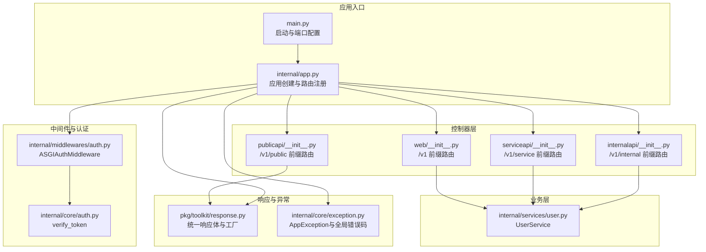
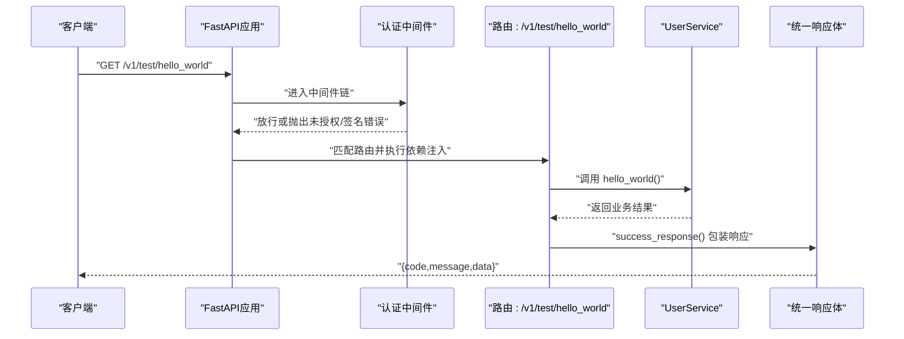
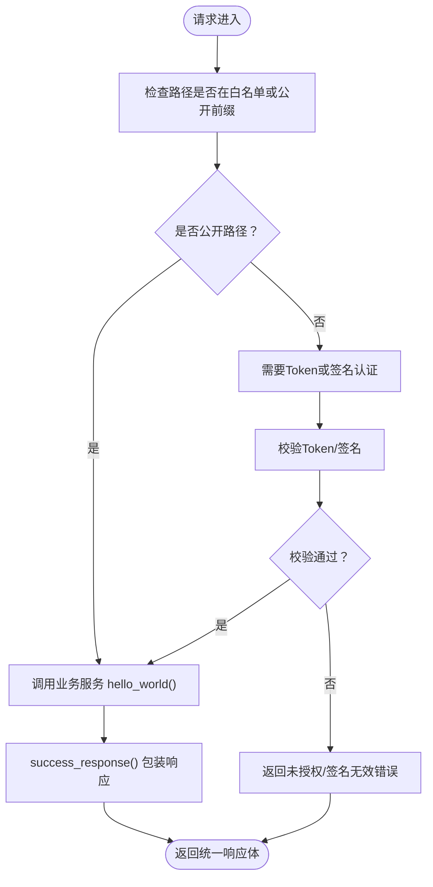
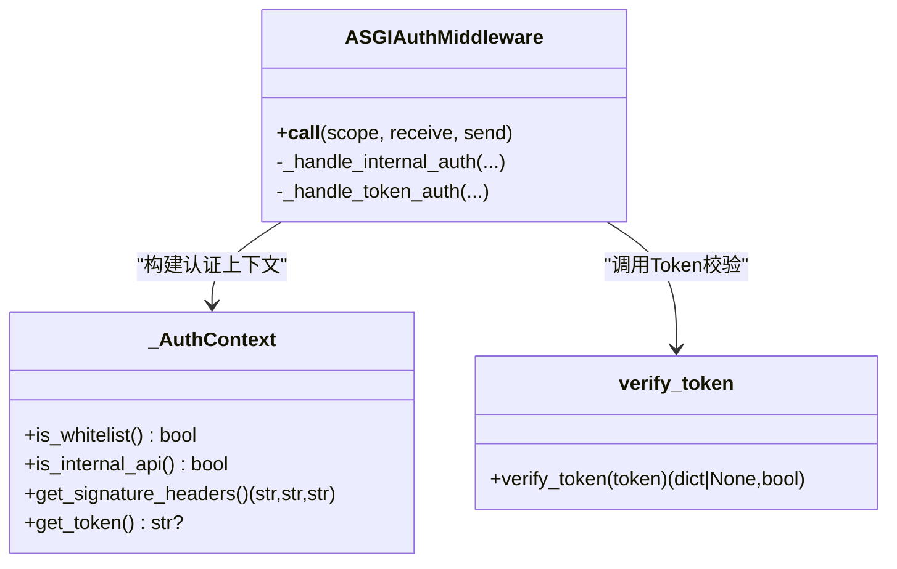
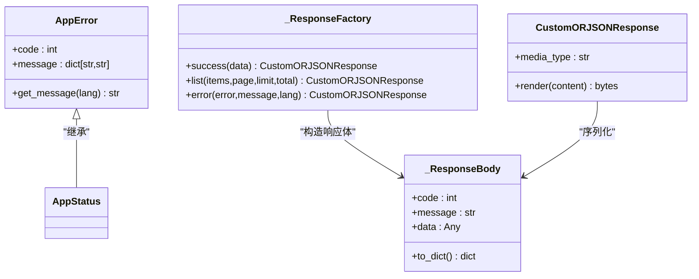
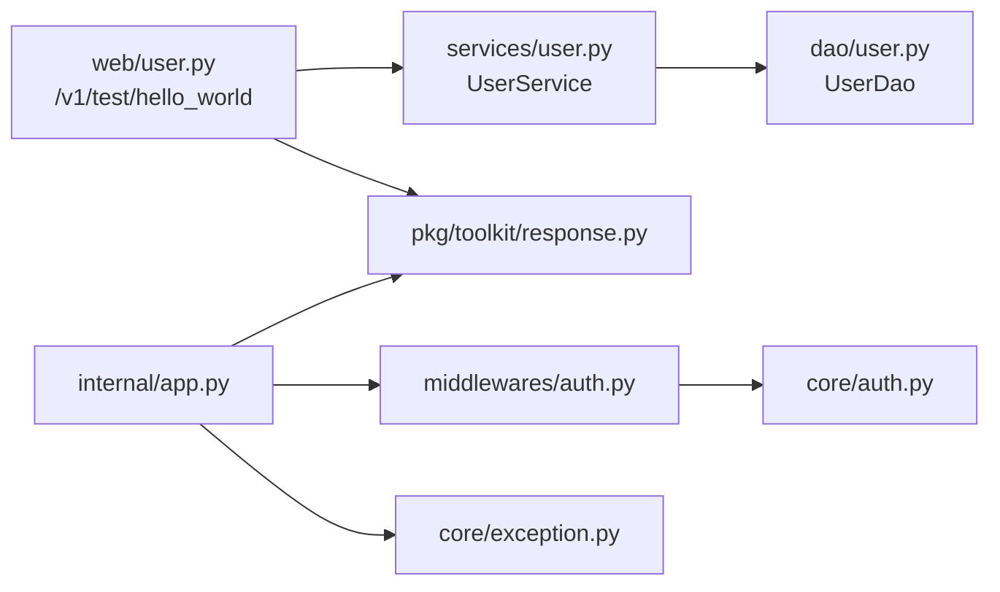

# Web API接口

<cite>
**本文档引用的文件**
- [main.py](file://main.py)
- [internal/app.py](file://internal/app.py)
- [internal/controllers/web/__init__.py](file://internal/controllers/web/__init__.py)
- [internal/controllers/web/user.py](file://internal/controllers/web/user.py)
- [internal/controllers/publicapi/__init__.py](file://internal/controllers/publicapi/__init__.py)
- [internal/controllers/publicapi/test.py](file://internal/controllers/publicapi/test.py)
- [internal/controllers/serviceapi/__init__.py](file://internal/controllers/serviceapi/__init__.py)
- [internal/controllers/internalapi/__init__.py](file://internal/controllers/internalapi/__init__.py)
- [internal/controllers/internalapi/user.py](file://internal/controllers/internalapi/user.py)
- [internal/services/user.py](file://internal/services/user.py)
- [internal/middlewares/auth.py](file://internal/middlewares/auth.py)
- [internal/core/auth.py](file://internal/core/auth.py)
- [internal/core/exception.py](file://internal/core/exception.py)
- [pkg/toolkit/response.py](file://pkg/toolkit/response.py)
- [pkg/toolkit/jwt.py](file://pkg/toolkit/jwt.py)
- [configs/.env.dev](file://configs/.env.dev)
</cite>

## 目录
1. [简介](#简介)
2. [项目结构](#项目结构)
3. [核心组件](#核心组件)
4. [架构总览](#架构总览)
5. [详细组件分析](#详细组件分析)
6. [依赖关系分析](#依赖关系分析)
7. [性能考量](#性能考量)
8. [故障排查指南](#故障排查指南)
9. [结论](#结论)
10. [附录](#附录)

## 简介
本文件为该FastAPI项目的Web API接口文档，重点覆盖/hello_world端点的GET请求，包括完整URL路径、请求参数、响应格式、错误处理、认证要求、状态码含义、版本控制策略与向后兼容性考虑，并提供curl命令示例与JavaScript fetch代码片段，以及前端集成指导与最佳实践建议。该系统采用模块化的控制器分层设计，统一响应体结构与异常处理机制，支持JWT Token认证与签名认证两种模式，并通过中间件实现CORS、GZip压缩与请求日志记录。

## 项目结构
该项目采用分层与按功能域划分的目录结构：
- 应用入口与生命周期管理：main.py、internal/app.py
- 控制器层：web（对外公开）、serviceapi（服务间调用）、internalapi（内部调用）、publicapi（公共测试）
- 业务服务层：internal/services
- 中间件与认证：internal/middlewares、internal/core
- 统一响应与异常：pkg/toolkit/response.py、internal/core/exception.py
- 配置：configs/.env.*



图表来源
- [main.py](file://main.py#L1-L18)
- [internal/app.py](file://internal/app.py#L17-L46)
- [internal/controllers/web/__init__.py](file://internal/controllers/web/__init__.py#L1-L12)
- [internal/controllers/serviceapi/__init__.py](file://internal/controllers/serviceapi/__init__.py#L1-L12)
- [internal/controllers/internalapi/__init__.py](file://internal/controllers/internalapi/__init__.py#L1-L11)
- [internal/controllers/publicapi/__init__.py](file://internal/controllers/publicapi/__init__.py#L1-L12)
- [internal/services/user.py](file://internal/services/user.py#L1-L21)
- [internal/middlewares/auth.py](file://internal/middlewares/auth.py#L88-L150)
- [internal/core/auth.py](file://internal/core/auth.py#L1-L20)
- [pkg/toolkit/response.py](file://pkg/toolkit/response.py#L47-L170)
- [internal/core/exception.py](file://internal/core/exception.py#L1-L38)

章节来源
- [main.py](file://main.py#L1-L18)
- [internal/app.py](file://internal/app.py#L17-L46)

## 核心组件
- 应用创建与生命周期：负责初始化数据库、Redis、签名认证、雪花ID生成器、AnyIO任务管理，并在启动与关闭时执行相应生命周期钩子。
- 路由注册：将web、internalapi、publicapi、serviceapi四类路由注册到FastAPI应用上。
- 中间件体系：GZip压缩、CORS跨域、请求日志记录、认证中间件（Token与签名）。
- 统一响应体：标准化的响应结构（code、message、data），支持高性能ORJSON序列化。
- 异常处理：基于RequestValidationError的统一错误响应，以及AppException的全局错误码映射。

章节来源
- [internal/app.py](file://internal/app.py#L17-L109)
- [pkg/toolkit/response.py](file://pkg/toolkit/response.py#L47-L170)
- [internal/core/exception.py](file://internal/core/exception.py#L1-L38)

## 架构总览
下图展示了/hello_world端点从客户端到服务层的调用链路，以及认证与响应处理的关键节点。



图表来源
- [internal/controllers/web/user.py](file://internal/controllers/web/user.py#L13-L16)
- [internal/services/user.py](file://internal/services/user.py#L10-L11)
- [pkg/toolkit/response.py](file://pkg/toolkit/response.py#L181-L186)
- [internal/middlewares/auth.py](file://internal/middlewares/auth.py#L88-L150)

## 详细组件分析

### /hello_world端点（Web公开接口）
- 端点路径：/v1/test/hello_world
- HTTP方法：GET
- 认证要求：
  - 该端点位于/v1/test前缀下，属于测试/公开范围，不在白名单路径中，但认证中间件会根据路径判定其为公开路径，从而放行。
  - 若未来需要保护该端点，可将其移至/v1/public或/v1/internal前缀，并在认证中间件中调整白名单或强制Token/签名校验。
- 请求参数：无查询参数
- 响应格式：统一响应体，包含code、message、data字段；成功时data为业务返回值。
- 错误处理：
  - 业务异常通过AppException抛出，由全局异常处理器捕获并返回统一错误响应。
  - 参数校验异常由RequestValidationError处理器捕获，返回“请求参数错误”类错误码。
- 示例调用：
  - curl：curl -X GET "http://localhost:8090/v1/test/hello_world"
  - JavaScript fetch：
    ```javascript
    const response = await fetch("http://localhost:8090/v1/test/hello_world");
    const result = await response.json();
    console.log(result);
    ```



图表来源
- [internal/middlewares/auth.py](file://internal/middlewares/auth.py#L57-L86)
- [internal/controllers/web/user.py](file://internal/controllers/web/user.py#L13-L16)
- [internal/services/user.py](file://internal/services/user.py#L10-L11)
- [pkg/toolkit/response.py](file://pkg/toolkit/response.py#L181-L186)

章节来源
- [internal/controllers/web/user.py](file://internal/controllers/web/user.py#L13-L16)
- [internal/services/user.py](file://internal/services/user.py#L10-L11)
- [internal/middlewares/auth.py](file://internal/middlewares/auth.py#L57-L86)
- [pkg/toolkit/response.py](file://pkg/toolkit/response.py#L181-L186)

### 认证与授权机制
- Token认证（Bearer）：适用于外部客户端访问受保护接口。认证中间件从Authorization头提取Token，调用verify_token进行校验，校验失败返回未授权错误。
- 签名认证：适用于内部服务间调用。通过X-Signature、X-Timestamp、X-Nonce三个头部进行签名验证，失败返回签名无效错误。
- 白名单路径：允许匿名访问的路径集合，如文档、登录等接口。
- CORS与GZip：CORS中间件允许跨域请求；GZip中间件压缩响应以提升传输效率。



图表来源
- [internal/middlewares/auth.py](file://internal/middlewares/auth.py#L88-L150)
- [internal/core/auth.py](file://internal/core/auth.py#L5-L20)

章节来源
- [internal/middlewares/auth.py](file://internal/middlewares/auth.py#L13-L46)
- [internal/middlewares/auth.py](file://internal/middlewares/auth.py#L88-L150)
- [internal/core/auth.py](file://internal/core/auth.py#L1-L20)

### 统一响应体与状态码
- 响应结构：code（业务状态码）、message（提示信息）、data（业务数据）。成功时code为20000，错误时使用全局错误码。
- 错误码定义：包含客户端错误（40000+）与服务端错误（50000+），如未授权、签名无效、资源不存在、服务器内部错误等。
- 异常处理：RequestValidationError统一转为“请求参数错误”，其他AppException按错误码返回。



图表来源
- [pkg/toolkit/response.py](file://pkg/toolkit/response.py#L14-L61)
- [pkg/toolkit/response.py](file://pkg/toolkit/response.py#L88-L170)
- [pkg/toolkit/response.py](file://pkg/toolkit/response.py#L62-L81)
- [internal/core/exception.py](file://internal/core/exception.py#L19-L37)

章节来源
- [pkg/toolkit/response.py](file://pkg/toolkit/response.py#L47-L170)
- [internal/core/exception.py](file://internal/core/exception.py#L1-L38)

### 版本控制与向后兼容
- 版本前缀：/v1、/v1/public、/v1/internal、/v1/service。当前/hello_world位于/v1/test，建议迁移至/v1/public或/v1/service以符合版本化命名。
- 向后兼容：新增接口应保持现有字段不变，新增字段建议设为可选；删除字段需通过新版本前缀发布替代接口。
- 文档与测试：提供OpenAPI文档与自动化测试，确保变更不影响现有客户端行为。

章节来源
- [internal/controllers/web/__init__.py](file://internal/controllers/web/__init__.py#L5)
- [internal/controllers/publicapi/__init__.py](file://internal/controllers/publicapi/__init__.py#L4)
- [internal/controllers/internalapi/__init__.py](file://internal/controllers/internalapi/__init__.py#L4)
- [internal/controllers/serviceapi/__init__.py](file://internal/controllers/serviceapi/__init__.py#L5)

## 依赖关系分析
- 控制器依赖注入：通过Annotated与Depends注入UserService，实现清晰的依赖边界与可测试性。
- 中间件耦合：认证中间件与核心认证模块解耦，便于扩展不同认证策略。
- 响应与异常：统一响应体与异常处理模块独立，保证前后端交互一致性。



图表来源
- [internal/controllers/web/user.py](file://internal/controllers/web/user.py#L1-L16)
- [internal/services/user.py](file://internal/services/user.py#L1-L21)
- [pkg/toolkit/response.py](file://pkg/toolkit/response.py#L181-L186)
- [internal/app.py](file://internal/app.py#L55-L82)
- [internal/middlewares/auth.py](file://internal/middlewares/auth.py#L88-L150)
- [internal/core/auth.py](file://internal/core/auth.py#L1-L20)
- [internal/core/exception.py](file://internal/core/exception.py#L1-L38)

章节来源
- [internal/controllers/web/user.py](file://internal/controllers/web/user.py#L10-L16)
- [internal/services/user.py](file://internal/services/user.py#L1-L21)
- [internal/app.py](file://internal/app.py#L55-L82)

## 性能考量
- 响应序列化：使用ORJSON进行高性能序列化，减少CPU开销与内存分配。
- 压缩传输：启用GZip中间件，降低带宽占用，适合大体量响应。
- 连接池与缓存：数据库与Redis连接在生命周期内初始化，避免频繁建立连接。
- 并发任务：AnyIO任务管理器支持异步任务调度，配合上下文变量传递追踪ID。

章节来源
- [pkg/toolkit/response.py](file://pkg/toolkit/response.py#L62-L81)
- [internal/app.py](file://internal/app.py#L55-L82)
- [internal/app.py](file://internal/app.py#L85-L109)

## 故障排查指南
- 未授权/签名无效：检查Authorization头或X-Signature/X-Timestamp/X-Nonce是否正确；确认白名单路径是否覆盖目标端点。
- 参数校验错误：查看RequestValidationError处理器返回的详细信息，修正请求参数。
- 服务器内部错误：检查服务日志与异常栈，定位具体业务异常。
- CORS问题：确认BACKEND_CORS_ORIGINS配置与请求域名一致。

章节来源
- [internal/middlewares/auth.py](file://internal/middlewares/auth.py#L119-L149)
- [internal/app.py](file://internal/app.py#L48-L53)
- [internal/core/exception.py](file://internal/core/exception.py#L24-L37)

## 结论
本项目提供了清晰的Web API接口设计与实现，具备完善的认证、响应与异常处理机制。/hello_world端点当前处于公开路径，适合快速验证与演示；建议尽快迁移到正式版本前缀并明确认证策略。通过统一响应体与版本化路由，前端可获得稳定一致的交互体验。

## 附录

### /hello_world端点参考清单
- 完整URL路径：/v1/test/hello_world
- HTTP方法：GET
- 请求参数：无
- 响应格式：统一响应体（code、message、data）
- 错误处理：未授权/签名无效、请求参数错误、服务器内部错误
- curl示例：curl -X GET "http://localhost:8090/v1/test/hello_world"
- JavaScript fetch示例：见“详细组件分析”中的示例代码片段

章节来源
- [internal/controllers/web/user.py](file://internal/controllers/web/user.py#L13-L16)
- [pkg/toolkit/response.py](file://pkg/toolkit/response.py#L181-L186)
- [internal/middlewares/auth.py](file://internal/middlewares/auth.py#L119-L149)
- [internal/core/exception.py](file://internal/core/exception.py#L24-L37)