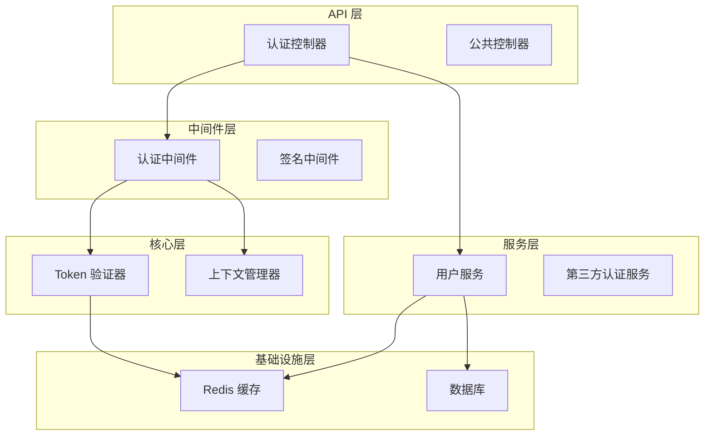
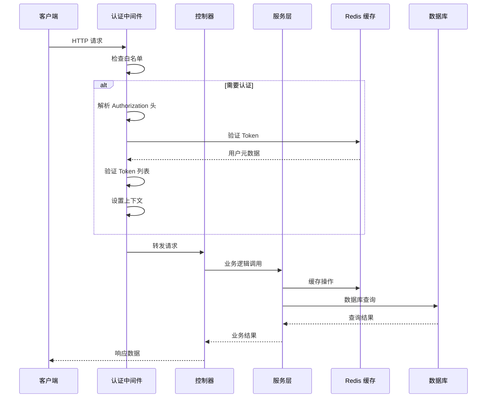
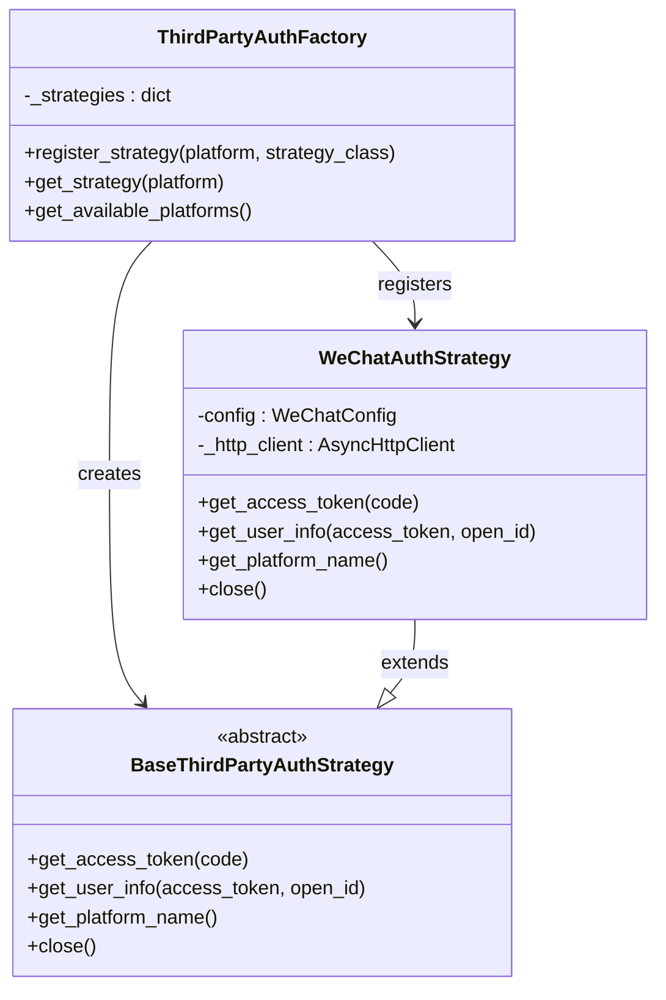
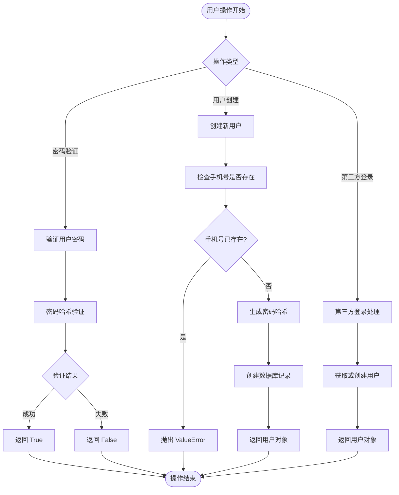
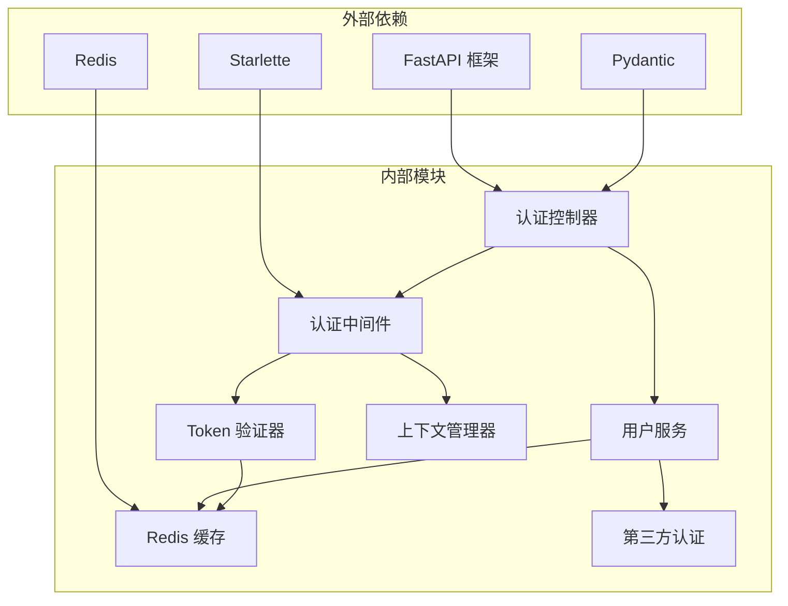

# 认证模块指南

<cite>
**本文档引用的文件**
- [internal/controllers/api/auth.py](file://internal/controllers/api/auth.py)
- [internal/core/auth.py](file://internal/core/auth.py)
- [internal/middlewares/auth.py](file://internal/middlewares/auth.py)
- [pkg/third_party_auth/factory.py](file://pkg/third_party_auth/factory.py)
- [pkg/third_party_auth/base.py](file://pkg/third_party_auth/base.py)
- [pkg/third_party_auth/strategies/wechat.py](file://pkg/third_party_auth/strategies/wechat.py)
- [internal/services/user.py](file://internal/services/user.py)
- [internal/cache/redis.py](file://internal/cache/redis.py)
- [pkg/toolkit/context.py](file://pkg/toolkit/context.py)
- [internal/config/settings.py](file://internal/config/settings.py)
- [pkg/third_party_auth/config.py](file://pkg/third_party_auth/config.py)
- [internal/app.py](file://internal/app.py)
- [docs/auth_module_guide.md](file://docs/auth_module_guide.md)
- [tests/api/test_auth.py](file://tests/api/test_auth.py)
</cite>

## 目录
1. [简介](#简介)
2. [项目结构](#项目结构)
3. [核心组件](#核心组件)
4. [架构概览](#架构概览)
5. [详细组件分析](#详细组件分析)
6. [依赖关系分析](#依赖关系分析)
7. [性能考虑](#性能考虑)
8. [故障排除指南](#故障排除指南)
9. [结论](#结论)

## 简介

本认证模块采用基于 Redis 的 Token 认证机制，提供完整的用户身份验证、授权和第三方登录功能。系统设计遵循分层架构原则，将认证逻辑与业务逻辑分离，支持多种认证方式和灵活的扩展机制。

## 项目结构

认证模块采用清晰的分层架构，主要包含以下层次：



**图表来源**
- [internal/controllers/api/auth.py](file://internal/controllers/api/auth.py#L1-L300)
- [internal/middlewares/auth.py](file://internal/middlewares/auth.py#L1-L148)
- [internal/services/user.py](file://internal/services/user.py#L1-L187)

**章节来源**
- [internal/controllers/api/auth.py](file://internal/controllers/api/auth.py#L1-L300)
- [internal/middlewares/auth.py](file://internal/middlewares/auth.py#L1-L148)
- [internal/services/user.py](file://internal/services/user.py#L1-L187)

## 核心组件

### 认证控制器 (AuthController)

认证控制器负责处理所有用户认证相关的 HTTP 请求，包括登录、注册、登出和用户信息查询。

**主要功能**：
- 用户名密码登录验证
- 用户注册和密码加密
- 微信第三方登录集成
- Token 管理和失效处理
- 当前用户信息查询

**章节来源**
- [internal/controllers/api/auth.py](file://internal/controllers/api/auth.py#L50-L300)

### 认证中间件 (ASGIAuthMiddleware)

ASGI 认证中间件是整个认证系统的核心，负责拦截所有 HTTP 请求并进行身份验证。

**核心特性**：
- 支持多种认证策略（白名单、签名认证、Token 认证）
- 基于 Redis 的 Token 验证
- 请求上下文管理
- 统一的异常处理

**章节来源**
- [internal/middlewares/auth.py](file://internal/middlewares/auth.py#L85-L148)

### Token 验证器 (TokenValidator)

Token 验证器提供底层的 Token 验证逻辑，确保 Token 的有效性和安全性。

**验证流程**：
1. 从 Redis 读取 Token 元数据
2. 验证 Token 是否存在于用户 Token 列表中
3. 返回用户身份信息

**章节来源**
- [internal/core/auth.py](file://internal/core/auth.py#L5-L24)

### 上下文管理器 (ContextManager)

上下文管理器负责在请求生命周期内维护用户状态，提供线程安全的用户信息存储。

**功能特性**：
- 基于 contextvars 的线程安全存储
- 用户 ID 和追踪 ID 管理
- 请求级状态隔离

**章节来源**
- [pkg/toolkit/context.py](file://pkg/toolkit/context.py#L1-L107)

## 架构概览

认证系统的整体架构采用分层设计，确保各层职责明确且松耦合：



**图表来源**
- [internal/middlewares/auth.py](file://internal/middlewares/auth.py#L89-L147)
- [internal/controllers/api/auth.py](file://internal/controllers/api/auth.py#L50-L200)

## 详细组件分析

### 第三方认证策略工厂

第三方认证策略工厂采用工厂模式设计，支持动态注册和管理不同的认证策略。



**图表来源**
- [pkg/third_party_auth/factory.py](file://pkg/third_party_auth/factory.py#L23-L117)
- [pkg/third_party_auth/base.py](file://pkg/third_party_auth/base.py#L27-L85)
- [pkg/third_party_auth/strategies/wechat.py](file://pkg/third_party_auth/strategies/wechat.py#L12-L138)

**章节来源**
- [pkg/third_party_auth/factory.py](file://pkg/third_party_auth/factory.py#L1-L117)
- [pkg/third_party_auth/base.py](file://pkg/third_party_auth/base.py#L1-L85)
- [pkg/third_party_auth/strategies/wechat.py](file://pkg/third_party_auth/strategies/wechat.py#L1-L138)

### 用户服务层

用户服务层提供完整的用户管理功能，包括密码验证、用户创建和第三方账号绑定。



**图表来源**
- [internal/services/user.py](file://internal/services/user.py#L23-L127)

**章节来源**
- [internal/services/user.py](file://internal/services/user.py#L1-L187)

### Redis 缓存管理

Redis 缓存层负责存储 Token 和用户元数据，提供高性能的认证状态管理。

**数据结构设计**：

```mermaid
erDiagram
TOKEN {
string key PK
string value JSON
integer ttl
}
TOKEN_LIST {
string key PK
list tokens
}
USER_METADATA {
integer id PK
string username
string phone
integer created_at
}
TOKEN ||--|| USER_METADATA : "指向"
USER_METADATA ||--o{ TOKEN : "关联"
```

**图表来源**
- [internal/cache/redis.py](file://internal/cache/redis.py#L6-L41)

**章节来源**
- [internal/cache/redis.py](file://internal/cache/redis.py#L1-L41)

## 依赖关系分析

认证模块的依赖关系呈现清晰的分层结构，避免循环依赖并确保模块间的松耦合。



**图表来源**
- [internal/app.py](file://internal/app.py#L50-L77)
- [internal/controllers/api/auth.py](file://internal/controllers/api/auth.py#L1-L30)

**章节来源**
- [internal/app.py](file://internal/app.py#L1-L107)

## 性能考虑

### 缓存策略优化

认证系统采用 Redis 作为主要缓存存储，通过合理的键命名和 TTL 策略确保高性能：

- **Token 键格式**: `token:{token_value}` - O(1) 查找复杂度
- **用户 Token 列表**: `token_list:{user_id}` - 支持快速批量操作
- **TTL 管理**: 默认 30 分钟过期，平衡安全性和性能

### 异步处理优势

系统充分利用 Python 异步特性，所有数据库和网络操作都是异步执行：

- **异步 Redis 操作**: 非阻塞的缓存访问
- **异步 HTTP 客户端**: 第三方 API 调用不会阻塞主线程
- **异步数据库操作**: ORM 查询支持并发执行

### 内存管理

- **上下文隔离**: 每个请求独立的上下文，避免内存泄漏
- **资源清理**: 自动化的连接池管理和资源释放
- **错误处理**: 完善的异常捕获和资源清理机制

## 故障排除指南

### 常见问题诊断

**Token 验证失败**
1. 检查 Redis 服务是否正常运行
2. 验证 Token 是否在正确的 TTL 内
3. 确认 Token 是否存在于用户 Token 列表中

**第三方登录异常**
1. 验证微信配置参数是否正确
2. 检查网络连接和 API 可达性
3. 查看第三方 API 返回的具体错误信息

**认证中间件问题**
1. 确认中间件是否正确注册到应用中
2. 检查请求头格式是否符合要求
3. 验证白名单配置是否正确

### 调试技巧

**启用详细日志**
- 设置 `DEBUG=True` 获取详细的请求日志
- 监控 Redis 缓存命中率
- 跟踪 Token 生命周期

**性能监控**
- 监控 Redis 延迟和内存使用
- 分析认证请求的响应时间
- 跟踪用户活跃度和 Token 使用情况

**章节来源**
- [internal/middlewares/auth.py](file://internal/middlewares/auth.py#L116-L147)
- [internal/cache/redis.py](file://internal/cache/redis.py#L19-L33)

## 结论

本认证模块设计合理，实现了高可用、高性能的身份验证解决方案。通过分层架构和清晰的职责划分，系统具备良好的可维护性和扩展性。

**主要优势**：
- 基于 Redis 的高效 Token 管理
- 支持多种认证策略的灵活扩展
- 完善的异常处理和错误恢复机制
- 清晰的代码结构和文档

**改进建议**：
- 实现密码加密验证功能
- 添加 Token 刷新机制
- 增加登录失败次数限制
- 实现多设备管理和异地登录检测

该模块为构建企业级认证系统提供了坚实的基础，可根据具体需求进一步定制和扩展。