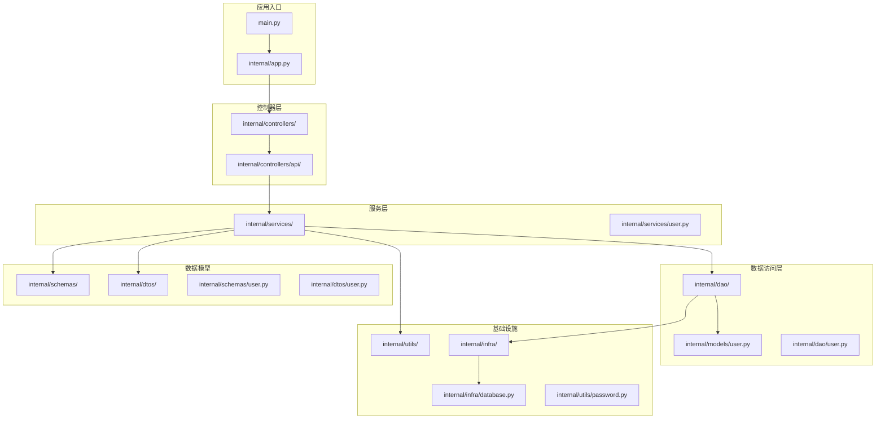
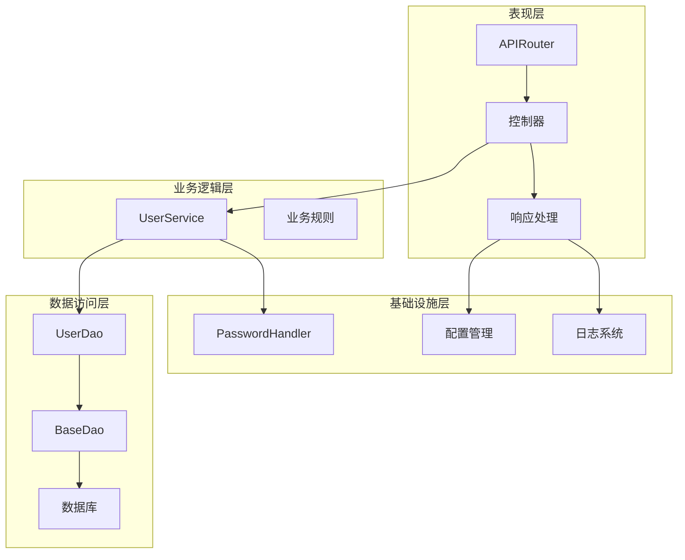
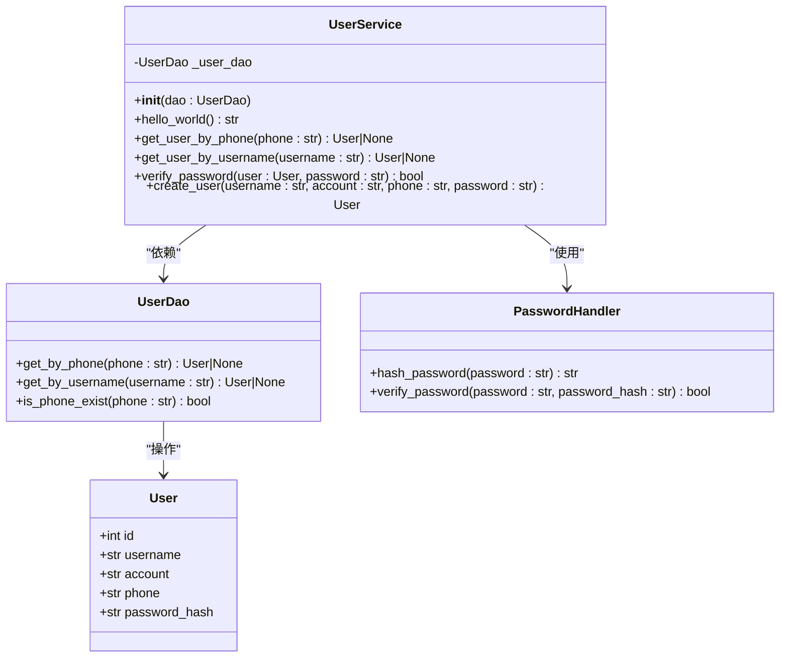
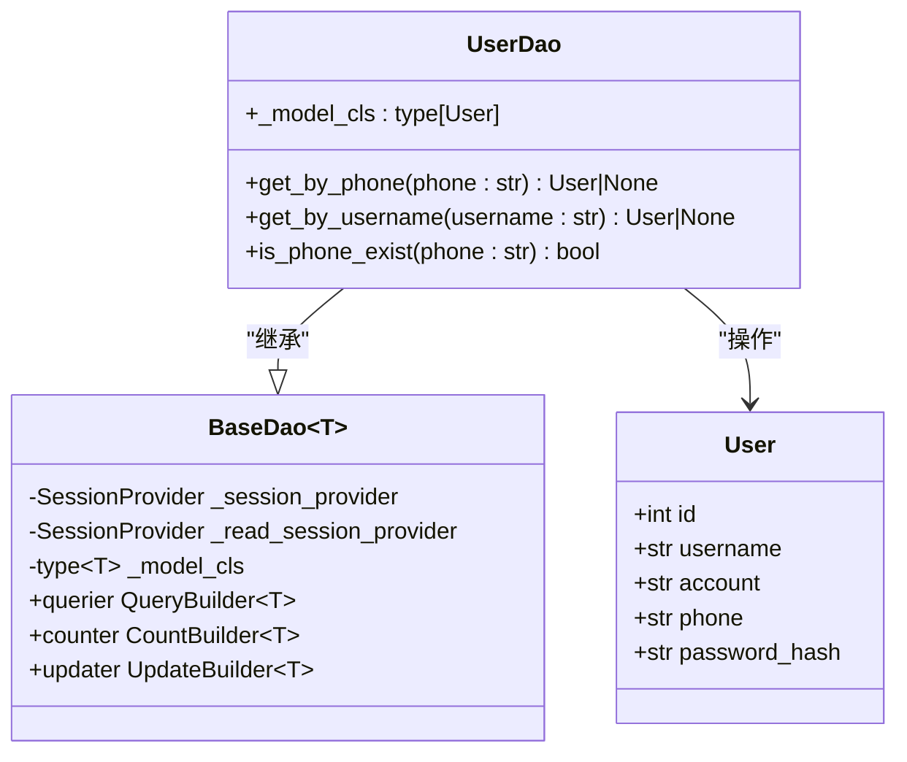
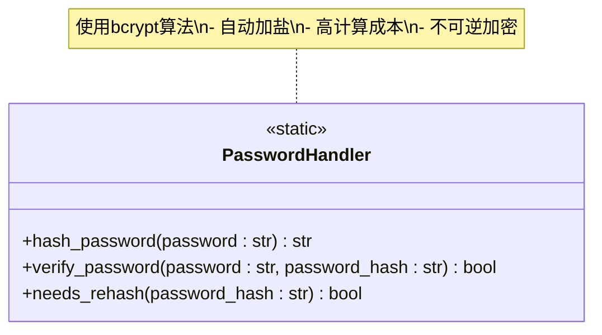
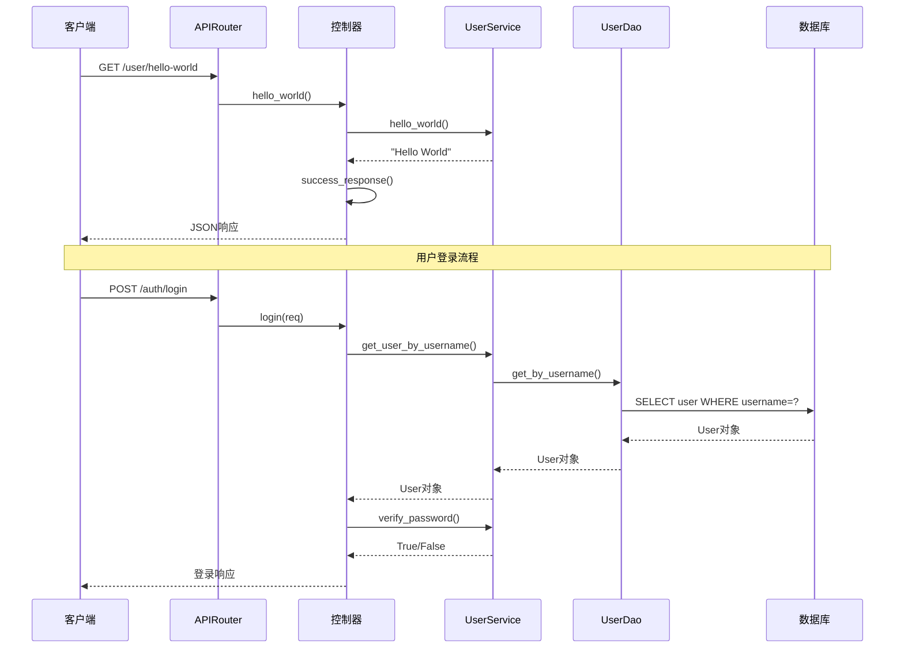
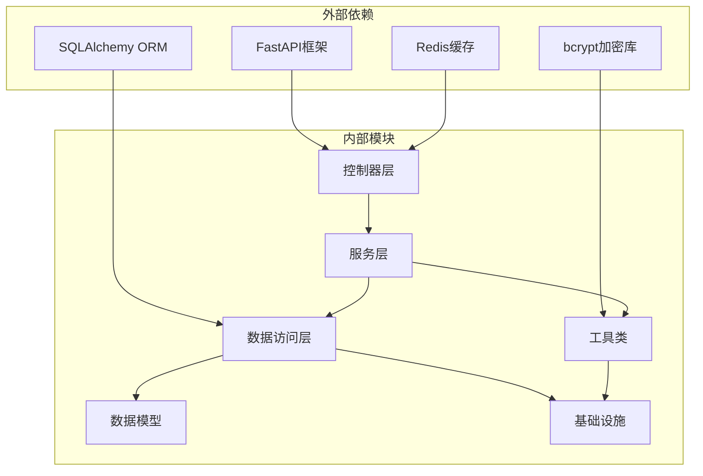
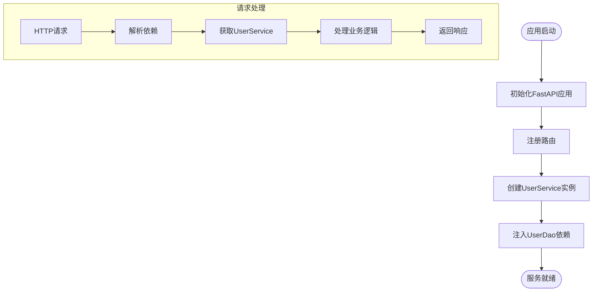
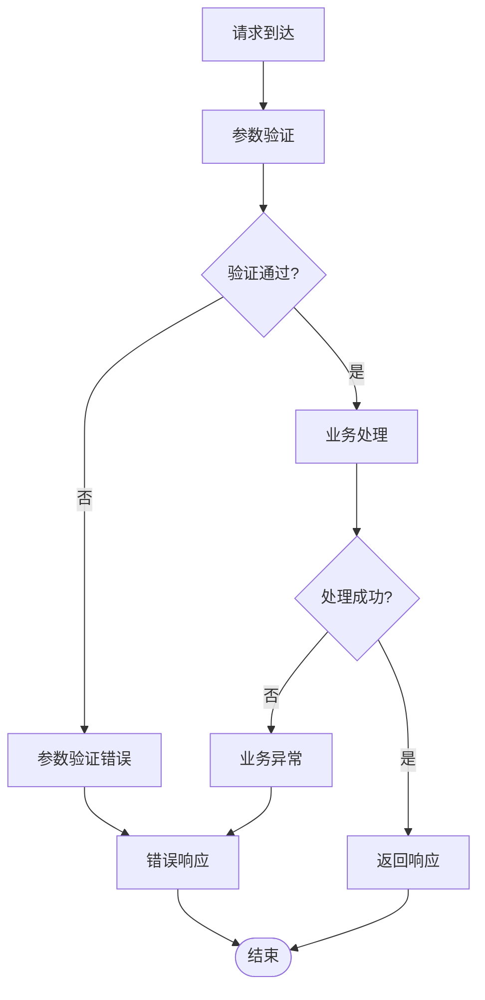

# 用户服务

<cite>
**本文档引用的文件**
- [internal/services/user.py](file://internal/services/user.py)
- [internal/controllers/api/user.py](file://internal/controllers/api/user.py)
- [internal/models/user.py](file://internal/models/user.py)
- [internal/dao/user.py](file://internal/dao/user.py)
- [internal/utils/password.py](file://internal/utils/password.py)
- [internal/schemas/user.py](file://internal/schemas/user.py)
- [internal/dtos/user.py](file://internal/dtos/user.py)
- [internal/controllers/api/auth.py](file://internal/controllers/api/auth.py)
- [internal/infra/database.py](file://internal/infra/database.py)
- [pkg/database/dao.py](file://pkg/database/dao.py)
- [pkg/database/base.py](file://pkg/database/base.py)
- [pkg/toolkit/response.py](file://pkg/toolkit/response.py)
- [internal/app.py](file://internal/app.py)
- [main.py](file://main.py)
</cite>

## 目录
1. [简介](#简介)
2. [项目结构](#项目结构)
3. [核心组件](#核心组件)
4. [架构概览](#架构概览)
5. [详细组件分析](#详细组件分析)
6. [依赖关系分析](#依赖关系分析)
7. [性能考虑](#性能考虑)
8. [故障排除指南](#故障排除指南)
9. [结论](#结论)

## 简介

用户服务是基于FastAPI构建的现代化Python后端服务的核心模块，采用分层架构设计，实现了完整的用户管理功能。该服务提供了用户注册、登录、密码验证、用户信息查询等核心功能，同时集成了现代化的开发工具链和最佳实践。

本项目遵循Clean Architecture原则，将业务逻辑与基础设施分离，通过依赖注入实现松耦合的设计。系统采用异步编程模型，支持高并发场景下的用户管理需求。

## 项目结构

项目采用清晰的分层架构，主要目录结构如下：

**图表来源**
- [main.py](file://main.py#L1-L4)
- [internal/app.py](file://internal/app.py#L15-L28)
- [internal/controllers/api/user.py](file://internal/controllers/api/user.py#L1-L17)

**章节来源**
- [main.py](file://main.py#L1-L4)
- [internal/app.py](file://internal/app.py#L15-L28)

## 核心组件

用户服务的核心组件包括UserService、UserDao、User模型以及相关的工具类和中间件。这些组件协同工作，提供完整的用户管理功能。

### 主要功能特性

- **用户认证**：支持用户名密码登录，使用bcrypt进行密码加密
- **用户注册**：提供手机号注册功能，自动处理密码加密
- **密码管理**：集成bcrypt密码哈希和验证机制
- **数据持久化**：基于SQLAlchemy ORM的异步数据库操作
- **响应处理**：统一的API响应格式和错误处理

**章节来源**
- [internal/services/user.py](file://internal/services/user.py#L6-L77)
- [internal/dao/user.py](file://internal/dao/user.py#L6-L31)

## 架构概览

用户服务采用经典的三层架构模式，通过清晰的职责分离实现高内聚低耦合的设计。

**图表来源**
- [internal/controllers/api/user.py](file://internal/controllers/api/user.py#L8-L16)
- [internal/services/user.py](file://internal/services/user.py#L6-L77)
- [internal/dao/user.py](file://internal/dao/user.py#L6-L31)

## 详细组件分析

### UserService组件

UserService是用户服务的核心业务逻辑组件，负责处理所有用户相关的业务操作。

**图表来源**
- [internal/services/user.py](file://internal/services/user.py#L6-L77)
- [internal/dao/user.py](file://internal/dao/user.py#L6-L31)
- [internal/models/user.py](file://internal/models/user.py#L7-L14)
- [internal/utils/password.py](file://internal/utils/password.py#L6-L84)

#### 核心方法分析

**用户查询方法**
- `get_user_by_phone()`: 根据手机号查询用户信息
- `get_user_by_username()`: 根据用户名查询用户信息

**密码处理方法**
- `verify_password()`: 验证用户密码的正确性
- `create_user()`: 创建新用户并处理密码加密

**章节来源**
- [internal/services/user.py](file://internal/services/user.py#L14-L66)

### UserDao组件

UserDao是数据访问层的核心组件，负责与数据库进行交互。

**图表来源**
- [internal/dao/user.py](file://internal/dao/user.py#L6-L31)
- [pkg/database/dao.py](file://pkg/database/dao.py#L15-L112)

#### 数据访问模式

UserDao采用查询构建器模式，提供了多种查询方式：

- **标准查询**: 使用`querier`属性进行基本查询
- **计数查询**: 使用`counter`属性进行数量统计
- **条件查询**: 支持等值匹配、范围查询等

**章节来源**
- [internal/dao/user.py](file://internal/dao/user.py#L9-L21)
- [pkg/database/dao.py](file://pkg/database/dao.py#L54-L112)

### PasswordHandler组件

PasswordHandler是密码处理的核心工具类，基于bcrypt算法提供安全的密码加密和验证功能。

**图表来源**
- [internal/utils/password.py](file://internal/utils/password.py#L6-L84)

#### 密码安全特性

- **自动加盐**: 每次加密都生成随机盐值
- **高成本因子**: 使用12轮加密，防止暴力破解
- **格式兼容**: 支持bcrypt.checkpw自动提取盐值

**章节来源**
- [internal/utils/password.py](file://internal/utils/password.py#L16-L83)

### API控制器

用户服务的API控制器提供了RESTful接口，支持用户相关的HTTP请求。

**图表来源**
- [internal/controllers/api/user.py](file://internal/controllers/api/user.py#L13-L16)
- [internal/controllers/api/auth.py](file://internal/controllers/api/auth.py#L47-L93)

#### API接口设计

**用户相关接口**
- `GET /user/hello-world`: 简单的健康检查接口

**认证相关接口**
- `POST /auth/login`: 用户登录接口
- `POST /auth/register`: 用户注册接口
- `POST /auth/logout`: 用户登出接口
- `GET /auth/me`: 获取当前用户信息

**章节来源**
- [internal/controllers/api/user.py](file://internal/controllers/api/user.py#L8-L16)
- [internal/controllers/api/auth.py](file://internal/controllers/api/auth.py#L21-L214)

## 依赖关系分析

用户服务的依赖关系体现了清晰的分层架构设计，各层之间通过抽象接口进行通信。

**图表来源**
- [internal/app.py](file://internal/app.py#L1-L107)
- [internal/services/user.py](file://internal/services/user.py#L1-L3)

### 依赖注入机制

系统采用依赖注入模式，通过FastAPI的Depends机制实现组件间的解耦。

**图表来源**
- [internal/app.py](file://internal/app.py#L31-L41)
- [internal/services/user.py](file://internal/services/user.py#L69-L77)

**章节来源**
- [internal/app.py](file://internal/app.py#L31-L77)
- [internal/services/user.py](file://internal/services/user.py#L69-L77)

## 性能考虑

用户服务在设计时充分考虑了性能优化，采用了多种策略来提升系统的响应速度和吞吐量。

### 数据库性能优化

**连接池配置**
- 主库连接池：10个连接，最大溢出20个
- 读库连接池：20个连接，适合高并发查询
- 连接预检：启用pool_pre_ping确保连接有效性
- 连接回收：1800秒自动回收，防止连接泄漏

**查询优化策略**
- 读写分离：写操作强制使用主库，读操作可使用只读副本
- 查询构建器：提供链式API，减少SQL拼接错误
- 批量操作：支持批量插入和更新，提升数据处理效率

### 缓存策略

**Redis集成**
- Token缓存：用户登录令牌存储，支持快速验证
- 用户信息缓存：热点用户数据缓存，减少数据库查询
- 过期策略：合理设置TTL，平衡内存使用和查询性能

### 异步处理

**异步编程模型**
- 全面采用async/await语法，提升I/O密集型操作性能
- 数据库操作使用异步ORM，避免阻塞主线程
- 文件操作和网络请求异步化，提升整体吞吐量

## 故障排除指南

### 常见问题及解决方案

**数据库连接问题**
- 症状：应用启动时报数据库连接错误
- 解决方案：检查数据库连接URI配置，确认数据库服务正常运行

**密码验证失败**
- 症状：用户登录时密码验证总是失败
- 解决方案：确认bcrypt库版本兼容性，检查密码哈希格式

**依赖注入错误**
- 症状：运行时出现依赖解析错误
- 解决方案：检查new_user_service工厂函数，确认UserDao实例化正确

**章节来源**
- [internal/infra/database.py](file://internal/infra/database.py#L30-L102)
- [internal/utils/password.py](file://internal/utils/password.py#L57-L68)

### 错误处理机制

系统采用统一的错误处理机制，确保异常情况下的稳定性和可维护性。

**图表来源**
- [pkg/toolkit/response.py](file://pkg/toolkit/response.py#L184-L203)

## 结论

用户服务是一个设计精良、架构清晰的现代化Python后端服务。通过采用分层架构、依赖注入和异步编程等现代技术，系统具备了良好的可扩展性、可维护性和性能表现。

### 主要优势

1. **架构清晰**: 清晰的分层设计使得代码职责明确，易于理解和维护
2. **安全性强**: 采用bcrypt加密、参数验证等多重安全措施
3. **性能优秀**: 异步编程、连接池、缓存策略等优化手段
4. **可扩展性**: 模块化设计支持功能扩展和业务增长

### 技术亮点

- **异步架构**: 全面采用异步编程模型，提升系统性能
- **依赖注入**: 通过FastAPI依赖注入实现松耦合设计
- **数据访问层**: 基于SQLAlchemy ORM的类型安全数据操作
- **统一响应**: 标准化的API响应格式和错误处理机制

该用户服务为后续的功能扩展和系统演进奠定了坚实的基础，是一个值得参考的优秀项目模板。