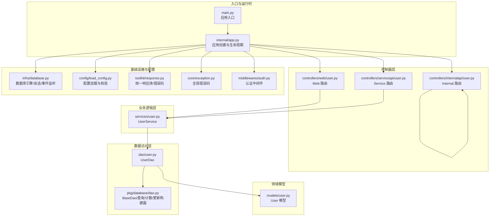
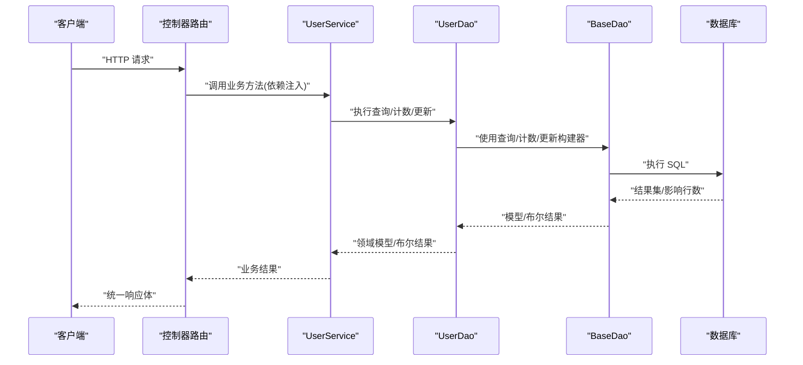
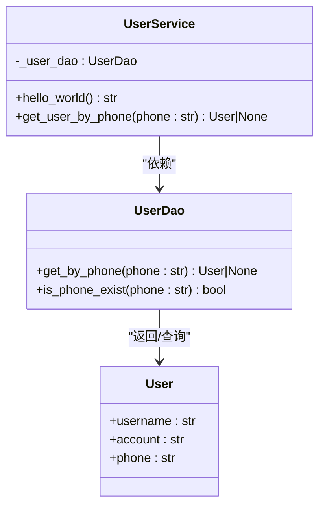
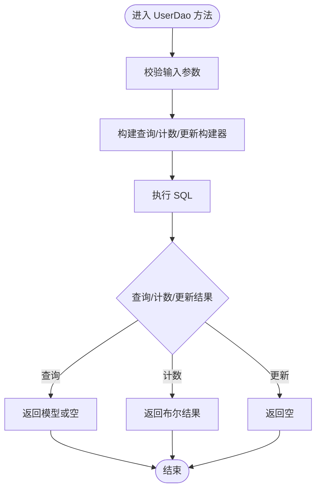
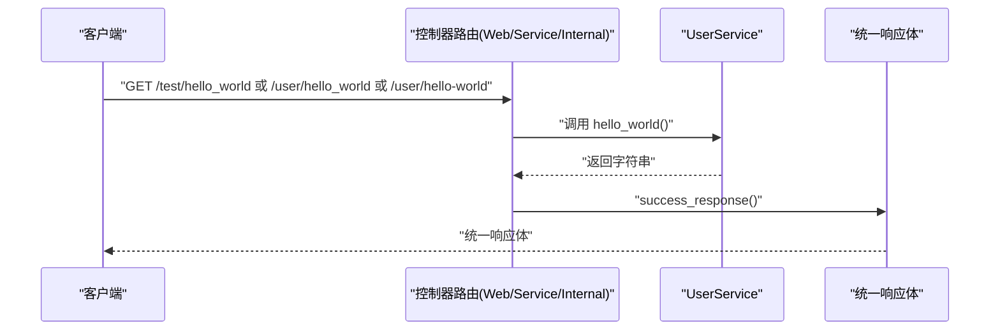
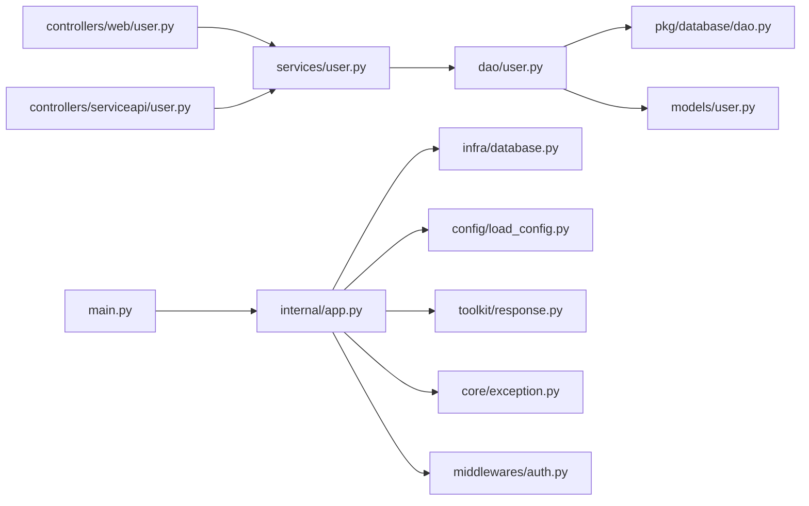

# 业务逻辑层

<cite>
**本文引用的文件**
- [internal/services/user.py](file://internal/services/user.py)
- [internal/dao/user.py](file://internal/dao/user.py)
- [internal/models/user.py](file://internal/models/user.py)
- [pkg/database/dao.py](file://pkg/database/dao.py)
- [internal/controllers/serviceapi/user.py](file://internal/controllers/serviceapi/user.py)
- [internal/controllers/web/user.py](file://internal/controllers/web/user.py)
- [internal/controllers/internalapi/user.py](file://internal/controllers/internalapi/user.py)
- [internal/app.py](file://internal/app.py)
- [main.py](file://main.py)
- [internal/infra/database.py](file://internal/infra/database.py)
- [internal/config/load_config.py](file://internal/config/load_config.py)
- [pkg/toolkit/response.py](file://pkg/toolkit/response.py)
- [internal/core/exception.py](file://internal/core/exception.py)
- [internal/middlewares/auth.py](file://internal/middlewares/auth.py)
</cite>

## 目录
1. [引言](#引言)
2. [项目结构](#项目结构)
3. [核心组件](#核心组件)
4. [架构总览](#架构总览)
5. [组件详解](#组件详解)
6. [依赖关系分析](#依赖关系分析)
7. [性能考量](#性能考量)
8. [故障排查指南](#故障排查指南)
9. [结论](#结论)
10. [附录](#附录)

## 引言
本文件聚焦于业务逻辑层（Service 层）的实现与设计，围绕用户服务展开，系统性阐述其职责边界、调用关系、接口契约、领域模型、配置项、参数与返回值约定、与其他组件的集成方式，以及异常处理与常见问题的解决方案。目标是帮助初学者快速理解整体架构与实现要点，同时为有经验的开发者提供足够的技术深度。

## 项目结构
本项目采用分层架构：控制器（Controllers）负责路由与请求入口，业务逻辑（Services）封装领域行为，数据访问（DAO）负责与持久层交互，模型（Models）承载数据结构，工具与基础设施（Infra/Config/Responses/Exceptions/Middlewares）提供支撑能力。

图表来源
- [main.py](file://main.py#L1-L18)
- [internal/app.py](file://internal/app.py#L1-L109)
- [internal/controllers/web/user.py](file://internal/controllers/web/user.py#L1-L17)
- [internal/controllers/serviceapi/user.py](file://internal/controllers/serviceapi/user.py#L1-L21)
- [internal/controllers/internalapi/user.py](file://internal/controllers/internalapi/user.py#L1-L11)
- [internal/services/user.py](file://internal/services/user.py#L1-L21)
- [internal/dao/user.py](file://internal/dao/user.py#L1-L24)
- [pkg/database/dao.py](file://pkg/database/dao.py#L1-L203)
- [internal/models/user.py](file://internal/models/user.py#L1-L13)
- [internal/infra/database.py](file://internal/infra/database.py#L1-L154)
- [internal/config/load_config.py](file://internal/config/load_config.py#L1-L243)
- [pkg/toolkit/response.py](file://pkg/toolkit/response.py#L1-L233)
- [internal/core/exception.py](file://internal/core/exception.py#L1-L38)
- [internal/middlewares/auth.py](file://internal/middlewares/auth.py#L1-L150)

章节来源
- [internal/app.py](file://internal/app.py#L17-L109)
- [main.py](file://main.py#L1-L18)

## 核心组件
- 用户服务（UserService）
  - 职责：对外暴露业务方法，协调 DAO 完成用户相关操作；当前包含“hello_world”演示方法与“按手机号查询用户”的业务方法。
  - 依赖注入：通过工厂函数提供单例实例，便于在控制器中注入。
  - 方法概览：
    - hello_world：无参数，返回字符串。
    - get_user_by_phone：接收手机号字符串，返回用户模型或空。
- 用户数据访问（UserDao）
  - 职责：基于 BaseDao 封装查询、计数、更新等通用能力，面向 User 模型提供具体查询方法。
  - 方法概览：
    - get_by_phone：按手机号查询用户。
    - is_phone_exist：判断手机号是否存在。
- 用户模型（User）
  - 职责：ORM 映射，定义用户表结构字段。
  - 字段：用户名、账号、手机号。
- 控制器（Service/Web/Internal）
  - 职责：定义路由、参数、返回值，注入 Service 并调用其方法，最终通过统一响应体返回。
- 基础设施与配置
  - 数据库：异步引擎、会话管理、SQL 监听与慢查询日志。
  - 配置：环境变量加载、敏感字段解密、数据库/Redis 连接串生成。
  - 响应：统一响应体、错误码、SSE 辅助。
  - 异常：全局错误码与自定义异常封装。
  - 中间件：认证（Token/签名）、CORS、GZip、请求记录。

章节来源
- [internal/services/user.py](file://internal/services/user.py#L1-L21)
- [internal/dao/user.py](file://internal/dao/user.py#L1-L24)
- [internal/models/user.py](file://internal/models/user.py#L1-L13)
- [internal/controllers/serviceapi/user.py](file://internal/controllers/serviceapi/user.py#L1-L21)
- [internal/controllers/web/user.py](file://internal/controllers/web/user.py#L1-L17)
- [internal/controllers/internalapi/user.py](file://internal/controllers/internalapi/user.py#L1-L11)
- [internal/infra/database.py](file://internal/infra/database.py#L1-L154)
- [internal/config/load_config.py](file://internal/config/load_config.py#L1-L243)
- [pkg/toolkit/response.py](file://pkg/toolkit/response.py#L1-L233)
- [internal/core/exception.py](file://internal/core/exception.py#L1-L38)
- [internal/middlewares/auth.py](file://internal/middlewares/auth.py#L1-L150)

## 架构总览
下图展示从请求进入应用到业务处理与数据访问的整体流程，以及各层之间的依赖关系。

图表来源
- [internal/controllers/serviceapi/user.py](file://internal/controllers/serviceapi/user.py#L14-L21)
- [internal/services/user.py](file://internal/services/user.py#L10-L15)
- [internal/dao/user.py](file://internal/dao/user.py#L9-L17)
- [pkg/database/dao.py](file://pkg/database/dao.py#L47-L90)
- [internal/infra/database.py](file://internal/infra/database.py#L85-L111)

## 组件详解

### 用户服务（UserService）
- 设计要点
  - 通过构造函数注入 UserDao 实例，遵循依赖倒置原则，便于单元测试替换。
  - 业务方法尽量只接受必要参数，避免携带请求对象，提升可测试性与内聚性。
  - 提供工厂函数 new_user_service，集中管理依赖注入与单例。
- 方法说明
  - hello_world
    - 输入：无
    - 返回：字符串
    - 用途：演示服务方法的最小实现
  - get_user_by_phone
    - 输入：手机号（字符串）
    - 返回：用户模型或空
    - 业务规则：按手机号精确查询，若不存在返回空
- 依赖关系
  - 依赖 UserDao 完成数据查询
  - 间接依赖 BaseDao 的查询构建器与会话提供者

图表来源
- [internal/services/user.py](file://internal/services/user.py#L5-L21)
- [internal/dao/user.py](file://internal/dao/user.py#L6-L24)
- [internal/models/user.py](file://internal/models/user.py#L7-L13)

章节来源
- [internal/services/user.py](file://internal/services/user.py#L1-L21)

### 用户数据访问（UserDao）
- 设计要点
  - 继承 BaseDao，复用查询、计数、更新构建器，减少重复代码。
  - 通过属性化查询构建器（QueryBuilder/CountBuilder/UpdateBuilder）表达业务查询意图。
  - 通过会话提供者（SessionProvider）获取异步会话，保证事务与连接管理一致性。
- 方法说明
  - get_by_phone
    - 输入：手机号（字符串）
    - 返回：用户模型或空
    - 行为：等值查询，按更新时间降序排列
  - is_phone_exist
    - 输入：手机号（字符串）
    - 返回：布尔值
    - 行为：基于计数器判断是否存在
- 事务与会话
  - 通过 BaseDao 的会话提供者与上下文管理器，确保异常时自动回滚与资源释放。

图表来源
- [internal/dao/user.py](file://internal/dao/user.py#L9-L17)
- [pkg/database/dao.py](file://pkg/database/dao.py#L47-L90)

章节来源
- [internal/dao/user.py](file://internal/dao/user.py#L1-L24)
- [pkg/database/dao.py](file://pkg/database/dao.py#L1-L203)

### 用户模型（User）
- 字段定义
  - username：字符串，最大长度见模型定义
  - account：字符串，最大长度见模型定义
  - phone：字符串，固定长度约束见模型定义
- 作用
  - 作为 SQLAlchemy ORM 映射，承载用户数据结构
  - 与 UserDao 的查询构建器配合完成数据读写

章节来源
- [internal/models/user.py](file://internal/models/user.py#L1-L13)

### 控制器（Service/Web/Internal）
- Web 路由
  - 路由前缀：/test
  - 方法：/hello_world
  - 依赖注入：UserServiceDep
  - 返回：统一成功响应
- Service 路由
  - 路由前缀：/user
  - 方法：/hello_world
  - 依赖注入：UserServiceDep
  - 返回：统一成功响应
- Internal 路由
  - 路由前缀：/user
  - 方法：/hello-world
  - 返回：统一成功响应（无业务逻辑）

图表来源
- [internal/controllers/web/user.py](file://internal/controllers/web/user.py#L13-L17)
- [internal/controllers/serviceapi/user.py](file://internal/controllers/serviceapi/user.py#L14-L21)
- [internal/controllers/internalapi/user.py](file://internal/controllers/internalapi/user.py#L8-L11)
- [pkg/toolkit/response.py](file://pkg/toolkit/response.py#L181-L186)

章节来源
- [internal/controllers/web/user.py](file://internal/controllers/web/user.py#L1-L17)
- [internal/controllers/serviceapi/user.py](file://internal/controllers/serviceapi/user.py#L1-L21)
- [internal/controllers/internalapi/user.py](file://internal/controllers/internalapi/user.py#L1-L11)

### 基础设施与配置
- 数据库
  - 初始化：创建异步引擎、注册 SQL 监听事件、创建会话工厂
  - 会话：上下文管理器，支持自动回滚与异常处理
  - 慢查询：基于阈值输出日志
- 配置
  - 环境检测：优先系统环境变量，其次 .secrets 文件
  - 连接串：根据数据库类型动态生成
  - 敏感字段：AES 解密
- 响应
  - 统一响应体：code/message/data
  - 错误码：全局错误码枚举
  - SSE：辅助包装
- 异常
  - 自定义异常：AppException，承载错误码与消息
  - 全局错误码：客户端/服务端错误码集合
- 中间件
  - 认证：白名单放行、内部接口签名、外部接口 Token
  - CORS/GZip/记录：性能与可观测性

章节来源
- [internal/infra/database.py](file://internal/infra/database.py#L26-L111)
- [internal/config/load_config.py](file://internal/config/load_config.py#L179-L243)
- [pkg/toolkit/response.py](file://pkg/toolkit/response.py#L14-L233)
- [internal/core/exception.py](file://internal/core/exception.py#L1-L38)
- [internal/middlewares/auth.py](file://internal/middlewares/auth.py#L88-L150)

## 依赖关系分析
- 控制器到服务
  - 控制器通过依赖注入获取 UserService 实例，调用业务方法后统一返回响应。
- 服务到数据访问
  - UserService 依赖 UserDao，UserDao 继承 BaseDao，复用查询/计数/更新构建器。
- 数据访问到基础设施
  - UserDao 通过会话提供者获取 AsyncSession，执行 SQL；BaseDao 提供事务执行器 execute_transaction。
- 应用生命周期
  - main.py 创建应用实例，internal/app.py 注册路由、异常、中间件与生命周期事件；数据库与 Redis 初始化在 lifespan 中完成。

图表来源
- [internal/controllers/web/user.py](file://internal/controllers/web/user.py#L1-L17)
- [internal/controllers/serviceapi/user.py](file://internal/controllers/serviceapi/user.py#L1-L21)
- [internal/services/user.py](file://internal/services/user.py#L1-L21)
- [internal/dao/user.py](file://internal/dao/user.py#L1-L24)
- [pkg/database/dao.py](file://pkg/database/dao.py#L1-L203)
- [internal/models/user.py](file://internal/models/user.py#L1-L13)
- [main.py](file://main.py#L1-L18)
- [internal/app.py](file://internal/app.py#L1-L109)
- [internal/infra/database.py](file://internal/infra/database.py#L1-L154)
- [internal/config/load_config.py](file://internal/config/load_config.py#L1-L243)
- [pkg/toolkit/response.py](file://pkg/toolkit/response.py#L1-L233)
- [internal/core/exception.py](file://internal/core/exception.py#L1-L38)
- [internal/middlewares/auth.py](file://internal/middlewares/auth.py#L1-L150)

章节来源
- [internal/app.py](file://internal/app.py#L33-L82)
- [main.py](file://main.py#L1-L18)

## 性能考量
- 数据库连接池
  - 连接池大小、超时与回收策略已在数据库初始化中配置，建议结合压测结果调整。
- 查询优化
  - 使用查询构建器的等值/范围/排序组合，避免 N+1 查询；必要时引入子查询或批量查询。
- 响应序列化
  - 统一使用高性能 JSON 序列化，减少序列化开销。
- 中间件
  - GZip 压缩与请求记录有助于网络传输与可观测性，注意在高并发场景下的 CPU 开销平衡。

## 故障排查指南
- 配置加载失败
  - 症状：启动时报错，提示缺少 .secrets 或环境配置文件
  - 处理：确认 APP_ENV、.secrets 与对应 .env.* 文件存在且格式正确
- 数据库未初始化
  - 症状：获取会话时报错，提示数据库未初始化
  - 处理：确保在 lifespan 中调用初始化函数，或在使用前显式初始化
- 认证失败
  - 症状：内部接口签名失败或外部接口 Token 无效
  - 处理：核对签名头与 Token，确认中间件白名单与路径前缀配置
- 响应异常
  - 症状：统一响应体返回类型不匹配
  - 处理：确保返回数据为 dict/list/Pydantic 模型或 None

章节来源
- [internal/config/load_config.py](file://internal/config/load_config.py#L186-L214)
- [internal/infra/database.py](file://internal/infra/database.py#L85-L111)
- [internal/middlewares/auth.py](file://internal/middlewares/auth.py#L119-L149)
- [pkg/toolkit/response.py](file://pkg/toolkit/response.py#L101-L133)

## 结论
用户服务层通过清晰的职责划分与依赖注入，实现了业务逻辑与数据访问的解耦；配合统一的响应体、错误码与中间件体系，提供了良好的可维护性与扩展性。建议在后续迭代中补充更丰富的业务方法与校验逻辑，并持续完善测试与监控。

## 附录

### 接口与返回值约定
- 控制器到服务
  - 入参：控制器从请求中解析参数，传递给服务方法
  - 出参：服务方法返回领域模型或布尔结果
- 服务到控制器
  - 返回：统一成功响应体，data 字段承载业务数据
- 错误处理
  - 全局错误码：BadRequest、Unauthorized、InvalidSignature、Forbidden、NotFound、PayloadTooLarge、UnprocessableEntity、InternalServerError
  - 自定义异常：AppException，承载错误码与消息

章节来源
- [internal/controllers/serviceapi/user.py](file://internal/controllers/serviceapi/user.py#L14-L21)
- [internal/controllers/web/user.py](file://internal/controllers/web/user.py#L13-L17)
- [pkg/toolkit/response.py](file://pkg/toolkit/response.py#L181-L200)
- [internal/core/exception.py](file://internal/core/exception.py#L19-L38)