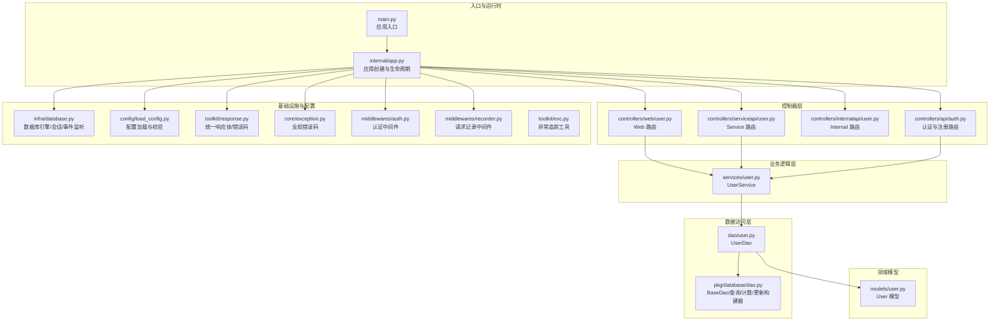
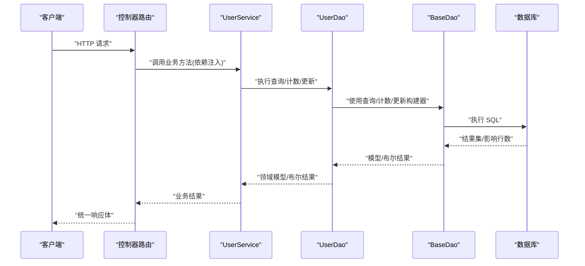
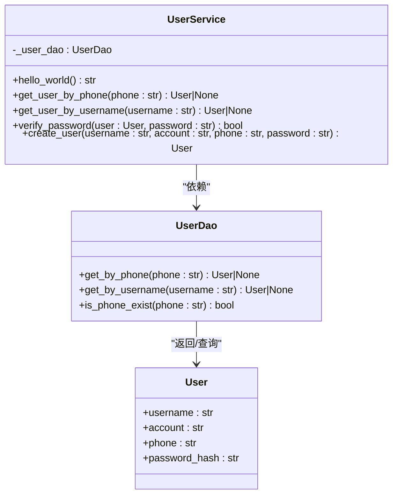
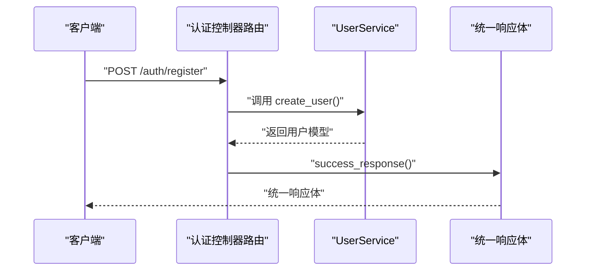
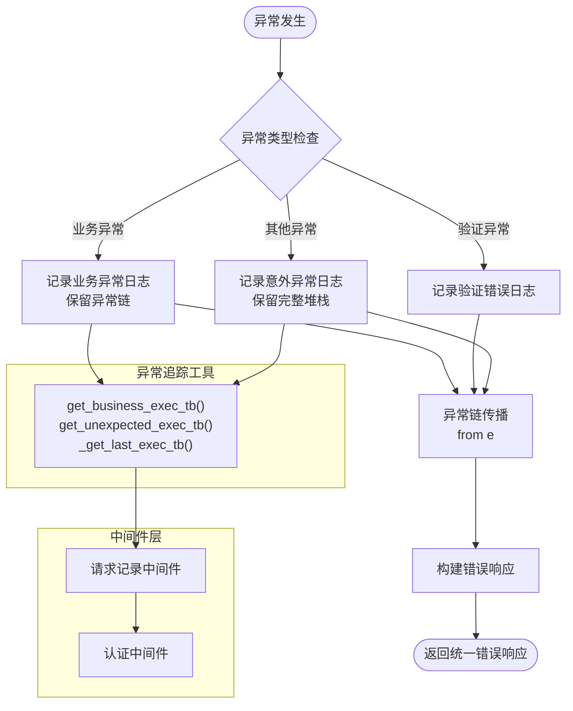
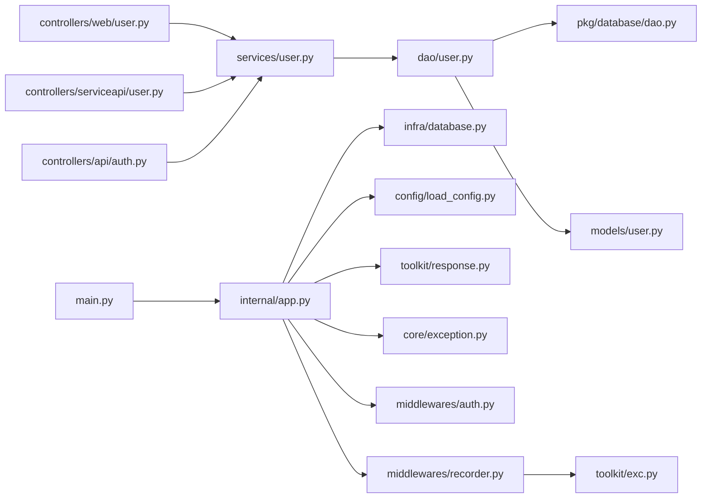

# 业务逻辑层

<cite>
**本文引用的文件**
- [internal/services/user.py](file://internal/services/user.py)
- [internal/dao/user.py](file://internal/dao/user.py)
- [internal/models/user.py](file://internal/models/user.py)
- [pkg/database/dao.py](file://pkg/database/dao.py)
- [internal/controllers/api/auth.py](file://internal/controllers/api/auth.py)
- [internal/controllers/serviceapi/user.py](file://internal/controllers/serviceapi/user.py)
- [internal/controllers/web/user.py](file://internal/controllers/web/user.py)
- [internal/controllers/internalapi/user.py](file://internal/controllers/internalapi/user.py)
- [internal/app.py](file://internal/app.py)
- [main.py](file://main.py)
- [internal/infra/database.py](file://internal/infra/database.py)
- [internal/config/load_config.py](file://internal/config/load_config.py)
- [pkg/toolkit/response.py](file://pkg/toolkit/response.py)
- [internal/core/exception.py](file://internal/core/exception.py)
- [internal/middlewares/auth.py](file://internal/middlewares/auth.py)
- [internal/middlewares/recorder.py](file://internal/middlewares/recorder.py)
- [pkg/toolkit/exc.py](file://pkg/toolkit/exc.py)
</cite>

## 更新摘要
**变更内容**
- 新增异常处理增强章节，重点介绍注册流程的异常链支持
- 更新异常处理架构图，展示异常链传播机制
- 增强异常日志记录与调试能力说明
- 补充异常处理最佳实践与调试技巧

## 目录
1. [引言](#引言)
2. [项目结构](#项目结构)
3. [核心组件](#核心组件)
4. [架构总览](#架构总览)
5. [组件详解](#组件详解)
6. [异常处理增强](#异常处理增强)
7. [依赖关系分析](#依赖关系分析)
8. [性能考量](#性能考量)
9. [故障排查指南](#故障排查指南)
10. [结论](#结论)
11. [附录](#附录)

## 引言
本文件聚焦于业务逻辑层（Service 层）的实现与设计，围绕用户服务展开，系统性阐述其职责边界、调用关系、接口契约、领域模型、配置项、参数与返回值约定、与其他组件的集成方式，以及异常处理与常见问题的解决方案。特别关注最新的异常处理增强功能，包括异常链支持、调试效率提升等改进。目标是帮助初学者快速理解整体架构与实现要点，同时为有经验的开发者提供足够的技术深度。

## 项目结构
本项目采用分层架构：控制器（Controllers）负责路由与请求入口，业务逻辑（Services）封装领域行为，数据访问（DAO）负责与持久层交互，模型（Models）承载数据结构，工具与基础设施（Infra/Config/Responses/Exceptions/Middlewares）提供支撑能力。


```mermaid
graph TB
subgraph "入口与运行时"
MAIN["main.py<br/>应用入口"]
APP["internal/app.py<br/>应用创建与生命周期"]
end
subgraph "控制器层"
CTRL_WEB["controllers/web/user.py<br/>Web 路由"]
CTRL_SVC["controllers/serviceapi/user.py<br/>Service 路由"]
CTRL_INT["controllers/internalapi/user.py<br/>Internal 路由"]
CTRL_AUTH["controllers/api/auth.py<br/>认证与注册路由"]
end
subgraph "业务逻辑层"
SVC_USER["services/user.py<br/>UserService"]
end
subgraph "数据访问层"
DAO_USER["dao/user.py<br/>UserDao"]
DAO_BASE["pkg/database/dao.py<br/>BaseDao/查询/计数/更新构建器"]
end
subgraph "领域模型"
MODEL_USER["models/user.py<br/>User 模型"]
end
subgraph "基础设施与配置"
INFRA_DB["infra/database.py<br/>数据库引擎/会话/事件监听"]
CFG["config/load_config.py<br/>配置加载与校验"]
RESP["toolkit/response.py<br/>统一响应体/错误码"]
EXC["core/exception.py<br/>全局错误码"]
MW_AUTH["middlewares/auth.py<br/>认证中间件"]
MW_RECORDER["middlewares/recorder.py<br/>请求记录中间件"]
TOOL_EXC["toolkit/exc.py<br/>异常追踪工具"]
end
MAIN --> APP
APP --> CTRL_WEB
APP --> CTRL_SVC
APP --> CTRL_INT
APP --> CTRL_AUTH
CTRL_WEB --> SVC_USER
CTRL_SVC --> SVC_USER
CTRL_AUTH --> SVC_USER
SVC_USER --> DAO_USER
DAO_USER --> DAO_BASE
DAO_USER --> MODEL_USER
APP --> INFRA_DB
APP --> MW_AUTH
APP --> MW_RECORDER
APP --> RESP
APP --> EXC
APP --> CFG
```

**图表来源**
- [main.py](file://main.py#L1-L18)
- [internal/app.py](file://internal/app.py#L1-L109)
- [internal/controllers/web/user.py](file://internal/controllers/web/user.py#L1-L17)
- [internal/controllers/serviceapi/user.py](file://internal/controllers/serviceapi/user.py#L1-L21)
- [internal/controllers/internalapi/user.py](file://internal/controllers/internalapi/user.py#L1-L11)
- [internal/controllers/api/auth.py](file://internal/controllers/api/auth.py#L1-L214)
- [internal/services/user.py](file://internal/services/user.py#L1-L77)
- [internal/dao/user.py](file://internal/dao/user.py#L1-L31)
- [pkg/database/dao.py](file://pkg/database/dao.py#L1-L224)
- [internal/models/user.py](file://internal/models/user.py#L1-L13)
- [internal/infra/database.py](file://internal/infra/database.py#L1-L154)
- [internal/config/load_config.py](file://internal/config/load_config.py#L1-L243)
- [pkg/toolkit/response.py](file://pkg/toolkit/response.py#L1-L235)
- [internal/core/exception.py](file://internal/core/exception.py#L1-L37)
- [internal/middlewares/auth.py](file://internal/middlewares/auth.py#L1-L147)
- [internal/middlewares/recorder.py](file://internal/middlewares/recorder.py#L1-L148)
- [pkg/toolkit/exc.py](file://pkg/toolkit/exc.py#L1-L16)

**章节来源**
- [internal/app.py](file://internal/app.py#L17-L109)
- [main.py](file://main.py#L1-L18)

## 核心组件
- 用户服务（UserService）
  - 职责：对外暴露业务方法，协调 DAO 完成用户相关操作；当前包含"hello_world"演示方法、"按手机号查询用户"和"用户注册"的业务方法。
  - 依赖注入：通过工厂函数提供单例实例，便于在控制器中注入。
  - 方法概览：
    - hello_world：无参数，返回字符串。
    - get_user_by_phone：接收手机号字符串，返回用户模型或空。
    - get_user_by_username：接收用户名字符串，返回用户模型或空。
    - verify_password：验证用户密码，返回布尔值。
    - create_user：创建新用户，包含密码加密与手机号唯一性检查。
- 用户数据访问（UserDao）
  - 职责：基于 BaseDao 封装查询、计数、更新等通用能力，面向 User 模型提供具体查询方法。
  - 方法概览：
    - get_by_phone：按手机号查询用户。
    - get_by_username：按用户名查询用户。
    - is_phone_exist：判断手机号是否存在。
- 用户模型（User）
  - 职责：ORM 映射，定义用户表结构字段。
  - 字段：用户名、账号、手机号、密码哈希等。
- 控制器（Service/Web/Internal/Auth）
  - 职责：定义路由、参数、返回值，注入 Service 并调用其方法，最终通过统一响应体返回。
  - 特别：新增认证控制器，支持用户注册、登录、登出等功能。
- 基础设施与配置
  - 数据库：异步引擎、会话管理、SQL 监听与慢查询日志。
  - 配置：环境变量加载、敏感字段解密、数据库/Redis 连接串生成。
  - 响应：统一响应体、错误码、SSE 辅助。
  - 异常：全局错误码与自定义异常封装，支持异常链。
  - 中间件：认证（Token/签名）、CORS、GZip、请求记录，增强异常日志记录。

**章节来源**
- [internal/services/user.py](file://internal/services/user.py#L1-L77)
- [internal/dao/user.py](file://internal/dao/user.py#L1-L31)
- [internal/models/user.py](file://internal/models/user.py#L1-L13)
- [internal/controllers/api/auth.py](file://internal/controllers/api/auth.py#L1-L214)
- [internal/controllers/serviceapi/user.py](file://internal/controllers/serviceapi/user.py#L1-L21)
- [internal/controllers/web/user.py](file://internal/controllers/web/user.py#L1-L17)
- [internal/controllers/internalapi/user.py](file://internal/controllers/internalapi/user.py#L1-L11)
- [internal/infra/database.py](file://internal/infra/database.py#L1-L154)
- [internal/config/load_config.py](file://internal/config/load_config.py#L1-L243)
- [pkg/toolkit/response.py](file://pkg/toolkit/response.py#L1-L235)
- [internal/core/exception.py](file://internal/core/exception.py#L1-L37)
- [internal/middlewares/auth.py](file://internal/middlewares/auth.py#L1-L147)
- [internal/middlewares/recorder.py](file://internal/middlewares/recorder.py#L1-L148)
- [pkg/toolkit/exc.py](file://pkg/toolkit/exc.py#L1-L16)

## 架构总览
下图展示从请求进入应用到业务处理与数据访问的整体流程，以及各层之间的依赖关系。


```mermaid
sequenceDiagram
participant Client as "客户端"
participant Router as "控制器路由"
participant Service as "UserService"
participant Dao as "UserDao"
participant BaseDao as "BaseDao"
participant DB as "数据库"
Client->>Router : "HTTP 请求"
Router->>Service : "调用业务方法(依赖注入)"
Service->>Dao : "执行查询/计数/更新"
Dao->>BaseDao : "使用查询/计数/更新构建器"
BaseDao->>DB : "执行 SQL"
DB-->>BaseDao : "结果集/影响行数"
BaseDao-->>Dao : "模型/布尔结果"
Dao-->>Service : "领域模型/布尔结果"
Service-->>Router : "业务结果"
Router-->>Client : "统一响应体"
```

**图表来源**
- [internal/controllers/api/auth.py](file://internal/controllers/api/auth.py#L133-L184)
- [internal/services/user.py](file://internal/services/user.py#L38-L66)
- [internal/dao/user.py](file://internal/dao/user.py#L9-L21)
- [pkg/database/dao.py](file://pkg/database/dao.py#L218-L224)
- [internal/infra/database.py](file://internal/infra/database.py#L85-L111)

## 组件详解

### 用户服务（UserService）
- 设计要点
  - 通过构造函数注入 UserDao 实例，遵循依赖倒置原则，便于单元测试替换。
  - 业务方法尽量只接受必要参数，避免携带请求对象，提升可测试性与内聚性。
  - 提供工厂函数 new_user_service，集中管理依赖注入与单例。
  - 支持密码验证与加密，确保用户信息安全。
- 方法说明
  - hello_world
    - 输入：无
    - 返回：字符串
    - 用途：演示服务方法的最小实现
  - get_user_by_phone
    - 输入：手机号（字符串）
    - 返回：用户模型或空
    - 业务规则：按手机号精确查询，若不存在返回空
  - get_user_by_username
    - 输入：用户名（字符串）
    - 返回：用户模型或空
    - 业务规则：按用户名精确查询，若不存在返回空
  - verify_password
    - 输入：用户模型、原始密码（字符串）
    - 返回：布尔值
    - 业务规则：验证密码哈希匹配
  - create_user
    - 输入：用户名、账号、手机号、原始密码
    - 返回：用户模型
    - 业务规则：检查手机号唯一性，加密密码后创建用户
- 依赖关系
  - 依赖 UserDao 完成数据查询与创建
  - 间接依赖 BaseDao 的查询构建器与会话提供者


```mermaid
classDiagram
class UserService {
-_user_dao : UserDao
+hello_world() str
+get_user_by_phone(phone : str) User|None
+get_user_by_username(username : str) User|None
+verify_password(user : User, password : str) bool
+create_user(username : str, account : str, phone : str, password : str) User
}
class UserDao {
+get_by_phone(phone : str) User|None
+get_by_username(username : str) User|None
+is_phone_exist(phone : str) bool
}
class User {
+username : str
+account : str
+phone : str
+password_hash : str
}
UserService --> UserDao : "依赖"
UserDao --> User : "返回/查询"
```

**图表来源**
- [internal/services/user.py](file://internal/services/user.py#L6-L77)
- [internal/dao/user.py](file://internal/dao/user.py#L6-L31)
- [internal/models/user.py](file://internal/models/user.py#L7-L13)

**章节来源**
- [internal/services/user.py](file://internal/services/user.py#L1-L77)

### 用户数据访问（UserDao）
- 设计要点
  - 继承 BaseDao，复用查询、计数、更新构建器，减少重复代码。
  - 通过属性化查询构建器（QueryBuilder/CountBuilder/UpdateBuilder）表达业务查询意图。
  - 通过会话提供者（SessionProvider）获取异步会话，保证事务与连接管理一致性。
- 方法说明
  - get_by_phone
    - 输入：手机号（字符串）
    - 返回：用户模型或空
    - 行为：等值查询，按更新时间降序排列
  - get_by_username
    - 输入：用户名（字符串）
    - 返回：用户模型或空
    - 行为：等值查询，按更新时间降序排列
  - is_phone_exist
    - 输入：手机号（字符串）
    - 返回：布尔值
    - 行为：基于计数器判断是否存在
- 事务与会话
  - 通过 BaseDao 的会话提供者与上下文管理器，确保异常时自动回滚与资源释放。


```mermaid
flowchart TD
Start(["进入 UserDao 方法"]) --> CheckParam["校验输入参数"]
CheckParam --> BuildQuery["构建查询/计数/更新构建器"]
BuildQuery --> Exec["执行 SQL"]
Exec --> Result{"查询/计数/更新结果"}
Result --> |查询| ReturnModel["返回模型或空"]
Result --> |计数| ReturnBool["返回布尔结果"]
Result --> |更新| ReturnVoid["返回空"]
ReturnModel --> End(["结束"])
ReturnBool --> End
ReturnVoid --> End
```

**图表来源**
- [internal/dao/user.py](file://internal/dao/user.py#L9-L21)
- [pkg/database/dao.py](file://pkg/database/dao.py#L218-L224)

**章节来源**
- [internal/dao/user.py](file://internal/dao/user.py#L1-L31)
- [pkg/database/dao.py](file://pkg/database/dao.py#L1-L224)

### 用户模型（User）
- 字段定义
  - username：字符串，最大长度见模型定义
  - account：字符串，最大长度见模型定义
  - phone：字符串，固定长度约束见模型定义
  - password_hash：字符串，存储加密后的密码
- 作用
  - 作为 SQLAlchemy ORM 映射，承载用户数据结构
  - 与 UserDao 的查询构建器配合完成数据读写

**章节来源**
- [internal/models/user.py](file://internal/models/user.py#L1-L13)

### 控制器（Service/Web/Internal/Auth）
- Web 路由
  - 路由前缀：/test
  - 方法：/hello_world
  - 依赖注入：UserServiceDep
  - 返回：统一成功响应
- Service 路由
  - 路由前缀：/user
  - 方法：/hello_world
  - 依赖注入：UserServiceDep
  - 返回：统一成功响应
- Internal 路由
  - 路由前缀：/user
  - 方法：/hello-world
  - 返回：统一成功响应（无业务逻辑）
- 认证路由（新增）
  - 路由前缀：/auth
  - 方法：/register（用户注册）
  - 方法：/login（用户登录）
  - 方法：/logout（用户登出）
  - 方法：/me（获取当前用户信息）
  - 返回：统一成功响应或错误响应


```mermaid
sequenceDiagram
participant C as "客户端"
participant R as "认证控制器路由"
participant S as "UserService"
participant Resp as "统一响应体"
C->>R : "POST /auth/register"
R->>S : "调用 create_user()"
S-->>R : "返回用户模型"
R->>Resp : "success_response()"
Resp-->>C : "统一响应体"
```

**图表来源**
- [internal/controllers/web/user.py](file://internal/controllers/web/user.py#L13-L17)
- [internal/controllers/serviceapi/user.py](file://internal/controllers/serviceapi/user.py#L14-L21)
- [internal/controllers/internalapi/user.py](file://internal/controllers/internalapi/user.py#L8-L11)
- [internal/controllers/api/auth.py](file://internal/controllers/api/auth.py#L133-L184)
- [pkg/toolkit/response.py](file://pkg/toolkit/response.py#L184-L203)

**章节来源**
- [internal/controllers/web/user.py](file://internal/controllers/web/user.py#L1-L17)
- [internal/controllers/serviceapi/user.py](file://internal/controllers/serviceapi/user.py#L1-L21)
- [internal/controllers/internalapi/user.py](file://internal/controllers/internalapi/user.py#L1-L11)
- [internal/controllers/api/auth.py](file://internal/controllers/api/auth.py#L1-L214)

### 基础设施与配置
- 数据库
  - 初始化：创建异步引擎、注册 SQL 监听事件、创建会话工厂
  - 会话：上下文管理器，支持自动回滚与异常处理
  - 慢查询：基于阈值输出日志
- 配置
  - 环境检测：优先系统环境变量，其次 .secrets 文件
  - 连接串：根据数据库类型动态生成
  - 敏感字段：AES 解密
- 响应
  - 统一响应体：code/message/data
  - 错误码：全局错误码枚举
  - SSE：辅助包装
- 异常
  - 自定义异常：AppException，承载错误码与消息
  - 全局错误码：客户端/服务端错误码集合
- 中间件
  - 认证：白名单放行、内部接口签名、外部接口 Token
  - CORS/GZip/记录：性能与可观测性
  - 请求记录：增强异常日志记录与追踪

**章节来源**
- [internal/infra/database.py](file://internal/infra/database.py#L26-L111)
- [internal/config/load_config.py](file://internal/config/load_config.py#L179-L243)
- [pkg/toolkit/response.py](file://pkg/toolkit/response.py#L14-L235)
- [internal/core/exception.py](file://internal/core/exception.py#L1-L37)
- [internal/middlewares/auth.py](file://internal/middlewares/auth.py#L88-L147)
- [internal/middlewares/recorder.py](file://internal/middlewares/recorder.py#L72-L148)
- [pkg/toolkit/exc.py](file://pkg/toolkit/exc.py#L1-L16)

## 异常处理增强

### 异常链支持
项目现已全面支持异常链（Exception Chaining），特别是在注册流程中实现了完整的异常上下文保留机制。异常链允许在抛出新异常时保留原始异常的完整堆栈信息，显著提升调试效率。

#### 注册流程异常链实现
在用户注册接口中，异常处理采用了标准的 Python 异常链语法：

```python
try:
    # 创建用户逻辑
    user = await user_service.create_user(...)
    # 登录逻辑
except ValueError as e:
    # 手机号已存在等业务错误
    raise AppException(errors.BadRequest, message=str(e)) from e
except Exception as e:
    # 其他未知错误
    raise AppException(errors.InternalError, message="注册失败，请稍后重试") from e
```

#### 异常链传播机制
异常链通过 `from e` 语法实现，确保：
- 保留原始异常的完整堆栈跟踪
- 提供清晰的异常层次结构
- 支持嵌套异常的完整上下文信息

#### 增强的异常日志记录
中间件层增强了异常日志记录能力：

```python
@staticmethod
def _log_exception(exc: Exception) -> None:
    """
    记录异常日志，根据异常类型使用不同的日志级别
    """
    if isinstance(exc, AppException):
        logger.warning(f"Business exception, exc={get_business_exec_tb(exc)}")
    elif isinstance(exc, RequestValidationError):
        logger.warning(f"Validation Error: {exc}")
    else:
        logger.error(f"Unexpected exception, exc={get_unexpected_exec_tb(exc)}")
```

#### 异常追踪工具
新增的异常追踪工具提供了灵活的日志记录：

```python
def get_business_exec_tb(exc: Exception) -> str:
    return _get_last_exec_tb(exc, lines=3)

def get_unexpected_exec_tb(exc: Exception) -> str:
    return _get_last_exec_tb(exc, lines=10)
```

### 异常处理架构图


```mermaid
flowchart TD
Start(["异常发生"]) --> CheckType{"异常类型检查"}
CheckType --> |业务异常| LogBusiness["记录业务异常日志<br/>保留异常链"]
CheckType --> |验证异常| LogValidation["记录验证错误日志"]
CheckType --> |其他异常| LogUnexpected["记录意外异常日志<br/>保留完整堆栈"]
LogBusiness --> Chain["异常链传播<br/>from e"]
LogValidation --> Chain
LogUnexpected --> Chain
Chain --> BuildResponse["构建错误响应"]
BuildResponse --> Return(["返回统一错误响应"])
subgraph "异常追踪工具"
ExcTools["get_business_exec_tb()<br/>get_unexpected_exec_tb()<br/>_get_last_exec_tb()"]
end
subgraph "中间件层"
AuthMW["认证中间件"]
RecorderMW["请求记录中间件"]
end
LogBusiness --> ExcTools
LogUnexpected --> ExcTools
ExcTools --> RecorderMW
RecorderMW --> AuthMW
```

**图表来源**
- [internal/controllers/api/auth.py](file://internal/controllers/api/auth.py#L180-L184)
- [internal/middlewares/recorder.py](file://internal/middlewares/recorder.py#L72-L148)
- [pkg/toolkit/exc.py](file://pkg/toolkit/exc.py#L4-L16)

### 异常处理最佳实践
- 使用异常链保留原始错误上下文
- 区分业务异常与系统异常
- 提供有意义的错误消息
- 记录完整的异常堆栈信息
- 确保异常处理的一致性

**章节来源**
- [internal/controllers/api/auth.py](file://internal/controllers/api/auth.py#L180-L184)
- [internal/middlewares/recorder.py](file://internal/middlewares/recorder.py#L72-L148)
- [pkg/toolkit/exc.py](file://pkg/toolkit/exc.py#L1-L16)

## 依赖关系分析
- 控制器到服务
  - 控制器通过依赖注入获取 UserService 实例，调用业务方法后统一返回响应。
  - 认证控制器新增注册、登录、登出等业务方法。
- 服务到数据访问
  - UserService 依赖 UserDao，UserDao 继承 BaseDao，复用查询/计数/更新构建器。
- 数据访问到基础设施
  - UserDao 通过会话提供者获取 AsyncSession，执行 SQL；BaseDao 提供事务执行器 execute_transaction。
- 应用生命周期
  - main.py 创建应用实例，internal/app.py 注册路由、异常、中间件与生命周期事件；数据库与 Redis 初始化在 lifespan 中完成。


```mermaid
graph LR
CTRL_WEB["controllers/web/user.py"] --> SVC_USER["services/user.py"]
CTRL_SVC["controllers/serviceapi/user.py"] --> SVC_USER
CTRL_AUTH["controllers/api/auth.py"] --> SVC_USER
SVC_USER --> DAO_USER["dao/user.py"]
DAO_USER --> DAO_BASE["pkg/database/dao.py"]
DAO_USER --> MODEL_USER["models/user.py"]
MAIN["main.py"] --> APP["internal/app.py"]
APP --> INFRA_DB["infra/database.py"]
APP --> CFG["config/load_config.py"]
APP --> RESP["toolkit/response.py"]
APP --> EXC["core/exception.py"]
APP --> MW_AUTH["middlewares/auth.py"]
APP --> MW_RECORDER["middlewares/recorder.py"]
MW_RECORDER --> TOOL_EXC["toolkit/exc.py"]
```

**图表来源**
- [internal/controllers/web/user.py](file://internal/controllers/web/user.py#L1-L17)
- [internal/controllers/serviceapi/user.py](file://internal/controllers/serviceapi/user.py#L1-L21)
- [internal/controllers/api/auth.py](file://internal/controllers/api/auth.py#L1-L214)
- [internal/services/user.py](file://internal/services/user.py#L1-L77)
- [internal/dao/user.py](file://internal/dao/user.py#L1-L31)
- [pkg/database/dao.py](file://pkg/database/dao.py#L1-L224)
- [internal/models/user.py](file://internal/models/user.py#L1-L13)
- [main.py](file://main.py#L1-L18)
- [internal/app.py](file://internal/app.py#L1-L109)
- [internal/infra/database.py](file://internal/infra/database.py#L1-L154)
- [internal/config/load_config.py](file://internal/config/load_config.py#L1-L243)
- [pkg/toolkit/response.py](file://pkg/toolkit/response.py#L1-L235)
- [internal/core/exception.py](file://internal/core/exception.py#L1-L37)
- [internal/middlewares/auth.py](file://internal/middlewares/auth.py#L1-L147)
- [internal/middlewares/recorder.py](file://internal/middlewares/recorder.py#L1-L148)
- [pkg/toolkit/exc.py](file://pkg/toolkit/exc.py#L1-L16)

**章节来源**
- [internal/app.py](file://internal/app.py#L33-L82)
- [main.py](file://main.py#L1-L18)

## 性能考量
- 数据库连接池
  - 连接池大小、超时与回收策略已在数据库初始化中配置，建议结合压测结果调整。
- 查询优化
  - 使用查询构建器的等值/范围/排序组合，避免 N+1 查询；必要时引入子查询或批量查询。
- 响应序列化
  - 统一使用高性能 JSON 序列化，减少序列化开销。
- 中间件
  - GZip 压缩与请求记录有助于网络传输与可观测性，注意在高并发场景下的 CPU 开销平衡。
- 异常处理性能
  - 异常链会增加堆栈信息的处理开销，但在调试收益面前是值得的。
  - 建议在生产环境中合理使用异常链，避免过度捕获和重新抛出。

## 故障排查指南
- 配置加载失败
  - 症状：启动时报错，提示缺少 .secrets 或环境配置文件
  - 处理：确认 APP_ENV、.secrets 与对应 .env.* 文件存在且格式正确
- 数据库未初始化
  - 症状：获取会话时报错，提示数据库未初始化
  - 处理：确保在 lifespan 中调用初始化函数，或在使用前显式初始化
- 认证失败
  - 症状：内部接口签名失败或外部接口 Token 无效
  - 处理：核对签名头与 Token，确认中间件白名单与路径前缀配置
- 响应异常
  - 症状：统一响应体返回类型不匹配
  - 处理：确保返回数据为 dict/list/Pydantic 模型或 None
- 异常链问题
  - 症状：异常信息过于冗长或难以理解
  - 处理：检查异常链的使用是否合理，避免不必要的异常转换
- 调试异常
  - 症状：无法定位异常源头
  - 处理：利用异常链的完整堆栈信息，配合中间件的日志记录进行调试

**章节来源**
- [internal/config/load_config.py](file://internal/config/load_config.py#L186-L214)
- [internal/infra/database.py](file://internal/infra/database.py#L85-L111)
- [internal/middlewares/auth.py](file://internal/middlewares/auth.py#L119-L147)
- [pkg/toolkit/response.py](file://pkg/toolkit/response.py#L101-L133)
- [internal/middlewares/recorder.py](file://internal/middlewares/recorder.py#L72-L148)

## 结论
用户服务层通过清晰的职责划分与依赖注入，实现了业务逻辑与数据访问的解耦；配合统一的响应体、错误码与中间件体系，提供了良好的可维护性与扩展性。最新的异常处理增强进一步提升了系统的可观测性和调试效率，特别是注册流程的异常链支持，为复杂业务场景的错误诊断提供了强有力的技术支撑。建议在后续迭代中继续完善异常处理策略，优化异常链的使用场景，并持续改进监控与日志记录能力。

## 附录

### 接口与返回值约定
- 控制器到服务
  - 入参：控制器从请求中解析参数，传递给服务方法
  - 出参：服务方法返回领域模型或布尔结果
- 服务到控制器
  - 返回：统一成功响应体，data 字段承载业务数据
- 错误处理
  - 全局错误码：BadRequest、Unauthorized、InvalidSignature、Forbidden、NotFound、PayloadTooLarge、UnprocessableEntity、InternalServerError
  - 自定义异常：AppException，承载错误码与消息
  - 异常链：支持异常上下文保留，提升调试效率

### 异常处理最佳实践
- 在业务逻辑中使用异常链保留原始错误上下文
- 区分业务异常与系统异常，提供有意义的错误消息
- 使用中间件统一处理异常，确保一致的错误响应格式
- 利用异常追踪工具获取完整的堆栈信息
- 在生产环境中平衡异常链的性能开销与调试收益

**章节来源**
- [internal/controllers/api/auth.py](file://internal/controllers/api/auth.py#L133-L184)
- [internal/controllers/serviceapi/user.py](file://internal/controllers/serviceapi/user.py#L14-L21)
- [internal/controllers/web/user.py](file://internal/controllers/web/user.py#L13-L17)
- [pkg/toolkit/response.py](file://pkg/toolkit/response.py#L184-L203)
- [internal/core/exception.py](file://internal/core/exception.py#L19-L37)
- [internal/middlewares/recorder.py](file://internal/middlewares/recorder.py#L72-L148)
- [pkg/toolkit/exc.py](file://pkg/toolkit/exc.py#L1-L16)