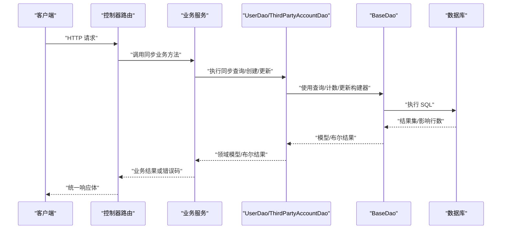
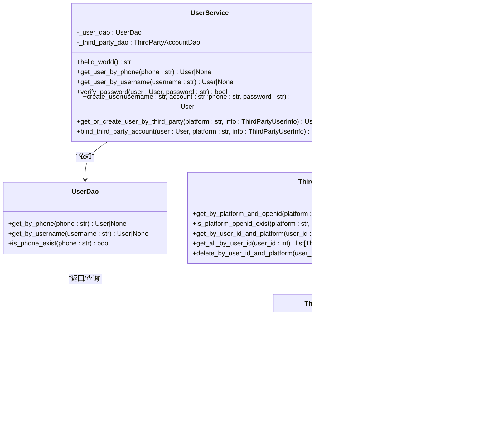
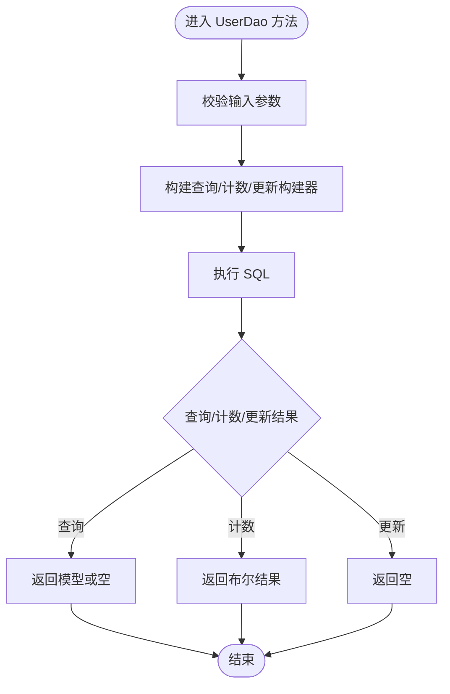
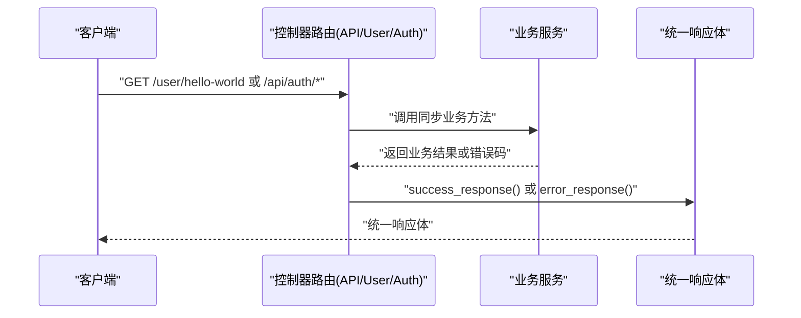
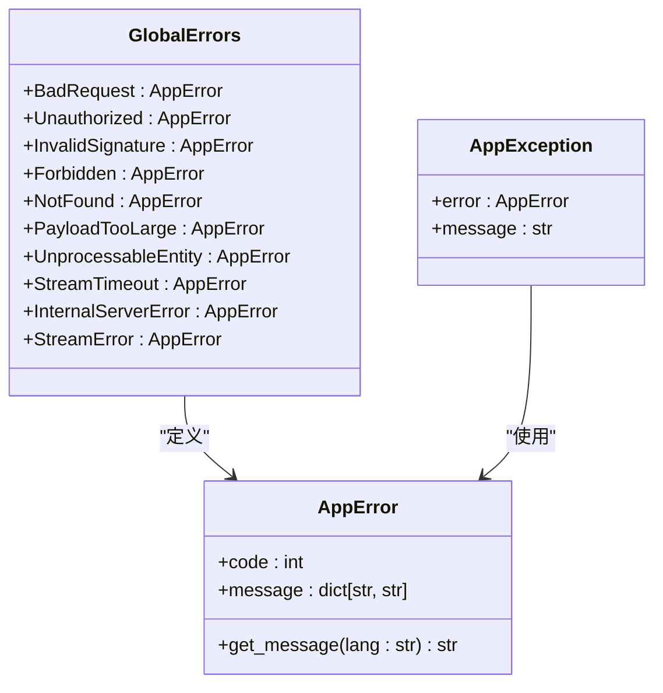
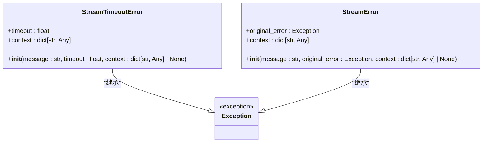
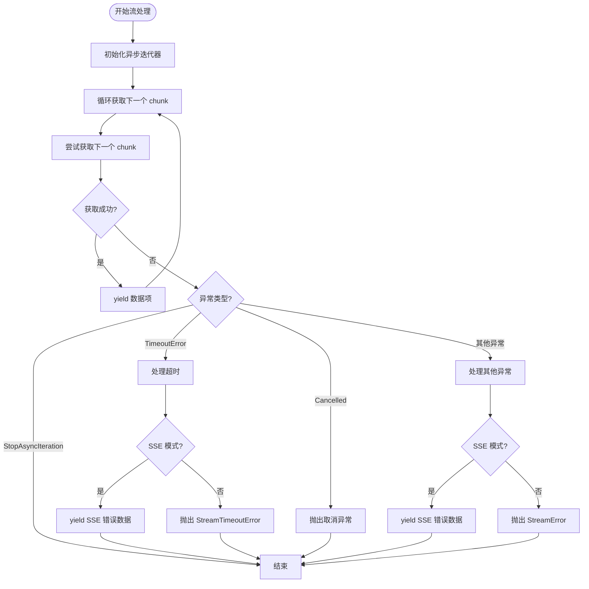
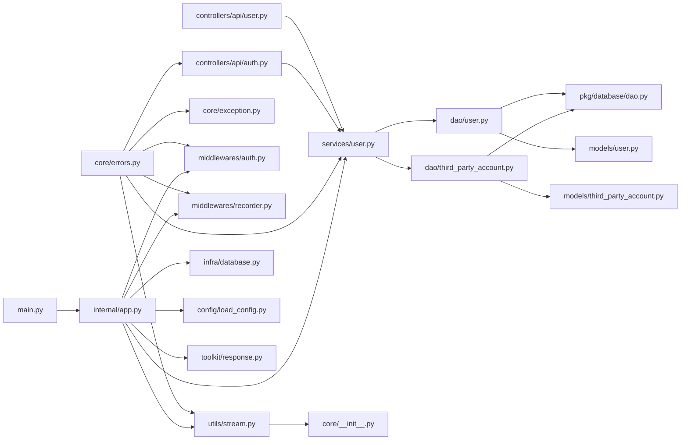

# 业务逻辑层

<cite>
**本文引用的文件**
- [internal/services/user.py](file://internal/services/user.py)
- [internal/dao/user.py](file://internal/dao/user.py)
- [internal/dao/third_party_account.py](file://internal/dao/third_party_account.py)
- [internal/models/user.py](file://internal/models/user.py)
- [internal/models/third_party_account.py](file://internal/models/third_party_account.py)
- [pkg/database/dao.py](file://pkg/database/dao.py)
- [internal/controllers/api/user.py](file://internal/controllers/api/user.py)
- [internal/controllers/api/auth.py](file://internal/controllers/api/auth.py)
- [internal/app.py](file://internal/app.py)
- [main.py](file://main.py)
- [internal/infra/database.py](file://internal/infra/database.py)
- [internal/config/load_config.py](file://internal/config/load_config.py)
- [pkg/toolkit/response.py](file://pkg/toolkit/response.py)
- [internal/core/exception.py](file://internal/core/exception.py)
- [internal/core/errors.py](file://internal/core/errors.py)
- [internal/middlewares/auth.py](file://internal/middlewares/auth.py)
- [internal/middlewares/recorder.py](file://internal/middlewares/recorder.py)
- [internal/utils/stream.py](file://internal/utils/stream.py)
</cite>

## 更新摘要
**所做更改**
- 更新用户服务方法签名：create_user、get_or_create_user_by_third_party、bind_third_party_account 等方法从异步改为同步，简化了服务层API
- 更新服务层架构图和组件关系，反映同步方法的调用流程
- 更新控制器层调用方式，移除 await 关键字的使用
- 更新依赖关系分析，展示同步方法的调用链路

## 目录
1. [引言](#引言)
2. [项目结构](#项目结构)
3. [核心组件](#核心组件)
4. [架构总览](#架构总览)
5. [组件详解](#组件详解)
6. [统一错误管理系统](#统一错误管理系统)
7. [流处理异常管理](#流处理异常管理)
8. [流处理工具函数](#流处理工具函数)
9. [依赖关系分析](#依赖关系分析)
10. [性能考量](#性能考量)
11. [故障排查指南](#故障排查指南)
12. [结论](#结论)
13. [附录](#附录)

## 引言
本文件聚焦于业务逻辑层（Service 层）的实现与设计，围绕用户服务展开，系统性阐述其职责边界、调用关系、接口契约、领域模型、配置项、参数与返回值约定、与其他组件的集成方式，以及异常处理与常见问题的解决方案。特别关注最近的服务层API简化：create_user、get_or_create_user_by_third_party、bind_third_party_account等方法从异步改为同步，这一变化显著简化了服务层的调用方式，提升了开发效率。

## 项目结构
本项目采用分层架构：控制器（Controllers）负责路由与请求入口，业务逻辑（Services）封装领域行为，数据访问（DAO）负责与持久层交互，模型（Models）承载数据结构，工具与基础设施（Infra/Config/Responses/Exceptions/Middlewares）提供支撑能力。

```mermaid
graph TB
subgraph "入口与运行时"
MAIN["main.py<br/>应用入口"]
APP["internal/app.py<br/>应用创建与生命周期"]
end
subgraph "控制器层"
CTRL_API_USER["controllers/api/user.py<br/>用户API路由"]
CTRL_AUTH["controllers/api/auth.py<br/>认证路由"]
end
subgraph "业务逻辑层"
SVC_USER["services/user.py<br/>UserService"]
end
subgraph "数据访问层"
DAO_USER["dao/user.py<br/>UserDao"]
DAO_THIRD_PARTY["dao/third_party_account.py<br/>ThirdPartyAccountDao"]
DAO_BASE["pkg/database/dao.py<br/>BaseDao/查询/计数/更新构建器"]
end
subgraph "领域模型"
MODEL_USER["models/user.py<br/>User 模型"]
MODEL_THIRD_PARTY["models/third_party_account.py<br/>ThirdPartyAccount 模型"]
end
subgraph "基础设施与配置"
INFRA_DB["infra/database.py<br/>数据库引擎/会话/事件监听"]
CFG["config/load_config.py<br/>配置加载与校验"]
RESP["toolkit/response.py<br/>统一响应体/错误码/SSE"]
EXC["core/exception.py<br/>AppException 定义"]
ERR["core/errors.py<br/>GlobalErrors 错误码定义"]
MW["middlewares/auth.py<br/>认证中间件"]
REC["middlewares/recorder.py<br/>异常记录器"]
STREAM["utils/stream.py<br/>流处理工具"]
END
MAIN --> APP
APP --> CTRL_API_USER
APP --> CTRL_AUTH
APP --> CTRL_TEST
CTRL_API_USER --> SVC_USER
CTRL_AUTH --> SVC_USER
SVC_USER --> DAO_USER
SVC_USER --> DAO_THIRD_PARTY
DAO_USER --> DAO_BASE
DAO_THIRD_PARTY --> DAO_BASE
DAO_USER --> MODEL_USER
DAO_THIRD_PARTY --> MODEL_THIRD_PARTY
APP --> INFRA_DB
APP --> MW
APP --> REC
APP --> RESP
APP --> EXC
APP --> ERR
APP --> CFG
APP --> STREAM
```

**图表来源**
- [main.py](file://main.py#L1-L18)
- [internal/app.py](file://internal/app.py#L1-L109)
- [internal/controllers/api/user.py](file://internal/controllers/api/user.py#L1-L16)
- [internal/controllers/api/auth.py](file://internal/controllers/api/auth.py#L1-L299)
- [internal/services/user.py](file://internal/services/user.py#L1-L173)
- [internal/dao/user.py](file://internal/dao/user.py#L1-L31)
- [internal/dao/third_party_account.py](file://internal/dao/third_party_account.py#L1-L44)
- [pkg/database/dao.py](file://pkg/database/dao.py#L1-L455)
- [internal/models/user.py](file://internal/models/user.py#L1-L35)
- [internal/models/third_party_account.py](file://internal/models/third_party_account.py#L1-L122)
- [internal/infra/database.py](file://internal/infra/database.py#L1-L154)
- [internal/config/load_config.py](file://internal/config/load_config.py#L1-L243)
- [pkg/toolkit/response.py](file://pkg/toolkit/response.py#L1-L237)
- [internal/core/exception.py](file://internal/core/exception.py#L1-L17)
- [internal/core/errors.py](file://internal/core/errors.py#L1-L58)
- [internal/middlewares/auth.py](file://internal/middlewares/auth.py#L1-L148)
- [internal/middlewares/recorder.py](file://internal/middlewares/recorder.py#L1-L148)
- [internal/utils/stream.py](file://internal/utils/stream.py#L1-L99)

**章节来源**
- [internal/app.py](file://internal/app.py#L17-L109)
- [main.py](file://main.py#L1-L18)

## 核心组件
- 用户服务（UserService）
  - 职责：对外暴露业务方法，协调 DAO 完成用户相关操作；当前包含"hello_world"演示方法与"按手机号查询用户"的业务方法。
  - 依赖注入：通过工厂函数提供单例实例，便于在控制器中注入。
  - 方法概览：
    - hello_world：无参数，返回字符串。
    - get_user_by_phone：接收手机号字符串，返回用户模型或空。
    - create_user：接收用户名、账号、手机号、密码，返回用户模型。
    - get_or_create_user_by_third_party：接收平台名称和第三方用户信息，返回用户模型。
    - bind_third_party_account：接收用户、平台名称和第三方用户信息，无返回值。
  - **更新**：所有方法现已从异步改为同步，移除了 await 关键字的使用，简化了调用方式。
- 用户数据访问（UserDao）
  - 职责：基于 BaseDao 封装查询、计数、更新等通用能力，面向 User 模型提供具体查询方法。
  - 方法概览：
    - get_by_phone：按手机号查询用户。
    - get_by_username：按用户名查询用户。
    - is_phone_exist：判断手机号是否存在。
- 第三方账号数据访问（ThirdPartyAccountDao）
  - 职责：基于 BaseDao 封装第三方账号的查询、计数、更新等通用能力。
  - 方法概览：
    - get_by_platform_and_openid：按平台和 open_id 查询第三方账号。
    - is_platform_openid_exist：检查平台和 open_id 是否存在。
    - get_by_user_id_and_platform：按用户ID和平台查询第三方账号。
    - get_all_by_user_id：获取用户的所有第三方账号。
    - delete_by_user_id_and_platform：删除用户的指定平台账号。
- 用户模型（User）
  - 职责：ORM 映射，定义用户表结构字段。
  - 字段：用户名、账号、手机号、密码哈希。
- 第三方账号模型（ThirdPartyAccount）
  - 职责：ORM 映射，定义第三方账号关联表结构字段。
  - 字段：用户ID、平台名称、open_id、union_id、头像、昵称、令牌信息、额外数据。
- 控制器（API/User/Auth）
  - 职责：定义路由、参数、返回值，注入 Service 并调用其方法，最终通过统一响应体返回。
  - 用户API控制器：提供用户相关的RESTful接口。
  - 认证控制器：处理用户登录、注册、登出等认证相关操作。
- 基础设施与配置
  - 数据库：异步引擎、会话管理、SQL 监听与慢查询日志。
  - 配置：环境变量加载、敏感字段解密、数据库/Redis 连接串生成。
  - 响应：统一响应体、错误码、SSE 辅助。
  - 异常：AppException 自定义异常类，支持任意状态码。
  - 错误码：GlobalErrors 类提供标准化错误代码定义，包含流处理专用错误码。
  - 中间件：认证（Token/签名）、CORS、GZip、请求记录。
  - 流处理：专门的流处理工具函数，提供超时控制和异常处理。

**章节来源**
- [internal/services/user.py](file://internal/services/user.py#L1-L173)
- [internal/dao/user.py](file://internal/dao/user.py#L1-L31)
- [internal/dao/third_party_account.py](file://internal/dao/third_party_account.py#L1-L44)
- [internal/models/user.py](file://internal/models/user.py#L1-L35)
- [internal/models/third_party_account.py](file://internal/models/third_party_account.py#L1-L122)
- [internal/controllers/api/user.py](file://internal/controllers/api/user.py#L1-L16)
- [internal/controllers/api/auth.py](file://internal/controllers/api/auth.py#L1-L299)
- [internal/infra/database.py](file://internal/infra/database.py#L1-L154)
- [internal/config/load_config.py](file://internal/config/load_config.py#L1-L243)
- [pkg/toolkit/response.py](file://pkg/toolkit/response.py#L1-L237)
- [internal/core/exception.py](file://internal/core/exception.py#L1-L17)
- [internal/core/errors.py](file://internal/core/errors.py#L1-L58)
- [internal/middlewares/auth.py](file://internal/middlewares/auth.py#L1-L148)
- [internal/middlewares/recorder.py](file://internal/middlewares/recorder.py#L1-L148)
- [internal/utils/stream.py](file://internal/utils/stream.py#L1-L99)

## 架构总览
下图展示从请求进入应用到业务处理与数据访问的整体流程，以及各层之间的依赖关系。**更新**：服务层方法现为同步调用，简化了异步处理流程。

```mermaid
sequenceDiagram
participant Client as "客户端"
participant Router as "控制器路由"
participant Service as "业务服务"
participant Dao as "UserDao/ThirdPartyAccountDao"
participant BaseDao as "BaseDao"
participant DB as "数据库"
Client->>Router : "HTTP 请求"
Router->>Service : "调用同步业务方法"
Service->>Dao : "执行同步查询/创建/更新"
Dao->>BaseDao : "使用查询/计数/更新构建器"
BaseDao->>DB : "执行 SQL"
DB-->>BaseDao : "结果集/影响行数"
BaseDao-->>Dao : "模型/布尔结果"
Dao-->>Service : "领域模型/布尔结果"
Service-->>Router : "业务结果或错误码"
Router-->>Client : "统一响应体"
```

**图表来源**
- [internal/controllers/api/user.py](file://internal/controllers/api/user.py#L13-L16)
- [internal/services/user.py](file://internal/services/user.py#L13-L173)
- [internal/dao/user.py](file://internal/dao/user.py#L9-L21)
- [internal/dao/third_party_account.py](file://internal/dao/third_party_account.py#L9-L37)
- [pkg/database/dao.py](file://pkg/database/dao.py#L80-L281)
- [internal/infra/database.py](file://internal/infra/database.py#L85-L111)

## 组件详解

### 用户服务（UserService）
- 设计要点
  - 通过构造函数注入 UserDao 实例，遵循依赖倒置原则，便于单元测试替换。
  - 业务方法尽量只接受必要参数，避免携带请求对象，提升可测试性与内聚性。
  - 提供工厂函数 new_user_service，集中管理依赖注入与单例。
  - **更新**：所有方法现已改为同步实现，移除了异步修饰符，简化了调用方式。
- 方法说明
  - hello_world
    - 输入：无
    - 返回：字符串
    - 用途：演示服务方法的最小实现
  - get_user_by_phone
    - 输入：手机号（字符串）
    - 返回：用户模型或空
    - 业务规则：按手机号精确查询，若不存在返回空
  - get_user_by_username
    - 输入：用户名（字符串）
    - 返回：用户模型或空
    - 业务规则：按用户名精确查询，若不存在返回空
  - verify_password
    - 输入：用户模型、待验证密码（字符串）
    - 返回：布尔值
    - 业务规则：验证用户密码哈希
  - create_user
    - 输入：用户名、账号、手机号、密码
    - 返回：用户模型
    - 业务规则：创建新用户，包含手机号唯一性检查和密码加密
  - get_or_create_user_by_third_party
    - 输入：平台名称、第三方用户信息
    - 返回：用户模型
    - 业务规则：根据第三方信息获取或创建用户，处理第三方账号绑定
  - bind_third_party_account
    - 输入：用户模型、平台名称、第三方用户信息
    - 返回：无
    - 业务规则：将第三方账号绑定到现有用户，处理重复绑定检查
- 依赖关系
  - 依赖 UserDao 完成用户数据查询
  - 依赖 ThirdPartyAccountDao 完成第三方账号操作
  - 间接依赖 BaseDao 的查询构建器与会话提供者

```mermaid
classDiagram
class UserService {
-_user_dao : UserDao
-_third_party_dao : ThirdPartyAccountDao
+hello_world() str
+get_user_by_phone(phone : str) User|None
+get_user_by_username(username : str) User|None
+verify_password(user : User, password : str) bool
+create_user(username : str, account : str, phone : str, password : str) User
+get_or_create_user_by_third_party(platform : str, info : ThirdPartyUserInfo) User
+bind_third_party_account(user : User, platform : str, info : ThirdPartyUserInfo) void
}
class UserDao {
+get_by_phone(phone : str) User|None
+get_by_username(username : str) User|None
+is_phone_exist(phone : str) bool
}
class ThirdPartyAccountDao {
+get_by_platform_and_openid(platform : str, openid : str) ThirdPartyAccount|None
+is_platform_openid_exist(platform : str, openid : str) bool
+get_by_user_id_and_platform(user_id : int, platform : str) ThirdPartyAccount|None
+get_all_by_user_id(user_id : int) list[ThirdPartyAccount]
+delete_by_user_id_and_platform(user_id : int, platform : str) void
}
class User {
+username : str
+account : str
+phone : str
+password_hash : str|None
}
class ThirdPartyAccount {
+user_id : int
+platform : str
+open_id : str
+union_id : str|None
+avatar : str|None
+nickname : str|None
+access_token : str|None
+refresh_token : str|None
+expires_at : datetime|None
+extra_data : dict|None
}
UserService --> UserDao : "依赖"
UserService --> ThirdPartyAccountDao : "依赖"
UserDao --> User : "返回/查询"
ThirdPartyAccountDao --> ThirdPartyAccount : "返回/查询"
```

**图表来源**
- [internal/services/user.py](file://internal/services/user.py#L8-L173)
- [internal/dao/user.py](file://internal/dao/user.py#L6-L31)
- [internal/dao/third_party_account.py](file://internal/dao/third_party_account.py#L6-L44)
- [internal/models/user.py](file://internal/models/user.py#L7-L35)
- [internal/models/third_party_account.py](file://internal/models/third_party_account.py#L10-L122)

**章节来源**
- [internal/services/user.py](file://internal/services/user.py#L1-L173)

### 用户数据访问（UserDao）
- 设计要点
  - 继承 BaseDao，复用查询、计数、更新构建器，减少重复代码。
  - 通过属性化查询构建器（QueryBuilder/CountBuilder/UpdateBuilder）表达业务查询意图。
  - 通过会话提供者（SessionProvider）获取异步会话，保证事务与连接管理一致性。
- 方法说明
  - get_by_phone
    - 输入：手机号（字符串）
    - 返回：用户模型或空
    - 行为：等值查询，按更新时间降序排列
  - get_by_username
    - 输入：用户名（字符串）
    - 返回：用户模型或空
    - 行为：等值查询，按更新时间降序排列
  - is_phone_exist
    - 输入：手机号（字符串）
    - 返回：布尔值
    - 行为：基于计数器判断是否存在
- 事务与会话
  - 通过 BaseDao 的会话提供者与上下文管理器，确保异常时自动回滚与资源释放。

```mermaid
flowchart TD
Start(["进入 UserDao 方法"]) --> CheckParam["校验输入参数"]
CheckParam --> BuildQuery["构建查询/计数/更新构建器"]
BuildQuery --> Exec["执行 SQL"]
Exec --> Result{"查询/计数/更新结果"}
Result --> |查询| ReturnModel["返回模型或空"]
Result --> |计数| ReturnBool["返回布尔结果"]
Result --> |更新| ReturnVoid["返回空"]
ReturnModel --> End(["结束"])
ReturnBool --> End
ReturnVoid --> End
```

**图表来源**
- [internal/dao/user.py](file://internal/dao/user.py#L9-L21)
- [pkg/database/dao.py](file://pkg/database/dao.py#L88-L241)

**章节来源**
- [internal/dao/user.py](file://internal/dao/user.py#L1-L31)
- [pkg/database/dao.py](file://pkg/database/dao.py#L1-L455)

### 第三方账号数据访问（ThirdPartyAccountDao）
- 设计要点
  - 继承 BaseDao，提供第三方账号的完整CRUD操作。
  - 支持按平台、open_id、用户ID等多种维度的查询。
  - 提供批量操作和软删除功能。
- 方法说明
  - get_by_platform_and_openid
    - 输入：平台名称、open_id
    - 返回：第三方账号模型或空
    - 行为：联合条件查询
  - is_platform_openid_exist
    - 输入：平台名称、open_id
    - 返回：布尔值
    - 行为：检查唯一性约束
  - get_by_user_id_and_platform
    - 输入：用户ID、平台名称
    - 返回：第三方账号模型或空
    - 行为：查询用户特定平台的账号
  - get_all_by_user_id
    - 输入：用户ID
    - 返回：第三方账号模型列表
    - 行为：获取用户所有绑定的第三方账号
  - delete_by_user_id_and_platform
    - 输入：用户ID、平台名称
    - 返回：无
    - 行为：软删除指定平台的账号
- 事务与会话
  - 通过 BaseDao 的会话提供者与上下文管理器，确保异常时自动回滚与资源释放。

**章节来源**
- [internal/dao/third_party_account.py](file://internal/dao/third_party_account.py#L1-L44)
- [pkg/database/dao.py](file://pkg/database/dao.py#L1-L455)

### 用户模型（User）
- 字段定义
  - username：字符串，最大长度64
  - account：字符串，最大长度64
  - phone：字符串，固定长度11
  - password_hash：字符串或空，最大长度255
- 作用
  - 作为 SQLAlchemy ORM 映射，承载用户数据结构
  - 与 UserDao 的查询构建器配合完成数据读写

**章节来源**
- [internal/models/user.py](file://internal/models/user.py#L1-L35)

### 第三方账号模型（ThirdPartyAccount）
- 字段定义
  - user_id：整数，用户ID（逻辑外键）
  - platform：字符串，平台名称，最大长度32
  - open_id：字符串，平台唯一标识，最大长度256
  - union_id：字符串或空，平台UnionID，最大长度256
  - avatar：字符串或空，头像URL，最大长度512
  - nickname：字符串或空，昵称，最大长度128
  - access_token：字符串或空，访问令牌，最大长度512
  - refresh_token：字符串或空，刷新令牌，最大长度512
  - expires_at：日期时间或空，令牌过期时间
  - extra_data：字典或空，JSON格式的额外数据
- 约束与索引
  - 唯一约束：platform + open_id 组合唯一
  - 索引：user_id、platform、open_id、union_id、user_id+platform
- 作用
  - 作为 SQLAlchemy ORM 映射，承载第三方账号关联数据
  - 支持多平台账号绑定和管理

**章节来源**
- [internal/models/third_party_account.py](file://internal/models/third_party_account.py#L1-L122)

### 控制器（API/User/Auth）
- 用户API路由
  - 路由前缀：/user
  - 方法：/hello-world
  - 依赖注入：UserServiceDep
  - 返回：统一成功响应
  - **更新**：调用同步方法，移除了 await 关键字
- 认证路由（新增）
  - 路由前缀：/api/auth
  - 方法：/login、/logout、/register、/me、/wechat/login
  - 依赖注入：UserServiceDep
  - 返回：认证相关响应或统一错误响应
  - **更新**：调用同步方法，简化了异步处理
- 认证流程
  - 登录：验证用户名密码，生成token并存储到Redis
  - 注册：创建用户，生成token并登录
  - 登出：从Redis删除token并从用户token列表中移除
  - 获取当前用户：根据token查询Redis缓存的用户元数据

```mermaid
sequenceDiagram
participant C as "客户端"
participant R as "控制器路由(API/User/Auth)"
participant S as "业务服务"
participant Resp as "统一响应体"
C->>R : "GET /user/hello-world 或 /api/auth/*"
R->>S : "调用同步业务方法"
S-->>R : "返回业务结果或错误码"
R->>Resp : "success_response() 或 error_response()"
Resp-->>C : "统一响应体"
```

**图表来源**
- [internal/controllers/api/user.py](file://internal/controllers/api/user.py#L13-L16)
- [internal/controllers/api/auth.py](file://internal/controllers/api/auth.py#L50-L200)
- [pkg/toolkit/response.py](file://pkg/toolkit/response.py#L181-L200)

**章节来源**
- [internal/controllers/api/user.py](file://internal/controllers/api/user.py#L1-L16)
- [internal/controllers/api/auth.py](file://internal/controllers/api/auth.py#L1-L299)

### 基础设施与配置
- 数据库
  - 初始化：创建异步引擎、注册 SQL 监听事件、创建会话工厂
  - 会话：上下文管理器，支持自动回滚与异常处理
  - 慢查询：基于阈值输出日志
- 配置
  - 环境检测：优先系统环境变量，其次 .secrets 文件
  - 连接串：根据数据库类型动态生成
  - 敏感字段：AES 解密
- 响应
  - 统一响应体：code/message/data
  - 错误码：AppError 类型，支持多语言文案
  - SSE：辅助包装
- 异常
  - AppException：自定义异常类，支持任意状态码
  - 错误码定义：从 exception.py 迁移到 errors.py 的 GlobalErrors 类
  - 流处理异常：StreamTimeoutError 和 StreamError 专门处理流超时和流错误
- 中间件
  - 认证：白名单放行、内部接口签名、外部接口 Token
  - CORS/GZip/记录：性能与可观测性

**章节来源**
- [internal/infra/database.py](file://internal/infra/database.py#L26-L111)
- [internal/config/load_config.py](file://internal/config/load_config.py#L179-L243)
- [pkg/toolkit/response.py](file://pkg/toolkit/response.py#L14-L237)
- [internal/core/exception.py](file://internal/core/exception.py#L1-L17)
- [internal/core/errors.py](file://internal/core/errors.py#L1-L58)
- [internal/middlewares/auth.py](file://internal/middlewares/auth.py#L88-L150)

## 统一错误管理系统

### GlobalErrors 类设计
新增的 GlobalErrors 类提供了标准化的错误代码定义，实现了错误码的集中管理和跨模块共享。该类将错误码按照客户端错误（40000-49999）和服务端错误（50000-59999）进行分类管理。

- 客户端错误（40000-49999）
  - BadRequest：40000，请求参数错误
  - Unauthorized：40001，未授权，请登录
  - InvalidSignature：40002，签名验证失败
  - Forbidden：40003，权限不足，禁止访问
  - NotFound：40004，资源不存在
  - PayloadTooLarge：40005，请求载荷过大
  - UnprocessableEntity：40006，无法处理的实体
  - StreamTimeout：40800，流超时（新增）
- 服务端错误（50000-59999）
  - InternalServerError：50000，服务器内部错误
  - StreamError：50001，流处理错误（新增）

### 错误码定义迁移
错误码定义已从 internal/core/exception.py 迁移到 internal/core/errors.py，这一变更带来了以下改进：

- **集中管理**：所有错误码定义集中在单一文件中，便于维护和查找
- **类型安全**：使用 AppError 类型确保错误码的类型安全
- **多语言支持**：每个错误码都包含中英文双语文案
- **命名空间隔离**：errors 实例提供统一的访问接口

### 在业务中的应用
错误码在各个业务模块中得到广泛应用：

- **认证服务**：使用 Unauthorized、BadRequest 等错误码处理认证失败场景
- **中间件**：在认证中间件中使用 InvalidSignature、Unauthorized 等错误码
- **异常记录器**：在全局异常处理中使用标准化错误码
- **流处理**：使用 StreamTimeout 和 StreamError 处理流式响应的超时和错误

```mermaid
classDiagram
class GlobalErrors {
+BadRequest : AppError
+Unauthorized : AppError
+InvalidSignature : AppError
+Forbidden : AppError
+NotFound : AppError
+PayloadTooLarge : AppError
+UnprocessableEntity : AppError
+StreamTimeout : AppError
+InternalServerError : AppError
+StreamError : AppError
}
class AppError {
+code : int
+message : dict[str, str]
+get_message(lang : str) str
}
class AppException {
+error : AppError
+message : str
}
GlobalErrors --> AppError : "定义"
AppException --> AppError : "使用"
```

**图表来源**
- [internal/core/errors.py](file://internal/core/errors.py#L8-L28)
- [pkg/toolkit/response.py](file://pkg/toolkit/response.py#L32-L40)
- [internal/core/exception.py](file://internal/core/exception.py#L4-L16)

**章节来源**
- [internal/core/errors.py](file://internal/core/errors.py#L1-L58)
- [pkg/toolkit/response.py](file://pkg/toolkit/response.py#L14-L237)
- [internal/core/exception.py](file://internal/core/exception.py#L1-L17)

## 流处理异常管理

### StreamTimeoutError 异常类
StreamTimeoutError 是专门用于处理流式响应中超时情况的异常类。当流中的单个 chunk 生成超过指定超时时间时抛出。

- 设计特点
  - 继承自 Exception，便于与标准异常处理机制兼容
  - 包含超时时间信息，便于调试和日志记录
  - 支持上下文信息存储，便于传递额外的调试数据
- 构造函数参数
  - message：异常消息描述
  - timeout：超时时间（秒）
  - context：上下文字典，包含调试信息
- 使用场景
  - 非 SSE 模式的流处理，需要业务层自行处理异常
  - 流式 API 调用超时处理
  - 第三方服务响应超时处理

### StreamError 异常类
StreamError 是专门用于处理流式响应中一般性错误的异常类。当流处理过程中发生除超时以外的异常时抛出。

- 设计特点
  - 继承自 Exception，包含原始异常信息
  - 支持原始异常链，便于追踪错误源头
  - 支持上下文信息存储，便于传递调试数据
- 构造函数参数
  - message：异常消息描述
  - original_error：原始异常对象
  - context：上下文字典，包含调试信息
- 使用场景
  - 非 SSE 模式的流处理，需要业务层自行处理异常
  - 流式数据处理过程中的各种异常
  - 第三方服务调用过程中的异常处理

```mermaid
classDiagram
class StreamTimeoutError {
+timeout : float
+context : dict[str, Any]
+__init__(message : str, timeout : float, context : dict[str, Any] | None)
}
class StreamError {
+original_error : Exception
+context : dict[str, Any]
+__init__(message : str, original_error : Exception, context : dict[str, Any] | None)
}
class Exception {
<<exception>>
}
StreamTimeoutError --|> Exception : "继承"
StreamError --|> Exception : "继承"
```

**图表来源**
- [internal/core/errors.py](file://internal/core/errors.py#L36-L58)

**章节来源**
- [internal/core/errors.py](file://internal/core/errors.py#L31-L58)

## 流处理工具函数

### stream_with_chunk_control 函数
stream_with_chunk_control 是一个专门用于流式响应的超时控制工具函数，基于 AnyIO 提供单个 chunk 的超时控制。

- 主要功能
  - 对异步生成器的每个 chunk 设置独立的超时时间
  - 支持两种模式：SSE 模式和非 SSE 模式
  - 自动处理超时和异常情况
- 参数说明
  - generator：异步生成器，产生流式数据
  - chunk_timeout：单个 chunk 超时时间（秒）
  - is_sse：是否为 SSE 格式输出
    - True：超时/错误时 yield SSE 错误数据并记录日志
    - False：超时/错误时抛出 StreamTimeoutError/StreamError
- 返回值
  - 异步迭代器，产生处理后的数据项
- 异常处理
  - 超时：抛出 StreamTimeoutError 或返回 SSE 错误数据
  - 异常：抛出 StreamError 或返回 SSE 错误数据
  - 取消：正常传播取消异常
- 使用示例
  - SSE 模式：自动处理错误响应，适合前端直接消费
  - 非 SSE 模式：业务层自行处理异常，适合复杂业务逻辑

```mermaid
flowchart TD
Start(["开始流处理"]) --> Init["初始化异步迭代器"]
Init --> Loop["循环获取下一个 chunk"]
Loop --> TryGet["尝试获取下一个 chunk"]
TryGet --> Success{"获取成功?"}
Success --> |是| Yield["yield 数据项"]
Yield --> Loop
Success --> |否| CheckType{"异常类型?"}
CheckType --> |StopAsyncIteration| End["结束"]
CheckType --> |TimeoutError| HandleTimeout["处理超时"]
CheckType --> |Cancelled| RaiseCancel["抛出取消异常"]
CheckType --> |其他异常| HandleError["处理其他异常"]
HandleTimeout --> SSEMode{"SSE 模式?"}
SSEMode --> |是| SSETimeout["yield SSE 错误数据"]
SSEMode --> |否| ThrowTimeout["抛出 StreamTimeoutError"]
HandleError --> SSEMode2{"SSE 模式?"}
SSEMode2 --> |是| SSEError["yield SSE 错误数据"]
SSEMode2 --> |否| ThrowError["抛出 StreamError"]
SSETimeout --> End
SSEError --> End
ThrowTimeout --> End
ThrowError --> End
RaiseCancel --> End
```

**图表来源**
- [internal/utils/stream.py](file://internal/utils/stream.py#L16-L99)

**章节来源**
- [internal/utils/stream.py](file://internal/utils/stream.py#L1-L99)

## 依赖关系分析
- 控制器到服务
  - 控制器通过依赖注入获取 UserService 实例，调用同步业务方法后统一返回响应。
  - 用户API控制器依赖 UserService 进行用户相关操作。
  - 认证控制器依赖 UserService 进行用户认证相关操作。
- 服务到数据访问
  - UserService 依赖 UserDao 和 ThirdPartyAccountDao，UserDao 继承 BaseDao，ThirdPartyAccountDao 继承 BaseDao，复用查询/计数/更新构建器。
  - 所有DAO方法仍保持异步特性，但服务层方法已改为同步。
- 数据访问到基础设施
  - UserDao 和 ThirdPartyAccountDao 通过会话提供者获取 AsyncSession，执行 SQL；BaseDao 提供事务执行器 execute_transaction。
- 错误管理系统
  - 所有业务模块通过 errors 实例访问标准化错误码
  - AppException 类使用 GlobalErrors 定义的错误码
  - 中间件和异常记录器使用标准化错误码进行统一处理
  - 流处理模块使用 StreamTimeoutError 和 StreamError 进行专门的异常处理
- 应用生命周期
  - main.py 创建应用实例，internal/app.py 注册路由、异常、中间件与生命周期事件；数据库与 Redis 初始化在 lifespan 中完成。

```mermaid
graph LR
CTRL_API_USER["controllers/api/user.py"] --> SVC_USER["services/user.py"]
CTRL_AUTH["controllers/api/auth.py"] --> SVC_USER
SVC_USER --> DAO_USER["dao/user.py"]
SVC_USER --> DAO_THIRD_PARTY["dao/third_party_account.py"]
DAO_USER --> DAO_BASE["pkg/database/dao.py"]
DAO_THIRD_PARTY --> DAO_BASE
DAO_USER --> MODEL_USER["models/user.py"]
DAO_THIRD_PARTY --> MODEL_THIRD_PARTY["models/third_party_account.py"]
ERR["core/errors.py"] --> EXC["core/exception.py"]
ERR --> MW["middlewares/auth.py"]
ERR --> REC["middlewares/recorder.py"]
ERR --> CTRL_AUTH
ERR --> SVC_USER
ERR --> STREAM["utils/stream.py"]
STREAM --> CORE_INIT["core/__init__.py"]
MAIN["main.py"] --> APP["internal/app.py"]
APP --> INFRA_DB["infra/database.py"]
APP --> CFG["config/load_config.py"]
APP --> RESP["toolkit/response.py"]
APP --> MW
APP --> REC
APP --> SVC_USER
APP --> STREAM
```

**图表来源**
- [internal/controllers/api/user.py](file://internal/controllers/api/user.py#L1-L16)
- [internal/controllers/api/auth.py](file://internal/controllers/api/auth.py#L1-L299)
- [internal/services/user.py](file://internal/services/user.py#L1-L173)
- [internal/dao/user.py](file://internal/dao/user.py#L1-L31)
- [internal/dao/third_party_account.py](file://internal/dao/third_party_account.py#L1-L44)
- [pkg/database/dao.py](file://pkg/database/dao.py#L1-L455)
- [internal/models/user.py](file://internal/models/user.py#L1-L35)
- [internal/models/third_party_account.py](file://internal/models/third_party_account.py#L1-L122)
- [internal/core/errors.py](file://internal/core/errors.py#L1-L58)
- [internal/core/exception.py](file://internal/core/exception.py#L1-L17)
- [internal/middlewares/auth.py](file://internal/middlewares/auth.py#L1-L148)
- [internal/middlewares/recorder.py](file://internal/middlewares/recorder.py#L1-L148)
- [internal/utils/stream.py](file://internal/utils/stream.py#L1-L99)
- [internal/core/__init__.py](file://internal/core/__init__.py#L1-L13)
- [main.py](file://main.py#L1-L18)
- [internal/app.py](file://internal/app.py#L1-L109)
- [internal/infra/database.py](file://internal/infra/database.py#L1-L154)
- [internal/config/load_config.py](file://internal/config/load_config.py#L1-L243)
- [pkg/toolkit/response.py](file://pkg/toolkit/response.py#L1-L237)

**章节来源**
- [internal/app.py](file://internal/app.py#L33-L82)
- [main.py](file://main.py#L1-L18)

## 性能考量
- 数据库连接池
  - 连接池大小、超时与回收策略已在数据库初始化中配置，建议结合压测结果调整。
- 查询优化
  - 使用查询构建器的等值/范围/排序组合，避免 N+1 查询；必要时引入子查询或批量查询。
- 响应序列化
  - 统一使用高性能 JSON 序列化，减少序列化开销。
- 中间件
  - GZip 压缩与请求记录有助于网络传输与可观测性，注意在高并发场景下的 CPU 开销平衡。
- 错误码处理
  - 标准化的错误码定义减少了重复代码，提高了错误处理的一致性和性能。
- 流处理性能
  - AnyIO 的超时控制机制提供了高效的异步流处理能力
  - SSE 模式下的错误处理避免了业务层的重复代码
  - 非 SSE 模式下的异常抛出便于业务层进行精细控制
- **更新**：服务层同步方法减少了异步调度开销，提升了简单业务场景的响应速度

## 故障排查指南
- 配置加载失败
  - 症状：启动时报错，提示缺少 .secrets 或环境配置文件
  - 处理：确认 APP_ENV、.secrets 与对应 .env.* 文件存在且格式正确
- 数据库未初始化
  - 症状：获取会话时报错，提示数据库未初始化
  - 处理：确保在 lifespan 中调用初始化函数，或在使用前显式初始化
- 认证失败
  - 症状：内部接口签名失败或外部接口 Token 无效
  - 处理：核对签名头与 Token，确认中间件白名单与路径前缀配置
- 响应异常
  - 症状：统一响应体返回类型不匹配
  - 处理：确保返回数据为 dict/list/Pydantic 模型或 None
- 错误码不一致
  - 症状：不同模块使用不同的错误码定义
  - 处理：统一使用 errors 实例访问标准化错误码，避免重复定义
- 流处理超时
  - 症状：流式响应超时，出现 StreamTimeoutError
  - 处理：检查 chunk_timeout 设置，优化数据生成速度，考虑增加超时时间
- 流处理错误
  - 症状：流式响应异常，出现 StreamError
  - 处理：检查原始异常信息，修复数据生成逻辑，确保异常链完整
- **更新**：服务层同步方法调用
  - 症状：控制器中使用 await 调用同步方法报错
  - 处理：移除 await 关键字，直接调用同步方法

**章节来源**
- [internal/config/load_config.py](file://internal/config/load_config.py#L186-L214)
- [internal/infra/database.py](file://internal/infra/database.py#L85-L111)
- [internal/middlewares/auth.py](file://internal/middlewares/auth.py#L119-L149)
- [pkg/toolkit/response.py](file://pkg/toolkit/response.py#L101-L133)
- [internal/utils/stream.py](file://internal/utils/stream.py#L67-L98)

## 结论
用户服务层通过清晰的职责划分与依赖注入，实现了业务逻辑与数据访问的解耦；配合统一的响应体、错误码与中间件体系，提供了良好的可维护性与扩展性。**更新**：服务层API的简化（create_user、get_or_create_user_by_third_party、bind_third_party_account等方法从异步改为同步）显著提升了开发效率，移除了不必要的异步开销，使得简单业务场景的调用更加直观和高效。新增的统一错误管理系统和流处理异常管理进一步提升了系统的规范性和一致性，通过 GlobalErrors 类实现了错误码的集中管理，通过 StreamTimeoutError 和 StreamError 类提供了专门的流处理异常处理机制。建议在后续迭代中继续完善业务方法的异常处理和参数校验，并持续优化数据库查询性能。

## 附录

### 接口与返回值约定
- 控制器到服务
  - 入参：控制器从请求中解析参数，传递给服务方法
  - 出参：服务方法返回领域模型或布尔结果
  - **更新**：所有服务方法现为同步实现，控制器中无需使用 await
- 服务到控制器
  - 返回：统一成功响应体，data 字段承载业务数据
- 错误处理
  - 标准化错误码：通过 errors 实例访问 GlobalErrors 定义的错误码
  - AppException：自定义异常类，承载错误码与消息
  - 流处理异常：StreamTimeoutError 和 StreamError 专门处理流式响应
  - 多语言支持：错误码包含中英文双语文案

### 错误码使用示例
- 认证失败：errors.Unauthorized
- 参数错误：errors.BadRequest  
- 签名失败：errors.InvalidSignature
- 服务器错误：errors.InternalServerError
- 流超时：errors.StreamTimeout（40800）
- 流错误：errors.StreamError（50001）

### 流处理异常使用示例
- 超时异常处理：try-except StreamTimeoutError
- 一般异常处理：try-except StreamError
- SSE 模式：自动处理错误响应
- 非 SSE 模式：业务层自行处理异常

### **更新**：服务层同步方法使用示例
- 同步方法调用：service.get_user_by_phone("13800001111")
- 移除 await 关键字：直接调用，无需 await
- 简化控制器实现：@router.get("/hello-world") def hello_world(service: UserServiceDep): service.hello_world(); return success_response()

**章节来源**
- [internal/controllers/api/user.py](file://internal/controllers/api/user.py#L13-L16)
- [internal/services/user.py](file://internal/services/user.py#L13-L173)
- [pkg/toolkit/response.py](file://pkg/toolkit/response.py#L181-L200)
- [internal/core/exception.py](file://internal/core/exception.py#L19-L38)
- [internal/core/errors.py](file://internal/core/errors.py#L11-L21)
- [internal/utils/stream.py](file://internal/utils/stream.py#L46-L52)