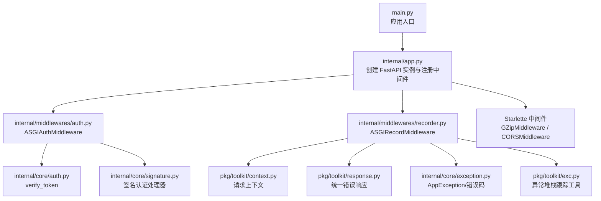
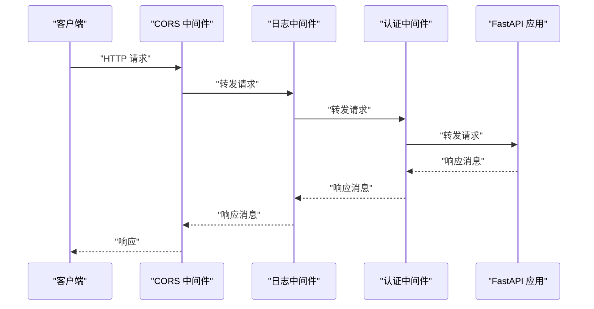
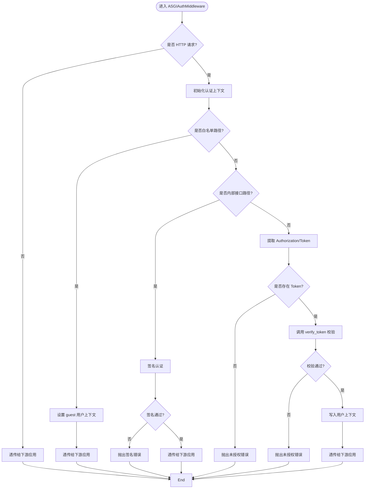
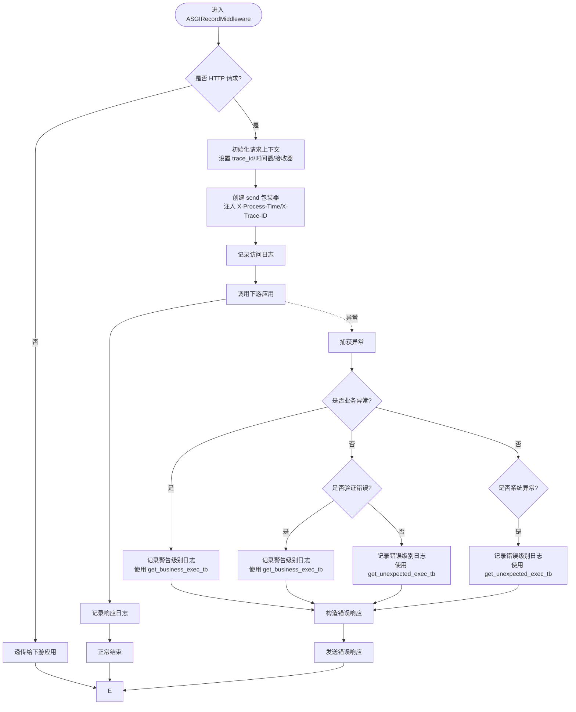
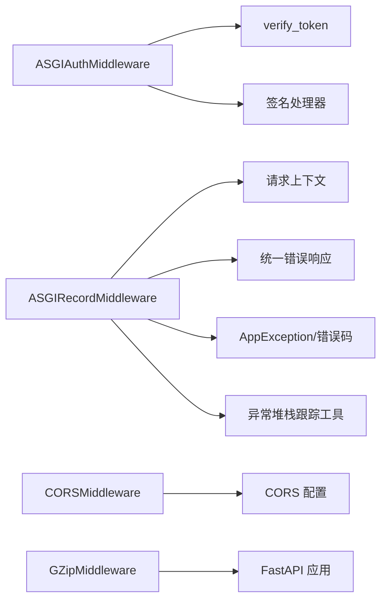

# 中间件系统

<cite>
**本文引用的文件**
- [internal/middlewares/__init__.py](file://internal/middlewares/__init__.py)
- [internal/middlewares/auth.py](file://internal/middlewares/auth.py)
- [internal/middlewares/recorder.py](file://internal/middlewares/recorder.py)
- [internal/app.py](file://internal/app.py)
- [main.py](file://main.py)
- [internal/core/auth.py](file://internal/core/auth.py)
- [internal/core/signature.py](file://internal/core/signature.py)
- [internal/config/load_config.py](file://internal/config/load_config.py)
- [pkg/toolkit/context.py](file://pkg/toolkit/context.py)
- [pkg/toolkit/response.py](file://pkg/toolkit/response.py)
- [internal/core/exception.py](file://internal/core/exception.py)
- [internal/controllers/publicapi/test.py](file://internal/controllers/publicapi/test.py)
- [pkg/toolkit/exc.py](file://pkg/toolkit/exc.py)
- [pkg/logger/handler.py](file://pkg/logger/handler.py)
</cite>

## 更新摘要
**变更内容**
- 更新了异常处理部分，反映统一的错误处理流程和专门的异常日志方法
- 新增了区分业务异常和验证错误的适当日志级别的说明
- 增强了异常处理的精细化改进描述

## 目录
1. [简介](#简介)
2. [项目结构](#项目结构)
3. [核心组件](#核心组件)
4. [架构总览](#架构总览)
5. [组件详解](#组件详解)
6. [依赖关系分析](#依赖关系分析)
7. [性能考量](#性能考量)
8. [故障排查指南](#故障排查指南)
9. [结论](#结论)
10. [附录](#附录)

## 简介
本文件系统性阐述本项目的中间件体系，重点覆盖认证中间件与日志中间件的实现原理、执行顺序、配置项与可扩展点，并说明其与认证系统、日志系统、CORS、请求拦截与响应修改的关系。同时给出常见问题与性能优化建议，帮助开发者正确集成与扩展中间件链。

## 项目结构
中间件位于 internal/middlewares 目录，分别提供认证与请求记录两类中间件；应用入口在 internal/app.py 中注册中间件与路由；运行入口在 main.py 中启动服务。

**图表来源**
- [main.py](file://main.py#L1-L4)
- [internal/app.py](file://internal/app.py#L55-L81)
- [internal/middlewares/auth.py](file://internal/middlewares/auth.py#L88-L150)
- [internal/middlewares/recorder.py](file://internal/middlewares/recorder.py#L68-L148)
- [internal/core/auth.py](file://internal/core/auth.py#L5-L20)
- [internal/core/signature.py](file://internal/core/signature.py#L9-L27)
- [pkg/toolkit/context.py](file://pkg/toolkit/context.py#L61-L107)
- [pkg/toolkit/response.py](file://pkg/toolkit/response.py#L195-L200)
- [internal/core/exception.py](file://internal/core/exception.py#L4-L38)
- [pkg/toolkit/exc.py](file://pkg/toolkit/exc.py#L1-L16)

**章节来源**
- [internal/middlewares/__init__.py](file://internal/middlewares/__init__.py#L1-L5)
- [internal/app.py](file://internal/app.py#L55-L81)
- [main.py](file://main.py#L1-L4)

## 核心组件
- 认证中间件 ASGIAuthMiddleware：负责白名单放行、内部接口签名校验、普通接口 Token 校验，并将用户上下文写入请求上下文。
- 日志中间件 ASGIRecordMiddleware：负责请求访问日志、响应耗时统计、异常统一处理与错误响应输出，具有精细化的异常处理机制。
- CORS 中间件：由 Starlette 提供，按配置允许跨域请求。
- GZip 中间件：由 Starlette 提供，压缩响应以提升传输效率。

**章节来源**
- [internal/middlewares/auth.py](file://internal/middlewares/auth.py#L88-L150)
- [internal/middlewares/recorder.py](file://internal/middlewares/recorder.py#L68-L148)
- [internal/app.py](file://internal/app.py#L55-L81)

## 架构总览
中间件在 FastAPI 应用生命周期内按注册顺序组成请求处理管道，每个中间件对 scope/receive/send 进行处理后传递给下一个中间件或最终应用。

**图表来源**
- [internal/app.py](file://internal/app.py#L55-L81)
- [internal/middlewares/recorder.py](file://internal/middlewares/recorder.py#L105-L148)
- [internal/middlewares/auth.py](file://internal/middlewares/auth.py#L92-L150)

## 组件详解

### 认证中间件 ASGIAuthMiddleware
- 作用与职责
  - 白名单放行：对公开路径、测试路径及特定接口直接放行。
  - 内部接口签名校验：对内部接口路径进行签名认证。
  - Token 校验：对普通接口提取 Authorization 头，支持 Bearer 前缀，校验通过后将用户信息写入请求上下文。
- 执行顺序
  1) 白名单判断
  2) 内部接口签名校验
  3) Token 校验与用户上下文设置
- 关键配置与常量
  - 头字段名：Authorization、X-Signature、X-Timestamp、X-Nonce
  - Token 前缀：Bearer
  - 路径前缀：/v1/public、/v1/internal、/test
  - 白名单路径集合：包含登录、注册、OpenAPI 文档等
- 与认证系统的关联
  - 依赖 internal/core/auth.py 的 verify_token 进行 Token 校验
  - 依赖 internal/core/signature.py 的签名处理器进行内部接口签名校验
  - 依赖 pkg/toolkit/context.py 将用户 ID 写入请求上下文
- 与日志系统的关联
  - 认证过程会记录调试日志，便于审计与排障

**图表来源**
- [internal/middlewares/auth.py](file://internal/middlewares/auth.py#L92-L150)
- [internal/core/auth.py](file://internal/core/auth.py#L5-L20)
- [internal/core/signature.py](file://internal/core/signature.py#L9-L27)
- [pkg/toolkit/context.py](file://pkg/toolkit/context.py#L78-L86)

**章节来源**
- [internal/middlewares/auth.py](file://internal/middlewares/auth.py#L13-L150)
- [internal/core/auth.py](file://internal/core/auth.py#L5-L20)
- [internal/core/signature.py](file://internal/core/signature.py#L9-L27)
- [pkg/toolkit/context.py](file://pkg/toolkit/context.py#L78-L86)

### 日志中间件 ASGIRecordMiddleware
- 作用与职责
  - 初始化请求上下文（含 trace_id）
  - 记录访问日志与响应耗时
  - **统一异常处理**：区分业务异常、验证错误和其他异常，使用适当的日志级别和错误响应
  - 在响应头中注入 X-Process-Time 与 X-Trace-ID
- 执行顺序
  1) 初始化请求上下文
  2) 记录访问日志
  3) 包装 send 函数以注入响应头
  4) 执行下游应用
  5) 记录响应日志
  6) **统一异常处理与错误响应输出**
- 关键配置
  - trace_id 来源：优先使用请求头 X-Trace-ID，否则生成唯一 ID
  - 响应头注入：X-Process-Time（秒）、X-Trace-ID
- 与日志系统、响应系统的关联
  - 使用 pkg/toolkit/logger 上下文化日志
  - 使用 pkg/toolkit/response 统一错误响应
  - 使用 internal/core/exception 定义错误码
  - **使用 pkg/toolkit/exc.py 提供的专门异常日志方法**

**更新** 日志中间件现在具有精细化的异常处理机制，能够区分不同类型的异常并使用适当的日志级别。

**图表来源**
- [internal/middlewares/recorder.py](file://internal/middlewares/recorder.py#L105-L148)
- [pkg/toolkit/context.py](file://pkg/toolkit/context.py#L61-L107)
- [pkg/toolkit/response.py](file://pkg/toolkit/response.py#L195-L200)
- [internal/core/exception.py](file://internal/core/exception.py#L4-L38)
- [pkg/toolkit/exc.py](file://pkg/toolkit/exc.py#L10-L15)

**章节来源**
- [internal/middlewares/recorder.py](file://internal/middlewares/recorder.py#L15-L148)
- [pkg/toolkit/context.py](file://pkg/toolkit/context.py#L61-L107)
- [pkg/toolkit/response.py](file://pkg/toolkit/response.py#L195-L200)
- [internal/core/exception.py](file://internal/core/exception.py#L4-L38)
- [pkg/toolkit/exc.py](file://pkg/toolkit/exc.py#L1-L16)

### CORS 处理
- 由 Starlette 的 CORSMiddleware 提供，按配置允许跨域来源、方法与头部。
- 只有当配置中存在 BACKEND_CORS_ORIGINS 时才会注册该中间件。
- 与认证中间件的顺序：CORS 在日志之前，日志在认证之前，形成"CORS → 日志 → 认证"的顺序。

**章节来源**
- [internal/app.py](file://internal/app.py#L66-L77)
- [internal/config/load_config.py](file://internal/config/load_config.py#L62-L64)

### 请求拦截与响应修改
- 请求拦截
  - 认证中间件在进入下游应用前进行白名单、签名与 Token 校验。
  - 日志中间件在进入下游应用前记录访问日志并包装 send。
- 响应修改
  - 日志中间件通过包装 send 注入 X-Process-Time 与 X-Trace-ID。
  - **异常捕获阶段统一构造错误响应并发送，使用精细化的异常处理机制**。

**章节来源**
- [internal/middlewares/auth.py](file://internal/middlewares/auth.py#L92-L150)
- [internal/middlewares/recorder.py](file://internal/middlewares/recorder.py#L43-L63)
- [pkg/toolkit/response.py](file://pkg/toolkit/response.py#L195-L200)

### 配置选项与参数
- 认证中间件
  - 头字段：Authorization、X-Signature、X-Timestamp、X-Nonce
  - Token 前缀：Bearer
  - 路径前缀：/v1/public、/v1/internal、/test
  - 白名单路径集合：登录、注册、OpenAPI 文档等
- 日志中间件
  - trace_id：来自请求头 X-Trace-ID 或自动生成
  - 响应头：X-Process-Time、X-Trace-ID
- CORS
  - allow_origins、allow_methods、allow_headers、allow_credentials
- 其他
  - GZip 压缩：默认启用，提升传输效率

**章节来源**
- [internal/middlewares/auth.py](file://internal/middlewares/auth.py#L13-L46)
- [internal/middlewares/recorder.py](file://internal/middlewares/recorder.py#L15-L63)
- [internal/app.py](file://internal/app.py#L55-L81)
- [internal/config/load_config.py](file://internal/config/load_config.py#L62-L64)

### 自定义扩展方法
- 新增中间件
  - 遵循 ASGI 协议，实现 __call__(scope, receive, send) 并在合适时机调用下游 app。
  - 在 internal/app.py 的 register_middleware 中按需注册，注意中间件顺序。
- 认证扩展
  - 可在 ASGIAuthMiddleware 中新增路径前缀或白名单规则。
  - 可替换或扩展 verify_token 的实现以适配不同鉴权策略。
- 日志扩展
  - 可在 ASGIRecordMiddleware 中增加额外上下文字段或日志维度。
  - **可利用精细化的异常处理机制，根据业务需求调整异常分类和日志级别**。
- CORS 扩展
  - 通过配置 allow_origins 等参数控制跨域行为。

**章节来源**
- [internal/middlewares/__init__.py](file://internal/middlewares/__init__.py#L1-L5)
- [internal/app.py](file://internal/app.py#L55-L81)

### 最佳实践
- 中间件顺序
  - CORS → 日志 → 认证 → 应用逻辑 → 错误响应
- 路径与白名单
  - 明确划分公开、内部与私有接口路径，合理维护白名单集合。
- 上下文与追踪
  - 保证日志中间件在认证中间件之前，确保 trace_id 与上下文初始化。
- 异常处理
  - **使用 AppException 与统一错误响应，利用精细化的异常处理机制区分业务异常和系统异常**。
  - **合理使用 get_business_exec_tb 和 get_unexpected_exec_tb 获取适当的堆栈跟踪长度**。
- 性能
  - 合理使用 GZip 压缩；避免在中间件中做阻塞操作；尽量减少重复计算。

**章节来源**
- [internal/app.py](file://internal/app.py#L55-L81)
- [pkg/toolkit/response.py](file://pkg/toolkit/response.py#L195-L200)
- [internal/core/exception.py](file://internal/core/exception.py#L4-L38)
- [pkg/toolkit/exc.py](file://pkg/toolkit/exc.py#L10-L15)

## 依赖关系分析
中间件之间的依赖关系如下：

**图表来源**
- [internal/middlewares/auth.py](file://internal/middlewares/auth.py#L88-L150)
- [internal/core/auth.py](file://internal/core/auth.py#L5-L20)
- [internal/core/signature.py](file://internal/core/signature.py#L9-L27)
- [internal/middlewares/recorder.py](file://internal/middlewares/recorder.py#L68-L148)
- [pkg/toolkit/context.py](file://pkg/toolkit/context.py#L61-L107)
- [pkg/toolkit/response.py](file://pkg/toolkit/response.py#L195-L200)
- [internal/core/exception.py](file://internal/core/exception.py#L4-L38)
- [pkg/toolkit/exc.py](file://pkg/toolkit/exc.py#L1-L16)
- [internal/app.py](file://internal/app.py#L55-L81)
- [internal/config/load_config.py](file://internal/config/load_config.py#L62-L64)

**章节来源**
- [internal/middlewares/auth.py](file://internal/middlewares/auth.py#L88-L150)
- [internal/middlewares/recorder.py](file://internal/middlewares/recorder.py#L68-L148)
- [internal/app.py](file://internal/app.py#L55-L81)

## 性能考量
- 中间件顺序影响性能：CORS 与 GZip 通常放在靠前位置，日志与认证靠前有助于尽早发现异常。
- GZip 压缩：对大响应体有效，但会增加 CPU 开销，需结合业务场景评估。
- 日志与追踪：trace_id 与上下文初始化成本较低，但应避免在日志中输出敏感信息。
- 认证开销：Token 校验与缓存访问需关注 Redis 延迟；签名校验需注意密钥与算法选择。
- **异常处理**：统一异常处理避免重复序列化与格式化，减少响应时间；精细化的异常处理机制提高日志质量。

## 故障排查指南
- 未授权/无效 Token
  - 确认 Authorization 头是否携带 Bearer 前缀或完整 Token。
  - 检查 verify_token 的缓存访问是否正常。
- 签名验证失败
  - 检查 X-Signature、X-Timestamp、X-Nonce 是否齐全。
  - 确认签名处理器初始化与密钥配置正确。
- 跨域问题
  - 检查 BACKEND_CORS_ORIGINS 配置是否包含前端域名。
  - 确认浏览器是否收到正确的 CORS 响应头。
- 响应头缺失
  - 确认日志中间件已注册且未被后续中间件覆盖。
  - 检查响应是否在异常捕获阶段提前结束导致无法注入响应头。
- **异常处理问题**
  - **确认异常类型是否为 AppException，业务异常应使用警告级别日志**。
  - **检查 RequestValidationError 是否正确识别为验证错误**。
  - **确认 get_business_exec_tb 和 get_unexpected_exec_tb 是否正确使用**。
- 异常未被捕获
  - 确认异常类型是否为 AppException，否则将作为系统异常处理。
  - 检查下游应用是否抛出了非 AppException 的异常。

**章节来源**
- [internal/middlewares/auth.py](file://internal/middlewares/auth.py#L119-L149)
- [internal/middlewares/recorder.py](file://internal/middlewares/recorder.py#L139-L148)
- [internal/core/signature.py](file://internal/core/signature.py#L9-L27)
- [internal/config/load_config.py](file://internal/config/load_config.py#L62-L64)
- [pkg/toolkit/response.py](file://pkg/toolkit/response.py#L195-L200)
- [pkg/toolkit/exc.py](file://pkg/toolkit/exc.py#L10-L15)

## 结论
本项目的中间件体系通过明确的执行顺序与清晰的职责划分，实现了跨域、日志、认证与统一错误响应的协同工作。认证中间件与日志中间件分别在请求进入早期完成关键前置处理，既保障了安全性与可观测性，又为后续业务逻辑提供了稳定的上下文与追踪能力。

**更新** 日志中间件的异常处理机制经过精细化改进，现在能够统一处理不同类型的异常，使用专门的异常日志方法和适当的日志级别，提高了系统的可观测性和故障排查效率。通过区分业务异常、验证错误和系统异常，开发者可以更准确地定位问题并采取相应的处理措施。

通过合理的配置与扩展点，可在不破坏整体架构的前提下灵活增强功能。

## 附录
- 示例与用法参考
  - 控制器层的异常抛出与响应示例可参考公共 API 测试路由。
- 相关实现路径
  - 认证中间件：[internal/middlewares/auth.py](file://internal/middlewares/auth.py#L88-L150)
  - 日志中间件：[internal/middlewares/recorder.py](file://internal/middlewares/recorder.py#L68-L148)
  - 应用注册中间件：[internal/app.py](file://internal/app.py#L55-L81)
  - 运行入口：[main.py](file://main.py#L1-L4)
  - 异常堆栈跟踪工具：[pkg/toolkit/exc.py](file://pkg/toolkit/exc.py#L1-L16)

**章节来源**
- [internal/controllers/publicapi/test.py](file://internal/controllers/publicapi/test.py#L15-L36)