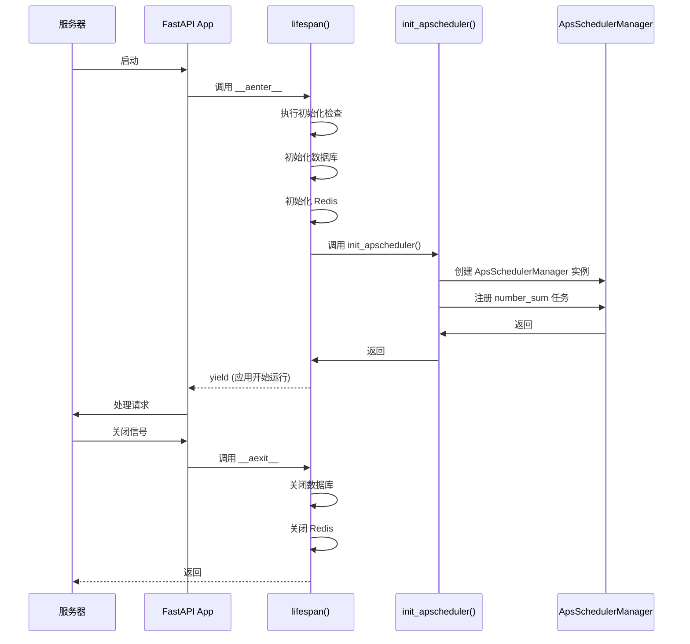
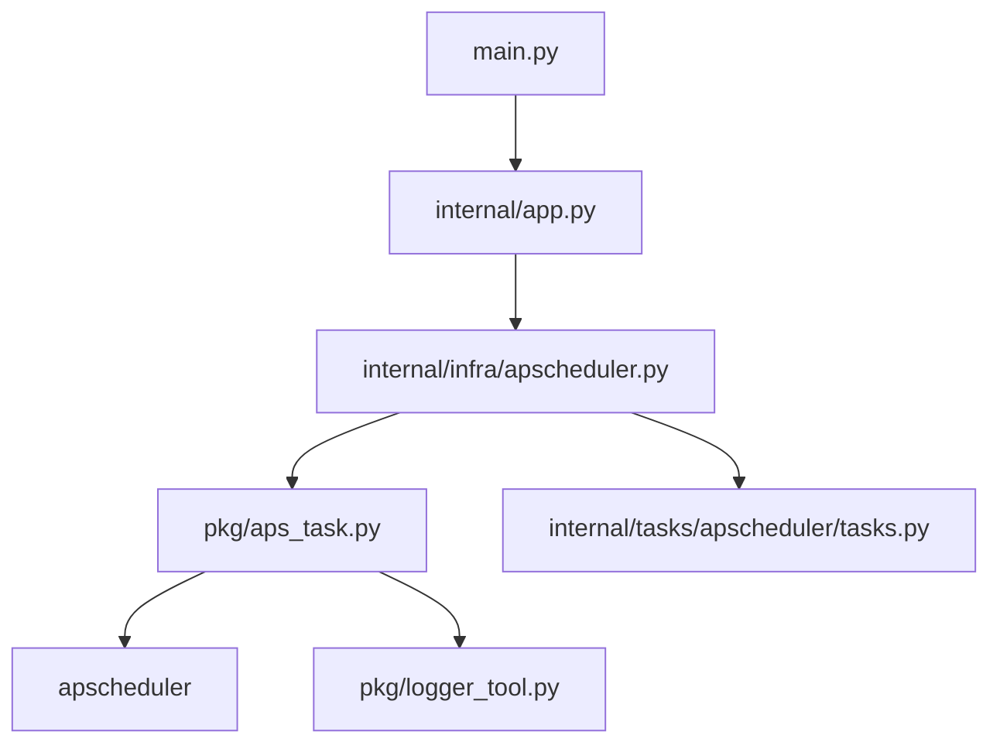

# APScheduler 定时任务

<cite>
**本文档引用的文件**
- [apscheduler.py](file://internal/infra/apscheduler.py)
- [tasks.py](file://internal/tasks/apscheduler/tasks.py)
- [app.py](file://internal/app.py)
- [aps_task.py](file://pkg/aps_task.py)
- [main.py](file://main.py)
</cite>

## 目录
1. [简介](#简介)
2. [核心组件](#核心组件)
3. [架构概述](#架构概述)
4. [详细组件分析](#详细组件分析)
5. [依赖分析](#依赖分析)
6. [性能考虑](#性能考虑)
7. [故障排除指南](#故障排除指南)
8. [结论](#结论)

## 简介
本文档详细介绍了 FastAPI 后端项目中基于 APScheduler 的定时任务系统。重点阐述了 `ApsSchedulerManager` 类的封装设计、全局单例 `_apscheduler_manager` 的延迟初始化模式，以及如何通过 `init_apscheduler()` 函数在 FastAPI 应用生命周期中安全地启动调度器。文档还说明了如何使用 `register_cron` 方法注册基于 cron 表达式的定时任务，并与 Celery 的分布式任务处理能力进行对比，明确了 APScheduler 适用于轻量级、本地化的同步或清理任务场景。

## 核心组件

本项目中的 APScheduler 集成围绕 `internal/infra/apscheduler.py` 文件中的 `init_apscheduler` 函数和全局 `_apscheduler_manager` 单例展开。该单例通过延迟初始化模式，在应用启动时被创建并配置。调度器的核心功能由 `pkg/aps_task.py` 中的 `ApsSchedulerManager` 类提供，它封装了 `apscheduler.schedulers.asyncio.AsyncIOScheduler`，并提供了更简便的 API 来注册和管理定时任务。一个具体的任务示例是 `internal/tasks/apscheduler/tasks.py` 中定义的 `number_sum` 函数。

**Section sources**
- [apscheduler.py](file://internal/infra/apscheduler.py#L1-L20)
- [tasks.py](file://internal/tasks/apscheduler/tasks.py#L1-L12)
- [aps_task.py](file://pkg/aps_task.py#L1-L249)

## 架构概述

```mermaid
graph TD
subgraph "FastAPI 应用"
A[main.py]
B[internal/app.py]
C[internal/infra/apscheduler.py]
D[pkg/aps_task.py]
end
subgraph "任务定义"
E[internal/tasks/apscheduler/tasks.py]
end
A --> B: create_app()
B --> C: lifespan 事件
C --> D: 初始化 ApsSchedulerManager
C --> E: 导入 number_sum 任务
D --> F[(APScheduler AsyncIOScheduler)]
```

**Diagram sources**
- [main.py](file://main.py#L1-L19)
- [app.py](file://internal/app.py#L79-L104)
- [apscheduler.py](file://internal/infra/apscheduler.py#L1-L20)
- [aps_task.py](file://pkg/aps_task.py#L14-L104)

## 详细组件分析

### ApsSchedulerManager 集成与延迟初始化

`ApsSchedulerManager` 是一个对 `APScheduler` 的异步调度器（`AsyncIOScheduler`）的封装类，位于 `pkg/aps_task.py`。它通过提供全局配置（如时区、最大实例数、抖动时间）和延迟启动机制，简化了定时任务的管理。延迟启动意味着可以在调度器启动前注册任务，这些任务会被暂存于 `_pending_jobs` 队列中，待 `start()` 方法被调用时再统一加载。

在 `internal/infra/apscheduler.py` 中，定义了一个全局变量 `_apscheduler_manager`，其类型为 `ApsSchedulerManager | None`。这是一种单例模式的应用，确保在整个应用进程中只有一个调度器实例。`init_apscheduler()` 函数负责该单例的初始化。该函数首先检查 `_apscheduler_manager` 是否已存在，以防止重复初始化，然后创建 `ApsSchedulerManager` 实例，并配置其时区为 UTC，最大并发实例数为 50。

**Section sources**
- [aps_task.py](file://pkg/aps_task.py#L14-L63)
- [apscheduler.py](file://internal/infra/apscheduler.py#L5-L14)

### FastAPI 生命周期集成

`init_apscheduler()` 函数被设计为在 FastAPI 应用的生命周期事件中调用。虽然在当前代码中未直接显示调用，但其预期的集成点是 `internal/app.py` 文件中的 `lifespan` 异步上下文管理器。`lifespan` 函数在应用启动时执行一系列初始化操作（如数据库、Redis 连接），并在应用关闭时执行清理操作。最佳实践是将 `init_apscheduler()` 的调用添加到 `yield` 语句之前，以确保调度器在应用开始处理请求前已启动。



**Diagram sources**
- [app.py](file://internal/app.py#L79-L104)
- [apscheduler.py](file://internal/infra/apscheduler.py#L8-L20)

### 定时任务注册

`ApsSchedulerManager` 提供了 `register_cron` 等便捷方法来注册不同类型的定时任务。在 `init_apscheduler()` 函数中，通过调用 `_apscheduler_manager.register_cron()` 方法，将 `internal/tasks/apscheduler/tasks.py` 中的 `number_sum` 函数注册为一个定时任务。`cron_kwargs` 参数用于配置 cron 表达式，例如 `{"minute": "*/15", "second": 0}` 表示任务将在每小时的第 0、15、30、45 分钟的第 0 秒执行，即每 15 分钟执行一次。`register_cron` 方法内部会创建一个 `CronTrigger` 对象，并将其与任务函数一起传递给底层的 `AsyncIOScheduler`。

```mermaid
flowchart TD
Start([init_apscheduler()]) --> CheckInit["检查 _apscheduler_manager 是否已初始化"]
CheckInit --> |否| CreateManager["创建 ApsSchedulerManager 实例"]
CheckInit --> |是| LogWarning["记录警告日志"]
CreateManager --> RegisterTask["调用 register_cron()"]
RegisterTask --> DefineTask["传入任务函数: number_sum"]
DefineTask --> DefineCron["传入 cron_kwargs: {minute: '*/15', second: 0}"]
DefineCron --> InternalRegister["ApsSchedulerManager._register_job()"]
InternalRegister --> IsStarted["调度器是否已启动?"]
IsStarted --> |是| AddJobNow["立即添加任务到调度器"]
IsStarted --> |否| QueueJob["将任务加入 _pending_jobs 队列"]
AddJobNow --> End([任务注册完成])
QueueJob --> End
```

**Diagram sources**
- [apscheduler.py](file://internal/infra/apscheduler.py#L16-L19)
- [aps_task.py](file://pkg/aps_task.py#L136-L154)

### APScheduler 与 Celery 的对比

APScheduler 和 Celery 都用于任务调度，但适用场景不同。APScheduler 是一个轻量级的、进程内（in-process）的调度器，非常适合运行那些不需要高可靠性和分布式处理的本地化任务，例如定时清理缓存、生成简单的报告或执行轻量级的同步操作。它直接在主应用进程中运行，资源消耗小，配置简单。

相比之下，Celery 是一个强大的分布式任务队列系统。它将任务发布到消息代理（如 Redis 或 RabbitMQ），由独立的 Worker 进程消费和执行。这使得 Celery 非常适合处理耗时长、计算密集型或需要高可靠性的任务。即使主应用重启，已发布到队列中的任务也不会丢失。因此，对于复杂的异步任务、批处理作业或需要水平扩展的场景，Celery 是更合适的选择。

**Section sources**
- [apscheduler.py](file://internal/infra/apscheduler.py#L1-L20)
- [celery.py](file://internal/infra/celery.py)
- [celery_task.py](file://pkg/celery_task.py)

## 依赖分析



**Diagram sources**
- [apscheduler.py](file://internal/infra/apscheduler.py)
- [aps_task.py](file://pkg/aps_task.py)
- [tasks.py](file://internal/tasks/apscheduler/tasks.py)
- [app.py](file://internal/app.py)
- [main.py](file://main.py)

## 性能考虑

使用 APScheduler 时，需注意其运行在主应用的事件循环中。因此，注册的定时任务必须是异步的（`async def`）或非常快速的同步函数。如果一个任务是耗时的同步操作，它会阻塞整个事件循环，导致 FastAPI 应用无法响应其他请求，造成性能瓶颈。对于任何可能耗时超过几毫秒的操作，都应使用 `anyio.to_thread.run_sync` 将其移出主线程，或直接使用 Celery 等分布式任务队列来处理。此外，合理配置 `max_instances` 参数可以防止同一任务的多个实例并发执行，避免资源争用。

## 故障排除指南

- **问题：调度器未启动，任务未执行**
  - **检查点**：确认 `init_apscheduler()` 函数是否在 `lifespan` 事件中被正确调用。
  - **检查点**：检查日志中是否有 "Initializing APScheduler..." 和 "APScheduler initialized successfully." 的记录，以确认初始化流程是否完整。
- **问题：任务执行时阻塞了 API 请求**
  - **原因**：任务函数是耗时的同步函数，阻塞了事件循环。
  - **解决方案**：将任务函数改为异步函数，或使用 `anyio.to_thread.run_sync` 包装同步函数。
- **问题：任务未按预期时间执行**
  - **检查点**：检查 `cron_kwargs` 配置是否正确，特别是时区设置（项目中为 UTC）。
  - **检查点**：查看日志中任务的 `next_run_time` 是否符合预期。

**Section sources**
- [apscheduler.py](file://internal/infra/apscheduler.py#L8-L20)
- [aps_task.py](file://pkg/aps_task.py#L66-L89)
- [app.py](file://internal/app.py#L79-L104)

## 结论

本项目通过封装 `ApsSchedulerManager` 并结合全局单例和延迟初始化模式，实现了对 APScheduler 的优雅集成。`init_apscheduler()` 函数为在 FastAPI 应用生命周期中安全地启动调度器提供了清晰的入口。通过 `register_cron` 等方法，可以方便地注册如 `number_sum` 这样的轻量级定时任务。开发者应清楚 APScheduler 适用于本地、轻量级的场景，而对于复杂的、分布式的任务需求，则应选用 Celery。遵循在 `lifespan` 中启动、避免阻塞事件循环等最佳实践，可以确保定时任务系统的稳定和高效运行。