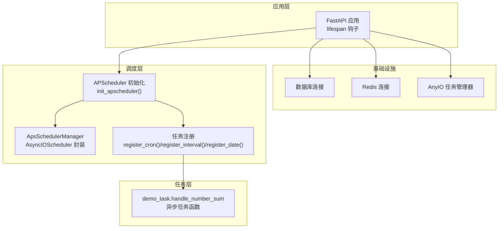
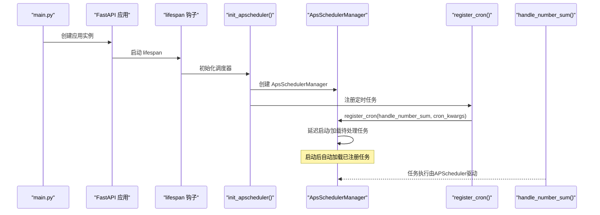
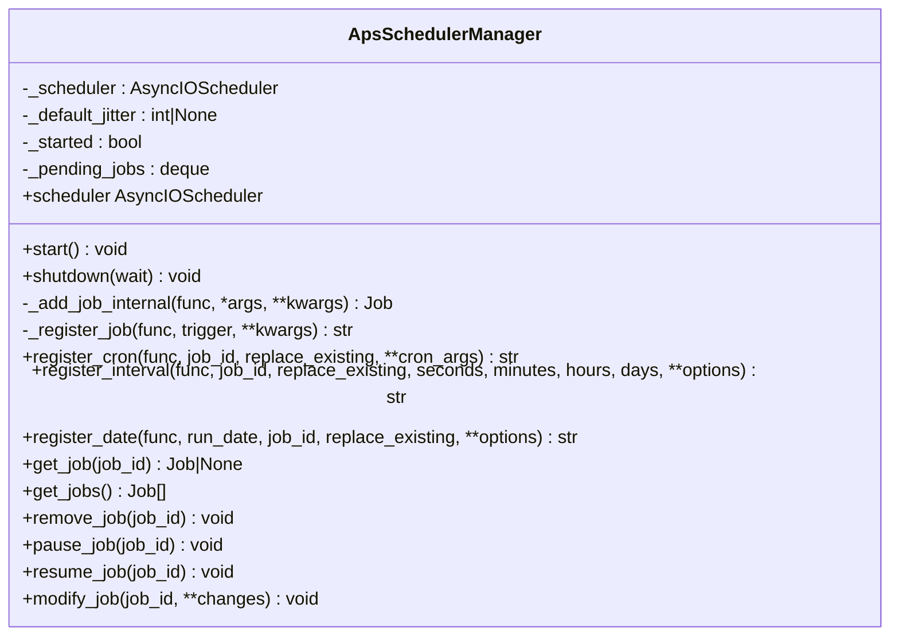
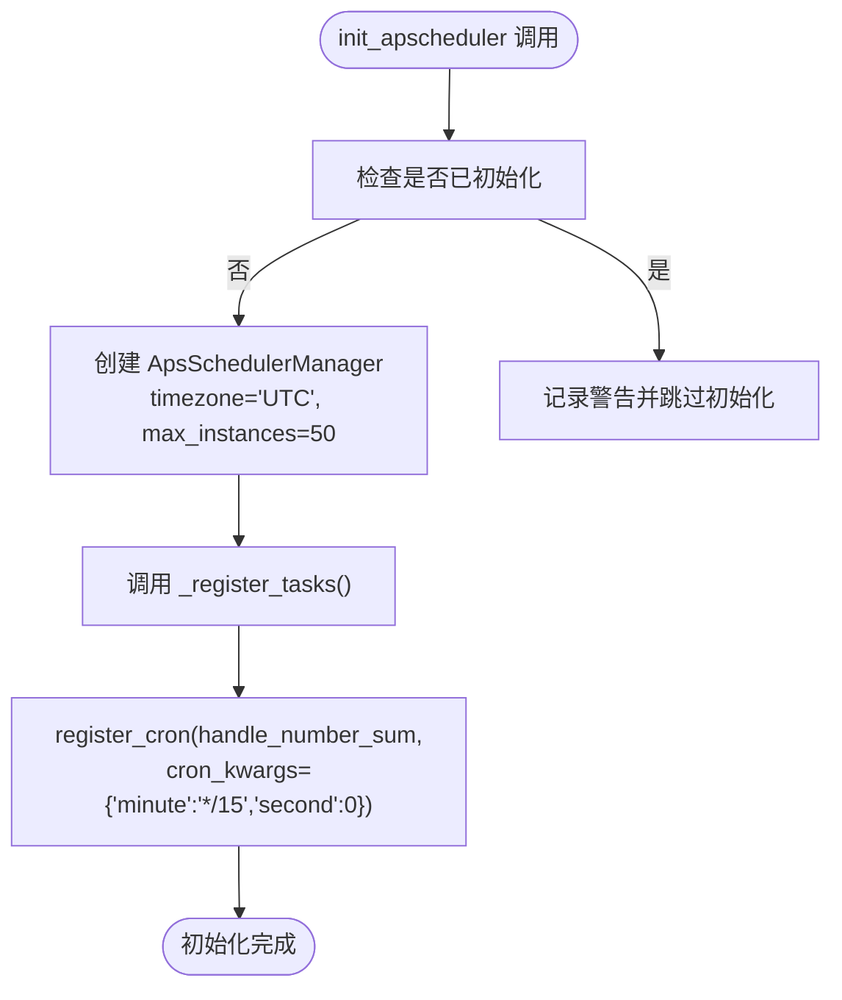
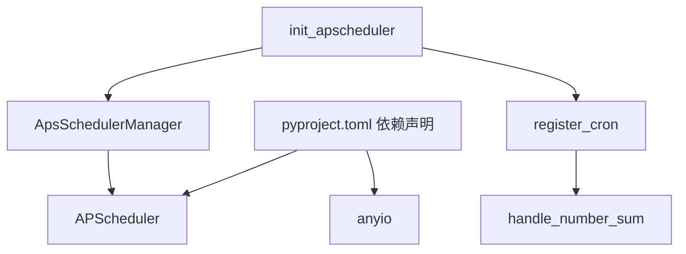

# APScheduler定时任务

<cite>
**本文引用的文件列表**
- [internal/infra/apscheduler/__init__.py](file://internal/infra/apscheduler/__init__.py)
- [internal/infra/apscheduler/register.py](file://internal/infra/apscheduler/register.py)
- [pkg/toolkit/apscheduler.py](file://pkg/toolkit/apscheduler.py)
- [internal/tasks/demo_task.py](file://internal/tasks/demo_task.py)
- [internal/app.py](file://internal/app.py)
- [main.py](file://main.py)
- [pkg/toolkit/async_task.py](file://pkg/toolkit/async_task.py)
- [pyproject.toml](file://pyproject.toml)
</cite>

## 目录
1. [简介](#简介)
2. [项目结构](#项目结构)
3. [核心组件](#核心组件)
4. [架构总览](#架构总览)
5. [详细组件分析](#详细组件分析)
6. [依赖关系分析](#依赖关系分析)
7. [性能考量](#性能考量)
8. [故障排查指南](#故障排查指南)
9. [结论](#结论)
10. [附录](#附录)

## 简介
本文件系统性地文档化本项目中的APScheduler定时任务实现，涵盖调度器初始化、任务注册、调度策略、执行周期、生命周期管理、日志与错误处理、以及与异步编程模型的集成方式。文档同时解释了当前实现采用的调度器类型（AsyncIOScheduler）及其适用场景，并给出可复用的任务定义与触发器配置示例路径，帮助读者快速上手并安全地扩展定时任务体系。

## 项目结构
本项目围绕“应用生命周期 + 调度器管理 + 任务注册”的模式组织定时任务相关代码：
- 应用生命周期：通过FastAPI的lifespan钩子在应用启动前完成基础设施初始化，包括数据库、Redis、AnyIO任务管理器等。
- 调度器管理：通过一个轻量封装的调度器管理器统一配置与生命周期控制。
- 任务注册：在应用启动阶段集中注册定时任务，支持Cron、Interval、Date三种触发器。

图表来源
- [internal/app.py](file://internal/app.py#L84-L109)
- [internal/infra/apscheduler/__init__.py](file://internal/infra/apscheduler/__init__.py#L9-L18)
- [pkg/toolkit/apscheduler.py](file://pkg/toolkit/apscheduler.py#L14-L135)
- [internal/infra/apscheduler/register.py](file://internal/infra/apscheduler/register.py#L5-L6)
- [internal/tasks/demo_task.py](file://internal/tasks/demo_task.py#L9-L19)

章节来源
- [internal/app.py](file://internal/app.py#L84-L109)
- [internal/infra/apscheduler/__init__.py](file://internal/infra/apscheduler/__init__.py#L9-L18)
- [pkg/toolkit/apscheduler.py](file://pkg/toolkit/apscheduler.py#L14-L135)
- [internal/infra/apscheduler/register.py](file://internal/infra/apscheduler/register.py#L5-L6)
- [internal/tasks/demo_task.py](file://internal/tasks/demo_task.py#L9-L19)

## 核心组件
- ApsSchedulerManager：对APScheduler的AsyncIOScheduler进行轻量封装，提供延迟启动、全局默认参数注入、统一注册接口（Cron/Interval/Date）、任务管理与查询能力。
- init_apscheduler：应用启动时初始化调度器管理器并注册任务。
- 任务注册器：集中注册定时任务，当前示例使用Cron触发器。
- 任务函数：定义可被调度器执行的异步任务逻辑。

章节来源
- [pkg/toolkit/apscheduler.py](file://pkg/toolkit/apscheduler.py#L14-L238)
- [internal/infra/apscheduler/__init__.py](file://internal/infra/apscheduler/__init__.py#L9-L18)
- [internal/infra/apscheduler/register.py](file://internal/infra/apscheduler/register.py#L5-L6)
- [internal/tasks/demo_task.py](file://internal/tasks/demo_task.py#L9-L19)

## 架构总览
APScheduler在本项目中的定位是“应用级后台任务调度”，与FastAPI应用生命周期耦合，通过lifespan钩子在应用启动前完成初始化与任务注册，并在应用关闭时优雅停止调度器。

图表来源
- [main.py](file://main.py#L10-L17)
- [internal/app.py](file://internal/app.py#L84-L109)
- [internal/infra/apscheduler/__init__.py](file://internal/infra/apscheduler/__init__.py#L9-L18)
- [pkg/toolkit/apscheduler.py](file://pkg/toolkit/apscheduler.py#L66-L89)
- [internal/infra/apscheduler/register.py](file://internal/infra/apscheduler/register.py#L5-L6)
- [internal/tasks/demo_task.py](file://internal/tasks/demo_task.py#L9-L19)

## 详细组件分析

### ApsSchedulerManager 类
- 职责
  - 统一封装AsyncIOScheduler，提供延迟启动、全局默认参数注入、统一注册接口与任务管理能力。
  - 在未启动状态下缓存待注册任务，启动后再批量加载，避免启动失败导致任务丢失。
- 关键特性
  - 延迟启动：start()启动调度器后，再从待处理队列加载任务。
  - 全局默认：统一注入jitter、coalesce、misfire_grace_time等默认参数。
  - 快捷注册：register_cron/register_interval/register_date。
  - 任务管理：get_job/get_jobs/remove_job/pause_job/resume_job/modify_job。
- 与APScheduler原生的关系
  - 暴露底层scheduler属性，便于直接使用APScheduler的高级功能。
  - 对APScheduler不支持的全局jitter参数，通过内部注入实现。

图表来源
- [pkg/toolkit/apscheduler.py](file://pkg/toolkit/apscheduler.py#L14-L238)

章节来源
- [pkg/toolkit/apscheduler.py](file://pkg/toolkit/apscheduler.py#L14-L238)

### init_apscheduler 与任务注册
- init_apscheduler
  - 初始化ApsSchedulerManager（当前默认时区为UTC，最大并发实例数为50）。
  - 调用_register_tasks完成任务注册。
- 任务注册器
  - 当前示例注册一个Cron任务，每15分钟执行一次，秒位固定为0。
  - 任务函数为异步函数，返回计算结果并记录日志。

图表来源
- [internal/infra/apscheduler/__init__.py](file://internal/infra/apscheduler/__init__.py#L9-L18)
- [internal/infra/apscheduler/register.py](file://internal/infra/apscheduler/register.py#L5-L6)
- [internal/tasks/demo_task.py](file://internal/tasks/demo_task.py#L9-L19)

章节来源
- [internal/infra/apscheduler/__init__.py](file://internal/infra/apscheduler/__init__.py#L9-L18)
- [internal/infra/apscheduler/register.py](file://internal/infra/apscheduler/register.py#L5-L6)
- [internal/tasks/demo_task.py](file://internal/tasks/demo_task.py#L9-L19)

### 任务定义与触发器配置示例
- 异步任务函数
  - 示例：计算两数之和，记录输入与结果，返回结果。
  - 适合在APScheduler中作为Cron/Interval/Date触发的任务。
- Cron触发器
  - 示例：每15分钟执行一次，秒位固定为0。
  - 可根据业务需求调整分钟、小时、日等字段。
- Interval触发器
  - 可用于固定间隔重复执行的任务，如心跳检测、数据轮询等。
- Date触发器
  - 用于一次性任务，如定时清理、到期通知等。

章节来源
- [internal/tasks/demo_task.py](file://internal/tasks/demo_task.py#L9-L19)
- [internal/infra/apscheduler/register.py](file://internal/infra/apscheduler/register.py#L5-L6)
- [pkg/toolkit/apscheduler.py](file://pkg/toolkit/apscheduler.py#L138-L203)

### 与异步编程模型的集成
- 事件循环与调度器
  - ApsSchedulerManager基于AsyncIOScheduler，要求在异步环境中运行。
  - 通过start()启动调度器，随后自动加载已注册任务。
- 与FastAPI生命周期的结合
  - 在lifespan钩子中完成调度器初始化与任务注册，保证应用启动顺序正确。
- 与其他异步任务管理器的关系
  - 本项目同时存在AnyIO任务管理器（用于并发执行普通协程任务），与APScheduler的职责边界清晰：前者负责并发执行，后者负责定时调度。

章节来源
- [pkg/toolkit/apscheduler.py](file://pkg/toolkit/apscheduler.py#L51-L55)
- [internal/app.py](file://internal/app.py#L84-L109)
- [pkg/toolkit/async_task.py](file://pkg/toolkit/async_task.py#L42-L93)

## 依赖关系分析
- 外部依赖
  - APScheduler：提供调度器与触发器能力。
  - anyio：提供异步并发与任务管理能力（与APScheduler互补）。
- 内部依赖
  - ApsSchedulerManager依赖APScheduler的AsyncIOScheduler与多种Trigger。
  - init_apscheduler依赖任务注册器与任务函数。
  - 应用生命周期依赖init_apscheduler。

图表来源
- [pyproject.toml](file://pyproject.toml#L26-L15)
- [pkg/toolkit/apscheduler.py](file://pkg/toolkit/apscheduler.py#L5-L11)
- [internal/infra/apscheduler/__init__.py](file://internal/infra/apscheduler/__init__.py#L1-L4)
- [internal/infra/apscheduler/register.py](file://internal/infra/apscheduler/register.py#L1-L2)
- [internal/tasks/demo_task.py](file://internal/tasks/demo_task.py#L6)

章节来源
- [pyproject.toml](file://pyproject.toml#L26-L15)
- [pkg/toolkit/apscheduler.py](file://pkg/toolkit/apscheduler.py#L5-L11)
- [internal/infra/apscheduler/__init__.py](file://internal/infra/apscheduler/__init__.py#L1-L4)
- [internal/infra/apscheduler/register.py](file://internal/infra/apscheduler/register.py#L1-L2)
- [internal/tasks/demo_task.py](file://internal/tasks/demo_task.py#L6)

## 性能考量
- 并发实例数与抖动
  - 默认最大并发实例数为50，可通过构造参数调整。
  - 默认抖动时间为5秒，用于分散整点并发压力，可在任务级别覆盖。
- 合并与宽限期
  - 默认合并滞后触发，允许在错过执行时间后的一段时间内补跑。
- 事件循环与资源限制
  - AsyncIOScheduler依赖事件循环，应确保在正确的异步上下文中启动与停止。
  - 与AnyIO任务管理器配合时，注意区分“调度”与“并发执行”的职责边界。

章节来源
- [pkg/toolkit/apscheduler.py](file://pkg/toolkit/apscheduler.py#L24-L55)
- [pkg/toolkit/apscheduler.py](file://pkg/toolkit/apscheduler.py#L107-L115)

## 故障排查指南
- 启动失败
  - 现象：调度器启动抛出异常。
  - 排查：查看日志中的关键信息，确认时区、并发实例数、触发器配置是否合理。
- 任务未执行
  - 现象：任务未按预期执行。
  - 排查：确认调度器已启动且任务已注册；检查触发器配置与时区设置；查看任务日志。
- 优雅停机
  - 现象：应用关闭时调度器未正常停止。
  - 排查：确保在lifespan关闭阶段调用调度器shutdown；检查是否有未完成的任务阻塞。
- 任务移除与暂停
  - 现象：需要移除或暂停任务。
  - 排查：使用remove_job/pause_job/resume_job/modify_job等管理接口；注意异常处理与日志记录。

章节来源
- [pkg/toolkit/apscheduler.py](file://pkg/toolkit/apscheduler.py#L74-L89)
- [pkg/toolkit/apscheduler.py](file://pkg/toolkit/apscheduler.py#L91-L103)
- [pkg/toolkit/apscheduler.py](file://pkg/toolkit/apscheduler.py#L212-L237)

## 结论
本项目采用ApsScheduler的AsyncIOScheduler作为定时任务调度核心，通过ApsSchedulerManager实现统一配置、延迟启动与便捷注册。结合FastAPI的lifespan生命周期，实现了可靠的定时任务初始化与优雅停机。当前示例展示了Cron触发器的典型用法，同时预留了Interval与Date触发器的扩展空间。建议在生产环境中根据业务负载调整并发实例数与抖动参数，并完善监控与告警机制。

## 附录

### 调度器类型选择与应用场景
- AsyncIOScheduler
  - 适用于需要与FastAPI异步事件循环集成的场景，具备良好的异步兼容性。
  - 适合本项目当前架构，与lifespan生命周期天然契合。
- BlockingScheduler
  - 适用于非异步或简单脚本场景，但在本项目中与FastAPI异步模型不匹配。
- 选择建议
  - 若应用为纯异步（如FastAPI），优先使用AsyncIOScheduler。
  - 若需要与阻塞型代码或第三方库集成，可评估BlockingScheduler，但需额外处理事件循环。

章节来源
- [pkg/toolkit/apscheduler.py](file://pkg/toolkit/apscheduler.py#L51-L55)

### 任务注册与调度策略
- Cron策略
  - 适合周期性任务，如数据统计、报表生成、定时清理等。
  - 建议在秒位设置为0，避免整点并发。
- Interval策略
  - 适合固定间隔轮询或心跳任务。
- Date策略
  - 适合一次性任务或特定时间点触发的任务。

章节来源
- [internal/infra/apscheduler/register.py](file://internal/infra/apscheduler/register.py#L5-L6)
- [pkg/toolkit/apscheduler.py](file://pkg/toolkit/apscheduler.py#L138-L203)

### 执行周期与触发器配置示例路径
- Cron示例：每15分钟执行一次，秒位固定为0。
  - 示例路径：[internal/infra/apscheduler/register.py](file://internal/infra/apscheduler/register.py#L6)
- Interval示例：固定间隔执行（如每30秒）。
  - 示例路径：[pkg/toolkit/apscheduler.py](file://pkg/toolkit/apscheduler.py#L158-L181)
- Date示例：一次性任务在未来某个时间点执行。
  - 示例路径：[pkg/toolkit/apscheduler.py](file://pkg/toolkit/apscheduler.py#L183-L203)

### 时区处理方法
- 默认时区为UTC，可通过构造参数调整。
- 建议在部署环境中根据业务所在区域设置合适的时区，确保触发器按预期时间执行。

章节来源
- [internal/infra/apscheduler/__init__.py](file://internal/infra/apscheduler/__init__.py#L15)
- [pkg/toolkit/apscheduler.py](file://pkg/toolkit/apscheduler.py#L27)