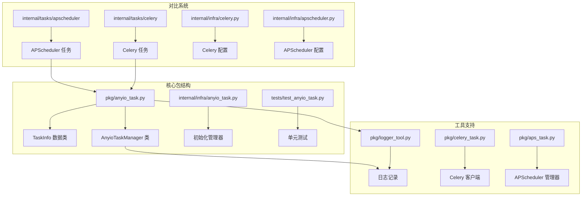
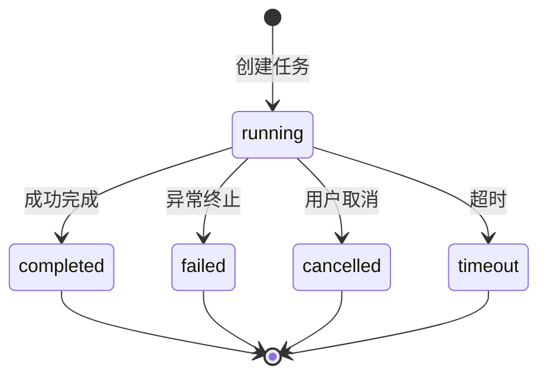
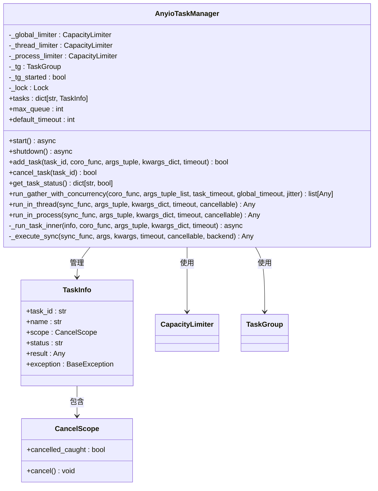
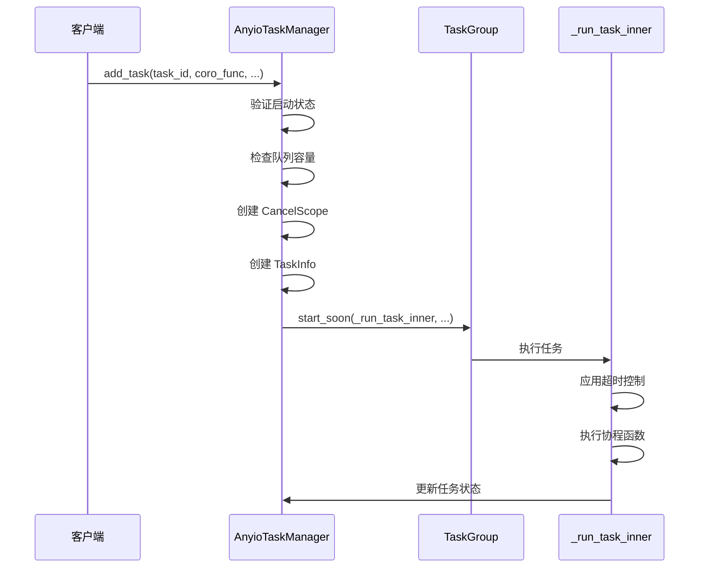
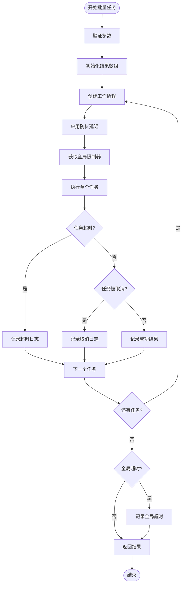
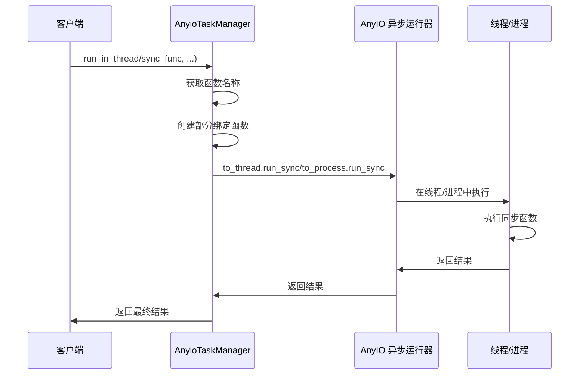
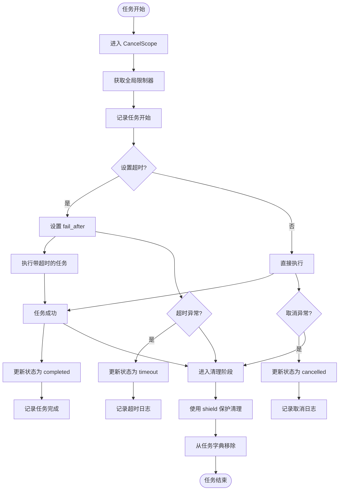
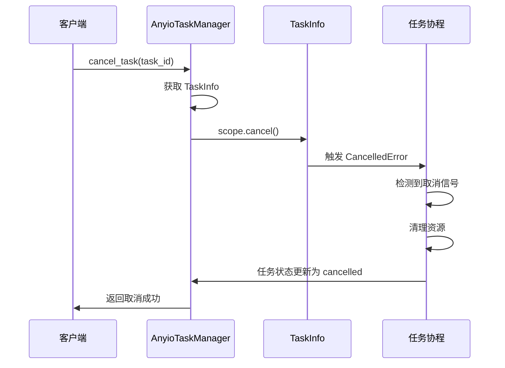
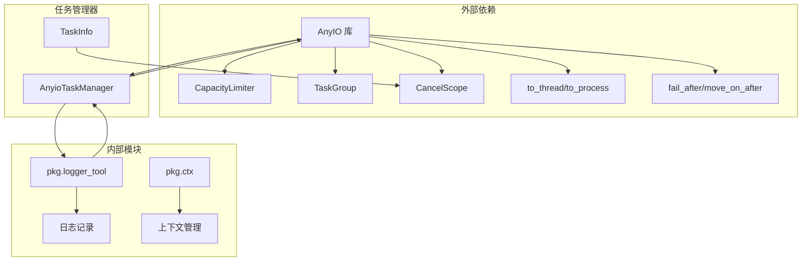

# AnyIO 异步任务管理器深入文档

<cite>
**本文档中引用的文件**
- [pkg/anyio_task.py](file://pkg/anyio_task.py)
- [internal/infra/anyio_task.py](file://internal/infra/anyio_task.py)
- [tests/test_anyio_task.py](file://tests/test_anyio_task.py)
- [internal/tasks/celery/tasks.py](file://internal/tasks/celery/tasks.py)
- [internal/tasks/apscheduler/tasks.py](file://internal/tasks/apscheduler/tasks.py)
- [internal/infra/celery.py](file://internal/infra/celery.py)
- [internal/infra/apscheduler.py](file://internal/infra/apscheduler.py)
- [pkg/logger_tool.py](file://pkg/logger_tool.py)
- [pkg/celery_task.py](file://pkg/celery_task.py)
- [pkg/aps_task.py](file://pkg/aps_task.py)
</cite>

## 目录
1. [简介](#简介)
2. [项目结构](#项目结构)
3. [核心组件](#核心组件)
4. [架构概览](#架构概览)
5. [详细组件分析](#详细组件分析)
6. [依赖关系分析](#依赖关系分析)
7. [性能考虑](#性能考虑)
8. [故障排除指南](#故障排除指南)
9. [结论](#结论)

## 简介

AnyIO 异步任务管理器是一个轻量级的异步任务协调器，专为高并发的短时异步操作设计。它提供了优雅的 API 来管理批量 HTTP 请求、I/O 密集型任务以及其他需要高效并发控制的异步工作负载。

该管理器的核心优势在于：
- **轻量级设计**：专注于短时异步任务，避免复杂的分布式任务队列开销
- **细粒度并发控制**：提供全局、线程和进程级别的容量限制
- **完善的任务生命周期管理**：支持任务取消、超时控制和状态跟踪
- **异步上下文安全**：确保在异步环境中安全地执行阻塞操作

## 项目结构

**图表来源**
- [pkg/anyio_task.py](file://pkg/anyio_task.py#L1-L379)
- [internal/infra/anyio_task.py](file://internal/infra/anyio_task.py#L1-L29)

**章节来源**
- [pkg/anyio_task.py](file://pkg/anyio_task.py#L1-L50)
- [internal/infra/anyio_task.py](file://internal/infra/anyio_task.py#L1-L29)

## 核心组件

### CapacityLimiter 并发控制

AnyIO 异步任务管理器实现了三层并发控制机制：

| 控制级别 | 默认值计算 | 用途 | 配置范围 |
|---------|-----------|------|----------|
| 全局限制器 | `min(max(32, 4 * CPU), 256)` | 控制总并发度 | 32-256 |
| 线程限制器 | `min(max(16, (2 * GLOBAL_MAX_DEFAULT) // 3), 128)` | 控制线程并发 | 16-128 |
| 进程限制器 | `max(1, min(CPU, 8))` | 控制进程并发 | 1-8 |

这些限制器确保系统不会因为过度并发而导致资源耗尽。

### TaskInfo 数据类

TaskInfo 类负责跟踪每个任务的完整生命周期状态：

**图表来源**
- [pkg/anyio_task.py](file://pkg/anyio_task.py#L32-L40)

### TaskGroup 持久化运行机制

AnyioTaskManager 使用持久化的 TaskGroup 来管理任务的生命周期，确保：
- **持久运行**：TaskGroup 在管理器启动后持续运行
- **任务隔离**：每个任务在独立的协程中执行
- **优雅关闭**：支持平滑的任务取消和资源清理

**章节来源**
- [pkg/anyio_task.py](file://pkg/anyio_task.py#L23-L30)
- [pkg/anyio_task.py](file://pkg/anyio_task.py#L32-L40)
- [pkg/anyio_task.py](file://pkg/anyio_task.py#L42-L85)

## 架构概览

**图表来源**
- [pkg/anyio_task.py](file://pkg/anyio_task.py#L32-L40)
- [pkg/anyio_task.py](file://pkg/anyio_task.py#L42-L85)

## 详细组件分析

### 公共 API 分析

#### add_task 方法

add_task 是最核心的 API，用于提交协程任务并支持超时控制：

**图表来源**
- [pkg/anyio_task.py](file://pkg/anyio_task.py#L180-L212)
- [pkg/anyio_task.py](file://pkg/anyio_task.py#L102-L147)

#### run_gather_with_concurrency 方法

该方法实现带并发限制和全局超时的批量任务执行：

**图表来源**
- [pkg/anyio_task.py](file://pkg/anyio_task.py#L229-L274)

#### run_in_thread/run_in_process 方法

这两个方法安全地在异步上下文中执行阻塞的同步函数：

**图表来源**
- [pkg/anyio_task.py](file://pkg/anyio_task.py#L148-L178)
- [pkg/anyio_task.py](file://pkg/anyio_task.py#L276-L300)

**章节来源**
- [pkg/anyio_task.py](file://pkg/anyio_task.py#L180-L212)
- [pkg/anyio_task.py](file://pkg/anyio_task.py#L229-L274)
- [pkg/anyio_task.py](file://pkg/anyio_task.py#L276-L300)

### 内部执行逻辑分析

#### _run_task_inner 方法

这是任务执行的核心逻辑，实现了完整的异常捕获、日志记录和资源清理：

**图表来源**
- [pkg/anyio_task.py](file://pkg/anyio_task.py#L102-L147)

#### 异常处理机制

AnyIO 异步任务管理器实现了完善的异常处理策略：

| 异常类型 | 处理方式 | 状态更新 | 日志记录 |
|---------|---------|---------|----------|
| `CancelledError` | 任务取消 | `cancelled` | 信息级别 |
| `TimeoutError` | 超时处理 | `timeout` | 错误级别 |
| 其他异常 | 异常捕获 | `failed` | 错误级别（包含堆栈） |
| 清理异常 | 抑制异常 | 无变化 | 警告级别 |

**章节来源**
- [pkg/anyio_task.py](file://pkg/anyio_task.py#L102-L147)

### 任务取消模型

基于 CancelScope 的任务取消模型提供了细粒度的控制：

**图表来源**
- [pkg/anyio_task.py](file://pkg/anyio_task.py#L214-L223)

**章节来源**
- [pkg/anyio_task.py](file://pkg/anyio_task.py#L214-L223)

## 依赖关系分析

### 核心依赖关系

**图表来源**
- [pkg/anyio_task.py](file://pkg/anyio_task.py#L1-L20)
- [pkg/logger_tool.py](file://pkg/logger_tool.py#L1-L50)

### 与其他任务管理器的对比

| 特性 | AnyIO | Celery | APScheduler |
|------|-------|--------|-------------|
| **架构复杂度** | 轻量级 | 分布式 | 单机 |
| **并发控制** | 细粒度三层限制 | 队列+Worker | 单线程调度 |
| **任务持久性** | 内存管理 | 永久存储 | 内存管理 |
| **适用场景** | 短时异步任务 | 长时间后台任务 | 定时任务 |
| **部署要求** | 单进程 | 多进程集群 | 单进程 |

**章节来源**
- [pkg/anyio_task.py](file://pkg/anyio_task.py#L1-L20)
- [internal/infra/celery.py](file://internal/infra/celery.py#L1-L50)
- [pkg/aps_task.py](file://pkg/aps_task.py#L1-L50)

## 性能考虑

### 并发控制优化

AnyIO 异步任务管理器通过以下机制优化性能：

1. **动态限制器配置**：根据 CPU 核心数自动调整并发限制
2. **分层并发控制**：避免单一限制器成为性能瓶颈
3. **非阻塞队列管理**：使用字典而非队列提高查找效率
4. **批量操作优化**：支持批量任务提交和状态查询

### 内存管理

- **弱引用模式**：任务完成后立即从内存中移除
- **锁竞争最小化**：只在必要时获取全局锁
- **资源清理及时性**：使用 shield 保护的清理机制

### 网络 I/O 优化

对于 HTTP 请求等网络密集型任务：
- **连接池复用**：通过 AnyIO 的异步 HTTP 客户端
- **请求限流**：通过 CapacityLimiter 控制并发请求数
- **超时控制**：防止网络延迟导致的资源浪费

## 故障排除指南

### 常见问题及解决方案

#### 1. 任务队列溢出

**症状**：`Queue overflow: {max_queue}` 异常
**原因**：提交的任务数量超过 `ANYIO_TM_MAX_QUEUE` 限制
**解决方案**：
- 增加 `max_queue` 配置
- 优化任务提交频率
- 检查任务完成情况，避免任务堆积

#### 2. 任务超时问题

**症状**：任务频繁超时或长时间卡住
**原因**：
- 超时时间设置过短
- 任务本身存在死循环
- 网络连接不稳定

**解决方案**：
- 调整 `default_timeout` 设置
- 检查任务逻辑
- 实现任务进度报告机制

#### 3. 任务取消失效

**症状**：调用 `cancel_task()` 后任务仍然运行
**原因**：
- 任务内部没有正确处理取消信号
- 任务执行时间过短，取消信号被忽略

**解决方案**：
- 在任务中定期检查取消状态
- 使用 `fail_after()` 设置超时
- 实现优雅的取消处理逻辑

**章节来源**
- [pkg/anyio_task.py](file://pkg/anyio_task.py#L196-L202)
- [pkg/anyio_task.py](file://pkg/anyio_task.py#L129-L140)

### 调试技巧

1. **启用详细日志**：设置日志级别为 DEBUG 查看任务执行详情
2. **监控任务状态**：定期调用 `get_task_status()` 检查活跃任务
3. **使用任务 ID**：为每个任务分配唯一 ID 便于追踪
4. **异常堆栈分析**：利用 `exc_info=True` 记录完整的异常信息

## 结论

AnyIO 异步任务管理器是一个设计精良的轻量级任务协调器，特别适合以下场景：

### 适用场景

1. **高并发短时任务**：如批量 API 调用、数据处理流水线
2. **I/O 密集型操作**：文件读写、网络请求、数据库查询
3. **实时性要求高的任务**：需要快速响应和处理的异步工作负载
4. **资源受限环境**：不需要复杂分布式架构的小规模应用

### 设计优势

- **简洁性**：API 设计直观，易于理解和使用
- **安全性**：完善的异常处理和资源清理机制
- **可扩展性**：支持多种并发控制策略
- **可观测性**：完整的任务状态跟踪和日志记录

### 与其他方案的比较

| 方案 | 优势 | 劣势 | 推荐场景 |
|------|------|------|----------|
| **AnyIO** | 轻量、高性能、易集成 | 无持久化、单进程 | 短时异步任务 |
| **Celery** | 持久化、分布式、功能丰富 | 复杂、资源消耗大 | 长时间后台任务 |
| **APScheduler** | 定时任务专业、配置灵活 | 无并发控制、单进程 | 定时任务调度 |

AnyIO 异步任务管理器为现代异步应用提供了一个平衡性能与易用性的优秀解决方案，特别适合需要高效并发控制但又不想引入复杂分布式架构的应用场景。