# Celery 分布式任务系统详细文档

<cite>
**本文档中引用的文件**
- [internal/infra/celery.py](file://internal/infra/celery.py)
- [scripts/run_celery_worker.py](file://scripts/run_celery_worker.py)
- [internal/tasks/celery/tasks.py](file://internal/tasks/celery/tasks.py)
- [pkg/celery_task.py](file://pkg/celery_task.py)
- [internal/config/setting.py](file://internal/config/setting.py)
- [internal/infra/redis.py](file://internal/infra/redis.py)
- [internal/infra/database.py](file://internal/infra/database.py)
- [internal/tasks/apscheduler/tasks.py](file://internal/tasks/apscheduler/tasks.py)
</cite>

## 目录
1. [简介](#简介)
2. [项目结构概览](#项目结构概览)
3. [CeleryClient 初始化详解](#celeryclient-初始化详解)
4. [Broker 和 Backend 配置](#broker-和-backend-配置)
5. [任务模块注册](#任务模块注册)
6. [任务路由规则](#任务路由规则)
7. [静态定时任务调度表](#静态定时任务调度表)
8. [任务装饰器使用](#任务装饰器使用)
9. [Worker 生命周期钩子](#worker-生命周期钩子)
10. [Worker 启动脚本](#worker-启动脚本)
11. [任务定义与调用](#任务定义与调用)
12. [任务重试机制](#任务重试机制)
13. [部署与监控](#部署与监控)
14. [故障排查指南](#故障排查指南)

## 简介

本文档详细介绍了基于 FastAPI 后端项目的 Celery 分布式任务系统架构和实现细节。该系统采用 Redis 作为消息代理和结果存储，支持异步任务执行、周期性任务调度和任务重试机制。

## 项目结构概览

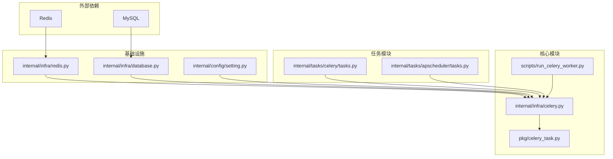

**图表来源**
- [internal/infra/celery.py](file://internal/infra/celery.py#L1-L152)
- [pkg/celery_task.py](file://pkg/celery_task.py#L1-L287)

**章节来源**
- [internal/infra/celery.py](file://internal/infra/celery.py#L1-L152)
- [scripts/run_celery_worker.py](file://scripts/run_celery_worker.py#L1-L38)

## CeleryClient 初始化详解

### 核心配置参数

CeleryClient 是整个任务系统的入口点，负责初始化和配置 Celery 应用程序：

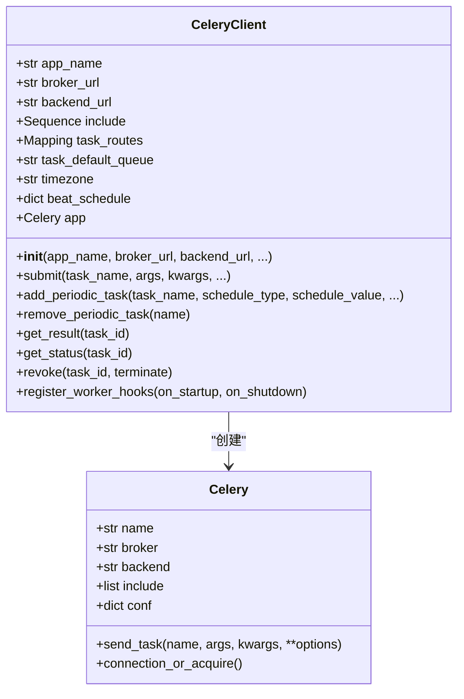

**图表来源**
- [pkg/celery_task.py](file://pkg/celery_task.py#L24-L71)
- [internal/infra/celery.py](file://internal/infra/celery.py#L92-L108)

### 基础配置项

| 配置项 | 类型 | 描述 | 默认值 |
|--------|------|------|--------|
| app_name | str | Celery 应用名称 | "my_fastapi_server" |
| broker_url | str | 消息代理 URL | setting.redis_url |
| backend_url | str | 结果存储 URL | setting.redis_url |
| include | Sequence[str] | 包含的任务模块列表 | CELERY_INCLUDE_MODULES |
| task_routes | Mapping | 任务路由配置 | CELERY_TASK_ROUTES |
| task_default_queue | str | 默认队列名称 | "default" |
| timezone | str | 时区设置 | "Asia/Shanghai" |

**章节来源**
- [internal/infra/celery.py](file://internal/infra/celery.py#L92-L108)
- [pkg/celery_task.py](file://pkg/celery_task.py#L29-L71)

## Broker 和 Backend 配置

### Redis 配置详情

系统使用 Redis 作为消息代理和结果存储，配置通过环境变量管理：

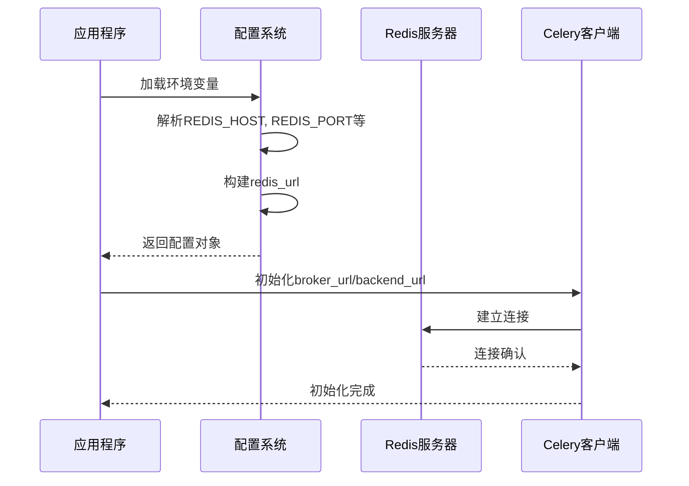

**图表来源**
- [internal/config/setting.py](file://internal/config/setting.py#L46-L50)
- [internal/infra/celery.py](file://internal/infra/celery.py#L95-L96)

### 环境配置映射

| 环境变量 | 配置属性 | 示例值 | 说明 |
|----------|----------|--------|------|
| REDIS_HOST | REDIS_HOST | "127.0.0.1" | Redis主机地址 |
| REDIS_PORT | REDIS_PORT | 6379 | Redis端口号 |
| REDIS_DB | REDIS_DB | 0 | Redis数据库编号 |
| REDIS_PASSWORD | REDIS_PASSWORD | "" | Redis密码 |

**章节来源**
- [internal/config/setting.py](file://internal/config/setting.py#L28-L50)
- [internal/infra/celery.py](file://internal/infra/celery.py#L95-L96)

## 任务模块注册

### CELERY_INCLUDE_MODULES 配置

系统通过 `CELERY_INCLUDE_MODULES` 列表注册需要加载的任务模块：

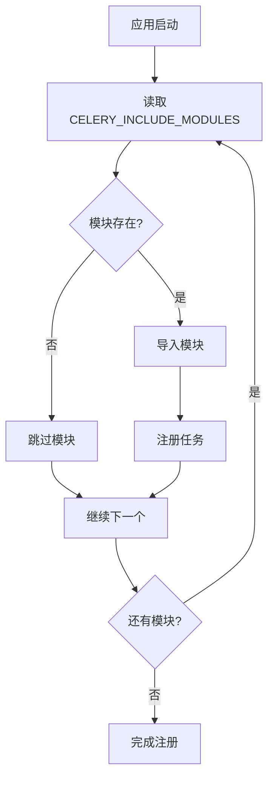

**图表来源**
- [internal/infra/celery.py](file://internal/infra/celery.py#L17-L19)

### 模块注册表

| 模块路径 | 用途 | 任务类型 |
|----------|------|----------|
| "internal.aps_tasks.tasks" | 定时任务 | APScheduler 任务 |

**章节来源**
- [internal/infra/celery.py](file://internal/infra/celery.py#L17-L19)

## 任务路由规则

### CELERY_TASK_ROUTES 配置

任务路由决定了不同类型的任务会被分发到哪个队列：

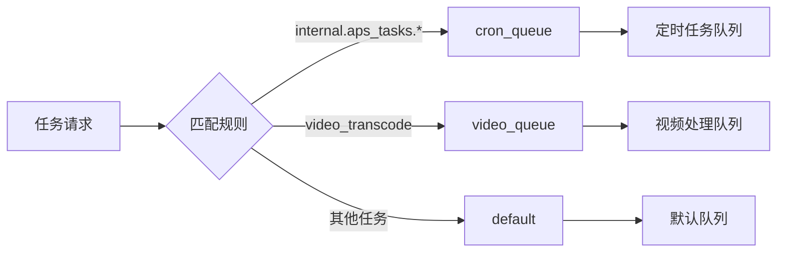

**图表来源**
- [internal/infra/celery.py](file://internal/infra/celery.py#L22-L26)

### 路由规则表

| 任务模式 | 目标队列 | 优先级 | 特殊配置 |
|----------|----------|--------|----------|
| "internal.aps_tasks.*" | cron_queue | 默认 | 定时任务专用 |
| "internal.business.video.transcode" | video_queue | 10 | 高优先级 |

**章节来源**
- [internal/infra/celery.py](file://internal/infra/celery.py#L22-L26)

## 静态定时任务调度表

### STATIC_BEAT_SCHEDULE 配置

静态定时任务调度表定义了预配置的周期性任务：

```mermaid
gantt
title 定时任务调度计划
dateFormat HH:mm
axisFormat %H:%M
section Cron风格任务
每15分钟执行 :milestone, m1, 00:00, 00:15
每天早上8:30 :milestone, m2, 08:30, 08:30
section Interval风格任务
每30秒执行 :milestone, m3, 00:00, 00:30
```

**图表来源**
- [internal/infra/celery.py](file://internal/infra/celery.py#L31-L49)

### 任务配置表

| 任务标识 | 任务名称 | 执行频率 | 参数 |
|----------|----------|----------|------|
| task_sum_every_15_min | math.number_sum | 每15分钟 | (10, 20) |
| task_daily_report_morning | math.number_sum | 每天8:30 | {"x": 100, "y": 200} |
| task_heartbeat_30s | math.number_sum | 每30秒 | (1, 1) |

**章节来源**
- [internal/infra/celery.py](file://internal/infra/celery.py#L31-L49)

## 任务装饰器使用

### @celery_client.app.task 装饰器

系统使用封装后的 CeleryClient 来定义任务：

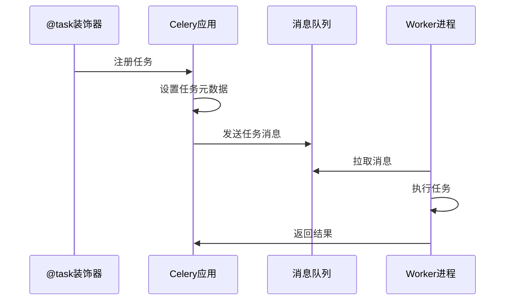

**图表来源**
- [internal/tasks/celery/tasks.py](file://internal/tasks/celery/tasks.py#L5-L33)

### 任务定义示例

| 任务名称 | 绑定参数 | 任务类型 | 特殊功能 |
|----------|----------|----------|----------|
| number_sum | bind=True | 异步任务 | 支持重试 |
| task_sum_every_15_min | bind=True | 定时任务 | 支持重试 |

**章节来源**
- [internal/tasks/celery/tasks.py](file://internal/tasks/celery/tasks.py#L5-L33)

## Worker 生命周期钩子

### 生命周期管理流程

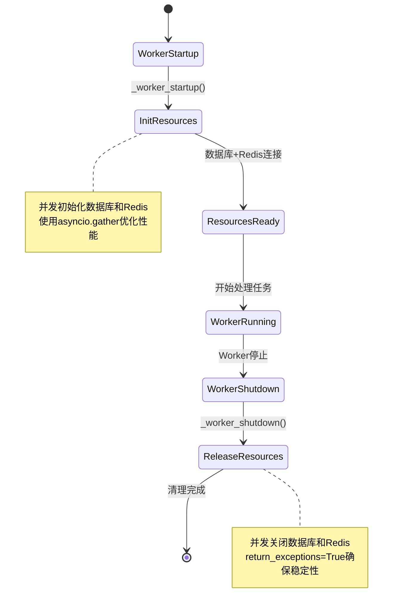

**图表来源**
- [internal/infra/celery.py](file://internal/infra/celery.py#L57-L85)

### 钩子函数详解

| 钩子函数 | 触发时机 | 功能 | 实现细节 |
|----------|----------|------|----------|
| _worker_startup | Worker进程启动 | 初始化资源 | 并发初始化数据库和Redis |
| _worker_shutdown | Worker进程关闭 | 释放资源 | 并发关闭数据库和Redis |

**章节来源**
- [internal/infra/celery.py](file://internal/infra/celery.py#L57-L85)

## Worker 启动脚本

### run_celery_worker.py 脚本

启动脚本提供了灵活的 Worker 启动方式：

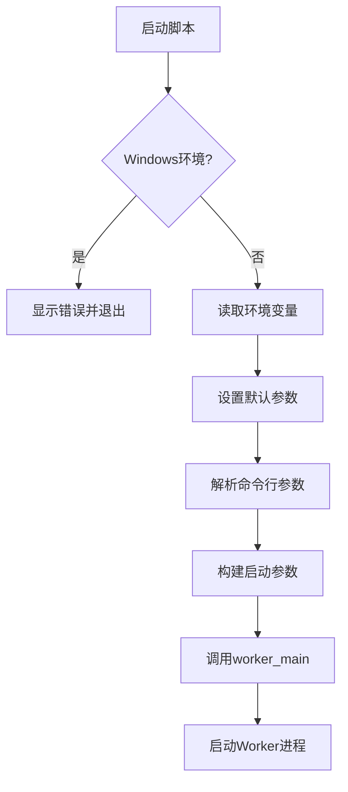

**图表来源**
- [scripts/run_celery_worker.py](file://scripts/run_celery_worker.py#L6-L34)

### 启动参数配置

| 参数 | 默认值 | 说明 |
|------|--------|------|
| pool | "prefork" | 进程池类型 |
| concurrency | "4" | 并发数 |
| loglevel | "debug" | 日志级别 |
| queues | default_queue | 监听队列 |

**章节来源**
- [scripts/run_celery_worker.py](file://scripts/run_celery_worker.py#L13-L17)

## 任务定义与调用

### 任务提交方式

系统提供了多种任务提交方式：

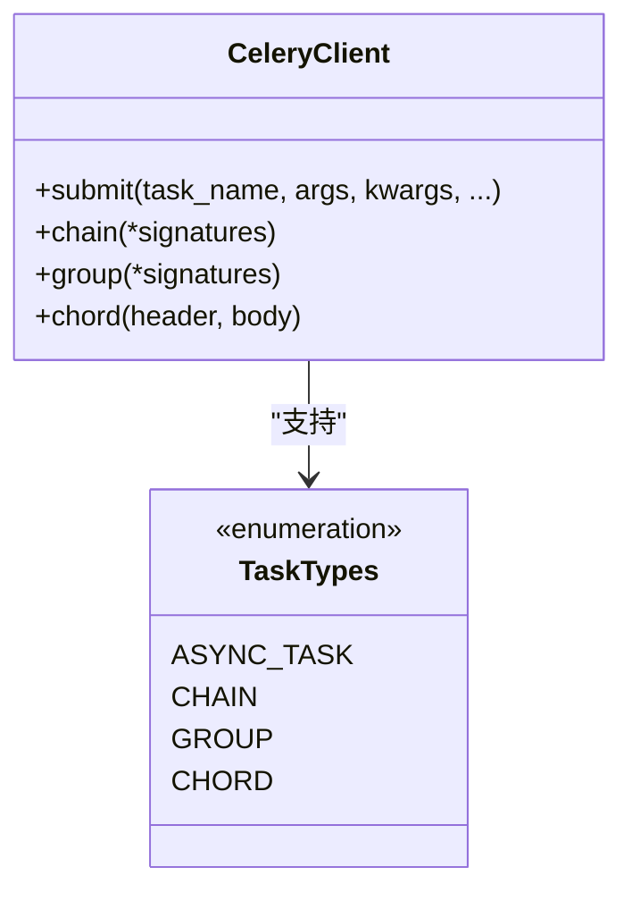

**图表来源**
- [pkg/celery_task.py](file://pkg/celery_task.py#L75-L128)

### 任务调用示例

| 调用方式 | 方法 | 使用场景 |
|----------|------|----------|
| 延迟调用 | delay() | 简单异步任务 |
| 异步调用 | apply_async() | 带参数控制的任务 |
| 任务链 | chain() | 顺序执行任务 |
| 任务组 | group() | 并发执行任务 |
| 回调链 | chord() | 组合回调任务 |

**章节来源**
- [pkg/celery_task.py](file://pkg/celery_task.py#L75-L128)

## 任务重试机制

### 重试配置详解

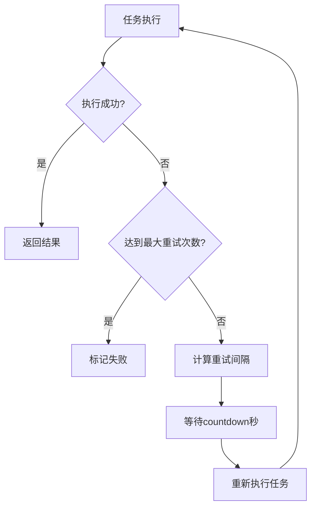

**图表来源**
- [internal/tasks/celery/tasks.py](file://internal/tasks/celery/tasks.py#L17-L18)

### 重试参数配置

| 参数 | 类型 | 默认值 | 说明 |
|------|------|--------|------|
| countdown | int | 5 | 重试前等待秒数 |
| max_retries | int | 3 | 最大重试次数 |
| exc | Exception | 自动捕获 | 重试时传递的异常 |

**章节来源**
- [internal/tasks/celery/tasks.py](file://internal/tasks/celery/tasks.py#L17-L18)

## 部署与监控

### 启动命令

系统提供了两种主要的启动命令：

| 命令类型 | 命令格式 | 用途 |
|----------|----------|------|
| Worker启动 | `celery -A internal.infra.celery.celery_app worker -l info` | 执行任务 |
| Beat启动 | `celery -A internal.infra.celery.celery_app beat -l info` | 派发定时任务 |

### 监控指标

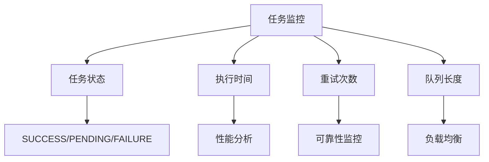

**章节来源**
- [internal/infra/celery.py](file://internal/infra/celery.py#L147-L152)

## 故障排查指南

### 常见问题与解决方案

| 问题类型 | 症状 | 可能原因 | 解决方案 |
|----------|------|----------|----------|
| 连接失败 | Broker连接超时 | Redis服务未启动 | 检查Redis服务状态 |
| 任务不执行 | 任务状态保持PENDING | Worker进程未启动 | 启动Worker进程 |
| 内存泄漏 | Worker占用内存持续增长 | 任务处理不当 | 检查任务逻辑和资源释放 |
| 性能问题 | 任务执行缓慢 | 队列积压严重 | 增加Worker数量或优化任务 |

### 调试技巧

1. **日志级别调整**：使用 `-l debug` 获取详细日志
2. **任务状态查询**：通过 `get_status()` 检查任务状态
3. **连接健康检查**：使用 `init_celery()` 进行连接测试
4. **队列监控**：观察不同队列的任务积压情况

**章节来源**
- [internal/infra/celery.py](file://internal/infra/celery.py#L124-L143)

## 总结

该 Celery 分布式任务系统通过以下特性实现了高效的任务管理和调度：

1. **统一配置管理**：通过 Redis 实现消息代理和结果存储
2. **灵活的任务路由**：支持按任务类型分发到不同队列
3. **完善的生命周期管理**：自动处理资源的初始化和释放
4. **强大的任务编排**：支持链式、并行和回调等多种任务组合
5. **可靠的重试机制**：确保任务执行的可靠性
6. **便捷的部署方式**：提供灵活的启动脚本和监控接口

该系统为 FastAPI 应用提供了完整的异步任务处理能力，支持从简单的后台任务到复杂的业务流程编排的各种需求。