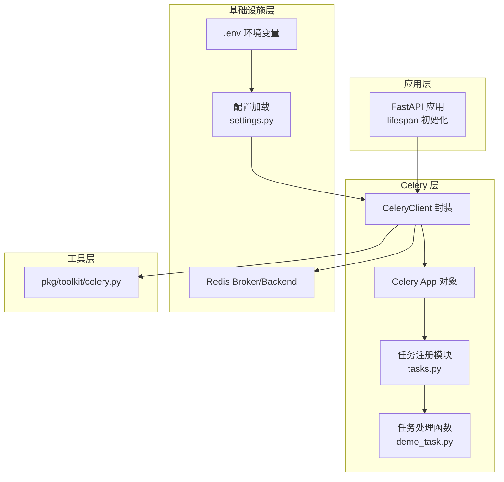
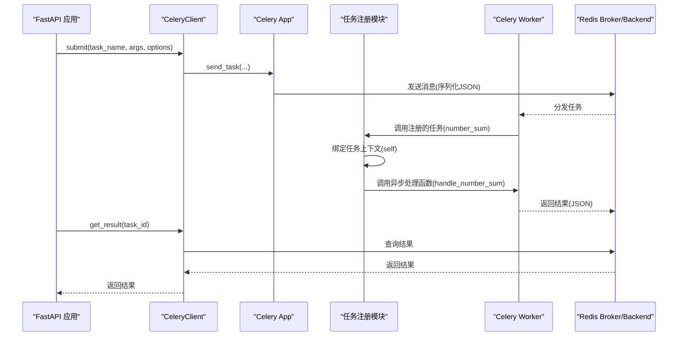
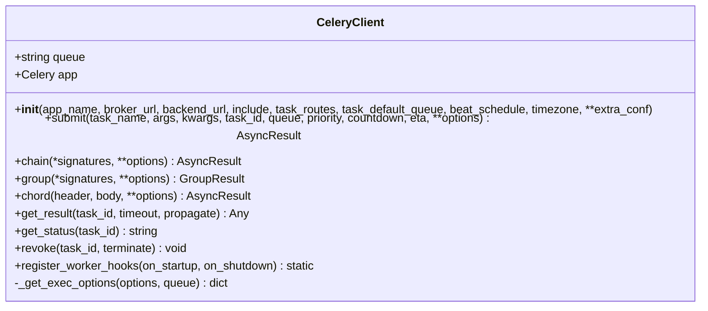
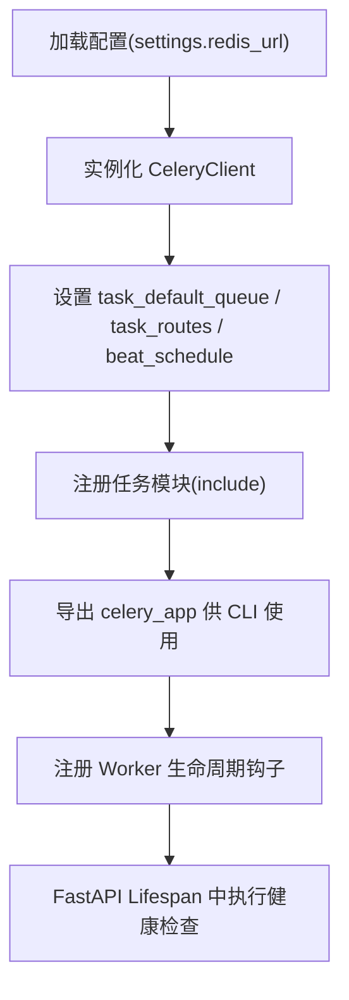
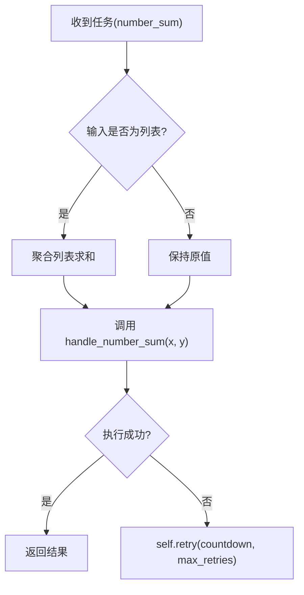
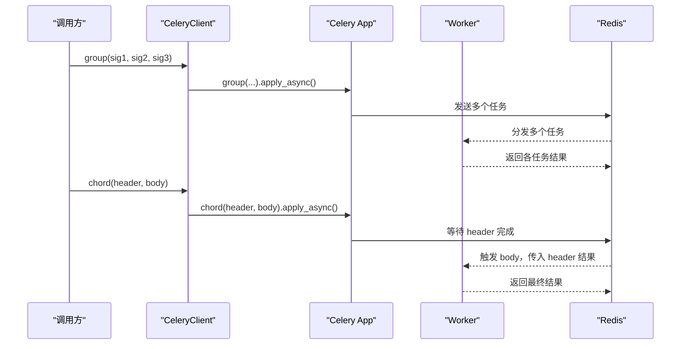
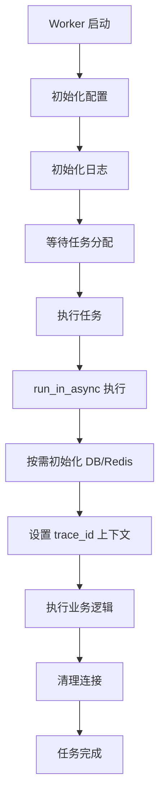
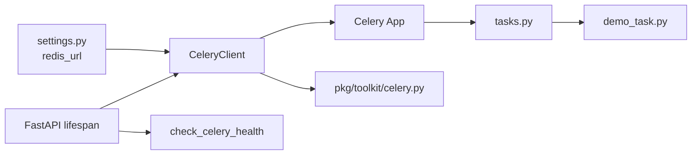

# Celery分布式任务

<cite>
**本文引用的文件**
- [internal/utils/celery/__init__.py](file://internal/utils/celery/__init__.py)
- [pkg/toolkit/celery.py](file://pkg/toolkit/celery.py)
- [internal/tasks/demo_task.py](file://internal/tasks/demo_task.py)
- [scripts/run_celery_worker.py](file://scripts/run_celery_worker.py)
- [tests/test_celery_tasks.py](file://tests/test_celery_tasks.py)
- [internal/config/settings.py](file://internal/config/settings.py)
- [internal/app.py](file://internal/app.py)
</cite>

## 更新摘要
**所做更改**
- 更新了worker启动流程优化部分，反映重新设计的启动顺序
- 移除了worker内冗余数据库和Redis初始化的说明
- 改进了run_in_async函数的trace_id参数支持说明
- 简化了worker关闭过程的描述
- 更新了worker生命周期钩子的实现细节

## 目录
1. [简介](#简介)
2. [项目结构](#项目结构)
3. [核心组件](#核心组件)
4. [架构总览](#架构总览)
5. [详细组件分析](#详细组件分析)
6. [依赖关系分析](#依赖关系分析)
7. [性能考虑](#性能考虑)
8. [故障排除指南](#故障排除指南)
9. [结论](#结论)
10. [附录](#附录)

## 简介
本文件面向使用 Celery 的开发者，系统化阐述本项目的分布式任务体系：从配置、任务注册、任务执行、编排（链式、分组、Chord）、重试与错误恢复、与 Redis 的集成、监控与健康检查，到性能优化与并发控制的最佳实践。文档以"number_sum"任务为例，展示如何在 FastAPI 应用中安全地提交、执行与追踪异步任务，并给出常见问题的排查步骤。

## 项目结构
本项目采用"基础设施层 + 工具层 + 业务层"的分层组织方式，Celery 相关代码集中在以下位置：
- 配置与客户端封装：internal/utils/celery 与 pkg/toolkit/celery.py
- 任务定义与注册：internal/utils/celery/tasks.py 与 internal/tasks/demo_task.py
- Worker 启动脚本：scripts/run_celery_worker.py
- 测试与验证：tests/test_celery_tasks.py
- 配置加载：internal/config/settings.py 与 configs/.env.dev
- FastAPI 集成：internal/app.py

**图表来源**
- [internal/utils/celery/__init__.py](file://internal/utils/celery/__init__.py#L86-L100)
- [pkg/toolkit/celery.py](file://pkg/toolkit/celery.py#L15-L51)
- [internal/tasks/demo_task.py](file://internal/tasks/demo_task.py#L9-L19)
- [scripts/run_celery_worker.py](file://scripts/run_celery_worker.py#L1-L43)

**章节来源**
- [internal/utils/celery/__init__.py](file://internal/utils/celery/__init__.py#L1-L185)
- [pkg/toolkit/celery.py](file://pkg/toolkit/celery.py#L1-L198)
- [internal/tasks/demo_task.py](file://internal/tasks/demo_task.py#L1-L20)
- [scripts/run_celery_worker.py](file://scripts/run_celery_worker.py#L1-L43)
- [tests/test_celery_tasks.py](file://tests/test_celery_tasks.py#L1-L361)
- [internal/config/settings.py](file://internal/config/settings.py#L1-L243)
- [internal/app.py](file://internal/app.py#L1-L109)

## 核心组件
- CeleryClient：对 Celery 的轻量封装，提供任务提交、编排（链式/分组/Chord）、状态查询、撤销、Worker 生命周期钩子注册等能力。
- CeleryApp 与配置：集中于 internal/utils/celery/__init__.py，负责任务模块注册、路由、静态定时任务、Broker/Backend URL、Worker 生命周期钩子注册。
- 任务注册与实现：internal/utils/celery/tasks.py 中定义 number_sum 任务；内部逻辑由 internal/tasks/demo_task.py 提供的异步处理函数实现。
- Worker 启动脚本：scripts/run_celery_worker.py 提供统一的启动入口，支持并发与队列参数。
- 配置与环境：internal/config/settings.py 生成 redis_url；configs/.env.dev 提供 Redis 连接参数。
- FastAPI 集成：在应用生命周期中进行 Celery 健康检查与资源初始化。

**章节来源**
- [pkg/toolkit/celery.py](file://pkg/toolkit/celery.py#L15-L198)
- [internal/utils/celery/__init__.py](file://internal/utils/celery/__init__.py#L86-L100)
- [internal/tasks/demo_task.py](file://internal/tasks/demo_task.py#L9-L19)
- [scripts/run_celery_worker.py](file://scripts/run_celery_worker.py#L1-L43)
- [internal/config/settings.py](file://internal/config/settings.py#L161-L173)
- [internal/app.py](file://internal/app.py#L84-L109)

## 架构总览
Celery 在本项目中的角色是"异步任务编排与执行引擎"，与 FastAPI 应用解耦，Worker 独立运行。应用通过 CeleryClient 提交任务，任务在 Worker 中执行，结果写回 Redis Backend，客户端可轮询或通过回调获取结果。

**图表来源**
- [pkg/toolkit/celery.py](file://pkg/toolkit/celery.py#L75-L107)
- [internal/utils/celery/__init__.py](file://internal/utils/celery/__init__.py#L129-L160)
- [internal/tasks/demo_task.py](file://internal/tasks/demo_task.py#L9-L19)

## 详细组件分析

### CeleryClient 封装
- 作用：统一任务提交、编排、状态查询、撤销与 Worker 生命周期钩子注册。
- 关键点：
  - 任务序列化与内容类型：task_serializer、accept_content、result_serializer 均为 json。
  - 默认队列与路由：task_default_queue 与 task_routes 控制任务去向。
  - 编排接口：chain/group/chord 均通过签名对象组合，并传入 app=self.app。
  - 执行选项合并：_get_exec_options 支持显式参数、options 字典与实例默认值的优先级合并。
  - 生命周期钩子：register_worker_hooks 使用信号注册，支持同步/异步启动/关闭钩子。

**图表来源**
- [pkg/toolkit/celery.py](file://pkg/toolkit/celery.py#L15-L198)

**章节来源**
- [pkg/toolkit/celery.py](file://pkg/toolkit/celery.py#L15-L198)

### CeleryApp 与配置
- 任务模块注册：CELERY_INCLUDE_MODULES 指定需要加载的任务模块路径。
- 任务路由：CELERY_TASK_ROUTES 将任务名映射到队列，例如将注册模块的任务路由到 celery_queue，定时任务路由到 cron_queue。
- 静态定时任务：STATIC_BEAT_SCHEDULE 定义基于 Cron/Interval 的周期性任务。
- Broker/Backend：使用 settings.redis_url，统一从配置加载。
- Worker 生命周期钩子：在模块层注册，启动时初始化日志，关闭时清理基础资源。
- 健康检查：check_celery_health 主动检测 Broker 连通性，不影响 API 启动。

**图表来源**
- [internal/utils/celery/__init__.py](file://internal/utils/celery/__init__.py#L86-L100)

**章节来源**
- [internal/utils/celery/__init__.py](file://internal/utils/celery/__init__.py#L18-L100)
- [internal/config/settings.py](file://internal/config/settings.py#L161-L173)

### 任务注册与绑定
- 任务定义：在 tasks.py 中使用 @celery_client.app.task(bind=True, name=...) 注册 number_sum 任务。
- 绑定上下文：bind=True 使得任务函数接收 self，便于重试、记录日志、获取任务元数据。
- 兼容 Chord 回调：当输入 x 为列表（来自 group/chord 的结果集）时，先聚合求和，再继续处理。
- 异常与重试：捕获异常后抛出 self.retry，设置 countdown 与 max_retries，实现指数退避重试。
- 异步执行：通过 anyio.run 调用内部异步处理函数 handle_number_sum，保证在 Worker 事件循环中安全执行。

**图表来源**
- [internal/utils/celery/__init__.py](file://internal/utils/celery/__init__.py#L129-L160)
- [internal/tasks/demo_task.py](file://internal/tasks/demo_task.py#L9-L19)

**章节来源**
- [internal/utils/celery/__init__.py](file://internal/utils/celery/__init__.py#L129-L160)
- [internal/tasks/demo_task.py](file://internal/tasks/demo_task.py#L9-L19)

### 编排：链式、分组与 Chord
- 链式（Chain）：将多个任务串联，前一个任务的结果作为下一个任务的第一个参数。
- 分组（Group）：并发执行多个相同或不同的任务，返回各任务结果列表。
- Chord：先执行一组任务（Header），完成后将结果汇总作为参数传入回调任务（Body）。本项目通过在任务中兼容列表输入，完整验证 Chord 的回调逻辑。

**图表来源**
- [pkg/toolkit/celery.py](file://pkg/toolkit/celery.py#L112-L136)
- [tests/test_celery_tasks.py](file://tests/test_celery_tasks.py#L242-L274)

**章节来源**
- [pkg/toolkit/celery.py](file://pkg/toolkit/celery.py#L112-L136)
- [tests/test_celery_tasks.py](file://tests/test_celery_tasks.py#L208-L274)

### Worker 启动流程优化
**更新** 重新设计了worker启动流程，移除了冗余的数据库和Redis初始化

- 启动顺序优化：
  - 首先初始化配置（其他组件可能依赖配置）
  - 然后初始化 Logger（依赖配置中的日志格式等）
  - 数据库和 Redis 连接在 run_in_async 中按需初始化

- run_in_async 函数改进：
  - 支持 trace_id 参数，用于分布式追踪
  - 自动重置旧的连接池
  - 在新事件循环中初始化数据库和 Redis
  - 设置上下文并清理连接

- 关闭过程简化：
  - 基础资源清理在 shutdown 钩子中执行
  - 数据库和 Redis 连接在 run_in_async 中已自动清理

**图表来源**
- [internal/utils/celery/__init__.py](file://internal/utils/celery/__init__.py#L55-L79)
- [internal/utils/celery/__init__.py](file://internal/utils/celery/__init__.py#L129-L160)

**章节来源**
- [internal/utils/celery/__init__.py](file://internal/utils/celery/__init__.py#L55-L79)
- [internal/utils/celery/__init__.py](file://internal/utils/celery/__init__.py#L129-L160)

### 任务执行与监控
- 执行入口：scripts/run_celery_worker.py 提供统一启动脚本，支持并发、队列与日志级别等参数。
- 监控与健康检查：在 FastAPI Lifespan 中调用 check_celery_health，主动检测 Broker 连通性。
- 状态查询：通过 celery_client.get_status/get_result 获取任务状态与结果。
- 撤销任务：celery_client.revoke 支持终止执行中的任务。

**章节来源**
- [scripts/run_celery_worker.py](file://scripts/run_celery_worker.py#L1-L43)
- [internal/utils/celery/__init__.py](file://internal/utils/celery/__init__.py#L108-L128)
- [pkg/toolkit/celery.py](file://pkg/toolkit/celery.py#L141-L154)

## 依赖关系分析
- CeleryClient 依赖 Celery 与 signals，提供任务提交与编排能力。
- CeleryApp 由 CeleryClient 实例化，配置来源于 settings.redis_url。
- 任务注册模块依赖 CeleryClient.app，任务实现依赖内部异步处理函数。
- 配置层通过 settings 生成 redis_url，供 CeleryClient 使用。
- FastAPI 应用在 lifespan 中进行 Celery 健康检查，确保 Broker 可用。

**图表来源**
- [internal/config/settings.py](file://internal/config/settings.py#L161-L173)
- [pkg/toolkit/celery.py](file://pkg/toolkit/celery.py#L15-L51)
- [internal/utils/celery/__init__.py](file://internal/utils/celery/__init__.py#L86-L100)
- [internal/tasks/demo_task.py](file://internal/tasks/demo_task.py#L9-L19)
- [internal/app.py](file://internal/app.py#L84-L109)

**章节来源**
- [internal/config/settings.py](file://internal/config/settings.py#L161-L173)
- [pkg/toolkit/celery.py](file://pkg/toolkit/celery.py#L15-L51)
- [internal/utils/celery/__init__.py](file://internal/utils/celery/__init__.py#L86-L100)
- [internal/tasks/demo_task.py](file://internal/tasks/demo_task.py#L9-L19)
- [internal/app.py](file://internal/app.py#L84-L109)

## 性能考虑
- 序列化与内容类型：统一使用 JSON，减少序列化开销，确保跨语言/跨服务兼容。
- 队列与路由：通过 task_routes 将不同类型任务分流至不同队列，避免热点队列拥塞。
- 并发与进程模型：Worker 启动脚本默认 prefork 模式，可通过 --concurrency 控制并发度；生产环境建议设置 --max-tasks-per-child 与 --max-memory-per-child 以提升稳定性。
- 任务粒度：将大任务拆分为小任务，配合 Group/Chord 提升吞吐与可观测性。
- 资源管理：Worker 生命周期钩子在启动时初始化日志，在关闭时清理基础资源，数据库和 Redis 连接按需初始化和清理。
- 超时与重试：合理设置 countdown 与 max_retries，避免无限重试造成资源浪费。

**章节来源**
- [pkg/toolkit/celery.py](file://pkg/toolkit/celery.py#L36-L48)
- [internal/utils/celery/__init__.py](file://internal/utils/celery/__init__.py#L24-L47)
- [scripts/run_celery_worker.py](file://scripts/run_celery_worker.py#L16-L17)

## 故障排除指南
- Broker 连接失败
  - 现象：Worker 启动或任务执行时报连接错误。
  - 排查：检查 configs/.env.dev 中的 REDIS_* 配置；确认 Redis 服务可达；使用 check_celery_health 主动检测。
  - 参考：[internal/utils/celery/__init__.py](file://internal/utils/celery/__init__.py#L120-L127)
- 任务未执行或队列无消费
  - 现象：任务提交后状态长时间为 PENDING。
  - 排查：确认 Worker 正确监听队列；核对 task_routes 与队列名称；检查 Worker 日志。
  - 参考：[internal/utils/celery/__init__.py](file://internal/utils/celery/__init__.py#L24-L30)
- 任务重试过多
  - 现象：任务反复失败重试。
  - 排查：检查任务内部异常处理与 self.retry 配置；确认输入参数类型；必要时增加 countdown 间隔。
  - 参考：[internal/utils/celery/__init__.py](file://internal/utils/celery/__init__.py#L129-L160)
- 结果无法获取
  - 现象：get_result 抛出异常或返回 None。
  - 排查：确认 Backend 使用 Redis；检查任务是否成功；确认 task_id 正确。
  - 参考：[pkg/toolkit/celery.py](file://pkg/toolkit/celery.py#L141-L148)
- Worker 进程崩溃或资源泄漏
  - 现象：Worker 进程异常退出或内存持续增长。
  - 排查：启用 --max-tasks-per-child 与 --max-memory-per-child；确保生命周期钩子正确释放资源。
  - 参考：[internal/utils/celery/__init__.py](file://internal/utils/celery/__init__.py#L73-L79)

**章节来源**
- [internal/utils/celery/__init__.py](file://internal/utils/celery/__init__.py#L120-L127)
- [internal/utils/celery/__init__.py](file://internal/utils/celery/__init__.py#L129-L160)
- [pkg/toolkit/celery.py](file://pkg/toolkit/celery.py#L141-L148)
- [internal/utils/celery/__init__.py](file://internal/utils/celery/__init__.py#L73-L79)

## 结论
本项目以 Celery 为核心构建了高可用的异步任务体系：通过 CeleryClient 封装统一任务提交与编排，借助任务路由与队列实现流量隔离，结合优化的 Worker 生命周期钩子与健康检查保障稳定性。number_sum 任务展示了绑定上下文、Chord 兼容与重试策略的完整实现。配合 JSON 序列化、合理的并发与资源管理策略，可在生产环境中获得稳定且可观测的异步执行体验。

## 附录
- number_sum 任务定义与实现要点
  - 任务注册：在 tasks.py 中使用 bind=True，支持 self.retry。
  - 输入兼容：当 x 为列表时，先聚合求和，再调用异步处理函数。
  - 异步执行：通过 anyio.run 调用 handle_number_sum，确保事件循环安全。
  - 参考：[internal/utils/celery/__init__.py](file://internal/utils/celery/__init__.py#L129-L160)、[internal/tasks/demo_task.py](file://internal/tasks/demo_task.py#L9-L19)
- Worker 启动与参数
  - 脚本：scripts/run_celery_worker.py
  - 常用参数：--concurrency、--pool、--max-tasks-per-child、--max-memory-per-child
  - 参考：[scripts/run_celery_worker.py](file://scripts/run_celery_worker.py#L16-L38)
- 配置与环境
  - 配置加载：internal/config/settings.py 生成 redis_url
  - 环境变量：configs/.env.dev 提供 REDIS_HOST/PORT/PASSWORD/DB
  - 参考：[internal/config/settings.py](file://internal/config/settings.py#L161-L173)、[configs/.env.dev](file://configs/.env.dev#L14-L17)
- FastAPI 集成
  - Lifespan 中初始化日志、DB、Redis、签名与雪花 ID；调用 check_celery_health 进行健康检查
  - 参考：[internal/app.py](file://internal/app.py#L84-L109)、[internal/utils/celery/__init__.py](file://internal/utils/celery/__init__.py#L108-L128)