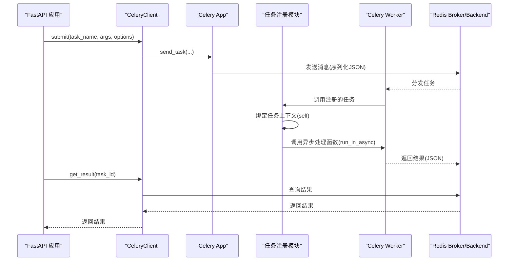
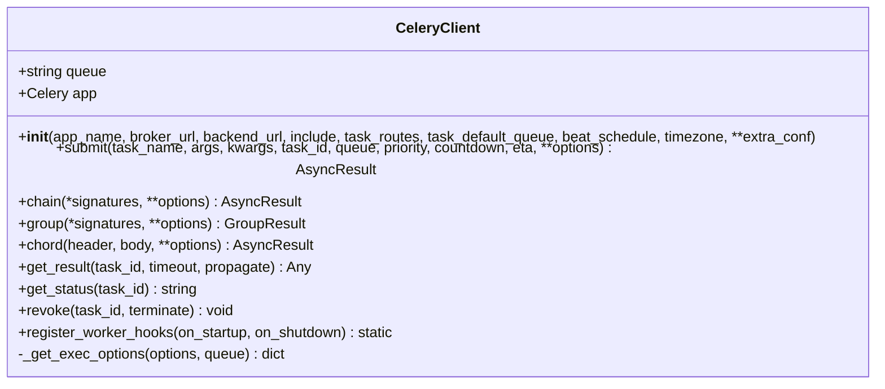
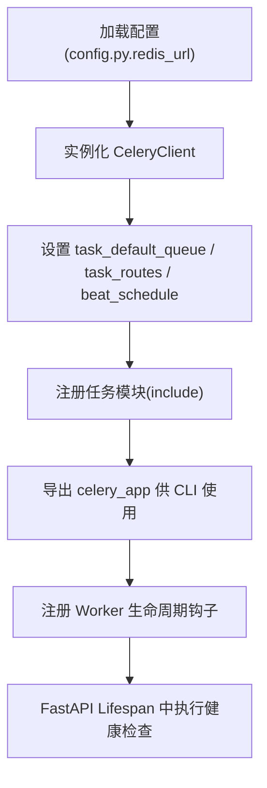
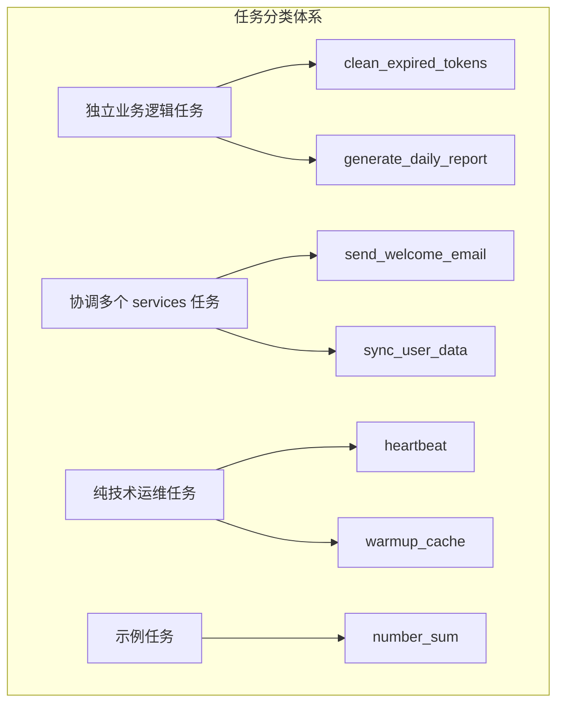
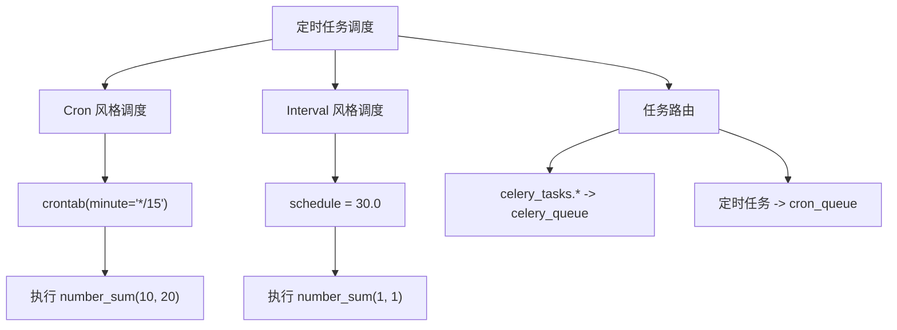
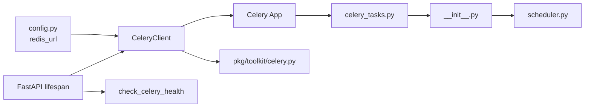

# Celery分布式任务

<cite>
**本文档引用的文件**
- [internal/utils/celery/__init__.py](file://internal/utils/celery/__init__.py)
- [pkg/toolkit/celery.py](file://pkg/toolkit/celery.py)
- [internal/tasks/celery_tasks.py](file://internal/tasks/celery_tasks.py)
- [internal/tasks/scheduler.py](file://internal/tasks/scheduler.py)
- [internal/tasks/__init__.py](file://internal/tasks/__init__.py)
- [scripts/run_celery_worker.sh](file://scripts/run_celery_worker.sh)
- [tests/test_celery_tasks.py](file://tests/test_celery_tasks.py)
- [internal/config.py](file://internal/config.py)
- [internal/app.py](file://internal/app.py)
</cite>

## 更新摘要
**所做更改**
- 新增了完整的Celery任务分类体系：独立业务逻辑、协调多个services、纯技术运维三类任务
- 新增了定时任务调度配置模块，支持Cron和Interval两种调度方式
- 重构了任务管理架构，将任务定义和调度配置分离到独立模块
- 改进了任务监控和运维能力，新增心跳检测和缓存预热等运维任务
- 优化了Worker启动脚本，支持环境变量配置和参数传递

## 目录
1. [简介](#简介)
2. [项目结构](#项目结构)
3. [核心组件](#核心组件)
4. [架构总览](#架构总览)
5. [详细组件分析](#详细组件分析)
6. [任务分类体系](#任务分类体系)
7. [定时任务调度](#定时任务调度)
8. [依赖关系分析](#依赖关系分析)
9. [性能考虑](#性能考虑)
10. [故障排除指南](#故障排除指南)
11. [结论](#结论)
12. [附录](#附录)

## 简介
本文件面向使用 Celery 的开发者，系统化阐述本项目的分布式任务体系：从配置、任务注册、任务执行、编排（链式、分组、Chord）、重试与错误恢复、与 Redis 的集成、监控与健康检查，到性能优化与并发控制的最佳实践。文档以"number_sum"任务为例，展示如何在 FastAPI 应用中安全地提交、执行与追踪异步任务，并给出常见问题的排查步骤。

**更新** 本版本新增了完整的任务分类体系和定时任务调度功能，提供了更完善的Celery集成解决方案。

## 项目结构
本项目采用"基础设施层 + 工具层 + 业务层 + 任务层"的分层组织方式，Celery 相关代码集中在以下位置：
- 配置与客户端封装：internal/utils/celery 与 pkg/toolkit/celery.py
- 任务定义与调度：internal/tasks/celery_tasks.py、internal/tasks/scheduler.py、internal/tasks/__init__.py
- Worker 启动脚本：scripts/run_celery_worker.sh
- 测试与验证：tests/test_celery_tasks.py
- 配置加载：internal/config.py 与 configs/.secrets
- FastAPI 集成：internal/app.py

```mermaid
graph TB
subgraph "应用层"
FA["FastAPI 应用<br/>lifespan 初始化"]
end
subgraph "Celery 层"
CC["CeleryClient 封装"]
REG["任务注册模块<br/>celery_tasks.py"]
SCHED["定时任务配置<br/>scheduler.py"]
TASKS["任务聚合导出<br/>__init__.py"]
APP["Celery App 对象"]
end
subgraph "基础设施层"
CFG["配置加载<br/>config.py"]
SECRETS[".secrets 环境变量"]
REDIS["Redis Broker/Backend"]
end
subgraph "工具层"
TK["pkg/toolkit/celery.py"]
END
FA --> CC
CC --> APP
APP --> REG
REG --> TASKS
TASKS --> SCHED
CC --> TK
CFG --> CC
SECRETS --> CFG
CC --> REDIS
```

**图表来源**
- [internal/utils/celery/__init__.py](file://internal/utils/celery/__init__.py#L1-L175)
- [pkg/toolkit/celery.py](file://pkg/toolkit/celery.py#L1-L198)
- [internal/tasks/celery_tasks.py](file://internal/tasks/celery_tasks.py#L1-L156)
- [internal/tasks/scheduler.py](file://internal/tasks/scheduler.py#L1-L48)
- [internal/tasks/__init__.py](file://internal/tasks/__init__.py#L1-L40)
- [scripts/run_celery_worker.sh](file://scripts/run_celery_worker.sh#L1-L38)

**章节来源**
- [internal/utils/celery/__init__.py](file://internal/utils/celery/__init__.py#L1-L175)
- [pkg/toolkit/celery.py](file://pkg/toolkit/celery.py#L1-L198)
- [internal/tasks/celery_tasks.py](file://internal/tasks/celery_tasks.py#L1-L156)
- [internal/tasks/scheduler.py](file://internal/tasks/scheduler.py#L1-L48)
- [internal/tasks/__init__.py](file://internal/tasks/__init__.py#L1-L40)
- [scripts/run_celery_worker.sh](file://scripts/run_celery_worker.sh#L1-L38)
- [tests/test_celery_tasks.py](file://tests/test_celery_tasks.py#L1-L361)
- [internal/config.py](file://internal/config.py#L222-L276)
- [internal/app.py](file://internal/app.py#L80-L111)

## 核心组件
- CeleryClient：对 Celery 的轻量封装，提供任务提交、编排（链式/分组/Chord）、状态查询、撤销、Worker 生命周期钩子注册等能力。
- CeleryApp 与配置：集中于 internal/utils/celery/__init__.py，负责任务模块注册、路由、静态定时任务、Broker/Backend URL、Worker 生命周期钩子注册。
- 任务定义与实现：internal/tasks/celery_tasks.py 中定义多种类型的任务；内部逻辑通过 run_in_async 包装的异步函数实现。
- 定时任务调度：internal/tasks/scheduler.py 提供任务路由和静态定时任务配置。
- 任务聚合导出：internal/tasks/__init__.py 统一导出所有任务和调度配置。
- Worker 启动脚本：scripts/run_celery_worker.sh 提供灵活的启动配置，支持环境变量和参数传递。
- 配置与环境：internal/config.py 生成 redis_url；configs/.secrets 提供环境配置参数。
- FastAPI 集成：在应用生命周期中进行 Celery 健康检查与资源初始化。

**章节来源**
- [pkg/toolkit/celery.py](file://pkg/toolkit/celery.py#L15-L198)
- [internal/utils/celery/__init__.py](file://internal/utils/celery/__init__.py#L76-L91)
- [internal/tasks/celery_tasks.py](file://internal/tasks/celery_tasks.py#L1-L156)
- [internal/tasks/scheduler.py](file://internal/tasks/scheduler.py#L15-L47)
- [internal/tasks/__init__.py](file://internal/tasks/__init__.py#L11-L39)
- [scripts/run_celery_worker.sh](file://scripts/run_celery_worker.sh#L1-L38)
- [internal/config.py](file://internal/config.py#L222-L234)
- [internal/app.py](file://internal/app.py#L80-L111)

## 架构总览
Celery 在本项目中的角色是"异步任务编排与执行引擎"，与 FastAPI 应用解耦，Worker 独立运行。应用通过 CeleryClient 提交任务，任务在 Worker 中执行，结果写回 Redis Backend，客户端可轮询或通过回调获取结果。

**更新** 新架构支持三种任务分类：独立业务逻辑、协调多个services、纯技术运维，以及完整的定时任务调度系统。

```mermaid
sequenceDiagram
participant API as "FastAPI 应用"
participant CC as "CeleryClient"
participant APP as "Celery App"
participant REG as "任务注册模块"
participant W as "Celery Worker"
participant BK as "Redis Broker/Backend"
API->>CC : submit(task_name, args, options)
CC->>APP : send_task(...)
APP->>BK : 发送消息(序列化JSON)
BK-->>W : 分发任务
W->>REG : 调用注册的任务
REG->>REG : 绑定任务上下文(self)
REG->>W : 调用异步处理函数(run_in_async)
W-->>BK : 返回结果(JSON)
API->>CC : get_result(task_id)
CC->>BK : 查询结果
BK-->>CC : 返回结果
CC-->>API : 返回结果
```

**图表来源**
- [pkg/toolkit/celery.py](file://pkg/toolkit/celery.py#L75-L107)
- [internal/utils/celery/__init__.py](file://internal/utils/celery/__init__.py#L119-L150)
- [internal/tasks/celery_tasks.py](file://internal/tasks/celery_tasks.py#L28-L36)

## 详细组件分析

### CeleryClient 封装
- 作用：统一任务提交、编排、状态查询、撤销与 Worker 生命周期钩子注册。
- 关键点：
  - 任务序列化与内容类型：task_serializer、accept_content、result_serializer 均为 json。
  - 默认队列与路由：task_default_queue 与 task_routes 控制任务去向。
  - 编排接口：chain/group/chord 均通过签名对象组合，并传入 app=self.app。
  - 执行选项合并：_get_exec_options 支持显式参数、options 字典与实例默认值的优先级合并。
  - 生命周期钩子：register_worker_hooks 使用信号注册，支持同步/异步启动/关闭钩子。

```mermaid
classDiagram
class CeleryClient {
+string queue
+Celery app
+__init__(app_name, broker_url, backend_url, include, task_routes, task_default_queue, beat_schedule, timezone, **extra_conf)
+submit(task_name, args, kwargs, task_id, queue, priority, countdown, eta, **options) AsyncResult
+chain(*signatures, **options) AsyncResult
+group(*signatures, **options) GroupResult
+chord(header, body, **options) AsyncResult
+get_result(task_id, timeout, propagate) Any
+get_status(task_id) string
+revoke(task_id, terminate) void
+register_worker_hooks(on_startup, on_shutdown) static
-_get_exec_options(options, queue) dict
}
```

**图表来源**
- [pkg/toolkit/celery.py](file://pkg/toolkit/celery.py#L15-L198)

**章节来源**
- [pkg/toolkit/celery.py](file://pkg/toolkit/celery.py#L15-L198)

### CeleryApp 与配置
- 任务模块注册：CELERY_INCLUDE_MODULES 指定需要加载的任务模块路径。
- 任务路由：CELERY_TASK_ROUTES 将任务名映射到队列，例如将 celery_tasks 模块的任务路由到 celery_queue，定时任务路由到 cron_queue。
- 静态定时任务：STATIC_BEAT_SCHEDULE 定义基于 Cron/Interval 的周期性任务。
- Broker/Backend：使用 config.py 中的 redis_url，统一从配置加载。
- Worker 生命周期钩子：在模块层注册，启动时初始化日志，关闭时清理基础资源。
- 健康检查：check_celery_health 主动检测 Broker 连通性，不影响 API 启动。

```mermaid
flowchart TD
A["加载配置(config.py.redis_url)"] --> B["实例化 CeleryClient"]
B --> C["设置 task_default_queue / task_routes / beat_schedule"]
C --> D["注册任务模块(include)"]
D --> E["导出 celery_app 供 CLI 使用"]
E --> F["注册 Worker 生命周期钩子"]
F --> G["FastAPI Lifespan 中执行健康检查"]
```

**图表来源**
- [internal/utils/celery/__init__.py](file://internal/utils/celery/__init__.py#L76-L91)

**章节来源**
- [internal/utils/celery/__init__.py](file://internal/utils/celery/__init__.py#L76-L91)
- [internal/config.py](file://internal/config.py#L222-L234)

### 任务执行与监控
- 执行入口：scripts/run_celery_worker.sh 提供统一启动脚本，支持并发、队列与日志级别等参数。
- 监控与健康检查：在 FastAPI Lifespan 中调用 check_celery_health，主动检测 Broker 连通性。
- 状态查询：通过 celery_client.get_status/get_result 获取任务状态与结果。
- 撤销任务：celery_client.revoke 支持终止执行中的任务。

**章节来源**
- [scripts/run_celery_worker.sh](file://scripts/run_celery_worker.sh#L1-L38)
- [internal/utils/celery/__init__.py](file://internal/utils/celery/__init__.py#L98-L117)
- [pkg/toolkit/celery.py](file://pkg/toolkit/celery.py#L141-L154)

## 任务分类体系

### 独立业务逻辑任务
**新增** 支持调用 services 层的独立业务逻辑任务，任务本身只做调度包装。

- clean_expired_tokens：清理过期 token，调用 TokenService.clean_expired_tokens()
- generate_daily_report：生成日报表，调用 ReportService.generate_report()

### 协调多个 services 任务
**新增** 组合调用多个已有的 services 的协调型任务。

- send_welcome_email：组合调用 UserService + EmailService
- sync_user_data：组合调用 UserService + ThirdPartySyncService + NotificationService

### 纯技术运维任务
**新增** 心跳检测、缓存预热等无业务逻辑的技术运维任务。

- heartbeat：心跳检测，无业务逻辑，不需要 services
- warmup_cache：缓存预热，直接操作 cache_dao 预热缓存

### 兼容旧代码示例任务
**更新** number_sum 任务保留，支持处理单个数字加法，或 Chord 回调的列表求和。

```mermaid
flowchart TD
subgraph "任务分类体系"
A["独立业务逻辑任务"] --> A1["clean_expired_tokens"]
A --> A2["generate_daily_report"]
B["协调多个 services 任务"] --> B1["send_welcome_email"]
B --> B2["sync_user_data"]
C["纯技术运维任务"] --> C1["heartbeat"]
C --> C2["warmup_cache"]
D["示例任务"] --> D1["number_sum"]
end
```

**图表来源**
- [internal/tasks/celery_tasks.py](file://internal/tasks/celery_tasks.py#L19-L156)

**章节来源**
- [internal/tasks/celery_tasks.py](file://internal/tasks/celery_tasks.py#L1-L156)

## 定时任务调度

### 任务模块配置
- CELERY_INCLUDE_MODULES：需要加载的任务模块列表，当前包含 internal.tasks.celery_tasks
- 任务路由配置：CELERY_TASK_ROUTES 决定任务去哪个队列

### 静态定时任务表
**新增** STATIC_BEAT_SCHEDULE 提供基于 Cron 和 Interval 的定时任务配置。

- Cron 风格：每 15 分钟执行一次 number_sum 任务
- Interval 风格：每 30 秒执行一次 number_sum 任务

```mermaid
flowchart TD
A["定时任务调度"] --> B["Cron 风格调度"]
B --> B1["crontab(minute='*/15')"]
B1 --> B2["执行 number_sum(10, 20)"]
A --> C["Interval 风格调度"]
C --> C1["schedule = 30.0"]
C1 --> C2["执行 number_sum(1, 1)"]
A --> D["任务路由"]
D --> D1["celery_tasks.* -> celery_queue"]
D --> D2["定时任务 -> cron_queue"]
```

**图表来源**
- [internal/tasks/scheduler.py](file://internal/tasks/scheduler.py#L15-L47)

**章节来源**
- [internal/tasks/scheduler.py](file://internal/tasks/scheduler.py#L1-L48)

## 依赖关系分析
- CeleryClient 依赖 Celery 与 signals，提供任务提交与编排能力。
- CeleryApp 由 CeleryClient 实例化，配置来源于 config.py.redis_url。
- 任务注册模块依赖 CeleryClient.app，任务实现依赖 run_in_async 包装的异步处理函数。
- 定时任务配置模块提供任务路由和静态调度表。
- 配置层通过 config.py 生成 redis_url，供 CeleryClient 使用。
- FastAPI 应用在 lifespan 中进行 Celery 健康检查，确保 Broker 可用。

```mermaid
graph LR
CFG["config.py<br/>redis_url"] --> CC["CeleryClient"]
CC --> APP["Celery App"]
APP --> REG["celery_tasks.py"]
REG --> TASKS["__init__.py"]
TASKS --> SCHED["scheduler.py"]
CC --> TK["pkg/toolkit/celery.py"]
FA["FastAPI lifespan"] --> CC
FA --> CK["check_celery_health"]
```

**图表来源**
- [internal/config.py](file://internal/config.py#L222-L234)
- [pkg/toolkit/celery.py](file://pkg/toolkit/celery.py#L15-L51)
- [internal/utils/celery/__init__.py](file://internal/utils/celery/__init__.py#L76-L91)
- [internal/tasks/celery_tasks.py](file://internal/tasks/celery_tasks.py#L1-L156)
- [internal/tasks/__init__.py](file://internal/tasks/__init__.py#L11-L39)
- [internal/tasks/scheduler.py](file://internal/tasks/scheduler.py#L15-L47)
- [internal/app.py](file://internal/app.py#L80-L111)

**章节来源**
- [internal/config.py](file://internal/config.py#L222-L234)
- [pkg/toolkit/celery.py](file://pkg/toolkit/celery.py#L15-L51)
- [internal/utils/celery/__init__.py](file://internal/utils/celery/__init__.py#L76-L91)
- [internal/tasks/celery_tasks.py](file://internal/tasks/celery_tasks.py#L1-L156)
- [internal/tasks/__init__.py](file://internal/tasks/__init__.py#L11-L39)
- [internal/tasks/scheduler.py](file://internal/tasks/scheduler.py#L15-L47)
- [internal/app.py](file://internal/app.py#L80-L111)

## 性能考虑
- 序列化与内容类型：统一使用 JSON，减少序列化开销，确保跨语言/跨服务兼容。
- 队列与路由：通过 CELERY_TASK_ROUTES 将不同类型任务分流至不同队列，避免热点队列拥塞。
- 并发与进程模型：Worker 启动脚本默认 prefork 模式，可通过环境变量配置并发度；生产环境建议设置 --max-tasks-per-child 与 --max-memory-per-child 以提升稳定性。
- 任务粒度：将大任务拆分为小任务，配合 Group/Chord 提升吞吐与可观测性。
- 资源管理：Worker 生命周期钩子在启动时初始化日志，在关闭时清理基础资源，数据库和 Redis 连接按需初始化和清理。
- 超时与重试：合理设置 countdown 与 max_retries，避免无限重试造成资源浪费。
- 定时任务优化：Cron 任务建议使用固定分钟间隔，避免同时大量任务触发。

**章节来源**
- [pkg/toolkit/celery.py](file://pkg/toolkit/celery.py#L36-L48)
- [internal/utils/celery/__init__.py](file://internal/utils/celery/__init__.py#L24-L47)
- [scripts/run_celery_worker.sh](file://scripts/run_celery_worker.sh#L9-L22)
- [internal/tasks/scheduler.py](file://internal/tasks/scheduler.py#L34-L47)

## 故障排除指南
- Broker 连接失败
  - 现象：Worker 启动或任务执行时报连接错误。
  - 排查：检查 configs/.secrets 中的环境配置；确认 Redis 服务可达；使用 check_celery_health 主动检测。
  - 参考：[internal/utils/celery/__init__.py](file://internal/utils/celery/__init__.py#L98-L117)
- 任务未执行或队列无消费
  - 现象：任务提交后状态长时间为 PENDING。
  - 排查：确认 Worker 正确监听队列；核对 CELERY_TASK_ROUTES 与队列名称；检查 Worker 日志。
  - 参考：[internal/tasks/scheduler.py](file://internal/tasks/scheduler.py#L20-L26)
- 任务重试过多
  - 现象：任务反复失败重试。
  - 排查：检查任务内部异常处理与 self.retry 配置；确认输入参数类型；必要时增加 countdown 间隔。
  - 参考：[internal/tasks/celery_tasks.py](file://internal/tasks/celery_tasks.py#L144-L155)
- 结果无法获取
  - 现象：get_result 抛出异常或返回 None。
  - 排查：确认 Backend 使用 Redis；检查任务是否成功；确认 task_id 正确。
  - 参考：[pkg/toolkit/celery.py](file://pkg/toolkit/celery.py#L141-L148)
- Worker 进程崩溃或资源泄漏
  - 现象：Worker 进程异常退出或内存持续增长。
  - 排查：启用 --max-tasks-per-child 与 --max-memory-per-child；确保生命周期钩子正确释放资源。
  - 参考：[internal/utils/celery/__init__.py](file://internal/utils/celery/__init__.py#L64-L70)
- 定时任务不执行
  - 现象：定时任务未按预期执行。
  - 排查：确认 beat 服务已启动；检查 STATIC_BEAT_SCHEDULE 配置；验证任务名称与路由。
  - 参考：[internal/tasks/scheduler.py](file://internal/tasks/scheduler.py#L34-L47)

**章节来源**
- [internal/utils/celery/__init__.py](file://internal/utils/celery/__init__.py#L98-L117)
- [internal/tasks/celery_tasks.py](file://internal/tasks/celery_tasks.py#L144-L155)
- [pkg/toolkit/celery.py](file://pkg/toolkit/celery.py#L141-L148)
- [internal/utils/celery/__init__.py](file://internal/utils/celery/__init__.py#L64-L70)
- [internal/tasks/scheduler.py](file://internal/tasks/scheduler.py#L34-L47)

## 结论
本项目以 Celery 为核心构建了高可用的异步任务体系：通过 CeleryClient 封装统一任务提交与编排，借助任务路由与队列实现流量隔离，结合优化的 Worker 生命周期钩子与健康检查保障稳定性。新增的任务分类体系提供了清晰的业务分层，定时任务调度功能完善了运维能力。number_sum 任务展示了绑定上下文、Chord 兼容与重试策略的完整实现。配合 JSON 序列化、合理的并发与资源管理策略，可在生产环境中获得稳定且可观测的异步执行体验。

**更新** 新版本的Celery集成提供了更完善的任务管理和监控能力，支持多种任务分类和定时调度，适合生产环境的复杂业务场景。

## 附录
- 任务分类与实现要点
  - 独立业务逻辑：调用 services 层，任务本身只做调度包装
  - 协调多个 services：组合调用多个已有的 services
  - 纯技术运维：心跳检测、缓存预热等，无业务逻辑
  - 参考：[internal/tasks/celery_tasks.py](file://internal/tasks/celery_tasks.py#L1-L156)
- 定时任务配置
  - Cron 风格：crontab(minute="*/15") 每 15 分钟执行
  - Interval 风格：schedule = 30.0 每 30 秒执行
  - 参考：[internal/tasks/scheduler.py](file://internal/tasks/scheduler.py#L34-L47)
- Worker 启动与参数
  - 脚本：scripts/run_celery_worker.sh
  - 环境变量：CELERY_LOG_LEVEL、CELERY_CONCURRENCY、CELERY_QUEUES
  - 常用参数：--max-tasks-per-child、--max-memory-per-child
  - 参考：[scripts/run_celery_worker.sh](file://scripts/run_celery_worker.sh#L9-L37)
- 配置与环境
  - 配置加载：internal/config.py 生成 redis_url
  - 环境变量：configs/.secrets 提供 APP_ENV、REDIS_* 等配置
  - 参考：[internal/config.py](file://internal/config.py#L222-L234)、[configs/.secrets](file://configs/.secrets#L6-L7)
- FastAPI 集成
  - Lifespan 中初始化日志、DB、Redis、签名与雪花 ID；调用 check_celery_health 进行健康检查
  - 参考：[internal/app.py](file://internal/app.py#L80-L111)、[internal/utils/celery/__init__.py](file://internal/utils/celery/__init__.py#L98-L117)