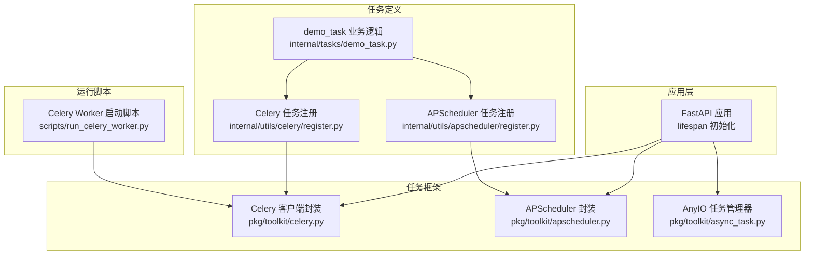
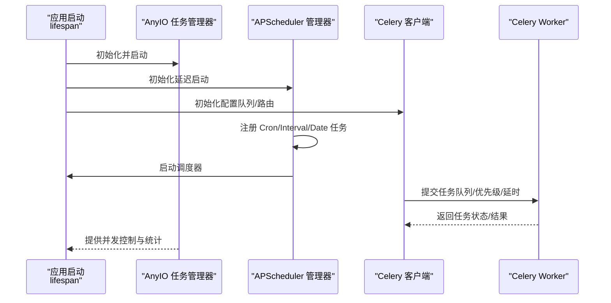
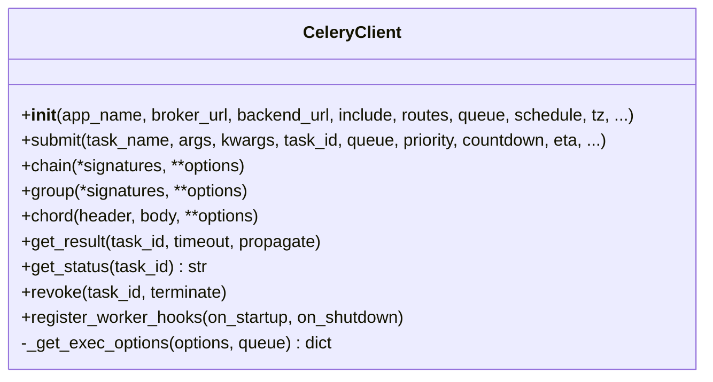
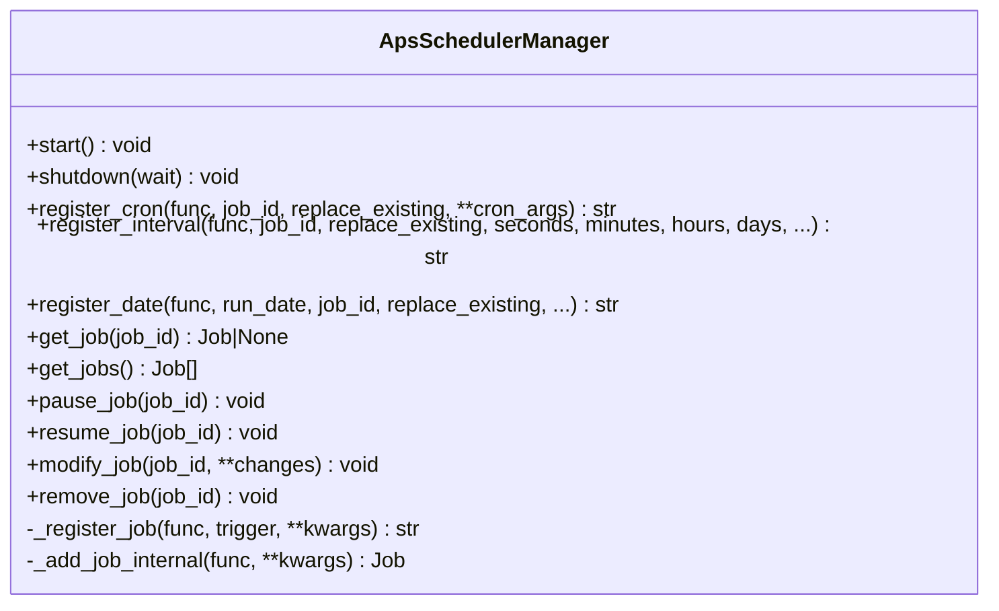
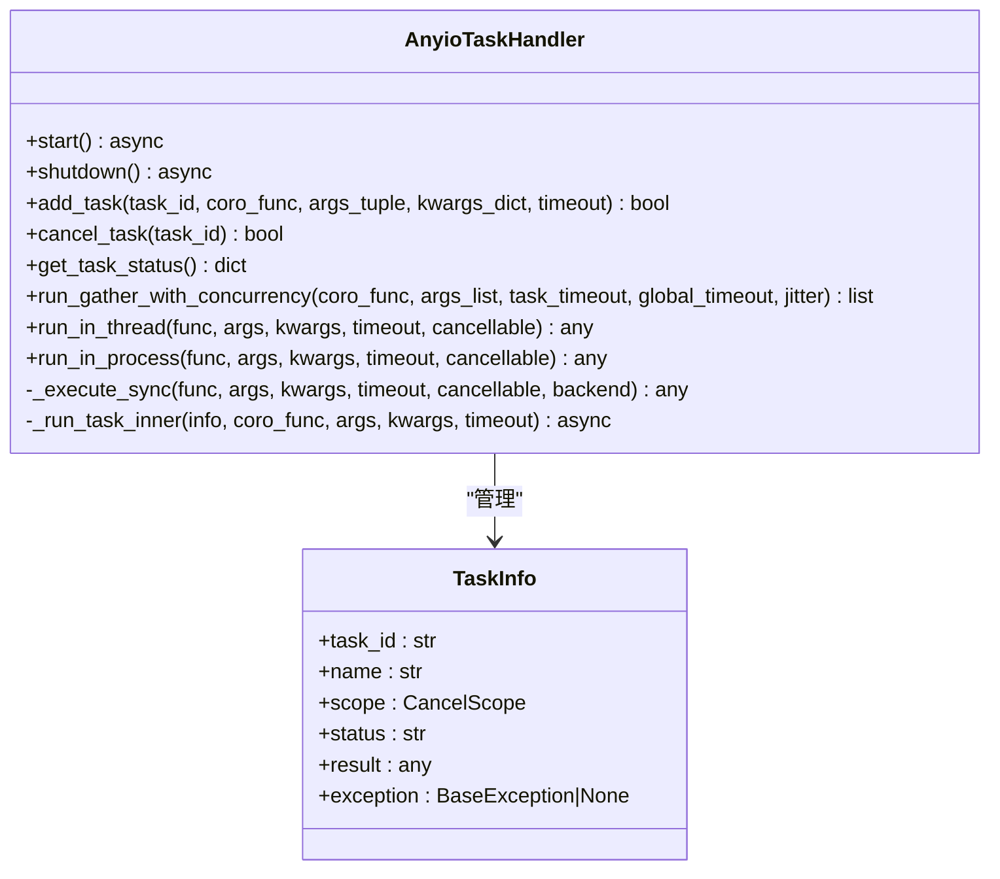
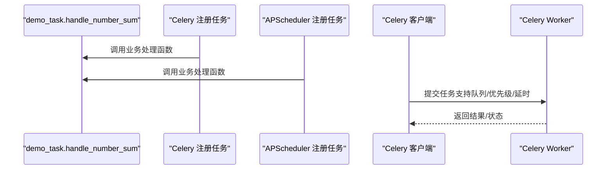
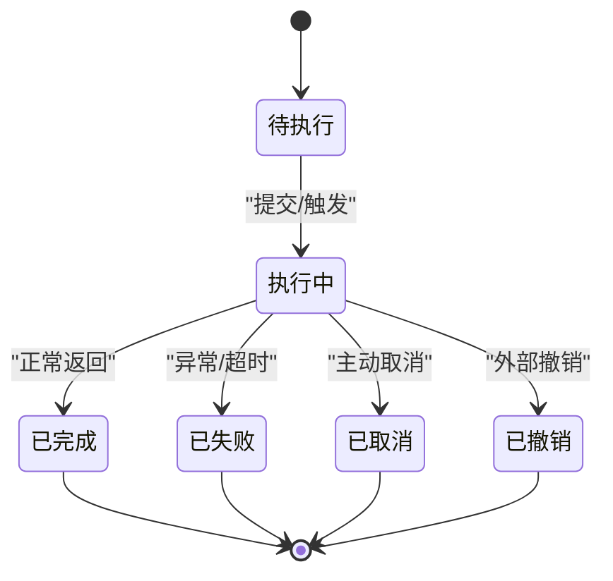
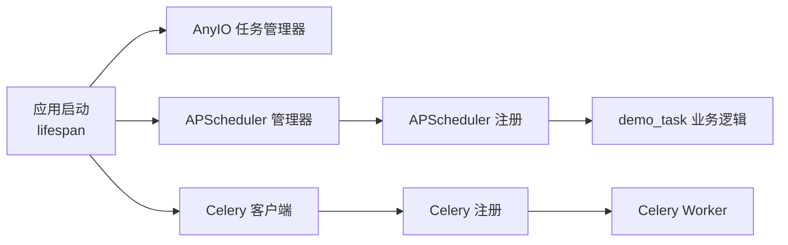
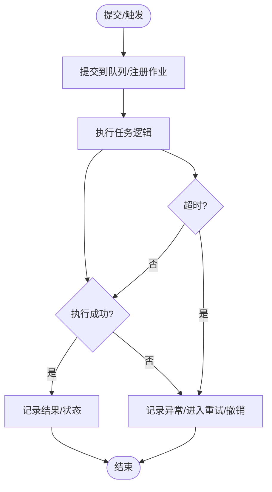

# 任务管理与监控

<cite>
**本文引用的文件**
- [internal/tasks/demo_task.py](file://internal/tasks/demo_task.py)
- [pkg/toolkit/celery.py](file://pkg/toolkit/celery.py)
- [internal/utils/celery/register.py](file://internal/utils/celery/register.py)
- [internal/utils/apscheduler/register.py](file://internal/utils/apscheduler/register.py)
- [pkg/toolkit/apscheduler.py](file://pkg/toolkit/apscheduler.py)
- [pkg/toolkit/async_task.py](file://pkg/toolkit/async_task.py)
- [scripts/run_celery_worker.py](file://scripts/run_celery_worker.py)
- [internal/app.py](file://internal/app.py)
- [main.py](file://main.py)
- [tests/test_celery_tasks.py](file://tests/test_celery_tasks.py)
- [tests/test_anyio_task.py](file://tests/test_anyio_task.py)
- [AGENTS.md](file://AGENTS.md)
</cite>

## 目录
1. [简介](#简介)
2. [项目结构](#项目结构)
3. [核心组件](#核心组件)
4. [架构总览](#架构总览)
5. [详细组件分析](#详细组件分析)
6. [依赖分析](#依赖分析)
7. [性能考虑](#性能考虑)
8. [故障排查指南](#故障排查指南)
9. [结论](#结论)
10. [附录](#附录)

## 简介
本文件面向任务管理与监控主题，系统化梳理该代码库中的异步任务与定时任务统一管理机制，涵盖任务生命周期（创建、执行监控、状态跟踪、结果处理）、任务队列监控与执行统计、性能指标采集、调试与日志、错误诊断、失败处理与自动重试、降级策略、以及与应用其他组件的集成关系。文档同时给出可视化图示与实操建议，帮助开发者快速上手并稳定运维。

## 项目结构
该项目采用分层架构，任务相关能力主要分布在以下位置：
- 任务逻辑：位于 internal/tasks 下，提供可复用的业务处理函数
- 异步任务框架：pkg/toolkit/celery.py 提供 Celery 客户端封装，internal/utils/celery/register.py 定义具体任务
- 定时任务框架：pkg/toolkit/apscheduler.py 提供 APScheduler 封装，internal/utils/apscheduler/register.py 注册定时任务
- 本地并发任务：pkg/toolkit/async_task.py 提供 AnyIO 任务管理器，用于应用内并发控制
- 应用生命周期：internal/app.py 与 main.py 负责初始化与关闭流程，统一接入任务管理器

图表来源
- [internal/app.py](file://internal/app.py#L84-L109)
- [pkg/toolkit/celery.py](file://pkg/toolkit/celery.py#L15-L52)
- [pkg/toolkit/apscheduler.py](file://pkg/toolkit/apscheduler.py#L14-L63)
- [pkg/toolkit/async_task.py](file://pkg/toolkit/async_task.py#L42-L93)
- [internal/tasks/demo_task.py](file://internal/tasks/demo_task.py#L9-L19)
- [internal/utils/celery/register.py](file://internal/utils/celery/register.py#L8-L28)
- [internal/utils/apscheduler/register.py](file://internal/utils/apscheduler/register.py#L5-L6)
- [scripts/run_celery_worker.py](file://scripts/run_celery_worker.py#L6-L34)

章节来源
- [internal/app.py](file://internal/app.py#L84-L109)
- [main.py](file://main.py#L1-L18)
- [AGENTS.md](file://AGENTS.md#L34-L72)

## 核心组件
- Celery 客户端封装：提供任务提交、编排（链式/并发/回调）、状态查询、撤销、生命周期钩子注册等能力
- APScheduler 封装：提供 Cron/Interval/Date 任务注册、延迟启动、全局默认参数、暂停/恢复/修改任务等
- AnyIO 任务管理器：提供应用内异步任务并发控制、超时、取消、批量执行与统计
- 任务逻辑模块：提供可被 Celery 与 APScheduler 复用的业务处理函数
- Worker 启动脚本：封装 Celery Worker 启动参数与环境约束

章节来源
- [pkg/toolkit/celery.py](file://pkg/toolkit/celery.py#L15-L198)
- [pkg/toolkit/apscheduler.py](file://pkg/toolkit/apscheduler.py#L14-L255)
- [pkg/toolkit/async_task.py](file://pkg/toolkit/async_task.py#L42-L375)
- [internal/tasks/demo_task.py](file://internal/tasks/demo_task.py#L9-L19)
- [scripts/run_celery_worker.py](file://scripts/run_celery_worker.py#L6-L34)

## 架构总览
应用启动时通过 lifespan 初始化日志、数据库、Redis、签名认证、雪花 ID 生成器与 AnyIO 任务管理器。随后，定时任务通过 APScheduler 注册并在启动时加载；异步任务通过 Celery 提交到消息队列，由 Worker 执行；应用内并发任务通过 AnyIO 任务管理器统一调度与限流。

图表来源
- [internal/app.py](file://internal/app.py#L84-L109)
- [pkg/toolkit/apscheduler.py](file://pkg/toolkit/apscheduler.py#L66-L89)
- [pkg/toolkit/celery.py](file://pkg/toolkit/celery.py#L75-L107)
- [pkg/toolkit/async_task.py](file://pkg/toolkit/async_task.py#L57-L92)

## 详细组件分析

### Celery 客户端封装（统一异步任务入口）
- 任务提交：支持自定义 task_id、队列、优先级、延时执行等参数，内部合并默认配置与显式参数
- 任务编排：链式、并发组、回调组，均以实例方法形式提供
- 状态与结果：提供阻塞式结果获取、状态查询、任务撤销
- 生命周期钩子：支持 Worker 进程启动/关闭钩子，自动处理协程与同步函数

图表来源
- [pkg/toolkit/celery.py](file://pkg/toolkit/celery.py#L15-L198)

章节来源
- [pkg/toolkit/celery.py](file://pkg/toolkit/celery.py#L75-L155)

### APScheduler 封装（统一定时任务入口）
- 延迟启动：未启动前将任务注册到待处理队列，启动后再批量加载
- 全局默认：统一管理抖动、最大并发实例、合并执行与错失宽限期
- 快捷注册：Cron/Interval/Date 三种触发器的便捷封装
- 运行时管理：暂停/恢复/修改/移除任务，查询作业列表

图表来源
- [pkg/toolkit/apscheduler.py](file://pkg/toolkit/apscheduler.py#L14-L238)

章节来源
- [pkg/toolkit/apscheduler.py](file://pkg/toolkit/apscheduler.py#L138-L203)

### AnyIO 任务管理器（应用内并发控制）
- 生命周期：启动/关闭，停止接受新任务并优雅取消活动任务
- 并发与限流：全局、线程、进程三类容量限制器，避免资源耗尽
- 任务模型：TaskInfo 记录任务状态、结果与异常，支持超时、取消、批量执行
- 批量执行：支持带抖动的并发收集，支持线程/进程后端

图表来源
- [pkg/toolkit/async_task.py](file://pkg/toolkit/async_task.py#L42-L375)

章节来源
- [pkg/toolkit/async_task.py](file://pkg/toolkit/async_task.py#L183-L215)
- [pkg/toolkit/async_task.py](file://pkg/toolkit/async_task.py#L232-L277)

### 任务逻辑与注册（统一复用）
- demo_task 提供可被 Celery 与 APScheduler 调用的业务处理函数
- Celery 注册：装饰器绑定任务名称，兼容 Chord 回调的列表聚合
- APScheduler 注册：按 Cron 规则周期性触发

图表来源
- [internal/tasks/demo_task.py](file://internal/tasks/demo_task.py#L9-L19)
- [internal/utils/celery/register.py](file://internal/utils/celery/register.py#L8-L28)
- [internal/utils/apscheduler/register.py](file://internal/utils/apscheduler/register.py#L5-L6)

章节来源
- [internal/tasks/demo_task.py](file://internal/tasks/demo_task.py#L9-L19)
- [internal/utils/celery/register.py](file://internal/utils/celery/register.py#L8-L28)
- [internal/utils/apscheduler/register.py](file://internal/utils/apscheduler/register.py#L5-L6)

### 任务生命周期与状态流转
- 异步任务：提交 -> 执行 -> 成功/失败/撤销/超时
- 定时任务：注册 -> 触发 -> 执行 -> 成功/失败
- 应用内任务：提交 -> 执行 -> 成功/失败/取消/超时

图表来源
- [pkg/toolkit/celery.py](file://pkg/toolkit/celery.py#L141-L154)
- [pkg/toolkit/async_task.py](file://pkg/toolkit/async_task.py#L136-L147)

## 依赖分析
- 应用启动依赖：lifespan 初始化 AnyIO 任务管理器，确保应用内并发控制可用
- 任务注册依赖：APScheduler 管理器延迟启动，先注册再加载；Celery 客户端负责任务提交与编排
- 执行依赖：Celery 任务由 Worker 执行；应用内任务由 AnyIO 任务管理器调度

图表来源
- [internal/app.py](file://internal/app.py#L84-L109)
- [pkg/toolkit/apscheduler.py](file://pkg/toolkit/apscheduler.py#L66-L89)
- [pkg/toolkit/celery.py](file://pkg/toolkit/celery.py#L75-L107)
- [internal/utils/apscheduler/register.py](file://internal/utils/apscheduler/register.py#L5-L6)
- [internal/utils/celery/register.py](file://internal/utils/celery/register.py#L8-L28)

章节来源
- [internal/app.py](file://internal/app.py#L84-L109)
- [pkg/toolkit/apscheduler.py](file://pkg/toolkit/apscheduler.py#L66-L89)
- [pkg/toolkit/celery.py](file://pkg/toolkit/celery.py#L75-L107)

## 性能考虑
- 并发与限流
  - AnyIO 任务管理器提供全局、线程、进程三类容量限制器，避免资源争用与 OOM
  - 建议根据 CPU 核心数与 I/O 特性调整默认上限，避免过度并发
- 超时与取消
  - 单任务与全局超时结合，防止长尾任务拖垮系统
  - 取消操作通过 CancelScope 触发，确保清理阶段不受干扰
- 队列与优先级
  - Celery 支持队列与优先级，建议按任务类型划分队列并设置优先级
  - Worker 并发与池类型应与任务特性匹配（CPU 密集型 vs I/O 密集型）
- 抖动与错失处理
  - APScheduler 支持全局抖动与错失宽限期，缓解整点风暴与任务堆积

章节来源
- [pkg/toolkit/async_task.py](file://pkg/toolkit/async_task.py#L23-L29)
- [pkg/toolkit/async_task.py](file://pkg/toolkit/async_task.py#L232-L277)
- [pkg/toolkit/celery.py](file://pkg/toolkit/celery.py#L56-L70)
- [pkg/toolkit/apscheduler.py](file://pkg/toolkit/apscheduler.py#L24-L48)

## 故障排查指南
- 日志与调试
  - 统一使用日志模块输出任务开始/完成/失败/取消/超时等关键事件
  - 对于 AnyIO 任务，关注任务清理阶段的异常与状态变更
- 任务状态查询
  - Celery：通过客户端查询状态与结果，必要时启用阻塞式结果获取
  - APScheduler：查询作业列表与单个作业状态，确认触发器与下次运行时间
- 失败与重试
  - Celery 任务内置重试逻辑，建议结合 countdown 与最大重试次数
  - 对于幂等性不足的任务，建议引入去重与补偿机制
- 资源与并发问题
  - 检查 AnyIO 任务队列是否溢出，适当降低并发或增大队列上限
  - 调整 Celery Worker 并发与池类型，观察内存与 CPU 使用率
- 集成测试参考
  - 测试用例覆盖同步/异步执行、编排、撤销、重试、参数化等场景，可作为回归与排障依据

章节来源
- [pkg/toolkit/celery.py](file://pkg/toolkit/celery.py#L141-L154)
- [pkg/toolkit/apscheduler.py](file://pkg/toolkit/apscheduler.py#L212-L237)
- [tests/test_celery_tasks.py](file://tests/test_celery_tasks.py#L18-L361)
- [tests/test_anyio_task.py](file://tests/test_anyio_task.py#L74-L151)

## 结论
该系统通过 Celery、APScheduler 与 AnyIO 任务管理器实现了“异步任务 + 定时任务 + 应用内并发”的统一管理。借助清晰的生命周期钩子、状态查询与编排能力，配合日志与测试用例，能够有效支撑高并发、低耦合的任务执行与监控需求。建议在生产环境中进一步完善指标采集、告警策略与降级预案，持续优化并发与资源配额。

## 附录

### 任务生命周期流程（代码级）

图表来源
- [pkg/toolkit/celery.py](file://pkg/toolkit/celery.py#L141-L154)
- [pkg/toolkit/async_task.py](file://pkg/toolkit/async_task.py#L136-L147)

### 任务监控与统计建议
- 指标采集
  - 任务吞吐量、平均/95 分位执行时延、失败率、重试次数、队列长度
- 可视化
  - 使用指标面板展示任务执行趋势与异常峰值
- 告警
  - 失败率阈值、队列积压阈值、Worker 连接断开告警、超时占比上升告警

### 任务调试与日志记录
- 为每个任务的关键节点输出日志（开始、异常、完成、取消、超时）
- AnyIO 任务管理器提供任务状态查询接口，便于在控制器或服务层进行状态轮询
- Celery 任务支持自定义 task_id，便于关联业务主键与任务 ID

章节来源
- [pkg/toolkit/async_task.py](file://pkg/toolkit/async_task.py#L228-L230)
- [pkg/toolkit/celery.py](file://pkg/toolkit/celery.py#L141-L154)

### 失败处理、自动重试与降级
- 自动重试：Celery 任务内置 retry 机制，建议设置合理的 countdown 与最大重试次数
- 降级策略：对关键任务设置超时与熔断阈值，失败时回退到本地兜底逻辑或缓存
- 幂等性：对可能重复执行的任务设计幂等处理，避免重复写入

章节来源
- [internal/utils/celery/register.py](file://internal/utils/celery/register.py#L27-L28)
- [pkg/toolkit/celery.py](file://pkg/toolkit/celery.py#L159-L198)

### 任务与应用组件的集成关系
- 应用启动：lifespan 初始化日志、数据库、Redis、签名认证、雪花 ID 与 AnyIO 任务管理器
- 路由与中间件：统一注册路由、异常处理与日志中间件，保障任务执行前后可观测
- Worker 启动：通过脚本设置日志级别、队列、并发与池类型，确保稳定运行

章节来源
- [internal/app.py](file://internal/app.py#L84-L109)
- [main.py](file://main.py#L10-L17)
- [scripts/run_celery_worker.py](file://scripts/run_celery_worker.py#L12-L34)