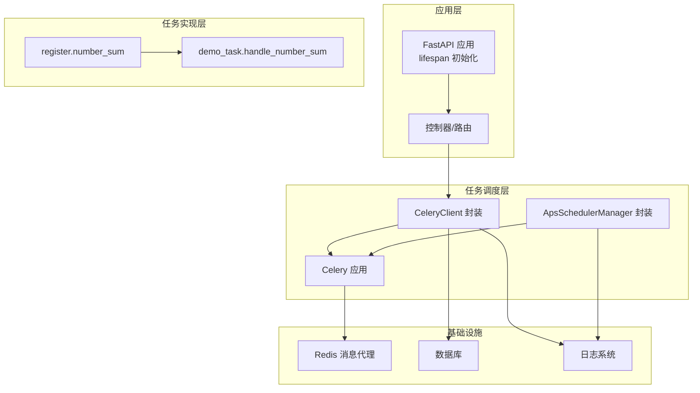
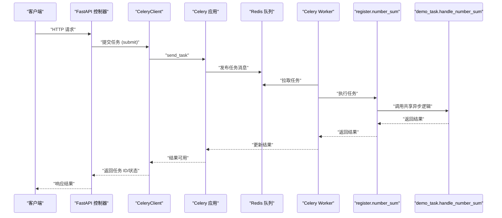
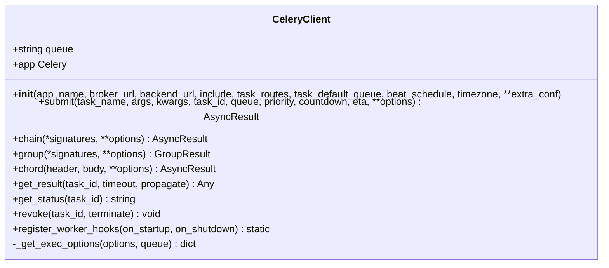
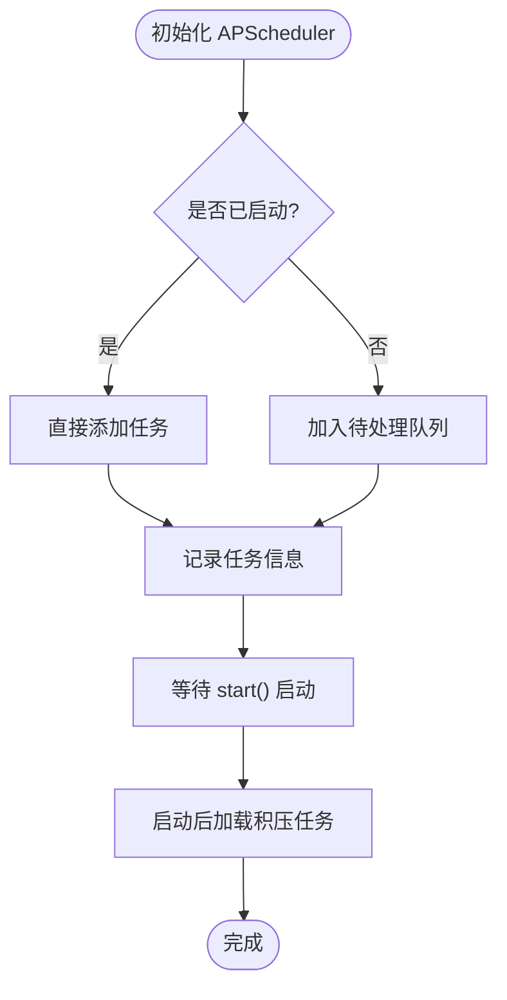
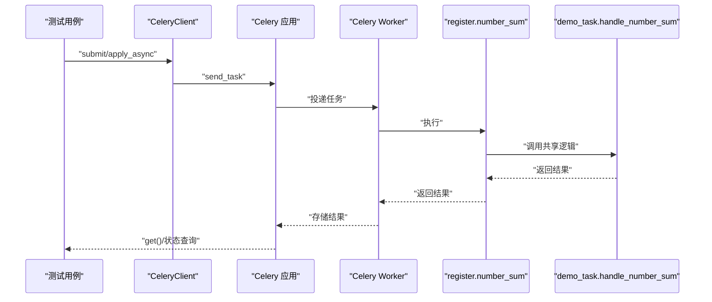
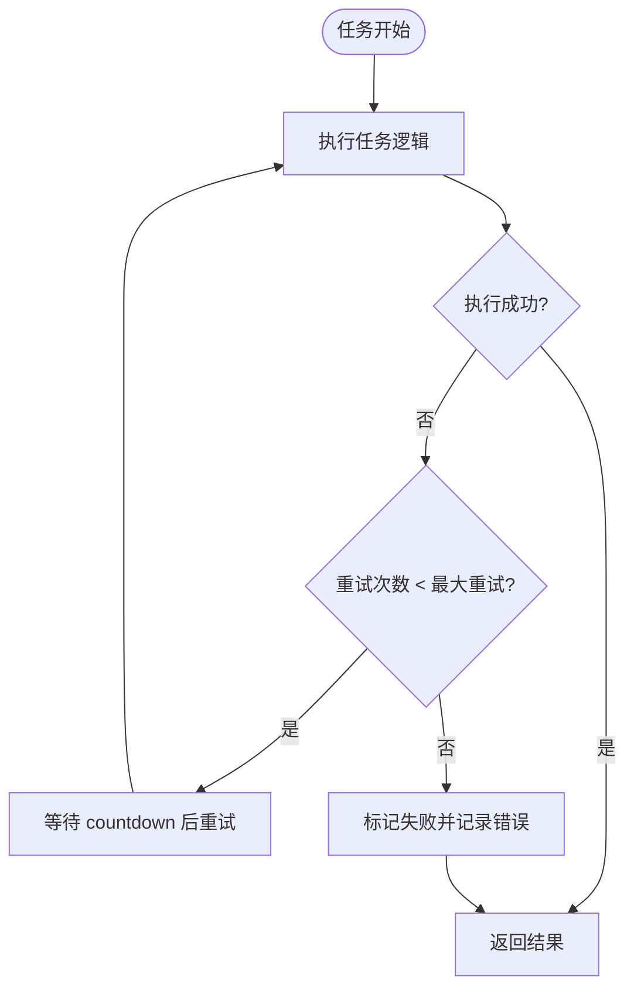
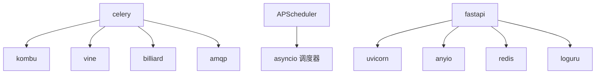

# 任务调度系统

<cite>
**本文档引用的文件**
- [internal/infra/celery/register.py](file://internal/infra/celery/register.py)
- [internal/infra/celery/__init__.py](file://internal/infra/celery/__init__.py)
- [internal/infra/apscheduler/register.py](file://internal/infra/apscheduler/register.py)
- [internal/infra/apscheduler/__init__.py](file://internal/infra/apscheduler/__init__.py)
- [pkg/toolkit/celery.py](file://pkg/toolkit/celery.py)
- [pkg/toolkit/apscheduler.py](file://pkg/toolkit/apscheduler.py)
- [internal/tasks/demo_task.py](file://internal/tasks/demo_task.py)
- [scripts/run_celery_worker.py](file://scripts/run_celery_worker.py)
- [tests/test_celery_tasks.py](file://tests/test_celery_tasks.py)
- [pyproject.toml](file://pyproject.toml)
- [main.py](file://main.py)
- [internal/app.py](file://internal/app.py)
- [internal/config/load_config.py](file://internal/config/load_config.py)
- [configs/.env.dev](file://configs/.env.dev)
</cite>

## 目录
1. [简介](#简介)
2. [项目结构](#项目结构)
3. [核心组件](#核心组件)
4. [架构总览](#架构总览)
5. [详细组件分析](#详细组件分析)
6. [依赖关系分析](#依赖关系分析)
7. [性能考虑](#性能考虑)
8. [故障排查指南](#故障排查指南)
9. [结论](#结论)
10. [附录](#附录)

## 简介
本项目提供了一个基于 Celery 的异步任务处理系统与基于 APScheduler 的定时任务系统，二者共同构成完整的任务调度体系。系统通过统一的消息代理（Redis）实现任务队列管理，支持任务注册、执行、结果查询、编排（链式、并发、回调）、重试、撤销以及与 FastAPI 应用的生命周期集成。同时，系统提供了任务路由、队列隔离、优先级与延迟执行等能力，并通过测试用例覆盖了典型场景。

## 项目结构
项目采用分层与功能模块化组织，核心调度相关代码集中在以下位置：
- Celery 相关：internal/infra/celery 与 pkg/toolkit/celery.py
- APScheduler 相关：internal/infra/apscheduler 与 pkg/toolkit/apscheduler.py
- 任务定义：internal/tasks/demo_task.py
- 启动脚本：scripts/run_celery_worker.py
- 测试：tests/test_celery_tasks.py
- 应用入口与配置：main.py、internal/app.py、internal/config/load_config.py、configs/.env.dev
- 依赖声明：pyproject.toml

图表来源
- [internal/infra/celery/__init__.py](file://internal/infra/celery/__init__.py#L96-L110)
- [pkg/toolkit/celery.py](file://pkg/toolkit/celery.py#L15-L51)
- [pkg/toolkit/apscheduler.py](file://pkg/toolkit/apscheduler.py#L14-L63)
- [internal/tasks/demo_task.py](file://internal/tasks/demo_task.py#L9-L19)
- [internal/infra/celery/register.py](file://internal/infra/celery/register.py#L8-L28)

章节来源
- [internal/infra/celery/__init__.py](file://internal/infra/celery/__init__.py#L18-L110)
- [pkg/toolkit/celery.py](file://pkg/toolkit/celery.py#L15-L51)
- [pkg/toolkit/apscheduler.py](file://pkg/toolkit/apscheduler.py#L14-L63)
- [internal/tasks/demo_task.py](file://internal/tasks/demo_task.py#L1-L20)
- [internal/infra/apscheduler/register.py](file://internal/infra/apscheduler/register.py#L5-L7)

## 核心组件
- CeleryClient：封装 Celery 应用的配置、任务提交、编排（chain/group/chord）、结果查询、撤销与 Worker 生命周期钩子注册。
- ApsSchedulerManager：封装 APScheduler 的调度器，支持 Cron/Interval/Date 任务注册、延迟启动、全局默认参数（抖动、实例数、错失宽限）。
- 任务实现：demo_task.handle_number_sum 提供可复用的异步任务逻辑，celery.register.number_sum 作为 Celery 任务入口，支持 Chord 回调聚合。
- 应用集成：FastAPI lifespan 中初始化数据库、Redis、签名认证、雪花 ID 生成器与 AnyIO 任务管理器；Celery 通过 check_celery_health 进行健康检查。
- 配置与环境：通过 internal/config/load_config.py 与 .env.* 文件加载配置，Celery 使用 Redis URL 作为 Broker/Backend。

章节来源
- [pkg/toolkit/celery.py](file://pkg/toolkit/celery.py#L15-L198)
- [pkg/toolkit/apscheduler.py](file://pkg/toolkit/apscheduler.py#L14-L255)
- [internal/tasks/demo_task.py](file://internal/tasks/demo_task.py#L9-L19)
- [internal/infra/celery/register.py](file://internal/infra/celery/register.py#L8-L28)
- [internal/app.py](file://internal/app.py#L85-L109)
- [internal/config/load_config.py](file://internal/config/load_config.py#L118-L173)

## 架构总览
系统采用“应用 + 调度 + 队列 + 任务实现”的分层架构：
- 应用层：FastAPI 提供 HTTP 接口，lifespan 中完成资源初始化。
- 调度层：CeleryClient 与 ApsSchedulerManager 提供统一的调度与任务编排能力。
- 队列层：Redis 作为消息代理，Celery 负责任务分发，Beat 负责定时任务派发。
- 任务层：具体任务逻辑在 demo_task 中实现，Celery 任务通过 register 模块注册并转发到共享逻辑。

图表来源
- [pkg/toolkit/celery.py](file://pkg/toolkit/celery.py#L75-L107)
- [internal/infra/celery/register.py](file://internal/infra/celery/register.py#L8-L28)
- [internal/tasks/demo_task.py](file://internal/tasks/demo_task.py#L9-L19)

## 详细组件分析

### Celery 配置与使用
- 应用初始化：在模块层级创建 CeleryClient 实例，配置 include、task_routes、beat_schedule，并注册 Worker 生命周期钩子（启动/关闭时初始化/释放数据库与 Redis 连接池）。
- 任务路由：通过 CELERY_TASK_ROUTES 将 Celery 任务路由到 celery_queue，定时任务路由到 cron_queue，实现队列隔离。
- 任务提交：CeleryClient.submit 支持 task_id、queue、priority、countdown、eta 等参数，内部合并默认配置与传入选项。
- 编排能力：提供 chain/group/chord 的实例方法，修复了初始化时 app 传参问题。
- 结果与状态：get_result/get_status 支持阻塞式获取与状态查询；revoke 支持撤销任务。
- Worker 生命周期钩子：register_worker_hooks 注册启动/关闭钩子，使用 dispatch_uid 防止重复注册；关闭阶段并发释放 Redis 与数据库连接。

图表来源
- [pkg/toolkit/celery.py](file://pkg/toolkit/celery.py#L15-L198)

章节来源
- [internal/infra/celery/__init__.py](file://internal/infra/celery/__init__.py#L18-L110)
- [pkg/toolkit/celery.py](file://pkg/toolkit/celery.py#L15-L198)

### APScheduler 定时任务实现
- 管理器封装：ApsSchedulerManager 支持延迟启动（start 前注册的任务会被暂存，启动后自动加载），统一管理全局默认参数（max_instances、jitter、coalesce、misfire_grace_time）。
- 任务注册：提供 register_cron/register_interval/register_date 三种快捷方法，支持在未启动时注册并在启动后自动加载。
- 运行控制：支持暂停/恢复/修改/移除任务，暴露底层 AsyncIOScheduler 以支持高级特性。
- 与 Celery 集成：通过 register 模块将定时任务注册到 APScheduler 管理器，实现周期性触发 Celery 任务。

图表来源
- [pkg/toolkit/apscheduler.py](file://pkg/toolkit/apscheduler.py#L66-L89)
- [internal/infra/apscheduler/register.py](file://internal/infra/apscheduler/register.py#L5-L7)

章节来源
- [pkg/toolkit/apscheduler.py](file://pkg/toolkit/apscheduler.py#L14-L255)
- [internal/infra/apscheduler/register.py](file://internal/infra/apscheduler/register.py#L5-L7)

### 任务注册、执行与结果处理
- 任务注册：Celery 任务通过 include 指定模块路径，任务名称与装饰器 name 保持一致；静态 Beat Schedule 通过 STATIC_BEAT_SCHEDULE 配置。
- 任务执行：register.number_sum 作为 Celery 任务入口，内部兼容 Chord 回调的列表输入并进行聚合求和，随后调用共享的异步处理函数 handle_number_sum。
- 结果处理：支持同步直接调用、delay 异步提交、apply_async 带参数提交；测试覆盖了状态查询、结果获取、撤销等场景。

图表来源
- [tests/test_celery_tasks.py](file://tests/test_celery_tasks.py#L31-L64)
- [internal/infra/celery/register.py](file://internal/infra/celery/register.py#L8-L28)
- [internal/tasks/demo_task.py](file://internal/tasks/demo_task.py#L9-L19)

章节来源
- [internal/infra/celery/register.py](file://internal/infra/celery/register.py#L8-L28)
- [internal/tasks/demo_task.py](file://internal/tasks/demo_task.py#L9-L19)
- [tests/test_celery_tasks.py](file://tests/test_celery_tasks.py#L19-L124)

### 任务重试、超时与错误恢复
- 重试机制：register.number_sum 在异常时触发 self.retry，设置 countdown 与 max_retries，实现指数退避式重试。
- 超时处理：CeleryClient.get_result 支持超时参数；测试用例验证 countdown 延迟执行行为。
- 错误恢复：Worker 生命周期钩子在启动时初始化资源，在关闭时并发释放资源，避免资源泄漏；日志系统记录关键事件与错误。

图表来源
- [internal/infra/celery/register.py](file://internal/infra/celery/register.py#L25-L28)

章节来源
- [internal/infra/celery/register.py](file://internal/infra/celery/register.py#L14-L28)
- [pkg/toolkit/celery.py](file://pkg/toolkit/celery.py#L141-L154)

### 任务编排与队列管理
- 队列隔离：通过 task_routes 将 Celery 任务与定时任务分别路由到 celery_queue 与 cron_queue，避免相互干扰。
- 编排能力：chain/group/chord 支持复杂任务流程；Chord 回调中 register.number_sum 兼容列表输入并聚合求和。
- 动态参数：submit 支持 queue、priority、countdown、eta 等参数，内部合并默认配置与传入选项。

章节来源
- [internal/infra/celery/__init__.py](file://internal/infra/celery/__init__.py#L24-L46)
- [pkg/toolkit/celery.py](file://pkg/toolkit/celery.py#L75-L137)
- [tests/test_celery_tasks.py](file://tests/test_celery_tasks.py#L208-L274)

### 与消息队列的集成关系与监控
- 消息队列：Celery 使用 Redis 作为 Broker 与 Backend，配置通过 settings.redis_url 提供。
- 健康检查：check_celery_health 主动检测 Broker 连接，不影响 API 启动流程。
- 监控与日志：统一的日志系统记录任务状态、错误与资源初始化/释放过程。

章节来源
- [internal/infra/celery/__init__.py](file://internal/infra/celery/__init__.py#L96-L137)
- [internal/config/load_config.py](file://internal/config/load_config.py#L162-L173)
- [internal/app.py](file://internal/app.py#L85-L109)

### 任务调度策略、优先级与资源控制
- 调度策略：APScheduler 支持 Cron/Interval/Date 三类触发器，默认合并错失任务、限制最大并发实例数、设置抖动以分散峰值。
- 优先级：CeleryClient.submit 支持 priority 参数，配合 Worker 的并发与队列策略实现优先级调度。
- 资源控制：Worker 生命周期钩子在启动/关闭阶段初始化/释放数据库与 Redis 连接；生产环境推荐设置 max-tasks-per-child 与 max-memory-per-child 以控制资源占用。

章节来源
- [pkg/toolkit/apscheduler.py](file://pkg/toolkit/apscheduler.py#L24-L63)
- [pkg/toolkit/celery.py](file://pkg/toolkit/celery.py#L100-L105)
- [internal/infra/celery/__init__.py](file://internal/infra/celery/__init__.py#L179-L189)

## 依赖关系分析
- Celery 依赖：celery、kombu、vine、billiard、amqp 等；项目中还引入 celery-types、celery-redbeat 等扩展。
- APScheduler 依赖：apscheduler、asyncio 调度器。
- 运行时依赖：uvicorn、fastapi、anyio、redis、loguru 等。

图表来源
- [pyproject.toml](file://pyproject.toml#L25-L32)
- [pyproject.toml](file://pyproject.toml#L9-L70)

章节来源
- [pyproject.toml](file://pyproject.toml#L9-L70)

## 性能考虑
- 队列隔离与路由：通过 task_routes 将不同类型任务分流至不同队列，降低相互影响。
- 并发与实例限制：APScheduler 的 max_instances 限制单任务并发；Celery Worker 的并发与任务数/内存限制可按资源调整。
- 抖动与错失处理：APScheduler 默认抖动与合并错失任务，有助于削峰填谷。
- 超时与撤销：合理设置任务超时与撤销策略，避免长时间阻塞。
- 日志与监控：统一日志系统便于定位性能瓶颈与异常。

## 故障排查指南
- Broker 连接失败：检查 Redis 地址与密码配置，确认网络可达；使用 check_celery_health 进行健康检查。
- Worker 未启动或不可用：测试用例中对 Worker 未启动场景使用 skip 跳过，需确保 Worker 正常运行。
- 任务重试过多：检查 register.number_sum 的异常原因与 retry 配置，必要时调整 countdown 与 max_retries。
- 队列堆积：检查任务执行耗时与 Worker 并发，必要时增加 Worker 数量或拆分队列。
- 资源泄漏：确认 Worker 生命周期钩子中的资源释放逻辑正常执行。

章节来源
- [tests/test_celery_tasks.py](file://tests/test_celery_tasks.py#L31-L84)
- [internal/infra/celery/__init__.py](file://internal/infra/celery/__init__.py#L54-L88)

## 结论
本任务调度系统通过 Celery 与 APScheduler 的协同，实现了从定时任务到异步任务的全栈覆盖。系统具备完善的任务编排、队列隔离、重试与超时处理、资源控制与监控能力，并通过测试用例验证了核心功能。结合合理的队列与并发策略，可在生产环境中稳定运行并具备良好的扩展性。

## 附录
- 启动命令参考：项目注释中提供了 Celery Worker 与 Beat 的启动示例，包括开发与生产环境的推荐配置。
- 环境配置：通过 .env.dev 与 .env.* 文件加载数据库与 Redis 配置，确保 Broker URL 正确。

章节来源
- [internal/infra/celery/__init__.py](file://internal/infra/celery/__init__.py#L179-L189)
- [configs/.env.dev](file://configs/.env.dev#L14-L17)