# 任务调度系统

<cite>
**本文档引用的文件**
- [internal/infra/celery.py](file://internal/infra/celery.py)
- [internal/infra/apscheduler.py](file://internal/infra/apscheduler.py)
- [internal/infra/anyio_task.py](file://internal/infra/anyio_task.py)
- [scripts/run_celery_worker.py](file://scripts/run_celery_worker.py)
- [internal/tasks/celery/tasks.py](file://internal/tasks/celery/tasks.py)
- [internal/tasks/apscheduler/tasks.py](file://internal/tasks/apscheduler/tasks.py)
- [pkg/celery_task.py](file://pkg/celery_task.py)
- [pkg/aps_task.py](file://pkg/aps_task.py)
- [pkg/anyio_task.py](file://pkg/anyio_task.py)
- [internal/app.py](file://internal/app.py)
- [internal/config/setting.py](file://internal/config/setting.py)
- [configs/.env.local](file://configs/.env.local)
- [configs/.env.dev](file://configs/.env.dev)
</cite>

## 目录
1. [概述](#概述)
2. [系统架构](#系统架构)
3. [核心组件分析](#核心组件分析)
4. [任务类型对比](#任务类型对比)
5. [具体实现详解](#具体实现详解)
6. [启动与配置](#启动与配置)
7. [最佳实践](#最佳实践)
8. [故障排除](#故障排除)
9. [总结](#总结)

## 概述

本项目采用多层次任务调度架构，集成了三种不同的任务处理机制：

- **Celery**：分布式任务队列，适用于耗时操作如发送邮件、处理大数据
- **APScheduler**：本地内存调度器，适用于定时同步、清理任务  
- **AnyIO Task Manager**：轻量级异步任务管理器，处理并发轻量级任务

这种混合架构设计充分发挥了每种工具的优势，为不同场景提供最优解决方案。

## 系统架构

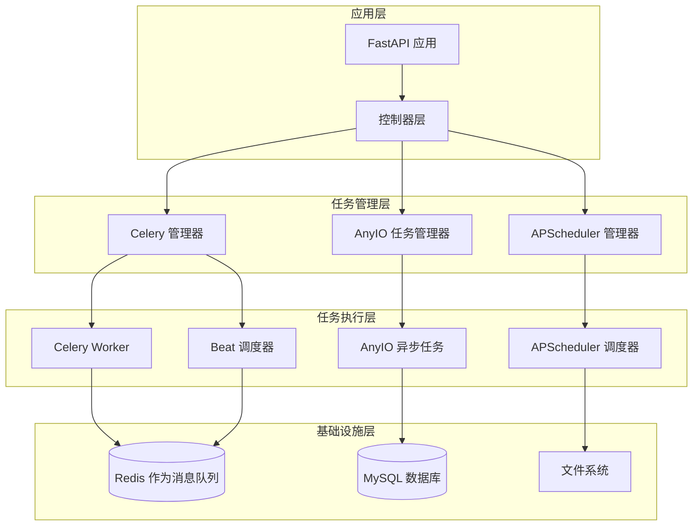

**图表来源**
- [internal/infra/celery.py](file://internal/infra/celery.py#L93-L117)
- [internal/infra/apscheduler.py](file://internal/infra/apscheduler.py#L8-L20)
- [internal/infra/anyio_task.py](file://internal/infra/anyio_task.py#L7-L28)

## 核心组件分析

### Celery 分布式任务队列

Celery 是一个强大的分布式任务队列系统，专门处理耗时操作和大规模数据处理。

#### 核心特性
- **分布式架构**：支持多台机器协同工作
- **任务队列管理**：基于 Redis 实现可靠的消息传递
- **任务编排**：支持链式、分组、回调等多种编排模式
- **动态定时任务**：通过 RedBeat 插件支持动态任务管理

#### 配置结构

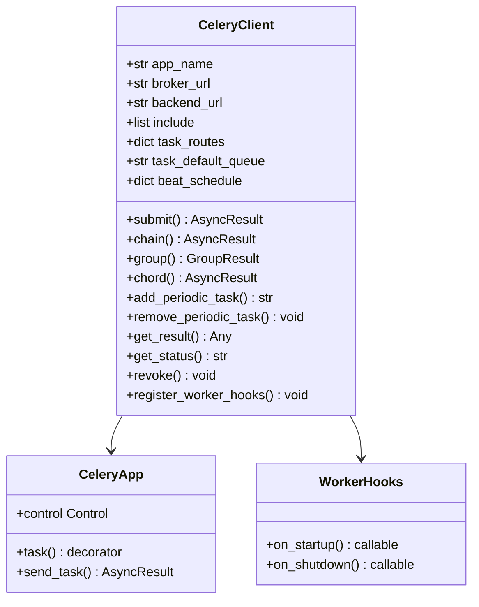

**图表来源**
- [pkg/celery_task.py](file://pkg/celery_task.py#L24-L287)
- [internal/infra/celery.py](file://internal/infra/celery.py#L93-L117)

**章节来源**
- [internal/infra/celery.py](file://internal/infra/celery.py#L1-L152)
- [pkg/celery_task.py](file://pkg/celery_task.py#L1-L287)

### APScheduler 本地调度器

APScheduler 是一个轻量级的 Python 调度库，专为本地任务调度设计。

#### 核心特性
- **内存调度**：基于内存的任务调度，无需外部存储
- **延迟启动**：支持在启动前注册任务
- **多种触发器**：支持 Cron、Interval、Date 等多种触发方式
- **全局配置管理**：统一管理默认参数如抖动、并发限制等

#### 架构设计

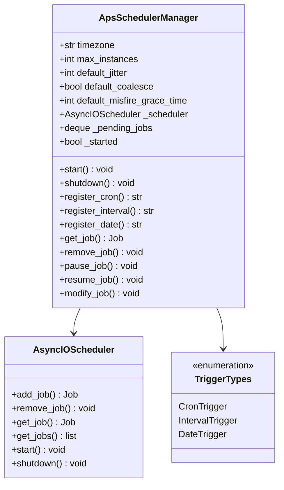

**图表来源**
- [pkg/aps_task.py](file://pkg/aps_task.py#L14-L256)

**章节来源**
- [internal/infra/apscheduler.py](file://internal/infra/apscheduler.py#L1-L21)
- [pkg/aps_task.py](file://pkg/aps_task.py#L1-L256)

### AnyIO 任务管理器

AnyIO 是一个现代化的异步任务管理器，专注于轻量级并发任务处理。

#### 核心特性
- **轻量级设计**：针对小规模并发任务优化
- **多执行后端**：支持线程、进程两种执行模式
- **容量限制**：内置全局、线程、进程级别的容量控制
- **超时管理**：支持任务级别和全局级别的超时控制

#### 任务管理架构

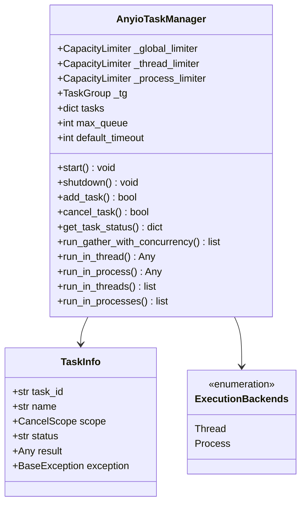

**图表来源**
- [pkg/anyio_task.py](file://pkg/anyio_task.py#L42-L379)

**章节来源**
- [internal/infra/anyio_task.py](file://internal/infra/anyio_task.py#L1-L29)
- [pkg/anyio_task.py](file://pkg/anyio_task.py#L1-L379)

## 任务类型对比

| 特性 | Celery | APScheduler | AnyIO |
|------|--------|-------------|-------|
| **部署架构** | 分布式集群 | 单机内存 | 单机内存 |
| **消息队列** | Redis/MQ | 无 | Redis/MQ |
| **任务持久化** | 支持 | 不支持 | 不支持 |
| **动态调度** | 支持（RedBeat） | 支持 | 不支持 |
| **任务编排** | 强大（链式、分组、回调） | 基础 | 基础 |
| **执行后端** | Worker 进程 | 本地线程 | 线程/进程 |
| **适用场景** | 耗时操作、大数据处理 | 定时任务、系统维护 | 轻量级并发任务 |
| **性能开销** | 较高 | 低 | 最低 |
| **可靠性** | 高 | 中等 | 中等 |

## 具体实现详解

### Celery 任务定义与使用

#### 初始化 Celery 实例

项目通过 `internal/infra/celery.py` 中的 `CeleryClient` 类初始化 Celery 实例：

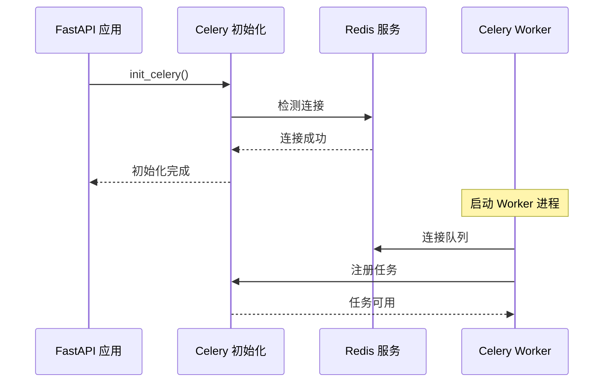

**图表来源**
- [internal/infra/celery.py](file://internal/infra/celery.py#L124-L143)

#### 任务装饰器使用

使用 `@celery.task` 装饰器定义任务：

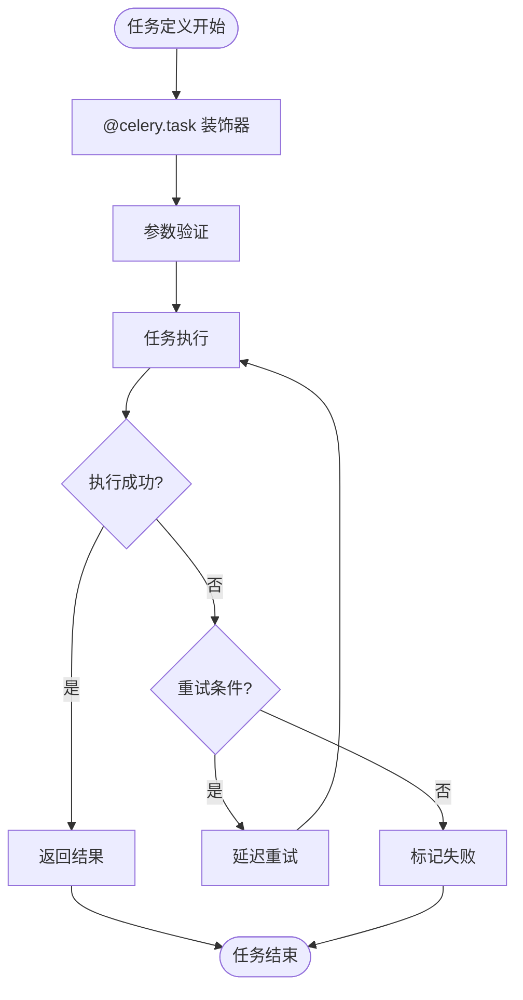

**图表来源**
- [internal/tasks/celery/tasks.py](file://internal/tasks/celery/tasks.py#L5-L33)

**章节来源**
- [internal/infra/celery.py](file://internal/infra/celery.py#L93-L117)
- [internal/tasks/celery/tasks.py](file://internal/tasks/celery/tasks.py#L1-L33)

### APScheduler 任务注册

#### 动态任务注册流程

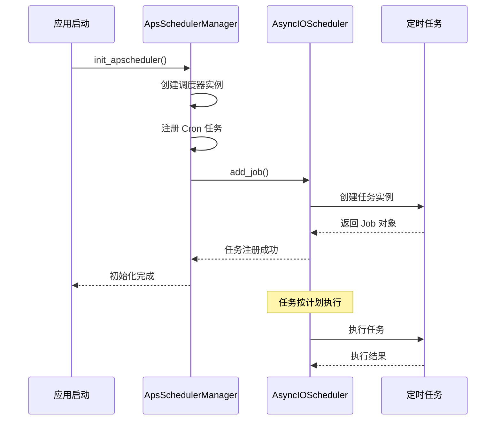

**图表来源**
- [internal/infra/apscheduler.py](file://internal/infra/apscheduler.py#L8-L20)
- [pkg/aps_task.py](file://pkg/aps_task.py#L107-L134)

**章节来源**
- [internal/infra/apscheduler.py](file://internal/infra/apscheduler.py#L1-L21)
- [internal/tasks/apscheduler/tasks.py](file://internal/tasks/apscheduler/tasks.py#L1-L12)

### AnyIO 任务管理

#### 任务执行流程

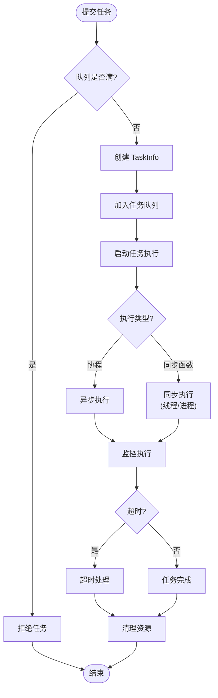

**图表来源**
- [pkg/anyio_task.py](file://pkg/anyio_task.py#L102-L147)

**章节来源**
- [internal/infra/anyio_task.py](file://internal/infra/anyio_task.py#L1-L29)
- [pkg/anyio_task.py](file://pkg/anyio_task.py#L1-L379)

## 启动与配置

### Celery Worker 启动脚本

项目提供了专门的 Celery Worker 启动脚本 `run_celery_worker.py`：

#### 启动参数配置

| 参数 | 默认值 | 说明 |
|------|--------|------|
| `queues` | `default_queue` | 指定 Worker 监听的队列 |
| `loglevel` | `debug` | 日志级别 |
| `pool` | `prefork` | 进程池类型 |
| `concurrency` | `4` | 并发进程数 |
| `extra_cli_args` | `[]` | 额外 CLI 参数 |

#### 启动命令示例

```bash
# 基本启动
python scripts/run_celery_worker.py

# 自定义参数
python scripts/run_celery_worker.py --logfile=worker.log --concurrency=8

# 生产环境启动
python scripts/run_celery_worker.py --logfile=/var/log/celery/worker.log --daemon
```

**章节来源**
- [scripts/run_celery_worker.py](file://scripts/run_celery_worker.py#L1-L38)

### 配置文件解析

#### Redis 连接配置

项目使用 Redis 作为消息队列和任务状态存储：

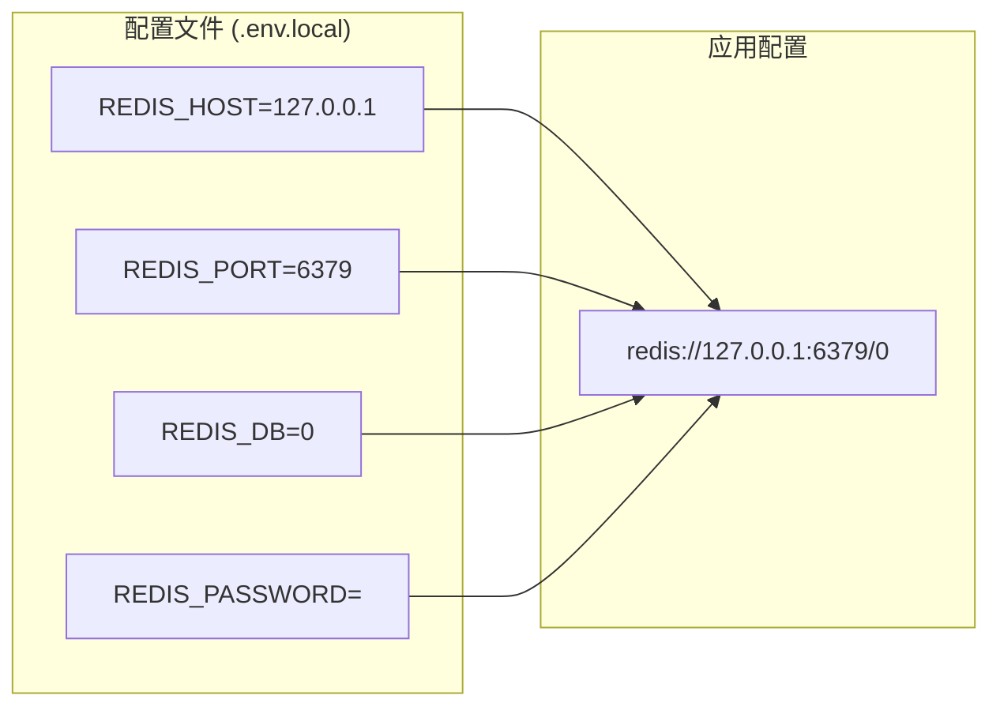

**图表来源**
- [configs/.env.local](file://configs/.env.local#L11-L14)
- [internal/config/setting.py](file://internal/config/setting.py#L50-L51)

**章节来源**
- [configs/.env.local](file://configs/.env.local#L1-L14)
- [configs/.env.dev](file://configs/.env.dev#L1-L14)

### FastAPI 集成

#### 生命周期管理

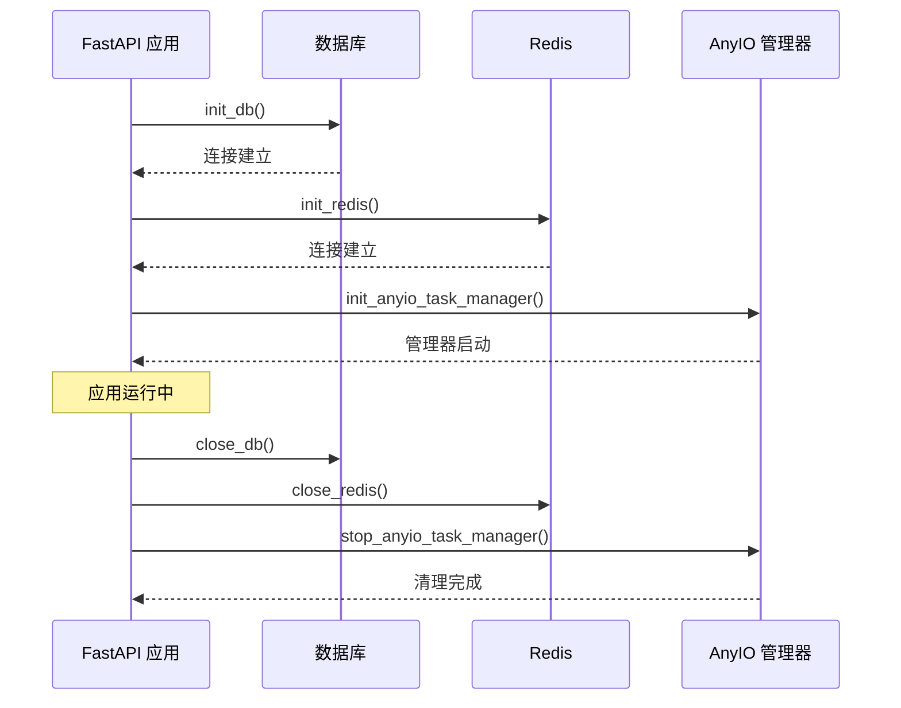

**图表来源**
- [internal/app.py](file://internal/app.py#L80-L104)

**章节来源**
- [internal/app.py](file://internal/app.py#L1-L105)

## 最佳实践

### 任务选择指南

#### Celery 适用场景
- **大数据处理**：文件转换、图像处理、数据分析
- **耗时操作**：邮件发送、报表生成、批量导入
- **分布式任务**：多节点协作、负载均衡
- **任务编排**：复杂的工作流、条件分支

#### APScheduler 适用场景
- **定时任务**：每日报告、定期清理、数据同步
- **系统维护**：缓存刷新、索引重建、备份
- **短期任务**：临时调度、一次性任务
- **本地调度**：无需分布式支持的场景

#### AnyIO 适用场景
- **并发请求**：API 调用、HTTP 请求、数据库查询
- **轻量级任务**：字符串处理、数据验证、格式转换
- **实时任务**：用户交互、即时通知、状态更新
- **高并发**：大量小任务的并发处理

### 性能优化建议

#### Celery 优化
1. **队列分离**：根据任务类型分配不同队列
2. **优先级设置**：重要任务设置高优先级
3. **Worker 调优**：合理设置并发数和进程池
4. **监控告警**：设置任务失败和超时告警

#### APScheduler 优化
1. **抖动配置**：设置合理的抖动时间避免并发高峰
2. **实例限制**：控制单个任务的最大并发实例数
3. **错过处理**：配置合适的错过执行宽限期
4. **任务合并**：启用积压任务合并减少重复执行

#### AnyIO 优化
1. **容量控制**：合理设置全局和局部容量限制
2. **超时设置**：为长时间任务设置适当的超时时间
3. **执行后端**：根据任务性质选择线程或进程执行
4. **批量处理**：利用批量执行功能提高效率

### 错误处理策略

#### 任务重试机制
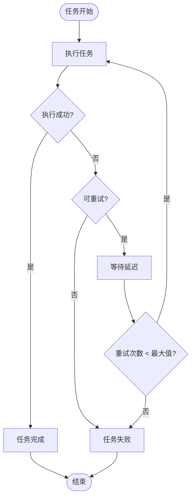

#### 异常处理最佳实践
1. **明确异常类型**：区分业务异常和系统异常
2. **重试策略**：指数退避、固定间隔等策略
3. **死信处理**：设置最大重试次数，超过后进入死信队列
4. **监控告警**：及时发现和处理任务失败

## 故障排除

### 常见问题诊断

#### Celery 问题排查

| 问题症状 | 可能原因 | 解决方案 |
|----------|----------|----------|
| 任务不执行 | Worker 未启动 | 检查 Worker 进程状态 |
| 连接失败 | Redis 配置错误 | 验证 Redis 连接信息 |
| 任务超时 | 任务逻辑耗时过长 | 优化任务逻辑或增加超时时间 |
| 内存泄漏 | 任务未正确清理 | 检查任务资源释放 |

#### APScheduler 问题排查

| 问题症状 | 可能原因 | 解决方案 |
|----------|----------|----------|
| 任务未执行 | 调度器未启动 | 检查调度器启动状态 |
| 时间偏差 | 时区配置错误 | 验证时区设置 |
| 任务重复 | 触发器配置错误 | 检查触发器参数 |
| 内存占用高 | 任务过多 | 优化任务数量或频率 |

#### AnyIO 问题排查

| 问题症状 | 可能原因 | 解决方案 |
|----------|----------|----------|
| 任务卡死 | 死锁或无限循环 | 检查任务逻辑和超时设置 |
| 资源不足 | 容量限制过低 | 调整容量限制参数 |
| 性能下降 | 并发过高 | 降低并发数或优化任务 |
| 异常丢失 | 异常处理不当 | 添加异常捕获和日志 |

### 监控指标

#### 关键性能指标
1. **任务执行时间**：平均执行时间和 P99 延迟
2. **任务成功率**：成功/失败比例
3. **队列长度**：各队列的任务积压情况
4. **资源使用率**：CPU、内存、网络使用情况
5. **错误率**：各类错误的发生频率

#### 监控工具推荐
- **Prometheus + Grafana**：实时监控和可视化
- **ELK Stack**：日志收集和分析
- **Sentry**：错误追踪和告警
- **New Relic**：应用性能监控

## 总结

本项目构建了一个完整的任务调度生态系统，通过三种不同的任务处理机制满足各种业务需求：

### 架构优势
1. **灵活性**：根据不同场景选择最适合的工具
2. **可靠性**：多重保障机制确保任务执行的稳定性
3. **可扩展性**：支持水平扩展和垂直扩展
4. **易维护性**：清晰的职责分离和完善的监控体系

### 技术特色
1. **混合架构**：结合分布式和本地调度的优势
2. **现代化设计**：基于异步编程和现代 Python 特性
3. **企业级功能**：完善的错误处理和监控机制
4. **易于集成**：与 FastAPI 框架无缝集成

### 发展方向
1. **容器化部署**：支持 Kubernetes 等容器编排平台
2. **云原生支持**：集成云服务商的托管消息队列
3. **智能调度**：引入机器学习算法优化任务调度
4. **可观测性**：增强分布式追踪和性能分析能力

通过合理运用这些任务调度工具，可以构建高性能、高可靠的后台处理系统，为业务发展提供坚实的技术支撑。