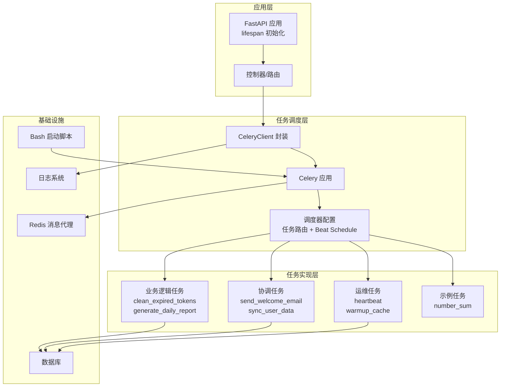
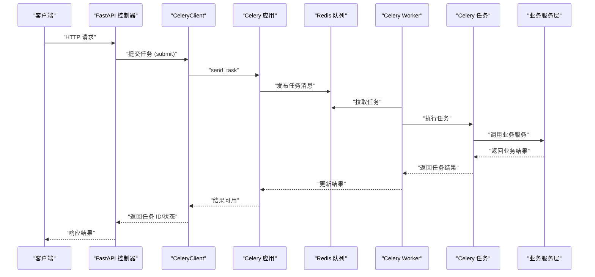
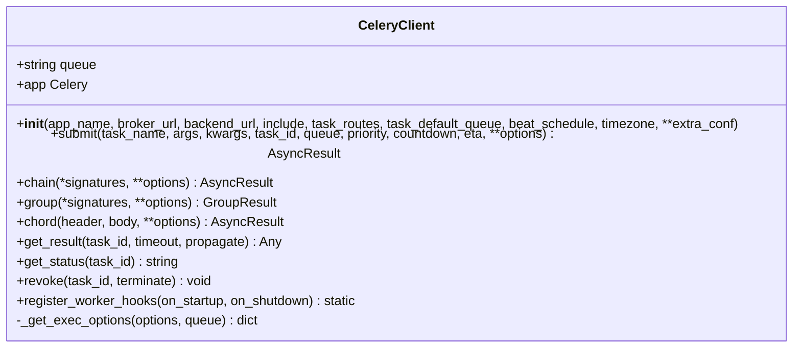
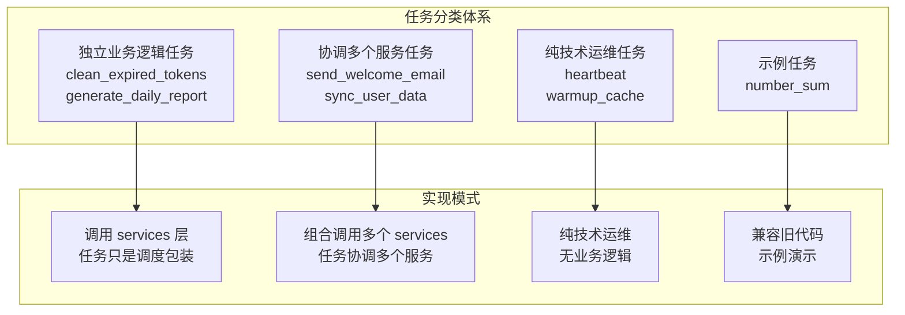
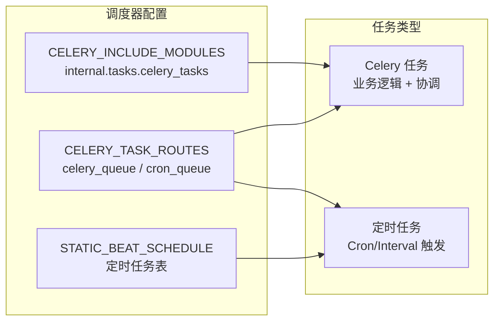
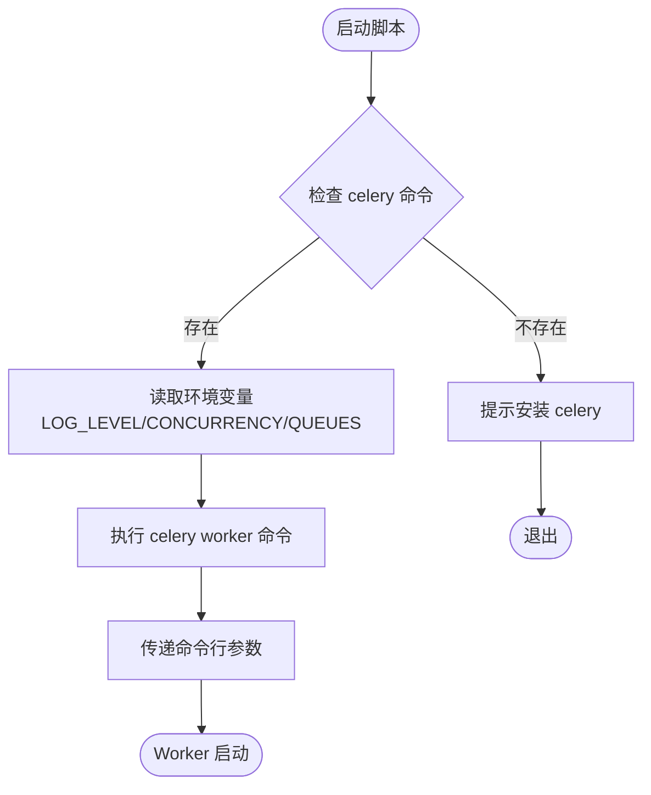
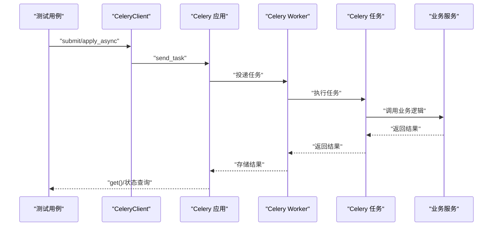
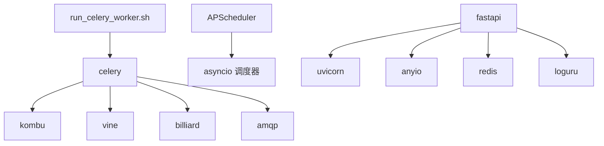

# 任务调度系统

<cite>
**本文档引用的文件**
- [internal/utils/celery/__init__.py](file://internal/utils/celery/__init__.py)
- [internal/tasks/celery_tasks.py](file://internal/tasks/celery_tasks.py)
- [internal/tasks/scheduler.py](file://internal/tasks/scheduler.py)
- [internal/tasks/__init__.py](file://internal/tasks/__init__.py)
- [scripts/run_celery_worker.sh](file://scripts/run_celery_worker.sh)
- [pkg/toolkit/celery.py](file://pkg/toolkit/celery.py)
- [tests/test_celery_tasks.py](file://tests/test_celery_tasks.py)
- [pyproject.toml](file://pyproject.toml)
- [main.py](file://main.py)
- [internal/app.py](file://internal/app.py)
- [internal/config.py](file://internal/config.py)
- [configs/.env.dev](file://configs/.env.dev)
</cite>

## 更新摘要
**变更内容**
- 新增 Celery 任务定义模块 `internal/tasks/celery_tasks.py`，包含业务逻辑任务、服务协调任务和技术运维任务
- 新增调度器配置模块 `internal/tasks/scheduler.py`，定义任务模块、路由和静态定时任务
- 新增 Bash 工作进程启动脚本 `scripts/run_celery_worker.sh`，提供灵活的 Worker 启动配置
- 更新任务导出模块 `internal/tasks/__init__.py`，统一管理任务和配置导出
- 重构测试文件以适配新的模块结构

## 目录
1. [简介](#简介)
2. [项目结构](#项目结构)
3. [核心组件](#核心组件)
4. [架构总览](#架构总览)
5. [详细组件分析](#详细组件分析)
6. [依赖关系分析](#依赖关系分析)
7. [性能考虑](#性能考虑)
8. [故障排查指南](#故障排查指南)
9. [结论](#结论)
10. [附录](#附录)

## 简介
本项目提供了一个基于 Celery 的异步任务处理系统与基于 APScheduler 的定时任务系统，二者共同构成完整的任务调度体系。系统通过统一的消息代理（Redis）实现任务队列管理，支持任务注册、执行、结果查询、编排（链式、并发、回调）、重试、撤销以及与 FastAPI 应用的生命周期集成。同时，系统提供了任务路由、队列隔离、优先级与延迟执行等能力，并通过测试用例覆盖了典型场景。

**更新** 本版本反映了任务模块重构和新增工作进程脚本，包括新的任务分类体系和更灵活的部署方式。

## 项目结构
项目采用分层与功能模块化组织，核心调度相关代码集中在以下位置：
- Celery 相关：`internal/utils/celery` 与 `internal/tasks/celery_tasks.py`
- 调度配置：`internal/tasks/scheduler.py`
- 任务定义：`internal/tasks/celery_tasks.py`
- 启动脚本：`scripts/run_celery_worker.sh`
- 测试：`tests/test_celery_tasks.py`
- 应用入口与配置：`main.py`、`internal/app.py`、`internal/config.py`、`configs/.env.dev`
- 依赖声明：`pyproject.toml`

```mermaid
graph TB
subgraph "应用层"
FastAPI["FastAPI 应用<br/>lifespan 初始化"]
Controllers["控制器/路由"]
end
subgraph "任务调度层"
CeleryClient["CeleryClient 封装"]
CeleryApp["Celery 应用"]
SchedulerConfig["调度器配置<br/>任务路由 + Beat Schedule"]
end
subgraph "任务实现层"
BusinessTasks["业务逻辑任务<br/>clean_expired_tokens<br/>generate_daily_report"]
CoordinationTasks["协调任务<br/>send_welcome_email<br/>sync_user_data"]
OpsTasks["运维任务<br/>heartbeat<br/>warmup_cache"]
ExampleTask["示例任务<br/>number_sum"]
end
subgraph "基础设施"
Redis["Redis 消息代理"]
DB["数据库"]
Logger["日志系统"]
ShellScript["Bash 启动脚本"]
end
FastAPI --> Controllers
Controllers --> CeleryClient
CeleryClient --> CeleryApp
CeleryApp --> SchedulerConfig
SchedulerConfig --> BusinessTasks
SchedulerConfig --> CoordinationTasks
SchedulerConfig --> OpsTasks
SchedulerConfig --> ExampleTask
CeleryApp --> Redis
BusinessTasks --> DB
CoordinationTasks --> DB
OpsTasks --> DB
CeleryClient --> Logger
ShellScript --> CeleryApp
```

**图表来源**
- [internal/utils/celery/__init__.py](file://internal/utils/celery/__init__.py#L77-L91)
- [internal/tasks/celery_tasks.py](file://internal/tasks/celery_tasks.py#L12-L156)
- [internal/tasks/scheduler.py](file://internal/tasks/scheduler.py#L15-L47)
- [scripts/run_celery_worker.sh](file://scripts/run_celery_worker.sh#L32-L37)

**章节来源**
- [internal/utils/celery/__init__.py](file://internal/utils/celery/__init__.py#L19-L47)
- [internal/tasks/celery_tasks.py](file://internal/tasks/celery_tasks.py#L1-L156)
- [internal/tasks/scheduler.py](file://internal/tasks/scheduler.py#L1-L48)
- [internal/tasks/__init__.py](file://internal/tasks/__init__.py#L1-L40)

## 核心组件
- **CeleryClient**：封装 Celery 应用的配置、任务提交、编排（chain/group/chord）、结果查询、撤销与 Worker 生命周期钩子注册。
- **任务定义模块**：`internal.tasks.celery_tasks` 包含四类任务：独立业务逻辑、协调多个服务、纯技术运维、示例任务，所有业务逻辑都放在 services 层。
- **调度器配置**：`internal.tasks.scheduler` 定义任务模块加载、路由配置和静态定时任务表。
- **Bash 启动脚本**：`scripts/run_celery_worker.sh` 提供灵活的 Worker 启动配置，支持环境变量和命令行参数。
- **应用集成**：FastAPI lifespan 中初始化数据库、Redis、签名认证、雪花 ID 生成器与 AnyIO 任务管理器；Celery 通过 `check_celery_health` 进行健康检查。
- **配置与环境**：通过 `internal/config.py` 与 `.env.*` 文件加载配置，Celery 使用 Redis URL 作为 Broker/Backend。

**更新** 新增了任务分类体系和 Bash 启动脚本，提供更灵活的部署方式。

**章节来源**
- [pkg/toolkit/celery.py](file://pkg/toolkit/celery.py#L15-L198)
- [internal/tasks/celery_tasks.py](file://internal/tasks/celery_tasks.py#L12-L156)
- [internal/tasks/scheduler.py](file://internal/tasks/scheduler.py#L15-L47)
- [scripts/run_celery_worker.sh](file://scripts/run_celery_worker.sh#L9-L37)
- [internal/utils/celery/__init__.py](file://internal/utils/celery/__init__.py#L77-L91)

## 架构总览
系统采用"应用 + 调度 + 队列 + 任务实现"的分层架构：
- **应用层**：FastAPI 提供 HTTP 接口，lifespan 中完成资源初始化。
- **调度层**：CeleryClient 与调度器配置提供统一的调度与任务编排能力。
- **队列层**：Redis 作为消息代理，Celery 负责任务分发，Beat 负责定时任务派发。
- **任务层**：具体任务逻辑在 `internal.tasks.celery_tasks` 中实现，支持四种任务分类。

```mermaid
sequenceDiagram
participant Client as "客户端"
participant API as "FastAPI 控制器"
participant CeleryClient as "CeleryClient"
participant CeleryApp as "Celery 应用"
participant Queue as "Redis 队列"
participant Worker as "Celery Worker"
participant Task as "Celery 任务"
participant Service as "业务服务层"
Client->>API : "HTTP 请求"
API->>CeleryClient : "提交任务 (submit)"
CeleryClient->>CeleryApp : "send_task"
CeleryApp->>Queue : "发布任务消息"
Worker->>Queue : "拉取任务"
Worker->>Task : "执行任务"
Task->>Service : "调用业务服务"
Service-->>Task : "返回业务结果"
Task-->>Worker : "返回任务结果"
Worker-->>CeleryApp : "更新结果"
CeleryApp-->>CeleryClient : "结果可用"
CeleryClient-->>API : "返回任务 ID/状态"
API-->>Client : "响应结果"
```

**图表来源**
- [pkg/toolkit/celery.py](file://pkg/toolkit/celery.py#L75-L107)
- [internal/tasks/celery_tasks.py](file://internal/tasks/celery_tasks.py#L28-L36)
- [internal/utils/celery/__init__.py](file://internal/utils/celery/__init__.py#L77-L91)

## 详细组件分析

### Celery 配置与使用
- **应用初始化**：在模块层级创建 CeleryClient 实例，配置 include、task_routes、beat_schedule，并注册 Worker 生命周期钩子（启动/关闭时初始化/释放数据库与 Redis 连接池）。
- **任务路由**：通过 `CELERY_TASK_ROUTES` 将 Celery 任务路由到 celery_queue，定时任务路由到 cron_queue，实现队列隔离。
- **任务提交**：CeleryClient.submit 支持 task_id、queue、priority、countdown、eta 等参数，内部合并默认配置与传入选项。
- **编排能力**：提供 chain/group/chord 的实例方法，修复了初始化时 app 传参问题。
- **结果与状态**：get_result/get_status 支持阻塞式获取与状态查询；revoke 支持撤销任务。
- **Worker 生命周期钩子**：register_worker_hooks 注册启动/关闭钩子，使用 dispatch_uid 防止重复注册；关闭阶段并发释放 Redis 与数据库连接。

**更新** 任务模块路径已更新为 `internal.tasks.celery_tasks`，路由配置和任务名称均相应调整。

```mermaid
classDiagram
class CeleryClient {
+string queue
+app Celery
+__init__(app_name, broker_url, backend_url, include, task_routes, task_default_queue, beat_schedule, timezone, **extra_conf)
+submit(task_name, args, kwargs, task_id, queue, priority, countdown, eta, **options) AsyncResult
+chain(*signatures, **options) AsyncResult
+group(*signatures, **options) GroupResult
+chord(header, body, **options) AsyncResult
+get_result(task_id, timeout, propagate) Any
+get_status(task_id) string
+revoke(task_id, terminate) void
+register_worker_hooks(on_startup, on_shutdown) static
-_get_exec_options(options, queue) dict
}
```

**图表来源**
- [pkg/toolkit/celery.py](file://pkg/toolkit/celery.py#L15-L198)

**章节来源**
- [internal/utils/celery/__init__.py](file://internal/utils/celery/__init__.py#L77-L91)
- [pkg/toolkit/celery.py](file://pkg/toolkit/celery.py#L15-L198)

### 任务分类与实现
系统将任务分为四大类，每类都有明确的职责分工：

#### 1. 独立业务逻辑任务
- **clean_expired_tokens**：清理过期 token，调用 TokenService.clean_expired_tokens()
- **generate_daily_report**：生成日报表，调用 ReportService.generate_report()

#### 2. 协调多个服务任务
- **send_welcome_email**：发送欢迎邮件，协调 UserService + EmailService
- **sync_user_data**：同步用户数据到第三方系统，协调多个服务

#### 3. 纯技术运维任务
- **heartbeat**：心跳检测，无业务逻辑
- **warmup_cache**：缓存预热，直接操作缓存

#### 4. 示例任务
- **number_sum**：示例异步任务，支持处理单个数字加法，或 Chord 回调的列表求和

所有业务逻辑都放在 services 层，任务模块只做调度和协调，遵循单一职责原则。

**更新** 新增了完整的任务分类体系，包含业务逻辑、服务协调和运维任务。

```mermaid
flowchart TD
subgraph "任务分类体系"
Independent["独立业务逻辑任务<br/>clean_expired_tokens<br/>generate_daily_report"]
Coordination["协调多个服务任务<br/>send_welcome_email<br/>sync_user_data"]
Operations["纯技术运维任务<br/>heartbeat<br/>warmup_cache"]
Example["示例任务<br/>number_sum"]
end
subgraph "实现模式"
Pattern1["调用 services 层<br/>任务只是调度包装"]
Pattern2["组合调用多个 services<br/>任务协调多个服务"]
Pattern3["纯技术运维<br/>无业务逻辑"]
Pattern4["兼容旧代码<br/>示例演示"]
end
Independent --> Pattern1
Coordination --> Pattern2
Operations --> Pattern3
Example --> Pattern4
```

**图表来源**
- [internal/tasks/celery_tasks.py](file://internal/tasks/celery_tasks.py#L16-L156)

**章节来源**
- [internal/tasks/celery_tasks.py](file://internal/tasks/celery_tasks.py#L12-L156)

### 调度器配置
- **任务模块配置**：通过 `CELERY_INCLUDE_MODULES` 指定需要加载的任务模块路径 `"internal.tasks.celery_tasks"`
- **任务路由配置**：Celery 任务统一走 celery_queue，定时任务走 cron_queue，实现队列隔离
- **静态定时任务表**：包含 Cron 风格（每 15 分钟）和 Interval 风格（每 30 秒）两种触发器

**更新** 调度器配置模块提供了清晰的任务路由和定时任务管理。

```mermaid
flowchart LR
subgraph "调度器配置"
Modules["CELERY_INCLUDE_MODULES<br/>internal.tasks.celery_tasks"]
Routes["CELERY_TASK_ROUTES<br/>celery_queue / cron_queue"]
Schedule["STATIC_BEAT_SCHEDULE<br/>定时任务表"]
end
subgraph "任务类型"
CeleryTasks["Celery 任务<br/>业务逻辑 + 协调"]
TimerTasks["定时任务<br/>Cron/Interval 触发"]
end
Modules --> CeleryTasks
Routes --> CeleryTasks
Routes --> TimerTasks
Schedule --> TimerTasks
```

**图表来源**
- [internal/tasks/scheduler.py](file://internal/tasks/scheduler.py#L15-L47)

**章节来源**
- [internal/tasks/scheduler.py](file://internal/tasks/scheduler.py#L15-L47)

### Bash 工作进程启动脚本
- **环境变量支持**：CELERY_LOG_LEVEL（日志级别，默认 info）、CELERY_CONCURRENCY（并发数，默认 4）、CELERY_QUEUES（队列列表，默认 default,celery_queue,cron_queue）
- **命令行参数**：支持传递额外的 Celery 参数，如 --max-tasks-per-child
- **自动检测**：检查 celery 命令是否存在，不存在则提示安装方法
- **默认配置**：使用 prefork pool，推荐的生产环境配置

**更新** 新增了 Bash 启动脚本，提供更灵活的 Worker 部署方式。

```mermaid
flowchart TD
Start(["启动脚本"]) --> EnvCheck{"检查 celery 命令"}
EnvCheck --> |存在| Config["读取环境变量<br/>LOG_LEVEL/CONCURRENCY/QUEUES"]
EnvCheck --> |不存在| Install["提示安装 celery"]
Config --> Exec["执行 celery worker 命令"]
Exec --> Args["传递命令行参数"]
Args --> Done(["Worker 启动"])
Install --> Exit(["退出"])
```

**图表来源**
- [scripts/run_celery_worker.sh](file://scripts/run_celery_worker.sh#L24-L37)

**章节来源**
- [scripts/run_celery_worker.sh](file://scripts/run_celery_worker.sh#L9-L37)

### 任务注册、执行与结果处理
- **任务注册**：Celery 任务通过 include 指定模块路径 `internal.tasks.celery_tasks`，任务名称与装饰器 name 保持一致
- **任务执行**：任务通过装饰器 `@celery_client.app.task` 注册，支持 bind=True 获取任务实例
- **异步执行**：使用 `run_in_async` 辅助函数在 Celery 同步任务中执行异步代码
- **结果处理**：支持同步直接调用、delay 异步提交、apply_async 带参数提交

**更新** 任务模块重构后，测试文件需要更新导入路径以适配新的模块结构。

```mermaid
sequenceDiagram
participant Test as "测试用例"
participant CeleryClient as "CeleryClient"
participant CeleryApp as "Celery 应用"
participant Worker as "Celery Worker"
participant Task as "Celery 任务"
participant Service as "业务服务"
Test->>CeleryClient : "submit/apply_async"
CeleryClient->>CeleryApp : "send_task"
CeleryApp->>Worker : "投递任务"
Worker->>Task : "执行任务"
Task->>Service : "调用业务逻辑"
Service-->>Task : "返回结果"
Task-->>Worker : "返回结果"
Worker-->>CeleryApp : "存储结果"
CeleryApp-->>Test : "get()/状态查询"
```

**图表来源**
- [tests/test_celery_tasks.py](file://tests/test_celery_tasks.py#L112-L121)
- [internal/tasks/celery_tasks.py](file://internal/tasks/celery_tasks.py#L28-L36)

**章节来源**
- [internal/tasks/celery_tasks.py](file://internal/tasks/celery_tasks.py#L12-L156)
- [tests/test_celery_tasks.py](file://tests/test_celery_tasks.py#L18-L361)

### 任务重试、超时与错误恢复
- **重试机制**：`number_sum` 任务在异常时触发 `self.retry`，设置 countdown 与 max_retries，实现指数退避式重试
- **超时处理**：CeleryClient.get_result 支持超时参数；测试用例验证 countdown 延迟执行行为
- **错误恢复**：Worker 生命周期钩子在启动时初始化资源，在关闭时并发释放资源，避免资源泄漏；日志系统记录关键事件与错误

**更新** 重试逻辑在重构后的任务模块中得到保留和优化。

**章节来源**
- [internal/tasks/celery_tasks.py](file://internal/tasks/celery_tasks.py#L153-L156)
- [pkg/toolkit/celery.py](file://pkg/toolkit/celery.py#L141-L154)

### 任务编排与队列管理
- **队列隔离**：通过 `CELERY_TASK_ROUTES` 将 Celery 任务与定时任务分别路由到 celery_queue 与 cron_queue，避免相互干扰
- **编排能力**：chain/group/chord 支持复杂任务流程；Chord 回调中 `number_sum` 兼容列表输入并聚合求和
- **动态参数**：submit 支持 queue、priority、countdown、eta 等参数，内部合并默认配置与传入选项

**章节来源**
- [internal/tasks/scheduler.py](file://internal/tasks/scheduler.py#L21-L26)
- [pkg/toolkit/celery.py](file://pkg/toolkit/celery.py#L75-L137)
- [tests/test_celery_tasks.py](file://tests/test_celery_tasks.py#L207-L239)

### 与消息队列的集成关系与监控
- **消息队列**：Celery 使用 Redis 作为 Broker 与 Backend，配置通过 `settings.redis_url` 提供
- **健康检查**：`check_celery_health` 主动检测 Broker 连接，不影响 API 启动流程
- **监控与日志**：统一的日志系统记录任务状态、错误与资源初始化/释放过程

**章节来源**
- [internal/utils/celery/__init__.py](file://internal/utils/celery/__init__.py#L98-L117)
- [internal/config.py](file://internal/config.py#L215-L227)
- [internal/app.py](file://internal/app.py#L85-L109)

### 任务调度策略、优先级与资源控制
- **调度策略**：APScheduler 支持 Cron/Interval/Date 三类触发器，默认合并错失任务、限制最大并发实例数、设置抖动以分散峰值
- **优先级**：CeleryClient.submit 支持 priority 参数，配合 Worker 的并发与队列策略实现优先级调度
- **资源控制**：Worker 生命周期钩子在启动/关闭阶段初始化/释放数据库与 Redis 连接；生产环境推荐设置 max-tasks-per-child 与 max-memory-per-child 以控制资源占用

**更新** 新增了 Bash 启动脚本，提供更灵活的资源控制选项。

**章节来源**
- [pkg/toolkit/celery.py](file://pkg/toolkit/celery.py#L100-L105)
- [scripts/run_celery_worker.sh](file://scripts/run_celery_worker.sh#L32-L37)

## 依赖关系分析
- **Celery 依赖**：celery、kombu、vine、billiard、amqp 等；项目中还引入 celery-types、celery-redbeat 等扩展
- **APScheduler 依赖**：apscheduler、asyncio 调度器
- **运行时依赖**：uvicorn、fastapi、anyio、redis、loguru 等

```mermaid
graph TB
Celery["celery"] --> Kombu["kombu"]
Celery --> Vine["vine"]
Celery --> Billiard["billiard"]
Celery --> Amqp["amqp"]
APScheduler["APScheduler"] --> Asyncio["asyncio 调度器"]
FastAPI["fastapi"] --> Uvicorn["uvicorn"]
FastAPI --> AnyIO["anyio"]
FastAPI --> Redis["redis"]
FastAPI --> Loguru["loguru"]
BashScript["run_celery_worker.sh"] --> Celery
```

**图表来源**
- [pyproject.toml](file://pyproject.toml#L25-L32)
- [pyproject.toml](file://pyproject.toml#L9-L70)

**章节来源**
- [pyproject.toml](file://pyproject.toml#L9-L70)

## 性能考虑
- **队列隔离与路由**：通过 `CELERY_TASK_ROUTES` 将不同类型任务分流至不同队列，降低相互影响
- **并发与实例限制**：APScheduler 的 max_instances 限制单任务并发；Celery Worker 的并发与任务数/内存限制可按资源调整
- **抖动与错失处理**：APScheduler 默认抖动与合并错失任务，有助于削峰填谷
- **超时与撤销**：合理设置任务超时与撤销策略，避免长时间阻塞
- **日志与监控**：统一日志系统便于定位性能瓶颈与异常
- **Bash 脚本优化**：使用 prefork pool 和合理的并发设置，避免进程创建开销

**更新** 新增了 Bash 启动脚本的性能优化建议。

## 故障排查指南
- **Broker 连接失败**：检查 Redis 地址与密码配置，确认网络可达；使用 `check_celery_health` 进行健康检查
- **Worker 未启动或不可用**：测试用例中对 Worker 未启动场景使用 skip 跳过，需确保 Worker 正常运行
- **任务重试过多**：检查 `number_sum` 的异常原因与 retry 配置，必要时调整 countdown 与 max_retries
- **队列堆积**：检查任务执行耗时与 Worker 并发，必要时增加 Worker 数量或拆分队列
- **资源泄漏**：确认 Worker 生命周期钩子中的资源释放逻辑正常执行
- **Bash 脚本问题**：检查 celery 命令是否存在，环境变量设置是否正确

**更新** 新增了 Bash 启动脚本相关的故障排查指导。

**章节来源**
- [tests/test_celery_tasks.py](file://tests/test_celery_tasks.py#L31-L84)
- [scripts/run_celery_worker.sh](file://scripts/run_celery_worker.sh#L24-L29)

## 结论
本任务调度系统通过 Celery 与 APScheduler 的协同，实现了从定时任务到异步任务的全栈覆盖。系统具备完善的任务编排、队列隔离、重试与超时处理、资源控制与监控能力，并通过测试用例验证了核心功能。结合合理的队列与并发策略，可在生产环境中稳定运行并具备良好的扩展性。

**更新** 通过模块重构、新增任务分类体系和 Bash 启动脚本，系统在可维护性、测试覆盖率、开发体验和部署灵活性方面都有显著提升。

## 附录
- **启动命令参考**：项目注释中提供了 Celery Worker 与 Beat 的启动示例，包括开发与生产环境的推荐配置
- **Bash 启动脚本**：`scripts/run_celery_worker.sh` 提供灵活的 Worker 启动配置，支持环境变量和命令行参数
- **环境配置**：通过 `.env.dev` 与 `.env.*` 文件加载数据库与 Redis 配置，确保 Broker URL 正确
- **测试配置**：`tests/test_celery_tasks.py` 提供了完整的测试基础设施，包括数据库、Redis、日志等 Mock 配置

**更新** 新增了 Bash 启动脚本和任务分类体系的使用说明。

**章节来源**
- [internal/utils/celery/__init__.py](file://internal/utils/celery/__init__.py#L157-L174)
- [scripts/run_celery_worker.sh](file://scripts/run_celery_worker.sh#L1-L38)
- [configs/.env.dev](file://configs/.env.dev#L16-L20)
- [tests/test_celery_tasks.py](file://tests/test_celery_tasks.py#L352-L361)