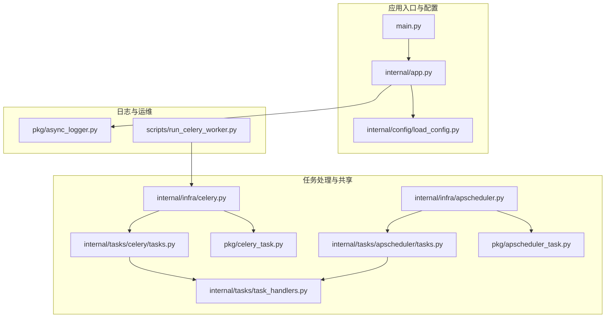
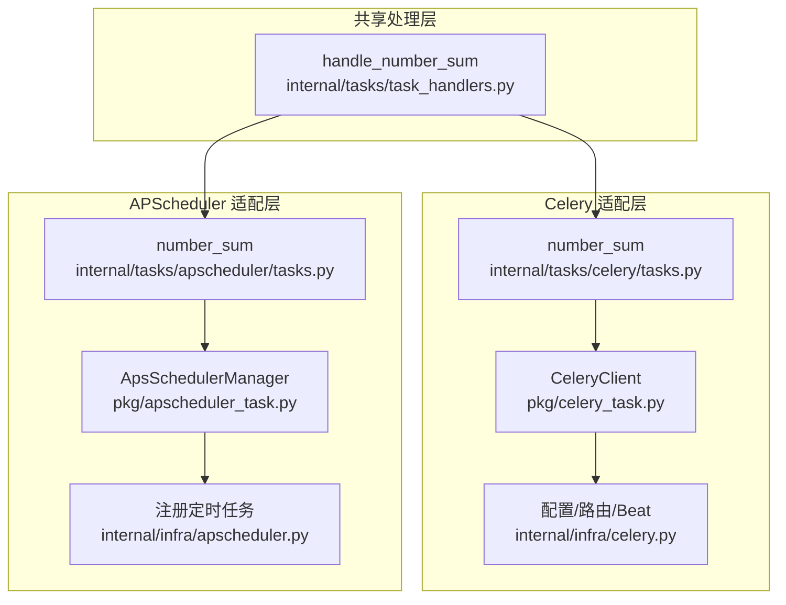
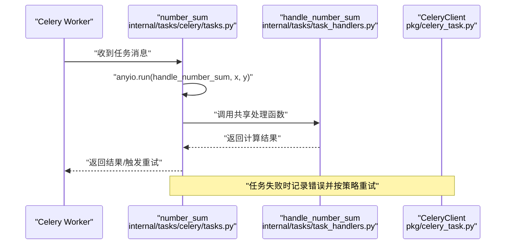
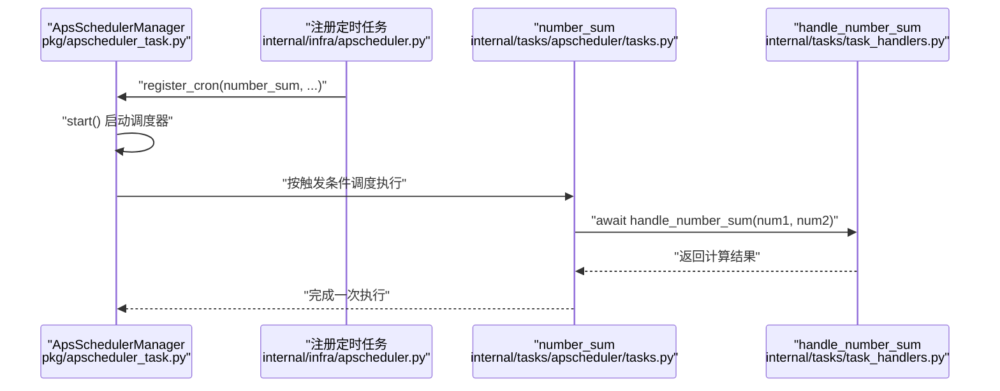
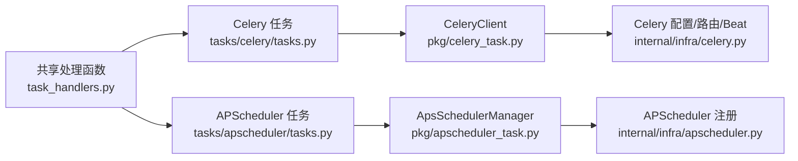

# 共享任务处理器

<cite>
**本文引用的文件**
- [main.py](file://main.py)
- [internal/app.py](file://internal/app.py)
- [internal/config/load_config.py](file://internal/config/load_config.py)
- [internal/infra/celery.py](file://internal/infra/celery.py)
- [internal/infra/apscheduler.py](file://internal/infra/apscheduler.py)
- [internal/tasks/task_handlers.py](file://internal/tasks/task_handlers.py)
- [internal/tasks/celery/tasks.py](file://internal/tasks/celery/tasks.py)
- [internal/tasks/apscheduler/tasks.py](file://internal/tasks/apscheduler/tasks.py)
- [pkg/celery_task.py](file://pkg/celery_task.py)
- [pkg/apscheduler_task.py](file://pkg/apscheduler_task.py)
- [pkg/async_logger.py](file://pkg/async_logger.py)
- [scripts/run_celery_worker.py](file://scripts/run_celery_worker.py)
</cite>

## 目录
1. [简介](#简介)
2. [项目结构](#项目结构)
3. [核心组件](#核心组件)
4. [架构总览](#架构总览)
5. [详细组件分析](#详细组件分析)
6. [依赖关系分析](#依赖关系分析)
7. [性能考量](#性能考量)
8. [故障排查指南](#故障排查指南)
9. [结论](#结论)

## 简介
本文件聚焦于“共享任务处理器”能力，即如何在 Celery 与 APScheduler 两种任务调度体系之间复用同一份异步任务处理逻辑。该能力通过“共享处理函数 + 适配层”的方式实现，既保证了任务逻辑的一致性，又兼顾了不同调度器的特性与约束。本文将从系统架构、组件关系、数据与控制流、错误处理与性能优化等方面进行深入解析，并提供可视化图示与实操建议。

## 项目结构
围绕共享任务处理器，项目的关键文件分布如下：
- 配置与入口
  - 应用入口与生命周期：main.py、internal/app.py、internal/config/load_config.py
- 任务处理与共享逻辑
  - 共享处理函数：internal/tasks/task_handlers.py
  - Celery 适配层：internal/tasks/celery/tasks.py、internal/infra/celery.py、pkg/celery_task.py
  - APScheduler 适配层：internal/tasks/apscheduler/tasks.py、internal/infra/apscheduler.py、pkg/apscheduler_task.py
- 日志与工具
  - 异步日志：pkg/async_logger.py
- 运维脚本
  - Celery Worker 启动脚本：scripts/run_celery_worker.py

图表来源
- [main.py](file://main.py#L1-L18)
- [internal/app.py](file://internal/app.py#L1-L121)
- [internal/config/load_config.py](file://internal/config/load_config.py#L1-L222)
- [internal/tasks/task_handlers.py](file://internal/tasks/task_handlers.py#L1-L20)
- [internal/tasks/celery/tasks.py](file://internal/tasks/celery/tasks.py#L1-L22)
- [internal/infra/celery.py](file://internal/infra/celery.py#L1-L139)
- [pkg/celery_task.py](file://pkg/celery_task.py#L1-L172)
- [internal/tasks/apscheduler/tasks.py](file://internal/tasks/apscheduler/tasks.py#L1-L13)
- [internal/infra/apscheduler.py](file://internal/infra/apscheduler.py#L1-L21)
- [pkg/apscheduler_task.py](file://pkg/apscheduler_task.py#L1-L256)
- [pkg/async_logger.py](file://pkg/async_logger.py#L1-L268)
- [scripts/run_celery_worker.py](file://scripts/run_celery_worker.py#L1-L38)

章节来源
- [main.py](file://main.py#L1-L18)
- [internal/app.py](file://internal/app.py#L1-L121)
- [internal/config/load_config.py](file://internal/config/load_config.py#L1-L222)

## 核心组件
- 共享处理函数
  - 位于 internal/tasks/task_handlers.py，提供异步任务处理逻辑，供 Celery 与 APScheduler 的适配层调用。
- Celery 适配层
  - internal/tasks/celery/tasks.py：定义 Celery 任务装饰器，负责调用共享处理函数并处理重试。
  - internal/infra/celery.py：封装 CeleryClient，配置路由、队列、静态定时任务、Worker 生命周期钩子。
  - pkg/celery_task.py：CeleryClient 封装任务提交、编排、状态查询、撤销与 Worker 生命周期钩子注册。
- APScheduler 适配层
  - internal/tasks/apscheduler/tasks.py：定义异步任务函数，直接调用共享处理函数。
  - internal/infra/apscheduler.py：初始化 ApsSchedulerManager 并注册定时任务。
  - pkg/apscheduler_task.py：ApsSchedulerManager 封装调度器生命周期、任务注册（Cron/Interval/Date）、暂停/恢复/修改/移除等。
- 日志
  - pkg/async_logger.py：统一的异步日志管理器，支持文件与控制台输出、轮转与 JSON 格式化。

章节来源
- [internal/tasks/task_handlers.py](file://internal/tasks/task_handlers.py#L1-L20)
- [internal/tasks/celery/tasks.py](file://internal/tasks/celery/tasks.py#L1-L22)
- [internal/infra/celery.py](file://internal/infra/celery.py#L1-L139)
- [pkg/celery_task.py](file://pkg/celery_task.py#L1-L172)
- [internal/tasks/apscheduler/tasks.py](file://internal/tasks/apscheduler/tasks.py#L1-L13)
- [internal/infra/apscheduler.py](file://internal/infra/apscheduler.py#L1-L21)
- [pkg/apscheduler_task.py](file://pkg/apscheduler_task.py#L1-L256)
- [pkg/async_logger.py](file://pkg/async_logger.py#L1-L268)

## 架构总览
共享任务处理器的核心思想是“逻辑共享、适配器隔离”。Celery 与 APScheduler 分别通过各自的适配层调用共享处理函数，从而实现：
- 任务逻辑集中维护，避免重复实现
- 两种调度器的特性与约束被适配层封装，上层业务透明
- 统一日志与错误处理策略

图表来源
- [internal/tasks/task_handlers.py](file://internal/tasks/task_handlers.py#L1-L20)
- [internal/tasks/celery/tasks.py](file://internal/tasks/celery/tasks.py#L1-L22)
- [pkg/celery_task.py](file://pkg/celery_task.py#L1-L172)
- [internal/infra/celery.py](file://internal/infra/celery.py#L1-L139)
- [internal/tasks/apscheduler/tasks.py](file://internal/tasks/apscheduler/tasks.py#L1-L13)
- [pkg/apscheduler_task.py](file://pkg/apscheduler_task.py#L1-L256)
- [internal/infra/apscheduler.py](file://internal/infra/apscheduler.py#L1-L21)

## 详细组件分析

### 共享处理函数：handle_number_sum
- 职责
  - 提供异步任务处理逻辑，记录输入与结果，便于统一观测与调试。
- 设计要点
  - 采用异步函数，便于在不同适配层中以一致的方式调用。
  - 使用统一日志接口，确保日志风格一致。
- 复杂度
  - 时间复杂度 O(1)，空间复杂度 O(1)。

章节来源
- [internal/tasks/task_handlers.py](file://internal/tasks/task_handlers.py#L1-L20)
- [pkg/async_logger.py](file://pkg/async_logger.py#L1-L268)

### Celery 适配层
- 任务定义
  - internal/tasks/celery/tasks.py 中定义 number_sum 任务，绑定 Celery app，名称固定，便于路由与队列管理。
- 调用流程
  - 任务执行时，调用共享处理函数 handle_number_sum，并通过 anyio.run 将其包装为同步执行（适配 Celery 的同步模型）。
- 错误与重试
  - 捕获异常并记录错误日志，触发 Celery 自带的重试机制，设置 countdown 与最大重试次数。
- 客户端封装
  - internal/infra/celery.py 通过 CeleryClient 封装任务提交、路由、队列、静态定时任务与 Worker 生命周期钩子。
  - pkg/celery_task.py 提供 submit、chain、group、chord、get_result、get_status、revoke、register_worker_hooks 等能力。

图表来源
- [internal/tasks/celery/tasks.py](file://internal/tasks/celery/tasks.py#L1-L22)
- [internal/tasks/task_handlers.py](file://internal/tasks/task_handlers.py#L1-L20)
- [pkg/celery_task.py](file://pkg/celery_task.py#L1-L172)

章节来源
- [internal/tasks/celery/tasks.py](file://internal/tasks/celery/tasks.py#L1-L22)
- [internal/infra/celery.py](file://internal/infra/celery.py#L1-L139)
- [pkg/celery_task.py](file://pkg/celery_task.py#L1-L172)

### APScheduler 适配层
- 任务定义
  - internal/tasks/apscheduler/tasks.py 中定义异步任务 number_sum，直接 await 共享处理函数。
- 调度器封装
  - internal/infra/apscheduler.py 初始化 ApsSchedulerManager，并注册 Cron 任务。
  - pkg/apscheduler_task.py 提供延迟启动、全局默认参数（抖动、合并执行、错失宽限期）、Cron/Interval/Date 注册、暂停/恢复/修改/移除等能力。
- 生命周期
  - 调度器支持 start/shutdown，未启动时将任务注册请求暂存至队列，启动后再批量加载。

图表来源
- [internal/infra/apscheduler.py](file://internal/infra/apscheduler.py#L1-L21)
- [pkg/apscheduler_task.py](file://pkg/apscheduler_task.py#L1-L256)
- [internal/tasks/apscheduler/tasks.py](file://internal/tasks/apscheduler/tasks.py#L1-L13)
- [internal/tasks/task_handlers.py](file://internal/tasks/task_handlers.py#L1-L20)

章节来源
- [internal/tasks/apscheduler/tasks.py](file://internal/tasks/apscheduler/tasks.py#L1-L13)
- [internal/infra/apscheduler.py](file://internal/infra/apscheduler.py#L1-L21)
- [pkg/apscheduler_task.py](file://pkg/apscheduler_task.py#L1-L256)

### 应用入口与生命周期
- 应用入口
  - main.py 创建 FastAPI 应用并启动服务。
- 生命周期
  - internal/app.py 定义 lifespan：启动时初始化数据库、Redis、签名认证、雪花 ID、日志、AnyIO 任务管理器；关闭时回收资源。
- 配置加载
  - internal/config/load_config.py 加载 .secrets 与 .env 文件，支持加密字段解密，提供统一的连接串构造方法。

章节来源
- [main.py](file://main.py#L1-L18)
- [internal/app.py](file://internal/app.py#L1-L121)
- [internal/config/load_config.py](file://internal/config/load_config.py#L1-L222)

## 依赖关系分析
- 组件耦合
  - 共享处理函数仅依赖日志模块，耦合度低，便于复用。
  - Celery 适配层依赖 CeleryClient 与共享处理函数；APScheduler 适配层依赖 ApsSchedulerManager 与共享处理函数。
- 外部依赖
  - Celery 与 Redis 作为消息中间件与结果存储。
  - APScheduler 作为本地异步调度器，适合轻量场景或开发测试。
- 循环依赖
  - 未发现循环依赖；各模块职责清晰，通过函数调用而非互相导入。

图表来源
- [internal/tasks/task_handlers.py](file://internal/tasks/task_handlers.py#L1-L20)
- [internal/tasks/celery/tasks.py](file://internal/tasks/celery/tasks.py#L1-L22)
- [pkg/celery_task.py](file://pkg/celery_task.py#L1-L172)
- [internal/tasks/apscheduler/tasks.py](file://internal/tasks/apscheduler/tasks.py#L1-L13)
- [pkg/apscheduler_task.py](file://pkg/apscheduler_task.py#L1-L256)
- [internal/infra/celery.py](file://internal/infra/celery.py#L1-L139)
- [internal/infra/apscheduler.py](file://internal/infra/apscheduler.py#L1-L21)

## 性能考量
- 并发与限流
  - Celery 侧通过队列与 Worker 并发度控制任务吞吐；pkg/celery_task.py 提供任务编排能力（chain/group/chord）。
  - APScheduler 侧通过 ApsSchedulerManager 的全局默认参数（抖动、合并执行、错失宽限期）降低并发尖峰与资源争用风险。
- 超时与取消
  - 共享处理函数本身为 O(1) 计算，若后续扩展为 IO 密集或 CPU 密集任务，可在适配层增加超时与取消策略（例如在调用处包裹超时控制）。
- 日志开销
  - 统一日志管理器支持文件轮转与 JSON 格式化，建议在生产环境开启文件输出与轮转，避免日志膨胀。

[本节为通用性能讨论，不直接分析具体文件]

## 故障排查指南
- Celery 任务失败与重试
  - 检查 internal/tasks/celery/tasks.py 中的异常捕获与重试策略，确认 countdown 与最大重试次数配置是否合理。
  - 查看 internal/infra/celery.py 中的 Worker 生命周期钩子是否正确初始化数据库与 Redis 连接。
- APScheduler 任务未执行
  - 确认 internal/infra/apscheduler.py 中是否成功初始化 ApsSchedulerManager 并注册 Cron 任务。
  - 若调度器未启动，pkg/apscheduler_task.py 的延迟启动机制会将任务注册暂存，待 start() 后再加载。
- Broker 连接问题
  - internal/infra/celery.py 中包含 Broker 连通性健康检查，可在初始化阶段观察日志定位问题。
- 日志定位
  - 使用 pkg/async_logger.py 的统一日志接口，结合日志轮转与 JSON 格式化，快速定位异常。

章节来源
- [internal/tasks/celery/tasks.py](file://internal/tasks/celery/tasks.py#L1-L22)
- [internal/infra/celery.py](file://internal/infra/celery.py#L1-L139)
- [internal/infra/apscheduler.py](file://internal/infra/apscheduler.py#L1-L21)
- [pkg/apscheduler_task.py](file://pkg/apscheduler_task.py#L1-L256)
- [pkg/async_logger.py](file://pkg/async_logger.py#L1-L268)

## 结论
通过“共享处理函数 + 适配层”的设计，项目实现了在 Celery 与 APScheduler 之间的任务逻辑复用，既满足了生产级任务调度（Celery）的可靠性与扩展性，也兼顾了本地异步调度（APScheduler）的灵活性与易用性。配合统一的日志与生命周期管理，整体架构具备良好的可观测性与可维护性。建议在后续扩展中：
- 将共享处理函数抽象为接口或基类，便于多任务类型复用
- 在适配层增加超时与取消策略，提升对 IO/CPU 密集任务的鲁棒性
- 为关键任务增加幂等与去重策略，确保在重试与并发场景下的正确性