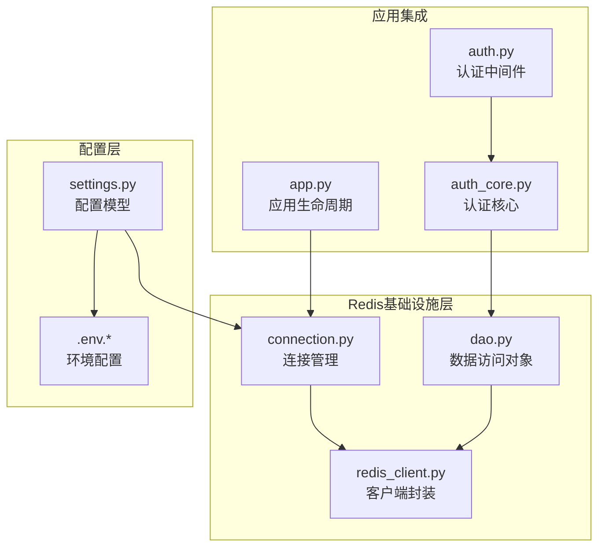
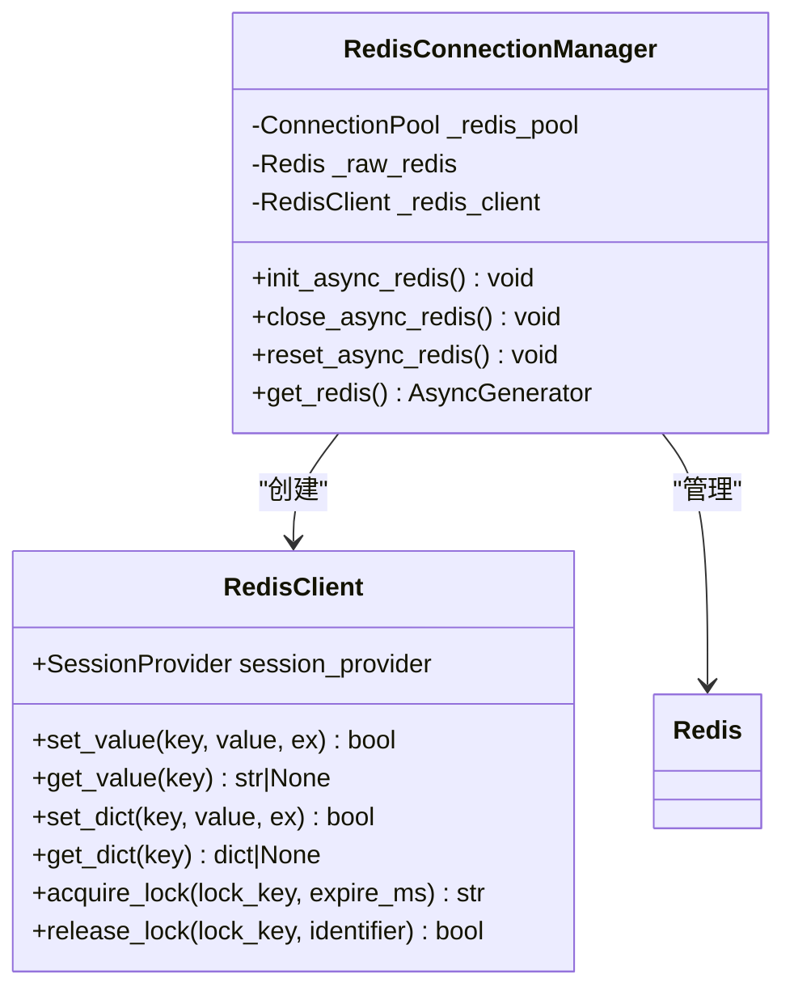
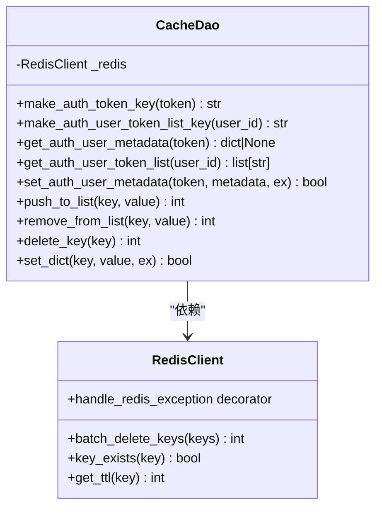
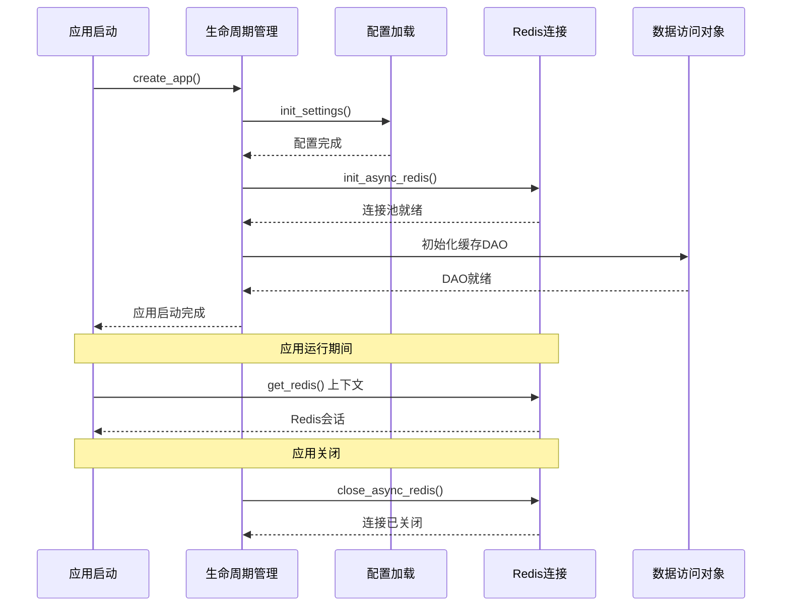
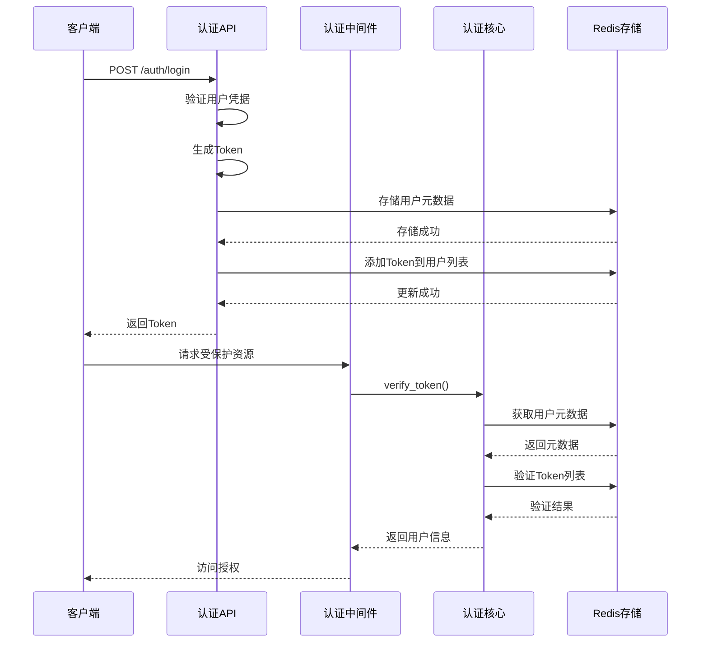
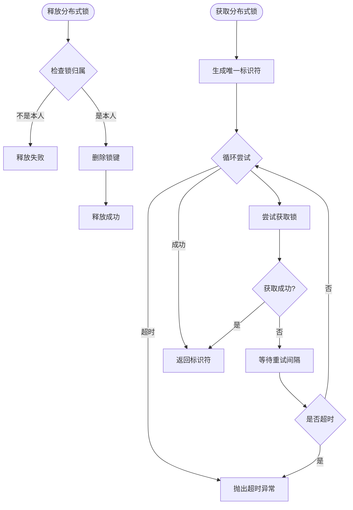
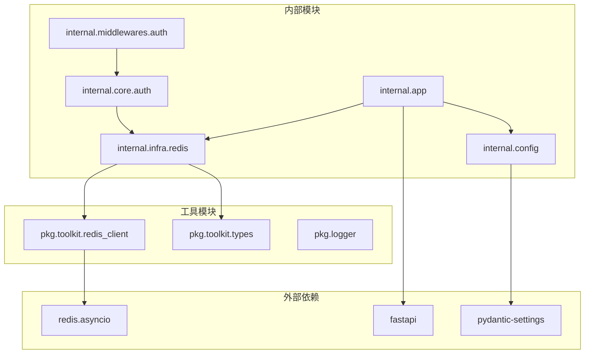

# Redis基础设施现代化

<cite>
**本文档引用的文件**
- [internal/infra/redis/connection.py](file://internal/infra/redis/connection.py)
- [internal/infra/redis/dao.py](file://internal/infra/redis/dao.py)
- [pkg/toolkit/redis_client.py](file://pkg/toolkit/redis_client.py)
- [internal/config/settings.py](file://internal/config/settings.py)
- [configs/.env.dev](file://configs/.env.dev)
- [configs/.env.prod](file://configs/.env.prod)
- [configs/.env.test](file://configs/.env.test)
- [internal/app.py](file://internal/app.py)
- [pkg/toolkit/types.py](file://pkg/toolkit/types.py)
- [internal/controllers/api/auth.py](file://internal/controllers/api/auth.py)
- [internal/middlewares/auth.py](file://internal/middlewares/auth.py)
- [internal/core/auth.py](file://internal/core/auth.py)
- [internal/infra/redis/__init__.py](file://internal/infra/redis/__init__.py)
- [docs/auth_module_guide.md](file://docs/auth_module_guide.md)
</cite>

## 目录
1. [简介](#简介)
2. [项目结构](#项目结构)
3. [核心组件](#核心组件)
4. [架构概览](#架构概览)
5. [详细组件分析](#详细组件分析)
6. [依赖关系分析](#依赖关系分析)
7. [性能考虑](#性能考虑)
8. [故障排除指南](#故障排除指南)
9. [结论](#结论)

## 简介

本项目实现了现代化的Redis基础设施，采用异步编程模型和最佳实践，构建了完整的认证系统。该系统使用Redis作为分布式缓存和认证中心，支持基于Token的认证机制，具有高可用性和可扩展性。

主要特性包括：
- 异步Redis连接池管理
- 分布式锁机制
- Token认证与会话管理
- 批量操作和原子性保证
- 安全的密码存储和加密机制

## 项目结构

项目采用分层架构设计，Redis基础设施位于`internal/infra/redis/`目录下，包含连接管理、数据访问对象和客户端封装。

**图表来源**
- [internal/infra/redis/connection.py](file://internal/infra/redis/connection.py#L1-L92)
- [internal/infra/redis/dao.py](file://internal/infra/redis/dao.py#L1-L68)
- [pkg/toolkit/redis_client.py](file://pkg/toolkit/redis_client.py#L1-L261)

**章节来源**
- [internal/infra/redis/connection.py](file://internal/infra/redis/connection.py#L1-L92)
- [internal/infra/redis/dao.py](file://internal/infra/redis/dao.py#L1-L68)
- [pkg/toolkit/redis_client.py](file://pkg/toolkit/redis_client.py#L1-L261)

## 核心组件

### Redis连接管理器

连接管理器负责Redis连接池的初始化、管理和生命周期控制，采用懒加载模式避免模块导入时的初始化问题。

**图表来源**
- [internal/infra/redis/connection.py](file://internal/infra/redis/connection.py#L19-L92)
- [pkg/toolkit/redis_client.py](file://pkg/toolkit/redis_client.py#L41-L261)

### 数据访问对象(DAO)

DAO层提供面向业务的数据操作接口，封装了常见的Redis操作模式，包括Token管理、用户元数据存储等。

**图表来源**
- [internal/infra/redis/dao.py](file://internal/infra/redis/dao.py#L9-L68)
- [pkg/toolkit/redis_client.py](file://pkg/toolkit/redis_client.py#L41-L261)

**章节来源**
- [internal/infra/redis/connection.py](file://internal/infra/redis/connection.py#L19-L92)
- [internal/infra/redis/dao.py](file://internal/infra/redis/dao.py#L9-L68)
- [pkg/toolkit/redis_client.py](file://pkg/toolkit/redis_client.py#L41-L261)

## 架构概览

系统采用异步架构设计，通过FastAPI的lifespan事件管理Redis连接的生命周期。

**图表来源**
- [internal/app.py](file://internal/app.py#L80-L107)
- [internal/infra/redis/connection.py](file://internal/infra/redis/connection.py#L32-L92)

## 详细组件分析

### 认证流程分析

系统实现了完整的Token认证流程，包括登录、验证和登出三个核心环节。

**图表来源**
- [internal/controllers/api/auth.py](file://internal/controllers/api/auth.py#L50-L96)
- [internal/middlewares/auth.py](file://internal/middlewares/auth.py#L129-L147)
- [internal/core/auth.py](file://internal/core/auth.py#L5-L24)

### 分布式锁实现

系统提供了完善的分布式锁机制，支持超时控制和自动续期功能。

**图表来源**
- [pkg/toolkit/redis_client.py](file://pkg/toolkit/redis_client.py#L200-L242)

### Redis数据结构设计

系统采用精心设计的Redis数据结构来优化性能和查询效率。

| 数据类型 | 键模式 | 值结构 | TTL策略 | 主要用途 |
|---------|--------|--------|---------|----------|
| String | `token:{token}` | JSON用户元数据 | 会话超时 | Token存储 |
| List | `token_list:{user_id}` | Token字符串数组 | 永不过期 | Token列表管理 |
| Hash | `user_profile:{user_id}` | 用户属性映射 | 按需设置 | 用户资料缓存 |
| Set | `user_roles:{user_id}` | 角色标识集合 | 永不过期 | 权限管理 |

**章节来源**
- [internal/controllers/api/auth.py](file://internal/controllers/api/auth.py#L76-L88)
- [internal/infra/redis/dao.py](file://internal/infra/redis/dao.py#L22-L27)
- [docs/auth_module_guide.md](file://docs/auth_module_guide.md#L101-L126)

## 依赖关系分析

系统采用松耦合的设计模式，各组件之间的依赖关系清晰明确。

**图表来源**
- [internal/app.py](file://internal/app.py#L1-L107)
- [internal/config/settings.py](file://internal/config/settings.py#L27-L228)
- [pkg/toolkit/redis_client.py](file://pkg/toolkit/redis_client.py#L1-L261)

**章节来源**
- [internal/app.py](file://internal/app.py#L1-L107)
- [internal/config/settings.py](file://internal/config/settings.py#L27-L228)
- [pkg/toolkit/redis_client.py](file://pkg/toolkit/redis_client.py#L1-L261)

## 性能考虑

### 连接池优化

系统实现了高效的连接池管理，支持最大连接数配置和连接复用。

### 异步操作优化

所有Redis操作都采用异步模式，避免阻塞主线程，提高并发处理能力。

### 缓存策略

- Token数据采用短TTL策略，确保安全性
- 用户列表采用长TTL或永不过期，减少查询压力
- 批量操作支持原子性，避免部分更新

## 故障排除指南

### 常见问题及解决方案

**问题1：Redis连接初始化失败**
- 检查环境变量配置
- 验证Redis服务可达性
- 查看连接池配置参数

**问题2：Token验证失败**
- 确认Token格式正确
- 检查Token是否在用户列表中
- 验证Token是否过期

**问题3：分布式锁获取超时**
- 调整超时时间和重试间隔
- 检查锁竞争情况
- 确认锁的正确释放

**章节来源**
- [internal/infra/redis/connection.py](file://internal/infra/redis/connection.py#L32-L92)
- [internal/core/auth.py](file://internal/core/auth.py#L5-L24)
- [pkg/toolkit/redis_client.py](file://pkg/toolkit/redis_client.py#L200-L242)

## 结论

本项目的Redis基础设施现代化实现了以下目标：

1. **异步化改造**：采用asyncio和异步Redis客户端，提升并发性能
2. **模块化设计**：清晰的分层架构，便于维护和扩展
3. **安全性保障**：完善的Token管理和分布式锁机制
4. **性能优化**：合理的数据结构设计和连接池管理
5. **可维护性**：标准化的错误处理和日志记录

该基础设施为整个系统的认证和缓存需求提供了可靠的技术支撑，具备良好的扩展性和稳定性。