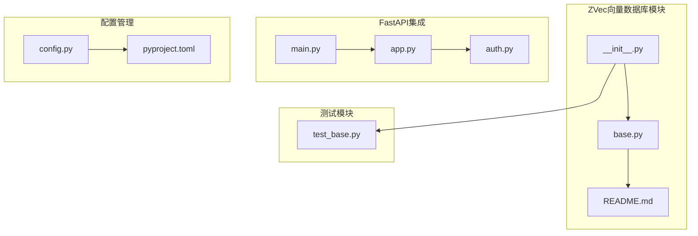
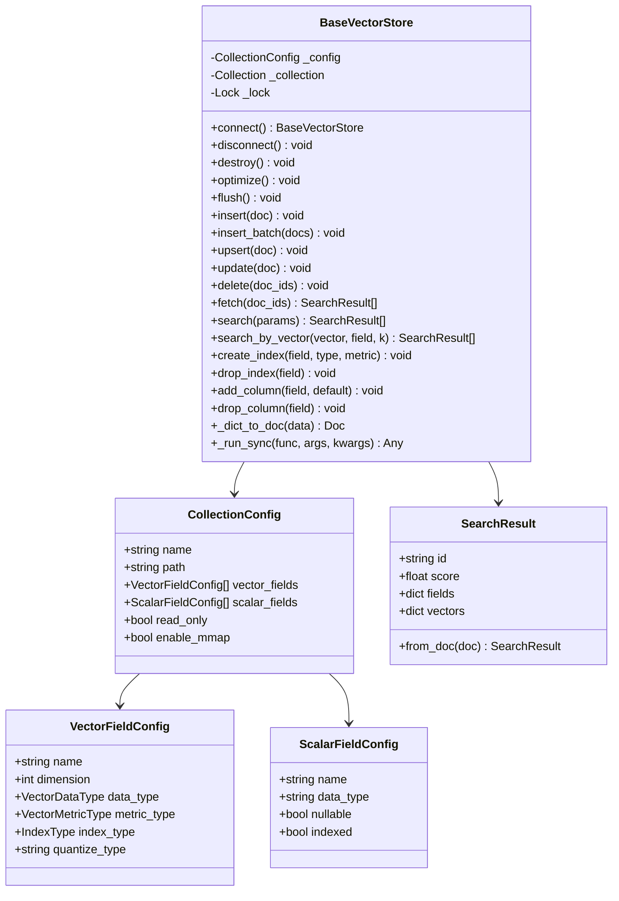
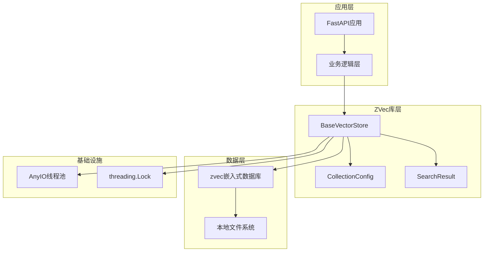
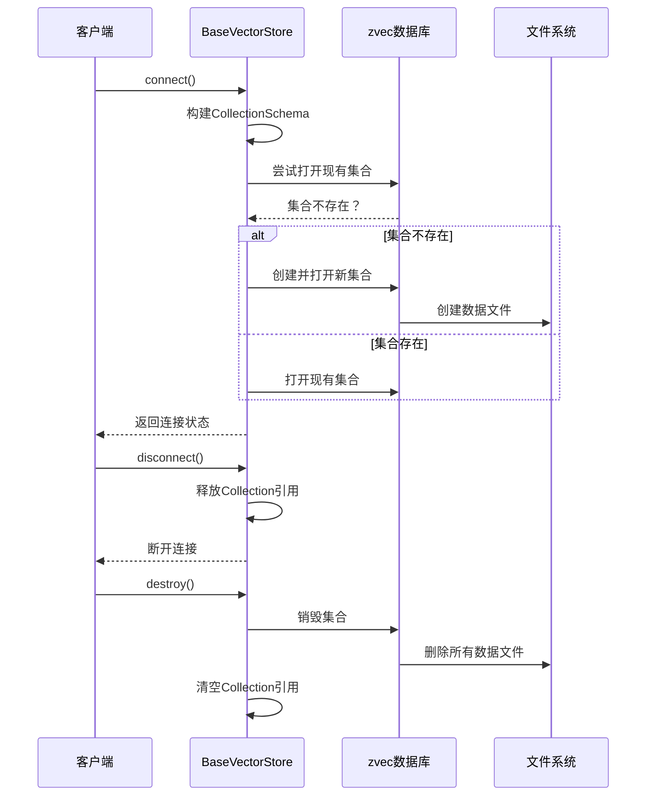
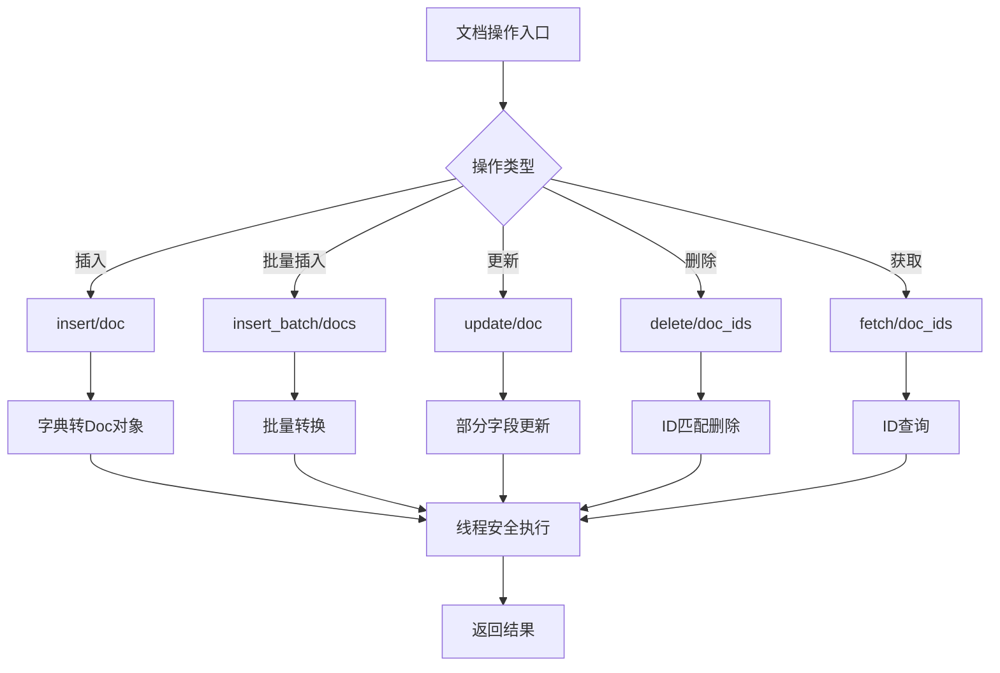
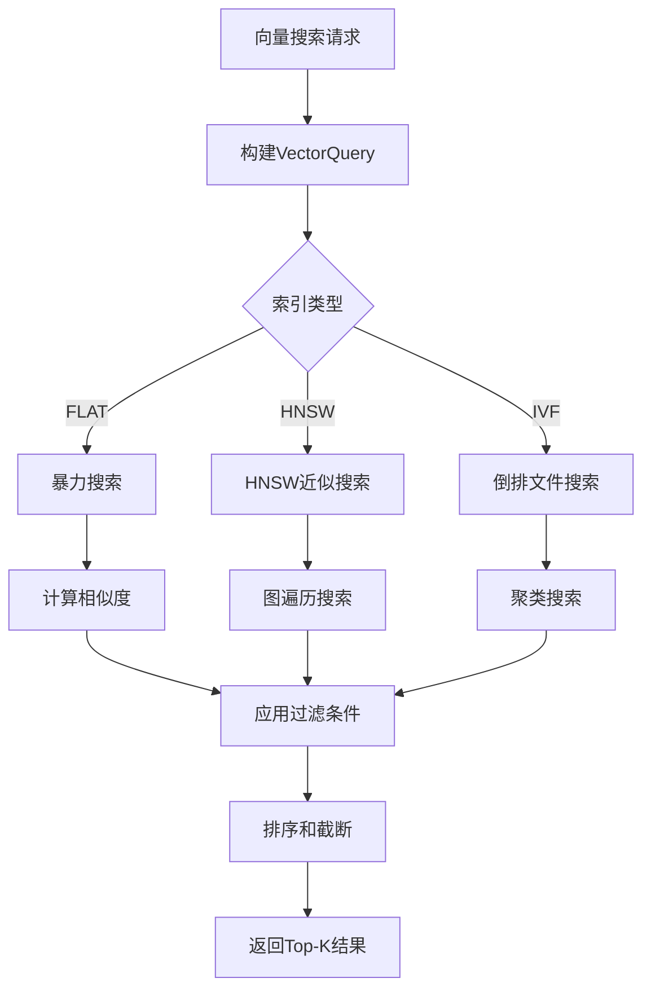
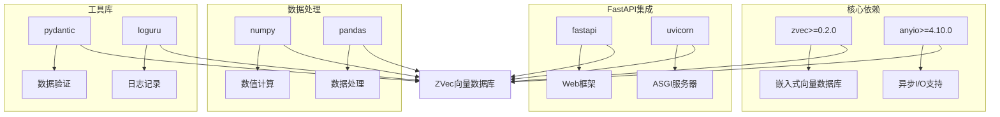
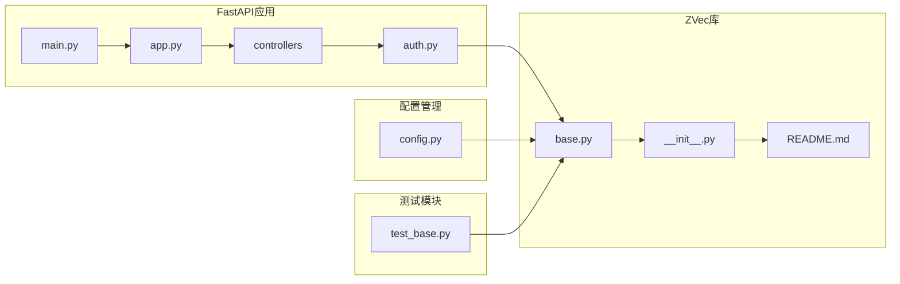

# ZVec向量数据库

<cite>
**本文档引用的文件**
- [README.md](file://pkg/zvec_vector/README.md)
- [__init__.py](file://pkg/zvec_vector/__init__.py)
- [base.py](file://pkg/zvec_vector/base.py)
- [test_base.py](file://tests/zvec_vector/test_base.py)
- [main.py](file://main.py)
- [app.py](file://internal/app.py)
- [pyproject.toml](file://pyproject.toml)
- [auth.py](file://internal/controllers/api/auth.py)
- [config.py](file://internal/config.py)
</cite>

## 目录
1. [简介](#简介)
2. [项目结构](#项目结构)
3. [核心组件](#核心组件)
4. [架构概览](#架构概览)
5. [详细组件分析](#详细组件分析)
6. [依赖关系分析](#依赖关系分析)
7. [性能考虑](#性能考虑)
8. [故障排除指南](#故障排除指南)
9. [结论](#结论)

## 简介

ZVec向量数据库是一个基于zvec嵌入式向量数据库的异步Python库，专门为FastAPI应用程序提供高性能的向量搜索和管理功能。该项目实现了完整的向量数据库操作接口，包括集合管理、文档操作、向量搜索、索引管理和Schema演进等功能。

ZVec库的核心特性包括：
- **嵌入式设计**：类似SQLite的本地文件系统存储
- **异步支持**：通过anyio.to_thread.run_sync实现异步操作
- **线程安全**：内部使用threading.Lock保证并发安全
- **灵活配置**：支持多种向量数据类型和索引策略
- **完整生命周期管理**：从创建到销毁的完整集合管理

## 项目结构

ZVec向量数据库位于项目的`pkg/zvec_vector/`目录下，采用清晰的模块化设计：

**图表来源**
- [__init__.py](file://pkg/zvec_vector/__init__.py#L1-L31)
- [base.py](file://pkg/zvec_vector/base.py#L1-L524)
- [test_base.py](file://tests/zvec_vector/test_base.py#L1-L895)

**章节来源**
- [README.md](file://pkg/zvec_vector/README.md#L1-L315)
- [__init__.py](file://pkg/zvec_vector/__init__.py#L1-L31)

## 核心组件

### BaseVectorStore类

BaseVectorStore是整个ZVec库的核心类，提供了完整的向量数据库操作接口：

**图表来源**
- [base.py](file://pkg/zvec_vector/base.py#L113-L524)

### 配置类体系

ZVec库提供了完整的配置类体系，支持灵活的集合定义：

| 配置类 | 主要属性 | 用途 |
|--------|----------|------|
| CollectionConfig | name, path, vector_fields, scalar_fields, read_only, enable_mmap | 定义集合的整体配置 |
| VectorFieldConfig | name, dimension, data_type, metric_type, index_type, quantize_type | 定义向量字段的详细配置 |
| ScalarFieldConfig | name, data_type, nullable, indexed | 定义标量字段的配置 |
| SearchParams | vector, vector_field, top_k, filter_expr, include_vectors, include_fields | 定义搜索参数 |

**章节来源**
- [base.py](file://pkg/zvec_vector/base.py#L47-L111)

## 架构概览

ZVec向量数据库采用了分层架构设计，确保了良好的可维护性和扩展性：

**图表来源**
- [base.py](file://pkg/zvec_vector/base.py#L113-L144)
- [app.py](file://internal/app.py#L16-L111)

### 异步执行机制

ZVec库通过以下机制实现异步操作：

1. **AnyIO线程池**：使用`anyio.to_thread.run_sync()`在后台线程中执行阻塞操作
2. **线程锁保护**：通过`threading.Lock`确保zvec Collection对象的线程安全
3. **上下文管理器**：支持`async with`语法进行资源管理

**章节来源**
- [base.py](file://pkg/zvec_vector/base.py#L132-L143)

## 详细组件分析

### 集合生命周期管理

BaseVectorStore提供了完整的集合生命周期管理功能：

**图表来源**
- [base.py](file://pkg/zvec_vector/base.py#L216-L257)

### 文档操作流程

ZVec库支持完整的文档CRUD操作：

**图表来源**
- [base.py](file://pkg/zvec_vector/base.py#L271-L353)

**章节来源**
- [base.py](file://pkg/zvec_vector/base.py#L271-L353)

### 向量搜索算法

ZVec库支持多种向量搜索策略：

**图表来源**
- [base.py](file://pkg/zvec_vector/base.py#L359-L406)

**章节来源**
- [base.py](file://pkg/zvec_vector/base.py#L359-L406)

## 依赖关系分析

### 外部依赖

ZVec向量数据库主要依赖于以下外部库：

**图表来源**
- [pyproject.toml](file://pyproject.toml#L9-L71)

### 内部模块依赖

ZVec库与FastAPI应用的集成关系：

**图表来源**
- [main.py](file://main.py#L1-L4)
- [app.py](file://internal/app.py#L16-L111)
- [auth.py](file://internal/controllers/api/auth.py#L1-L299)

**章节来源**
- [pyproject.toml](file://pyproject.toml#L9-L71)

## 性能考虑

### 索引策略选择

ZVec库提供了三种不同的索引策略，适用于不同的使用场景：

| 索引类型 | 优点 | 缺点 | 适用场景 |
|----------|------|------|----------|
| FLAT | 精确搜索，无索引开销 | 搜索速度慢，内存占用大 | 小规模数据集（< 10K） |
| HNSW | 高性能近似搜索，内存友好 | 略有精度损失 | 大多数应用场景 |
| IVF | 大规模数据高效搜索 | 配置复杂，需要额外内存 | 超大规模数据集（> 1M） |

### 线程安全机制

为了确保在异步环境中的安全性，ZVec库采用了双重保护机制：

1. **线程锁保护**：每个BaseVectorStore实例都有独立的threading.Lock
2. **线程池隔离**：所有zvec操作都在独立的线程池中执行

### 内存管理

- **内存映射**：默认启用enable_mmap，减少内存占用
- **批量操作**：支持批量插入和批量更新，减少I/O次数
- **资源清理**：通过上下文管理器自动清理资源

## 故障排除指南

### 常见问题及解决方案

#### 1. 集合连接失败

**问题描述**：连接zvec集合时抛出异常

**可能原因**：
- 集合路径权限不足
- 数据文件损坏
- 磁盘空间不足

**解决方案**：
- 检查集合路径的读写权限
- 验证数据文件完整性
- 清理磁盘空间

#### 2. 线程安全警告

**问题描述**：并发访问时出现数据竞争

**解决方案**：
- 确保使用BaseVectorStore的线程安全方法
- 避免直接访问底层zvec Collection对象
- 使用上下文管理器管理连接生命周期

#### 3. 搜索结果异常

**问题描述**：向量搜索返回意外结果

**可能原因**：
- 索引配置不当
- 向量维度不匹配
- 过滤条件语法错误

**解决方案**：
- 检查VectorFieldConfig的dimension设置
- 验证向量数据格式
- 使用正确的过滤表达式语法

**章节来源**
- [base.py](file://pkg/zvec_vector/base.py#L132-L143)
- [test_base.py](file://tests/zvec_vector/test_base.py#L345-L351)

### 调试技巧

1. **启用详细日志**：在配置中设置DEBUG模式
2. **检查集合状态**：使用`store.stats`查看集合统计信息
3. **验证数据格式**：确保插入的数据符合配置要求
4. **监控内存使用**：定期检查内存映射状态

## 结论

ZVec向量数据库是一个设计精良的嵌入式向量数据库解决方案，具有以下优势：

1. **易用性**：提供了简洁的API接口，易于集成到FastAPI应用中
2. **性能**：支持多种索引策略，可根据需求选择最优方案
3. **可靠性**：完善的错误处理和资源管理机制
4. **扩展性**：支持Schema演进和灵活的配置选项

通过合理的索引策略选择和配置优化，ZVec库能够满足从原型开发到生产部署的各种需求。其异步设计和线程安全机制确保了在高并发场景下的稳定表现。

对于需要向量搜索功能的应用程序，ZVec库提供了一个可靠、高效的解决方案，特别适合需要本地存储和快速部署的场景。