# 全局错误管理

<cite>
**本文档引用的文件**
- [internal/core/errors.py](file://internal/core/errors.py)
- [internal/core/exception.py](file://internal/core/exception.py)
- [pkg/toolkit/response.py](file://pkg/toolkit/response.py)
- [internal/middlewares/recorder.py](file://internal/middlewares/recorder.py)
- [internal/middlewares/auth.py](file://internal/middlewares/auth.py)
- [pkg/toolkit/context.py](file://pkg/toolkit/context.py)
- [pkg/toolkit/exc.py](file://pkg/toolkit/exc.py)
- [pkg/logger/handler.py](file://pkg/logger/handler.py)
- [internal/app.py](file://internal/app.py)
- [main.py](file://main.py)
- [internal/controllers/api/auth.py](file://internal/controllers/api/auth.py)
- [internal/controllers/api/user.py](file://internal/controllers/api/user.py)
</cite>

## 目录
1. [简介](#简介)
2. [项目结构](#项目结构)
3. [核心组件](#核心组件)
4. [架构概览](#架构概览)
5. [详细组件分析](#详细组件分析)
6. [依赖关系分析](#依赖关系分析)
7. [性能考虑](#性能考虑)
8. [故障排除指南](#故障排除指南)
9. [结论](#结论)

## 简介

本项目实现了完善的全局错误管理系统，采用分层设计模式，通过统一的错误码定义、异常处理机制和中间件拦截来确保错误处理的一致性和可维护性。系统支持业务异常、验证异常和意外异常的分类处理，并提供详细的日志记录和追踪功能。

## 项目结构

项目采用模块化组织方式，错误管理相关的核心文件分布如下：

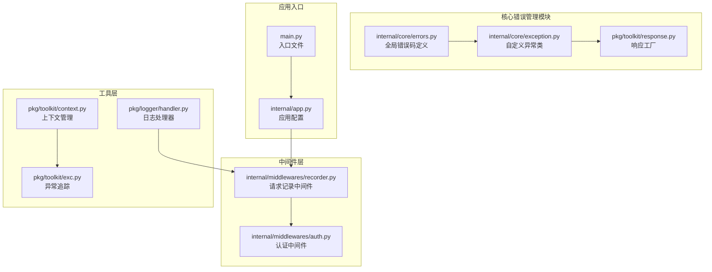

**图表来源**
- [internal/core/errors.py](file://internal/core/errors.py#L1-L58)
- [internal/core/exception.py](file://internal/core/exception.py#L1-L17)
- [pkg/toolkit/response.py](file://pkg/toolkit/response.py#L1-L237)
- [internal/middlewares/recorder.py](file://internal/middlewares/recorder.py#L1-L148)
- [internal/middlewares/auth.py](file://internal/middlewares/auth.py#L1-L148)
- [pkg/toolkit/context.py](file://pkg/toolkit/context.py#L1-L122)
- [pkg/toolkit/exc.py](file://pkg/toolkit/exc.py#L1-L16)
- [pkg/logger/handler.py](file://pkg/logger/handler.py#L1-L461)
- [internal/app.py](file://internal/app.py#L1-L111)
- [main.py](file://main.py#L1-L4)

**章节来源**
- [internal/core/errors.py](file://internal/core/errors.py#L1-L58)
- [internal/core/exception.py](file://internal/core/exception.py#L1-L17)
- [pkg/toolkit/response.py](file://pkg/toolkit/response.py#L1-L237)
- [internal/middlewares/recorder.py](file://internal/middlewares/recorder.py#L1-L148)
- [internal/middlewares/auth.py](file://internal/middlewares/auth.py#L1-L148)
- [pkg/toolkit/context.py](file://pkg/toolkit/context.py#L1-L122)
- [pkg/toolkit/exc.py](file://pkg/toolkit/exc.py#L1-L16)
- [pkg/logger/handler.py](file://pkg/logger/handler.py#L1-L461)
- [internal/app.py](file://internal/app.py#L1-L111)
- [main.py](file://main.py#L1-L4)

## 核心组件

### 错误码定义系统

系统实现了统一的错误码管理机制，通过`GlobalErrors`类集中定义所有可用的错误码：

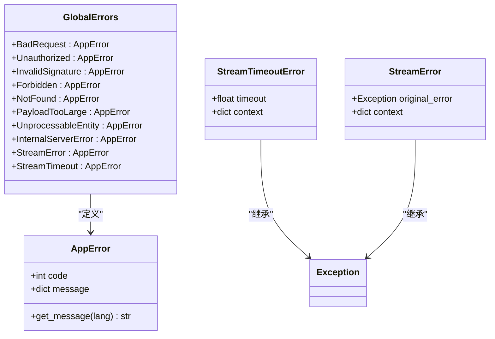

**图表来源**
- [internal/core/errors.py](file://internal/core/errors.py#L8-L58)

### 自定义异常处理

`AppException`类提供了灵活的异常处理机制，支持任意HTTP状态码：

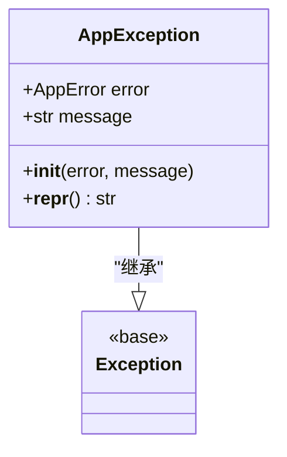

**图表来源**
- [internal/core/exception.py](file://internal/core/exception.py#L4-L17)

### 响应工厂模式

`_ResponseFactory`实现了统一的响应构建机制：

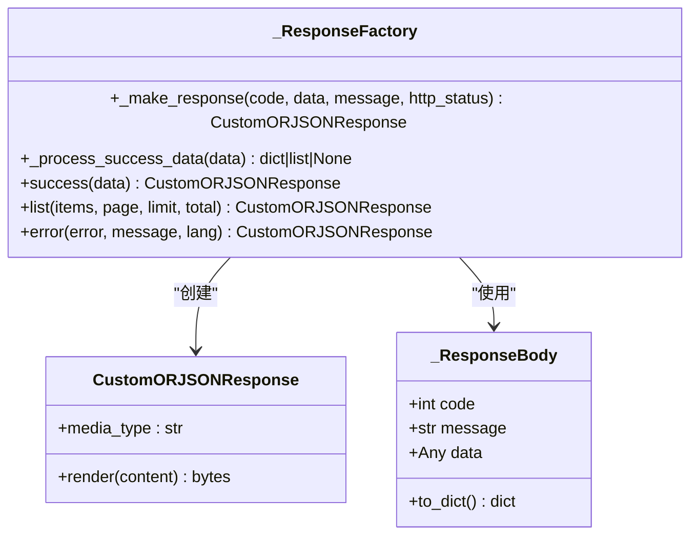

**图表来源**
- [pkg/toolkit/response.py](file://pkg/toolkit/response.py#L88-L203)

**章节来源**
- [internal/core/errors.py](file://internal/core/errors.py#L1-L58)
- [internal/core/exception.py](file://internal/core/exception.py#L1-L17)
- [pkg/toolkit/response.py](file://pkg/toolkit/response.py#L1-L237)

## 架构概览

系统采用中间件拦截和异常处理相结合的架构模式：

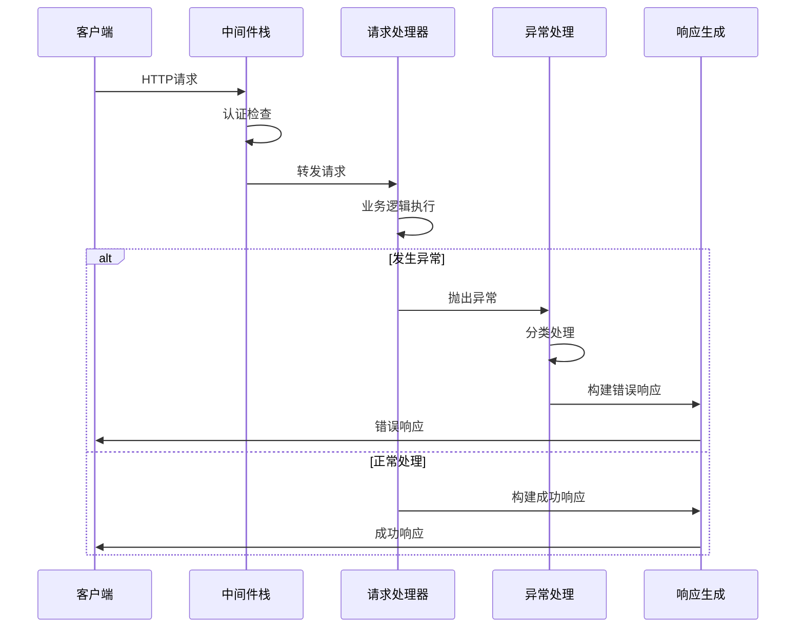

**图表来源**
- [internal/middlewares/recorder.py](file://internal/middlewares/recorder.py#L105-L148)
- [internal/middlewares/auth.py](file://internal/middlewares/auth.py#L89-L148)

### 错误处理流程

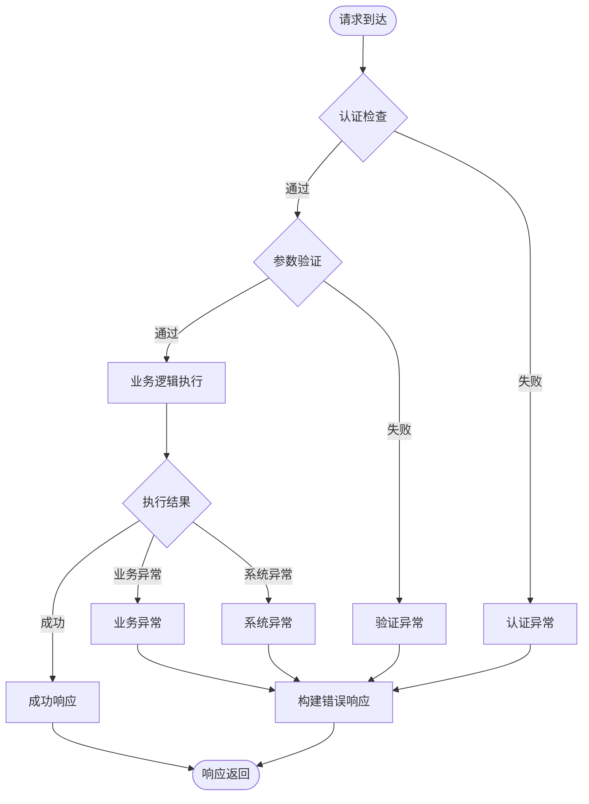

**图表来源**
- [internal/middlewares/recorder.py](file://internal/middlewares/recorder.py#L87-L104)
- [internal/middlewares/auth.py](file://internal/middlewares/auth.py#L129-L147)

**章节来源**
- [internal/middlewares/recorder.py](file://internal/middlewares/recorder.py#L1-L148)
- [internal/middlewares/auth.py](file://internal/middlewares/auth.py#L1-L148)

## 详细组件分析

### 认证中间件错误处理

认证中间件实现了多层次的认证策略：

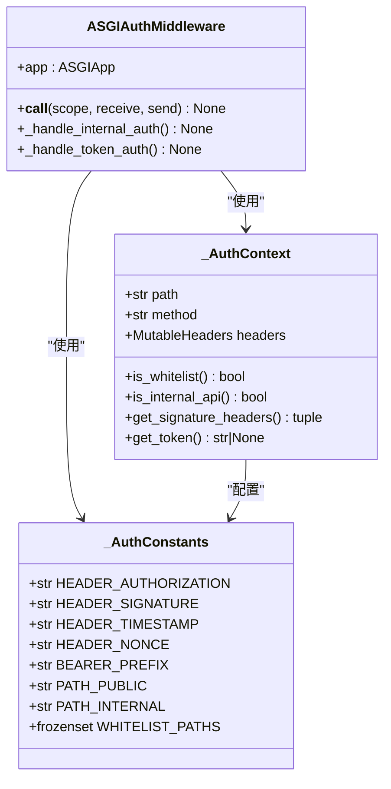

**图表来源**
- [internal/middlewares/auth.py](file://internal/middlewares/auth.py#L85-L148)

认证流程包括三个主要阶段：

1. **白名单放行**：对公开API和特殊路径直接放行
2. **内部接口签名认证**：对内部API进行签名验证
3. **Token认证**：对普通API进行JWT Token验证

**章节来源**
- [internal/middlewares/auth.py](file://internal/middlewares/auth.py#L1-L148)

### 请求记录中间件

请求记录中间件负责全局异常捕获和统一错误响应：

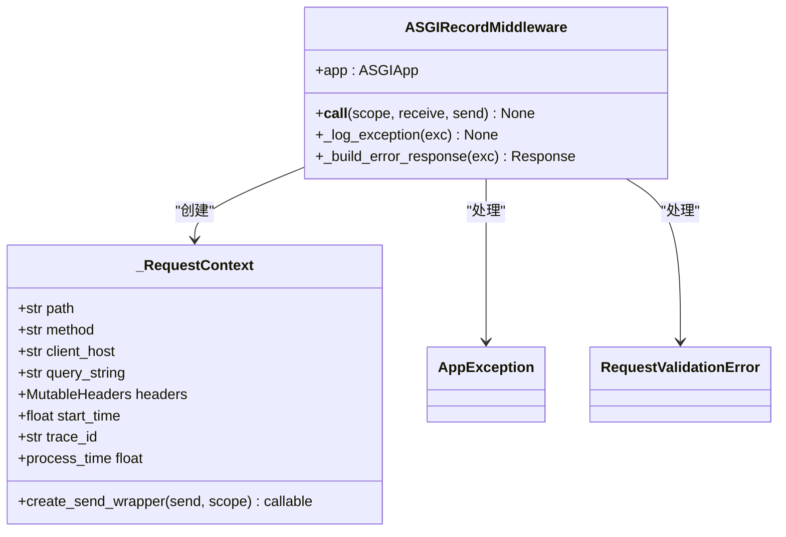

**图表来源**
- [internal/middlewares/recorder.py](file://internal/middlewares/recorder.py#L68-L148)

中间件的关键特性：

1. **统一异常捕获**：在整个请求处理流程中捕获所有异常
2. **分类日志记录**：根据异常类型使用不同的日志级别
3. **智能错误响应**：根据异常类型生成相应的错误响应
4. **追踪ID管理**：为每个请求生成唯一的追踪ID

**章节来源**
- [internal/middlewares/recorder.py](file://internal/middlewares/recorder.py#L1-L148)

### 上下文管理

系统使用`contextvars`实现线程安全的请求上下文管理：

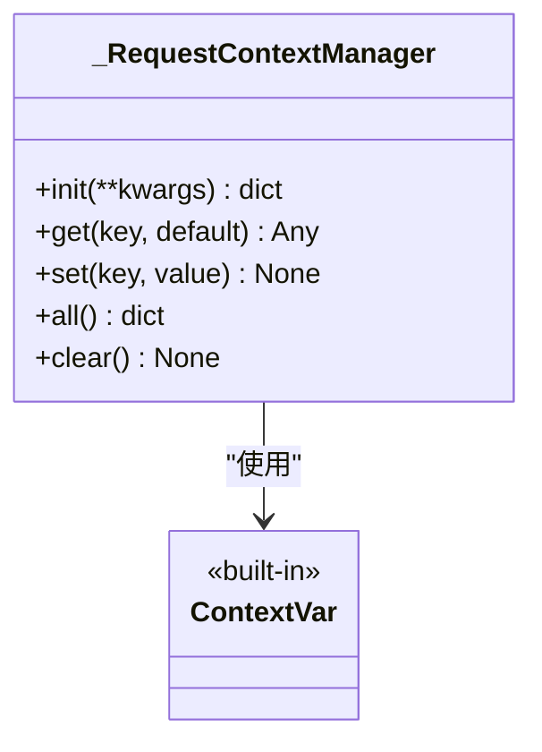

**图表来源**
- [pkg/toolkit/context.py](file://pkg/toolkit/context.py#L7-L58)

上下文管理器支持的功能：

1. **请求生命周期管理**：在请求开始时初始化，在结束时清理
2. **用户ID存储**：存储认证用户的ID信息
3. **追踪ID管理**：管理请求的唯一标识符
4. **线程安全**：使用`contextvars`确保多线程环境下的数据隔离

**章节来源**
- [pkg/toolkit/context.py](file://pkg/toolkit/context.py#L1-L122)

### 日志系统集成

日志系统与错误管理深度集成：

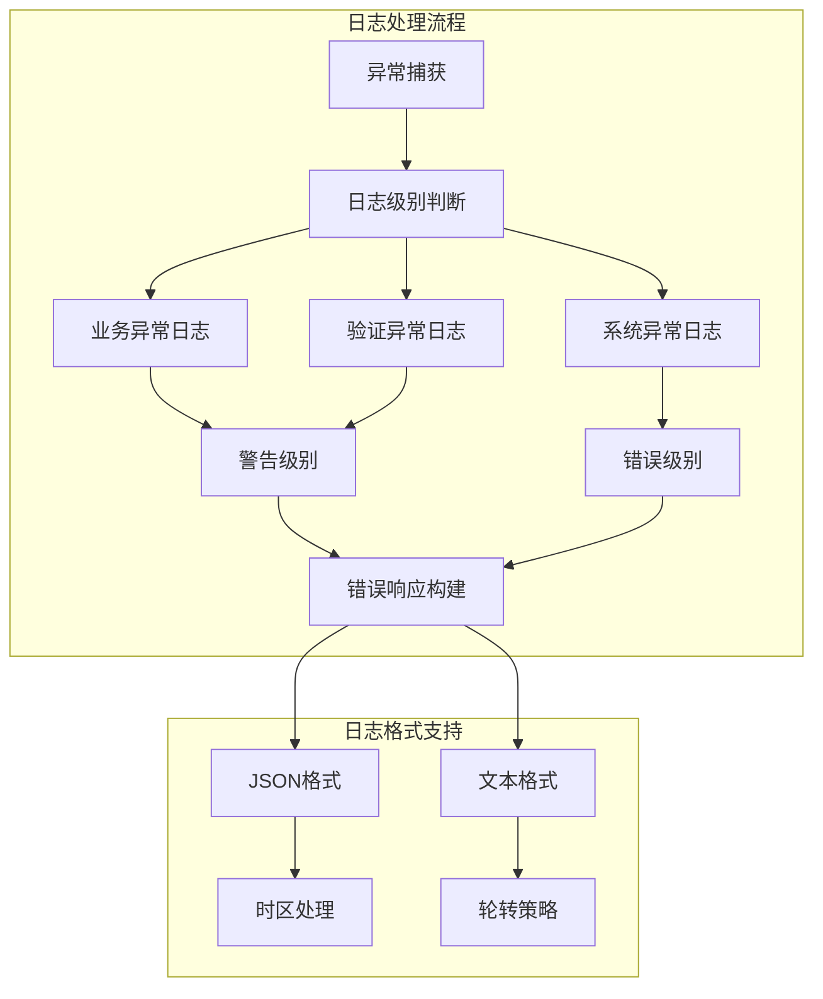

**图表来源**
- [pkg/logger/handler.py](file://pkg/logger/handler.py#L23-L461)
- [pkg/toolkit/exc.py](file://pkg/toolkit/exc.py#L1-L16)

**章节来源**
- [pkg/logger/handler.py](file://pkg/logger/handler.py#L1-L461)
- [pkg/toolkit/exc.py](file://pkg/toolkit/exc.py#L1-L16)

## 依赖关系分析

系统各组件之间的依赖关系如下：

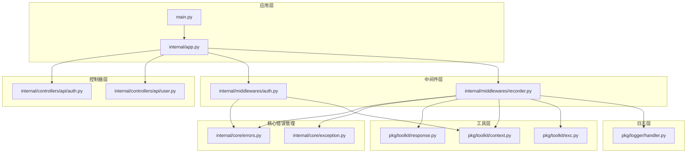

**图表来源**
- [main.py](file://main.py#L1-L4)
- [internal/app.py](file://internal/app.py#L1-L111)
- [internal/controllers/api/auth.py](file://internal/controllers/api/auth.py#L1-L299)
- [internal/controllers/api/user.py](file://internal/controllers/api/user.py#L1-L17)
- [internal/middlewares/auth.py](file://internal/middlewares/auth.py#L1-L148)
- [internal/middlewares/recorder.py](file://internal/middlewares/recorder.py#L1-L148)
- [internal/core/errors.py](file://internal/core/errors.py#L1-L58)
- [internal/core/exception.py](file://internal/core/exception.py#L1-L17)
- [pkg/toolkit/response.py](file://pkg/toolkit/response.py#L1-L237)
- [pkg/toolkit/context.py](file://pkg/toolkit/context.py#L1-L122)
- [pkg/toolkit/exc.py](file://pkg/toolkit/exc.py#L1-L16)
- [pkg/logger/handler.py](file://pkg/logger/handler.py#L1-L461)

**章节来源**
- [main.py](file://main.py#L1-L4)
- [internal/app.py](file://internal/app.py#L1-L111)

## 性能考虑

系统在设计时充分考虑了性能优化：

### 异步处理优化
- 使用`asynccontextmanager`管理应用生命周期
- 异步数据库连接和Redis连接
- AnyIO任务管理器的异步任务处理

### 内存管理
- 上下文变量的正确清理机制
- 中间件包装器的及时释放
- 日志缓冲区的合理配置

### 网络优化
- GZip压缩中间件减少响应大小
- 连接池管理数据库连接
- Redis连接复用

## 故障排除指南

### 常见错误类型及处理

1. **认证失败**
   - 检查Token格式和有效期
   - 验证签名算法和参数
   - 确认用户ID格式正确

2. **参数验证错误**
   - 查看具体的验证错误信息
   - 检查请求格式和数据类型
   - 确认必填字段完整

3. **业务逻辑异常**
   - 查看业务异常的具体原因
   - 检查相关服务的状态
   - 验证外部依赖的可用性

### 调试技巧

1. **启用详细日志**
   ```python
   # 在配置中设置调试模式
   settings.DEBUG = True
   ```

2. **使用追踪ID定位问题**
   - 检查响应头中的`X-Trace-ID`
   - 在日志中搜索对应的追踪ID
   - 分析完整的请求链路

3. **异常堆栈分析**
   - 使用`get_business_exec_tb()`获取业务异常堆栈
   - 使用`get_unexpected_exec_tb()`获取系统异常堆栈
   - 分析异常发生的具体位置

**章节来源**
- [pkg/toolkit/exc.py](file://pkg/toolkit/exc.py#L1-L16)
- [internal/middlewares/recorder.py](file://internal/middlewares/recorder.py#L73-L86)

## 结论

本项目的全局错误管理系统具有以下特点：

1. **统一性**：通过集中定义的错误码和统一的响应格式，确保错误处理的一致性
2. **可扩展性**：模块化的架构设计便于添加新的错误类型和处理逻辑
3. **可观测性**：完整的日志记录和追踪机制，便于问题诊断和性能监控
4. **可靠性**：多层次的异常处理和恢复机制，提高系统的稳定性

系统通过中间件拦截、异常分类处理和统一响应构建，实现了高效可靠的错误管理机制，为后续的功能扩展和维护奠定了坚实的基础。