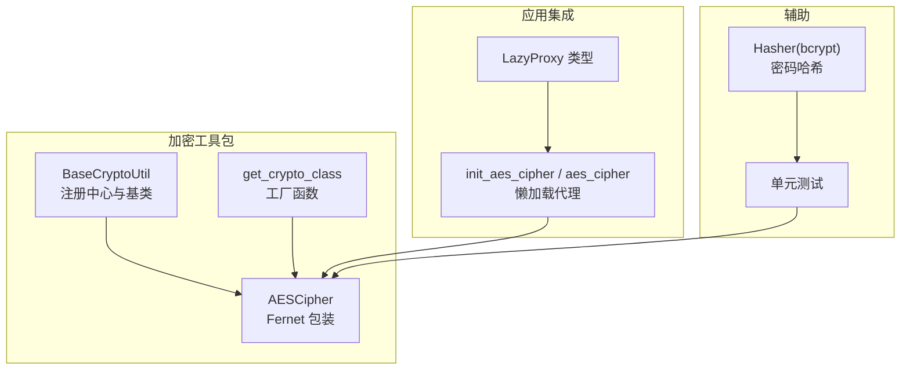
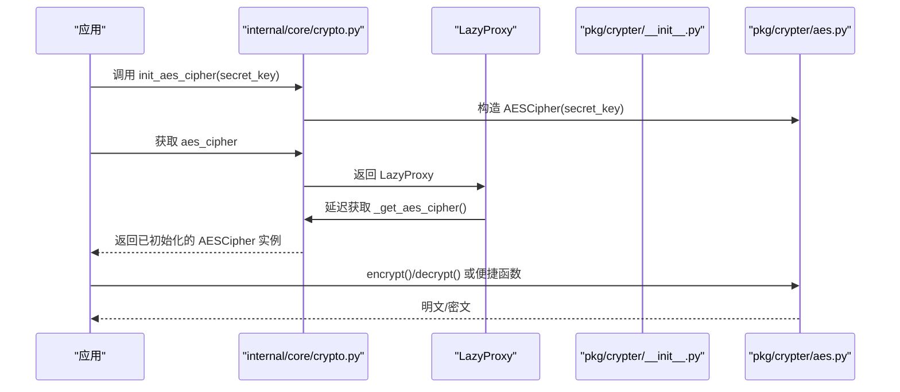
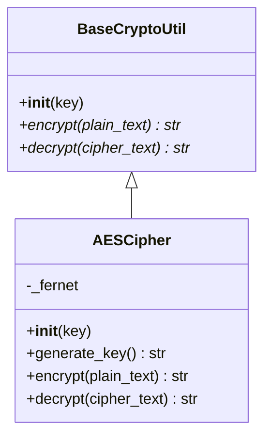
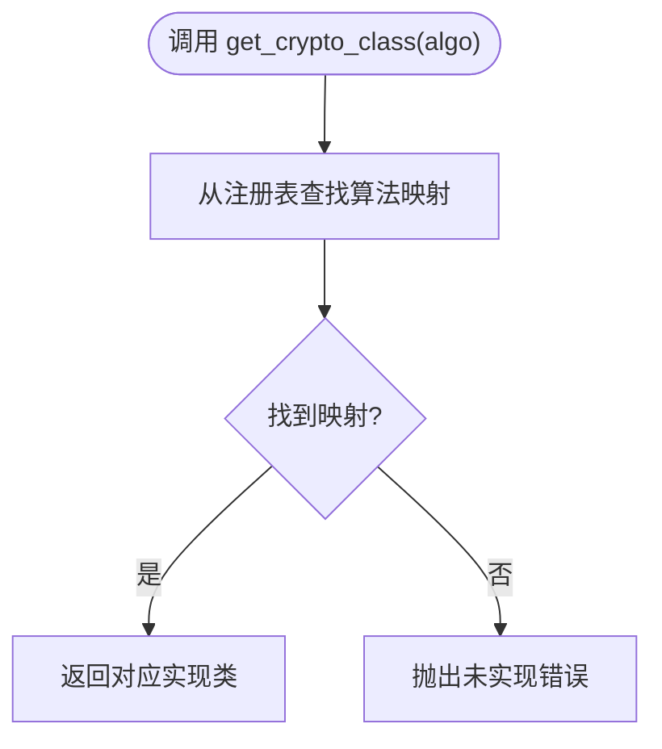
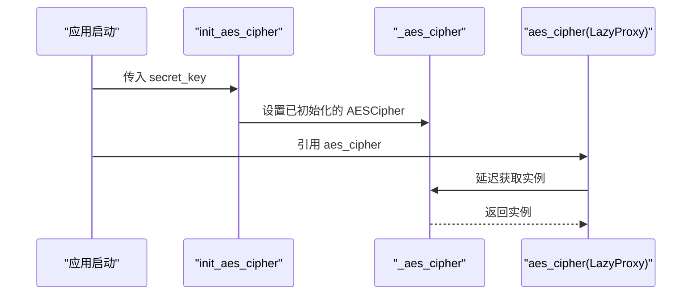
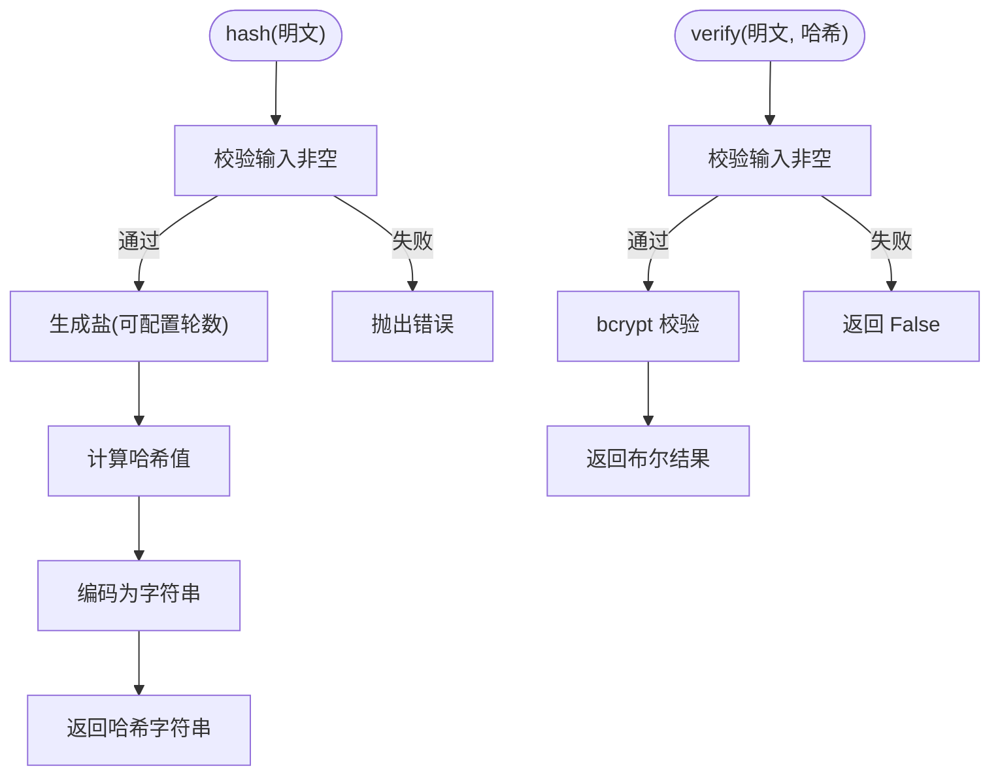
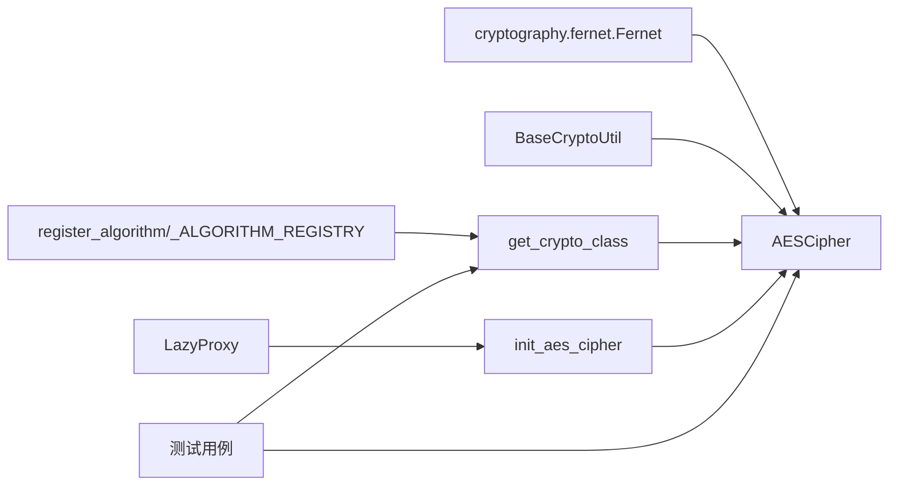

# 加密工具

<cite>
**本文引用的文件**
- [pkg/crypter/aes.py](file://pkg/crypter/aes.py)
- [pkg/crypter/base.py](file://pkg/crypter/base.py)
- [pkg/crypter/__init__.py](file://pkg/crypter/__init__.py)
- [internal/core/crypto.py](file://internal/core/crypto.py)
- [pkg/toolkit/hasher.py](file://pkg/toolkit/hasher.py)
- [tests/toolkit/test_crypto.py](file://tests/toolkit/test_crypto.py)
- [pkg/toolkit/types.py](file://pkg/toolkit/types.py)
- [configs/.env.dev](file://configs/.env.dev)
- [configs/.env.prod](file://configs/.env.prod)
</cite>

## 目录
1. [简介](#简介)
2. [项目结构](#项目结构)
3. [核心组件](#核心组件)
4. [架构总览](#架构总览)
5. [详细组件分析](#详细组件分析)
6. [依赖关系分析](#依赖关系分析)
7. [性能与安全考量](#性能与安全考量)
8. [故障排查指南](#故障排查指南)
9. [结论](#结论)
10. [附录](#附录)

## 简介
本文件系统化梳理并文档化本项目的加密工具包，重点覆盖基于对称加密的 AES 实现（Fernet 包装）、密钥管理、初始化与懒加载、便捷函数、以及密码哈希方案。文档同时给出使用示例、安全最佳实践、常见陷阱、算法选择建议与性能注意事项，并提供兼容性与调试技巧。

## 项目结构
加密工具包位于 pkg/crypter，核心模块包括：
- 基类与注册中心：pkg/crypter/base.py
- AES 实现：pkg/crypter/aes.py
- 工厂与注册导出：pkg/crypter/__init__.py
- 应用级懒加载与初始化：internal/core/crypto.py
- 密码哈希（bcrypt）：pkg/toolkit/hasher.py
- 测试用例：tests/toolkit/test_crypto.py
- 懒加载代理类型定义：pkg/toolkit/types.py
- 环境变量示例：configs/.env.dev、configs/.env.prod

图表来源
- [pkg/crypter/base.py](file://pkg/crypter/base.py#L1-L39)
- [pkg/crypter/aes.py](file://pkg/crypter/aes.py#L1-L59)
- [pkg/crypter/__init__.py](file://pkg/crypter/__init__.py#L1-L29)
- [internal/core/crypto.py](file://internal/core/crypto.py#L1-L19)
- [pkg/toolkit/hasher.py](file://pkg/toolkit/hasher.py#L1-L45)
- [tests/toolkit/test_crypto.py](file://tests/toolkit/test_crypto.py#L1-L211)
- [pkg/toolkit/types.py](file://pkg/toolkit/types.py#L205-L244)

章节来源
- [pkg/crypter/aes.py](file://pkg/crypter/aes.py#L1-L59)
- [pkg/crypter/base.py](file://pkg/crypter/base.py#L1-L39)
- [pkg/crypter/__init__.py](file://pkg/crypter/__init__.py#L1-L29)
- [internal/core/crypto.py](file://internal/core/crypto.py#L1-L19)
- [pkg/toolkit/hasher.py](file://pkg/toolkit/hasher.py#L1-L45)
- [tests/toolkit/test_crypto.py](file://tests/toolkit/test_crypto.py#L1-L211)
- [pkg/toolkit/types.py](file://pkg/toolkit/types.py#L205-L244)

## 核心组件
- AESCipher：基于 Fernet 的对称加密实现，负责密钥解析、加密、解密与密钥生成；支持字符串与字节两种密钥输入形式。
- BaseCryptoUtil：抽象基类，约束所有加密实现必须具备的接口与最小校验（如密钥非空）。
- EncryptionAlgorithm：算法枚举，当前包含 AES；预留扩展（如 SM4）。
- register_algorithm：装饰器，将具体算法实现注册到全局注册表。
- get_crypto_class：根据算法枚举返回对应实现类，便于业务层按需获取。
- init_aes_cipher / aes_cipher：应用级初始化与懒加载代理，避免模块导入时未初始化问题。
- Hasher：基于 bcrypt 的密码哈希与校验工具，支持自定义迭代轮数，异步接口通过线程池执行同步逻辑。

章节来源
- [pkg/crypter/aes.py](file://pkg/crypter/aes.py#L1-L59)
- [pkg/crypter/base.py](file://pkg/crypter/base.py#L1-L39)
- [pkg/crypter/__init__.py](file://pkg/crypter/__init__.py#L1-L29)
- [internal/core/crypto.py](file://internal/core/crypto.py#L1-L19)
- [pkg/toolkit/hasher.py](file://pkg/toolkit/hasher.py#L1-L45)

## 架构总览
下图展示从应用层到加密工具包的整体交互路径，包括初始化、懒加载、工厂获取与具体实现调用。

图表来源
- [internal/core/crypto.py](file://internal/core/crypto.py#L1-L19)
- [pkg/crypter/__init__.py](file://pkg/crypter/__init__.py#L1-L29)
- [pkg/crypter/aes.py](file://pkg/crypter/aes.py#L1-L59)

## 详细组件分析

### AESCipher 组件
- 设计要点
  - 基于 Fernet 的对称加密，内部自动处理随机 IV 与完整性校验（HMAC），保证机密性与抗篡改。
  - 支持字符串与字节两种密钥输入，自动进行编码转换。
  - 提供静态方法生成符合要求的密钥（url-safe base64 编码，长度满足 Fernet 要求）。
  - 便捷函数 aes_encrypt/aes_decrypt/aes_generate_key，便于快速使用。
- 错误处理
  - 非法密钥或空密钥抛出明确错误信息，提示密钥格式与生成方式。
  - 解密失败（令牌无效/密钥错误）抛出明确错误，便于上层区分。
- 数据流
  - 明文字符串经 UTF-8 编码后加密，返回 UTF-8 编码的密文字符串；解密流程相反。
  - 空字符串输入返回空字符串，避免额外分支。

图表来源
- [pkg/crypter/base.py](file://pkg/crypter/base.py#L26-L38)
- [pkg/crypter/aes.py](file://pkg/crypter/aes.py#L7-L44)

章节来源
- [pkg/crypter/aes.py](file://pkg/crypter/aes.py#L1-L59)
- [pkg/crypter/base.py](file://pkg/crypter/base.py#L1-L39)

### 注册与工厂
- register_algorithm：将具体算法类注册到全局注册表，确保 get_crypto_class 可按枚举返回正确实现。
- get_crypto_class：根据算法枚举返回对应类，若未注册则抛出未实现错误，便于扩展新算法。

图表来源
- [pkg/crypter/__init__.py](file://pkg/crypter/__init__.py#L17-L28)
- [pkg/crypter/base.py](file://pkg/crypter/base.py#L11-L23)

章节来源
- [pkg/crypter/__init__.py](file://pkg/crypter/__init__.py#L1-L29)
- [pkg/crypter/base.py](file://pkg/crypter/base.py#L1-L39)

### 应用级懒加载与初始化
- init_aes_cipher：在应用启动阶段完成密钥解析与实例化，避免后续运行时重复开销。
- aes_cipher：LazyProxy 包装，首次访问时才真正获取实例，未初始化时抛出运行时错误，防止误用。

图表来源
- [internal/core/crypto.py](file://internal/core/crypto.py#L7-L18)
- [pkg/toolkit/types.py](file://pkg/toolkit/types.py#L205-L244)

章节来源
- [internal/core/crypto.py](file://internal/core/crypto.py#L1-L19)
- [pkg/toolkit/types.py](file://pkg/toolkit/types.py#L205-L244)

### 密码哈希（bcrypt）
- Hasher：封装 bcrypt 的盐生成与哈希计算，支持自定义迭代轮数；提供异步接口，内部通过线程池执行同步逻辑。
- 接口约定：空明文或空哈希返回 False；异常输入统一返回 False，避免泄露细节。

图表来源
- [pkg/toolkit/hasher.py](file://pkg/toolkit/hasher.py#L5-L44)

章节来源
- [pkg/toolkit/hasher.py](file://pkg/toolkit/hasher.py#L1-L45)

## 依赖关系分析
- AESCipher 依赖 cryptography.fernet.Fernet 完成加解密与完整性校验。
- BaseCryptoUtil 作为抽象基类，约束实现类的接口与最小校验。
- register_algorithm 与 _ALGORITHM_REGISTRY 构成注册中心，get_crypto_class 作为工厂入口。
- internal/core/crypto.py 通过 LazyProxy 与应用生命周期耦合，避免导入时未初始化。
- tests/toolkit/test_crypto.py 覆盖 AES 与工厂行为，验证密钥生成、加解密往返、错误处理与完整性校验。

图表来源
- [pkg/crypter/aes.py](file://pkg/crypter/aes.py#L1-L3)
- [pkg/crypter/base.py](file://pkg/crypter/base.py#L14-L23)
- [pkg/crypter/__init__.py](file://pkg/crypter/__init__.py#L17-L28)
- [internal/core/crypto.py](file://internal/core/crypto.py#L7-L18)
- [tests/toolkit/test_crypto.py](file://tests/toolkit/test_crypto.py#L1-L211)

章节来源
- [pkg/crypter/aes.py](file://pkg/crypter/aes.py#L1-L59)
- [pkg/crypter/base.py](file://pkg/crypter/base.py#L1-L39)
- [pkg/crypter/__init__.py](file://pkg/crypter/__init__.py#L1-L29)
- [internal/core/crypto.py](file://internal/core/crypto.py#L1-L19)
- [tests/toolkit/test_crypto.py](file://tests/toolkit/test_crypto.py#L1-L211)

## 性能与安全考量
- 性能
  - AESCipher 基于 Fernet，内部使用高性能加密库；对小文本加解密开销主要来自字符串编解码与完整性校验。
  - 懒加载代理避免应用启动时不必要的初始化；建议在应用启动阶段集中完成 init_aes_cipher。
  - bcrypt 轮数越高安全性越好但计算成本越高，建议结合业务场景权衡（默认轮数可满足大多数场景）。
- 安全
  - 密钥必须是 32 字节 URL 安全 Base64 编码，且妥善保管；建议使用 aes_generate_key 生成并在安全渠道分发与存储。
  - 同一明文多次加密得到的密文不同（由随机 IV 与 HMAC 保证），避免统计分析。
  - 解密失败严格区分“令牌无效/密钥错误”与“篡改”，便于定位问题。
  - 环境变量中不应硬编码密钥，应通过安全配置源注入（参考环境示例文件）。

章节来源
- [pkg/crypter/aes.py](file://pkg/crypter/aes.py#L13-L24)
- [pkg/crypter/aes.py](file://pkg/crypter/aes.py#L30-L43)
- [pkg/toolkit/hasher.py](file://pkg/toolkit/hasher.py#L6-L7)
- [configs/.env.dev](file://configs/.env.dev#L1-L20)
- [configs/.env.prod](file://configs/.env.prod#L1-L20)

## 故障排查指南
- “密钥无效”或“空密钥”
  - 现象：初始化 AESCipher 抛出错误。
  - 处理：确认密钥为 32 字节 URL 安全 Base64 编码；可通过 aes_generate_key 生成新密钥并替换。
- “解密失败：令牌无效或密钥错误”
  - 现象：解密抛出错误。
  - 处理：确认使用的是加密时的同一密钥；检查密文是否被篡改；核对编码一致性（UTF-8）。
- “未初始化 AES Cipher”
  - 现象：访问 aes_cipher 抛出运行时错误。
  - 处理：在应用启动阶段调用 init_aes_cipher(secret_key) 完成初始化。
- “空字符串输入”
  - 现象：加密/解密空字符串返回空字符串。
  - 处理：业务侧需显式处理空值分支，避免误判。
- “测试用例覆盖点”
  - 参考测试用例对密钥生成、加解密往返、IV 不同性、错误密钥、篡改检测、空输入等场景的断言。

章节来源
- [pkg/crypter/aes.py](file://pkg/crypter/aes.py#L19-L24)
- [pkg/crypter/aes.py](file://pkg/crypter/aes.py#L36-L43)
- [internal/core/crypto.py](file://internal/core/crypto.py#L12-L15)
- [tests/toolkit/test_crypto.py](file://tests/toolkit/test_crypto.py#L101-L183)

## 结论
本加密工具包以 Fernet 为基础实现对称加密，提供清晰的密钥管理、便捷的工厂与懒加载机制，以及完善的测试覆盖。配合 bcrypt 的密码哈希方案，满足常见数据保护与身份验证需求。建议在生产环境中遵循密钥安全策略、合理选择 bcrypt 轮数，并在应用启动阶段完成初始化与密钥注入。

## 附录

### 使用示例（路径指引）
- 数据加密/解密
  - 使用 AESCipher 实例：[pkg/crypter/aes.py](file://pkg/crypter/aes.py#L30-L43)
  - 使用便捷函数：[pkg/crypter/aes.py](file://pkg/crypter/aes.py#L46-L53)
- 密钥生成
  - 静态方法生成密钥：[pkg/crypter/aes.py](file://pkg/crypter/aes.py#L27-L28)
- 密码哈希
  - 异步哈希与校验：[pkg/toolkit/hasher.py](file://pkg/toolkit/hasher.py#L20-L28)
- 工厂与注册
  - 获取实现类：[pkg/crypter/__init__.py](file://pkg/crypter/__init__.py#L17-L28)
- 应用初始化
  - 启动阶段初始化：[internal/core/crypto.py](file://internal/core/crypto.py#L7-L9)
  - 懒加载访问：[internal/core/crypto.py](file://internal/core/crypto.py#L12-L18)

### 安全最佳实践
- 密钥管理
  - 使用 aes_generate_key 生成密钥；通过安全配置源注入；避免硬编码在代码或环境文件中。
- 输入校验
  - 明文与密文均需进行长度与格式校验；空输入需显式处理。
- 完整性与抗篡改
  - 依赖 Fernet 的 HMAC 校验；避免对密文进行二次修改。
- 性能与可用性
  - 合理设置 bcrypt 轮数；在应用启动阶段完成 AES 初始化；避免在热路径重复构造实例。

### 算法选择与兼容性
- AES（Fernet）
  - 特点：内置完整性校验、随机 IV、易用性强；适合大多数对称加密场景。
  - 兼容性：依赖 cryptography 库；确保部署环境安装相应二进制依赖。
- bcrypt
  - 特点：专为密码设计，自适应盐与可调轮数；适合密码存储与校验。
  - 兼容性：Python bcrypt 库；注意轮数变化导致的哈希格式差异。

### 调试技巧
- 使用测试用例作为行为参考：[tests/toolkit/test_crypto.py](file://tests/toolkit/test_crypto.py#L90-L211)
- 在开发环境开启调试输出，观察密钥生成与加解密往返；核对编码与长度。
- 对比不同密钥与相同明文的多次加密结果，验证 IV 行为与解密一致性。