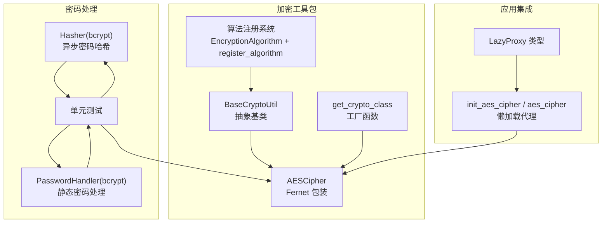
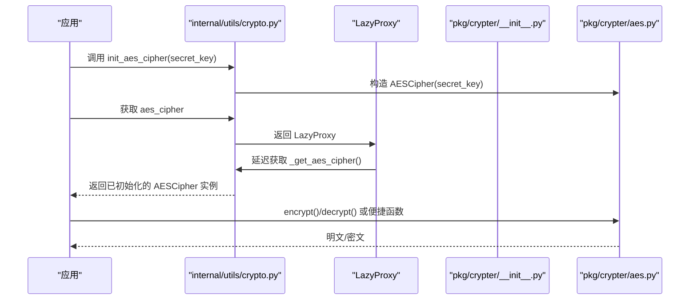
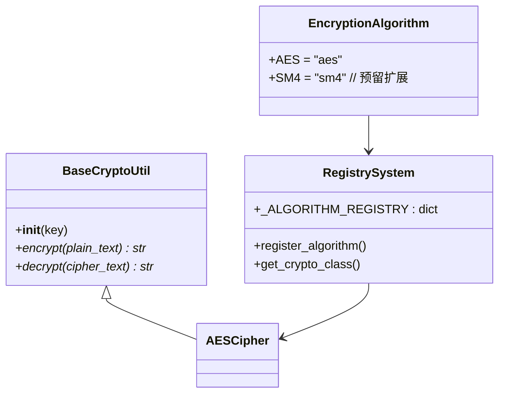
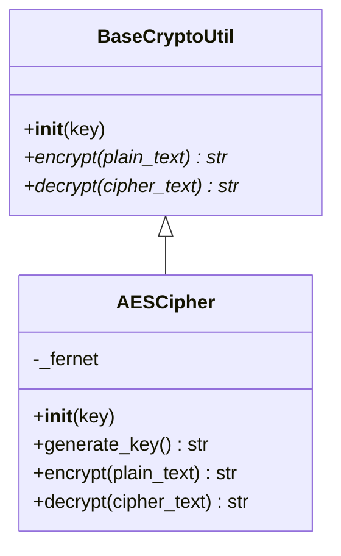
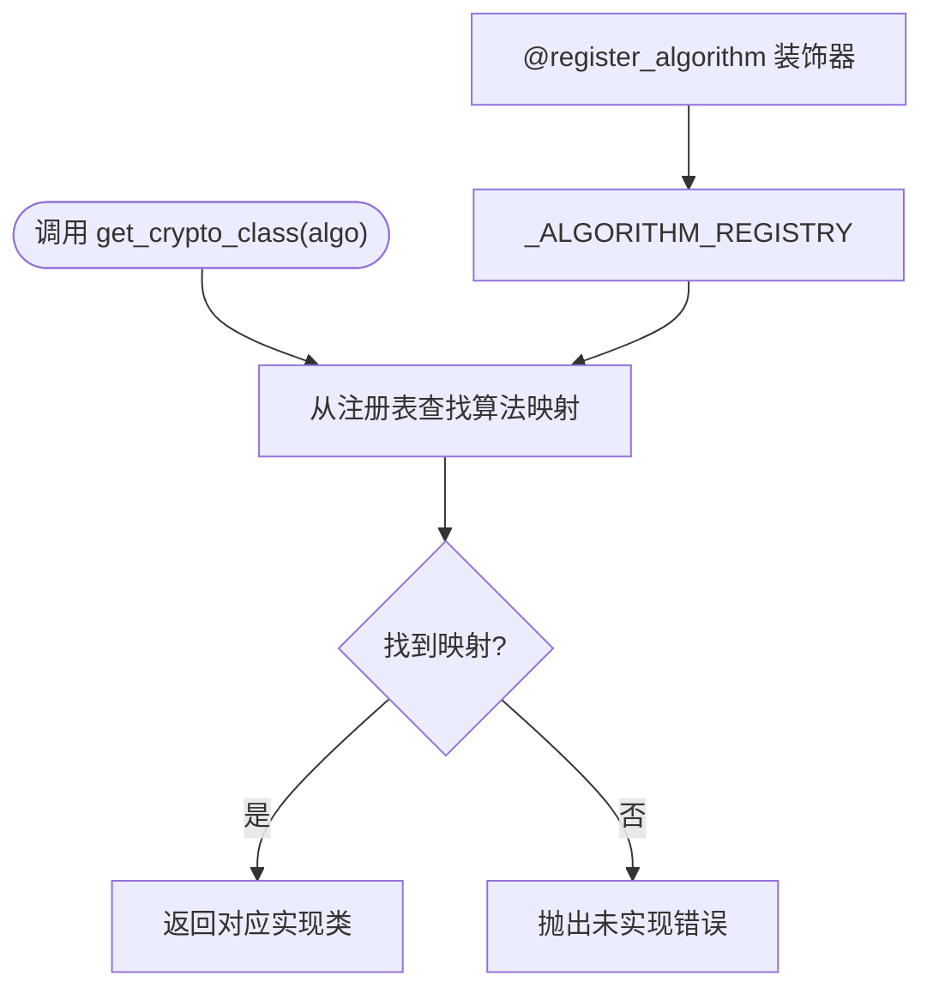
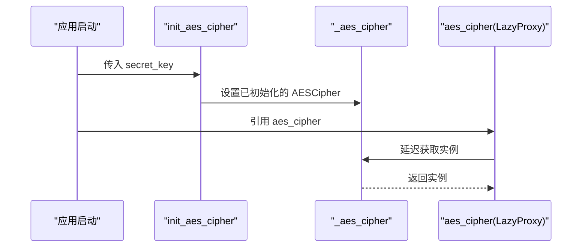
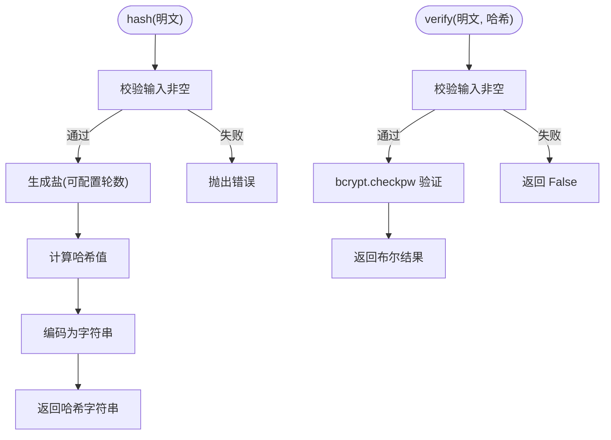
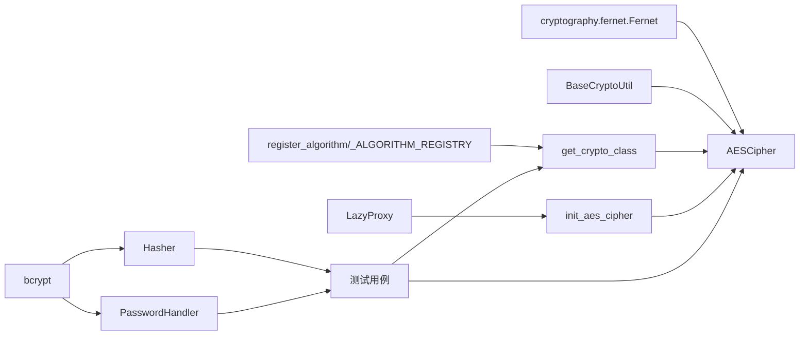

# 加密工具

<cite>
**本文引用的文件**
- [pkg/crypter/__init__.py](file://pkg/crypter/__init__.py)
- [pkg/crypter/aes.py](file://pkg/crypter/aes.py)
- [internal/utils/crypto.py](file://internal/utils/crypto.py)
- [internal/utils/password.py](file://internal/utils/password.py)
- [pkg/toolkit/hasher.py](file://pkg/toolkit/hasher.py)
- [tests/toolkit/test_crypto.py](file://tests/toolkit/test_crypto.py)
- [pkg/toolkit/types.py](file://pkg/toolkit/types.py)
- [configs/.env.dev](file://configs/.env.dev)
- [configs/.env.prod](file://configs/.env.prod)
</cite>

## 更新摘要
**变更内容**
- 新增 PasswordHandler 类提供 bcrypt 密码加密功能
- 增强密码哈希方案，提供双重密码处理能力
- 重构加密模块架构：pkg/crypter/__init__.py成为统一接口中心
- 新增算法注册系统，支持可扩展的加密算法架构
- 更新应用级懒加载实现至 internal/utils/crypto.py

## 目录
1. [简介](#简介)
2. [项目结构](#项目结构)
3. [核心组件](#核心组件)
4. [架构总览](#架构总览)
5. [详细组件分析](#详细组件分析)
6. [依赖关系分析](#依赖关系分析)
7. [性能与安全考量](#性能与安全考量)
8. [故障排查指南](#故障排查指南)
9. [结论](#结论)
10. [附录](#附录)

## 简介
本文件系统化梳理并文档化本项目的加密工具包，重点覆盖基于对称加密的 AES 实现（Fernet 包装）、算法注册系统、密钥管理、初始化与懒加载、便捷函数、以及密码哈希方案。文档同时给出使用示例、安全最佳实践、常见陷阱、算法选择建议与性能注意事项，并提供兼容性与调试技巧。

**更新** 本次更新重构了加密模块架构，新增 PasswordHandler 类提供基于 bcrypt 的密码加密功能，增强了系统的密码处理能力，支持更安全的用户认证场景。新的架构采用统一接口中心和算法注册系统，提供了更好的可扩展性和维护性。

## 项目结构
加密工具包位于 pkg/crypter，核心模块包括：
- 统一接口中心：pkg/crypter/__init__.py（重构后的核心）
- AES 实现：pkg/crypter/aes.py
- 应用级懒加载与初始化：internal/utils/crypto.py
- 密码哈希（bcrypt）：pkg/toolkit/hasher.py
- **新增** 密码处理器：internal/utils/password.py
- 测试用例：tests/toolkit/test_crypto.py
- 懒加载代理类型定义：pkg/toolkit/types.py
- 环境变量示例：configs/.env.dev、configs/.env.prod

```mermaid
graph TB
subgraph "加密工具包"
Registry["算法注册系统<br/>EncryptionAlgorithm + register_algorithm"]
Base["BaseCryptoUtil<br/>抽象基类"]
AES["AESCipher<br/>Fernet 包装"]
Factory["get_crypto_class<br/>工厂函数"]
end
subgraph "应用集成"
CoreCrypto["init_aes_cipher / aes_cipher<br/>懒加载代理"]
Types["LazyProxy 类型"]
end
subgraph "密码处理"
Hasher["Hasher(bcrypt)<br/>异步密码哈希"]
PasswordHandler["PasswordHandler(bcrypt)<br/>静态密码处理"]
Tests["单元测试"]
end
Registry --> Base
Base --> AES
Factory --> AES
CoreCrypto --> AES
Types --> CoreCrypto
Hasher --> Tests
PasswordHandler --> Tests
Tests --> AES
Tests --> Hasher
Tests --> PasswordHandler
```

**图表来源**
- [pkg/crypter/__init__.py](file://pkg/crypter/__init__.py#L25-L95)
- [pkg/crypter/aes.py](file://pkg/crypter/aes.py#L6-L11)
- [internal/utils/crypto.py](file://internal/utils/crypto.py#L7-L18)
- [pkg/toolkit/hasher.py](file://pkg/toolkit/hasher.py#L5-L31)
- [internal/utils/password.py](file://internal/utils/password.py#L6-L14)
- [tests/toolkit/test_crypto.py](file://tests/toolkit/test_crypto.py#L4-L10)

**章节来源**
- [pkg/crypter/__init__.py](file://pkg/crypter/__init__.py#L1-L107)
- [pkg/crypter/aes.py](file://pkg/crypter/aes.py#L1-L59)
- [internal/utils/crypto.py](file://internal/utils/crypto.py#L1-L19)
- [internal/utils/password.py](file://internal/utils/password.py#L1-L84)
- [pkg/toolkit/hasher.py](file://pkg/toolkit/hasher.py#L1-L45)
- [tests/toolkit/test_crypto.py](file://tests/toolkit/test_crypto.py#L1-L211)
- [pkg/toolkit/types.py](file://pkg/toolkit/types.py#L205-L270)

## 核心组件
- **重构后的统一接口**：pkg/crypter/__init__.py 提供完整的加密工具接口，包括算法枚举、注册系统、抽象基类和工厂函数。
- AESCipher：基于 Fernet 的对称加密实现，负责密钥解析、加密、解密与密钥生成；支持字符串与字节两种密钥输入形式。
- BaseCryptoUtil：抽象基类，约束所有加密实现必须具备的接口与最小校验（如密钥非空）。
- EncryptionAlgorithm：算法枚举，当前包含 AES；预留扩展（如 SM4）。
- register_algorithm：装饰器，将具体算法实现注册到全局注册表。
- get_crypto_class：根据算法枚举返回对应实现类，便于业务层按需获取。
- init_aes_cipher / aes_cipher：应用级初始化与懒加载代理，避免模块导入时未初始化问题。
- Hasher：基于 bcrypt 的密码哈希与校验工具，支持自定义迭代轮数，异步接口通过线程池执行同步逻辑。
- **新增** PasswordHandler：基于 bcrypt 的静态密码加密与验证工具，提供简洁的密码处理接口。

**章节来源**
- [pkg/crypter/__init__.py](file://pkg/crypter/__init__.py#L1-L107)
- [pkg/crypter/aes.py](file://pkg/crypter/aes.py#L1-L59)
- [internal/utils/crypto.py](file://internal/utils/crypto.py#L1-L19)
- [internal/utils/password.py](file://internal/utils/password.py#L1-L84)
- [pkg/toolkit/hasher.py](file://pkg/toolkit/hasher.py#L1-L45)

## 架构总览
下图展示从应用层到加密工具包的整体交互路径，包括初始化、懒加载、工厂获取与具体实现调用。

```mermaid
sequenceDiagram
participant App as "应用"
participant Core as "internal/utils/crypto.py"
participant Proxy as "LazyProxy"
participant Factory as "pkg/crypter/__init__.py"
participant AES as "pkg/crypter/aes.py"
App->>Core : 调用 init_aes_cipher(secret_key)
Core->>AES : 构造 AESCipher(secret_key)
App->>Core : 获取 aes_cipher
Core->>Proxy : 返回 LazyProxy
Proxy->>Core : 延迟获取 _get_aes_cipher()
Core-->>App : 返回已初始化的 AESCipher 实例
App->>AES : encrypt()/decrypt() 或便捷函数
AES-->>App : 明文/密文
```

**图表来源**
- [internal/utils/crypto.py](file://internal/utils/crypto.py#L7-L18)
- [pkg/crypter/__init__.py](file://pkg/crypter/__init__.py#L81-L95)
- [pkg/crypter/aes.py](file://pkg/crypter/aes.py#L30-L43)

## 详细组件分析

### 统一接口中心（重构后）
**更新** 加密模块已重构为核心接口中心，提供完整的算法管理能力：

- **算法注册系统**：通过 `EncryptionAlgorithm` 枚举和 `register_algorithm` 装饰器实现
- **抽象基类**：`BaseCryptoUtil` 统一所有加密实现的接口规范
- **工厂模式**：`get_crypto_class` 提供算法到实现类的映射
- **自动导入**：通过模块导入触发具体实现的注册

```mermaid
classDiagram
class EncryptionAlgorithm {
+AES = "aes"
+SM4 = "sm4" // 预留扩展
}
class BaseCryptoUtil {
+__init__(key)
+encrypt(plain_text) str*
+decrypt(cipher_text) str*
}
class RegistrySystem {
+_ALGORITHM_REGISTRY : dict
+register_algorithm()
+get_crypto_class()
}
EncryptionAlgorithm --> RegistrySystem
BaseCryptoUtil <|-- AESCipher
RegistrySystem --> AESCipher
```

**图表来源**
- [pkg/crypter/__init__.py](file://pkg/crypter/__init__.py#L25-L95)

**章节来源**
- [pkg/crypter/__init__.py](file://pkg/crypter/__init__.py#L1-L107)

### AESCipher 组件
- 设计要点
  - 基于 Fernet 的对称加密，内部自动处理随机 IV 与完整性校验（HMAC），保证机密性与抗篡改。
  - 支持字符串与字节两种密钥输入，自动进行编码转换。
  - 提供静态方法生成符合要求的密钥（url-safe base64 编码，长度满足 Fernet 要求）。
  - 便捷函数 aes_encrypt/aes_decrypt/aes_generate_key，便于快速使用。
- 错误处理
  - 非法密钥或空密钥抛出明确错误信息，提示密钥格式与生成方式。
  - 解密失败（令牌无效/密钥错误）抛出明确错误，便于上层区分。
- 数据流
  - 明文字符串经 UTF-8 编码后加密，返回 UTF-8 编码的密文字符串；解密流程相反。
  - 空字符串输入返回空字符串，避免额外分支。

```mermaid
classDiagram
class BaseCryptoUtil {
+__init__(key)
+encrypt(plain_text) str*
+decrypt(cipher_text) str*
}
class AESCipher {
+__init__(key)
+generate_key() str
+encrypt(plain_text) str
+decrypt(cipher_text) str
-_fernet
}
BaseCryptoUtil <|-- AESCipher
```

**图表来源**
- [pkg/crypter/__init__.py](file://pkg/crypter/__init__.py#L51-L67)
- [pkg/crypter/aes.py](file://pkg/crypter/aes.py#L13-L43)

**章节来源**
- [pkg/crypter/aes.py](file://pkg/crypter/aes.py#L1-L59)
- [pkg/crypter/__init__.py](file://pkg/crypter/__init__.py#L51-L67)

### 算法注册与工厂系统
**更新** 新增的算法注册系统提供了更好的可扩展性：

- **register_algorithm 装饰器**：将具体算法类注册到全局注册表，确保 get_crypto_class 可按枚举返回正确实现。
- **get_crypto_class 工厂函数**：根据算法枚举返回对应类，若未注册则抛出未实现错误，便于扩展新算法。
- **自动注册机制**：通过模块导入触发具体实现的注册，无需手动维护注册表。

```mermaid
flowchart TD
Start(["调用 get_crypto_class(algo)"]) --> Lookup["从注册表查找算法映射"]
Lookup --> Found{"找到映射?"}
Found --> |是| ReturnClass["返回对应实现类"]
Found --> |否| RaiseError["抛出未实现错误"]
Register["@register_algorithm 装饰器"] --> Registry["_ALGORITHM_REGISTRY"]
Registry --> Lookup
```

**图表来源**
- [pkg/crypter/__init__.py](file://pkg/crypter/__init__.py#L34-L95)

**章节来源**
- [pkg/crypter/__init__.py](file://pkg/crypter/__init__.py#L1-L107)

### 应用级懒加载与初始化
**更新** 应用级懒加载已迁移至 internal/utils/crypto.py：

- **init_aes_cipher**：在应用启动阶段完成密钥解析与实例化，避免后续运行时重复开销。
- **aes_cipher**：LazyProxy 包装，首次访问时才真正获取实例，未初始化时抛出运行时错误，防止误用。

```mermaid
sequenceDiagram
participant Boot as "应用启动"
participant Init as "init_aes_cipher"
participant Global as "_aes_cipher"
participant Proxy as "aes_cipher(LazyProxy)"
Boot->>Init : 传入 secret_key
Init->>Global : 设置已初始化的 AESCipher
Boot->>Proxy : 引用 aes_cipher
Proxy->>Global : 延迟获取实例
Global-->>Proxy : 返回实例
```

**图表来源**
- [internal/utils/crypto.py](file://internal/utils/crypto.py#L7-L18)
- [pkg/toolkit/types.py](file://pkg/toolkit/types.py#L226-L270)

**章节来源**
- [internal/utils/crypto.py](file://internal/utils/crypto.py#L1-L19)
- [pkg/toolkit/types.py](file://pkg/toolkit/types.py#L205-L270)

### 密码哈希（bcrypt）增强
**更新** 项目现已提供双重密码处理方案：

#### Hasher 类（异步接口）
- Hasher：封装 bcrypt 的盐生成与哈希计算，支持自定义迭代轮数；提供异步接口，内部通过线程池执行同步逻辑。
- 接口约定：空明文或空哈希返回 False；异常输入统一返回 False，避免泄露细节。

#### PasswordHandler 类（静态接口）
**新增** PasswordHandler：提供静态方法的密码处理工具，无需实例化即可使用。

- **功能特性**：自动加盐、高计算成本、不可逆性，支持密码验证和重新加密检查。
- **错误处理**：捕获无效格式和编码错误，记录日志并返回 False。
- **使用优势**：静态方法设计，避免实例化开销，适合频繁调用的场景。

```mermaid
flowchart TD
Start(["hash(明文)"]) --> Validate["校验输入非空"]
Validate --> |通过| Salt["生成盐(可配置轮数)"]
Salt --> Hash["计算哈希值"]
Hash --> Encode["编码为字符串"]
Encode --> Return["返回哈希字符串"]
Validate --> |失败| Raise["抛出错误"]
Start2(["verify(明文, 哈希)"]) --> VCheck["校验输入非空"]
VCheck --> |通过| Check["bcrypt.checkpw 验证"]
Check --> VResult["返回布尔结果"]
VCheck --> |失败| VFalse["返回 False"]
```

**图表来源**
- [pkg/toolkit/hasher.py](file://pkg/toolkit/hasher.py#L9-L28)
- [internal/utils/password.py](file://internal/utils/password.py#L16-L68)

**章节来源**
- [pkg/toolkit/hasher.py](file://pkg/toolkit/hasher.py#L1-L45)
- [internal/utils/password.py](file://internal/utils/password.py#L1-L84)

## 依赖关系分析
**更新** 依赖关系已重构，体现新的架构设计：

- AESCipher 依赖 cryptography.fernet.Fernet 完成加解密与完整性校验。
- BaseCryptoUtil 作为抽象基类，约束实现类的接口与最小校验。
- register_algorithm 与 _ALGORITHM_REGISTRY 构成注册中心，get_crypto_class 作为工厂入口。
- internal/utils/crypto.py 通过 LazyProxy 与应用生命周期耦合，避免导入时未初始化。
- tests/toolkit/test_crypto.py 覆盖 AES 与工厂行为，验证密钥生成、加解密往返、错误处理与完整性校验。
- **新增** PasswordHandler 依赖 bcrypt 库进行密码加密，提供静态方法接口。

```mermaid
graph LR
Fernet["cryptography.fernet.Fernet"] --> AES["AESCipher"]
Base["BaseCryptoUtil"] --> AES
Reg["register_algorithm/_ALGORITHM_REGISTRY"] --> Factory["get_crypto_class"]
Factory --> AES
Init["init_aes_cipher"] --> AES
Proxy["LazyProxy"] --> Init
Tests["测试用例"] --> AES
Tests --> Factory
bcrypt["bcrypt"] --> Hasher["Hasher"]
bcrypt --> PasswordHandler["PasswordHandler"]
Hasher --> Tests
PasswordHandler --> Tests
```

**图表来源**
- [pkg/crypter/aes.py](file://pkg/crypter/aes.py#L1)
- [pkg/crypter/__init__.py](file://pkg/crypter/__init__.py#L34-L95)
- [internal/utils/crypto.py](file://internal/utils/crypto.py#L7-L18)
- [tests/toolkit/test_crypto.py](file://tests/toolkit/test_crypto.py#L4-L10)
- [internal/utils/password.py](file://internal/utils/password.py#L3)

**章节来源**
- [pkg/crypter/aes.py](file://pkg/crypter/aes.py#L1-L59)
- [pkg/crypter/__init__.py](file://pkg/crypter/__init__.py#L1-L107)
- [internal/utils/crypto.py](file://internal/utils/crypto.py#L1-L19)
- [tests/toolkit/test_crypto.py](file://tests/toolkit/test_crypto.py#L1-L211)
- [internal/utils/password.py](file://internal/utils/password.py#L1-L84)

## 性能与安全考量
**更新** 性能与安全考量已更新以反映新的架构：

- **性能**
  - AESCipher 基于 Fernet，内部使用高性能加密库；对小文本加解密开销主要来自字符串编解码与完整性校验。
  - 懒加载代理避免应用启动时不必要的初始化；建议在应用启动阶段集中完成 init_aes_cipher。
  - bcrypt 轮数越高安全性越好但计算成本越高，建议结合业务场景权衡（默认轮数可满足大多数场景）。
  - **新增** PasswordHandler 采用静态方法设计，避免实例化开销，适合频繁调用的场景。
  - **新增** 算法注册系统采用装饰器模式，注册过程在模块导入时自动完成，避免运行时开销。
- **安全**
  - 密钥必须是 32 字节 URL 安全 Base64 编码，且妥善保管；建议使用 aes_generate_key 生成并在安全渠道分发与存储。
  - 同一明文多次加密得到的密文不同（由随机 IV 与 HMAC 保证），避免统计分析。
  - 解密失败严格区分"令牌无效/密钥错误"与"篡改"，便于定位问题。
  - 环境变量中不应硬编码密钥，应通过安全配置源注入（参考环境示例文件）。
  - **新增** PasswordHandler 自动处理盐生成和错误处理，提供更安全的密码存储方案。
  - **新增** 统一接口中心提供更好的安全边界控制，所有加密操作都经过标准化的验证流程。

**章节来源**
- [pkg/crypter/aes.py](file://pkg/crypter/aes.py#L13-L24)
- [pkg/crypter/aes.py](file://pkg/crypter/aes.py#L30-L43)
- [pkg/toolkit/hasher.py](file://pkg/toolkit/hasher.py#L6-L7)
- [internal/utils/password.py](file://internal/utils/password.py#L10-L14)
- [configs/.env.dev](file://configs/.env.dev#L1-L22)
- [configs/.env.prod](file://configs/.env.prod#L1-L22)

## 故障排查指南
**更新** 故障排查指南已更新以反映新的架构和新增功能：

- **"密钥无效"或"空密钥"**
  - 现象：初始化 AESCipher 抛出错误。
  - 处理：确认密钥为 32 字节 URL 安全 Base64 编码；可通过 aes_generate_key 生成新密钥并替换。
- **"解密失败：令牌无效或密钥错误"**
  - 现象：解密抛出错误。
  - 处理：确认使用的是加密时的同一密钥；检查密文是否被篡改；核对编码一致性（UTF-8）。
- **"未初始化 AES Cipher"**
  - 现象：访问 aes_cipher 抛出运行时错误。
  - 处理：在应用启动阶段调用 init_aes_cipher(secret_key) 完成初始化。
- **"空字符串输入"**
  - 现象：加密/解密空字符串返回空字符串。
  - 处理：业务侧需显式处理空值分支，避免误判。
- **"算法未注册"**
  - 现象：调用 get_crypto_class 抛出未实现错误。
  - 处理：确认算法已在模块导入时注册；检查 @register_algorithm 装饰器使用是否正确。
- **"密码哈希失败"**
  - 现象：PasswordHandler 验证密码时返回 False。
  - 处理：检查密码格式和编码；确认使用正确的哈希值；查看日志中的错误信息。
- **"bcrypt 轮数不匹配"**
  - 现象：哈希验证失败或需要重新加密。
  - 处理：使用 PasswordHandler.needs_rehash 检查是否需要重新加密；调整轮数配置。
- **"测试用例覆盖点"**
  - 参考测试用例对密钥生成、加解密往返、IV 不同性、错误密钥、篡改检测、空输入等场景的断言。

**章节来源**
- [pkg/crypter/aes.py](file://pkg/crypter/aes.py#L19-L24)
- [pkg/crypter/aes.py](file://pkg/crypter/aes.py#L36-L43)
- [internal/utils/crypto.py](file://internal/utils/crypto.py#L12-L15)
- [pkg/crypter/__init__.py](file://pkg/crypter/__init__.py#L89-L93)
- [internal/utils/password.py](file://internal/utils/password.py#L64-L68)
- [tests/toolkit/test_crypto.py](file://tests/toolkit/test_crypto.py#L101-L183)

## 结论
**更新** 本加密工具包已完成重大架构重构，以 Fernet 为基础实现对称加密，提供清晰的密钥管理、便捷的工厂与懒加载机制，以及完善的测试覆盖。配合 bcrypt 的密码哈希方案，满足常见数据保护与身份验证需求。

**新增的 PasswordHandler 类进一步增强了密码处理能力，提供静态接口和更好的错误处理机制。重构后的统一接口中心和算法注册系统提供了更好的可扩展性和维护性。** 建议在生产环境中遵循密钥安全策略、合理选择 bcrypt 轮数，并在应用启动阶段完成初始化与密钥注入。

## 附录

### 使用示例（路径指引）
**更新** 使用示例已更新以反映新的架构：

- **数据加密/解密**
  - 使用 AESCipher 实例：[pkg/crypter/aes.py](file://pkg/crypter/aes.py#L30-L43)
  - 使用便捷函数：[pkg/crypter/aes.py](file://pkg/crypter/aes.py#L46-L58)
- **密钥生成**
  - 静态方法生成密钥：[pkg/crypter/aes.py](file://pkg/crypter/aes.py#L26-L28)
- **密码哈希**
  - 异步哈希与校验：[pkg/toolkit/hasher.py](file://pkg/toolkit/hasher.py#L20-L28)
  - **新增** 静态密码处理：[internal/utils/password.py](file://internal/utils/password.py#L16-L68)
- **算法注册与工厂**
  - 获取实现类：[pkg/crypter/__init__.py](file://pkg/crypter/__init__.py#L81-L95)
  - **新增** 算法枚举：[pkg/crypter/__init__.py](file://pkg/crypter/__init__.py#L25-L28)
- **应用初始化**
  - 启动阶段初始化：[internal/utils/crypto.py](file://internal/utils/crypto.py#L7-L9)
  - 懒加载访问：[internal/utils/crypto.py](file://internal/utils/crypto.py#L12-L18)

### 安全最佳实践
**更新** 安全最佳实践已更新：

- **密钥管理**
  - 使用 aes_generate_key 生成密钥；通过安全配置源注入；避免硬编码在代码或环境文件中。
- **输入校验**
  - 明文与密文均需进行长度与格式校验；空输入需显式处理。
- **完整性与抗篡改**
  - 依赖 Fernet 的 HMAC 校验；避免对密文进行二次修改。
- **性能与可用性**
  - 合理设置 bcrypt 轮数；在应用启动阶段完成 AES 初始化；避免在热路径重复构造实例。
- **新增** **算法扩展**
  - 使用 register_algorithm 装饰器注册新算法；遵循 BaseCryptoUtil 接口规范。
- **新增** **密码处理**
  - 使用 PasswordHandler 进行密码加密和验证；避免直接使用底层 bcrypt 库。
  - 定期检查密码哈希是否需要重新加密；根据硬件性能调整轮数。

### 算法选择与兼容性
**更新** 算法选择与兼容性已更新：

- **AES（Fernet）**
  - 特点：内置完整性校验、随机 IV、易用性强；适合大多数对称加密场景。
  - 兼容性：依赖 cryptography 库；确保部署环境安装相应二进制依赖。
- **bcrypt**
  - 特点：专为密码设计，自适应盐与可调轮数；适合密码存储与校验。
  - 兼容性：Python bcrypt 库；注意轮数变化导致的哈希格式差异。
  - **新增** PasswordHandler：提供静态接口，简化 bcrypt 使用；自动处理错误和日志记录。
- **新增** **算法注册系统**
  - 特点：装饰器驱动的注册机制；自动导入触发注册；支持未来扩展。
  - 兼容性：基于 Python 3.8+ 的类型注解；与现有代码完全兼容。

### 调试技巧
**更新** 调试技巧已更新：

- **使用测试用例作为行为参考**：[tests/toolkit/test_crypto.py](file://tests/toolkit/test_crypto.py#L90-L211)
- **在开发环境开启调试输出**，观察密钥生成与加解密往返；核对编码与长度。
- **对比不同密钥与相同明文的多次加密结果**，验证 IV 行为与解密一致性。
- **新增** **算法注册调试**：检查 @register_algorithm 装饰器是否正确应用；验证 _ALGORITHM_REGISTRY 是否包含预期算法。
- **新增** **密码处理调试**：使用 PasswordHandler 的 needs_rehash 方法检查哈希状态；查看日志中的错误信息。
- **新增** **性能监控**：比较 Hasher 和 PasswordHandler 的性能差异；根据使用场景选择合适的实现。
- **新增** **懒加载调试**：检查 LazyProxy 的初始化状态；验证 _get_aes_cipher 函数的错误处理。