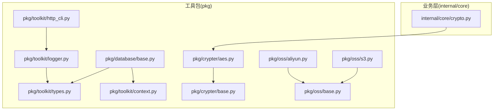
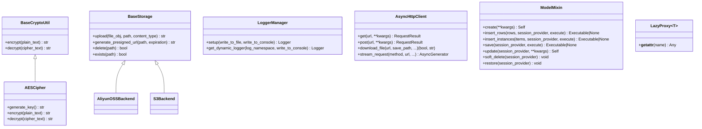
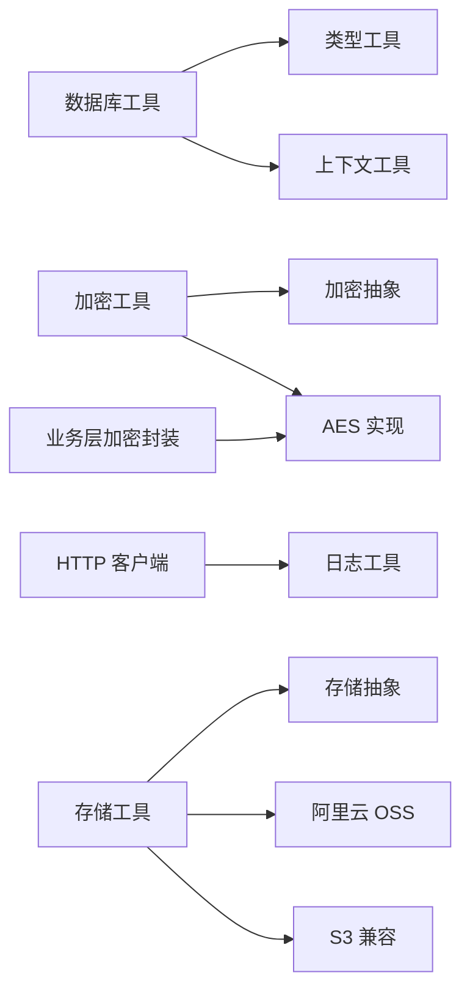

# 基础设施工具

<cite>
**本文引用的文件**
- [pkg/toolkit/http_cli.py](file://pkg/toolkit/http_cli.py)
- [pkg/toolkit/logger.py](file://pkg/toolkit/logger.py)
- [pkg/database/base.py](file://pkg/database/base.py)
- [pkg/crypter/base.py](file://pkg/crypter/base.py)
- [pkg/crypter/aes.py](file://pkg/crypter/aes.py)
- [pkg/oss/base.py](file://pkg/oss/base.py)
- [pkg/oss/aliyun.py](file://pkg/oss/aliyun.py)
- [pkg/oss/s3.py](file://pkg/oss/s3.py)
- [pkg/toolkit/types.py](file://pkg/toolkit/types.py)
- [pkg/toolkit/context.py](file://pkg/toolkit/context.py)
- [internal/core/crypto.py](file://internal/core/crypto.py)
- [pkg/database/__init__.py](file://pkg/database/__init__.py)
- [pkg/crypter/__init__.py](file://pkg/crypter/__init__.py)
- [pkg/oss/__init__.py](file://pkg/oss/__init__.py)
</cite>

## 目录
1. [简介](#简介)
2. [项目结构](#项目结构)
3. [核心组件](#核心组件)
4. [架构总览](#架构总览)
5. [组件详解](#组件详解)
6. [依赖关系分析](#依赖关系分析)
7. [性能考量](#性能考量)
8. [故障排查指南](#故障排查指南)
9. [结论](#结论)
10. [附录](#附录)

## 简介
本文件系统性梳理并文档化本项目的基础设施工具包，覆盖以下可复用能力：
- 数据库工具：基于 SQLAlchemy 2.x 的异步 ORM 基类、会话提供器、查询构建器与 DAO 事务执行器
- 加密工具：抽象加密接口与 AES 实现，支持注册表扩展
- HTTP 客户端：基于 httpx 的异步客户端，支持流式下载、进度回调、统一错误封装
- 日志工具：基于 loguru 的 LoggerManager，支持命名空间隔离、轮转、压缩、UTC 时间、JSON/文本格式
- 存储工具：抽象 OSS/S3 接口与阿里云 OSS、AWS S3 实现，支持注册表扩展
- 类型与上下文：智能类型（SmartInt/SmartDecimal/SmartDatetime）、懒加载代理 LazyProxy、请求上下文管理

设计理念与模块化组织：
- 抽象先行：通过 ABC 与枚举注册表实现“可插拔”扩展，便于新增算法或存储后端
- 统一错误与返回：HTTP 客户端返回统一结果对象；数据库 DAO 统一执行与异常包装
- 可观测性：日志管理器内置 trace_id 注入与命名空间隔离，便于链路追踪
- 类型安全：通过 Pydantic 注解与 Smart* 类型，确保前后端数据一致性与精度

## 项目结构
工具包位于 pkg 目录下，按功能域划分：
- pkg/toolkit：通用工具（HTTP、日志、类型、上下文、序列化等）
- pkg/database：数据库 ORM 基类、DAO、查询构建器、类型
- pkg/crypter：加密抽象与 AES 实现
- pkg/oss：对象存储抽象与阿里云 OSS、S3 实现
- internal/core：业务层对工具包的轻量封装（如 AES 单例）

图表来源
- [pkg/toolkit/http_cli.py](file://pkg/toolkit/http_cli.py#L1-L232)
- [pkg/toolkit/logger.py](file://pkg/toolkit/logger.py#L1-L339)
- [pkg/database/base.py](file://pkg/database/base.py#L1-L364)
- [pkg/crypter/base.py](file://pkg/crypter/base.py#L1-L39)
- [pkg/crypter/aes.py](file://pkg/crypter/aes.py#L1-L59)
- [pkg/oss/base.py](file://pkg/oss/base.py#L1-L42)
- [pkg/oss/aliyun.py](file://pkg/oss/aliyun.py#L1-L66)
- [pkg/oss/s3.py](file://pkg/oss/s3.py#L1-L83)
- [internal/core/crypto.py](file://internal/core/crypto.py#L1-L19)

章节来源
- [pkg/toolkit/http_cli.py](file://pkg/toolkit/http_cli.py#L1-L232)
- [pkg/toolkit/logger.py](file://pkg/toolkit/logger.py#L1-L339)
- [pkg/database/base.py](file://pkg/database/base.py#L1-L364)
- [pkg/crypter/base.py](file://pkg/crypter/base.py#L1-L39)
- [pkg/crypter/aes.py](file://pkg/crypter/aes.py#L1-L59)
- [pkg/oss/base.py](file://pkg/oss/base.py#L1-L42)
- [pkg/oss/aliyun.py](file://pkg/oss/aliyun.py#L1-L66)
- [pkg/oss/s3.py](file://pkg/oss/s3.py#L1-L83)
- [pkg/toolkit/types.py](file://pkg/toolkit/types.py#L1-L245)
- [pkg/toolkit/context.py](file://pkg/toolkit/context.py#L1-L107)
- [internal/core/crypto.py](file://internal/core/crypto.py#L1-L19)

## 核心组件
- 数据库工具：提供异步引擎工厂、会话提供器、ORM 基类与 Mixin、查询构建器、DAO 事务执行器、JSON 类型
- 加密工具：抽象接口与 AES 实现，支持注册表扩展与便捷函数
- HTTP 客户端：统一请求封装、流式下载、进度回调、错误归一化
- 日志工具：LoggerManager 管理器、命名空间隔离、轮转/保留/压缩、UTC 时间、JSON/文本格式
- 存储工具：抽象接口与阿里云 OSS、S3 实现，支持注册表扩展
- 类型与上下文：Smart* 类型、LazyProxy 懒加载代理、请求上下文管理

章节来源
- [pkg/database/base.py](file://pkg/database/base.py#L1-L364)
- [pkg/crypter/base.py](file://pkg/crypter/base.py#L1-L39)
- [pkg/crypter/aes.py](file://pkg/crypter/aes.py#L1-L59)
- [pkg/toolkit/http_cli.py](file://pkg/toolkit/http_cli.py#L1-L232)
- [pkg/toolkit/logger.py](file://pkg/toolkit/logger.py#L1-L339)
- [pkg/oss/base.py](file://pkg/oss/base.py#L1-L42)
- [pkg/oss/aliyun.py](file://pkg/oss/aliyun.py#L1-L66)
- [pkg/oss/s3.py](file://pkg/oss/s3.py#L1-L83)
- [pkg/toolkit/types.py](file://pkg/toolkit/types.py#L1-L245)
- [pkg/toolkit/context.py](file://pkg/toolkit/context.py#L1-L107)

## 架构总览
工具包采用“抽象 + 注册表 + 业务轻封装”的分层设计：
- 抽象层：ABC 与枚举注册表，约束实现并提供统一入口
- 工具层：HTTP、日志、类型、上下文等通用能力
- 数据层：ORM 基类与 DAO，结合上下文与类型工具
- 业务层：对加密等工具进行单例化封装，暴露易用接口

图表来源
- [pkg/crypter/base.py](file://pkg/crypter/base.py#L26-L39)
- [pkg/crypter/aes.py](file://pkg/crypter/aes.py#L6-L44)
- [pkg/oss/base.py](file://pkg/oss/base.py#L26-L42)
- [pkg/oss/aliyun.py](file://pkg/oss/aliyun.py#L9-L66)
- [pkg/oss/s3.py](file://pkg/oss/s3.py#L11-L83)
- [pkg/toolkit/logger.py](file://pkg/toolkit/logger.py#L21-L143)
- [pkg/toolkit/http_cli.py](file://pkg/toolkit/http_cli.py#L38-L232)
- [pkg/database/base.py](file://pkg/database/base.py#L60-L304)
- [pkg/toolkit/types.py](file://pkg/toolkit/types.py#L205-L245)

## 组件详解

### 数据库工具
- 异步引擎工厂：支持连接池参数、JSON 序列化器替换
- 会话提供器：上下文管理器形式的 SessionProvider
- ORM 基类与 Mixin：统一主键、审计字段、软删除、批量插入、严格保存/更新
- 查询构建器：计数、查询、更新构建器（由包导出）
- DAO 事务执行器：统一执行与异常包装
- JSON 类型：自定义 JSONType（由包导出）

配置项与行为要点
- 引擎工厂参数：数据库 URI、echo、pool_pre_ping、pool_size、max_overflow、pool_timeout、pool_recycle、JSON 序列化器
- Mixin 字段：id、creator_id、created_at、updater_id、updated_at、deleted_at
- 执行模式：execute=True 时执行并返回 None；execute=False 时返回语句对象
- 上下文默认值：来自上下文变量，包含当前时间与用户 ID

使用示例与最佳实践
- 使用工厂创建引擎与会话提供器，注入到各 DAO
- 批量插入优先使用 insert_rows 或 insert_instances，减少往返
- 严格区分 save（仅插入新对象）与 update（仅更新已存在对象）
- 软删除场景使用 soft_delete/restore，避免物理删除

章节来源
- [pkg/database/base.py](file://pkg/database/base.py#L19-L46)
- [pkg/database/base.py](file://pkg/database/base.py#L60-L304)
- [pkg/database/__init__.py](file://pkg/database/__init__.py#L1-L29)

### 加密工具
- 抽象接口：BaseCryptoUtil，定义 encrypt/decrypt
- AES 实现：AESCipher，基于 Fernet，支持生成密钥与便捷函数
- 注册表：EncryptionAlgorithm 枚举 + _ALGORITHM_REGISTRY，装饰器 register_algorithm 自动注册
- 业务封装：internal/core/crypto.py 提供 AES 单例代理

配置项与行为要点
- AES 密钥：需为 32 字节 URL 安全 Base64 编码字符串
- 错误处理：无效令牌或错误密钥抛出异常
- 算法扩展：通过 register_algorithm 与 get_crypto_class 动态获取实现类

使用示例与最佳实践
- 通过 get_crypto_class 获取对应算法类，避免硬编码
- 使用 LazyProxy 将初始化延迟到运行时，避免模块导入时未配置
- 密钥管理：使用安全的密钥存储与轮换策略

章节来源
- [pkg/crypter/base.py](file://pkg/crypter/base.py#L5-L39)
- [pkg/crypter/aes.py](file://pkg/crypter/aes.py#L6-L59)
- [pkg/crypter/__init__.py](file://pkg/crypter/__init__.py#L17-L29)
- [internal/core/crypto.py](file://internal/core/crypto.py#L7-L19)

### HTTP 客户端
- 统一封装：AsyncHttpClient，基于 httpx.AsyncClient
- 请求方法：get/post/put/delete，统一返回 RequestResult
- 流式下载：download_file 支持进度回调与目录自动创建
- 错误处理：统一捕获 HTTPStatusError、RequestError 与未知异常
- 日志集成：请求与下载过程记录日志

配置项与行为要点
- 构造参数：base_url、timeout、headers、verify
- RequestResult：包含 status_code、response、error、success 属性与 json() 方法
- 流式请求：stream_request 支持按块读取字节流

使用示例与最佳实践
- 使用 with 上下文管理器确保连接关闭
- 对大文件下载使用 download_file 并设置合适的 chunk_size
- 对外部服务调用统一走此客户端，便于统一日志与错误处理

章节来源
- [pkg/toolkit/http_cli.py](file://pkg/toolkit/http_cli.py#L38-L232)

### 日志工具
- LoggerManager：集中配置日志级别、轮转、保留、压缩、UTC、格式（JSON/文本）
- 命名空间：支持系统日志与动态命名空间，按命名空间隔离输出
- Trace ID：自动从上下文注入，便于链路追踪
- 格式化器：控制台与文件分别支持 JSON 与文本格式

配置项与行为要点
- 构造参数：level、base_log_dir、system_subdir、rotation、retention、compression、use_utc、enqueue、log_format
- setup：一次性应用配置，支持控制台与文件输出
- get_dynamic_logger：按命名空间动态注册 Sink，支持单独输出到控制台

使用示例与最佳实践
- 生产环境建议使用 JSON 格式与 UTC 时间
- 轮转策略与保留期应结合磁盘容量与合规要求配置
- 通过命名空间区分模块日志，便于检索与告警

章节来源
- [pkg/toolkit/logger.py](file://pkg/toolkit/logger.py#L21-L339)

### 存储工具
- 抽象接口：BaseStorage，定义 upload/generate_presigned_url/delete/exists
- 注册表：StorageType 枚举 + _STORAGE_REGISTRY，装饰器 register_storage 自动注册
- 实现：阿里云 OSS 与 S3 兼容实现，均支持多种输入类型与预签名 URL

配置项与行为要点
- 阿里云 OSS：支持 endpoint/region 自动推断，返回签名 URL
- S3：支持 endpoint 自定义，返回对象访问 URL
- 错误处理：捕获 SDK 特定异常并转换为统一异常

使用示例与最佳实践
- 通过 get_storage_class 获取后端类，避免硬编码
- 预签名 URL 用于临时授权访问，注意过期时间设置
- 上传前确保桶存在且权限正确

章节来源
- [pkg/oss/base.py](file://pkg/oss/base.py#L6-L42)
- [pkg/oss/aliyun.py](file://pkg/oss/aliyun.py#L16-L66)
- [pkg/oss/s3.py](file://pkg/oss/s3.py#L18-L83)
- [pkg/oss/__init__.py](file://pkg/oss/__init__.py#L22-L34)

### 类型与上下文
- Smart* 类型：SmartInt、SmartDecimal、SmartDatetime，统一输入解析与 JSON 序列化策略
- LazyProxy：通用懒加载代理，支持完整类型提示
- 请求上下文：init/get/set/clear，提供 user_id 与 trace_id 的读写

使用示例与最佳实践
- 使用 Smart* 类型确保前后端数据一致性与精度
- 对延迟初始化的资源使用 LazyProxy，避免导入时未就绪
- 在中间件中初始化上下文，确保后续组件可读取 trace_id 与 user_id

章节来源
- [pkg/toolkit/types.py](file://pkg/toolkit/types.py#L19-L245)
- [pkg/toolkit/context.py](file://pkg/toolkit/context.py#L1-L107)

## 依赖关系分析
- 数据库工具依赖类型与上下文工具，提供统一的 ORM 基类与 Mixin
- 加密工具通过注册表实现可插拔扩展，业务层通过工厂函数获取实现
- HTTP 客户端依赖日志工具进行可观测性
- 存储工具通过注册表实现可插拔扩展，阿里云与 S3 实现均继承抽象基类
- 业务层对加密工具进行单例化封装，降低使用复杂度

图表来源
- [pkg/database/base.py](file://pkg/database/base.py#L1-L15)
- [pkg/toolkit/types.py](file://pkg/toolkit/types.py#L1-L10)
- [pkg/toolkit/context.py](file://pkg/toolkit/context.py#L1-L5)
- [pkg/crypter/aes.py](file://pkg/crypter/aes.py#L1-L4)
- [pkg/toolkit/http_cli.py](file://pkg/toolkit/http_cli.py#L10-L10)
- [pkg/oss/aliyun.py](file://pkg/oss/aliyun.py#L1-L7)
- [pkg/oss/s3.py](file://pkg/oss/s3.py#L1-L8)
- [internal/core/crypto.py](file://internal/core/crypto.py#L1-L3)

章节来源
- [pkg/database/base.py](file://pkg/database/base.py#L1-L15)
- [pkg/toolkit/types.py](file://pkg/toolkit/types.py#L1-L10)
- [pkg/toolkit/context.py](file://pkg/toolkit/context.py#L1-L5)
- [pkg/crypter/aes.py](file://pkg/crypter/aes.py#L1-L4)
- [pkg/toolkit/http_cli.py](file://pkg/toolkit/http_cli.py#L10-L10)
- [pkg/oss/aliyun.py](file://pkg/oss/aliyun.py#L1-L7)
- [pkg/oss/s3.py](file://pkg/oss/s3.py#L1-L8)
- [internal/core/crypto.py](file://internal/core/crypto.py#L1-L3)

## 性能考量
- HTTP 客户端
  - 使用长连接与单例实例，避免频繁创建连接
  - 大文件下载使用流式下载与合理 chunk_size，减少内存占用
  - 统一超时与重试策略，避免阻塞
- 数据库
  - 合理配置连接池参数，避免连接泄漏
  - 批量插入优先使用 insert_rows/insert_instances
  - 软删除避免物理删除带来的索引维护成本
- 日志
  - 控制台与文件输出分离，避免阻塞
  - JSON 格式便于日志采集与检索，文本格式便于人工阅读
  - 轮转与保留策略平衡磁盘占用与历史留存
- 加密
  - AES 密钥长度与编码规范，避免重复生成导致的性能损耗
  - 使用 LazyProxy 延迟初始化，减少启动开销
- 存储
  - 预签名 URL 用于临时访问，减少服务器压力
  - S3/OSS 的 endpoint/region 配置影响网络延迟与可用性

## 故障排查指南
- HTTP 客户端
  - 统一错误封装：检查 RequestResult.error 与 status_code
  - 流式下载失败：确认目标目录存在与权限，检查 on_progress 回调
- 数据库
  - 执行失败：查看 _execute_or_return 的异常包装信息
  - 字段缺失：确认 Mixin 的审计字段是否存在
- 日志
  - 未初始化：调用 setup() 后再获取动态日志器
  - trace_id 为空：检查中间件是否正确初始化上下文
- 加密
  - 无效密钥：确认密钥为 32 字节 URL 安全 Base64 编码
  - 解密失败：核对密钥与令牌有效性
- 存储
  - SDK 异常：捕获并查看具体异常信息，确认桶与权限
  - 预签名 URL 无法访问：检查过期时间与 endpoint 配置

章节来源
- [pkg/toolkit/http_cli.py](file://pkg/toolkit/http_cli.py#L146-L156)
- [pkg/database/base.py](file://pkg/database/base.py#L283-L304)
- [pkg/toolkit/logger.py](file://pkg/toolkit/logger.py#L158-L162)
- [pkg/crypter/aes.py](file://pkg/crypter/aes.py#L19-L24)
- [pkg/oss/aliyun.py](file://pkg/oss/aliyun.py#L50-L51)
- [pkg/oss/s3.py](file://pkg/oss/s3.py#L55-L56)

## 结论
本工具包通过抽象与注册表实现了高度模块化与可扩展性，结合统一的错误处理、可观测性与类型安全，为上层业务提供了稳定可靠的基础设施。建议在生产环境中：
- 明确各组件的配置边界与默认值
- 通过中间件与懒加载代理统一初始化流程
- 建立完善的监控与告警，结合日志命名空间与 trace_id 进行定位

## 附录
- 扩展机制
  - 加密：通过 register_algorithm 与 get_crypto_class 注册新算法
  - 存储：通过 register_storage 与 get_storage_class 注册新后端
- 最佳实践
  - 统一使用 LazyProxy 管理单例
  - 在中间件中初始化上下文，确保 trace_id 与 user_id 可用
  - 对外部依赖统一收敛到 HTTP 客户端与存储客户端