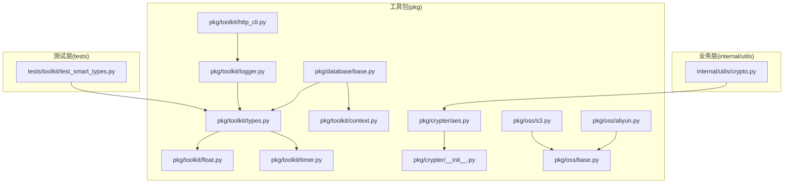
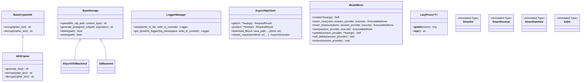
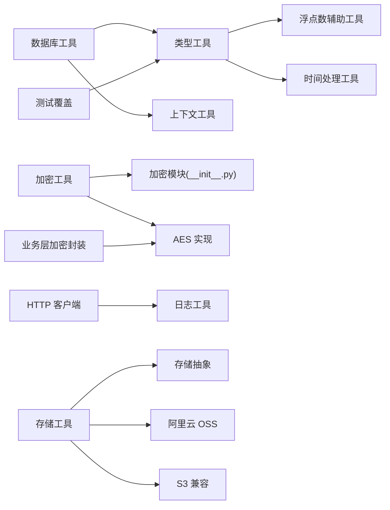

# 基础设施工具

<cite>
**本文引用的文件**
- [pkg/toolkit/http_cli.py](file://pkg/toolkit/http_cli.py)
- [pkg/toolkit/logger.py](file://pkg/toolkit/logger.py)
- [pkg/database/base.py](file://pkg/database/base.py)
- [pkg/crypter/__init__.py](file://pkg/crypter/__init__.py)
- [pkg/crypter/aes.py](file://pkg/crypter/aes.py)
- [pkg/oss/base.py](file://pkg/oss/base.py)
- [pkg/oss/aliyun.py](file://pkg/oss/aliyun.py)
- [pkg/oss/s3.py](file://pkg/oss/s3.py)
- [pkg/toolkit/types.py](file://pkg/toolkit/types.py)
- [pkg/toolkit/context.py](file://pkg/toolkit/context.py)
- [pkg/toolkit/float.py](file://pkg/toolkit/float.py)
- [pkg/toolkit/timer.py](file://pkg/toolkit/timer.py)
- [internal/utils/crypto.py](file://internal/utils/crypto.py)
- [pkg/database/__init__.py](file://pkg/database/__init__.py)
- [pkg/crypter/__init__.py](file://pkg/crypter/__init__.py)
- [pkg/oss/__init__.py](file://pkg/oss/__init__.py)
- [tests/toolkit/test_smart_types.py](file://tests/toolkit/test_smart_types.py)
</cite>

## 更新摘要
**变更内容**
- 智能类型系统重大增强：SmartInt/SmartDecimal/SmartDatetime 类型改进
- 新增 IntStr 类型：强制字符串 ID 类型
- LazyProxy 实现重构：支持泛型类型提示和完整类型推断
- 全面的测试覆盖增强：针对所有新功能的完整测试套件
- ISO 8601 解析优化：改进日期时间处理逻辑

## 目录
1. [简介](#简介)
2. [项目结构](#项目结构)
3. [核心组件](#核心组件)
4. [架构总览](#架构总览)
5. [组件详解](#组件详解)
6. [依赖关系分析](#依赖关系分析)
7. [性能考量](#性能考量)
8. [故障排查指南](#故障排查指南)
9. [结论](#结论)
10. [附录](#附录)

## 简介
本文件系统性梳理并文档化本项目的基础设施工具包，覆盖以下可复用能力：
- 数据库工具：基于 SQLAlchemy 2.x 的异步 ORM 基类、会话提供器、查询构建器与 DAO 事务执行器
- 加密工具：抽象加密接口与 AES 实现，支持注册表扩展
- HTTP 客户端：基于 httpx 的异步客户端，支持流式下载、进度回调、统一错误封装
- 日志工具：基于 loguru 的 LoggerManager，支持命名空间隔离、轮转、压缩、UTC 时间、JSON/文本格式
- 存储工具：抽象 OSS/S3 接口与阿里云 OSS、AWS S3 实现，支持注册表扩展
- 类型与上下文：智能类型（SmartInt/SmartDecimal/SmartDatetime/IntStr）、懒加载代理 LazyProxy、请求上下文管理

设计理念与模块化组织：
- 抽象先行：通过 ABC 与枚举注册表实现"可插拔"扩展，便于新增算法或存储后端
- 统一错误与返回：HTTP 客户端返回统一结果对象；数据库 DAO 统一执行与异常包装
- 可观测性：日志管理器内置 trace_id 注入与命名空间隔离，便于链路追踪
- 类型安全：通过 Pydantic 注解与 Smart* 类型，确保前后端数据一致性与精度

## 项目结构
工具包位于 pkg 目录下，按功能域划分：
- pkg/toolkit：通用工具（HTTP、日志、类型、上下文、序列化等）
- pkg/database：数据库 ORM 基类、DAO、查询构建器、类型
- pkg/crypter：加密抽象与 AES 实现
- pkg/oss：对象存储抽象与阿里云 OSS、S3 实现
- internal/utils：业务层对工具包的轻量封装（如 AES 单例）

```mermaid
graph TB
subgraph "工具包(pkg)"
TK_HTTP["pkg/toolkit/http_cli.py"]
TK_LOGGER["pkg/toolkit/logger.py"]
TK_TYPES["pkg/toolkit/types.py"]
TK_CTX["pkg/toolkit/context.py"]
TK_FLOAT["pkg/toolkit/float.py"]
TK_TIMER["pkg/toolkit/timer.py"]
DB_BASE["pkg/database/base.py"]
CRYPT_INIT["pkg/crypter/__init__.py"]
CRYPT_AES["pkg/crypter/aes.py"]
OSS_BASE["pkg/oss/base.py"]
OSS_ALI["pkg/oss/aliyun.py"]
OSS_S3["pkg/oss/s3.py"]
end
subgraph "业务层(internal/utils)"
UTILS_CRYPTO["internal/utils/crypto.py"]
end
subgraph "测试层(tests)"
TEST_SMART_TYPES["tests/toolkit/test_smart_types.py"]
end
UTILS_CRYPTO --> CRYPT_AES
DB_BASE --> TK_TYPES
DB_BASE --> TK_CTX
TK_LOGGER --> TK_TYPES
TK_HTTP --> TK_LOGGER
TK_TYPES --> TK_FLOAT
TK_TYPES --> TK_TIMER
OSS_ALI --> OSS_BASE
OSS_S3 --> OSS_BASE
CRYPT_AES --> CRYPT_INIT
TEST_SMART_TYPES --> TK_TYPES
```

**更新** 新增了类型工具的子模块依赖关系，包括 float.py 和 timer.py，以及完整的测试覆盖。

图表来源
- [pkg/toolkit/http_cli.py](file://pkg/toolkit/http_cli.py#L1-L232)
- [pkg/toolkit/logger.py](file://pkg/toolkit/logger.py#L1-L339)
- [pkg/toolkit/types.py](file://pkg/toolkit/types.py#L1-L278)
- [pkg/toolkit/float.py](file://pkg/toolkit/float.py#L1-L41)
- [pkg/toolkit/timer.py](file://pkg/toolkit/timer.py#L1-L80)
- [pkg/database/base.py](file://pkg/database/base.py#L1-L364)
- [pkg/crypter/__init__.py](file://pkg/crypter/__init__.py#L1-L107)
- [pkg/crypter/aes.py](file://pkg/crypter/aes.py#L1-L59)
- [pkg/oss/base.py](file://pkg/oss/base.py#L1-L42)
- [pkg/oss/aliyun.py](file://pkg/oss/aliyun.py#L1-L66)
- [pkg/oss/s3.py](file://pkg/oss/s3.py#L1-L83)
- [internal/utils/crypto.py](file://internal/utils/crypto.py#L1-L19)
- [tests/toolkit/test_smart_types.py](file://tests/toolkit/test_smart_types.py#L1-L278)

章节来源
- [pkg/toolkit/http_cli.py](file://pkg/toolkit/http_cli.py#L1-L232)
- [pkg/toolkit/logger.py](file://pkg/toolkit/logger.py#L1-L339)
- [pkg/toolkit/types.py](file://pkg/toolkit/types.py#L1-L278)
- [pkg/toolkit/float.py](file://pkg/toolkit/float.py#L1-L41)
- [pkg/toolkit/timer.py](file://pkg/toolkit/timer.py#L1-L80)
- [pkg/database/base.py](file://pkg/database/base.py#L1-L364)
- [pkg/crypter/__init__.py](file://pkg/crypter/__init__.py#L1-L107)
- [pkg/crypter/aes.py](file://pkg/crypter/aes.py#L1-L59)
- [pkg/oss/base.py](file://pkg/oss/base.py#L1-L42)
- [pkg/oss/aliyun.py](file://pkg/oss/aliyun.py#L1-L66)
- [pkg/oss/s3.py](file://pkg/oss/s3.py#L1-L83)
- [pkg/toolkit/context.py](file://pkg/toolkit/context.py#L1-L107)
- [internal/utils/crypto.py](file://internal/utils/crypto.py#L1-L19)
- [tests/toolkit/test_smart_types.py](file://tests/toolkit/test_smart_types.py#L1-L278)

## 核心组件
- 数据库工具：提供异步引擎工厂、会话提供器、ORM 基类与 Mixin、查询构建器、DAO 事务执行器、JSON 类型
- 加密工具：抽象接口与 AES 实现，支持注册表扩展与便捷函数
- HTTP 客户端：统一请求封装、流式下载、进度回调、错误归一化
- 日志工具：LoggerManager 管理器、命名空间隔离、轮转/保留/压缩、UTC 时间、JSON/文本格式
- 存储工具：抽象接口与阿里云 OSS、S3 实现，支持注册表扩展
- 类型与上下文：Smart* 类型、LazyProxy 懒加载代理、请求上下文管理

**更新** 类型与上下文组件现在包括智能类型系统（SmartInt/SmartDecimal/SmartDatetime/IntStr）和重构的 LazyProxy 实现。

章节来源
- [pkg/database/base.py](file://pkg/database/base.py#L1-L364)
- [pkg/crypter/__init__.py](file://pkg/crypter/__init__.py#L1-L107)
- [pkg/crypter/aes.py](file://pkg/crypter/aes.py#L1-L59)
- [pkg/toolkit/http_cli.py](file://pkg/toolkit/http_cli.py#L1-L232)
- [pkg/toolkit/logger.py](file://pkg/toolkit/logger.py#L1-L339)
- [pkg/oss/base.py](file://pkg/oss/base.py#L1-L42)
- [pkg/oss/aliyun.py](file://pkg/oss/aliyun.py#L1-L66)
- [pkg/oss/s3.py](file://pkg/oss/s3.py#L1-L83)
- [pkg/toolkit/types.py](file://pkg/toolkit/types.py#L1-L278)
- [pkg/toolkit/context.py](file://pkg/toolkit/context.py#L1-L107)

## 架构总览
工具包采用"抽象 + 注册表 + 业务轻封装"的分层设计：
- 抽象层：ABC 与枚举注册表，约束实现并提供统一入口
- 工具层：HTTP、日志、类型、上下文等通用能力
- 数据层：ORM 基类与 DAO，结合上下文与类型工具
- 业务层：对加密等工具进行单例化封装，暴露易用接口

```mermaid
classDiagram
class BaseCryptoUtil {
+encrypt(plain_text) str
+decrypt(cipher_text) str
}
class AESCipher {
+generate_key() str
+encrypt(plain_text) str
+decrypt(cipher_text) str
}
BaseCryptoUtil <|-- AESCipher
class BaseStorage {
+upload(file_obj, path, content_type) str
+generate_presigned_url(path, expiration) str
+delete(path) bool
+exists(path) bool
}
class AliyunOSSBackend
class S3Backend
BaseStorage <|-- AliyunOSSBackend
BaseStorage <|-- S3Backend
class LoggerManager {
+setup(write_to_file, write_to_console) Logger
+get_dynamic_logger(log_namespace, write_to_console) Logger
}
class AsyncHttpClient {
+get(url, **kwargs) RequestResult
+post(url, **kwargs) RequestResult
+download_file(url, save_path, ...) (bool, str)
+stream_request(method, url, ...) AsyncGenerator
}
class ModelMixin {
+create(**kwargs) Self
+insert_rows(rows, session_provider, execute) Executable|None
+insert_instances(items, session_provider, execute) Executable|None
+save(session_provider, execute) Executable|None
+update(session_provider, **kwargs) Self
+soft_delete(session_provider) void
+restore(session_provider) void
}
class LazyProxy~T~ {
+__getattr__(name) Any
+__repr__() str
}
class SmartInt {
<<Annotated Type>>
}
class SmartDecimal {
<<Annotated Type>>
}
class SmartDatetime {
<<Annotated Type>>
}
class IntStr {
<<Annotated Type>>
}
```

**更新** 类图现在包含了新的智能类型（SmartInt、SmartDecimal、SmartDatetime、IntStr）和重构的 LazyProxy 类。

图表来源
- [pkg/crypter/__init__.py](file://pkg/crypter/__init__.py#L51-L67)
- [pkg/crypter/aes.py](file://pkg/crypter/aes.py#L6-L44)
- [pkg/oss/base.py](file://pkg/oss/base.py#L26-L42)
- [pkg/oss/aliyun.py](file://pkg/oss/aliyun.py#L9-L66)
- [pkg/oss/s3.py](file://pkg/oss/s3.py#L11-L83)
- [pkg/toolkit/logger.py](file://pkg/toolkit/logger.py#L21-L143)
- [pkg/toolkit/http_cli.py](file://pkg/toolkit/http_cli.py#L38-L232)
- [pkg/database/base.py](file://pkg/database/base.py#L60-L304)
- [pkg/toolkit/types.py](file://pkg/toolkit/types.py#L52-L208)
- [pkg/toolkit/types.py](file://pkg/toolkit/types.py#L237-L278)

## 组件详解

### 数据库工具
- 异步引擎工厂：支持连接池参数、JSON 序列化器替换
- 会话提供器：上下文管理器形式的 SessionProvider
- ORM 基类与 Mixin：统一主键、审计字段、软删除、批量插入、严格保存/更新
- 查询构建器：计数、查询、更新构建器（由包导出）
- DAO 事务执行器：统一执行与异常包装
- JSON 类型：自定义 JSONType（由包导出）

配置项与行为要点
- 引擎工厂参数：数据库 URI、echo、pool_pre_ping、pool_size、max_overflow、pool_timeout、pool_recycle、JSON 序列化器
- Mixin 字段：id、creator_id、created_at、updater_id、updated_at、deleted_at
- 执行模式：execute=True 时执行并返回 None；execute=False 时返回语句对象
- 上下文默认值：来自上下文变量，包含当前时间与用户 ID

使用示例与最佳实践
- 使用工厂创建引擎与会话提供器，注入到各 DAO
- 批量插入优先使用 insert_rows 或 insert_instances，减少往返
- 严格区分 save（仅插入新对象）与 update（仅更新已存在对象）
- 软删除场景使用 soft_delete/restore，避免物理删除

章节来源
- [pkg/database/base.py](file://pkg/database/base.py#L19-L46)
- [pkg/database/base.py](file://pkg/database/base.py#L60-L304)
- [pkg/database/__init__.py](file://pkg/database/__init__.py#L1-L29)

### 加密工具
- 抽象接口：BaseCryptoUtil，定义 encrypt/decrypt
- AES 实现：AESCipher，基于 Fernet，支持生成密钥与便捷函数
- 注册表：EncryptionAlgorithm 枚举 + _ALGORITHM_REGISTRY，装饰器 register_algorithm 自动注册
- 业务封装：internal/utils/crypto.py 提供 AES 单例代理

**更新** 加密工具的结构已简化，所有核心组件都集中在 `pkg/crypter/__init__.py` 中。`BaseCryptoUtil` 抽象基类、`EncryptionAlgorithm` 枚举、注册表和工厂函数现在都在这个单一文件中管理，使得加密工具的使用更加直观和简洁。

配置项与行为要点
- AES 密钥：需为 32 字节 URL 安全 Base64 编码字符串
- 错误处理：无效令牌或错误密钥抛出异常
- 算法扩展：通过 register_algorithm 与 get_crypto_class 动态获取实现类
- 模块导出：通过 `__all__` 明确导出接口，支持直接从包导入

使用示例与最佳实践
- 通过 get_crypto_class 获取对应算法类，避免硬编码
- 使用 LazyProxy 将初始化延迟到运行时，避免模块导入时未配置
- 密钥管理：使用安全的密钥存储与轮换策略
- 直接从包导入：`from pkg.crypter import AESCipher, get_crypto_class, EncryptionAlgorithm`

章节来源
- [pkg/crypter/__init__.py](file://pkg/crypter/__init__.py#L51-L95)
- [pkg/crypter/aes.py](file://pkg/crypter/aes.py#L6-L59)
- [pkg/crypter/__init__.py](file://pkg/crypter/__init__.py#L98-L107)
- [internal/utils/crypto.py](file://internal/utils/crypto.py#L7-L19)

### HTTP 客户端
- 统一封装：AsyncHttpClient，基于 httpx.AsyncClient
- 请求方法：get/post/put/delete，统一返回 RequestResult
- 流式下载：download_file 支持进度回调与目录自动创建
- 错误处理：统一捕获 HTTPStatusError、RequestError 与未知异常
- 日志集成：请求与下载过程记录日志

配置项与行为要点
- 构造参数：base_url、timeout、headers、verify
- RequestResult：包含 status_code、response、error、success 属性与 json() 方法
- 流式请求：stream_request 支持按块读取字节流

使用示例与最佳实践
- 使用 with 上下文管理器确保连接关闭
- 对大文件下载使用 download_file 并设置合适的 chunk_size
- 对外部服务调用统一走此客户端，便于统一日志与错误处理

章节来源
- [pkg/toolkit/http_cli.py](file://pkg/toolkit/http_cli.py#L38-L232)

### 日志工具
- LoggerManager：集中配置日志级别、轮转、保留、压缩、UTC、格式（JSON/文本）
- 命名空间：支持系统日志与动态命名空间，按命名空间隔离输出
- Trace ID：自动从上下文注入，便于链路追踪
- 格式化器：控制台与文件分别支持 JSON 与文本格式

配置项与行为要点
- 构造参数：level、base_log_dir、system_subdir、rotation、retention、compression、use_utc、enqueue、log_format
- setup：一次性应用配置，支持控制台与文件输出
- get_dynamic_logger：按命名空间动态注册 Sink，支持单独输出到控制台

使用示例与最佳实践
- 生产环境建议使用 JSON 格式与 UTC 时间
- 轮转策略与保留期应结合磁盘容量与合规要求配置
- 通过命名空间区分模块日志，便于检索与告警

章节来源
- [pkg/toolkit/logger.py](file://pkg/toolkit/logger.py#L21-L339)

### 存储工具
- 抽象接口：BaseStorage，定义 upload/generate_presigned_url/delete/exists
- 注册表：StorageType 枚举 + _STORAGE_REGISTRY，装饰器 register_storage 自动注册
- 实现：阿里云 OSS 与 S3 兼容实现，均支持多种输入类型与预签名 URL

配置项与行为要点
- 阿里云 OSS：支持 endpoint/region 自动推断，返回签名 URL
- S3：支持 endpoint 自定义，返回对象访问 URL
- 错误处理：捕获 SDK 特定异常并转换为统一异常

使用示例与最佳实践
- 通过 get_storage_class 获取后端类，避免硬编码
- 预签名 URL 用于临时授权访问，注意过期时间设置
- 上传前确保桶存在且权限正确

章节来源
- [pkg/oss/base.py](file://pkg/oss/base.py#L6-L42)
- [pkg/oss/aliyun.py](file://pkg/oss/aliyun.py#L16-L66)
- [pkg/oss/s3.py](file://pkg/oss/s3.py#L18-L83)
- [pkg/oss/__init__.py](file://pkg/oss/__init__.py#L22-L34)

### 类型与上下文
- 智能类型系统：SmartInt、SmartDecimal、SmartDatetime、IntStr，统一输入解析与 JSON 序列化策略
- LazyProxy：重构的通用懒加载代理，支持完整类型提示与泛型支持
- 请求上下文：init/get/set/clear，提供 user_id 与 trace_id 的读写

**更新** 智能类型系统进行了重大增强，包括更好的布尔值拒绝、整数支持、ISO 8601 解析优化，以及新增的 IntStr 类型。LazyProxy 实现重构，支持泛型类型提示。

#### 智能类型系统增强
- **SmartInt**：改进的整数类型，拒绝布尔值输入，支持 JS 安全范围检测
- **SmartDecimal**：改进的浮点数类型，支持更精确的浮点范围判断
- **SmartDatetime**：优化的日期时间类型，改进 ISO 8601 解析逻辑
- **IntStr**：新增的强制字符串 ID 类型，拒绝非整数/字符串输入

#### LazyProxy 重构
- 支持泛型类型提示（`_LazyProxy[T]`）
- 完整的类型推断支持
- 改进的 `__repr__` 方法，支持未初始化状态显示

使用示例与最佳实践
- 使用智能类型确保前后端数据一致性与精度
- 对延迟初始化的资源使用 LazyProxy，避免导入时未就绪
- 在中间件中初始化上下文，确保后续组件可读取 trace_id 与 user_id
- 利用完整的测试覆盖验证类型行为

章节来源
- [pkg/toolkit/types.py](file://pkg/toolkit/types.py#L1-L278)
- [pkg/toolkit/context.py](file://pkg/toolkit/context.py#L1-L107)
- [pkg/toolkit/float.py](file://pkg/toolkit/float.py#L1-L41)
- [pkg/toolkit/timer.py](file://pkg/toolkit/timer.py#L1-L80)
- [tests/toolkit/test_smart_types.py](file://tests/toolkit/test_smart_types.py#L1-L278)

## 依赖关系分析
- 数据库工具依赖类型与上下文工具，提供统一的 ORM 基类与 Mixin
- 加密工具通过注册表实现可插拔扩展，业务层通过工厂函数获取实现
- HTTP 客户端依赖日志工具进行可观测性
- 存储工具通过注册表实现可插拔扩展，阿里云与 S3 实现均继承抽象基类
- 业务层对加密工具进行单例化封装，降低使用复杂度
- 类型工具依赖 float.py 和 timer.py 提供的辅助功能

**更新** 类型工具现在依赖 float.py 和 timer.py 模块，这些模块提供了智能类型系统所需的辅助功能。

```mermaid
graph LR
DB["数据库工具"] --> TYPES["类型工具"]
DB --> CTX["上下文工具"]
TYPES --> FLOAT["浮点数辅助工具"]
TYPES --> TIMER["时间处理工具"]
CRYPT["加密工具"] --> CRYPT_INIT["加密模块(__init__.py)"]
CRYPT --> CRYPT_AES["AES 实现"]
HTTP["HTTP 客户端"] --> LOGGER["日志工具"]
OSS["存储工具"] --> OSS_BASE["存储抽象"]
OSS --> OSS_ALI["阿里云 OSS"]
OSS --> OSS_S3["S3 兼容"]
UTILS_CRYPTO["业务层加密封装"] --> CRYPT_AES
TESTS["测试覆盖"] --> TYPES
```

**更新** 图表现在反映了类型工具的依赖关系，包括对 float.py 和 timer.py 的依赖，以及测试覆盖的完整性。

图表来源
- [pkg/database/base.py](file://pkg/database/base.py#L1-L15)
- [pkg/toolkit/types.py](file://pkg/toolkit/types.py#L1-L9)
- [pkg/toolkit/float.py](file://pkg/toolkit/float.py#L1-L41)
- [pkg/toolkit/timer.py](file://pkg/toolkit/timer.py#L1-L80)
- [pkg/toolkit/context.py](file://pkg/toolkit/context.py#L1-L5)
- [pkg/crypter/__init__.py](file://pkg/crypter/__init__.py#L1-L107)
- [pkg/crypter/aes.py](file://pkg/crypter/aes.py#L1-L59)
- [pkg/toolkit/http_cli.py](file://pkg/toolkit/http_cli.py#L10-L10)
- [pkg/oss/aliyun.py](file://pkg/oss/aliyun.py#L1-L7)
- [pkg/oss/s3.py](file://pkg/oss/s3.py#L1-L8)
- [internal/utils/crypto.py](file://internal/utils/crypto.py#L1-L3)
- [tests/toolkit/test_smart_types.py](file://tests/toolkit/test_smart_types.py#L1-L15)

章节来源
- [pkg/database/base.py](file://pkg/database/base.py#L1-L15)
- [pkg/toolkit/types.py](file://pkg/toolkit/types.py#L1-L9)
- [pkg/toolkit/float.py](file://pkg/toolkit/float.py#L1-L41)
- [pkg/toolkit/timer.py](file://pkg/toolkit/timer.py#L1-L80)
- [pkg/toolkit/context.py](file://pkg/toolkit/context.py#L1-L5)
- [pkg/crypter/__init__.py](file://pkg/crypter/__init__.py#L1-L107)
- [pkg/crypter/aes.py](file://pkg/crypter/aes.py#L1-L59)
- [pkg/toolkit/http_cli.py](file://pkg/toolkit/http_cli.py#L10-L10)
- [pkg/oss/aliyun.py](file://pkg/oss/aliyun.py#L1-L7)
- [pkg/oss/s3.py](file://pkg/oss/s3.py#L1-L8)
- [internal/utils/crypto.py](file://internal/utils/crypto.py#L1-L3)
- [tests/toolkit/test_smart_types.py](file://tests/toolkit/test_smart_types.py#L1-L15)

## 性能考量
- HTTP 客户端
  - 使用长连接与单例实例，避免频繁创建连接
  - 大文件下载使用流式下载与合理 chunk_size，减少内存占用
  - 统一超时与重试策略，避免阻塞
- 数据库
  - 合理配置连接池参数，避免连接泄漏
  - 批量插入优先使用 insert_rows/insert_instances
  - 软删除避免物理删除带来的索引维护成本
- 日志
  - 控制台与文件输出分离，避免阻塞
  - JSON 格式便于日志采集与检索，文本格式便于人工阅读
  - 轮转与保留策略平衡磁盘占用与历史留存
- 加密
  - AES 密钥长度与编码规范，避免重复生成导致的性能损耗
  - 使用 LazyProxy 延迟初始化，减少启动开销
  - 简化的模块结构减少了导入时的开销
- 存储
  - 预签名 URL 用于临时访问，减少服务器压力
  - S3/OSS 的 endpoint/region 配置影响网络延迟与可用性
- 类型系统
  - 智能类型解析器使用缓存友好的设计，避免重复计算
  - LazyProxy 仅在首次访问时触发延迟初始化
  - 浮点数范围检查使用高效的 Decimal 操作

**更新** 性能考量中增加了类型系统的性能优化说明，包括智能类型的缓存友好设计和 LazyProxy 的延迟初始化机制。

## 故障排查指南
- HTTP 客户端
  - 统一错误封装：检查 RequestResult.error 与 status_code
  - 流式下载失败：确认目标目录存在与权限，检查 on_progress 回调
- 数据库
  - 执行失败：查看 _execute_or_return 的异常包装信息
  - 字段缺失：确认 Mixin 的审计字段是否存在
- 日志
  - 未初始化：调用 setup() 后再获取动态日志器
  - trace_id 为空：检查中间件是否正确初始化上下文
- 加密
  - 无效密钥：确认密钥为 32 字节 URL 安全 Base64 编码
  - 解密失败：核对密钥与令牌有效性
  - 模块导入错误：确认从正确的包路径导入
- 存储
  - SDK 异常：捕获并查看具体异常信息，确认桶与权限
  - 预签名 URL 无法访问：检查过期时间与 endpoint 配置
- 类型系统
  - 智能类型验证失败：检查输入类型是否符合要求（拒绝布尔值）
  - LazyProxy 初始化错误：确认 getter 函数是否正确实现
  - ISO 8601 解析失败：检查日期字符串格式是否符合标准
  - 浮点数精度问题：确认 Decimal 值是否在安全范围内

**更新** 故障排查指南中增加了类型系统的故障排查指导，包括智能类型验证、LazyProxy 初始化和日期时间解析等问题的解决方案。

章节来源
- [pkg/toolkit/http_cli.py](file://pkg/toolkit/http_cli.py#L146-L156)
- [pkg/database/base.py](file://pkg/database/base.py#L283-L304)
- [pkg/toolkit/logger.py](file://pkg/toolkit/logger.py#L158-L162)
- [pkg/crypter/aes.py](file://pkg/crypter/aes.py#L19-L24)
- [pkg/oss/aliyun.py](file://pkg/oss/aliyun.py#L50-L51)
- [pkg/oss/s3.py](file://pkg/oss/s3.py#L55-L56)
- [pkg/toolkit/types.py](file://pkg/toolkit/types.py#L28-L37)
- [pkg/toolkit/types.py](file://pkg/toolkit/types.py#L188-L194)
- [pkg/toolkit/types.py](file://pkg/toolkit/types.py#L273-L277)

## 结论
本工具包通过抽象与注册表实现了高度模块化与可扩展性，结合统一的错误处理、可观测性与类型安全，为上层业务提供了稳定可靠的基础设施。智能类型系统的重大增强进一步提升了数据处理的准确性和安全性。建议在生产环境中：
- 明确各组件的配置边界与默认值
- 通过中间件与懒加载代理统一初始化流程
- 建立完善的监控与告警，结合日志命名空间与 trace_id 进行定位
- 利用简化的加密工具结构，减少模块导入时的复杂性
- 充分利用智能类型系统，确保数据在传输和存储过程中的准确性

**更新** 结论部分增加了关于智能类型系统增强和最佳实践的建议，强调了类型安全在生产环境中的重要性。

## 附录
- 扩展机制
  - 加密：通过 register_algorithm 与 get_crypto_class 注册新算法
  - 存储：通过 register_storage 与 get_storage_class 注册新后端
  - 类型：通过 Pydantic Annotated 类型系统扩展新的智能类型
- 最佳实践
  - 统一使用 LazyProxy 管理单例
  - 在中间件中初始化上下文，确保 trace_id 与 user_id 可用
  - 对外部依赖统一收敛到 HTTP 客户端与存储客户端
  - 利用简化的加密工具结构，直接从包导入所需组件
  - 充分利用智能类型系统，确保数据在传输和存储过程中的准确性
  - 使用完整的测试覆盖验证类型行为的正确性

**更新** 附录中增加了关于智能类型系统扩展机制和最佳实践的建议，强调了类型安全的重要性。