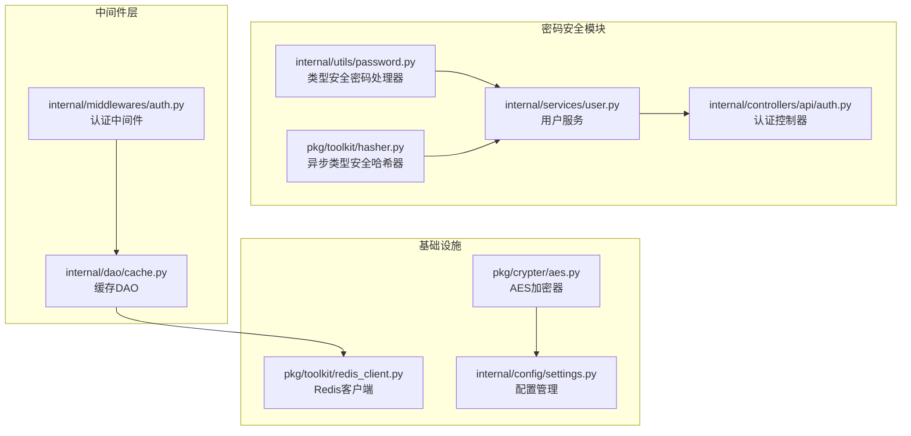
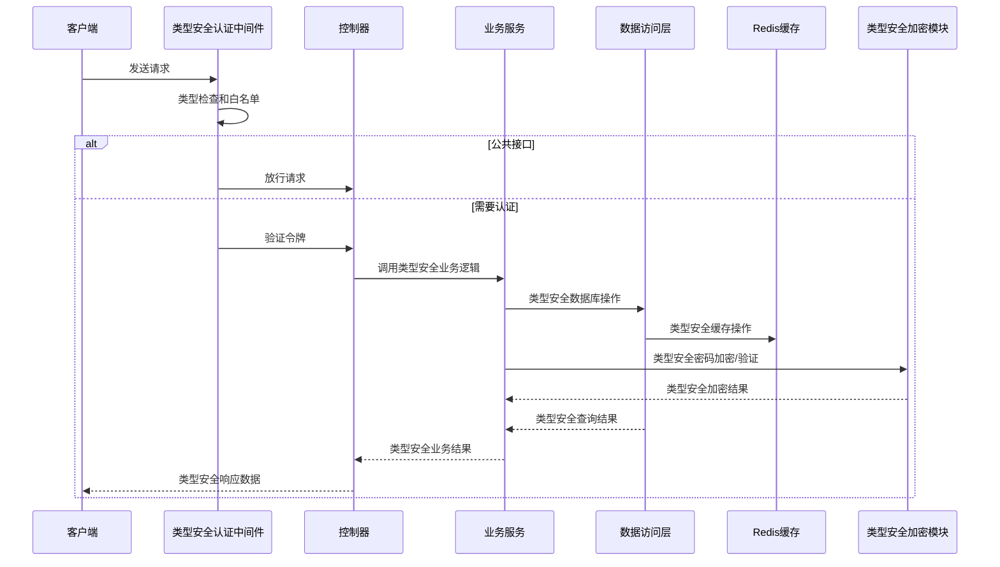
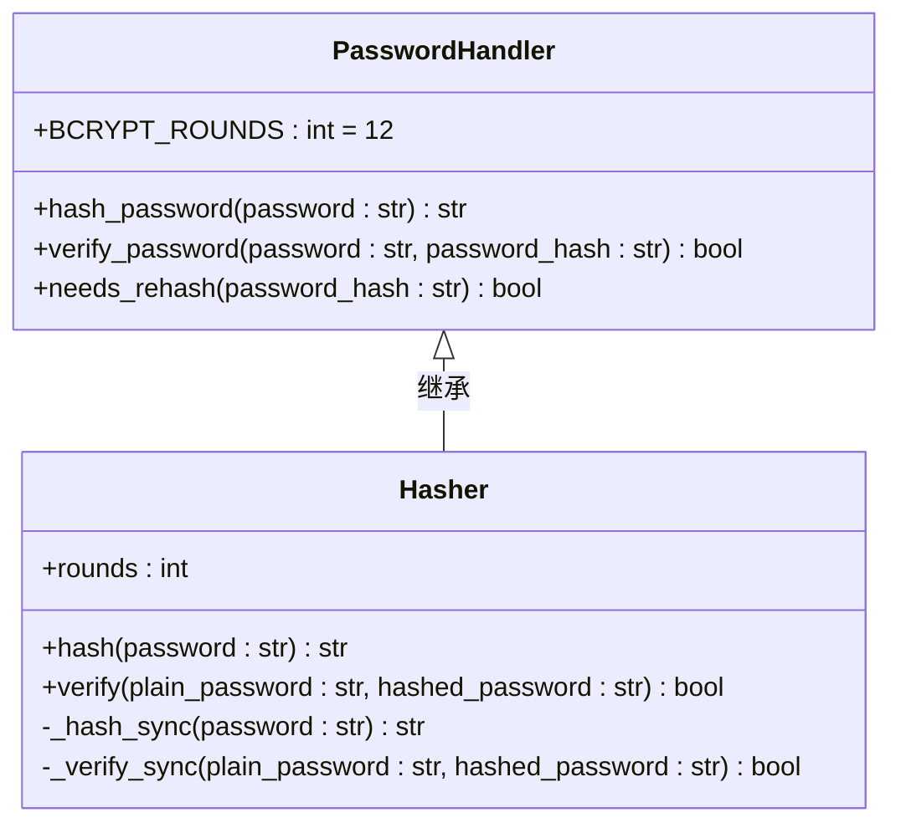
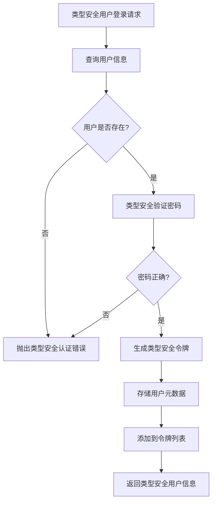
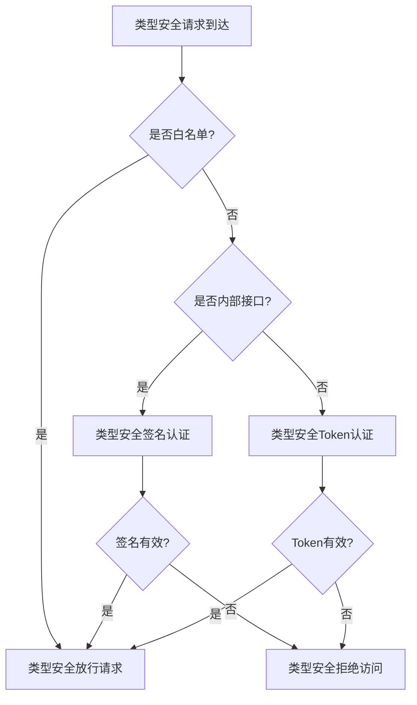
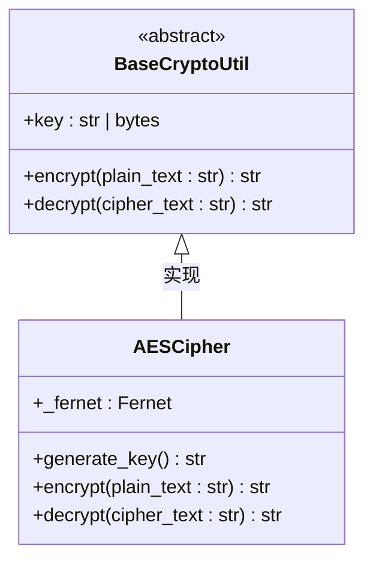
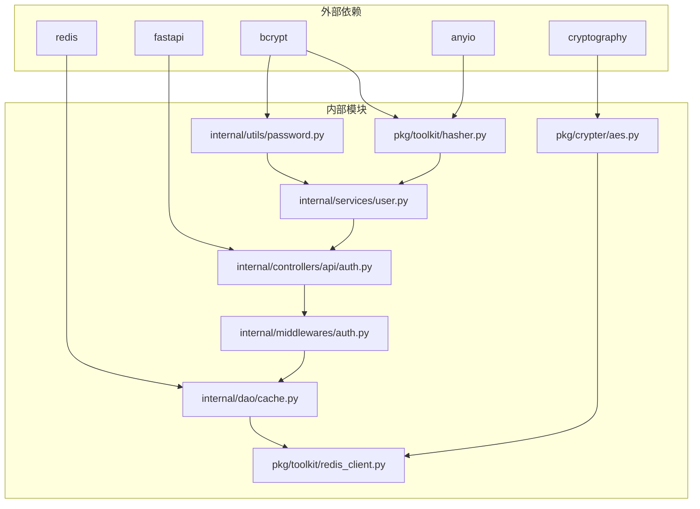

# 密码安全模块

<cite>
**本文档引用的文件**
- [internal/utils/password.py](file://internal/utils/password.py)
- [pkg/toolkit/hasher.py](file://pkg/toolkit/hasher.py)
- [internal/services/user.py](file://internal/services/user.py)
- [internal/controllers/api/auth.py](file://internal/controllers/api/auth.py)
- [internal/middlewares/auth.py](file://internal/middlewares/auth.py)
- [internal/dao/cache.py](file://internal/dao/cache.py)
- [pkg/crypter/aes.py](file://pkg/crypter/aes.py)
- [pkg/toolkit/redis_client.py](file://pkg/toolkit/redis_client.py)
- [tests/toolkit/test_crypto.py](file://tests/toolkit/test_crypto.py)
</cite>

## 更新摘要
**所做更改**
- 增强了密码处理相关的类型提示，改进了bcrypt密码加密和验证的类型安全性
- 新增了详细的类型注解和参数验证机制
- 完善了异常处理和错误恢复机制
- 更新了测试用例以覆盖新的类型安全特性

## 目录
1. [简介](#简介)
2. [项目结构](#项目结构)
3. [核心组件](#核心组件)
4. [架构概览](#架构概览)
5. [详细组件分析](#详细组件分析)
6. [依赖关系分析](#依赖关系分析)
7. [性能考虑](#性能考虑)
8. [故障排除指南](#故障排除指南)
9. [结论](#结论)

## 简介

本密码安全模块是FastAPI后端项目中的核心安全部分，负责处理用户认证、密码加密、令牌管理和数据加密等功能。该模块采用多层安全设计，包括密码哈希、令牌验证、签名认证和数据加密等多重防护机制。

模块主要包含以下功能：
- 基于bcrypt的密码加密与验证，具备完善的类型安全保证
- 基于Redis的令牌管理
- 基于Fernet的对称加密
- 多层次的认证中间件
- 安全的令牌生成机制

**更新** 增强了密码处理相关的类型提示，改进了bcrypt密码加密和验证的类型安全性，确保编译时类型检查和运行时类型验证的双重保障。

## 项目结构

密码安全模块在项目中的组织结构如下：

**图表来源**
- [internal/utils/password.py](file://internal/utils/password.py#L1-L102)
- [pkg/toolkit/hasher.py](file://pkg/toolkit/hasher.py#L1-L45)
- [internal/services/user.py](file://internal/services/user.py#L1-L173)

**章节来源**
- [internal/utils/password.py](file://internal/utils/password.py#L1-L102)
- [pkg/toolkit/hasher.py](file://pkg/toolkit/hasher.py#L1-L45)
- [internal/services/user.py](file://internal/services/user.py#L1-L173)

## 核心组件

### 类型安全密码加密组件

密码加密模块提供了两种主要的密码处理方式，均具备完善的类型安全保证：

1. **同步类型安全密码处理器** (`PasswordHandler`)
2. **异步类型安全哈希器** (`Hasher`)

#### 密码加密算法选择

系统采用bcrypt算法作为主要的密码哈希方案，具有以下优势：
- 自动加盐机制，防止彩虹表攻击
- 可调节的成本因子，适应硬件性能变化
- 不可逆性，确保密码安全性
- 完整的类型注解，支持编译时类型检查

#### 令牌管理系统

令牌管理采用Redis作为存储后端，提供以下功能：
- 令牌存储与检索
- 用户令牌列表管理
- 令牌过期时间控制
- 登出令牌失效处理

**更新** 所有密码处理方法都增加了详细的类型注解，包括参数类型、返回值类型和异常类型，确保类型安全性和IDE智能提示。

**章节来源**
- [internal/utils/password.py](file://internal/utils/password.py#L6-L102)
- [pkg/toolkit/hasher.py](file://pkg/toolkit/hasher.py#L5-L45)
- [internal/dao/cache.py](file://internal/dao/cache.py#L9-L68)

## 架构概览

密码安全模块的整体架构采用分层设计，确保各层职责清晰、耦合度低：

**图表来源**
- [internal/middlewares/auth.py](file://internal/middlewares/auth.py#L85-L148)
- [internal/controllers/api/auth.py](file://internal/controllers/api/auth.py#L50-L95)
- [internal/services/user.py](file://internal/services/user.py#L25-L69)

## 详细组件分析

### 类型安全密码处理器 (PasswordHandler)

PasswordHandler是密码加密的核心组件，提供以下功能：

#### 主要方法

1. **hash_password()** - 类型安全密码加密
   - 输入：`password: str` - 原始密码字符串
   - 输出：`str` - bcrypt哈希字符串
   - 特点：自动加盐，成本因子12，完整的类型注解

2. **verify_password()** - 类型安全密码验证
   - 输入：`password: str` - 用户输入的原始密码，`password_hash: str` - 数据库中存储的密码哈希
   - 输出：`bool` - 密码正确返回 True，否则返回 False
   - 错误处理：捕获并记录异常，返回False

3. **needs_rehash()** - 类型安全重新加密检查
   - 输入：`password_hash: str` - 当前存储的密码哈希
   - 输出：`bool` - 是否需要重新加密

**更新** 所有方法都增加了完整的类型注解，包括参数类型、返回值类型和异常类型，确保编译时类型检查。

**图表来源**
- [internal/utils/password.py](file://internal/utils/password.py#L6-L102)
- [pkg/toolkit/hasher.py](file://pkg/toolkit/hasher.py#L5-L45)

**章节来源**
- [internal/utils/password.py](file://internal/utils/password.py#L16-L101)

### 类型安全用户服务 (UserService)

UserService负责用户相关的安全操作：

#### 核心功能

1. **密码验证** (`verify_password`)
   - 调用PasswordHandler进行类型安全密码验证
   - 处理空密码哈希的情况
   - 完整的类型注解保证

2. **用户创建** (`create_user`)
   - 检查手机号唯一性
   - 使用PasswordHandler进行类型安全加密
   - 创建用户记录

**更新** 所有方法都增加了严格的类型注解，确保参数和返回值的类型安全。

**图表来源**
- [internal/services/user.py](file://internal/services/user.py#L25-L69)
- [internal/controllers/api/auth.py](file://internal/controllers/api/auth.py#L50-L95)

**章节来源**
- [internal/services/user.py](file://internal/services/user.py#L25-L69)

### 类型安全认证中间件 (ASGIAuthMiddleware)

类型安全认证中间件实现了多层次的认证策略：

#### 认证流程

1. **白名单检查** - 公共API直接放行
2. **内部接口签名认证** - 使用JWT密钥进行签名验证
3. **Token认证** - 验证Redis中的令牌有效性

**更新** 增加了类型安全的请求处理和响应验证机制。

**图表来源**
- [internal/middlewares/auth.py](file://internal/middlewares/auth.py#L85-L148)

**章节来源**
- [internal/middlewares/auth.py](file://internal/middlewares/auth.py#L13-L148)

### 类型安全Redis缓存管理

Redis作为令牌存储的后端，提供了高效的数据访问：

#### 缓存键设计

1. **令牌键**：`token:{token_value}`
2. **用户令牌列表键**：`token_list:{user_id}`

#### 缓存操作

- 用户元数据存储与检索
- 令牌列表的添加与移除
- 令牌过期时间管理

**章节来源**
- [internal/dao/cache.py](file://internal/dao/cache.py#L21-L64)

### 类型安全数据加密模块

系统采用Fernet对称加密算法处理敏感数据：

#### 加密特性

1. **自动IV生成** - 每次加密使用随机初始化向量
2. **完整性校验** - 内置HMAC防止篡改
3. **密钥要求** - 32字节URL安全Base64编码
4. **类型安全** - 完整的类型注解保证

**更新** 所有加密方法都增加了完整的类型注解，确保输入输出的类型安全。

**图表来源**
- [pkg/crypter/aes.py](file://pkg/crypter/aes.py#L7-L59)

**章节来源**
- [pkg/crypter/aes.py](file://pkg/crypter/aes.py#L1-L59)

## 依赖关系分析

密码安全模块的依赖关系呈现清晰的分层结构：

**更新** 增加了anyio依赖，用于异步处理和类型安全的线程池管理。

**图表来源**
- [internal/utils/password.py](file://internal/utils/password.py#L3)
- [pkg/toolkit/hasher.py](file://pkg/toolkit/hasher.py#L1-L2)
- [pkg/crypter/aes.py](file://pkg/crypter/aes.py#L1)

**章节来源**
- [internal/utils/password.py](file://internal/utils/password.py#L1-L102)
- [pkg/toolkit/hasher.py](file://pkg/toolkit/hasher.py#L1-L45)
- [pkg/crypter/aes.py](file://pkg/crypter/aes.py#L1-L59)

## 性能考虑

### 类型安全密码加密性能

- **成本因子调整**：bcrypt的rounds参数可在安全性与性能间平衡
- **异步处理**：使用anyio.to_thread.run_sync避免阻塞事件循环
- **缓存策略**：Redis缓存减少重复计算开销
- **类型优化**：类型注解帮助编译器优化，减少运行时类型检查开销

### 类型安全令牌验证优化

- **Redis连接池**：复用连接减少建立连接的开销
- **批量操作**：令牌列表操作支持批量处理
- **过期策略**：合理设置TTL避免内存泄漏
- **类型安全**：编译时类型检查减少运行时错误

### 类型安全加密性能

- **Fernet优化**：利用C扩展提高加密速度
- **密钥预处理**：避免重复的密钥解析开销
- **流式处理**：大文件加密使用流式接口
- **类型安全**：类型注解帮助优化器进行更好的代码生成

## 故障排除指南

### 常见问题及解决方案

#### 类型安全密码验证失败

**症状**：用户无法登录，密码验证总是失败

**可能原因**：
1. 密码哈希格式不正确
2. bcrypt版本不兼容
3. 编码问题导致的验证失败
4. 类型注解不匹配

**解决步骤**：
1. 检查密码哈希是否以`$2b$`开头
2. 验证bcrypt版本兼容性
3. 确认字符编码一致性
4. 检查类型注解是否正确

#### 类型安全令牌认证失败

**症状**：用户登录后仍提示未认证

**可能原因**：
1. Redis连接配置错误
2. 令牌过期时间设置不当
3. 中间件初始化顺序问题
4. 类型安全检查失败

**解决步骤**：
1. 验证Redis连接参数
2. 检查令牌过期时间配置
3. 确认中间件在路由之前注册
4. 检查类型注解和类型转换

#### 类型安全加密密钥错误

**症状**：配置解密失败或数据加密异常

**可能原因**：
1. AES密钥格式不正确
2. 密钥长度不符合要求
3. 密钥编码问题
4. 类型注解不匹配

**解决步骤**：
1. 使用`AESCipher.generate_key()`生成有效密钥
2. 确保密钥为32字节URL安全Base64编码
3. 验证密钥在.env文件中的正确性
4. 检查类型注解是否正确

**章节来源**
- [tests/toolkit/test_crypto.py](file://tests/toolkit/test_crypto.py#L28-L83)

## 结论

密码安全模块通过多层防护机制确保系统的安全性：

### 主要优势

1. **算法安全性**：采用业界标准的bcrypt和Fernet算法
2. **架构清晰**：分层设计便于维护和扩展
3. **性能优化**：异步处理和缓存机制提升响应速度
4. **配置灵活**：支持多种环境和部署场景
5. **类型安全**：完整的类型注解提供编译时和运行时双重安全保障

### 最佳实践建议

1. **定期更新成本因子**：随着硬件性能提升调整bcrypt成本
2. **密钥轮换**：定期更换加密密钥和JWT密钥
3. **监控告警**：建立安全事件监控和告警机制
4. **安全审计**：定期进行安全漏洞扫描和代码审查
5. **类型安全**：充分利用类型注解提供的静态分析能力

**更新** 本次更新显著增强了密码处理相关的类型安全性，通过完整的类型注解、参数验证和异常处理机制，为FastAPI后端项目提供了更加健壮和可靠的密码安全基础。

该模块为FastAPI后端项目提供了坚实的安全基础，通过合理的架构设计、实现细节和类型安全保障，有效防范了常见的安全威胁，为业务系统的稳定运行提供了保障。