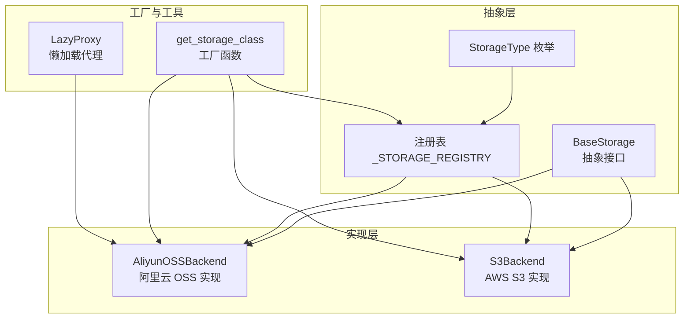
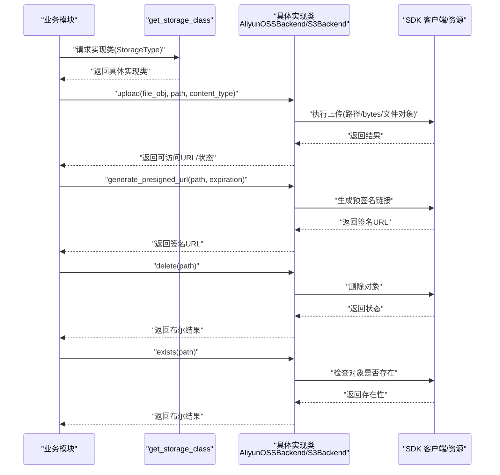
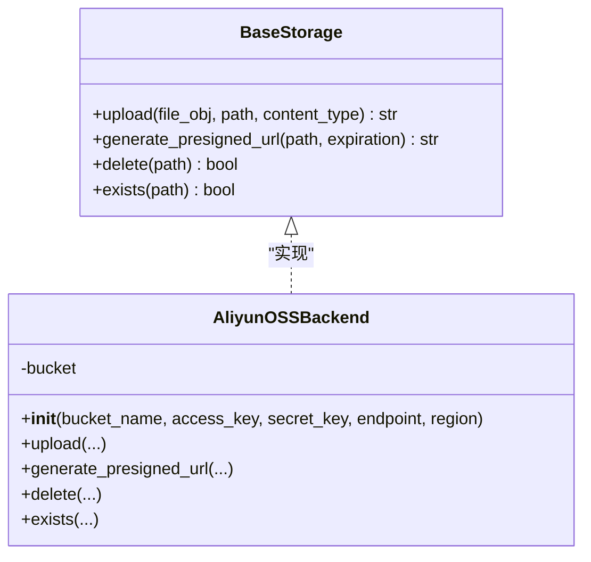
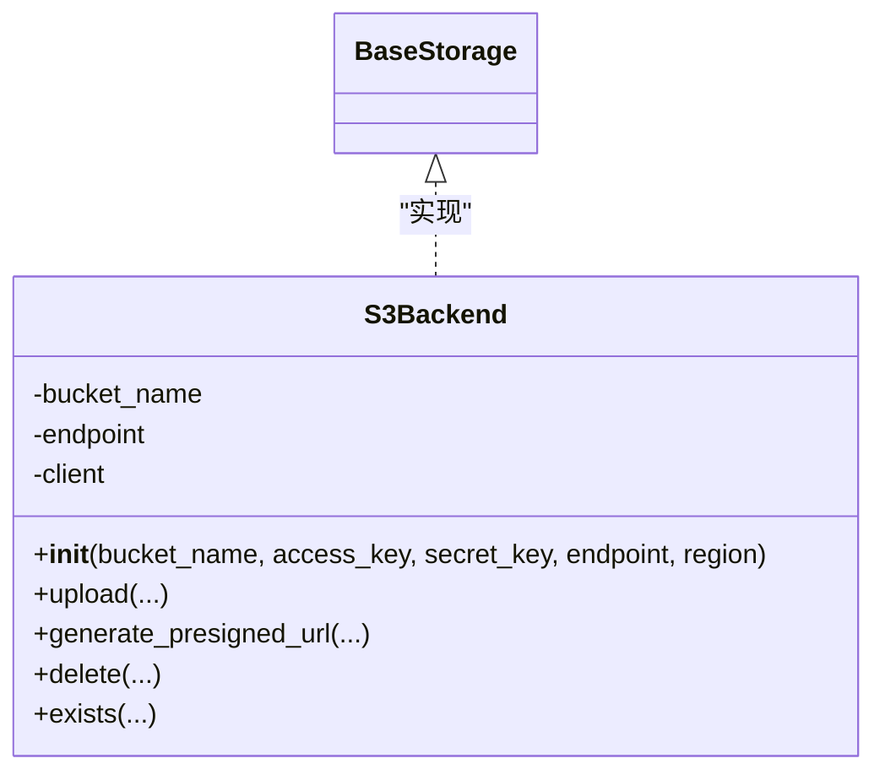
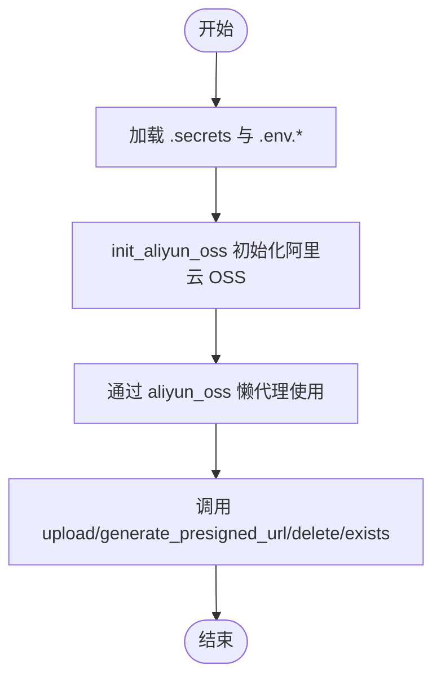
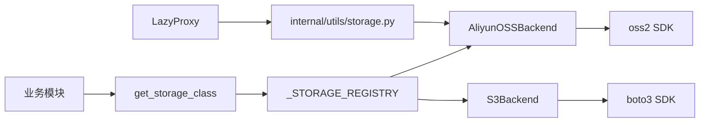

# 对象存储工具

<cite>
**本文引用的文件**
- [pkg/oss/base.py](file://pkg/oss/base.py)
- [pkg/oss/__init__.py](file://pkg/oss/__init__.py)
- [pkg/oss/aliyun.py](file://pkg/oss/aliyun.py)
- [pkg/oss/s3.py](file://pkg/oss/s3.py)
- [internal/utils/storage.py](file://internal/utils/storage.py)
- [pkg/toolkit/types.py](file://pkg/toolkit/types.py)
- [configs/.secrets.example](file://configs/.secrets.example)
- [configs/.env.dev](file://configs/.env.dev)
- [configs/.env.prod](file://configs/.env.prod)
</cite>

## 目录
1. [简介](#简介)
2. [项目结构](#项目结构)
3. [核心组件](#核心组件)
4. [架构总览](#架构总览)
5. [详细组件分析](#详细组件分析)
6. [依赖关系分析](#依赖关系分析)
7. [性能与成本优化](#性能与成本优化)
8. [故障排查指南](#故障排查指南)
9. [结论](#结论)
10. [附录](#附录)

## 简介
本文件面向“对象存储工具包”的使用者与维护者，系统化阐述对阿里云 OSS 与 AWS S3 的统一抽象设计与实现。文档涵盖：
- 抽象接口 BaseStorage 与具体实现类 AliyunOSSBackend、S3Backend 的职责与差异
- 文件上传、下载、删除、存在性检查、预签名链接生成等核心能力
- 跨平台对象存储的使用示例与配置方法
- 存储桶管理、访问控制与安全策略的实践建议
- 大文件分片上传、断点续传等高级能力的扩展思路
- 性能优化、成本控制与故障恢复策略

## 项目结构
对象存储工具位于 pkg/oss 目录，采用“抽象接口 + 多实现 + 注册表 + 工厂函数”的分层设计：
- 抽象层：定义统一接口与注册表
- 实现层：分别针对阿里云 OSS 与 AWS S3 的适配实现
- 工具层：提供懒加载代理与类型工具，支撑运行时初始化与类型安全
- 配置层：通过环境变量与密钥文件加载运行参数

图表来源
- [pkg/oss/base.py](file://pkg/oss/base.py#L6-L41)
- [pkg/oss/__init__.py](file://pkg/oss/__init__.py#L22-L30)
- [pkg/oss/aliyun.py](file://pkg/oss/aliyun.py#L9-L27)
- [pkg/oss/s3.py](file://pkg/oss/s3.py#L11-L27)
- [pkg/toolkit/types.py](file://pkg/toolkit/types.py#L205-L244)

章节来源
- [pkg/oss/base.py](file://pkg/oss/base.py#L6-L41)
- [pkg/oss/__init__.py](file://pkg/oss/__init__.py#L22-L30)
- [pkg/oss/aliyun.py](file://pkg/oss/aliyun.py#L9-L27)
- [pkg/oss/s3.py](file://pkg/oss/s3.py#L11-L27)
- [pkg/toolkit/types.py](file://pkg/toolkit/types.py#L205-L244)

## 核心组件
- 抽象接口 BaseStorage：定义统一的异步上传、生成预签名链接、删除、存在性检查等方法，确保上层业务与具体云厂商解耦。
- 注册表与枚举：通过 StorageType 枚举与 _STORAGE_REGISTRY 字典，将具体实现类与存储类型绑定。
- 工厂函数 get_storage_class：根据 StorageType 返回对应实现类，供业务侧按需选择。
- 具体实现：
  - AliyunOSSBackend：基于 oss2 SDK，支持路径、bytes、文件对象等多种输入；提供签名 URL 生成与对象存在性检查。
  - S3Backend：基于 boto3 SDK，支持路径、bytes、文件对象；提供预签名链接生成与对象存在性检查。

章节来源
- [pkg/oss/base.py](file://pkg/oss/base.py#L26-L41)
- [pkg/oss/__init__.py](file://pkg/oss/__init__.py#L22-L30)
- [pkg/oss/aliyun.py](file://pkg/oss/aliyun.py#L9-L65)
- [pkg/oss/s3.py](file://pkg/oss/s3.py#L11-L82)

## 架构总览
下图展示对象存储工具的整体交互：业务通过工厂函数获取实现类，再调用统一接口完成上传、签名、删除、检查等操作；实现类内部委托具体 SDK 完成云厂商交互。

图表来源
- [pkg/oss/__init__.py](file://pkg/oss/__init__.py#L22-L30)
- [pkg/oss/aliyun.py](file://pkg/oss/aliyun.py#L29-L65)
- [pkg/oss/s3.py](file://pkg/oss/s3.py#L29-L82)

## 详细组件分析

### 抽象接口 BaseStorage
- 职责：定义统一的异步接口，屏蔽不同云厂商差异。
- 方法要点：
  - upload：支持 BinaryIO、bytes、str/Path 三种输入，返回可访问 URL
  - generate_presigned_url：生成带过期时间的预签名链接
  - delete：删除对象，返回布尔结果
  - exists：检查对象是否存在

章节来源
- [pkg/oss/base.py](file://pkg/oss/base.py#L26-L41)

### 注册表与工厂函数
- 注册表：_STORAGE_REGISTRY 将 StorageType 映射到具体实现类
- 工厂函数：get_storage_class 根据枚举返回对应类，未注册时抛出异常
- 作用：业务侧仅依赖枚举与工厂函数，无需关心具体实现细节

章节来源
- [pkg/oss/base.py](file://pkg/oss/base.py#L11-L23)
- [pkg/oss/__init__.py](file://pkg/oss/__init__.py#L22-L30)

### 阿里云 OSS 实现 AliyunOSSBackend
- 初始化：校验 AK/SK，构造 oss2.Auth 与 oss2.Bucket；endpoint 自动补全协议
- 上传：支持路径、bytes、文件对象；异常包装为通用异常
- 预签名链接：调用 sign_url 生成 GET 链接
- 删除/存在性：调用 delete_object 与 object_exists

图表来源
- [pkg/oss/base.py](file://pkg/oss/base.py#L26-L41)
- [pkg/oss/aliyun.py](file://pkg/oss/aliyun.py#L9-L65)

章节来源
- [pkg/oss/aliyun.py](file://pkg/oss/aliyun.py#L16-L65)

### AWS S3 实现 S3Backend
- 初始化：构建 boto3 s3 client，支持自定义 endpoint
- 上传：支持路径与文件对象；bytes 需包装为 BytesIO；异常包装为通用异常
- 预签名链接：使用 generate_presigned_url 生成 GET 链接
- 删除/存在性：delete_object 与 head_object

图表来源
- [pkg/oss/base.py](file://pkg/oss/base.py#L26-L41)
- [pkg/oss/s3.py](file://pkg/oss/s3.py#L11-L82)

章节来源
- [pkg/oss/s3.py](file://pkg/oss/s3.py#L18-L82)

### 使用示例与配置方法
- 通过工厂函数获取实现类并调用接口
- 阿里云 OSS 单例懒加载：init_aliyun_oss 初始化，aliyun_oss 懒代理按需获取
- 配置来源：.secrets 与 .env.* 文件，密钥与环境变量组合加载

图表来源
- [internal/utils/storage.py](file://internal/utils/storage.py#L7-L20)
- [configs/.secrets.example](file://configs/.secrets.example#L6-L16)
- [configs/.env.dev](file://configs/.env.dev#L1-L20)
- [configs/.env.prod](file://configs/.env.prod#L1-L20)

章节来源
- [internal/utils/storage.py](file://internal/utils/storage.py#L7-L20)
- [configs/.secrets.example](file://configs/.secrets.example#L6-L16)
- [configs/.env.dev](file://configs/.env.dev#L1-L20)
- [configs/.env.prod](file://configs/.env.prod#L1-L20)

## 依赖关系分析
- 模块耦合：业务仅依赖工厂函数与抽象接口，实现类通过注册表注入
- 外部依赖：oss2（阿里云）、boto3（S3），均通过异步线程池封装同步调用
- 运行时初始化：LazyProxy 保障模块导入时对象尚未初始化的问题

图表来源
- [pkg/oss/__init__.py](file://pkg/oss/__init__.py#L22-L30)
- [pkg/oss/aliyun.py](file://pkg/oss/aliyun.py#L9-L27)
- [pkg/oss/s3.py](file://pkg/oss/s3.py#L11-L27)
- [internal/utils/storage.py](file://internal/utils/storage.py#L1-L20)
- [pkg/toolkit/types.py](file://pkg/toolkit/types.py#L205-L244)

章节来源
- [pkg/oss/__init__.py](file://pkg/oss/__init__.py#L22-L30)
- [pkg/oss/aliyun.py](file://pkg/oss/aliyun.py#L9-L27)
- [pkg/oss/s3.py](file://pkg/oss/s3.py#L11-L27)
- [internal/utils/storage.py](file://internal/utils/storage.py#L1-L20)
- [pkg/toolkit/types.py](file://pkg/toolkit/types.py#L205-L244)

## 性能与成本优化
- 异步线程池：所有 SDK 调用通过 anyio.to_thread.run_sync 在线程池中执行，避免阻塞事件循环
- 传输优化：
  - 上传前设置 Content-Type，减少服务端推断开销
  - 对 bytes 输入使用 BytesIO 包装，避免重复 seek
- 成本控制：
  - 使用预签名链接替代服务端中转，降低带宽与服务器负载
  - 合理设置过期时间，避免长期有效的链接造成安全与成本风险
- 可靠性：
  - 异常统一包装，便于上层捕获与重试
  - 存在性检查与 head_object 用于幂等操作与二次确认

章节来源
- [pkg/oss/aliyun.py](file://pkg/oss/aliyun.py#L29-L55)
- [pkg/oss/s3.py](file://pkg/oss/s3.py#L29-L63)

## 故障排查指南
- 初始化失败
  - 阿里云：AK/SK 缺失会触发参数校验异常
  - S3：客户端初始化依赖 region 与 endpoint，需确保配置正确
- 上传失败
  - oss2/OSError：包装为通用异常，携带原始错误信息
  - boto3 ClientError：包装为通用异常，便于统一处理
- 预签名链接
  - 阿里云：sign_url 生成 GET 链接
  - S3：generate_presigned_url 生成 GET 链接；若自定义 endpoint，返回自定义域名拼接结果
- 删除与存在性
  - 删除：阿里云返回状态码判断；S3 返回布尔结果
  - 存在性：阿里云使用 object_exists；S3 使用 head_object

章节来源
- [pkg/oss/aliyun.py](file://pkg/oss/aliyun.py#L16-L18)
- [pkg/oss/aliyun.py](file://pkg/oss/aliyun.py#L50-L51)
- [pkg/oss/s3.py](file://pkg/oss/s3.py#L55-L56)
- [pkg/oss/aliyun.py](file://pkg/oss/aliyun.py#L57-L65)
- [pkg/oss/s3.py](file://pkg/oss/s3.py#L65-L82)

## 结论
该对象存储工具包通过统一抽象与注册机制，实现了对阿里云 OSS 与 AWS S3 的一致化接入。配合懒加载代理与工厂函数，既满足了业务解耦，又兼顾了运行时初始化的安全性与灵活性。对于高级能力（如分片上传、断点续传），可在现有实现基础上扩展，遵循统一接口与异常处理规范，确保跨平台一致性。

## 附录

### 配置清单与示例
- 密钥与环境：参考 .secrets.example 设置 APP_ENV、AES_SECRET、JWT_SECRET 等
- 环境文件：.env.dev/.env.prod 中包含基础运行参数，可按需扩展对象存储相关配置键

章节来源
- [configs/.secrets.example](file://configs/.secrets.example#L6-L16)
- [configs/.env.dev](file://configs/.env.dev#L1-L20)
- [configs/.env.prod](file://configs/.env.prod#L1-L20)