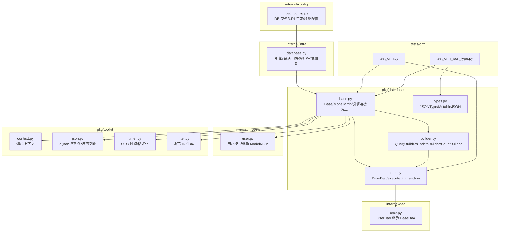
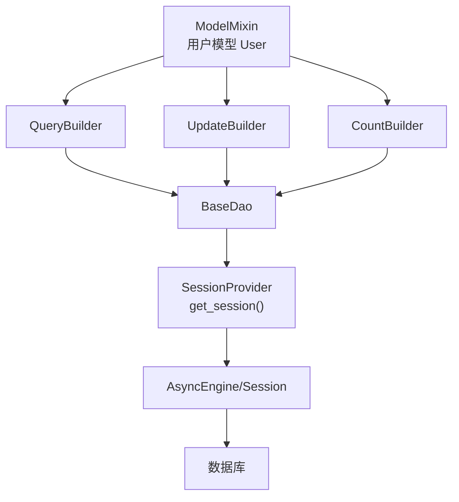
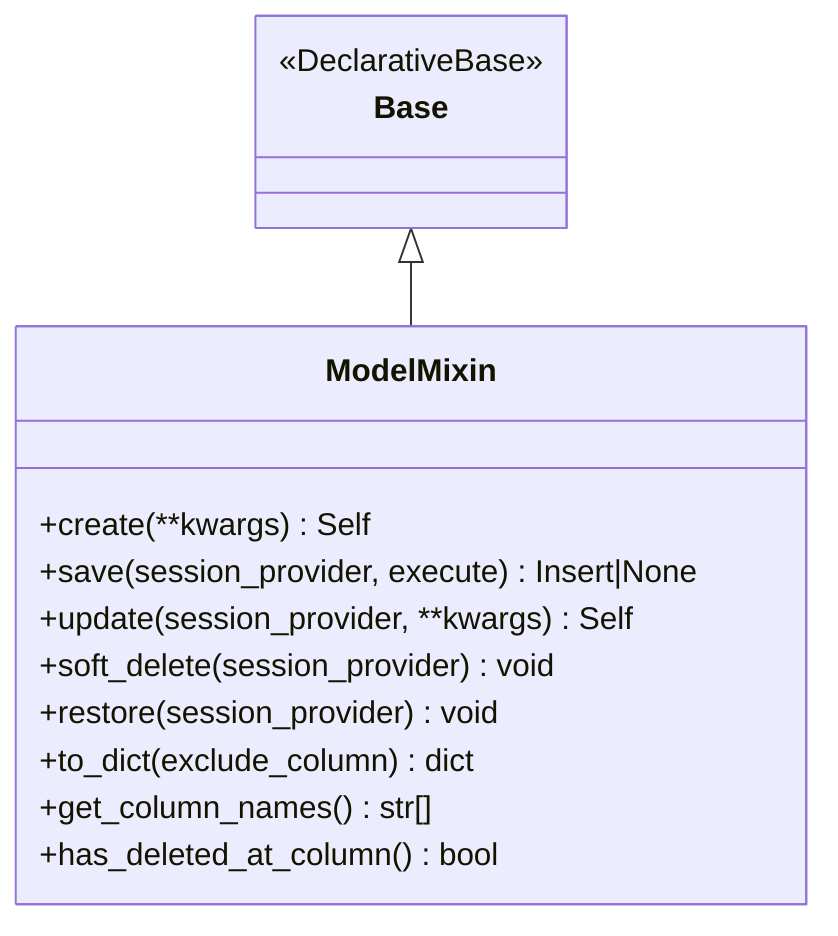
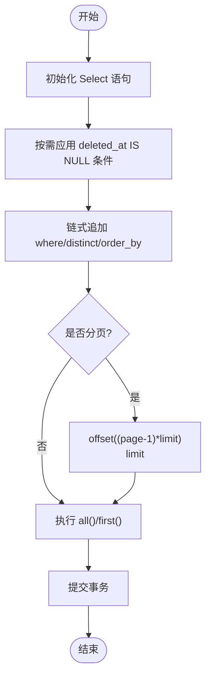
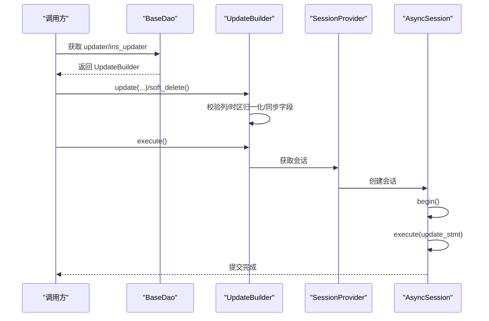
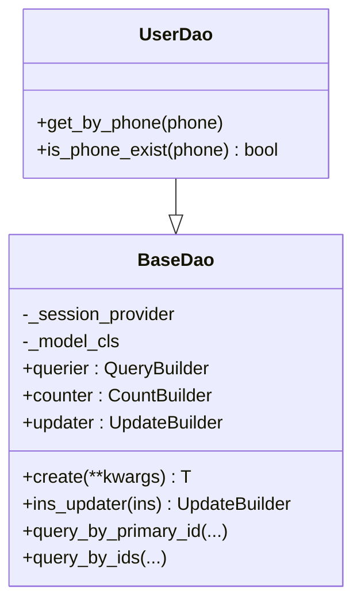
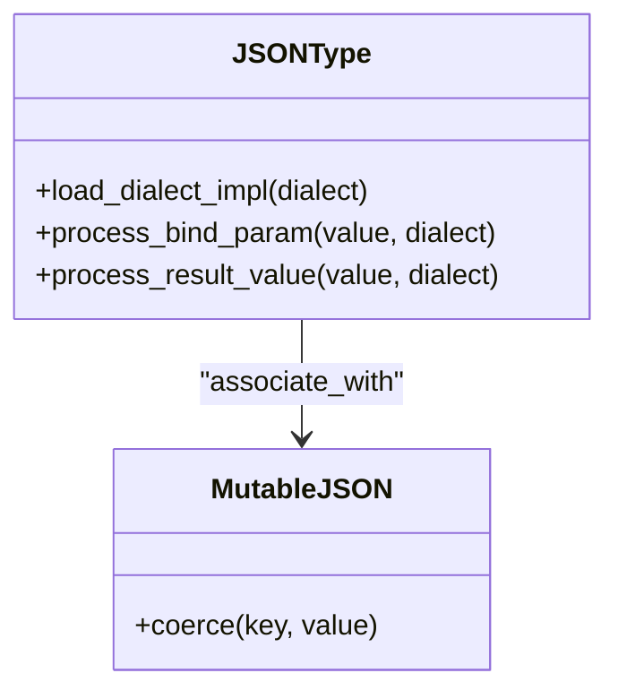
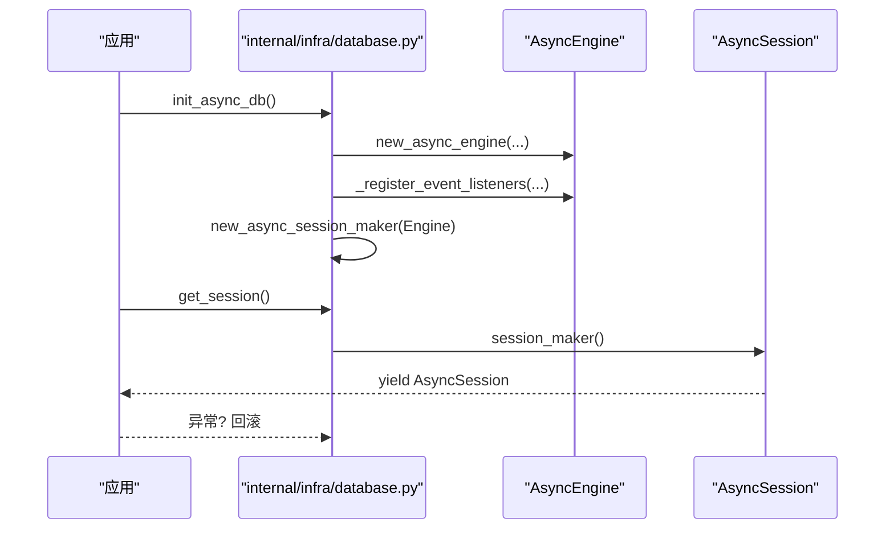
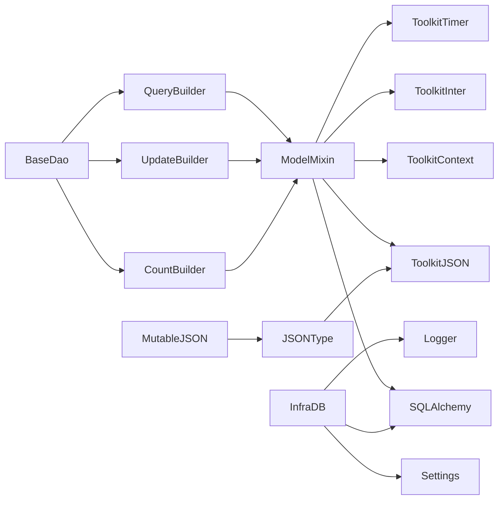
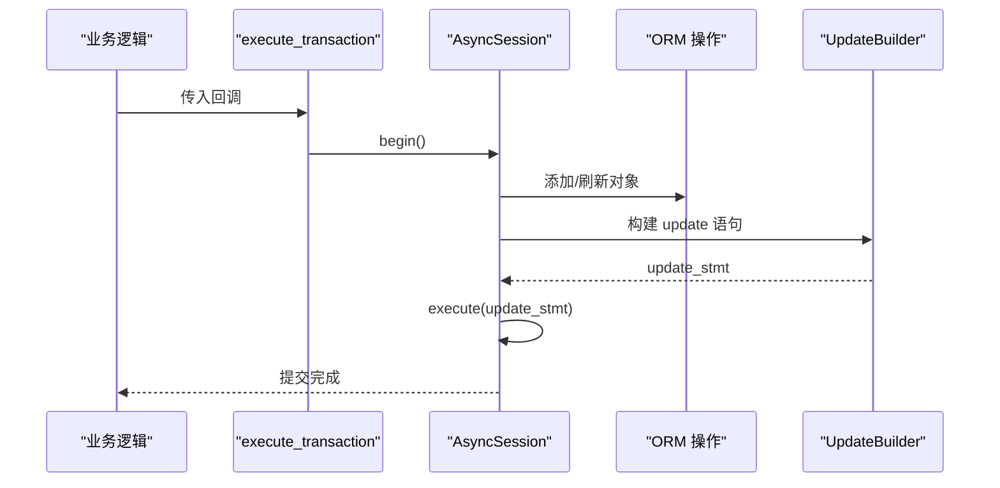

# 数据库工具

<cite>
**本文引用的文件**
- [pkg/database/base.py](file://pkg/database/base.py)
- [pkg/database/builder.py](file://pkg/database/builder.py)
- [pkg/database/dao.py](file://pkg/database/dao.py)
- [pkg/database/types.py](file://pkg/database/types.py)
- [internal/infra/database.py](file://internal/infra/database.py)
- [internal/models/user.py](file://internal/models/user.py)
- [internal/dao/user.py](file://internal/dao/user.py)
- [internal/config/load_config.py](file://internal/config/load_config.py)
- [pkg/toolkit/context.py](file://pkg/toolkit/context.py)
- [pkg/toolkit/json.py](file://pkg/toolkit/json.py)
- [pkg/toolkit/timer.py](file://pkg/toolkit/timer.py)
- [pkg/toolkit/inter.py](file://pkg/toolkit/inter.py)
- [tests/orm/test_orm.py](file://tests/orm/test_orm.py)
- [tests/orm/test_orm_json_type.py](file://tests/orm/test_orm_json_type.py)
</cite>

## 目录
1. [简介](#简介)
2. [项目结构](#项目结构)
3. [核心组件](#核心组件)
4. [架构总览](#架构总览)
5. [组件详解](#组件详解)
6. [依赖关系分析](#依赖关系分析)
7. [性能与连接池](#性能与连接池)
8. [故障排查指南](#故障排查指南)
9. [结论](#结论)
10. [附录](#附录)

## 简介
本文件系统化梳理并文档化数据库工具包的设计与实现，涵盖数据库抽象层、查询构建器、DAO 模式、连接管理、事务处理、ORM 映射、类型系统与数据转换、多数据库支持、以及性能优化与错误处理策略。文档面向不同技术背景的读者，既提供高层概览，也给出代码级图示与使用路径指引。

## 项目结构
数据库工具包位于 pkg/database，配套基础设施位于 internal/infra，模型与 DAO 位于 internal/models 与 internal/dao，配置位于 internal/config，工具模块位于 pkg/toolkit。测试位于 tests/orm。

图表来源
- [pkg/database/base.py](file://pkg/database/base.py#L1-L364)
- [pkg/database/builder.py](file://pkg/database/builder.py#L1-L273)
- [pkg/database/dao.py](file://pkg/database/dao.py#L1-L203)
- [pkg/database/types.py](file://pkg/database/types.py#L1-L183)
- [internal/infra/database.py](file://internal/infra/database.py#L1-L154)
- [internal/models/user.py](file://internal/models/user.py#L1-L13)
- [internal/dao/user.py](file://internal/dao/user.py#L1-L24)
- [internal/config/load_config.py](file://internal/config/load_config.py#L1-L243)
- [pkg/toolkit/context.py](file://pkg/toolkit/context.py#L1-L107)
- [pkg/toolkit/json.py](file://pkg/toolkit/json.py#L1-L108)
- [pkg/toolkit/timer.py](file://pkg/toolkit/timer.py#L1-L80)
- [pkg/toolkit/inter.py](file://pkg/toolkit/inter.py#L1-L37)
- [tests/orm/test_orm.py](file://tests/orm/test_orm.py#L1-L238)
- [tests/orm/test_orm_json_type.py](file://tests/orm/test_orm_json_type.py#L1-L217)

章节来源
- [pkg/database/base.py](file://pkg/database/base.py#L1-L364)
- [pkg/database/builder.py](file://pkg/database/builder.py#L1-L273)
- [pkg/database/dao.py](file://pkg/database/dao.py#L1-L203)
- [pkg/database/types.py](file://pkg/database/types.py#L1-L183)
- [internal/infra/database.py](file://internal/infra/database.py#L1-L154)
- [internal/models/user.py](file://internal/models/user.py#L1-L13)
- [internal/dao/user.py](file://internal/dao/user.py#L1-L24)
- [internal/config/load_config.py](file://internal/config/load_config.py#L1-L243)
- [pkg/toolkit/context.py](file://pkg/toolkit/context.py#L1-L107)
- [pkg/toolkit/json.py](file://pkg/toolkit/json.py#L1-L108)
- [pkg/toolkit/timer.py](file://pkg/toolkit/timer.py#L1-L80)
- [pkg/toolkit/inter.py](file://pkg/toolkit/inter.py#L1-L37)
- [tests/orm/test_orm.py](file://tests/orm/test_orm.py#L1-L238)
- [tests/orm/test_orm_json_type.py](file://tests/orm/test_orm_json_type.py#L1-L217)

## 核心组件
- Base/ModelMixin：声明式基类与通用模型混入，提供统一的 CRUD、批量插入、软删除、字段补全与反射工具。
- QueryBuilder/UpdateBuilder/CountBuilder：链式查询构建器，支持条件、排序、分页、计数、软删除更新等。
- BaseDao：DAO 基类，聚合查询器、计数器、更新器，提供常用查询与事务执行器。
- JSONType/MutableJSON：跨数据库兼容的 JSON 类型与变更追踪，适配 PostgreSQL/MySQL/SQLite/Oracle。
- 连接与会话：异步引擎与会话工厂，生命周期管理、事件监听、慢查询日志。
- 多数据库支持：通过配置动态生成连接 URI，支持 mysql、postgresql、oracle。

章节来源
- [pkg/database/base.py](file://pkg/database/base.py#L48-L364)
- [pkg/database/builder.py](file://pkg/database/builder.py#L18-L273)
- [pkg/database/dao.py](file://pkg/database/dao.py#L15-L203)
- [pkg/database/types.py](file://pkg/database/types.py#L12-L183)
- [internal/infra/database.py](file://internal/infra/database.py#L26-L154)
- [internal/config/load_config.py](file://internal/config/load_config.py#L35-L160)

## 架构总览
数据库工具包采用“模型 + 构建器 + DAO + 基础设施”的分层设计：
- 模型层：继承 ModelMixin，自动注入审计字段、ID 生成、软删除等。
- 查询层：QueryBuilder/UpdateBuilder/CountBuilder 提供链式 API，屏蔽 SQL 细节。
- 访问层：BaseDao 聚合构建器，暴露领域方法，统一事务与会话提供者。
- 基础设施层：引擎/会话/事件监听/生命周期管理，支持多数据库与连接池。
- 工具层：上下文、JSON 序列化、时间与雪花 ID 生成，支撑数据转换与默认值。

图表来源
- [pkg/database/base.py](file://pkg/database/base.py#L60-L364)
- [pkg/database/builder.py](file://pkg/database/builder.py#L18-L273)
- [pkg/database/dao.py](file://pkg/database/dao.py#L15-L203)
- [internal/infra/database.py](file://internal/infra/database.py#L85-L111)

## 组件详解

### Base/ModelMixin：模型抽象与默认行为
- 统一审计字段：id、creator_id、created_at、updater_id、updated_at、deleted_at。
- 工厂方法：create 清洗列、填充默认值；insert_rows/insert_instances 批量插入。
- 单对象操作：save（严格插入）、update（严格更新）、soft_delete/restore（软删除）。
- 字段补全：插入/更新时自动填充时间戳与用户上下文；支持可选的雪花 ID。
- 反射工具：has_column/get_column_names/has_deleted_at_column 等。
- 统一执行：_execute_or_return 封装 execute=False 返回语句、execute=True 执行事务。

图表来源
- [pkg/database/base.py](file://pkg/database/base.py#L48-L364)

章节来源
- [pkg/database/base.py](file://pkg/database/base.py#L60-L364)
- [internal/models/user.py](file://internal/models/user.py#L7-L13)

### QueryBuilder：链式查询构建与分页
- 条件：eq_/ne_/gt_/lt_/ge_/le_/in_/like/is_null/or_。
- 排序与去重：desc_/asc_/distinct_。
- 软删除过滤：默认排除 deleted_at 非空记录（可配置 include_deleted）。
- 分页：paginate(page, limit)，参数校验。
- 执行：all()/first()，异常包装与提交。

图表来源
- [pkg/database/builder.py](file://pkg/database/builder.py#L111-L162)

章节来源
- [pkg/database/builder.py](file://pkg/database/builder.py#L18-L162)

### UpdateBuilder：更新构建与软删除
- update(**kwargs)：校验列名、时区归一化、构建更新字典。
- soft_delete：设置 deleted_at 与 updated_at。
- 自动同步：更新 updated_at、updater_id、deleted_at 一致性；可同步到实例。
- execute：在 session 中执行并提交。

图表来源
- [pkg/database/builder.py](file://pkg/database/builder.py#L192-L261)
- [pkg/database/dao.py](file://pkg/database/dao.py#L84-L91)

章节来源
- [pkg/database/builder.py](file://pkg/database/builder.py#L192-L261)
- [pkg/database/dao.py](file://pkg/database/dao.py#L84-L91)

### CountBuilder：计数构建
- 支持普通计数与去重计数，可选择计数列与 include_deleted。

章节来源
- [pkg/database/builder.py](file://pkg/database/builder.py#L164-L189)

### BaseDao：DAO 聚合与事务执行
- 聚合：querier/querier_inc_deleted/querier_unsorted/querier_inc_deleted_unsorted/sub_querier。
- 计数：counter/col_counter。
- 更新：updater/ins_updater。
- 常用方法：query_by_primary_id/query_by_ids。
- execute_transaction：统一事务入口，支持复杂逻辑与混合 ORM/原生 SQL。

图表来源
- [pkg/database/dao.py](file://pkg/database/dao.py#L15-L104)
- [internal/dao/user.py](file://internal/dao/user.py#L6-L24)

章节来源
- [pkg/database/dao.py](file://pkg/database/dao.py#L15-L203)
- [internal/dao/user.py](file://internal/dao/user.py#L1-L24)

### JSONType 与 MutableJSON：跨数据库 JSON 类型系统
- 自动适配：PostgreSQL(JSONB)、MySQL(JSON)、SQLite(JSON)、Oracle(原生/CLOB)、其他(TEXT)。
- 序列化：驱动原生处理或使用 orjson；空值与空字符串容错。
- 变更追踪：MutableJSON 与 JSONType 关联，支持 dict/list 内部变更感知。

图表来源
- [pkg/database/types.py](file://pkg/database/types.py#L12-L183)

章节来源
- [pkg/database/types.py](file://pkg/database/types.py#L12-L183)
- [pkg/toolkit/json.py](file://pkg/toolkit/json.py#L1-L108)

### 连接与会话管理：生命周期与事件监听
- 初始化：new_async_engine/new_async_session_maker，注册事件监听。
- 会话提供：get_session 上下文管理器，支持 autoflush/no_autoflush 与异常回滚。
- 生命周期：init_async_db/close_async_db/reset_async_db。
- 慢查询日志：before/after_cursor_execute 记录耗时并格式化 SQL。

图表来源
- [internal/infra/database.py](file://internal/infra/database.py#L26-L111)

章节来源
- [internal/infra/database.py](file://internal/infra/database.py#L1-L154)

### 多数据库支持：配置与连接
- 驱动映射：mysql+aiomysql、postgresql+asyncpg、oracle+oracledb。
- 动态生成 URI：根据 DB_TYPE 与主机/端口/凭据拼装。
- 环境加载：.env.* 与 .secrets 组合并缓存加载。

章节来源
- [internal/config/load_config.py](file://internal/config/load_config.py#L35-L160)

## 依赖关系分析
- ModelMixin 依赖：SQLAlchemy DeclarativeBase、mapped_column、InstrumentedAttribute、context、snowflake、json、timer。
- Builder 依赖：SQLAlchemy Select/Update/Delete、func/distinct、unique_list、logger。
- DAO 依赖：QueryBuilder/UpdateBuilder/CountBuilder、SessionProvider。
- 基础设施依赖：SQLAlchemy AsyncEngine/Session、event、settings、logger。
- 工具依赖：context、json、timer、inter。

图表来源
- [pkg/database/base.py](file://pkg/database/base.py#L1-L16)
- [pkg/database/builder.py](file://pkg/database/builder.py#L1-L12)
- [pkg/database/dao.py](file://pkg/database/dao.py#L1-L9)
- [internal/infra/database.py](file://internal/infra/database.py#L1-L17)
- [pkg/database/types.py](file://pkg/database/types.py#L1-L10)

章节来源
- [pkg/database/base.py](file://pkg/database/base.py#L1-L16)
- [pkg/database/builder.py](file://pkg/database/builder.py#L1-L12)
- [pkg/database/dao.py](file://pkg/database/dao.py#L1-L9)
- [internal/infra/database.py](file://internal/infra/database.py#L1-L17)
- [pkg/database/types.py](file://pkg/database/types.py#L1-L10)

## 性能与连接池
- 连接池参数：pool_pre_ping、pool_size、max_overflow、pool_timeout、pool_recycle。
- JSON 序列化：使用 orjson，减少序列化开销。
- 批量插入：insert_rows/insert_instances 避免逐条提交，提升吞吐。
- 事务边界：execute_transaction 显式控制事务，避免长事务与锁竞争。
- 慢查询监控：事件监听记录耗时并格式化 SQL，便于定位瓶颈。

章节来源
- [internal/infra/database.py](file://internal/infra/database.py#L39-L56)
- [pkg/database/base.py](file://pkg/database/base.py#L100-L150)
- [pkg/database/builder.py](file://pkg/database/builder.py#L192-L261)
- [pkg/toolkit/json.py](file://pkg/toolkit/json.py#L17-L24)

## 故障排查指南
- 严格模式错误
  - save/update 严格区分插入/更新：对持久化对象调用 save 会抛错；对新对象调用 update 会抛错。
  - 排查路径：确认对象状态（transient/persistent/detached），使用 ModelMixin.has_column 与 get_column_names 校验列名。
- in_ 条件空列表
  - 空列表会触发 ValueError，需在上层校验输入。
- 软删除与恢复
  - 仅当模型定义 deleted_at 字段时生效；使用 UpdateBuilder.soft_delete 或 ModelMixin.soft_delete/restore。
- JSON 类型异常
  - 非 JSON 文本读取容错，空字符串视为 None；Oracle LOB 对象自动 read()。
- 事务失败
  - execute_transaction 统一捕获异常并包装；检查回调中是否有异常未被吞没。
- 慢查询定位
  - 通过事件监听输出耗时 SQL；结合分页与索引优化。

章节来源
- [pkg/database/base.py](file://pkg/database/base.py#L156-L216)
- [pkg/database/builder.py](file://pkg/database/builder.py#L70-L83)
- [pkg/database/types.py](file://pkg/database/types.py#L116-L146)
- [pkg/database/dao.py](file://pkg/database/dao.py#L106-L203)
- [internal/infra/database.py](file://internal/infra/database.py#L122-L154)

## 结论
该数据库工具包以 ModelMixin 为核心，配合 QueryBuilder/UpdateBuilder/CountBuilder 与 BaseDao，形成清晰的分层与职责划分；通过 JSONType/MutableJSON 实现跨数据库的 JSON 映射与变更追踪；借助 internal/infra/database 提供的连接池与事件监听，满足生产环境的稳定性与可观测性需求。多数据库支持通过配置动态生成 URI，便于在不同环境间切换。

## 附录

### 使用示例与最佳实践（路径指引）
- 创建模型并继承 ModelMixin
  - 示例路径：[internal/models/user.py](file://internal/models/user.py#L7-L13)
- 定义 DAO 并扩展领域方法
  - 示例路径：[internal/dao/user.py](file://internal/dao/user.py#L6-L24)
- 初始化数据库连接与会话
  - 示例路径：[internal/infra/database.py](file://internal/infra/database.py#L26-L111)
- 配置多数据库连接
  - 示例路径：[internal/config/load_config.py](file://internal/config/load_config.py#L119-L160)
- CRUD 与批量操作
  - 示例路径：[tests/orm/test_orm.py](file://tests/orm/test_orm.py#L120-L186)
- 复杂查询与分页
  - 示例路径：[tests/orm/test_orm.py](file://tests/orm/test_orm.py#L189-L213)
- JSON 字段与变更追踪
  - 示例路径：[tests/orm/test_orm_json_type.py](file://tests/orm/test_orm_json_type.py#L117-L164)
- 事务执行器
  - 示例路径：[pkg/database/dao.py](file://pkg/database/dao.py#L106-L196)

### 关键流程图：事务内混合 ORM 与原生 SQL

图表来源
- [pkg/database/dao.py](file://pkg/database/dao.py#L106-L196)