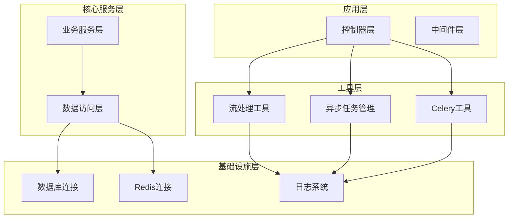
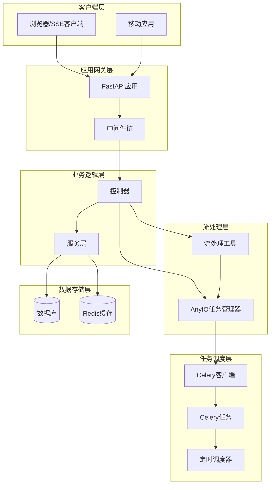
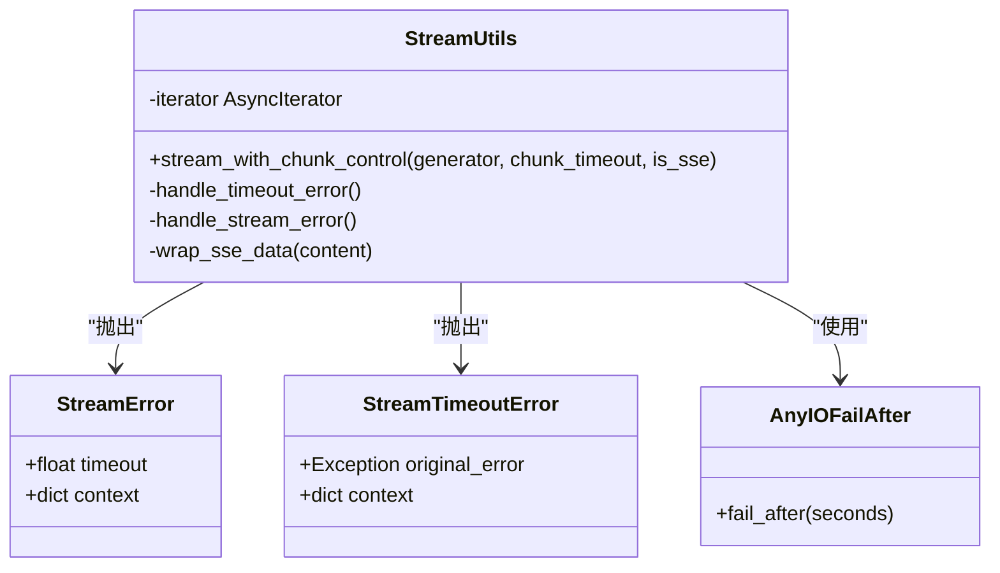
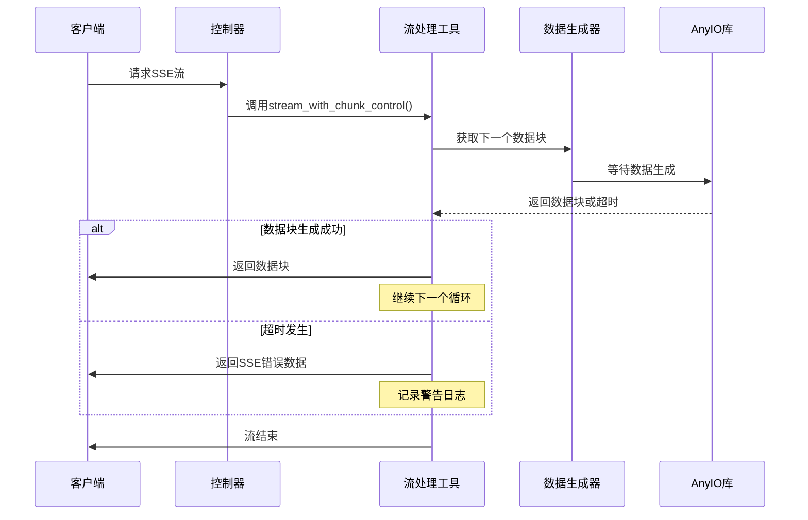
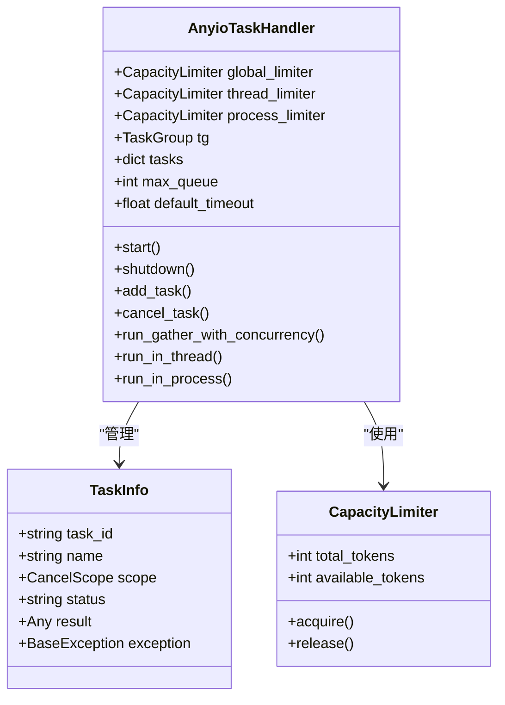
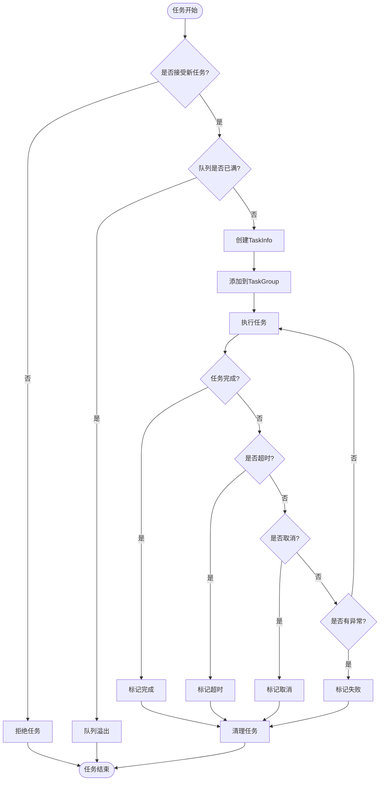
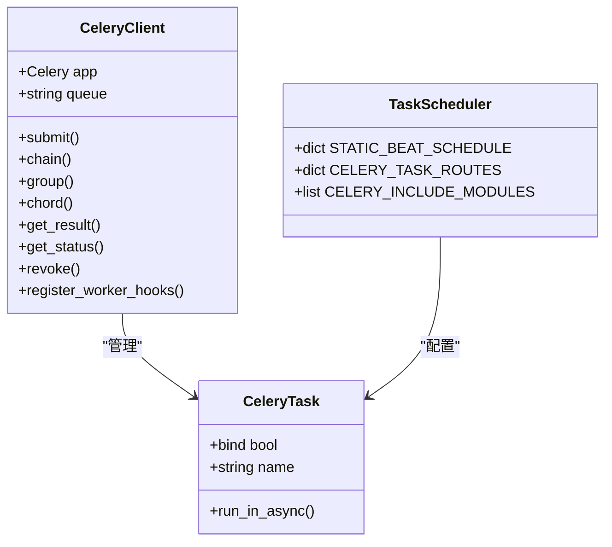
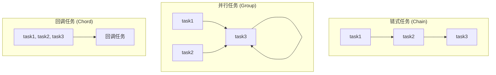
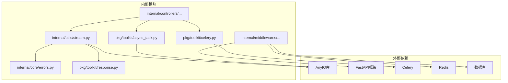

# 流处理工具

<cite>
**本文档引用的文件**
- [internal/utils/stream.py](file://internal/utils/stream.py)
- [internal/utils/anyio_task.py](file://internal/utils/anyio_task.py)
- [pkg/toolkit/async_task.py](file://pkg/toolkit/async_task.py)
- [internal/tasks/celery_tasks.py](file://internal/tasks/celery_tasks.py)
- [internal/tasks/scheduler.py](file://internal/tasks/scheduler.py)
- [pkg/toolkit/celery.py](file://pkg/toolkit/celery.py)
- [internal/controllers/public/test.py](file://internal/controllers/public/test.py)
- [internal/middlewares/recorder.py](file://internal/middlewares/recorder.py)
- [internal/middlewares/auth.py](file://internal/middlewares/auth.py)
- [internal/app.py](file://internal/app.py)
- [main.py](file://main.py)
- [internal/core/errors.py](file://internal/core/errors.py)
- [pkg/toolkit/response.py](file://pkg/toolkit/response.py)
</cite>

## 目录
1. [简介](#简介)
2. [项目结构](#项目结构)
3. [核心组件](#核心组件)
4. [架构概览](#架构概览)
5. [详细组件分析](#详细组件分析)
6. [依赖关系分析](#依赖关系分析)
7. [性能考虑](#性能考虑)
8. [故障排除指南](#故障排除指南)
9. [结论](#结论)

## 简介

本项目提供了一套完整的流处理工具集，主要包含以下核心功能：

- **SSE（Server-Sent Events）流超时控制**：基于 AnyIO 的异步流处理，支持单个数据块的超时控制
- **异步任务管理**：提供强大的 AnyIO 任务管理器，支持并发控制、超时管理和任务取消
- **Celery 任务调度**：集成 Celery 进行后台任务处理，支持任务编排和定时任务
- **中间件链路监控**：提供完整的请求处理链路监控和异常处理机制

这些工具共同构成了一个高效、可靠的流处理基础设施，适用于实时数据推送、长连接通信和后台任务处理等场景。

## 项目结构

项目采用分层架构设计，主要目录结构如下：

**图表来源**
- [internal/app.py](file://internal/app.py#L16-L29)
- [internal/controllers/public/test.py](file://internal/controllers/public/test.py#L1-L13)

**章节来源**
- [internal/app.py](file://internal/app.py#L16-L29)
- [main.py](file://main.py#L1-L4)

## 核心组件

### 流处理工具模块

流处理工具模块提供了基于 AnyIO 的异步流处理能力，主要包含以下功能：

- **单Chunk超时控制**：通过 `anyio.fail_after` 控制单个数据块的生成时间
- **SSE格式支持**：自动将错误信息包装为 SSE 格式
- **异常处理机制**：区分流超时和流错误，提供相应的处理策略

### 异步任务管理器

异步任务管理器提供了强大的并发控制和任务管理能力：

- **容量限制**：支持全局、线程和进程级别的容量限制
- **超时管理**：提供单任务和全局超时控制
- **任务取消**：支持优雅的任务取消和清理
- **批量执行**：支持同步函数的批量并发执行

### Celery任务调度系统

Celery任务调度系统集成了完整的任务管理功能：

- **任务定义**：支持独立业务逻辑、多服务协调和纯技术运维任务
- **任务编排**：提供链式、并行和回调模式的任务编排
- **定时任务**：支持 Cron 和 Interval 风格的定时任务
- **队列路由**：灵活的任务队列路由配置

**章节来源**
- [internal/utils/stream.py](file://internal/utils/stream.py#L16-L98)
- [pkg/toolkit/async_task.py](file://pkg/toolkit/async_task.py#L42-L375)
- [internal/tasks/celery_tasks.py](file://internal/tasks/celery_tasks.py#L1-L156)

## 架构概览

系统采用分层架构设计，各层职责清晰分离：

**图表来源**
- [internal/app.py](file://internal/app.py#L51-L77)
- [internal/controllers/public/test.py](file://internal/controllers/public/test.py#L107-L112)

## 详细组件分析

### 流处理工具组件

流处理工具组件是整个系统的核心，提供了完整的 SSE 流处理能力：

**图表来源**
- [internal/utils/stream.py](file://internal/utils/stream.py#L16-L98)
- [internal/core/errors.py](file://internal/core/errors.py#L36-L57)

#### 流处理工作流程

**图表来源**
- [internal/utils/stream.py](file://internal/utils/stream.py#L56-L81)
- [internal/controllers/public/test.py](file://internal/controllers/public/test.py#L107-L112)

**章节来源**
- [internal/utils/stream.py](file://internal/utils/stream.py#L16-L98)
- [internal/controllers/public/test.py](file://internal/controllers/public/test.py#L62-L112)

### 异步任务管理器组件

异步任务管理器提供了强大的并发控制和任务管理能力：

**图表来源**
- [pkg/toolkit/async_task.py](file://pkg/toolkit/async_task.py#L42-L54)
- [pkg/toolkit/async_task.py](file://pkg/toolkit/async_task.py#L32-L40)

#### 任务执行流程

**图表来源**
- [pkg/toolkit/async_task.py](file://pkg/toolkit/async_task.py#L109-L154)
- [pkg/toolkit/async_task.py](file://pkg/toolkit/async_task.py#L183-L215)

**章节来源**
- [pkg/toolkit/async_task.py](file://pkg/toolkit/async_task.py#L42-L375)
- [internal/utils/anyio_task.py](file://internal/utils/anyio_task.py#L8-L39)

### Celery任务调度组件

Celery任务调度系统提供了完整的任务管理功能：

**图表来源**
- [pkg/toolkit/celery.py](file://pkg/toolkit/celery.py#L15-L51)
- [internal/tasks/scheduler.py](file://internal/tasks/scheduler.py#L15-L47)

#### 任务编排模式

**图表来源**
- [pkg/toolkit/celery.py](file://pkg/toolkit/celery.py#L112-L136)
- [internal/tasks/celery_tasks.py](file://internal/tasks/celery_tasks.py#L138-L155)

**章节来源**
- [pkg/toolkit/celery.py](file://pkg/toolkit/celery.py#L15-L198)
- [internal/tasks/celery_tasks.py](file://internal/tasks/celery_tasks.py#L1-L156)
- [internal/tasks/scheduler.py](file://internal/tasks/scheduler.py#L1-L48)

## 依赖关系分析

系统各组件之间的依赖关系如下：

**图表来源**
- [internal/utils/stream.py](file://internal/utils/stream.py#L6-L13)
- [pkg/toolkit/async_task.py](file://pkg/toolkit/async_task.py#L8-L19)
- [pkg/toolkit/celery.py](file://pkg/toolkit/celery.py#L6-L8)

**章节来源**
- [internal/utils/stream.py](file://internal/utils/stream.py#L6-L13)
- [pkg/toolkit/async_task.py](file://pkg/toolkit/async_task.py#L8-L19)
- [pkg/toolkit/celery.py](file://pkg/toolkit/celery.py#L6-L8)

## 性能考虑

### 流处理性能优化

1. **超时控制策略**
   - 单Chunk超时避免长时间阻塞
   - 总超时由中间件统一控制
   - SSE模式自动处理错误响应

2. **内存管理**
   - 异步生成器避免一次性加载大量数据
   - 及时释放不再使用的资源
   - 合理设置超时时间防止内存泄漏

3. **网络优化**
   - 使用GZip中间件压缩响应
   - SSE格式优化数据传输
   - 连接池复用减少建立连接开销

### 任务执行性能优化

1. **并发控制**
   - 全局、线程、进程三级容量限制
   - 动态调整并发数量适应负载
   - 避免过度并发导致资源竞争

2. **资源管理**
   - 任务完成后及时清理
   - 支持任务取消优雅退出
   - 监控任务状态避免僵尸任务

3. **队列管理**
   - 任务路由到指定队列
   - 支持优先级队列
   - 队列长度限制防止内存溢出

## 故障排除指南

### 常见问题及解决方案

#### 流处理超时问题

**问题现象**：SSE流在指定时间内没有产生新的数据块

**诊断步骤**：
1. 检查数据生成器是否正常工作
2. 验证网络连接稳定性
3. 查看服务器日志中的超时记录

**解决方案**：
- 增加chunk_timeout参数值
- 优化数据生成逻辑
- 实现重连机制

#### 任务执行失败

**问题现象**：异步任务执行过程中抛出异常

**诊断步骤**：
1. 查看任务执行日志
2. 检查任务参数有效性
3. 验证依赖服务可用性

**解决方案**：
- 添加任务重试机制
- 实现异常处理逻辑
- 优化任务执行环境

#### Celery任务调度问题

**问题现象**：定时任务没有按预期执行

**诊断步骤**：
1. 检查Celery Beat服务状态
2. 验证任务配置正确性
3. 查看任务队列状态

**解决方案**：
- 重启Celery Beat服务
- 检查任务路由配置
- 验证队列连接状态

**章节来源**
- [internal/utils/stream.py](file://internal/utils/stream.py#L67-L98)
- [pkg/toolkit/async_task.py](file://pkg/toolkit/async_task.py#L140-L147)
- [pkg/toolkit/celery.py](file://pkg/toolkit/celery.py#L153-L154)

## 结论

本流处理工具集提供了完整而高效的异步流处理解决方案，具有以下特点：

1. **模块化设计**：各个组件职责明确，易于维护和扩展
2. **性能优化**：采用异步非阻塞I/O，支持高并发处理
3. **可靠性保障**：完善的异常处理和超时控制机制
4. **灵活性强**：支持多种流处理模式和任务编排方式

通过合理使用这些工具，可以构建高性能的实时数据处理系统，满足现代Web应用对流处理的需求。建议在实际部署时根据具体业务场景调整超时参数和并发配置，以达到最佳性能表现。