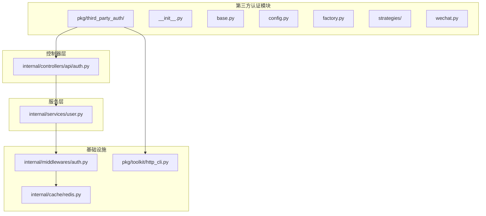
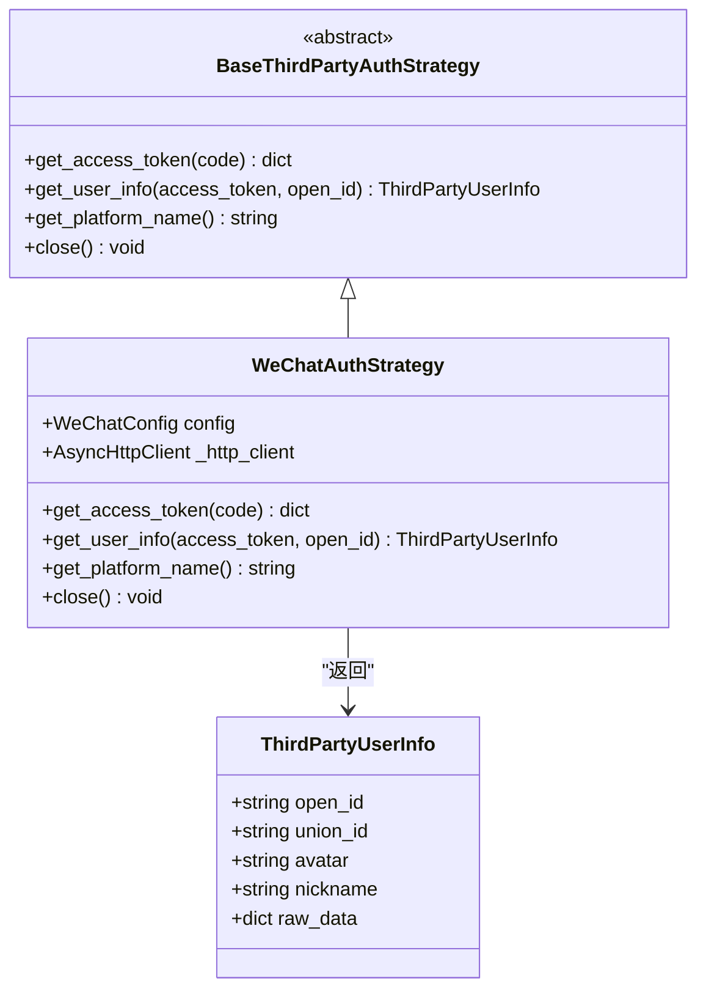
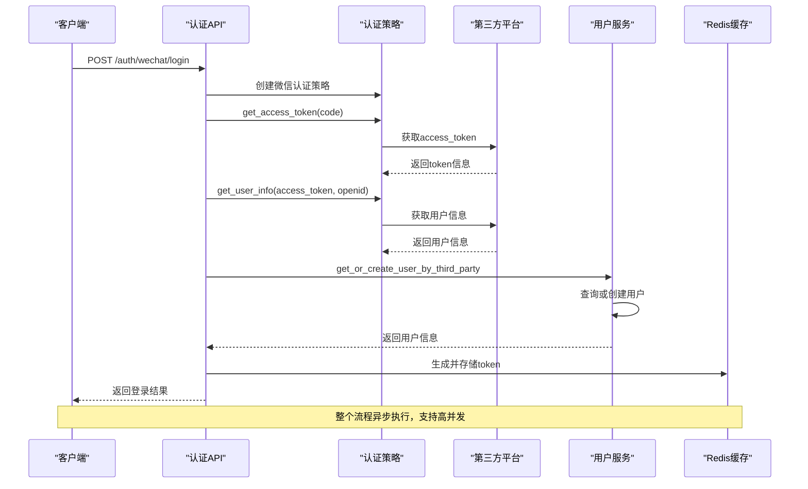
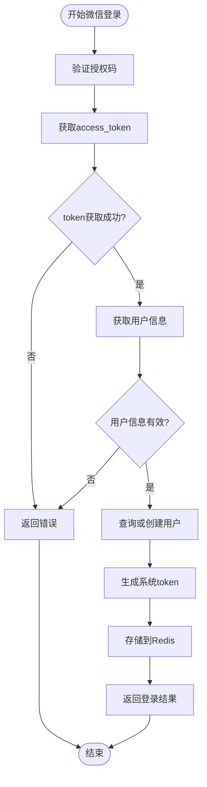
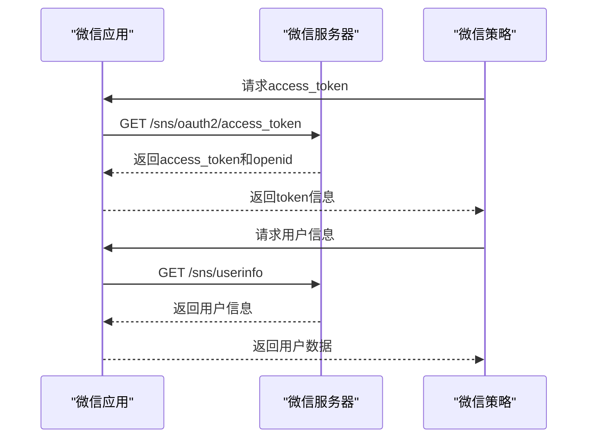
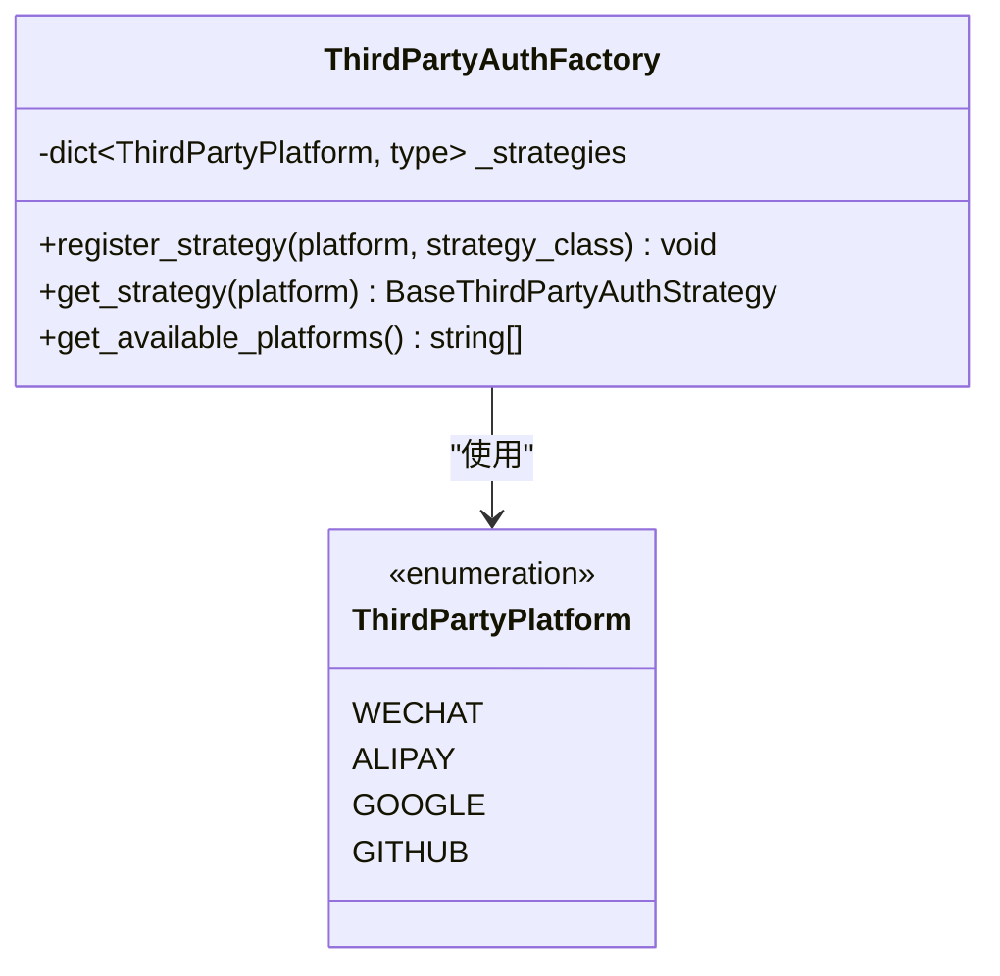
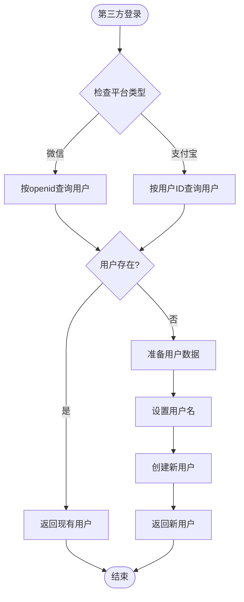
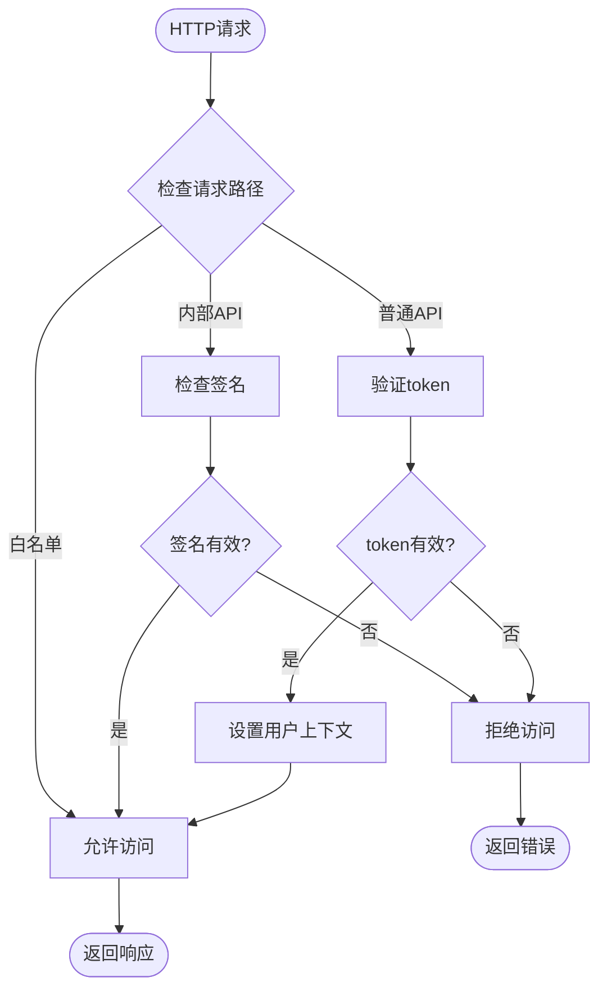
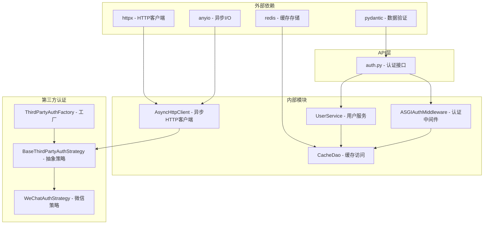

# 第三方登录集成指南

<cite>
**本文档引用的文件**
- [pkg/third_party_auth/__init__.py](file://pkg/third_party_auth/__init__.py)
- [pkg/third_party_auth/base.py](file://pkg/third_party_auth/base.py)
- [pkg/third_party_auth/config.py](file://pkg/third_party_auth/config.py)
- [pkg/third_party_auth/factory.py](file://pkg/third_party_auth/factory.py)
- [pkg/third_party_auth/strategies/wechat.py](file://pkg/third_party_auth/strategies/wechat.py)
- [internal/controllers/api/auth.py](file://internal/controllers/api/auth.py)
- [internal/services/user.py](file://internal/services/user.py)
- [internal/middlewares/auth.py](file://internal/middlewares/auth.py)
- [internal/cache/redis.py](file://internal/cache/redis.py)
- [internal/schemas/user.py](file://internal/schemas/user.py)
- [pkg/toolkit/http_cli.py](file://pkg/toolkit/http_cli.py)
- [configs/.env.dev](file://configs/.env.dev)
</cite>

## 目录
1. [简介](#简介)
2. [项目结构](#项目结构)
3. [核心组件](#核心组件)
4. [架构概览](#架构概览)
5. [详细组件分析](#详细组件分析)
6. [依赖关系分析](#依赖关系分析)
7. [性能考虑](#性能考虑)
8. [故障排除指南](#故障排除指南)
9. [结论](#结论)

## 简介

本指南详细介绍了FastAPI后端项目中的第三方登录集成功能。该项目采用策略模式和工厂模式设计，实现了可扩展的第三方认证系统，目前支持微信登录，并预留了扩展到支付宝、Google、GitHub等其他平台的能力。

第三方登录系统通过统一的抽象接口和标准化的数据结构，为不同第三方平台提供了一致的认证体验。系统采用异步编程模型，确保高并发场景下的性能表现。

## 项目结构

项目采用分层架构设计，第三方登录功能主要分布在以下模块：

**图表来源**
- [pkg/third_party_auth/__init__.py](file://pkg/third_party_auth/__init__.py#L1-L53)
- [internal/controllers/api/auth.py](file://internal/controllers/api/auth.py#L1-L300)

**章节来源**
- [pkg/third_party_auth/__init__.py](file://pkg/third_party_auth/__init__.py#L1-L53)
- [internal/controllers/api/auth.py](file://internal/controllers/api/auth.py#L1-L300)

## 核心组件

### 策略模式架构

系统采用策略模式实现第三方登录，核心组件包括：

1. **抽象基类** - 定义统一的认证接口
2. **具体策略** - 各平台的具体实现
3. **工厂类** - 策略实例化和管理
4. **配置类** - 平台特定的配置管理

### 统一数据结构

系统定义了标准的第三方用户信息结构，确保不同平台的数据一致性：

**图表来源**
- [pkg/third_party_auth/base.py](file://pkg/third_party_auth/base.py#L8-L85)
- [pkg/third_party_auth/strategies/wechat.py](file://pkg/third_party_auth/strategies/wechat.py#L12-L138)

**章节来源**
- [pkg/third_party_auth/base.py](file://pkg/third_party_auth/base.py#L1-L85)
- [pkg/third_party_auth/strategies/wechat.py](file://pkg/third_party_auth/strategies/wechat.py#L1-L138)

## 架构概览

第三方登录系统的整体架构采用分层设计，各层职责明确：

**图表来源**
- [internal/controllers/api/auth.py](file://internal/controllers/api/auth.py#L219-L300)
- [pkg/third_party_auth/strategies/wechat.py](file://pkg/third_party_auth/strategies/wechat.py#L50-L138)
- [internal/services/user.py](file://internal/services/user.py#L70-L127)

系统架构特点：

1. **异步处理** - 所有网络请求采用异步模式，提高并发性能
2. **策略隔离** - 各平台策略相互独立，便于维护和扩展
3. **配置注入** - 通过依赖注入实现配置管理，支持运行时修改
4. **统一接口** - 不同平台提供一致的API接口

## 详细组件分析

### 微信登录策略实现

微信登录策略是系统的核心实现，提供了完整的OAuth2.0认证流程：

#### 核心流程

**图表来源**
- [internal/controllers/api/auth.py](file://internal/controllers/api/auth.py#L219-L300)
- [pkg/third_party_auth/strategies/wechat.py](file://pkg/third_party_auth/strategies/wechat.py#L50-L138)

#### 微信API交互流程

**图表来源**
- [pkg/third_party_auth/strategies/wechat.py](file://pkg/third_party_auth/strategies/wechat.py#L32-L34)
- [pkg/third_party_auth/strategies/wechat.py](file://pkg/third_party_auth/strategies/wechat.py#L50-L129)

#### 配置管理

微信登录需要以下配置项：

| 配置项 | 类型 | 必填 | 描述 |
|--------|------|------|------|
| app_id | string | 是 | 微信应用ID |
| app_secret | string | 是 | 微信应用密钥 |
| grant_type | string | 否 | 授权类型，默认authorization_code |

**章节来源**
- [pkg/third_party_auth/strategies/wechat.py](file://pkg/third_party_auth/strategies/wechat.py#L1-L138)
- [pkg/third_party_auth/config.py](file://pkg/third_party_auth/config.py#L1-L48)

### 工厂模式设计

工厂类负责策略的注册和实例化，支持动态扩展新的认证平台：

#### 平台枚举

**图表来源**
- [pkg/third_party_auth/factory.py](file://pkg/third_party_auth/factory.py#L11-L117)

**章节来源**
- [pkg/third_party_auth/factory.py](file://pkg/third_party_auth/factory.py#L1-L117)

### 用户服务集成

用户服务负责处理第三方登录后的用户管理逻辑：

#### 用户获取或创建流程

**图表来源**
- [internal/services/user.py](file://internal/services/user.py#L70-L127)

**章节来源**
- [internal/services/user.py](file://internal/services/user.py#L1-L187)

### 认证中间件

认证中间件负责处理请求的认证和授权：

#### 认证流程

**图表来源**
- [internal/middlewares/auth.py](file://internal/middlewares/auth.py#L85-L148)

**章节来源**
- [internal/middlewares/auth.py](file://internal/middlewares/auth.py#L1-L148)

## 依赖关系分析

第三方登录系统的依赖关系清晰，层次分明：

**图表来源**
- [pkg/toolkit/http_cli.py](file://pkg/toolkit/http_cli.py#L38-L75)
- [internal/cache/redis.py](file://internal/cache/redis.py#L6-L41)
- [pkg/third_party_auth/base.py](file://pkg/third_party_auth/base.py#L27-L85)

**章节来源**
- [pkg/toolkit/http_cli.py](file://pkg/toolkit/http_cli.py#L1-L232)
- [internal/cache/redis.py](file://internal/cache/redis.py#L1-L41)

## 性能考虑

### 异步编程模型

系统采用完全的异步编程模型，具有以下优势：

1. **高并发处理** - 异步HTTP客户端支持大量并发请求
2. **资源高效利用** - 事件驱动模型减少线程切换开销
3. **响应式设计** - 适合I/O密集型的第三方API调用

### 缓存策略

系统使用Redis作为缓存层，优化认证性能：

| 缓存键类型 | 键格式 | 过期时间 | 用途 |
|------------|--------|----------|------|
| 认证token | token:{token} | 30分钟 | 存储用户元数据 |
| 用户token列表 | token_list:{user_id} | 30分钟 | 存储用户所有token |

### 错误处理机制

系统实现了完善的错误处理机制：

1. **网络异常处理** - 自动重试和超时控制
2. **第三方API错误** - 标准化的错误响应
3. **配置验证** - 运行时配置有效性检查

## 故障排除指南

### 常见问题及解决方案

#### 微信授权失败

**症状**：微信登录返回"微信授权失败"

**可能原因**：
1. 授权码过期或无效
2. 微信应用配置错误
3. 网络连接问题

**解决步骤**：
1. 检查授权码的有效期（通常5分钟）
2. 验证微信应用的app_id和app_secret
3. 确认网络连接正常

#### 用户信息获取失败

**症状**：获取微信用户信息时抛出异常

**可能原因**：
1. access_token失效
2. 用户拒绝授权
3. 微信API限流

**解决步骤**：
1. 重新获取access_token
2. 检查用户授权状态
3. 实现重试机制

#### Token验证失败

**症状**：认证中间件返回"Token verification failed"

**可能原因**：
1. token不存在或已过期
2. 用户token列表中找不到该token
3. Redis连接异常

**解决步骤**：
1. 检查Redis连接状态
2. 验证token格式和有效期
3. 确认用户token列表同步

**章节来源**
- [internal/controllers/api/auth.py](file://internal/controllers/api/auth.py#L291-L296)
- [internal/middlewares/auth.py](file://internal/middlewares/auth.py#L129-L147)

### 调试建议

1. **启用详细日志** - 在开发环境设置DEBUG=true
2. **监控第三方API** - 关注微信API的响应时间和错误率
3. **性能监控** - 监控Redis和HTTP客户端的性能指标

## 结论

本第三方登录系统通过策略模式和工厂模式的设计，实现了高度可扩展的认证架构。系统具有以下特点：

1. **模块化设计** - 各组件职责明确，易于维护和扩展
2. **异步处理** - 支持高并发场景，性能优异
3. **配置灵活** - 通过依赖注入实现配置管理
4. **错误处理完善** - 提供全面的错误处理和恢复机制

系统目前支持微信登录，通过工厂模式可以轻松扩展到支付宝、Google、GitHub等其他平台。建议在生产环境中配合适当的监控和告警机制，确保系统的稳定性和可靠性。