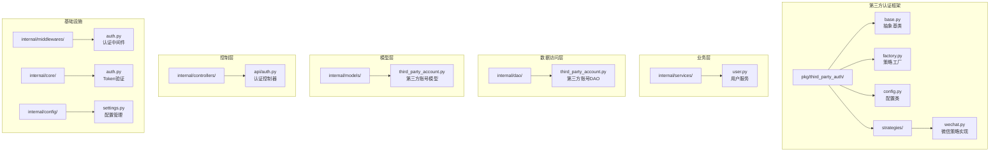
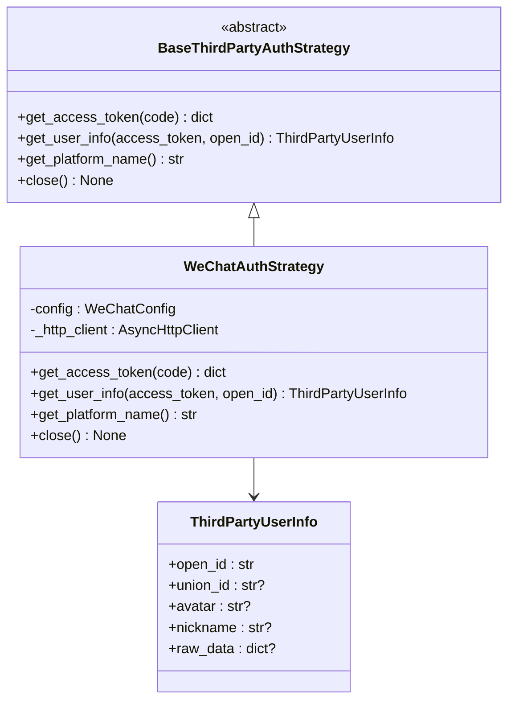
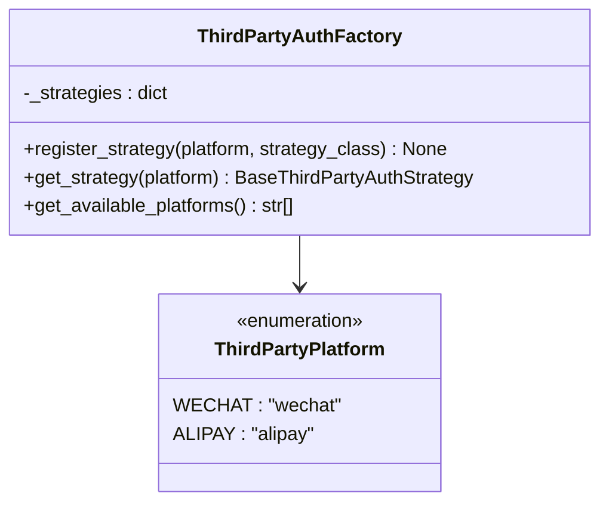
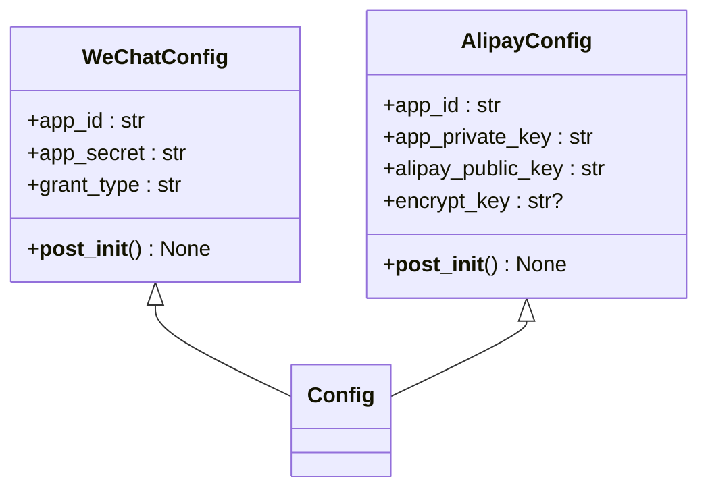
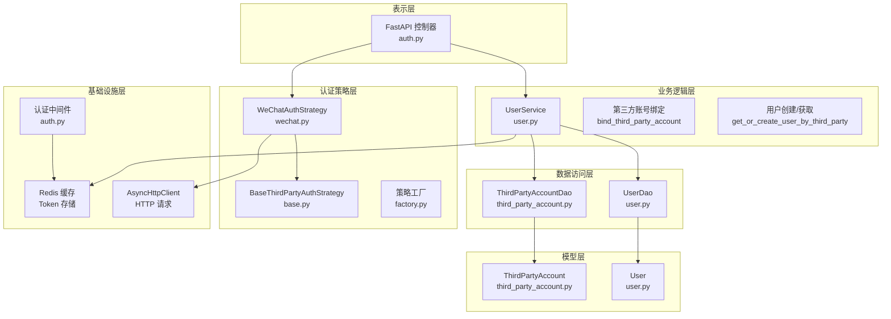
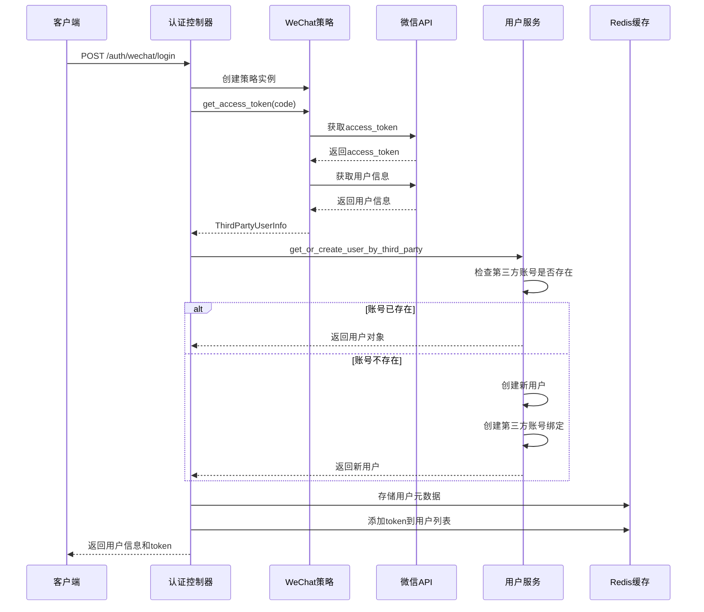
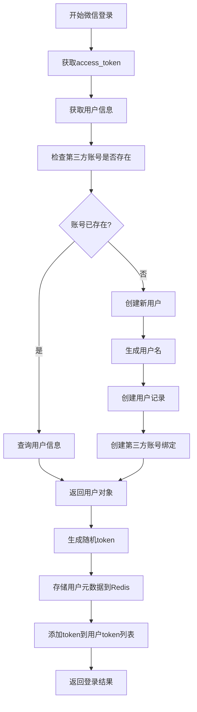
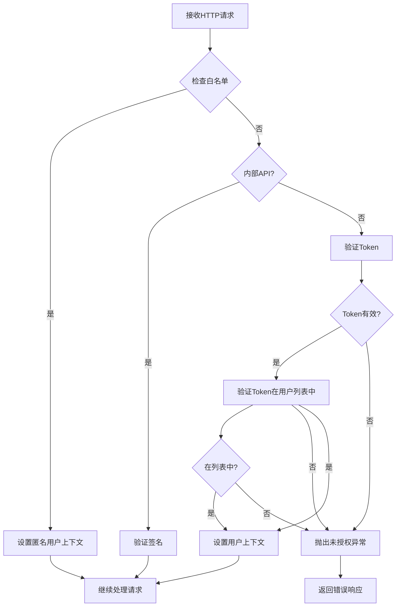
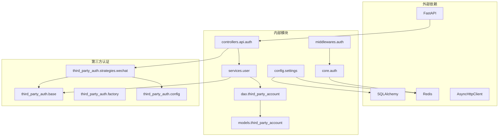
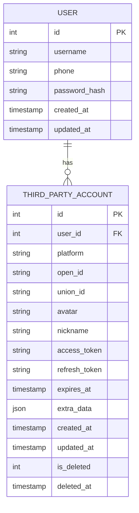

# 第三方认证框架

<cite>
**本文档引用的文件**
- [pkg/third_party_auth/base.py](file://pkg/third_party_auth/base.py)
- [pkg/third_party_auth/factory.py](file://pkg/third_party_auth/factory.py)
- [pkg/third_party_auth/config.py](file://pkg/third_party_auth/config.py)
- [pkg/third_party_auth/strategies/wechat.py](file://pkg/third_party_auth/strategies/wechat.py)
- [internal/controllers/api/auth.py](file://internal/controllers/api/auth.py)
- [internal/services/user.py](file://internal/services/user.py)
- [internal/models/third_party_account.py](file://internal/models/third_party_account.py)
- [internal/dao/third_party_account.py](file://internal/dao/third_party_account.py)
- [internal/middlewares/auth.py](file://internal/middlewares/auth.py)
- [internal/core/auth.py](file://internal/core/auth.py)
- [internal/config/settings.py](file://internal/config/settings.py)
- [docs/auth_module_guide.md](file://docs/auth_module_guide.md)
</cite>

## 目录
1. [简介](#简介)
2. [项目结构](#项目结构)
3. [核心组件](#核心组件)
4. [架构概览](#架构概览)
5. [详细组件分析](#详细组件分析)
6. [依赖关系分析](#依赖关系分析)
7. [性能考虑](#性能考虑)
8. [故障排除指南](#故障排除指南)
9. [结论](#结论)

## 简介

这是一个基于 FastAPI 的第三方认证框架，专门用于处理微信等第三方平台的用户认证。该框架采用策略模式设计，支持可扩展的认证策略注册机制，提供了完整的用户身份验证、第三方账号绑定和会话管理功能。

框架的核心特点包括：
- 策略模式实现的可扩展认证系统
- 统一的第三方用户信息数据结构
- 基于 Redis 的 Token 认证机制
- 完整的用户生命周期管理
- 类型安全的配置系统

## 项目结构

第三方认证框架主要分布在以下目录结构中：

**图表来源**
- [pkg/third_party_auth/base.py](file://pkg/third_party_auth/base.py#L1-L85)
- [pkg/third_party_auth/factory.py](file://pkg/third_party_auth/factory.py#L1-L117)
- [internal/controllers/api/auth.py](file://internal/controllers/api/auth.py#L1-L299)

**章节来源**
- [pkg/third_party_auth/base.py](file://pkg/third_party_auth/base.py#L1-L85)
- [pkg/third_party_auth/factory.py](file://pkg/third_party_auth/factory.py#L1-L117)
- [internal/controllers/api/auth.py](file://internal/controllers/api/auth.py#L1-L299)

## 核心组件

### 抽象基类层

框架的核心是 `BaseThirdPartyAuthStrategy` 抽象基类，它定义了所有第三方认证策略必须实现的标准接口：

**图表来源**
- [pkg/third_party_auth/base.py](file://pkg/third_party_auth/base.py#L27-L85)
- [pkg/third_party_auth/strategies/wechat.py](file://pkg/third_party_auth/strategies/wechat.py#L12-L138)

### 策略工厂层

`ThirdPartyAuthFactory` 提供了策略注册和获取的工厂模式实现：

**图表来源**
- [pkg/third_party_auth/factory.py](file://pkg/third_party_auth/factory.py#L23-L117)

### 配置管理层

框架提供了类型安全的配置类系统：

**图表来源**
- [pkg/third_party_auth/config.py](file://pkg/third_party_auth/config.py#L6-L48)

**章节来源**
- [pkg/third_party_auth/base.py](file://pkg/third_party_auth/base.py#L1-L85)
- [pkg/third_party_auth/factory.py](file://pkg/third_party_auth/factory.py#L1-L117)
- [pkg/third_party_auth/config.py](file://pkg/third_party_auth/config.py#L1-L48)

## 架构概览

第三方认证框架采用分层架构设计，实现了清晰的关注点分离：

**图表来源**
- [internal/controllers/api/auth.py](file://internal/controllers/api/auth.py#L1-L299)
- [internal/services/user.py](file://internal/services/user.py#L1-L186)
- [internal/dao/third_party_account.py](file://internal/dao/third_party_account.py#L1-L44)

## 详细组件分析

### 微信认证策略实现

微信认证策略是框架的核心实现，展示了完整的 OAuth2.0 流程：

**图表来源**
- [internal/controllers/api/auth.py](file://internal/controllers/api/auth.py#L218-L299)
- [pkg/third_party_auth/strategies/wechat.py](file://pkg/third_party_auth/strategies/wechat.py#L50-L138)
- [internal/services/user.py](file://internal/services/user.py#L71-L124)

### 用户服务核心逻辑

用户服务负责处理用户生命周期管理和第三方账号绑定：

**图表来源**
- [internal/services/user.py](file://internal/services/user.py#L71-L124)

### 认证中间件流程

认证中间件实现了基于 Redis 的 Token 验证机制：

**图表来源**
- [internal/middlewares/auth.py](file://internal/middlewares/auth.py#L85-L148)

**章节来源**
- [pkg/third_party_auth/strategies/wechat.py](file://pkg/third_party_auth/strategies/wechat.py#L1-L138)
- [internal/services/user.py](file://internal/services/user.py#L1-L186)
- [internal/middlewares/auth.py](file://internal/middlewares/auth.py#L1-L148)

## 依赖关系分析

框架的依赖关系展现了清晰的分层架构：

**图表来源**
- [internal/controllers/api/auth.py](file://internal/controllers/api/auth.py#L1-L299)
- [internal/services/user.py](file://internal/services/user.py#L1-L186)
- [pkg/third_party_auth/strategies/wechat.py](file://pkg/third_party_auth/strategies/wechat.py#L1-L138)

### 数据模型关系

第三方认证框架的数据模型展现了完整的用户和第三方账号关系：

**图表来源**
- [internal/models/third_party_account.py](file://internal/models/third_party_account.py#L10-L122)

**章节来源**
- [internal/dao/third_party_account.py](file://internal/dao/third_party_account.py#L1-L44)
- [internal/models/third_party_account.py](file://internal/models/third_party_account.py#L1-L122)

## 性能考虑

### 缓存策略优化

框架采用了多层缓存策略来提升性能：

1. **Redis 缓存层**：存储用户元数据和 Token 列表
2. **HTTP 客户端缓存**：微信 API 请求的异步客户端
3. **数据库查询优化**：针对第三方账号查询的复合索引

### 异步处理优势

- 使用 `async/await` 模式处理第三方 API 调用
- 非阻塞的 HTTP 请求处理
- Redis 操作的异步化

### 扩展性考虑

- 策略工厂支持动态注册新认证平台
- 配置类提供类型安全的参数验证
- 抽象基类确保新策略的一致性

## 故障排除指南

### 常见问题及解决方案

#### 1. 微信认证失败

**症状**：微信登录接口返回错误

**可能原因**：
- 微信 AppID 或 AppSecret 配置错误
- 授权码已过期或无效
- 网络连接问题

**解决步骤**：
1. 检查 `.env` 文件中的微信配置
2. 验证授权码的有效性
3. 确认网络连接正常

#### 2. Token 验证失败

**症状**：用户已登录但接口返回未授权

**可能原因**：
- Token 已过期
- Token 不在用户 Token 列表中
- Redis 服务异常

**解决步骤**：
1. 检查 Redis 服务状态
2. 验证 Token TTL 设置
3. 确认用户 Token 列表完整性

#### 3. 第三方账号绑定冲突

**症状**：绑定第三方账号时报错

**可能原因**：
- 该第三方账号已被其他用户绑定
- 数据库约束冲突

**解决步骤**：
1. 检查第三方账号是否已被绑定
2. 解除原有绑定关系
3. 重新建立绑定

**章节来源**
- [internal/controllers/api/auth.py](file://internal/controllers/api/auth.py#L290-L299)
- [internal/services/user.py](file://internal/services/user.py#L142-L149)

## 结论

第三方认证框架展现了良好的软件工程实践：

### 设计优势

1. **策略模式应用**：通过抽象基类和工厂模式实现了高度可扩展的认证系统
2. **分层架构**：清晰的职责分离使得代码易于维护和测试
3. **类型安全**：使用 Pydantic 和类型注解确保配置和数据的正确性
4. **异步处理**：充分利用 Python 异步特性提升性能

### 扩展建议

1. **支持更多平台**：通过策略工厂轻松添加新的第三方认证平台
2. **增强安全性**：实现 refresh token 机制和更严格的密码策略
3. **监控和日志**：添加详细的认证事件监控和审计日志
4. **缓存优化**：实现更智能的缓存策略和失效机制

该框架为构建企业级认证系统提供了坚实的基础，其模块化设计和清晰的架构使其能够适应各种复杂的业务需求。