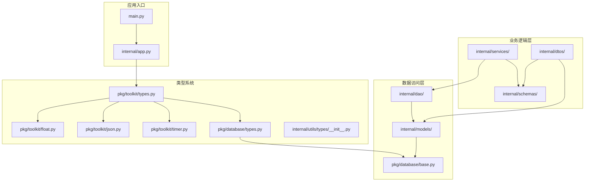
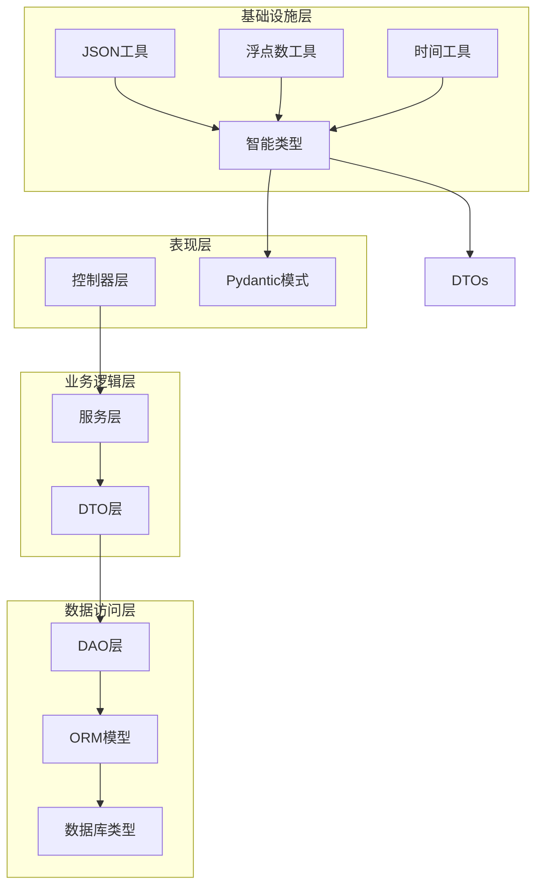
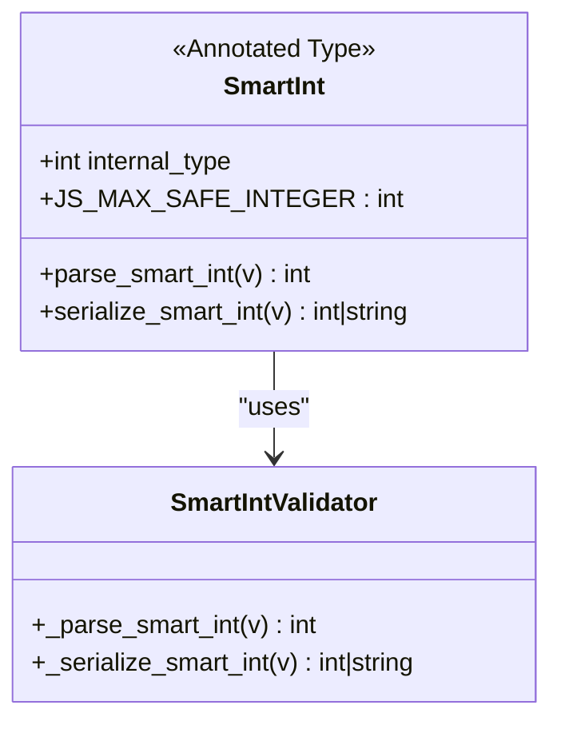
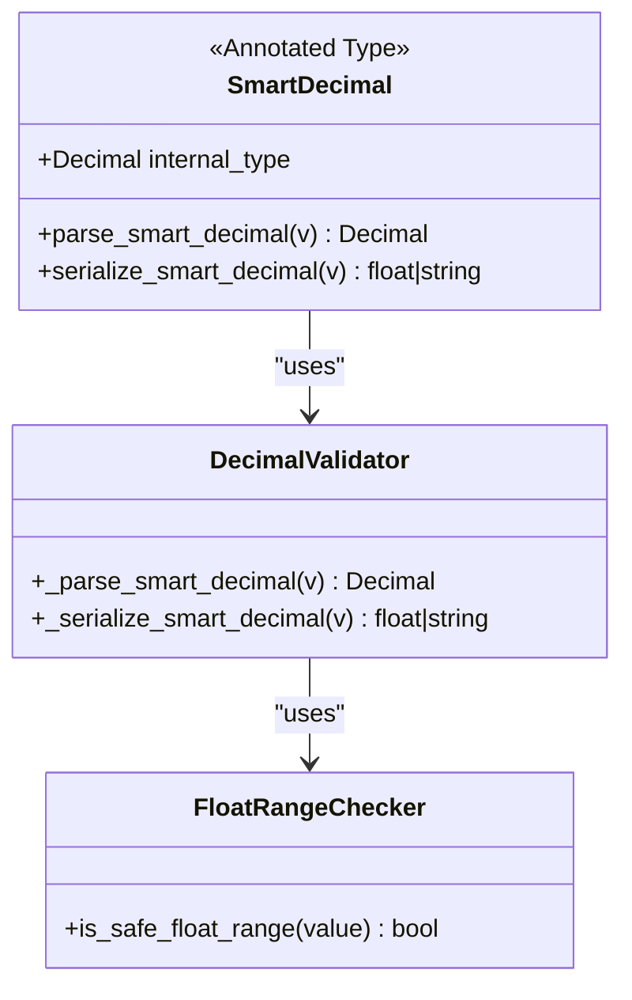
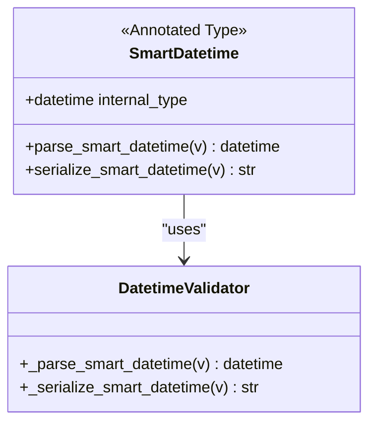
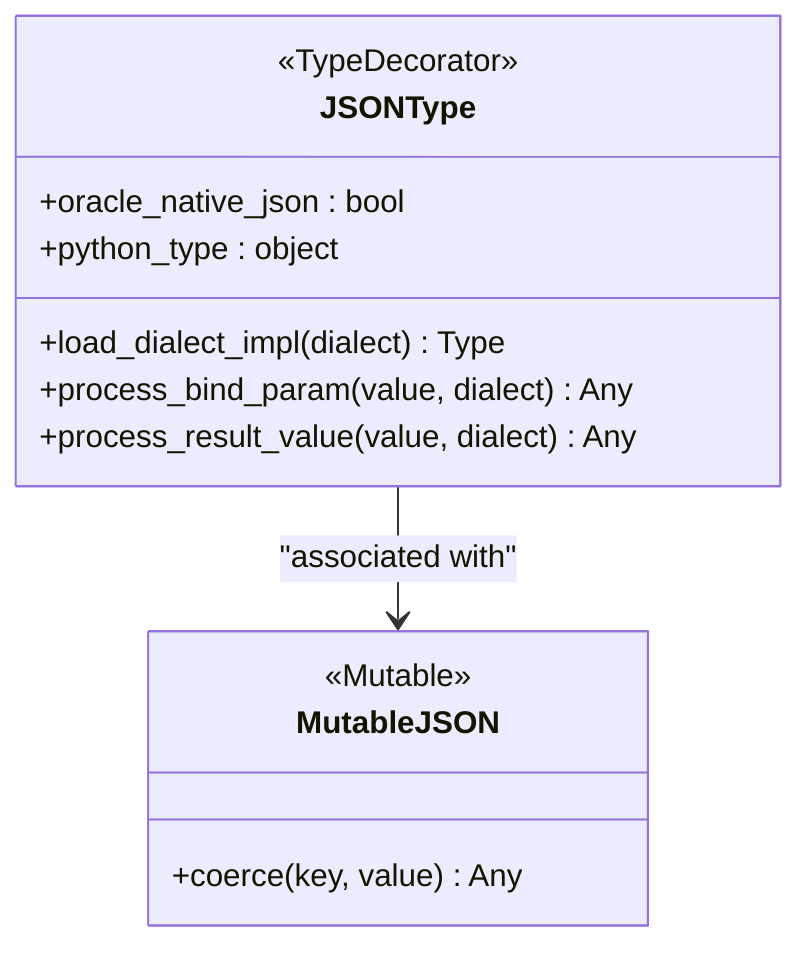
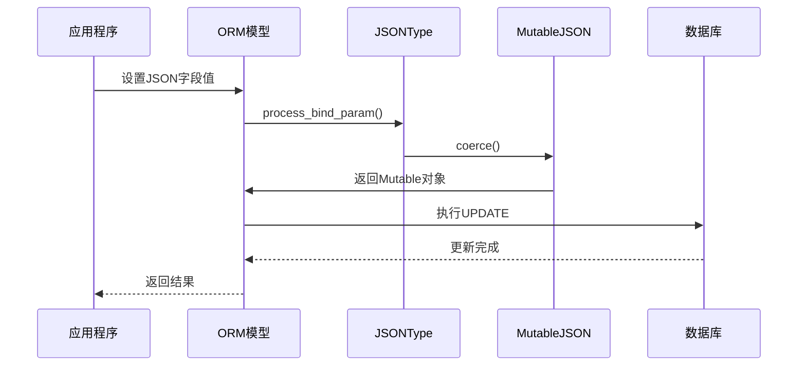
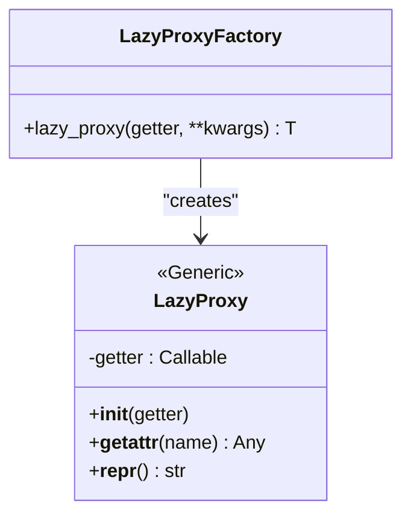

# 类型系统增强

<cite>
**本文档引用的文件**
- [main.py](file://main.py)
- [internal/app.py](file://internal/app.py)
- [pkg/toolkit/types.py](file://pkg/toolkit/types.py)
- [pkg/database/types.py](file://pkg/database/types.py)
- [internal/utils/types/__init__.py](file://internal/utils/types/__init__.py)
- [pkg/toolkit/float.py](file://pkg/toolkit/float.py)
- [pkg/toolkit/json.py](file://pkg/toolkit/json.py)
- [pkg/toolkit/timer.py](file://pkg/toolkit/timer.py)
- [internal/dtos/user.py](file://internal/dtos/user.py)
- [internal/schemas/user.py](file://internal/schemas/user.py)
- [internal/models/user.py](file://internal/models/user.py)
- [tests/toolkit/test_smart_types.py](file://tests/toolkit/test_smart_types.py)
- [pkg/database/base.py](file://pkg/database/base.py)
- [internal/dao/user.py](file://internal/dao/user.py)
- [pyproject.toml](file://pyproject.toml)
- [pkg/toolkit/inter.py](file://pkg/toolkit/inter.py)
- [internal/services/user.py](file://internal/services/user.py)
</cite>

## 更新摘要
**变更内容**
- 更新了 SmartInt、SmartDecimal、SmartDatetime、IntStr 类型的增强实现
- 新增了更严格的类型拒绝机制和更好的 JSON 序列化兼容性
- 重构了 LazyProxy 的实现，增强了类型安全性
- 改进了浮点数范围检查机制
- 增强了 JSON 序列化工具的错误处理能力

## 目录
1. [简介](#简介)
2. [项目结构](#项目结构)
3. [核心组件](#核心组件)
4. [架构概览](#架构概览)
5. [详细组件分析](#详细组件分析)
6. [依赖分析](#依赖分析)
7. [性能考虑](#性能考虑)
8. [故障排除指南](#故障排除指南)
9. [结论](#结论)

## 简介

本项目是一个基于FastAPI的后端服务，专注于类型系统的增强和优化。项目实现了多种智能类型（Smart Types），包括SmartInt、SmartDecimal、SmartDatetime等，旨在解决前后端数据传输中的类型兼容性和精度问题。

主要特性包括：
- 智能整数类型，自动处理JavaScript安全整数范围
- 高精度十进制类型，智能选择float或string序列化
- 统一时区处理的日期时间类型
- 跨数据库兼容的JSON类型
- 懒加载代理模式，支持延迟初始化
- 完整的类型注解和Pydantic集成

## 项目结构

项目采用模块化的组织方式，主要分为以下几个层次：



**图表来源**
- [main.py:1-4](file://main.py#L1-L4)
- [internal/app.py:1-111](file://internal/app.py#L1-L111)
- [pkg/toolkit/types.py:1-278](file://pkg/toolkit/types.py#L1-L278)

**章节来源**
- [main.py:1-4](file://main.py#L1-L4)
- [internal/app.py:1-111](file://internal/app.py#L1-L111)

## 核心组件

### 智能类型系统

项目实现了五个核心的智能类型，通过Annotated类型注解提供强大的类型转换和序列化能力：

#### SmartInt - 智能整数类型
- **输入处理**：支持int和str类型的统一转换
- **输出处理**：超过JavaScript安全范围时自动转换为字符串
- **验证机制**：严格的类型检查和错误处理，拒绝bool类型输入

#### SmartDecimal - 智能十进制类型
- **输入处理**：支持Decimal、int、float、str的统一转换
- **输出处理**：根据精度和范围智能选择float或string
- **精度保证**：使用Decimal确保高精度计算
- **特殊值处理**：正确处理NaN和Infinity

#### SmartDatetime - 智能日期时间类型
- **输入处理**：支持ISO格式字符串和datetime对象
- **时区处理**：统一转换为UTC的naive datetime
- **序列化**：标准化的ISO 8601格式输出

#### IntStr - 强制字符串ID类型
- **用途**：确保ID在Python内部作为string处理
- **应用场景**：需要保持ID字符串格式的业务逻辑
- **类型拒绝**：拒绝None、bool、list、dict等类型输入

#### LazyProxy - 懒加载代理类型
- **设计目的**：解决模块导入时对象未初始化的问题
- **类型支持**：完整的泛型类型提示支持
- **运行时转发**：自动将属性访问转发到真实对象
- **重构改进**：增强了类型安全性和错误处理

**章节来源**
- [pkg/toolkit/types.py:14-278](file://pkg/toolkit/types.py#L14-L278)
- [pkg/toolkit/float.py:1-41](file://pkg/toolkit/float.py#L1-L41)

### 数据库类型系统

#### JSONType - 跨数据库兼容的JSON类型
- **多数据库支持**：PostgreSQL(JSONB)、MySQL(JSON)、SQLite(JSON)、Oracle原生JSON/CLOB
- **智能序列化**：根据数据库类型选择最优的序列化策略
- **变更追踪**：与SQLAlchemy的Mutable系统集成
- **容错机制**：读取非JSON格式数据时不会抛异常

#### MutableJSON - 智能JSON变更追踪器
- **自动追踪**：能够识别dict和list并委托给相应的Mutable类型
- **深度变更**：支持嵌套结构的变更检测

**章节来源**
- [pkg/database/types.py:1-187](file://pkg/database/types.py#L1-L187)
- [pkg/database/base.py:1-309](file://pkg/database/base.py#L1-L309)

### 业务类型定义

#### 枚举类型
- **UserStatus**：用户状态枚举（active、inactive、banned、deleted）
- **TokenType**：Token类型枚举（access、refresh、verify_email、reset_password）

#### 常量定义
- **CachePrefix**：Redis缓存键前缀常量
- **LockKey**：分布式锁键名生成工具
- **全局常量**：分页大小、Token过期时间等

**章节来源**
- [internal/utils/types/__init__.py:1-76](file://internal/utils/types/__init__.py#L1-L76)

## 架构概览

项目采用分层架构设计，类型系统贯穿整个应用：



**图表来源**
- [internal/schemas/user.py:1-69](file://internal/schemas/user.py#L1-L69)
- [internal/services/user.py:1-186](file://internal/services/user.py#L1-L186)
- [internal/dtos/user.py:1-20](file://internal/dtos/user.py#L1-L20)
- [internal/dao/user.py:1-31](file://internal/dao/user.py#L1-L31)

## 详细组件分析

### 智能类型实现分析

#### SmartInt 类型实现



**图表来源**
- [pkg/toolkit/types.py:18-65](file://pkg/toolkit/types.py#L18-L65)

SmartInt类型的核心实现包括：

1. **输入验证**：严格检查输入类型，支持int和str，拒绝bool类型
2. **范围检查**：与JavaScript最大安全整数比较
3. **序列化策略**：根据范围选择int或str输出

#### SmartDecimal 类型实现



**图表来源**
- [pkg/toolkit/types.py:68-121](file://pkg/toolkit/types.py#L68-L121)
- [pkg/toolkit/float.py:4-41](file://pkg/toolkit/float.py#L4-L41)

SmartDecimal类型的关键特性：

1. **高精度处理**：使用Decimal确保计算精度
2. **智能序列化**：根据精度和范围选择最优输出格式
3. **特殊值处理**：正确处理NaN和Infinity

#### SmartDatetime 类型实现



**图表来源**
- [pkg/toolkit/types.py:123-177](file://pkg/toolkit/types.py#L123-L177)

SmartDatetime类型的处理流程：

1. **输入解析**：支持ISO格式字符串和datetime对象
2. **时区转换**：统一转换为UTC的naive datetime
3. **序列化输出**：标准化的ISO 8601格式

### JSON类型系统分析

#### JSONType 类型实现



**图表来源**
- [pkg/database/types.py:16-187](file://pkg/database/types.py#L16-L187)

JSONType的数据库适配策略：

1. **PostgreSQL**：使用JSONB类型，支持索引和查询
2. **MySQL**：使用原生JSON类型
3. **SQLite**：使用方言特定的JSON类型
4. **Oracle**：支持原生JSON和CLOB两种模式
5. **其他数据库**：使用TEXT类型

#### 变更追踪机制



**图表来源**
- [pkg/database/types.py:152-187](file://pkg/database/types.py#L152-L187)

**章节来源**
- [pkg/database/types.py:1-187](file://pkg/database/types.py#L1-L187)
- [pkg/toolkit/json.py:1-108](file://pkg/toolkit/json.py#L1-L108)

### 懒加载代理模式

LazyProxy模式解决了模块导入时对象未初始化的问题：



**图表来源**
- [pkg/toolkit/types.py:211-278](file://pkg/toolkit/types.py#L211-L278)

LazyProxy的设计优势：

1. **类型安全**：完整的泛型类型提示支持
2. **延迟初始化**：运行时动态获取实际对象
3. **透明访问**：自动转发属性访问到真实对象
4. **错误处理**：增强了未初始化时的错误处理

**章节来源**
- [pkg/toolkit/types.py:211-278](file://pkg/toolkit/types.py#L211-L278)

## 依赖分析

项目的主要依赖关系如下：

```mermaid
graph TB
subgraph "核心依赖"
FASTAPI[fastapi]
PYDANTIC[pydantic]
SQLALCHEMY[sqlalchemy]
ORJSON[orjson]
END
subgraph "工具库"
ANNOTATED_TYPES[annotated-types]
NUMPY[numpy]
REDIS[redis]
JWT[PyJWT]
END
subgraph "类型系统"
TYPES_PKG[pkg/toolkit/types.py]
DBTYPES_PKG[pkg/database/types.py]
FLOAT_UTIL[pkg/toolkit/float.py]
JSON_UTIL[pkg/toolkit/json.py]
TIMER_UTIL[pkg/toolkit/timer.py]
END
TYPES_PKG --> PYDANTIC
TYPES_PKG --> ANNOTATED_TYPES
DBTYPES_PKG --> SQLALCHEMY
DBTYPES_PKG --> ORJSON
JSON_UTIL --> ORJSON
JSON_UTIL --> FLOAT_UTIL
TIMER_UTIL --> PYDANTIC
```

**图表来源**
- [pyproject.toml:9-71](file://pyproject.toml#L9-L71)

**章节来源**
- [pyproject.toml:1-156](file://pyproject.toml#L1-L156)

## 性能考虑

### 类型转换性能优化

1. **智能序列化策略**：根据数据特征选择最优的序列化方式
2. **懒加载机制**：避免不必要的对象初始化
3. **缓存友好的设计**：减少重复的类型转换开销

### 数据库性能优化

1. **JSON类型适配**：根据不同数据库选择最优的存储方式
2. **批量操作支持**：提供高性能的批量插入和更新接口
3. **连接池管理**：合理的数据库连接池配置

### 内存使用优化

1. **类型注解**：提供精确的类型信息，减少运行时类型检查
2. **数据结构优化**：使用高效的内置数据类型
3. **序列化优化**：最小化JSON序列化的内存占用

## 故障排除指南

### 常见类型转换错误

1. **SmartInt转换失败**
   - 检查输入是否为有效的整数或数字字符串
   - 确认数值没有超出JavaScript安全范围
   - 避免使用bool类型输入

2. **SmartDecimal精度问题**
   - 验证输入是否为有效的数字格式
   - 检查小数位数是否超过限制
   - 注意NaN和Infinity的特殊处理

3. **SmartDatetime解析错误**
   - 确认ISO格式字符串的正确性
   - 检查时区信息的格式
   - 验证日期时间的有效性

4. **IntStr类型拒绝**
   - 避免使用None、bool、list、dict等类型
   - 确保输入为int或str类型

### 数据库类型问题

1. **JSON序列化失败**
   - 检查数据库驱动版本兼容性
   - 验证JSON数据的格式正确性
   - 注意Oracle版本兼容性

2. **变更追踪失效**
   - 确认MutableJSON正确关联到JSONType
   - 检查嵌套结构的变更处理

3. **LazyProxy初始化问题**
   - 确保getter函数正确实现
   - 检查未初始化时的错误处理

**章节来源**
- [tests/toolkit/test_smart_types.py:1-278](file://tests/toolkit/test_smart_types.py#L1-L278)

## 结论

本项目在类型系统方面实现了全面的增强，主要体现在：

1. **智能类型设计**：通过Annotated类型注解提供了强大的类型转换和验证能力
2. **跨平台兼容性**：确保前后端数据传输的一致性和准确性
3. **性能优化**：智能的序列化策略和懒加载机制
4. **扩展性**：模块化的类型系统设计，易于扩展和维护
5. **类型安全**：增强了类型拒绝机制，提高了系统的健壮性

这些类型系统的增强为整个应用提供了坚实的基础，确保了数据的准确性和系统的可靠性。通过智能的类型转换和验证，项目能够更好地处理复杂的业务场景，同时保持良好的性能表现。