# 通用工具包

<cite>
**本文引用的文件**
- [pkg/toolkit/async_task.py](file://pkg/toolkit/async_task.py)
- [pkg/toolkit/cache.py](file://pkg/toolkit/cache.py)
- [pkg/toolkit/http_cli.py](file://pkg/toolkit/http_cli.py)
- [pkg/toolkit/jwt.py](file://pkg/toolkit/jwt.py)
- [pkg/toolkit/signature.py](file://pkg/toolkit/signature.py)
- [pkg/toolkit/response.py](file://pkg/toolkit/response.py)
- [pkg/toolkit/config_loader.py](file://pkg/toolkit/config_loader.py)
- [pkg/toolkit/context.py](file://pkg/toolkit/context.py)
- [pkg/toolkit/json.py](file://pkg/toolkit/json.py)
- [pkg/toolkit/string.py](file://pkg/toolkit/string.py)
- [pkg/toolkit/types.py](file://pkg/toolkit/types.py)
- [pkg/toolkit/timer.py](file://pkg/toolkit/timer.py)
- [pkg/toolkit/celery.py](file://pkg/toolkit/celery.py)
- [pkg/toolkit/logger.py](file://pkg/toolkit/logger.py)
- [pkg/toolkit/exc.py](file://pkg/toolkit/exc.py)
</cite>

## 目录
1. [简介](#简介)
2. [项目结构](#项目结构)
3. [核心组件](#核心组件)
4. [架构总览](#架构总览)
5. [详细组件分析](#详细组件分析)
6. [依赖关系分析](#依赖关系分析)
7. [性能考量](#性能考量)
8. [故障排查指南](#故障排查指南)
9. [结论](#结论)
10. [附录](#附录)

## 简介
本文件为通用工具包的综合文档，覆盖异步任务处理、缓存管理、HTTP 客户端、日志记录、JWT 认证、签名验证、响应格式化、配置加载、上下文管理、类型转换、计时与时间处理、Celery 任务编排、JSON 序列化与反序列化、字符串与 URL 工具、异常追踪等能力。文档旨在帮助开发者快速理解各工具的设计目的、适用场景、使用方式与最佳实践，并解释工具间的协作关系与依赖配置。

## 项目结构
通用工具包位于 pkg/toolkit 下，按功能域划分模块，每个模块聚焦单一职责，便于独立使用与组合集成。核心模块包括：
- 异步任务：async_task.py
- 缓存：cache.py
- HTTP 客户端：http_cli.py
- JWT：jwt.py
- 签名验证：signature.py
- 响应格式化：response.py
- 配置加载：config_loader.py
- 上下文：context.py
- JSON：json.py
- 字符串与URL：string.py
- 类型转换：types.py
- 计时与时间：timer.py
- Celery：celery.py
- 日志兼容导出：logger.py
- 异常追踪：exc.py

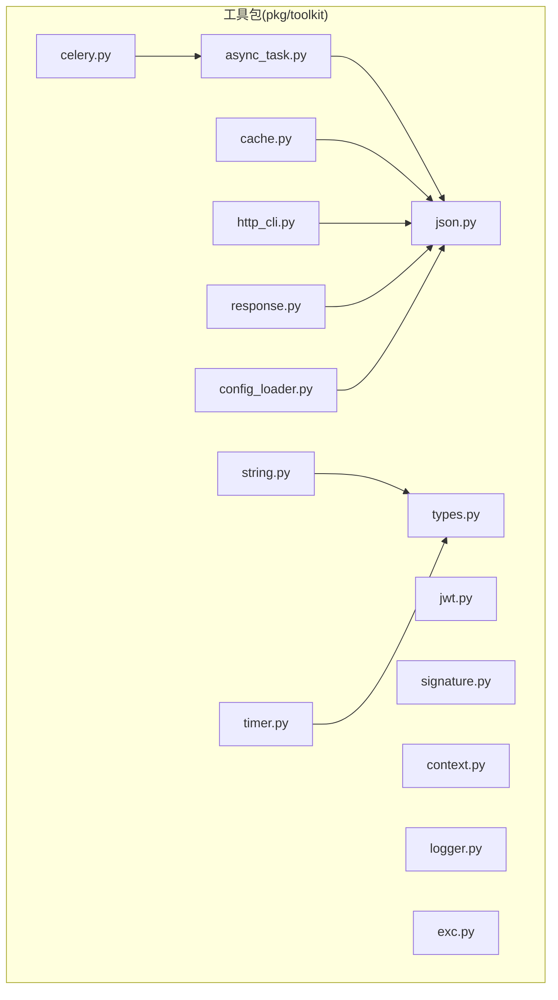

**图表来源**
- [pkg/toolkit/async_task.py](file://pkg/toolkit/async_task.py#L1-L375)
- [pkg/toolkit/cache.py](file://pkg/toolkit/cache.py#L1-L249)
- [pkg/toolkit/http_cli.py](file://pkg/toolkit/http_cli.py#L1-L232)
- [pkg/toolkit/response.py](file://pkg/toolkit/response.py#L1-L233)
- [pkg/toolkit/config_loader.py](file://pkg/toolkit/config_loader.py#L1-L215)
- [pkg/toolkit/context.py](file://pkg/toolkit/context.py#L1-L107)
- [pkg/toolkit/json.py](file://pkg/toolkit/json.py#L1-L108)
- [pkg/toolkit/string.py](file://pkg/toolkit/string.py#L1-L111)
- [pkg/toolkit/types.py](file://pkg/toolkit/types.py#L1-L245)
- [pkg/toolkit/timer.py](file://pkg/toolkit/timer.py#L1-L80)
- [pkg/toolkit/celery.py](file://pkg/toolkit/celery.py#L1-L198)
- [pkg/toolkit/logger.py](file://pkg/toolkit/logger.py#L1-L32)
- [pkg/toolkit/exc.py](file://pkg/toolkit/exc.py#L1-L16)

**章节来源**
- [pkg/toolkit/async_task.py](file://pkg/toolkit/async_task.py#L1-L375)
- [pkg/toolkit/cache.py](file://pkg/toolkit/cache.py#L1-L249)
- [pkg/toolkit/http_cli.py](file://pkg/toolkit/http_cli.py#L1-L232)
- [pkg/toolkit/response.py](file://pkg/toolkit/response.py#L1-L233)
- [pkg/toolkit/config_loader.py](file://pkg/toolkit/config_loader.py#L1-L215)
- [pkg/toolkit/context.py](file://pkg/toolkit/context.py#L1-L107)
- [pkg/toolkit/json.py](file://pkg/toolkit/json.py#L1-L108)
- [pkg/toolkit/string.py](file://pkg/toolkit/string.py#L1-L111)
- [pkg/toolkit/types.py](file://pkg/toolkit/types.py#L1-L245)
- [pkg/toolkit/timer.py](file://pkg/toolkit/timer.py#L1-L80)
- [pkg/toolkit/celery.py](file://pkg/toolkit/celery.py#L1-L198)
- [pkg/toolkit/logger.py](file://pkg/toolkit/logger.py#L1-L32)
- [pkg/toolkit/exc.py](file://pkg/toolkit/exc.py#L1-L16)

## 核心组件
- 异步任务处理：基于 AnyIO 的任务管理器，支持并发限制、超时、取消、线程/进程执行、批量任务与抖动控制。
- 缓存管理：Redis 客户端封装，提供键值、字典、列表、哈希、分布式锁等常用操作，并统一异常处理。
- HTTP 客户端：基于 httpx 的长连接客户端，支持流式下载、进度回调、统一错误处理与响应封装。
- JWT 认证：令牌创建与验证，支持过期时间与负载字段约定。
- 签名验证：HMAC 签名与时间戳校验，支持多种哈希算法与容忍窗口。
- 响应格式化：统一响应体结构、分页响应、SSE 包装、高性能 ORJSON 响应。
- 配置加载：多格式配置文件加载与合并，支持 JSON/YAML/TOML/INI/ENV。
- 上下文管理：请求级上下文变量，支持用户ID、TraceID等关键信息传递。
- 类型转换：SmartInt/SmartDecimal/SmartDatetime/IntStr/懒加载代理等，兼顾前端兼容与精度。
- 计时与时间：ISO 时间格式化、解析、UTC 转换、时间戳与纳秒时间。
- Celery：任务提交、链式/并行/回调编排、状态查询、生命周期钩子。
- JSON：高性能序列化/反序列化，统一 Decimal/Float/Numpy/UUID/时间等类型处理。
- 字符串与URL：UUID7、哈希、URL 构造、手机号校验、模板替换。
- 异常追踪：业务异常与非预期异常的栈追踪提取。

**章节来源**
- [pkg/toolkit/async_task.py](file://pkg/toolkit/async_task.py#L42-L375)
- [pkg/toolkit/cache.py](file://pkg/toolkit/cache.py#L41-L249)
- [pkg/toolkit/http_cli.py](file://pkg/toolkit/http_cli.py#L38-L232)
- [pkg/toolkit/jwt.py](file://pkg/toolkit/jwt.py#L7-L58)
- [pkg/toolkit/signature.py](file://pkg/toolkit/signature.py#L9-L95)
- [pkg/toolkit/response.py](file://pkg/toolkit/response.py#L14-L233)
- [pkg/toolkit/config_loader.py](file://pkg/toolkit/config_loader.py#L24-L215)
- [pkg/toolkit/context.py](file://pkg/toolkit/context.py#L7-L107)
- [pkg/toolkit/types.py](file://pkg/toolkit/types.py#L19-L245)
- [pkg/toolkit/timer.py](file://pkg/toolkit/timer.py#L4-L80)
- [pkg/toolkit/celery.py](file://pkg/toolkit/celery.py#L15-L198)
- [pkg/toolkit/json.py](file://pkg/toolkit/json.py#L29-L108)
- [pkg/toolkit/string.py](file://pkg/toolkit/string.py#L13-L111)
- [pkg/toolkit/exc.py](file://pkg/toolkit/exc.py#L4-L16)

## 架构总览
通用工具包采用“模块化 + 职责单一”的设计，通过共享的 JSON 序列化策略与日志系统实现跨模块一致性。异步任务与 Celery 互补：前者适合轻量并发与快速取消，后者适合后台作业与复杂编排。缓存模块与 HTTP 客户端在响应与数据持久化之间形成闭环。JWT 与签名验证为接口安全提供双保险。

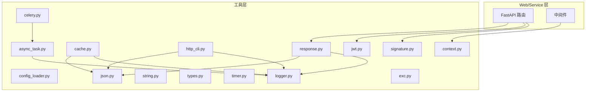

**图表来源**
- [pkg/toolkit/async_task.py](file://pkg/toolkit/async_task.py#L42-L375)
- [pkg/toolkit/cache.py](file://pkg/toolkit/cache.py#L41-L249)
- [pkg/toolkit/http_cli.py](file://pkg/toolkit/http_cli.py#L38-L232)
- [pkg/toolkit/jwt.py](file://pkg/toolkit/jwt.py#L7-L58)
- [pkg/toolkit/signature.py](file://pkg/toolkit/signature.py#L9-L95)
- [pkg/toolkit/response.py](file://pkg/toolkit/response.py#L47-L233)
- [pkg/toolkit/config_loader.py](file://pkg/toolkit/config_loader.py#L24-L215)
- [pkg/toolkit/context.py](file://pkg/toolkit/context.py#L7-L107)
- [pkg/toolkit/json.py](file://pkg/toolkit/json.py#L29-L108)
- [pkg/toolkit/string.py](file://pkg/toolkit/string.py#L13-L111)
- [pkg/toolkit/types.py](file://pkg/toolkit/types.py#L19-L245)
- [pkg/toolkit/timer.py](file://pkg/toolkit/timer.py#L4-L80)
- [pkg/toolkit/celery.py](file://pkg/toolkit/celery.py#L15-L198)
- [pkg/toolkit/logger.py](file://pkg/toolkit/logger.py#L1-L32)
- [pkg/toolkit/exc.py](file://pkg/toolkit/exc.py#L4-L16)

## 详细组件分析

### 异步任务处理（AnyIO Task Manager）
- 设计目的：提供统一的任务生命周期管理、并发限制、超时与取消控制，支持协程、线程与进程三种执行后端。
- 关键能力：
  - 启停管理：start/shutdown 生命周期，优雅关闭。
  - 任务提交：add_task、run_gather_with_concurrency、run_in_threads/processes。
  - 取消与状态：cancel_task、get_task_status。
  - 超时与抖动：fail_after/move_on_after 控制单任务与全局超时，随机抖动降低风暴效应。
  - 并发限制：全局、线程、进程容量限制器，避免资源耗尽。
- 适用场景：高并发请求聚合、CPU 密集型任务隔离、I/O 密集型批处理。
- 最佳实践：
  - 明确超时阈值，避免任务悬挂。
  - 使用队列上限与抖动参数，平滑突发流量。
  - 线程与进程混合使用，CPU 密集用进程，IO 密集用线程。
- 典型流程（批量任务）：

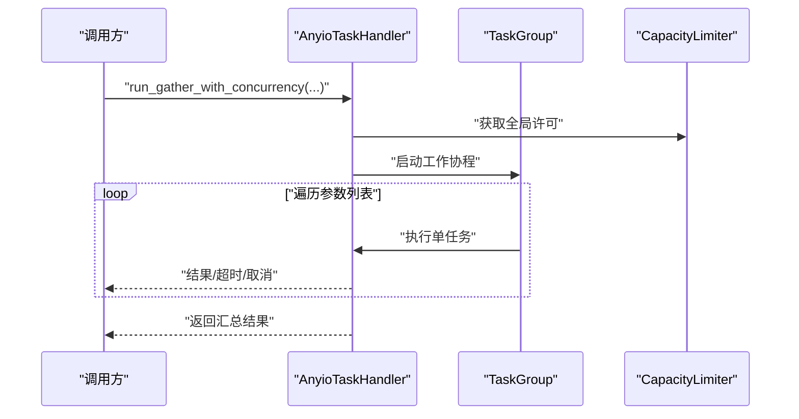

**图表来源**
- [pkg/toolkit/async_task.py](file://pkg/toolkit/async_task.py#L232-L277)

**章节来源**
- [pkg/toolkit/async_task.py](file://pkg/toolkit/async_task.py#L42-L375)

### 缓存管理（Redis 客户端）
- 设计目的：提供 Redis 常用操作的统一封装与异常处理，确保序列化一致性与分布式锁安全。
- 关键能力：
  - 基础操作：set/get、过期、存在性、TTL。
  - 结构化操作：字典/列表 JSON 序列化、列表 push/pop/range。
  - 哈希操作：hset/hget。
  - 分布式锁：acquire_lock/release_lock，带超时与重试。
  - 批量删除：batch_delete_keys。
  - 异常装饰器：handle_redis_exception 统一包装底层异常。
- 适用场景：会话缓存、配置缓存、限流令牌、分布式锁。
- 最佳实践：
  - 使用 JSON 序列化结构化数据，避免手动编码。
  - 锁的标识符与过期时间合理设置，防止死锁。
  - TTL 与过期策略结合业务设定。
- 流程（获取分布式锁）：

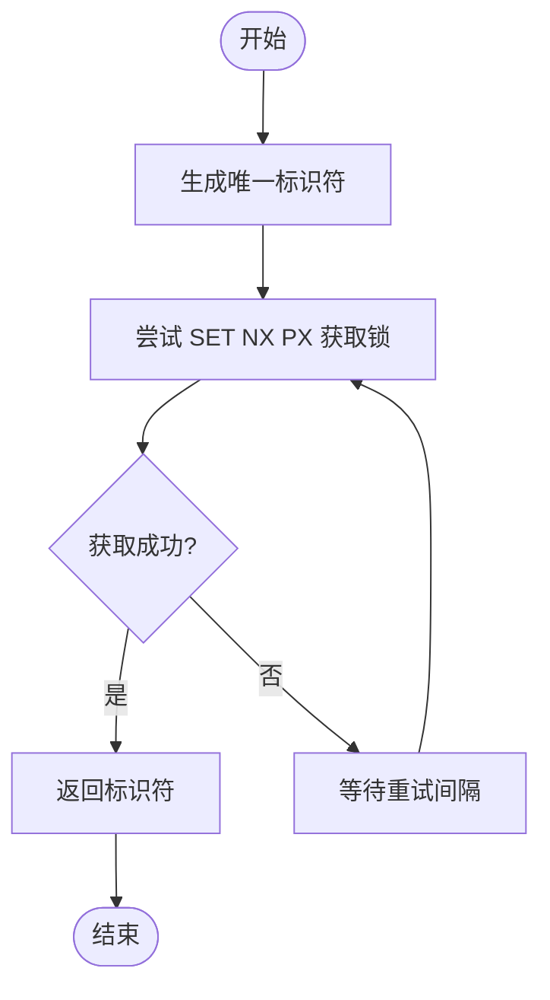

**图表来源**
- [pkg/toolkit/cache.py](file://pkg/toolkit/cache.py#L199-L240)

**章节来源**
- [pkg/toolkit/cache.py](file://pkg/toolkit/cache.py#L41-L249)

### HTTP 客户端（AsyncHttpClient）
- 设计目的：提供统一的异步 HTTP 客户端，支持长连接、流式下载、进度回调与错误标准化。
- 关键能力：
  - 请求封装：_request 统一处理状态码与异常，返回 RequestResult。
  - 流式下载：download_file 支持断点续传友好的进度回调。
  - 流式请求：stream_request 逐块读取响应。
  - 统一错误：HTTPStatusError、RequestError、Unexpected Error 统一映射。
- 适用场景：第三方服务调用、文件下载、事件流接入。
- 最佳实践：
  - 为长连接设置合理超时与重试策略。
  - 流式下载时注意磁盘空间与权限。
- 序列图（流式下载）：

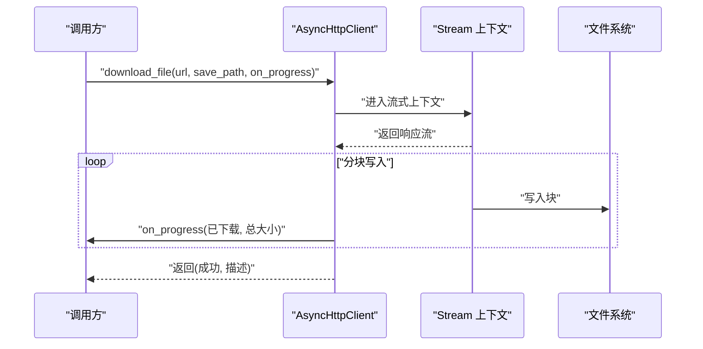

**图表来源**
- [pkg/toolkit/http_cli.py](file://pkg/toolkit/http_cli.py#L169-L214)

**章节来源**
- [pkg/toolkit/http_cli.py](file://pkg/toolkit/http_cli.py#L38-L232)

### JWT 认证
- 设计目的：提供令牌创建与验证的简单接口，支持过期时间与负载字段约定。
- 关键能力：
  - create_token：生成带过期时间的 JWT。
  - verify_token：校验 Bearer Token，返回 user_id 与有效性。
- 适用场景：API 认证、会话令牌发放与校验。
- 最佳实践：
  - Secret 管理与轮换。
  - 严格控制过期时间与刷新策略。
- 流程（令牌验证）：

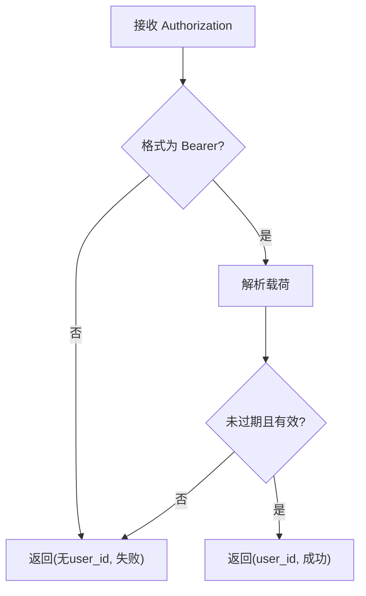

**图表来源**
- [pkg/toolkit/jwt.py](file://pkg/toolkit/jwt.py#L13-L40)

**章节来源**
- [pkg/toolkit/jwt.py](file://pkg/toolkit/jwt.py#L7-L58)

### 签名验证（SignatureAuthHandler）
- 设计目的：提供 HMAC 签名与时间戳校验，抵御重放攻击。
- 关键能力：
  - generate_signature：按键排序拼接并生成签名。
  - verify_signature：使用恒等时间比较。
  - verify_timestamp：校验时间戳容忍窗口。
  - verify：统一验签入口。
- 适用场景：第三方回调、支付通知、Webhook 校验。
- 最佳实践：
  - 密钥安全存储与轮换。
  - 合理设置时间戳容忍窗口。
- 流程（统一验签）：

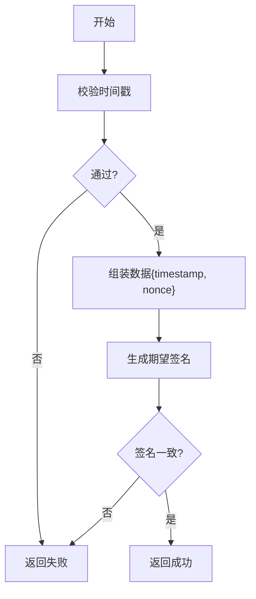

**图表来源**
- [pkg/toolkit/signature.py](file://pkg/toolkit/signature.py#L77-L95)

**章节来源**
- [pkg/toolkit/signature.py](file://pkg/toolkit/signature.py#L9-L95)

### 响应格式化（统一响应体与高性能序列化）
- 设计目的：统一 API 响应结构，提供高性能 JSON 序列化与分页、SSE 包装。
- 关键能力：
  - AppStatus/AppError：状态码与多语言文案。
  - _ResponseBody：统一 code/message/data 结构。
  - CustomORJSONResponse：基于 orjson 的高性能渲染。
  - _ResponseFactory：success/list/error 工厂方法。
  - wrap_sse_data：SSE 数据包装。
- 适用场景：REST API 响应标准化、微服务间通信。
- 最佳实践：
  - 成功响应仅允许 dict/list/Pydantic 模型或 None。
  - 错误响应统一使用 AppError。
- 类图（响应体系）：

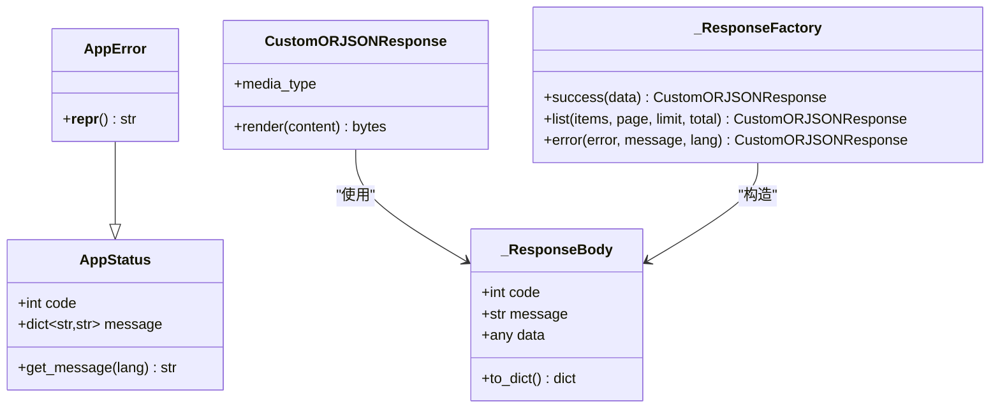

**图表来源**
- [pkg/toolkit/response.py](file://pkg/toolkit/response.py#L14-L233)

**章节来源**
- [pkg/toolkit/response.py](file://pkg/toolkit/response.py#L14-L233)

### 配置加载（ConfigLoader/ConfigMerger）
- 设计目的：支持多格式配置文件加载与合并，简化环境差异化配置。
- 关键能力：
  - ConfigLoader：JSON/YAML/TOML/INI/ENV 自动识别与解析。
  - ConfigMerger：深度/浅合并多个配置字典。
  - 便捷函数：load_config/merge_configs。
- 适用场景：开发/测试/生产环境配置分离与合并。
- 最佳实践：
  - 将敏感配置放入 .env 并通过环境注入。
  - 使用深合并保留嵌套结构。
- 流程（加载与合并）：

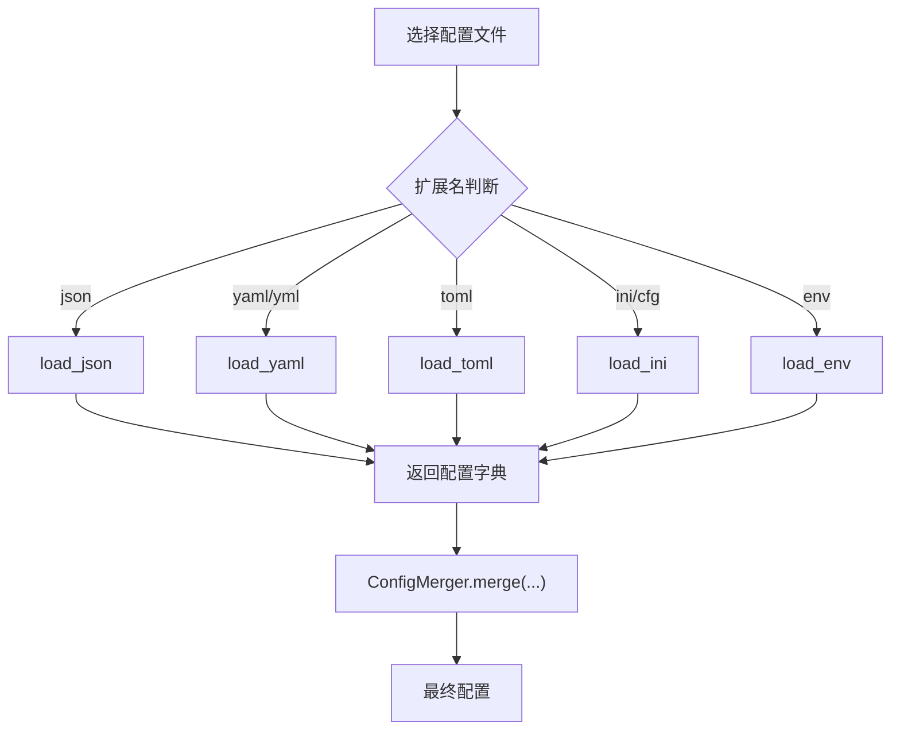

**图表来源**
- [pkg/toolkit/config_loader.py](file://pkg/toolkit/config_loader.py#L27-L215)

**章节来源**
- [pkg/toolkit/config_loader.py](file://pkg/toolkit/config_loader.py#L24-L215)

### 上下文管理（请求上下文）
- 设计目的：在请求生命周期内传递上下文信息（如 user_id、trace_id）。
- 关键能力：
  - init/get/set/all/clear：上下文初始化与读写。
  - set_user_id/get_user_id：用户ID便捷方法。
  - set_trace_id/get_trace_id：TraceID 校验与获取。
- 适用场景：日志追踪、审计、权限传递。
- 最佳实践：
  - 中间件中先 init，再在业务中 get/set。
  - TraceID 必填且非空。
- 流程（TraceID 获取）：

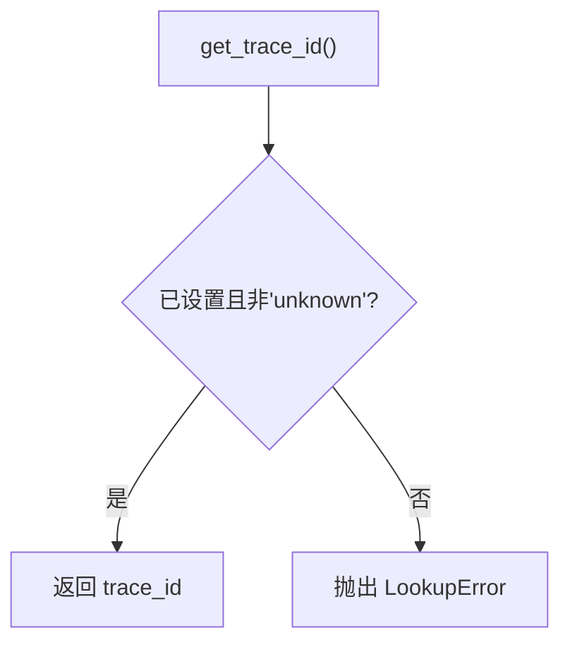

**图表来源**
- [pkg/toolkit/context.py](file://pkg/toolkit/context.py#L99-L107)

**章节来源**
- [pkg/toolkit/context.py](file://pkg/toolkit/context.py#L7-L107)

### 类型转换（SmartInt/SmartDecimal/SmartDatetime/IntStr/LazyProxy）
- 设计目的：在输入与输出阶段自动处理类型转换与精度控制，提升前后端兼容性。
- 关键能力：
  - SmartInt：输入统一为 int，输出 JS 安全范围内的数字，否则字符串。
  - SmartDecimal：输入统一为 Decimal，输出安全范围 float，否则字符串。
  - SmartDatetime：输入 ISO 字符串或 datetime，统一为 UTC naive datetime 输出 ISO 字符串。
  - IntStr：强制字符串序列化。
  - LazyProxy：延迟初始化代理，提供完整类型提示。
- 适用场景：API Schema 定义、序列化一致性、懒加载单例。
- 最佳实践：
  - 前端大整数与高精度数值使用字符串传输。
  - 时间统一使用 UTC 与 ISO 格式。
- 类图（类型体系）：

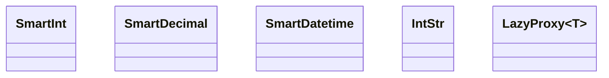

**图表来源**
- [pkg/toolkit/types.py](file://pkg/toolkit/types.py#L19-L245)

**章节来源**
- [pkg/toolkit/types.py](file://pkg/toolkit/types.py#L19-L245)

### 计时与时间（timer）
- 设计目的：提供 ISO 时间格式化、解析、UTC 转换与时间戳工具。
- 关键能力：
  - format_iso_datetime：格式化为 ISO 字符串，UTC 时区可用 Z。
  - parse_iso_string：解析 ISO 字符串为 datetime。
  - convert_to_utc：转换为 UTC 带时区 datetime。
  - get_utc_timestamp/utc_now_naive：获取当前时间戳与纳秒时间。
- 适用场景：日志时间、事件时间戳、跨时区时间处理。
- 最佳实践：
  - 统一使用 UTC，避免夏令时与本地时区差异。
- 流程（ISO 解析）：

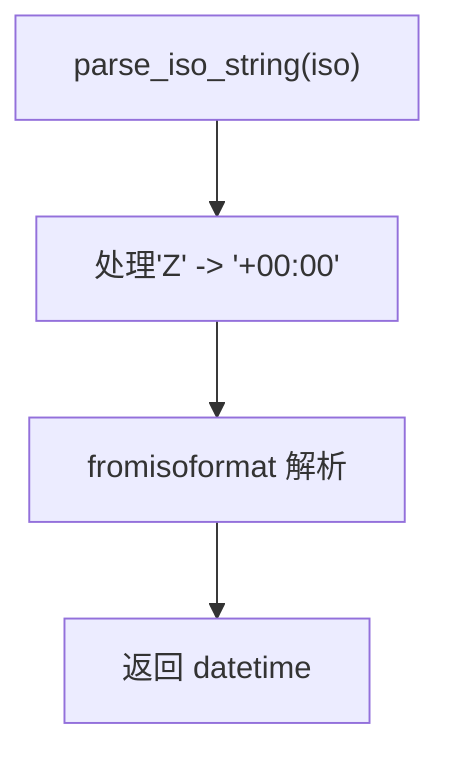

**图表来源**
- [pkg/toolkit/timer.py](file://pkg/toolkit/timer.py#L30-L51)

**章节来源**
- [pkg/toolkit/timer.py](file://pkg/toolkit/timer.py#L4-L80)

### Celery 任务编排
- 设计目的：封装 Celery 任务提交、编排与生命周期钩子，简化后台任务管理。
- 关键能力：
  - CeleryClient：初始化、任务提交、编排（chain/group/chord）、状态查询、撤销。
  - 生命周期钩子：注册 worker 启动/关闭钩子，支持同步与异步。
- 适用场景：异步任务、定时任务、复杂任务编排。
- 最佳实践：
  - 任务序列化使用 JSON，避免 pickle 风险。
  - 合理设置队列与优先级。
- 流程（链式任务）：

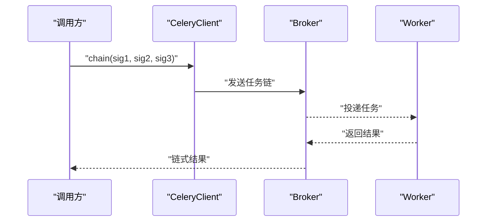

**图表来源**
- [pkg/toolkit/celery.py](file://pkg/toolkit/celery.py#L112-L137)

**章节来源**
- [pkg/toolkit/celery.py](file://pkg/toolkit/celery.py#L15-L198)

### JSON 序列化与反序列化（json）
- 设计目的：提供高性能、一致性的 JSON 处理，统一复杂类型序列化策略。
- 关键能力：
  - orjson_dumps_bytes/orjson_dumps/orjson_loads：高性能序列化/反序列化。
  - _enhanced_default_handler：统一处理 Decimal/float/bytes/timedelta/set 等类型。
  - DEFAULT_ORJSON_OPTIONS：启用 Numpy/UUID/UTC/省微秒/非字符串键等选项。
- 适用场景：API 响应、缓存存储、消息队列。
- 最佳实践：
  - 保持序列化选项一致，避免前后端差异。
  - 对异常进行包装，便于定位问题。
- 流程（序列化）：

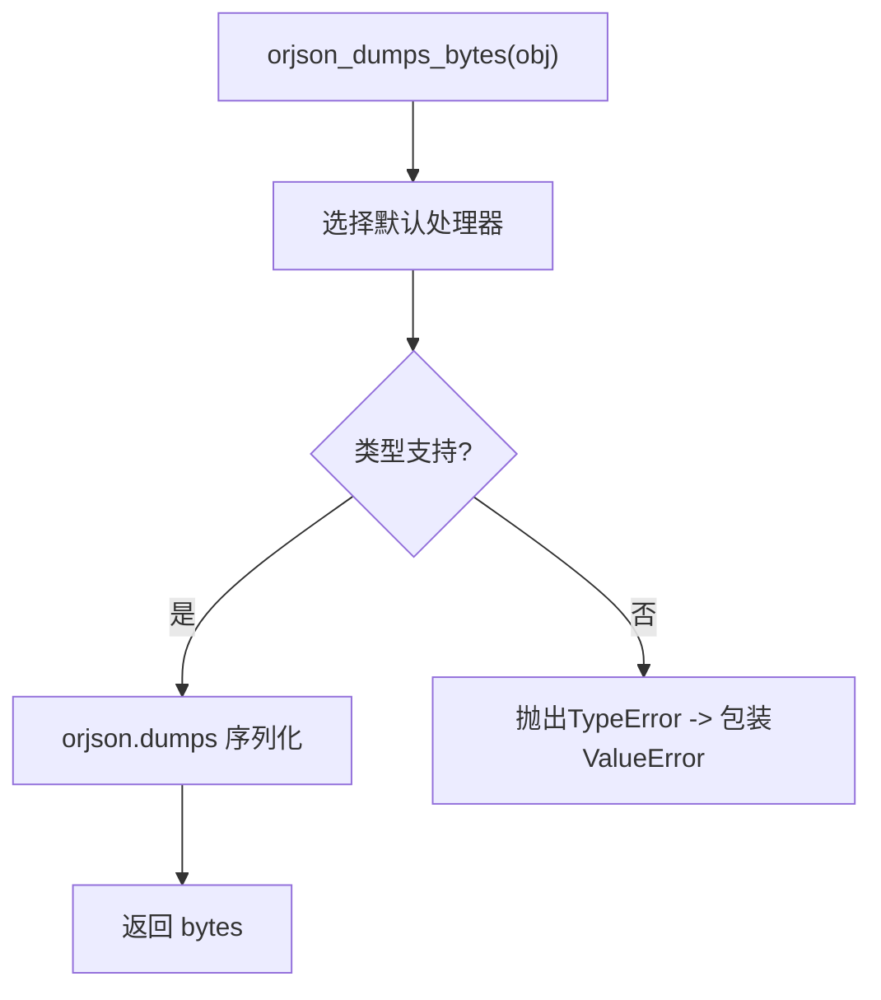

**图表来源**
- [pkg/toolkit/json.py](file://pkg/toolkit/json.py#L69-L86)

**章节来源**
- [pkg/toolkit/json.py](file://pkg/toolkit/json.py#L29-L108)

### 字符串与 URL 工具（string）
- 设计目的：提供唯一ID、哈希、URL 构造、手机号校验、模板替换等实用工具。
- 关键能力：
  - uuid6_unique_str_id：基于 UUID7 的唯一ID。
  - hash_to_int：xxHash 64 位整数哈希。
  - build_url：构造 URL，支持 scheme/netloc/path/query/fragment。
  - validate_phone_number：中国大陆手机号格式校验。
  - template_substitute：字符串模板替换（安全/普通模式）。
- 适用场景：ID 生成、路由构建、数据校验、模板渲染。
- 最佳实践：
  - URL 构造时确保 path 以斜杠开头。
  - 模板替换使用 safe 模式避免 KeyError。
- 流程（URL 构造）：

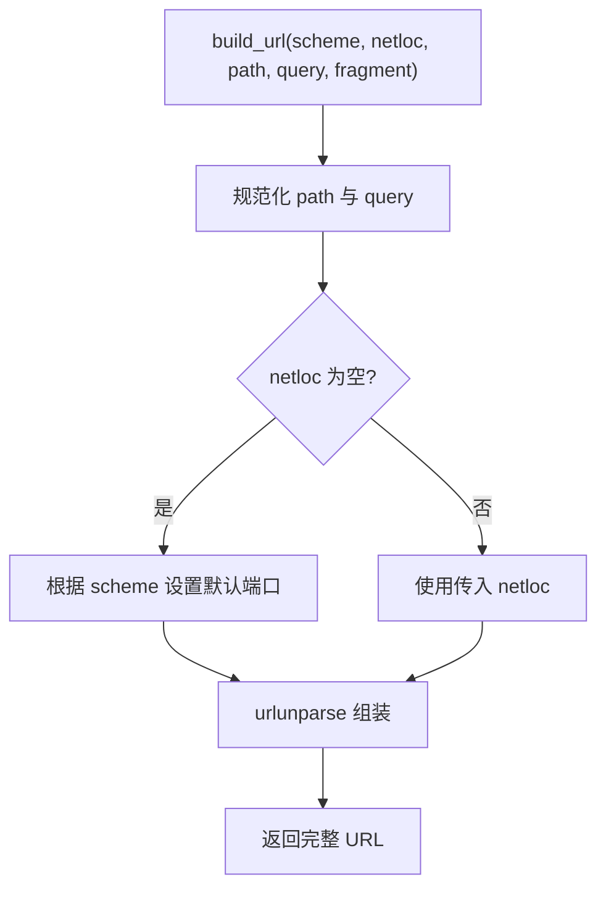

**图表来源**
- [pkg/toolkit/string.py](file://pkg/toolkit/string.py#L67-L111)

**章节来源**
- [pkg/toolkit/string.py](file://pkg/toolkit/string.py#L13-L111)

### 异常追踪（exc）
- 设计目的：提取业务异常与非预期异常的栈信息，便于日志与诊断。
- 关键能力：
  - get_business_exec_tb：提取最近 3 行业务栈。
  - get_unexpected_exec_tb：提取最近 10 行非预期栈。
- 适用场景：错误日志、监控告警、问题定位。
- 最佳实践：
  - 区分业务异常与系统异常，分别记录。
- 流程（栈追踪）：

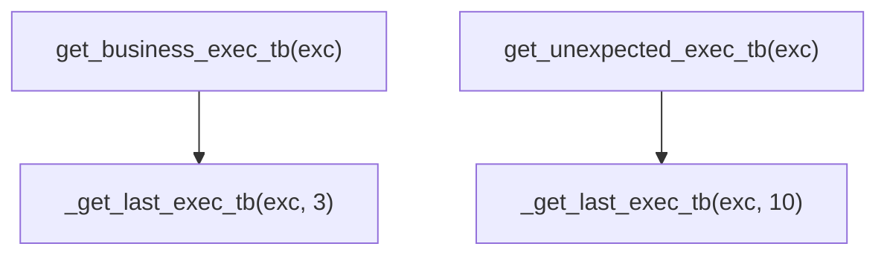

**图表来源**
- [pkg/toolkit/exc.py](file://pkg/toolkit/exc.py#L10-L16)

**章节来源**
- [pkg/toolkit/exc.py](file://pkg/toolkit/exc.py#L4-L16)

### 日志兼容导出（logger）
- 设计目的：向后兼容旧导入路径，提示迁移到 pkg.logger。
- 适用场景：逐步替换导入语句。
- 最佳实践：
  - 更新导入为 from pkg.logger import LoggerManager, logger, ...

**章节来源**
- [pkg/toolkit/logger.py](file://pkg/toolkit/logger.py#L1-L32)

## 依赖关系分析
- 模块内聚与耦合：
  - async_task 与 json：任务结果与序列化一致。
  - cache 与 json：统一 JSON 序列化策略。
  - http_cli 与 json：响应体序列化一致。
  - response 与 json：统一序列化与渲染。
  - types 与 json：类型转换与序列化策略一致。
  - celery 与 async_task：后台任务与并发控制互补。
- 外部依赖：
  - httpx、anyio、redis、jwt、orjson、celery、kombu、loguru 等。
- 循环依赖：
  - 未发现循环依赖迹象，模块边界清晰。

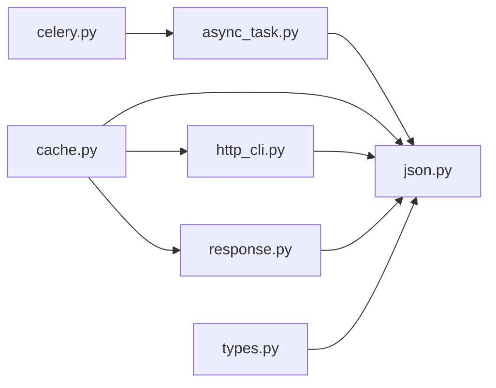

**图表来源**
- [pkg/toolkit/async_task.py](file://pkg/toolkit/async_task.py#L1-L375)
- [pkg/toolkit/cache.py](file://pkg/toolkit/cache.py#L1-L249)
- [pkg/toolkit/http_cli.py](file://pkg/toolkit/http_cli.py#L1-L232)
- [pkg/toolkit/response.py](file://pkg/toolkit/response.py#L1-L233)
- [pkg/toolkit/json.py](file://pkg/toolkit/json.py#L1-L108)
- [pkg/toolkit/types.py](file://pkg/toolkit/types.py#L1-L245)
- [pkg/toolkit/celery.py](file://pkg/toolkit/celery.py#L1-L198)

**章节来源**
- [pkg/toolkit/async_task.py](file://pkg/toolkit/async_task.py#L1-L375)
- [pkg/toolkit/cache.py](file://pkg/toolkit/cache.py#L1-L249)
- [pkg/toolkit/http_cli.py](file://pkg/toolkit/http_cli.py#L1-L232)
- [pkg/toolkit/response.py](file://pkg/toolkit/response.py#L1-L233)
- [pkg/toolkit/json.py](file://pkg/toolkit/json.py#L1-L108)
- [pkg/toolkit/types.py](file://pkg/toolkit/types.py#L1-L245)
- [pkg/toolkit/celery.py](file://pkg/toolkit/celery.py#L1-L198)

## 性能考量
- 序列化性能：统一使用 orjson，启用多项优化选项，减少内存与 CPU 开销。
- 并发控制：AnyIO 任务组与容量限制器，避免资源争用与雪崩。
- I/O 优化：HTTP 客户端长连接与流式下载，降低握手开销与内存峰值。
- 缓存命中：Redis 操作封装与 TTL 策略，结合批量删除与哈希结构提升效率。
- 类型转换：Smart* 类型在输入输出两端做最小必要转换，减少序列化成本。
- 时间处理：统一 UTC 与时区处理，避免重复转换与格式不一致带来的额外开销。

## 故障排查指南
- 异步任务：
  - 任务未执行：检查是否已 start、是否达到队列上限、是否被取消。
  - 超时频繁：调整 timeout、增加抖动、拆分任务。
  - 取消无效：确认 CancelScope 作用域与异常捕获。
- 缓存：
  - Redis 操作异常：查看 RedisOperationError 包装的原始异常与参数。
  - 锁无法释放：确认标识符匹配与脚本执行结果。
- HTTP 客户端：
  - 超时/连接失败：检查网络、超时设置与重试策略。
  - 流式下载失败：确认磁盘权限与父目录创建。
- JWT：
  - 验证失败：检查 Bearer 格式、密钥、过期时间。
- 签名：
  - 重放防护：检查时间戳容忍与签名生成规则。
- 响应：
  - 序列化失败：检查数据类型与 Smart* 类型约束。
- 配置：
  - 格式错误：确认文件格式与编码，YAML 需安装依赖。
- 上下文：
  - 未初始化：确保中间件先于业务调用 init。
- 类型：
  - 转换异常：检查输入类型与范围约束。
- 时间：
  - 时区混乱：统一使用 UTC 与 ISO 格式。
- Celery：
  - 任务未执行：检查 broker/backend 配置与队列路由。
- JSON：
  - 序列化异常：查看包装后的 ValueError 与类型信息。
- 异常追踪：
  - 栈信息不完整：区分业务与非预期异常，按需提取。

**章节来源**
- [pkg/toolkit/async_task.py](file://pkg/toolkit/async_task.py#L109-L154)
- [pkg/toolkit/cache.py](file://pkg/toolkit/cache.py#L171-L240)
- [pkg/toolkit/http_cli.py](file://pkg/toolkit/http_cli.py#L114-L156)
- [pkg/toolkit/jwt.py](file://pkg/toolkit/jwt.py#L13-L40)
- [pkg/toolkit/signature.py](file://pkg/toolkit/signature.py#L57-L95)
- [pkg/toolkit/response.py](file://pkg/toolkit/response.py#L101-L133)
- [pkg/toolkit/config_loader.py](file://pkg/toolkit/config_loader.py#L28-L62)
- [pkg/toolkit/context.py](file://pkg/toolkit/context.py#L33-L41)
- [pkg/toolkit/types.py](file://pkg/toolkit/types.py#L19-L84)
- [pkg/toolkit/timer.py](file://pkg/toolkit/timer.py#L30-L51)
- [pkg/toolkit/celery.py](file://pkg/toolkit/celery.py#L159-L198)
- [pkg/toolkit/json.py](file://pkg/toolkit/json.py#L81-L86)
- [pkg/toolkit/exc.py](file://pkg/toolkit/exc.py#L10-L16)

## 结论
通用工具包通过模块化设计与统一的序列化、时间与上下文策略，实现了跨领域的可复用能力。建议在项目中遵循统一的配置加载、响应格式、类型转换与异常追踪规范，结合异步任务与 Celery 的分工，构建高性能、可观测、易维护的服务层。

## 附录
- 使用示例与最佳实践要点：
  - 异步任务：合理设置超时与并发上限，使用抖动与队列上限应对突发。
  - 缓存：结构化数据统一 JSON 序列化，分布式锁设置合理过期与重试。
  - HTTP 客户端：长连接与流式下载结合，统一错误处理。
  - JWT：密钥轮换与过期策略，避免长时间有效令牌。
  - 签名：时间戳容忍与签名生成规则一致，防止重放。
  - 响应：统一 AppStatus/AppError，成功响应类型受控。
  - 配置：多环境配置合并，敏感信息走 .env。
  - 上下文：中间件初始化，TraceID 必填。
  - 类型：Smart* 类型贯穿输入输出，前后端兼容。
  - 时间：UTC 与时区处理一致。
  - Celery：JSON 序列化，合理队列与优先级。
  - JSON：orjson 选项统一，异常包装清晰。
  - 异常追踪：业务与非预期异常区分记录。