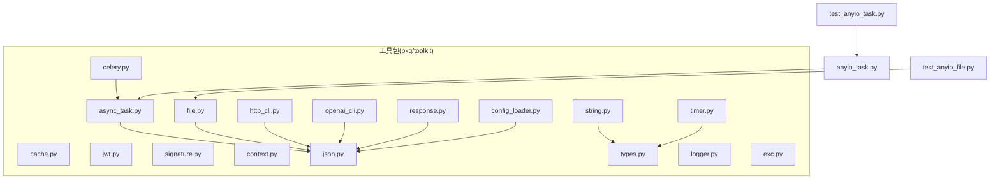
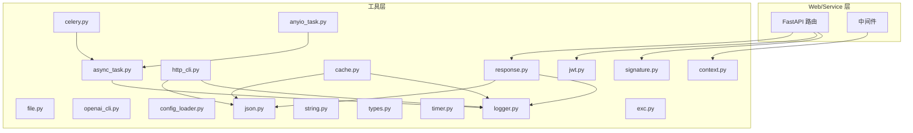
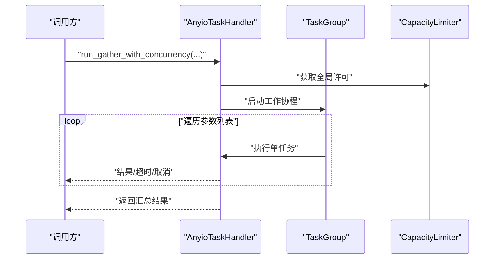
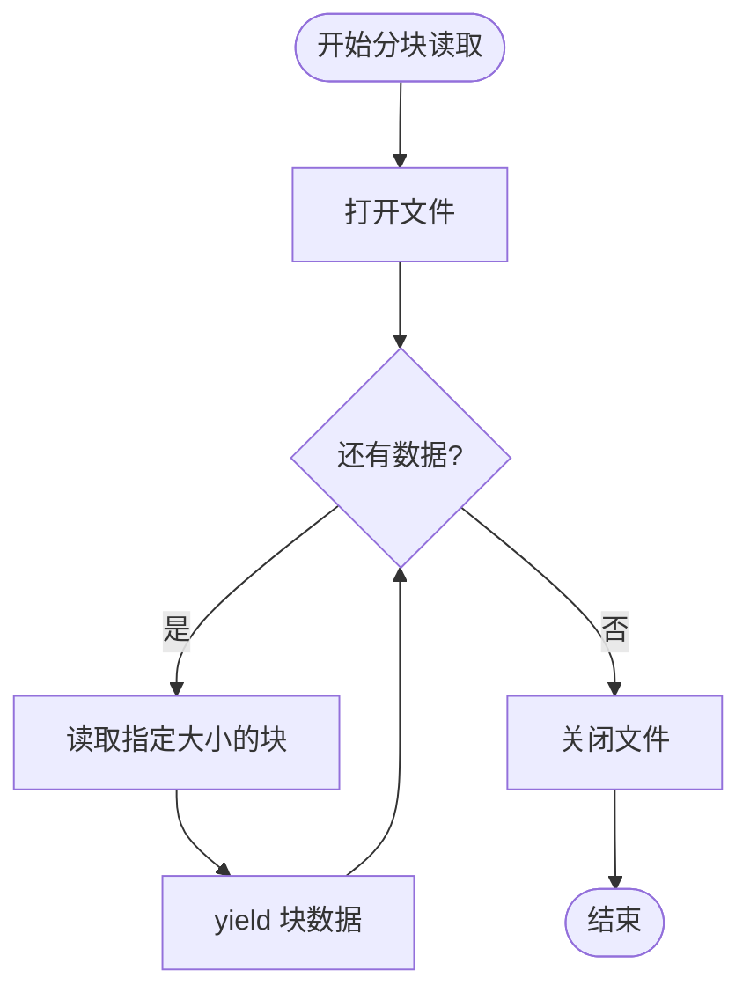
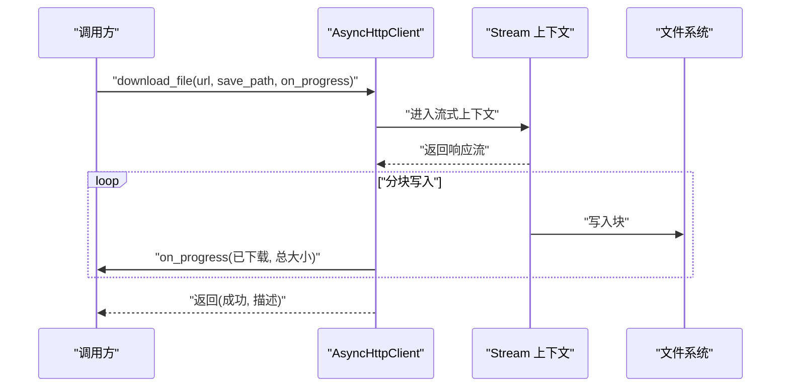
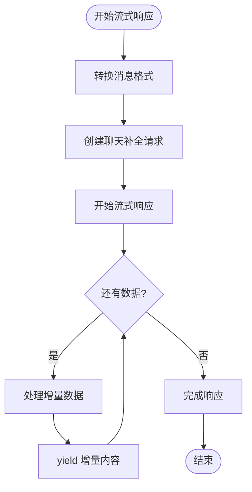
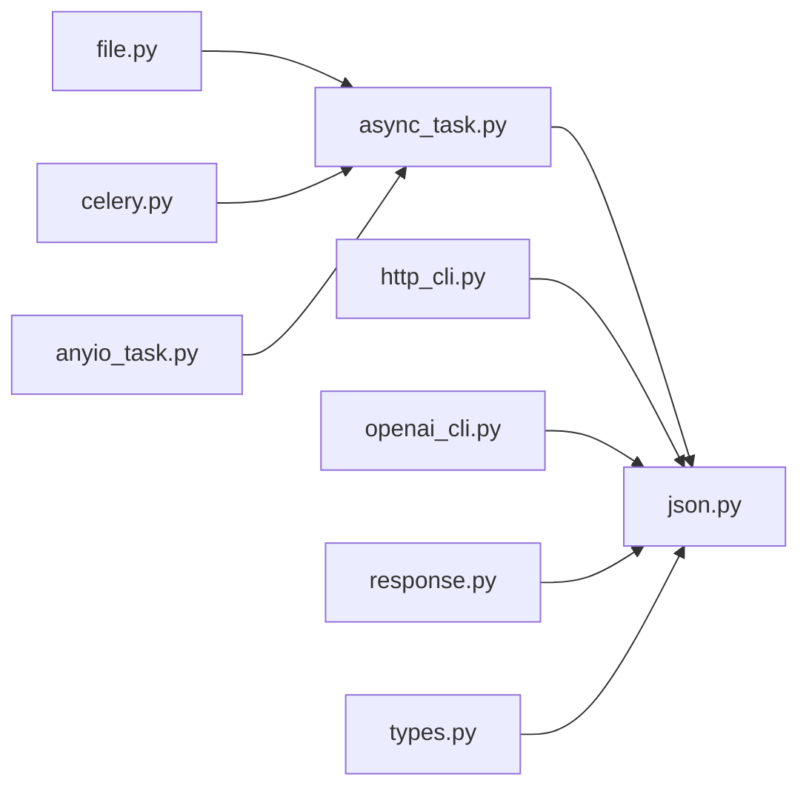

# 通用工具包

<cite>
**本文引用的文件**
- [pkg/toolkit/async_task.py](file://pkg/toolkit/async_task.py)
- [pkg/toolkit/file.py](file://pkg/toolkit/file.py)
- [pkg/toolkit/http_cli.py](file://pkg/toolkit/http_cli.py)
- [pkg/toolkit/openai_cli.py](file://pkg/toolkit/openai_cli.py)
- [internal/utils/anyio_task.py](file://internal/utils/anyio_task.py)
- [tests/test_anyio_task.py](file://tests/test_anyio_task.py)
- [tests/test_anyio_file.py](file://tests/test_anyio_file.py)
- [pkg/toolkit/cache.py](file://pkg/toolkit/cache.py)
- [pkg/toolkit/jwt.py](file://pkg/toolkit/jwt.py)
- [pkg/toolkit/signature.py](file://pkg/toolkit/signature.py)
- [pkg/toolkit/response.py](file://pkg/toolkit/response.py)
- [pkg/toolkit/config_loader.py](file://pkg/toolkit/config_loader.py)
- [pkg/toolkit/context.py](file://pkg/toolkit/context.py)
- [pkg/toolkit/json.py](file://pkg/toolkit/json.py)
- [pkg/toolkit/string.py](file://pkg/toolkit/string.py)
- [pkg/toolkit/types.py](file://pkg/toolkit/types.py)
- [pkg/toolkit/timer.py](file://pkg/toolkit/timer.py)
- [pkg/toolkit/celery.py](file://pkg/toolkit/celery.py)
- [pkg/toolkit/logger.py](file://pkg/toolkit/logger.py)
- [pkg/toolkit/exc.py](file://pkg/toolkit/exc.py)
</cite>

## 更新摘要
**所做更改**
- 新增 AnyIO 封装函数增强章节，详细介绍 anyio_run_in_thread 和 anyio_run_in_process 的改进
- 新增 AnyIO 文件处理工具章节，介绍 AnyioFile 类的分块读取和逐行读取功能
- 更新 HTTP 客户端章节，强调类型安全和错误处理改进
- 更新 OpenAI 客户端章节，突出类型安全和异常处理增强
- 新增内部工具模块章节，介绍 anyio_task.py 中的任务管理器封装

## 目录
1. [简介](#简介)
2. [项目结构](#项目结构)
3. [核心组件](#核心组件)
4. [架构总览](#架构总览)
5. [详细组件分析](#详细组件分析)
6. [依赖关系分析](#依赖关系分析)
7. [性能考量](#性能考量)
8. [故障排查指南](#故障排查指南)
9. [结论](#结论)
10. [附录](#附录)

## 简介
本文件为通用工具包的综合文档，覆盖异步任务处理、缓存管理、HTTP 客户端、日志记录、JWT 认证、签名验证、响应格式化、配置加载、上下文管理、类型转换、计时与时间处理、Celery 任务编排、JSON 序列化与反序列化、字符串与 URL 工具、异常追踪等能力。文档旨在帮助开发者快速理解各工具的设计目的、适用场景、使用方式与最佳实践，并解释工具间的协作关系与依赖配置。

**更新** 本次更新重点反映了 AnyIO 封装函数的增强、文件处理工具的改进，以及 HTTP 客户端和 OpenAI 客户端的类型安全和错误处理优化。

## 项目结构
通用工具包位于 pkg/toolkit 下，按功能域划分模块，每个模块聚焦单一职责，便于独立使用与组合集成。核心模块包括：
- 异步任务：async_task.py
- 文件处理：file.py
- HTTP 客户端：http_cli.py
- OpenAI 客户端：openai_cli.py
- 缓存：cache.py
- JWT：jwt.py
- 签名验证：signature.py
- 响应格式化：response.py
- 配置加载：config_loader.py
- 上下文：context.py
- JSON：json.py
- 字符串与URL：string.py
- 类型转换：types.py
- 计时与时间：timer.py
- Celery：celery.py
- 日志兼容导出：logger.py
- 异常追踪：exc.py

```mermaid
graph TB
subgraph "工具包(pkg/toolkit)"
A["async_task.py"]
B["file.py"]
C["http_cli.py"]
D["openai_cli.py"]
E["cache.py"]
F["jwt.py"]
G["signature.py"]
H["response.py"]
I["config_loader.py"]
J["context.py"]
K["json.py"]
L["string.py"]
M["types.py"]
N["timer.py"]
O["celery.py"]
P["logger.py"]
Q["exc.py"]
end
A --> K
B --> K
C --> K
D --> K
H --> K
I --> K
L --> M
N --> M
O --> A
R["anyio_task.py"] --> A
S["test_anyio_task.py"] --> R
T["test_anyio_file.py"] --> B
```

**图表来源**
- [pkg/toolkit/async_task.py:1-432](file://pkg/toolkit/async_task.py#L1-L432)
- [pkg/toolkit/file.py:1-155](file://pkg/toolkit/file.py#L1-L155)
- [pkg/toolkit/http_cli.py:1-246](file://pkg/toolkit/http_cli.py#L1-L246)
- [pkg/toolkit/openai_cli.py:1-235](file://pkg/toolkit/openai_cli.py#L1-L235)
- [internal/utils/anyio_task.py:1-38](file://internal/utils/anyio_task.py#L1-L38)
- [tests/test_anyio_task.py:1-235](file://tests/test_anyio_task.py#L1-L235)
- [tests/test_anyio_file.py:1-161](file://tests/test_anyio_file.py#L1-L161)

**章节来源**
- [pkg/toolkit/async_task.py:1-432](file://pkg/toolkit/async_task.py#L1-L432)
- [pkg/toolkit/file.py:1-155](file://pkg/toolkit/file.py#L1-L155)
- [pkg/toolkit/http_cli.py:1-246](file://pkg/toolkit/http_cli.py#L1-L246)
- [pkg/toolkit/openai_cli.py:1-235](file://pkg/toolkit/openai_cli.py#L1-L235)
- [internal/utils/anyio_task.py:1-38](file://internal/utils/anyio_task.py#L1-L38)

## 核心组件
- 异步任务处理：基于 AnyIO 的任务管理器，支持并发限制、超时、取消、线程/进程执行、批量任务与抖动控制，新增类型安全的封装函数。
- 文件处理：AnyioFile 类提供异步文件操作，支持分块读取、逐行读取、类型安全的读写操作。
- HTTP 客户端：基于 httpx 的长连接客户端，支持流式下载、进度回调、统一错误处理与响应封装，增强类型安全。
- OpenAI 客户端：封装 OpenAI SDK，提供类型安全的消息格式转换和流式响应处理。
- 缓存管理：Redis 客户端封装，提供键值、字典、列表、哈希、分布式锁等常用操作，并统一异常处理。
- JWT 认证：令牌创建与验证，支持过期时间与负载字段约定。
- 签名验证：HMAC 签名与时间戳校验，支持多种哈希算法与容忍窗口。
- 响应格式化：统一响应体结构、分页响应、SSE 包装、高性能 ORJSON 响应。
- 配置加载：多格式配置文件加载与合并，支持 JSON/YAML/TOML/INI/ENV。
- 上下文管理：请求级上下文变量，支持用户ID、TraceID等关键信息传递。
- 类型转换：SmartInt/SmartDecimal/SmartDatetime/IntStr/懒加载代理等，兼顾前端兼容与精度。
- 计时与时间：ISO 时间格式化、解析、UTC 转换、时间戳与纳秒时间。
- Celery：任务提交、链式/并行/回调编排、状态查询、生命周期钩子。
- JSON：高性能序列化/反序列化，统一 Decimal/Float/Numpy/UUID/时间等类型处理。
- 字符串与URL：UUID7、哈希、URL 构造、手机号校验、模板替换。
- 异常追踪：业务异常与非预期异常的栈追踪提取。

**章节来源**
- [pkg/toolkit/async_task.py:24-71](file://pkg/toolkit/async_task.py#L24-L71)
- [pkg/toolkit/file.py:9-155](file://pkg/toolkit/file.py#L9-L155)
- [pkg/toolkit/http_cli.py:13-246](file://pkg/toolkit/http_cli.py#L13-L246)
- [pkg/toolkit/openai_cli.py:24-235](file://pkg/toolkit/openai_cli.py#L24-L235)

## 架构总览
通用工具包采用"模块化 + 职责单一"的设计，通过共享的 JSON 序列化策略与日志系统实现跨模块一致性。异步任务与 Celery 互补：前者适合轻量并发与快速取消，后者适合后台作业与复杂编排。缓存模块与 HTTP 客户端在响应与数据持久化之间形成闭环。JWT 与签名验证为接口安全提供双保险。

```mermaid
graph TB
subgraph "Web/Service 层"
W1["FastAPI 路由"]
W2["中间件"]
end
subgraph "工具层"
T1["async_task.py"]
T2["file.py"]
T3["http_cli.py"]
T4["openai_cli.py"]
T5["cache.py"]
T6["jwt.py"]
T7["signature.py"]
T8["response.py"]
T9["config_loader.py"]
T10["context.py"]
T11["json.py"]
T12["string.py"]
T13["types.py"]
T14["timer.py"]
T15["celery.py"]
T16["logger.py"]
T17["exc.py"]
T18["anyio_task.py"]
end
W1 --> T8
W1 --> T6
W1 --> T7
W2 --> T10
T8 --> T11
T3 --> T11
T5 --> T11
T15 --> T1
T18 --> T1
T1 --> T16
T5 --> T16
T3 --> T16
T8 --> T16
```

**图表来源**
- [pkg/toolkit/async_task.py:92-432](file://pkg/toolkit/async_task.py#L92-L432)
- [pkg/toolkit/file.py:9-155](file://pkg/toolkit/file.py#L9-L155)
- [pkg/toolkit/http_cli.py:38-246](file://pkg/toolkit/http_cli.py#L38-L246)
- [pkg/toolkit/openai_cli.py:32-235](file://pkg/toolkit/openai_cli.py#L32-L235)
- [internal/utils/anyio_task.py:8-38](file://internal/utils/anyio_task.py#L8-L38)

## 详细组件分析

### 异步任务处理（AnyIO Task Manager）
- 设计目的：提供统一的任务生命周期管理、并发限制、超时与取消控制，支持协程、线程与进程三种执行后端。
- 关键能力：
  - 启停管理：start/shutdown 生命周期，优雅关闭。
  - 任务提交：add_task、run_gather_with_concurrency、run_in_threads/processes。
  - 取消与状态：cancel_task、get_task_status。
  - 超时与抖动：fail_after/move_on_after 控制单任务与全局超时，随机抖动降低风暴效应。
  - 并发限制：全局、线程、进程容量限制器，避免资源耗尽。
  - **新增** 类型安全封装：anyio_run_in_thread 和 anyio_run_in_process 消除类型警告。
- 适用场景：高并发请求聚合、CPU 密集型任务隔离、I/O 密集型批处理。
- 最佳实践：
  - 明确超时阈值，避免任务悬挂。
  - 使用队列上限与抖动参数，平滑突发流量。
  - 线程与进程混合使用，CPU 密集用进程，IO 密集用线程。
- 典型流程（批量任务）：

```mermaid
sequenceDiagram
participant Caller as "调用方"
participant TM as "AnyioTaskHandler"
participant TG as "TaskGroup"
participant Lim as "CapacityLimiter"
Caller->>TM : "run_gather_with_concurrency(...)"
TM->>Lim : "获取全局许可"
TM->>TG : "启动工作协程"
loop "遍历参数列表"
TG->>TM : "执行单任务"
TM-->>Caller : "结果/超时/取消"
end
TM-->>Caller : "返回汇总结果"
```

**图表来源**
- [pkg/toolkit/async_task.py:284-329](file://pkg/toolkit/async_task.py#L284-L329)

**章节来源**
- [pkg/toolkit/async_task.py:24-71](file://pkg/toolkit/async_task.py#L24-L71)
- [pkg/toolkit/async_task.py:92-432](file://pkg/toolkit/async_task.py#L92-L432)

### AnyIO 文件处理工具（AnyioFile）
- 设计目的：提供类型安全的异步文件操作，支持分块读取、逐行读取等高效处理方式。
- 关键能力：
  - 基础操作：exists/stat/mkdir/unlink 等文件系统操作。
  - 文本/二进制读取：read 方法支持字符串和字节数据。
  - **新增** 分块读取：read_chunks 支持大文件的流式处理。
  - **新增** 逐行读取：read_lines 支持大文本文件的逐行处理。
  - 类型安全：使用 overload 提供准确的类型推断。
  - 参数校验：提前验证数据类型，避免运行时错误。
- 适用场景：大文件处理、日志分析、CSV 文件解析、临时文件管理。
- 最佳实践：
  - 大文件使用分块读取避免内存溢出。
  - 文本文件指定正确编码格式。
  - 使用 ensure_parent 自动创建目录结构。
- 流程（分块读取）：

```mermaid
flowchart TD
Start(["开始分块读取"]) --> Open["打开文件"]
Open --> Loop{"还有数据?"}
Loop --> |是| Read["读取指定大小的块"]
Read --> Yield["yield 块数据"]
Yield --> Loop
Loop --> |否| Close["关闭文件"]
Close --> End(["结束"])
```

**图表来源**
- [pkg/toolkit/file.py:61-89](file://pkg/toolkit/file.py#L61-L89)

**章节来源**
- [pkg/toolkit/file.py:9-155](file://pkg/toolkit/file.py#L9-L155)

### HTTP 客户端（AsyncHttpClient）
- 设计目的：提供统一的异步 HTTP 客户端，支持长连接、流式下载、进度回调与错误标准化。
- 关键能力：
  - 请求封装：_request 统一处理状态码与异常，返回 RequestResult。
  - 流式下载：download_file 支持断点续传友好的进度回调。
  - 流式请求：stream_request 逐块读取响应。
  - 统一错误：HTTPStatusError、RequestError、Unexpected Error 统一映射。
  - **改进** 类型安全：增强的类型注解和错误处理。
- 适用场景：第三方服务调用、文件下载、事件流接入。
- 最佳实践：
  - 为长连接设置合理超时与重试策略。
  - 流式下载时注意磁盘空间与权限。
- 序列图（流式下载）：

```mermaid
sequenceDiagram
participant Caller as "调用方"
participant HC as "AsyncHttpClient"
participant S as "Stream 上下文"
participant FS as "文件系统"
Caller->>HC : "download_file(url, save_path, on_progress)"
HC->>S : "进入流式上下文"
S-->>HC : "返回响应流"
loop "分块写入"
S->>FS : "写入块"
HC->>Caller : "on_progress(已下载, 总大小)"
end
HC-->>Caller : "返回(成功, 描述)"
```

**图表来源**
- [pkg/toolkit/http_cli.py:183-228](file://pkg/toolkit/http_cli.py#L183-L228)

**章节来源**
- [pkg/toolkit/http_cli.py:38-246](file://pkg/toolkit/http_cli.py#L38-L246)

### OpenAI 客户端（OpenAIClient）
- 设计目的：封装 OpenAI SDK，提供类型安全的消息格式转换和流式响应处理。
- 关键能力：
  - 消息格式转换：_convert_messages 将通用消息格式转换为 SDK 类型。
  - 参数管理：_get_completion_params 集中管理聊天补全参数。
  - 非流式响应：chat_completion 提供标准响应处理。
  - 流式响应：chat_completion_stream 提供增量响应处理。
  - **改进** 类型安全：完整的类型注解和异常处理。
- 适用场景：AI 聊天应用、内容生成、对话系统。
- 最佳实践：
  - 使用类型安全的消息格式，避免运行时错误。
  - 合理设置超时和重试策略。
  - 处理流式响应时注意内存管理。
- 流程（流式响应）：

```mermaid
flowchart TD
Start(["开始流式响应"]) --> Convert["转换消息格式"]
Convert --> Create["创建聊天补全请求"]
Create --> Stream["开始流式响应"]
Stream --> Loop{"还有数据?"}
Loop --> |是| Process["处理增量数据"]
Process --> Yield["yield 增量内容"]
Yield --> Loop
Loop --> |否| Complete["完成响应"]
Complete --> End(["结束"])
```

**图表来源**
- [pkg/toolkit/openai_cli.py:183-234](file://pkg/toolkit/openai_cli.py#L183-L234)

**章节来源**
- [pkg/toolkit/openai_cli.py:32-235](file://pkg/toolkit/openai_cli.py#L32-L235)

### 内部工具模块（anyio_task.py）
- 设计目的：提供任务管理器的懒加载封装，简化在应用中的使用。
- 关键能力：
  - 初始化管理：init_anyio_task_handler 和 close_anyio_task_handler。
  - 懒加载代理：anyio_task_manager 提供延迟初始化。
  - 生命周期管理：确保任务管理器正确启动和关闭。
- 适用场景：应用启动时的资源初始化、服务关闭时的资源清理。
- 最佳实践：
  - 在应用启动时调用 init_anyio_task_handler。
  - 在应用关闭时调用 close_anyio_task_handler。
  - 使用懒加载代理避免不必要的初始化。

**章节来源**
- [internal/utils/anyio_task.py:8-38](file://internal/utils/anyio_task.py#L8-L38)

### 缓存管理（Redis 客户端）
- 设计目的：提供 Redis 常用操作的统一封装与异常处理，确保序列化一致性与分布式锁安全。
- 关键能力：
  - 基础操作：set/get、过期、存在性、TTL。
  - 结构化操作：字典/列表 JSON 序列化、列表 push/pop/range。
  - 哈希操作：hset/hget。
  - 分布式锁：acquire_lock/release_lock，带超时与重试。
  - 批量删除：batch_delete_keys。
  - 异常装饰器：handle_redis_exception 统一包装底层异常。
- 适用场景：会话缓存、配置缓存、限流令牌、分布式锁。
- 最佳实践：
  - 使用 JSON 序列化结构化数据，避免手动编码。
  - 锁的标识符与过期时间合理设置，防止死锁。
  - TTL 与过期策略结合业务设定。

**章节来源**
- [pkg/toolkit/cache.py:41-249](file://pkg/toolkit/cache.py#L41-L249)

### JWT 认证
- 设计目的：提供令牌创建与验证的简单接口，支持过期时间与负载字段约定。
- 关键能力：
  - create_token：生成带过期时间的 JWT。
  - verify_token：校验 Bearer Token，返回 user_id 与有效性。
- 适用场景：API 认证、会话令牌发放与校验。
- 最佳实践：
  - Secret 管理与轮换。
  - 严格控制过期时间与刷新策略。

**章节来源**
- [pkg/toolkit/jwt.py:7-58](file://pkg/toolkit/jwt.py#L7-L58)

### 签名验证（SignatureAuthHandler）
- 设计目的：提供 HMAC 签名与时间戳校验，抵御重放攻击。
- 关键能力：
  - generate_signature：按键排序拼接并生成签名。
  - verify_signature：使用恒等时间比较。
  - verify_timestamp：校验时间戳容忍窗口。
  - verify：统一验签入口。
- 适用场景：第三方回调、支付通知、Webhook 校验。
- 最佳实践：
  - 密钥安全存储与轮换。
  - 合理设置时间戳容忍窗口。

**章节来源**
- [pkg/toolkit/signature.py:9-95](file://pkg/toolkit/signature.py#L9-L95)

### 响应格式化（统一响应体与高性能序列化）
- 设计目的：统一 API 响应结构，提供高性能 JSON 序列化与分页、SSE 包装。
- 关键能力：
  - AppStatus/AppError：状态码与多语言文案。
  - _ResponseBody：统一 code/message/data 结构。
  - CustomORJSONResponse：基于 orjson 的高性能渲染。
  - _ResponseFactory：success/list/error 工厂方法。
  - wrap_sse_data：SSE 数据包装。
- 适用场景：REST API 响应标准化、微服务间通信。
- 最佳实践：
  - 成功响应仅允许 dict/list/Pydantic 模型或 None。
  - 错误响应统一使用 AppError。

**章节来源**
- [pkg/toolkit/response.py:14-233](file://pkg/toolkit/response.py#L14-L233)

### 配置加载（ConfigLoader/ConfigMerger）
- 设计目的：支持多格式配置文件加载与合并，简化环境差异化配置。
- 关键能力：
  - ConfigLoader：JSON/YAML/TOML/INI/ENV 自动识别与解析。
  - ConfigMerger：深度/浅合并多个配置字典。
  - 便捷函数：load_config/merge_configs。
- 适用场景：开发/测试/生产环境配置分离与合并。
- 最佳实践：
  - 将敏感配置放入 .env 并通过环境注入。
  - 使用深合并保留嵌套结构。

**章节来源**
- [pkg/toolkit/config_loader.py:24-215](file://pkg/toolkit/config_loader.py#L24-L215)

### 上下文管理（请求上下文）
- 设计目的：在请求生命周期内传递上下文信息（如 user_id、trace_id）。
- 关键能力：
  - init/get/set/all/clear：上下文初始化与读写。
  - set_user_id/get_user_id：用户ID便捷方法。
  - set_trace_id/get_trace_id：TraceID 校验与获取。
- 适用场景：日志追踪、审计、权限传递。
- 最佳实践：
  - 中间件中先 init，再在业务中 get/set。
  - TraceID 必填且非空。

**章节来源**
- [pkg/toolkit/context.py:7-107](file://pkg/toolkit/context.py#L7-L107)

### 类型转换（SmartInt/SmartDecimal/SmartDatetime/IntStr/LazyProxy）
- 设计目的：在输入与输出阶段自动处理类型转换与精度控制，提升前后端兼容性。
- 关键能力：
  - SmartInt：输入统一为 int，输出 JS 安全范围内的数字，否则字符串。
  - SmartDecimal：输入统一为 Decimal，输出安全范围 float，否则字符串。
  - SmartDatetime：输入 ISO 字符串或 datetime，统一为 UTC naive datetime 输出 ISO 字符串。
  - IntStr：强制字符串序列化。
  - LazyProxy：延迟初始化代理，提供完整类型提示。
- 适用场景：API Schema 定义、序列化一致性、懒加载单例。
- 最佳实践：
  - 前端大整数与高精度数值使用字符串传输。
  - 时间统一使用 UTC 与 ISO 格式。

**章节来源**
- [pkg/toolkit/types.py:19-245](file://pkg/toolkit/types.py#L19-L245)

### 计时与时间（timer）
- 设计目的：提供 ISO 时间格式化、解析、UTC 转换与时间戳工具。
- 关键能力：
  - format_iso_datetime：格式化为 ISO 字符串，UTC 时区可用 Z。
  - parse_iso_string：解析 ISO 字符串为 datetime。
  - convert_to_utc：转换为 UTC 带时区 datetime。
  - get_utc_timestamp/utc_now_naive：获取当前时间戳与纳秒时间。
- 适用场景：日志时间、事件时间戳、跨时区时间处理。
- 最佳实践：
  - 统一使用 UTC，避免夏令时与本地时区差异。

**章节来源**
- [pkg/toolkit/timer.py:4-80](file://pkg/toolkit/timer.py#L4-L80)

### Celery 任务编排
- 设计目的：封装 Celery 任务提交、编排与生命周期钩子，简化后台任务管理。
- 关键能力：
  - CeleryClient：初始化、任务提交、编排（chain/group/chord）、状态查询、撤销。
  - 生命周期钩子：注册 worker 启动/关闭钩子，支持同步与异步。
- 适用场景：异步任务、定时任务、复杂任务编排。
- 最佳实践：
  - 任务序列化使用 JSON，避免 pickle 风险。
  - 合理设置队列与优先级。

**章节来源**
- [pkg/toolkit/celery.py:15-198](file://pkg/toolkit/celery.py#L15-L198)

### JSON 序列化与反序列化（json）
- 设计目的：提供高性能、一致性的 JSON 处理，统一复杂类型序列化策略。
- 关键能力：
  - orjson_dumps_bytes/orjson_dumps/orjson_loads：高性能序列化/反序列化。
  - _enhanced_default_handler：统一处理 Decimal/float/bytes/timedelta/set 等类型。
  - DEFAULT_ORJSON_OPTIONS：启用 Numpy/UUID/UTC/省微秒/非字符串键等选项。
- 适用场景：API 响应、缓存存储、消息队列。
- 最佳实践：
  - 保持序列化选项一致，避免前后端差异。
  - 对异常进行包装，便于定位问题。

**章节来源**
- [pkg/toolkit/json.py:29-108](file://pkg/toolkit/json.py#L29-L108)

### 字符串与 URL 工具（string）
- 设计目的：提供唯一ID、哈希、URL 构造、手机号校验、模板替换等实用工具。
- 关键能力：
  - uuid6_unique_str_id：基于 UUID7 的唯一ID。
  - hash_to_int：xxHash 64 位整数哈希。
  - build_url：构造 URL，支持 scheme/netloc/path/query/fragment。
  - validate_phone_number：中国大陆手机号格式校验。
  - template_substitute：字符串模板替换（安全/普通模式）。
- 适用场景：ID 生成、路由构建、数据校验、模板渲染。
- 最佳实践：
  - URL 构造时确保 path 以斜杠开头。
  - 模板替换使用 safe 模式避免 KeyError。

**章节来源**
- [pkg/toolkit/string.py:13-111](file://pkg/toolkit/string.py#L13-L111)

### 异常追踪（exc）
- 设计目的：提取业务异常与非预期异常的栈信息，便于日志与诊断。
- 关键能力：
  - get_business_exec_tb：提取最近 3 行业务栈。
  - get_unexpected_exec_tb：提取最近 10 行非预期栈。
- 适用场景：错误日志、监控告警、问题定位。
- 最佳实践：
  - 区分业务异常与系统异常，分别记录。

**章节来源**
- [pkg/toolkit/exc.py:4-16](file://pkg/toolkit/exc.py#L4-L16)

### 日志兼容导出（logger）
- 设计目的：向后兼容旧导入路径，提示迁移到 pkg.logger。
- 适用场景：逐步替换导入语句。
- 最佳实践：
  - 更新导入为 from pkg.logger import LoggerManager, logger, ...

**章节来源**
- [pkg/toolkit/logger.py:1-32](file://pkg/toolkit/logger.py#L1-L32)

## 依赖关系分析
- 模块内聚与耦合：
  - async_task 与 json：任务结果与序列化一致。
  - file 与 async_task：文件操作与任务管理协同。
  - http_cli 与 json：响应体序列化一致。
  - openai_cli 与 json：类型安全的序列化处理。
  - response 与 json：统一序列化与渲染。
  - types 与 json：类型转换与序列化策略一致。
  - celery 与 async_task：后台任务与并发控制互补。
- 外部依赖：
  - httpx、anyio、redis、jwt、orjson、celery、kombu、loguru 等。
- 循环依赖：
  - 未发现循环依赖迹象，模块边界清晰。

```mermaid
graph LR
AT["async_task.py"] --> J["json.py"]
AF["file.py"] --> AT
HC["http_cli.py"] --> J
OC["openai_cli.py"] --> J
RS["response.py"] --> J
TP["types.py"] --> J
CL["celery.py"] --> AT
IT["anyio_task.py"] --> AT
```

**图表来源**
- [pkg/toolkit/async_task.py:1-432](file://pkg/toolkit/async_task.py#L1-L432)
- [pkg/toolkit/file.py:1-155](file://pkg/toolkit/file.py#L1-L155)
- [pkg/toolkit/http_cli.py:1-246](file://pkg/toolkit/http_cli.py#L1-L246)
- [pkg/toolkit/openai_cli.py:1-235](file://pkg/toolkit/openai_cli.py#L1-L235)
- [internal/utils/anyio_task.py:1-38](file://internal/utils/anyio_task.py#L1-L38)

**章节来源**
- [pkg/toolkit/async_task.py:1-432](file://pkg/toolkit/async_task.py#L1-L432)
- [pkg/toolkit/file.py:1-155](file://pkg/toolkit/file.py#L1-L155)
- [pkg/toolkit/http_cli.py:1-246](file://pkg/toolkit/http_cli.py#L1-L246)
- [pkg/toolkit/openai_cli.py:1-235](file://pkg/toolkit/openai_cli.py#L1-L235)
- [internal/utils/anyio_task.py:1-38](file://internal/utils/anyio_task.py#L1-L38)

## 性能考量
- 序列化性能：统一使用 orjson，启用多项优化选项，减少内存与 CPU 开销。
- 并发控制：AnyIO 任务组与容量限制器，避免资源争用与雪崩。
- I/O 优化：HTTP 客户端长连接与流式下载，降低握手开销与内存峰值。
- **新增** 文件处理优化：AnyioFile 的分块读取和逐行读取避免内存溢出。
- 缓存命中：Redis 操作封装与 TTL 策略，结合批量删除与哈希结构提升效率。
- 类型转换：Smart* 类型在输入输出两端做最小必要转换，减少序列化成本。
- 时间处理：统一 UTC 与时区处理，避免重复转换与格式不一致带来的额外开销。
- **新增** 类型安全：增强的类型注解减少运行时错误，提高代码质量。

## 故障排查指南
- 异步任务：
  - 任务未执行：检查是否已 start、是否达到队列上限、是否被取消。
  - 超时频繁：调整 timeout、增加抖动、拆分任务。
  - 取消无效：确认 CancelScope 作用域与异常捕获。
  - **新增** 类型警告：使用 anyio_run_in_thread 和 anyio_run_in_process 封装函数。
- 文件处理：
  - 文件操作异常：检查文件路径权限和磁盘空间。
  - **新增** 类型错误：确保使用正确的读写模式和数据类型。
  - **新增** 大文件处理：使用分块读取避免内存溢出。
- HTTP 客户端：
  - 超时/连接失败：检查网络、超时设置与重试策略。
  - 流式下载失败：确认磁盘权限与父目录创建。
  - **新增** 类型安全：检查请求参数的类型注解。
- OpenAI 客户端：
  - 消息格式错误：检查消息角色和必需字段。
  - **新增** 异常处理：捕获具体的 OpenAI 异常类型。
- 缓存：
  - Redis 操作异常：查看 RedisOperationError 包装的原始异常与参数。
  - 锁无法释放：确认标识符匹配与脚本执行结果。
- JWT：
  - 验证失败：检查 Bearer 格式、密钥、过期时间。
- 签名：
  - 重放防护：检查时间戳容忍与签名生成规则。
- 响应：
  - 序列化失败：检查数据类型与 Smart* 类型约束。
- 配置：
  - 格式错误：确认文件格式与编码，YAML 需安装依赖。
- 上下文：
  - 未初始化：确保中间件先于业务调用 init。
- 类型：
  - 转换异常：检查输入类型与范围约束。
- 时间：
  - 时区混乱：统一使用 UTC 与 ISO 格式。
- Celery：
  - 任务未执行：检查 broker/backend 配置与队列路由。
- JSON：
  - 序列化异常：查看包装后的 ValueError 与类型信息。
- 异常追踪：
  - 栈信息不完整：区分业务与非预期异常，按需提取。

**章节来源**
- [pkg/toolkit/async_task.py:25-71](file://pkg/toolkit/async_task.py#L25-L71)
- [pkg/toolkit/file.py:135-154](file://pkg/toolkit/file.py#L135-L154)
- [pkg/toolkit/http_cli.py:114-156](file://pkg/toolkit/http_cli.py#L114-L156)
- [pkg/toolkit/openai_cli.py:164-173](file://pkg/toolkit/openai_cli.py#L164-L173)

## 结论
通用工具包通过模块化设计与统一的序列化、时间与上下文策略，实现了跨领域的可复用能力。本次更新重点加强了 AnyIO 封装函数的类型安全性、文件处理工具的高效性，以及 HTTP 客户端和 OpenAI 客户端的类型安全和错误处理。建议在项目中遵循统一的配置加载、响应格式、类型转换与异常追踪规范，结合异步任务与 Celery 的分工，构建高性能、可观测、易维护的服务层。

## 附录
- 使用示例与最佳实践要点：
  - 异步任务：合理设置超时与并发上限，使用抖动与队列上限应对突发，优先使用类型安全的封装函数。
  - 文件处理：大文件使用分块读取，文本文件指定正确编码，利用类型安全的读写方法。
  - HTTP 客户端：长连接与流式下载结合，统一错误处理，注意类型注解的使用。
  - OpenAI 客户端：使用类型安全的消息格式，合理设置超时和重试，处理流式响应时注意内存管理。
  - 缓存：结构化数据统一 JSON 序列化，分布式锁设置合理过期与重试。
  - JWT：密钥轮换与过期策略，避免长时间有效令牌。
  - 签名：时间戳容忍与签名生成规则一致，防止重放。
  - 响应：统一 AppStatus/AppError，成功响应类型受控。
  - 配置：多环境配置合并，敏感信息走 .env。
  - 上下文：中间件初始化，TraceID 必填。
  - 类型：Smart* 类型贯穿输入输出，前后端兼容。
  - 时间：UTC 与时区处理一致。
  - Celery：JSON 序列化，合理队列与优先级。
  - JSON：orjson 选项统一，异常包装清晰。
  - 异常追踪：业务与非预期异常区分记录。
  - **新增** 任务管理：使用 anyio_task.py 的懒加载代理，确保正确初始化和关闭。