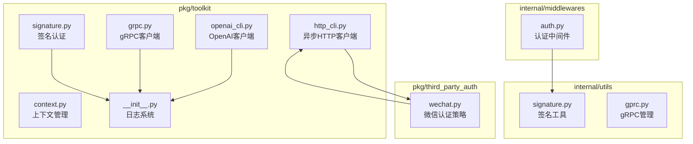
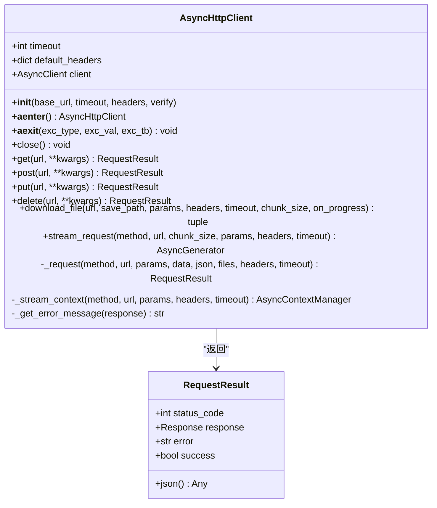
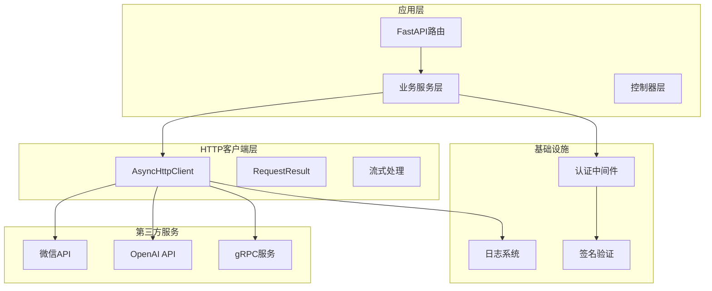
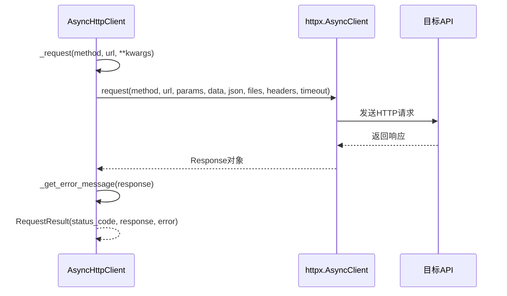
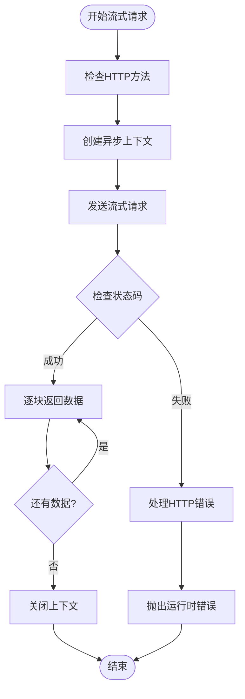
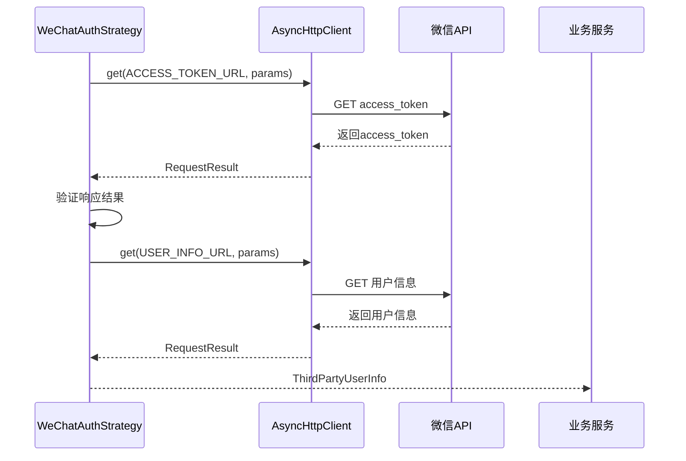
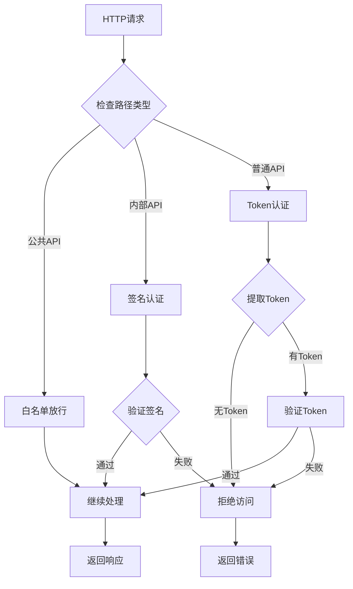
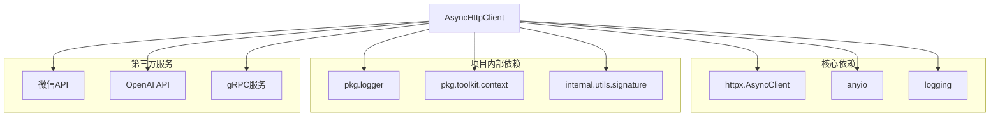

# HTTP客户端

<cite>
**本文档引用的文件**
- [http_cli.py](file://pkg/toolkit/http_cli.py)
- [test_http_cli.py](file://tests/test_http_cli.py)
- [wechat.py](file://pkg/third_party_auth/strategies/wechat.py)
- [auth.py](file://internal/middlewares/auth.py)
- [signature.py](file://internal/utils/signature.py)
- [openai_cli.py](file://pkg/toolkit/openai_cli.py)
- [grpc.py](file://pkg/toolkit/grpc.py)
- [gprc.py](file://internal/utils/gprc.py)
- [context.py](file://pkg/toolkit/context.py)
- [__init__.py](file://pkg/logger/__init__.py)
</cite>

## 目录
1. [简介](#简介)
2. [项目结构](#项目结构)
3. [核心组件](#核心组件)
4. [架构概览](#架构概览)
5. [详细组件分析](#详细组件分析)
6. [依赖关系分析](#依赖关系分析)
7. [性能考虑](#性能考虑)
8. [故障排除指南](#故障排除指南)
9. [结论](#结论)

## 简介

本项目提供了一个功能完整的异步HTTP客户端解决方案，基于httpx库构建，支持多种HTTP操作模式，包括标准请求、流式请求、文件下载等。该HTTP客户端设计为单例/长连接模式，具有良好的性能表现和错误处理能力。

主要特性包括：
- 基于httpx的异步HTTP客户端
- 统一的请求结果封装
- 流式请求和文件下载支持
- 完善的错误处理和日志记录
- 与FastAPI应用的深度集成

## 项目结构

该项目采用模块化组织方式，HTTP客户端相关代码主要位于以下位置：

**图表来源**
- [http_cli.py](file://pkg/toolkit/http_cli.py#L1-L246)
- [wechat.py](file://pkg/third_party_auth/strategies/wechat.py#L1-L138)
- [auth.py](file://internal/middlewares/auth.py#L1-L148)

**章节来源**
- [http_cli.py](file://pkg/toolkit/http_cli.py#L1-L246)
- [wechat.py](file://pkg/third_party_auth/strategies/wechat.py#L1-L138)

## 核心组件

### AsyncHttpClient类

AsyncHttpClient是HTTP客户端的核心类，提供了完整的HTTP操作能力：

**图表来源**
- [http_cli.py](file://pkg/toolkit/http_cli.py#L38-L246)

### RequestResult类

RequestResult是对HTTP响应的统一封装，提供了简洁的API来处理响应数据：

- **状态码处理**：自动识别2xx成功状态
- **JSON解析**：支持响应体JSON解析和缓存
- **错误处理**：统一的错误信息格式化

**章节来源**
- [http_cli.py](file://pkg/toolkit/http_cli.py#L13-L36)

## 架构概览

HTTP客户端在整个系统中的位置和交互关系如下：

**图表来源**
- [http_cli.py](file://pkg/toolkit/http_cli.py#L38-L246)
- [auth.py](file://internal/middlewares/auth.py#L85-L148)
- [wechat.py](file://pkg/third_party_auth/strategies/wechat.py#L12-L138)

## 详细组件分析

### 异步HTTP客户端实现

AsyncHttpClient基于httpx.AsyncClient构建，提供了以下核心功能：

#### 初始化配置
- **基础URL**：支持设置基础URL前缀
- **超时配置**：默认60秒超时时间
- **头部设置**：默认Content-Type为application/json
- **SSL验证**：可配置SSL证书验证

#### HTTP方法封装
支持GET、POST、PUT、DELETE四种基本HTTP方法，每个方法都返回RequestResult对象：

**图表来源**
- [http_cli.py](file://pkg/toolkit/http_cli.py#L114-L170)

#### 错误处理机制

HTTP客户端实现了多层次的错误处理：

1. **HTTP状态错误**：捕获HTTPStatusError并转换为RequestResult
2. **网络错误**：捕获RequestError并设置status_code=0
3. **未知错误**：捕获其他异常并设置status_code=500

**章节来源**
- [http_cli.py](file://pkg/toolkit/http_cli.py#L160-L170)

### 流式请求处理

HTTP客户端支持流式请求和文件下载功能：

#### 流式请求上下文

**图表来源**
- [http_cli.py](file://pkg/toolkit/http_cli.py#L76-L113)

#### 文件下载功能
文件下载支持断点续传和进度回调：

- **异步文件写入**：使用anyio.Path确保线程安全
- **进度监控**：可选的进度回调函数
- **内存优化**：支持自定义块大小

**章节来源**
- [http_cli.py](file://pkg/toolkit/http_cli.py#L183-L228)

### 第三方服务集成

#### 微信认证策略
微信认证策略使用AsyncHttpClient与微信API交互：

**图表来源**
- [wechat.py](file://pkg/third_party_auth/strategies/wechat.py#L50-L129)

**章节来源**
- [wechat.py](file://pkg/third_party_auth/strategies/wechat.py#L12-L138)

### 认证与中间件集成

HTTP客户端与系统的认证体系紧密集成：

#### ASGI认证中间件
认证中间件负责处理不同类型的API访问权限：

- **公共API**：无需认证，直接放行
- **内部API**：使用签名认证
- **普通API**：使用Token认证

**图表来源**
- [auth.py](file://internal/middlewares/auth.py#L89-L147)

**章节来源**
- [auth.py](file://internal/middlewares/auth.py#L13-L148)

## 依赖关系分析

HTTP客户端的依赖关系图：

**图表来源**
- [http_cli.py](file://pkg/toolkit/http_cli.py#L1-L11)
- [wechat.py](file://pkg/third_party_auth/strategies/wechat.py#L1-L9)

**章节来源**
- [http_cli.py](file://pkg/toolkit/http_cli.py#L1-L11)
- [wechat.py](file://pkg/third_party_auth/strategies/wechat.py#L1-L9)

## 性能考虑

### 连接池优化
- **长连接复用**：AsyncHttpClient使用单例模式，避免重复建立连接
- **连接池管理**：httpx内置连接池，自动管理连接复用
- **超时配置**：合理的超时设置平衡响应速度和资源占用

### 内存管理
- **流式处理**：文件下载和流式请求使用异步生成器，避免内存峰值
- **JSON缓存**：RequestResult对解析的JSON数据进行缓存，减少重复解析
- **异步I/O**：使用anyio进行异步文件操作，提高I/O效率

### 错误恢复
- **重试机制**：可根据需要在上层实现重试逻辑
- **降级策略**：网络错误时提供降级处理方案
- **监控告警**：详细的日志记录便于问题诊断

## 故障排除指南

### 常见问题及解决方案

#### 连接超时问题
**症状**：请求长时间无响应
**原因**：网络延迟或目标服务器响应慢
**解决方案**：
- 调整timeout参数
- 检查网络连接
- 实现重试机制

#### SSL证书验证失败
**症状**：HTTPS请求失败
**原因**：SSL证书验证失败
**解决方案**：
- 检查目标服务器证书
- 调整verify参数
- 使用自定义证书路径

#### JSON解析错误
**症状**：RequestResult.json()抛出异常
**原因**：响应不是有效的JSON格式
**解决方案**：
- 检查响应内容类型
- 添加适当的错误处理
- 使用原始响应数据

#### 文件下载中断
**症状**：文件下载过程中断
**原因**：网络不稳定或服务器中断
**解决方案**：
- 实现断点续传
- 添加重试逻辑
- 监控下载进度

**章节来源**
- [http_cli.py](file://pkg/toolkit/http_cli.py#L160-L170)
- [test_http_cli.py](file://tests/test_http_cli.py#L145-L185)

## 结论

本HTTP客户端解决方案提供了完整、可靠的异步HTTP通信能力，具有以下优势：

1. **设计优雅**：基于httpx构建，充分利用异步特性
2. **功能完整**：支持标准HTTP操作、流式处理、文件下载等
3. **错误处理完善**：多层次的错误捕获和处理机制
4. **易于使用**：简洁的API设计，易于集成到现有系统
5. **性能优秀**：连接池复用和异步I/O优化

该客户端不仅满足了当前项目的需求，也为未来的扩展提供了良好的基础。通过与认证中间件、日志系统等基础设施的深度集成，形成了完整的HTTP通信解决方案。