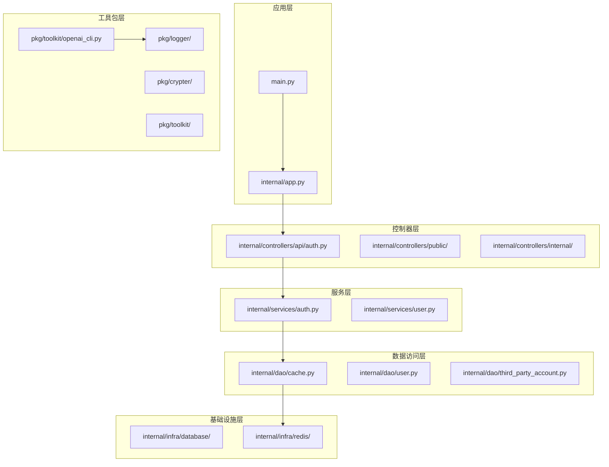
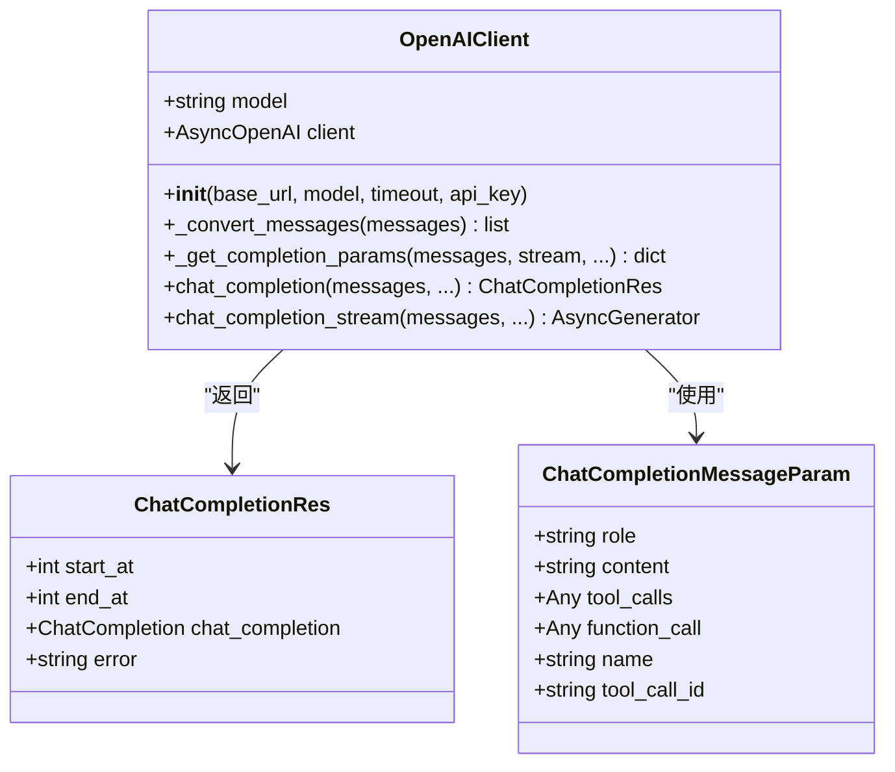
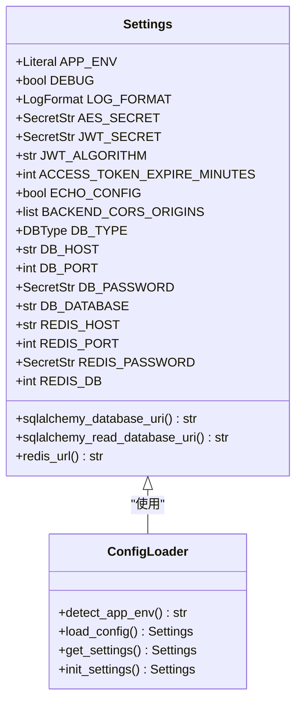
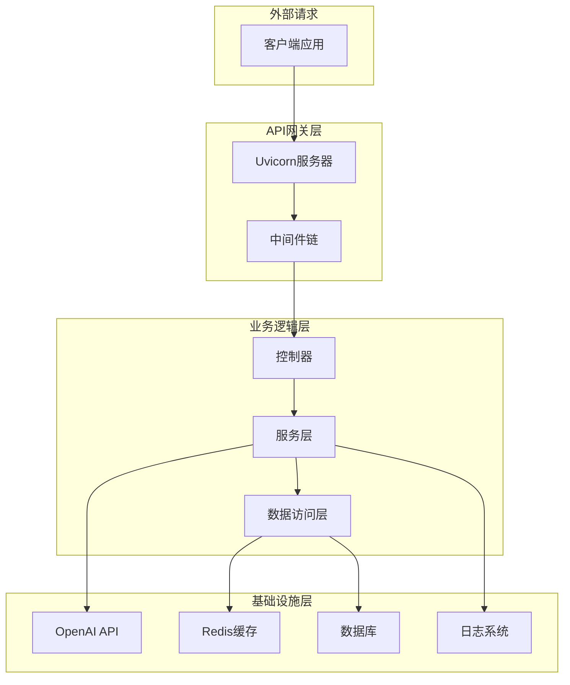
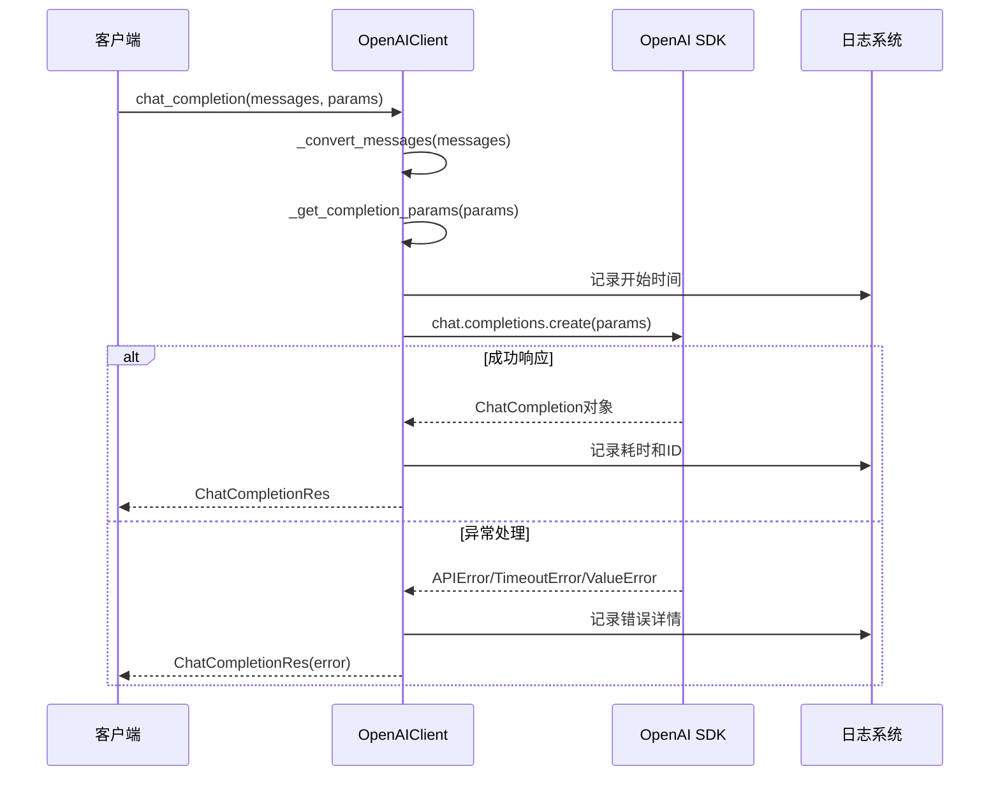
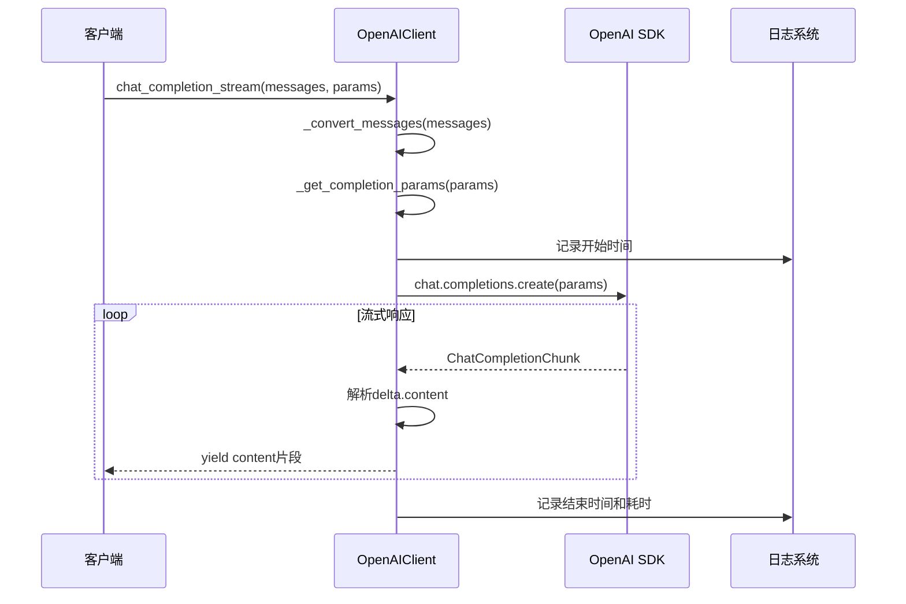
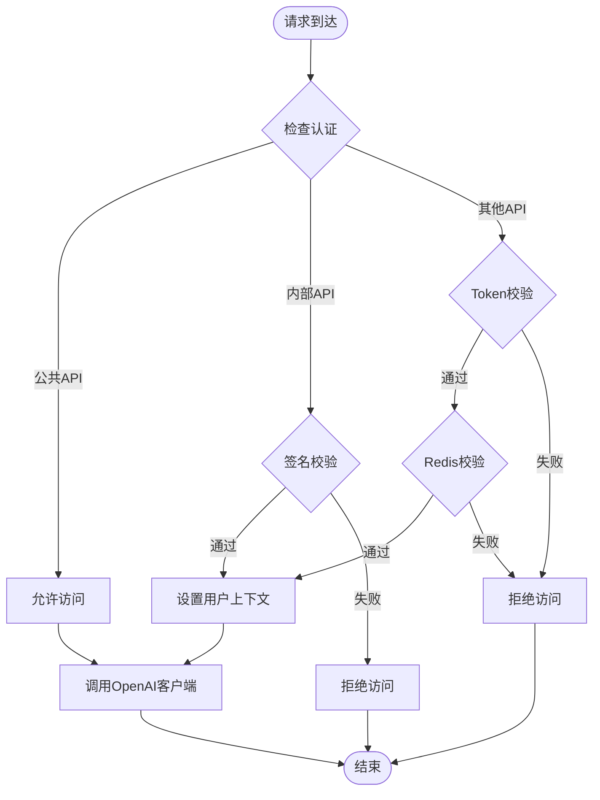
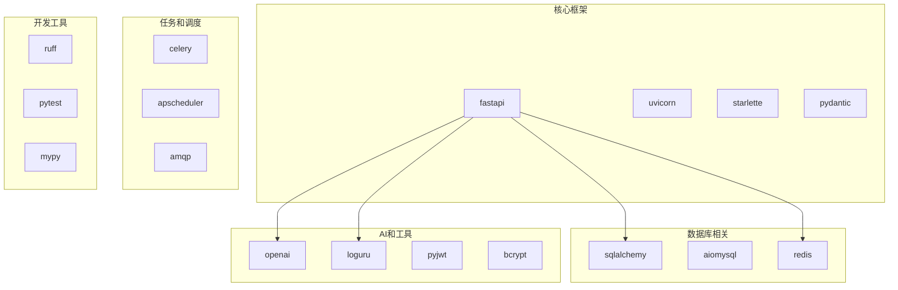
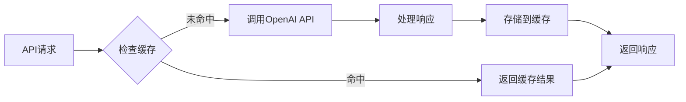

# OpenAI客户端

<cite>
**本文档引用的文件**
- [openai_cli.py](file://pkg/toolkit/openai_cli.py)
- [test_openai_client.py](file://tests/test_openai_client.py)
- [app.py](file://internal/app.py)
- [config.py](file://internal/config.py)
- [auth.py](file://internal/middlewares/auth.py)
- [cache.py](file://internal/dao/cache.py)
- [auth.py](file://internal/controllers/api/auth.py)
- [auth.py](file://internal/services/auth.py)
- [main.py](file://main.py)
- [README.md](file://README.md)
- [pyproject.toml](file://pyproject.toml)
</cite>

## 目录
1. [简介](#简介)
2. [项目结构](#项目结构)
3. [核心组件](#核心组件)
4. [架构概览](#架构概览)
5. [详细组件分析](#详细组件分析)
6. [依赖分析](#依赖分析)
7. [性能考虑](#性能考虑)
8. [故障排除指南](#故障排除指南)
9. [结论](#结论)

## 简介

OpenAI客户端是本FastAPI后端项目中的一个重要组件，提供了对OpenAI API的封装和统一访问接口。该项目采用分层架构设计，支持异步数据库操作、分布式任务队列和定时任务调度，同时集成了认证、缓存、日志等多个核心功能模块。

OpenAI客户端主要负责：
- 封装OpenAI SDK，提供非流式和流式聊天补全功能
- 统一消息格式转换和验证
- 错误处理和日志记录
- 性能监控和超时控制

## 项目结构

项目采用清晰的分层架构，主要分为以下层次：

**图表来源**
- [main.py](file://main.py#L1-L4)
- [app.py](file://internal/app.py#L16-L42)
- [openai_cli.py](file://pkg/toolkit/openai_cli.py#L32-L42)

**章节来源**
- [README.md](file://README.md#L73-L105)
- [pyproject.toml](file://pyproject.toml#L8-L71)

## 核心组件

### OpenAIClient类

OpenAIClient是整个OpenAI客户端的核心类，提供了完整的聊天补全功能封装：

**图表来源**
- [openai_cli.py](file://pkg/toolkit/openai_cli.py#L24-L30)
- [openai_cli.py](file://pkg/toolkit/openai_cli.py#L32-L42)
- [openai_cli.py](file://pkg/toolkit/openai_cli.py#L142-L181)

### 配置管理系统

项目采用Pydantic设置系统，提供了强大的配置管理能力：

**图表来源**
- [config.py](file://internal/config.py#L34-L118)
- [config.py](file://internal/config.py#L309-L386)

**章节来源**
- [openai_cli.py](file://pkg/toolkit/openai_cli.py#L32-L42)
- [config.py](file://internal/config.py#L34-L118)

## 架构概览

项目整体架构采用FastAPI框架，结合多种设计模式和最佳实践：

**图表来源**
- [app.py](file://internal/app.py#L16-L29)
- [auth.py](file://internal/middlewares/auth.py#L85-L148)
- [openai_cli.py](file://pkg/toolkit/openai_cli.py#L32-L42)

## 详细组件分析

### OpenAI客户端工作流程

OpenAI客户端提供了两种主要的工作模式：非流式和流式响应。

#### 非流式聊天补全流程

**图表来源**
- [openai_cli.py](file://pkg/toolkit/openai_cli.py#L142-L181)
- [openai_cli.py](file://pkg/toolkit/openai_cli.py#L157-L173)

#### 流式聊天补全流程

**图表来源**
- [openai_cli.py](file://pkg/toolkit/openai_cli.py#L183-L235)
- [openai_cli.py](file://pkg/toolkit/openai_cli.py#L208-L215)

### 认证和授权集成

项目实现了多层次的认证机制，OpenAI客户端可以通过认证中间件获取用户上下文：

**图表来源**
- [auth.py](file://internal/middlewares/auth.py#L85-L148)
- [auth.py](file://internal/services/auth.py#L7-L25)

**章节来源**
- [openai_cli.py](file://pkg/toolkit/openai_cli.py#L142-L235)
- [auth.py](file://internal/middlewares/auth.py#L85-L148)

## 依赖分析

项目采用了现代化的依赖管理策略，主要依赖包括：

**图表来源**
- [pyproject.toml](file://pyproject.toml#L9-L71)

**章节来源**
- [pyproject.toml](file://pyproject.toml#L9-L71)

## 性能考虑

### 异步处理优势

项目充分利用了Python的异步特性，OpenAI客户端使用AsyncOpenAI来实现非阻塞的API调用：

- **并发处理**：多个OpenAI请求可以并行处理，提高整体吞吐量
- **内存效率**：异步生成器在流式响应中节省内存占用
- **超时控制**：内置超时机制防止长时间阻塞

### 缓存策略

项目集成了Redis缓存系统，可以有效减少重复的OpenAI调用：

### 错误处理和重试机制

OpenAI客户端实现了完善的错误处理机制：

- **具体异常捕获**：区分APIError、TimeoutError、ValueError等不同类型的异常
- **日志记录**：详细的错误日志便于问题诊断
- **优雅降级**：在网络异常时提供合理的回退策略

## 故障排除指南

### 常见问题及解决方案

#### API密钥问题
- **症状**：认证失败或权限不足
- **解决方案**：检查API密钥配置，确保密钥有效且具有相应权限

#### 网络连接问题
- **症状**：超时错误或连接失败
- **解决方案**：检查网络连接，调整超时参数，确认API端点可达性

#### 消息格式错误
- **症状**：ValueError，提示消息格式不正确
- **解决方案**：验证消息数组格式，确保每个消息都有必需的字段

#### 资源限制问题
- **症状**：内存不足或CPU使用率过高
- **解决方案**：优化并发数量，实现适当的限流机制

**章节来源**
- [openai_cli.py](file://pkg/toolkit/openai_cli.py#L164-L173)
- [openai_cli.py](file://pkg/toolkit/openai_cli.py#L223-L230)

## 结论

OpenAI客户端作为本FastAPI后端项目的重要组成部分，展现了现代Python Web开发的最佳实践。通过采用异步编程、分层架构、完善的错误处理和配置管理，该项目为AI应用的开发提供了坚实的基础。

主要特点包括：
- **模块化设计**：清晰的职责分离和依赖管理
- **异步性能**：充分利用异步特性提升系统性能
- **可扩展性**：易于添加新的AI服务和功能
- **可靠性**：完善的错误处理和监控机制
- **安全性**：多层次的认证和授权机制

未来可以考虑的改进方向：
- 添加更多的AI服务提供商支持
- 实现智能缓存策略
- 增强监控和指标收集
- 优化资源配置和成本控制