# 异步任务管理

<cite>
**本文档引用的文件**
- [celery_tasks.py](file://internal/tasks/celery_tasks.py)
- [scheduler.py](file://internal/tasks/scheduler.py)
- [celery.py](file://pkg/toolkit/celery.py)
- [async_task.py](file://pkg/toolkit/async_task.py)
- [apscheduler.py](file://pkg/toolkit/apscheduler.py)
- [inter.py](file://pkg/toolkit/inter.py)
- [anyio_task_utils.py](file://internal/utils/anyio_task.py)
- [config.py](file://internal/config.py)
- [app.py](file://internal/app.py)
- [run_celery_worker.sh](file://scripts/run_celery_worker.sh)
- [test_celery_tasks.py](file://tests/test_celery_tasks.py)
- [test_anyio_task.py](file://tests/test_anyio_task.py)
</cite>

## 更新摘要
**变更内容**
- 新增 UUIDv7 ID 生成系统，提供时间排序的 64 位整数 ID
- 新增异步任务管理工具包装函数，提供更好的类型安全性和一致性
- 更新核心组件分析，包含新的 ID 生成和任务管理工具
- 增强架构概览，反映新增的功能模块

## 目录
1. [简介](#简介)
2. [项目结构](#项目结构)
3. [核心组件](#核心组件)
4. [架构概览](#架构概览)
5. [详细组件分析](#详细组件分析)
6. [依赖关系分析](#依赖关系分析)
7. [性能考虑](#性能考虑)
8. [故障排除指南](#故障排除指南)
9. [结论](#结论)

## 简介

本项目实现了完整的异步任务管理系统，包含以下核心能力：

- **分布式任务队列**：基于 Celery 的异步任务执行框架
- **定时任务调度**：支持 Cron 和 Interval 两种调度模式
- **并发任务管理**：基于 AnyIO 的高性能并发任务处理
- **任务编排**：支持链式、分组和回调模式的任务编排
- **任务监控**：完整的任务状态跟踪和异常处理机制
- **ID 生成系统**：基于 UUIDv7 标准的时间排序 ID 生成
- **类型安全工具**：增强的异步任务管理包装函数

系统采用分层架构设计，将业务逻辑与任务执行分离，确保系统的可扩展性和可靠性。

## 项目结构

异步任务管理相关的文件组织结构如下：

```mermaid
graph TB
subgraph "任务定义层"
A[internal/tasks/] --> B[celery_tasks.py]
A --> C[scheduler.py]
end
subgraph "工具层"
D[pkg/toolkit/] --> E[celery.py]
D --> F[async_task.py]
D --> G[apscheduler.py]
D --> H[inter.py]
end
subgraph "集成层"
I[internal/utils/] --> J[celery/__init__.py]
I --> K[anyio_task.py]
end
subgraph "配置层"
L[internal/config.py]
M[internal/app.py]
end
subgraph "测试层"
N[tests/] --> O[test_celery_tasks.py]
N --> P[test_anyio_task.py]
end
B --> E
C --> E
I --> E
K --> F
L --> I
M --> K
```

**图表来源**
- [celery_tasks.py](file://internal/tasks/celery_tasks.py#L1-L156)
- [scheduler.py](file://internal/tasks/scheduler.py#L1-L48)
- [celery.py](file://pkg/toolkit/celery.py#L1-L199)
- [async_task.py](file://pkg/toolkit/async_task.py#L1-L432)
- [inter.py](file://pkg/toolkit/inter.py#L1-L58)

**章节来源**
- [celery_tasks.py](file://internal/tasks/celery_tasks.py#L1-L156)
- [scheduler.py](file://internal/tasks/scheduler.py#L1-L48)
- [celery.py](file://pkg/toolkit/celery.py#L1-L199)
- [async_task.py](file://pkg/toolkit/async_task.py#L1-L432)
- [inter.py](file://pkg/toolkit/inter.py#L1-L58)

## 核心组件

### Celery 任务系统

Celery 任务系统是整个异步任务管理的核心，提供了分布式任务队列的所有必要功能：

- **任务定义**：支持独立业务逻辑、协调多个服务、纯技术运维三类任务
- **任务路由**：灵活的任务队列分配机制
- **任务编排**：链式、分组、回调三种编排模式
- **状态管理**：完整的任务生命周期跟踪

### AnyIO 并发任务管理

AnyIO 任务管理器提供了高性能的并发任务处理能力：

- **任务调度**：基于 AnyIO 的异步任务调度
- **并发控制**：智能的线程和进程池管理
- **超时处理**：精确的任务超时控制
- **异常恢复**：完善的异常处理和恢复机制
- **类型安全**：新增的包装函数提供更好的类型安全性

### 定时任务调度器

APScheduler 集成了高性能的定时任务调度功能：

- **多种调度模式**：支持 Cron 和 Interval 两种调度模式
- **任务管理**：完整的任务生命周期管理
- **配置灵活性**：支持动态任务配置和修改

### UUIDv7 ID 生成系统

基于 UUIDv7 标准的 ID 生成系统，提供时间排序的 64 位整数 ID：

- **时间排序**：确保 ID 的时间可排序性，优化数据库索引性能
- **唯一性保证**：基于 UUIDv7 标准，确保全局唯一性
- **高性能**：64 位整数格式，适合高性能应用场景
- **兼容性**：与现有系统无缝集成

**章节来源**
- [celery.py](file://pkg/toolkit/celery.py#L15-L199)
- [async_task.py](file://pkg/toolkit/async_task.py#L24-L71)
- [apscheduler.py](file://pkg/toolkit/apscheduler.py#L14-L255)
- [inter.py](file://pkg/toolkit/inter.py#L43-L58)

## 架构概览

系统采用分层架构设计，确保各组件之间的松耦合和高内聚：

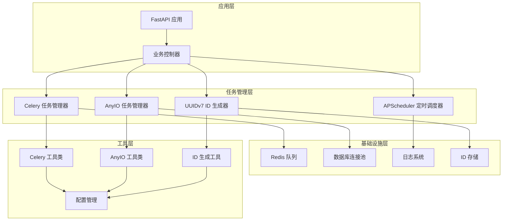

**图表来源**
- [app.py](file://internal/app.py#L80-L111)
- [celery.py](file://pkg/toolkit/celery.py#L15-L199)
- [async_task.py](file://pkg/toolkit/async_task.py#L24-L71)
- [inter.py](file://pkg/toolkit/inter.py#L43-L58)

## 详细组件分析

### Celery 任务定义分析

系统实现了三种类型的 Celery 任务，每种都有明确的职责划分：

#### 独立业务逻辑任务

这类任务直接调用服务层的业务逻辑，任务本身只负责调度包装：

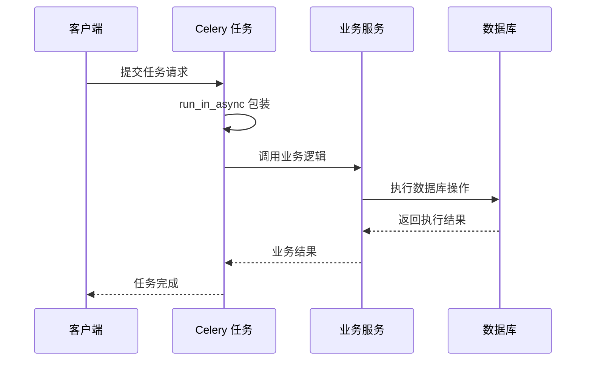

**图表来源**
- [celery_tasks.py](file://internal/tasks/celery_tasks.py#L20-L54)
- [celery.py](file://internal/utils/celery/__init__.py#L119-L150)

#### 协调多个服务任务

这类任务负责协调多个服务的协同工作，实现复杂的业务流程：

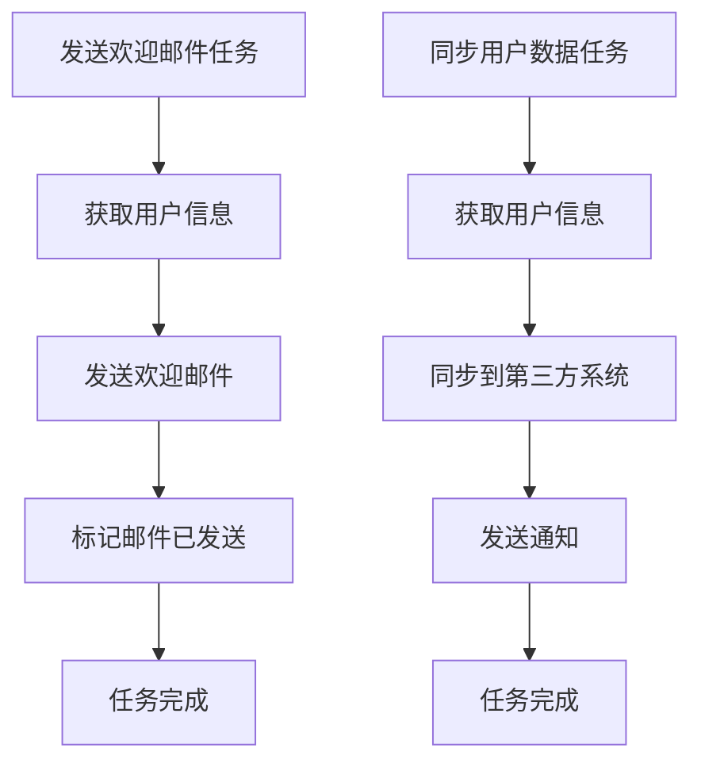

**图表来源**
- [celery_tasks.py](file://internal/tasks/celery_tasks.py#L62-L99)

#### 纯技术运维任务

这类任务专注于技术层面的运维工作，不涉及业务逻辑：

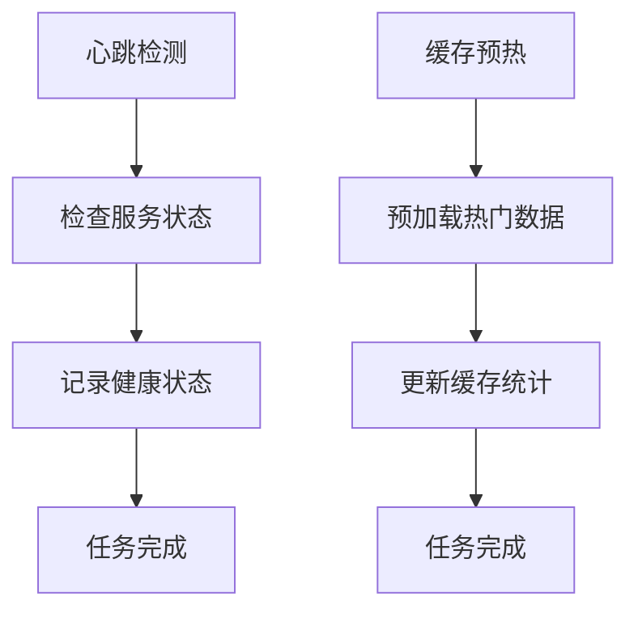

**图表来源**
- [celery_tasks.py](file://internal/tasks/celery_tasks.py#L107-L131)

**章节来源**
- [celery_tasks.py](file://internal/tasks/celery_tasks.py#L1-L156)

### 任务编排模式

系统支持三种主要的任务编排模式，满足不同的业务需求：

#### 链式任务编排

链式编排确保任务按照严格的顺序执行，前一个任务的结果作为下一个任务的输入：

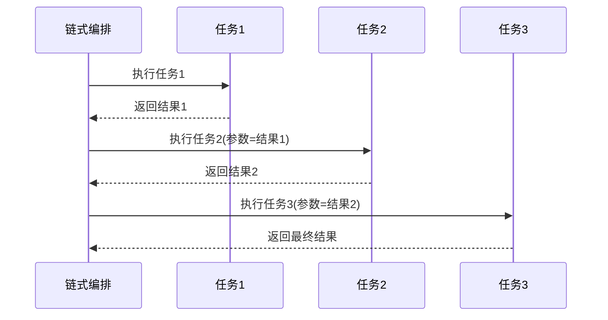

**图表来源**
- [celery_toolkit.py](file://pkg/toolkit/celery.py#L113-L138)

#### 分组并行任务编排

分组编排允许多个任务并行执行，适用于可以独立处理的业务场景：

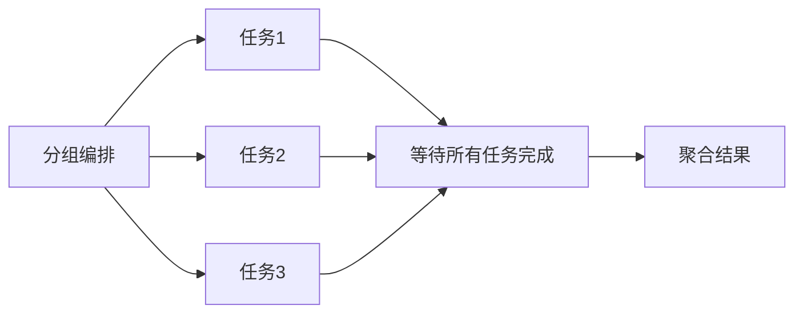

**图表来源**
- [celery_toolkit.py](file://pkg/toolkit/celery.py#L122-L138)

#### 回调任务编排

回调编排结合了分组和链式的优点，先并行执行多个任务，然后将结果汇总到回调任务中：

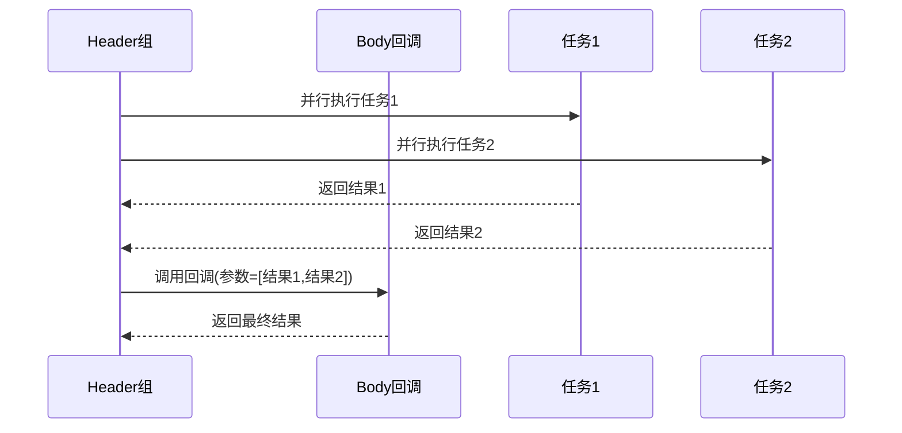

**图表来源**
- [celery_toolkit.py](file://pkg/toolkit/celery.py#L131-L138)

**章节来源**
- [celery_toolkit.py](file://pkg/toolkit/celery.py#L113-L138)

### AnyIO 任务管理器

AnyIO 任务管理器提供了高性能的并发任务处理能力，具有以下特点：

#### 任务生命周期管理

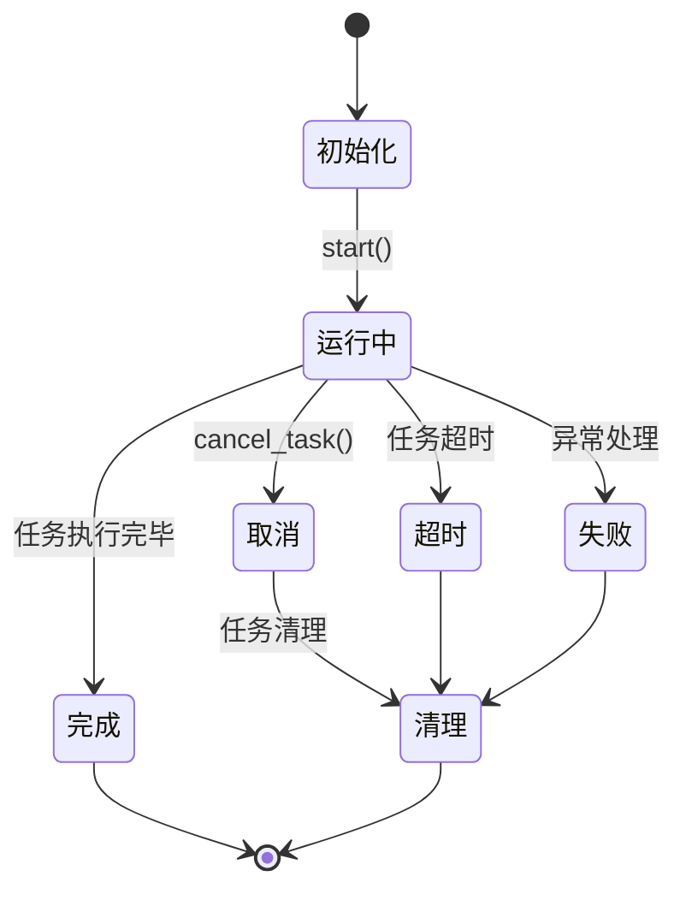

**图表来源**
- [async_task.py](file://pkg/toolkit/async_task.py#L106-L142)

#### 并发控制机制

系统实现了多层次的并发控制机制：

- **全局容量限制**：控制整体并发数量
- **线程池限制**：管理 CPU 密集型任务
- **进程池限制**：管理 I/O 密集型任务

#### 异步任务管理工具包装函数

新增的包装函数提供了更好的类型安全性和一致性：

- **anyio_run_in_thread()**：封装线程执行，消除类型警告
- **anyio_run_in_process()**：封装进程执行，消除类型警告
- **类型安全**：提供完整的类型注解和参数验证
- **一致性**：统一的参数命名和返回值格式

**章节来源**
- [async_task.py](file://pkg/toolkit/async_task.py#L24-L71)
- [async_task.py](file://pkg/toolkit/async_task.py#L91-L432)

### 定时任务调度器

APScheduler 提供了灵活的定时任务调度功能：

#### 调度配置管理

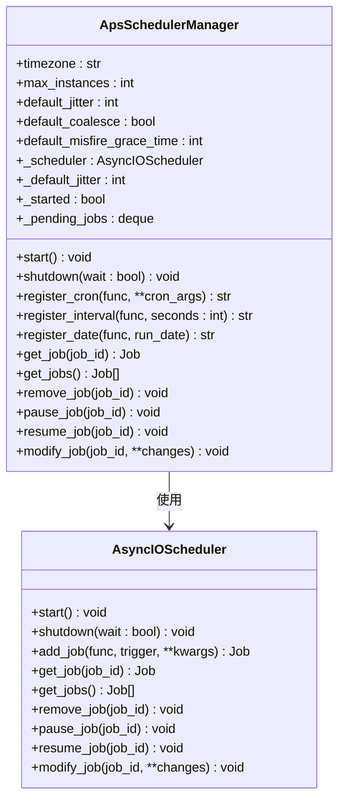

**图表来源**
- [apscheduler.py](file://pkg/toolkit/apscheduler.py#L14-L255)

**章节来源**
- [apscheduler.py](file://pkg/toolkit/apscheduler.py#L14-L255)

### UUIDv7 ID 生成系统

基于 UUIDv7 标准的 ID 生成系统，提供时间排序的 64 位整数 ID：

#### ID 生成流程

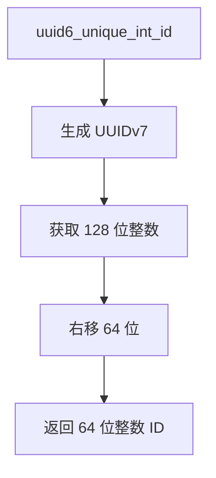

**图表来源**
- [inter.py](file://pkg/toolkit/inter.py#L43-L58)

#### 时间排序特性

- **时间戳集中**：UUIDv7 的时间戳信息主要集中在高位
- **数据库优化**：时间排序的 ID 有利于数据库索引性能
- **全局唯一**：基于 UUIDv7 标准，确保全局唯一性

**章节来源**
- [inter.py](file://pkg/toolkit/inter.py#L43-L58)

## 依赖关系分析

系统各组件之间的依赖关系清晰明确，遵循依赖倒置原则：

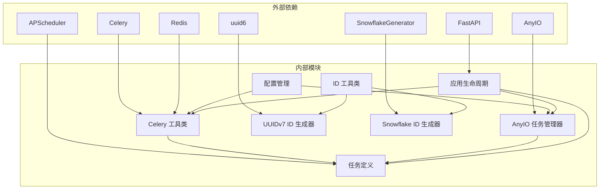

**图表来源**
- [celery.py](file://pkg/toolkit/celery.py#L6-L12)
- [async_task.py](file://pkg/toolkit/async_task.py#L8-L21)
- [inter.py](file://pkg/toolkit/inter.py#L6-L7)

### 组件耦合度分析

- **低耦合设计**：各组件之间通过接口交互，减少直接依赖
- **可替换性**：任务执行引擎可以根据需要进行替换
- **扩展性**：新的任务类型可以通过继承现有接口轻松添加
- **类型安全**：新增的包装函数提供更好的类型安全保障

**章节来源**
- [celery.py](file://pkg/toolkit/celery.py#L15-L199)
- [async_task.py](file://pkg/toolkit/async_task.py#L24-L71)
- [inter.py](file://pkg/toolkit/inter.py#L43-L58)

## 性能考虑

### 并发性能优化

系统在多个层面进行了性能优化：

#### 任务队列优化

- **多队列支持**：不同类型的任务可以分配到不同的队列
- **优先级调度**：支持任务优先级设置
- **负载均衡**：自动平衡不同队列的工作负载

#### 内存管理优化

- **连接池复用**：数据库和 Redis 连接池自动复用
- **内存限制**：支持进程内存上限设置
- **垃圾回收**：定期清理无用对象

#### 网络性能优化

- **连接重用**：HTTP 请求连接自动复用
- **批量处理**：支持批量任务处理
- **压缩传输**：支持数据压缩传输

#### ID 生成性能优化

- **高效算法**：UUIDv7 生成算法经过优化
- **缓存机制**：ID 生成器支持批量生成
- **无锁设计**：减少并发冲突

### 监控和诊断

系统提供了全面的监控和诊断功能：

- **任务状态监控**：实时跟踪任务执行状态
- **性能指标收集**：收集任务执行时间和成功率
- **异常告警**：自动检测和报告异常情况
- **ID 生成监控**：跟踪 ID 生成性能和唯一性

## 故障排除指南

### 常见问题诊断

#### Celery 任务执行失败

当 Celery 任务执行失败时，可以按照以下步骤进行诊断：

1. **检查任务定义**：确认任务函数签名正确
2. **验证依赖服务**：确保数据库和 Redis 服务正常
3. **查看日志信息**：分析详细的错误日志
4. **测试任务重试**：验证重试机制是否正常工作

#### 任务超时问题

任务超时通常是由于以下原因造成的：

- **任务执行时间过长**：优化任务算法或增加超时时间
- **资源竞争**：检查是否有资源争用问题
- **网络延迟**：监控外部服务响应时间

#### 并发控制问题

当遇到并发控制问题时：

- **检查容量限制**：确认线程池和进程池配置合理
- **监控资源使用**：观察 CPU 和内存使用情况
- **调整并发策略**：根据实际负载调整并发参数

#### ID 生成问题

当遇到 ID 生成问题时：

- **检查 UUIDv7 支持**：确认系统支持 UUIDv7 标准
- **验证时间同步**：确保系统时间准确
- **监控 ID 唯一性**：检查是否存在 ID 冲突

**章节来源**
- [test_celery_tasks.py](file://tests/test_celery_tasks.py#L18-L361)
- [test_anyio_task.py](file://tests/test_anyio_task.py#L67-L235)

### 性能调优建议

#### Celery 性能调优

- **调整并发数**：根据服务器资源合理设置并发数
- **优化队列配置**：为不同类型任务配置专门的队列
- **监控任务性能**：定期分析任务执行时间和成功率

#### AnyIO 性能调优

- **容量限制调优**：根据实际负载调整容量限制
- **超时参数优化**：设置合理的超时时间
- **资源监控**：持续监控系统资源使用情况
- **包装函数优化**：利用新增的类型安全包装函数

#### ID 生成性能调优

- **批量生成**：使用批量生成接口提高效率
- **缓存策略**：合理设置 ID 缓存策略
- **监控指标**：跟踪 ID 生成性能和唯一性

## 结论

本异步任务管理系统具有以下优势：

1. **架构清晰**：采用分层设计，职责明确，易于维护
2. **功能完整**：涵盖分布式任务、定时调度、并发控制等核心功能
3. **性能优异**：通过多层优化确保系统高效运行
4. **易于扩展**：模块化设计支持功能扩展和定制
5. **可靠性强**：完善的错误处理和监控机制
6. **类型安全**：新增的包装函数提供更好的类型安全保障
7. **ID 优化**：基于 UUIDv7 的高效 ID 生成系统

系统通过 Celery 实现分布式任务处理，通过 AnyIO 提供高性能并发控制，通过 APScheduler 实现灵活的定时调度，通过 UUIDv7 提供高效的时间排序 ID 生成，形成了完整的异步任务解决方案。这种设计既保证了系统的可扩展性，又确保了任务执行的可靠性和性能。

新增的 UUIDv7 ID 生成系统和异步任务管理工具包装函数进一步增强了系统的实用性和开发体验，为开发者提供了更强大、更安全的工具集。