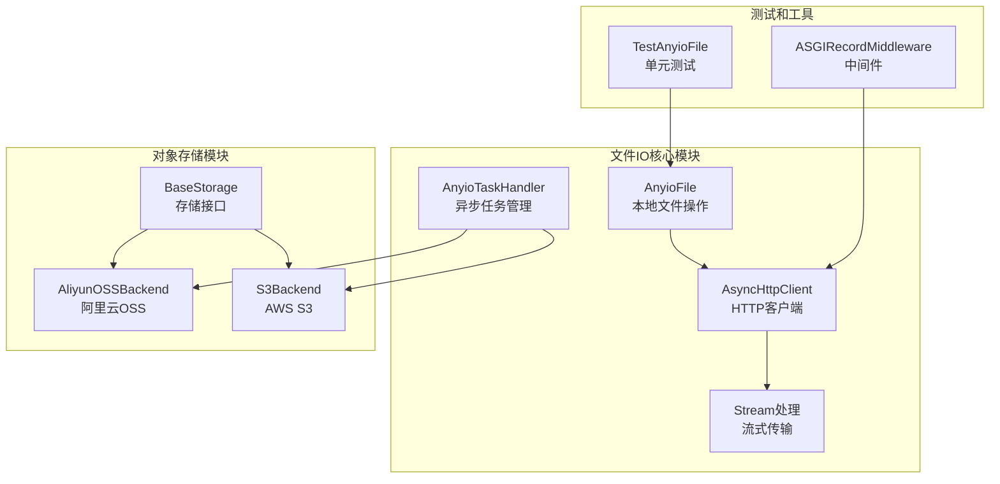
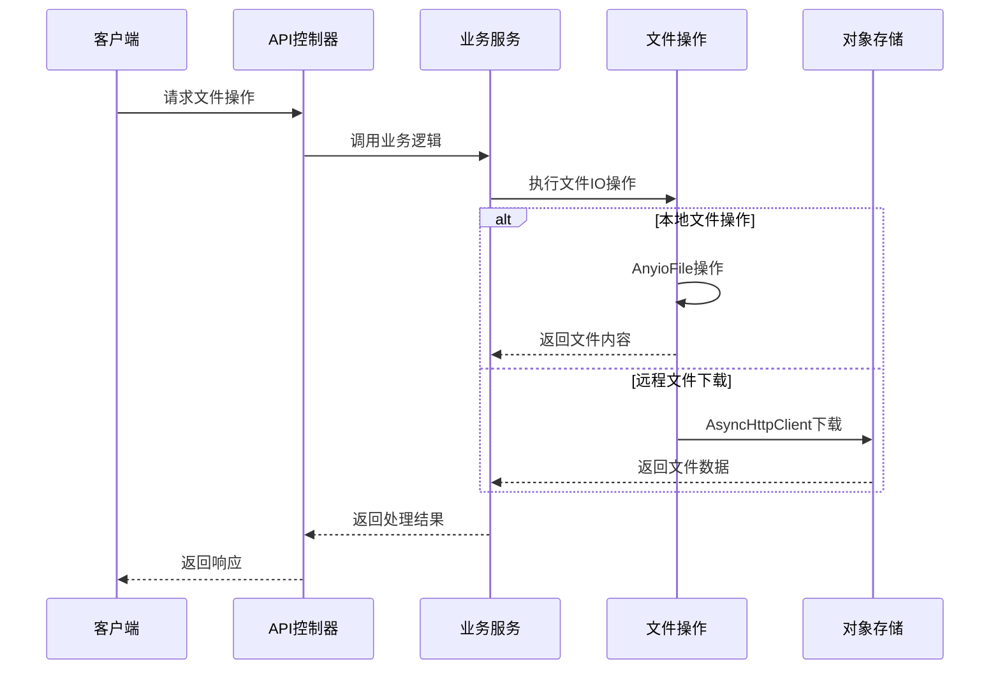
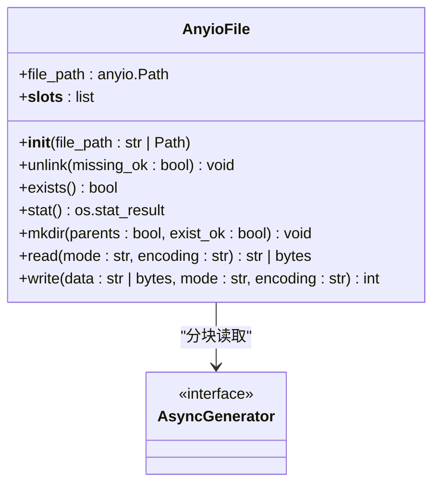
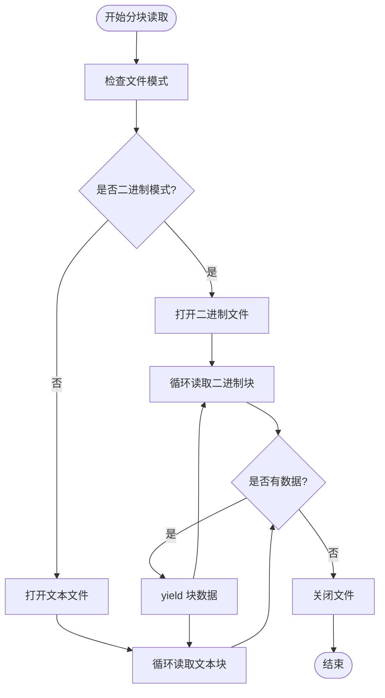
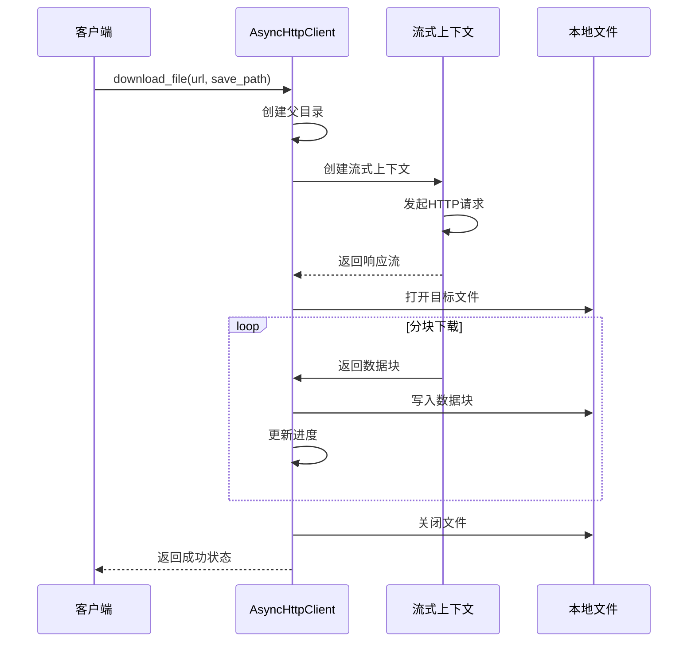
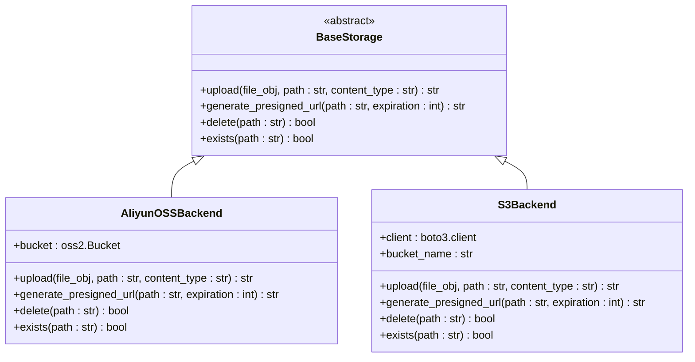
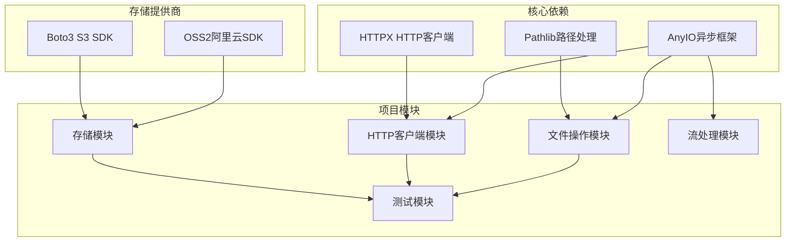

# 文件IO操作

<cite>
**本文档引用的文件**
- [pkg/toolkit/file.py](file://pkg/toolkit/file.py)
- [pkg/toolkit/http_cli.py](file://pkg/toolkit/http_cli.py)
- [pkg/toolkit/async_task.py](file://pkg/toolkit/async_task.py)
- [pkg/oss/base.py](file://pkg/oss/base.py)
- [pkg/oss/aliyun.py](file://pkg/oss/aliyun.py)
- [pkg/oss/s3.py](file://pkg/oss/s3.py)
- [internal/utils/stream.py](file://internal/utils/stream.py)
- [tests/test_anyio_file.py](file://tests/test_anyio_file.py)
- [internal/middlewares/recorder.py](file://internal/middlewares/recorder.py)
- [README.md](file://README.md)
</cite>

## 目录
1. [简介](#简介)
2. [项目结构](#项目结构)
3. [核心组件](#核心组件)
4. [架构概览](#架构概览)
5. [详细组件分析](#详细组件分析)
6. [依赖关系分析](#依赖关系分析)
7. [性能考虑](#性能考虑)
8. [故障排除指南](#故障排除指南)
9. [结论](#结论)

## 简介

本文档深入分析了FastAPI后端项目中的文件IO操作实现，涵盖了本地文件操作、网络文件传输、对象存储集成以及流式处理等核心功能。项目采用了现代化的异步IO框架AnyIO，提供了高效、可靠的文件处理能力。

该项目的文件IO操作主要集中在以下方面：
- 本地文件系统操作（读写、删除、状态查询）
- 网络文件下载和流式传输
- 对象存储（阿里云OSS、AWS S3）集成
- 异步流式处理和超时控制
- 配置文件管理和环境变量处理

## 项目结构

项目采用分层架构设计，文件IO相关的代码主要分布在以下模块：

**图表来源**
- [pkg/toolkit/file.py](file://pkg/toolkit/file.py#L9-L155)
- [pkg/toolkit/http_cli.py](file://pkg/toolkit/http_cli.py#L38-L246)
- [pkg/oss/base.py](file://pkg/oss/base.py#L26-L42)

**章节来源**
- [README.md](file://README.md#L73-L105)

## 核心组件

### AnyioFile - 本地文件操作核心

AnyioFile是项目中最核心的文件IO类，提供了完整的异步文件操作能力：

- **基础操作**：文件读取、写入、删除、状态查询
- **高级功能**：分块读取、逐行读取、目录创建
- **类型安全**：完整的类型注解和运行时类型检查
- **内存优化**：使用`__slots__`减少内存占用

### AsyncHttpClient - 网络文件传输

基于httpx构建的异步HTTP客户端，专门处理文件下载和流式传输：

- **流式下载**：支持大文件的分块下载和进度跟踪
- **错误处理**：完善的异常捕获和错误响应机制
- **超时控制**：灵活的超时配置和管理
- **连接池**：高效的连接管理和复用

### BaseStorage - 对象存储抽象

定义了统一的对象存储接口，支持多种存储提供商：

- **统一接口**：upload、generate_presigned_url、delete、exists
- **多提供商支持**：阿里云OSS和AWS S3
- **异步实现**：所有操作都是异步的
- **类型安全**：完整的类型注解

**章节来源**
- [pkg/toolkit/file.py](file://pkg/toolkit/file.py#L9-L155)
- [pkg/toolkit/http_cli.py](file://pkg/toolkit/http_cli.py#L38-L246)
- [pkg/oss/base.py](file://pkg/oss/base.py#L26-L42)

## 架构概览

项目采用分层架构，文件IO操作贯穿多个层次：

**图表来源**
- [pkg/toolkit/file.py](file://pkg/toolkit/file.py#L110-L155)
- [pkg/toolkit/http_cli.py](file://pkg/toolkit/http_cli.py#L183-L228)

## 详细组件分析

### AnyioFile 类详细分析

AnyioFile提供了完整的文件操作能力，以下是其核心方法的详细说明：

#### 基础文件操作

**图表来源**
- [pkg/toolkit/file.py](file://pkg/toolkit/file.py#L9-L155)

#### 分块读取功能

AnyioFile实现了高效的分块读取机制，特别适合处理大文件：

**图表来源**
- [pkg/toolkit/file.py](file://pkg/toolkit/file.py#L61-L89)

#### 类型安全和错误处理

AnyioFile实现了严格的类型检查和错误处理机制：

**章节来源**
- [pkg/toolkit/file.py](file://pkg/toolkit/file.py#L12-L155)

### AsyncHttpClient 详细分析

AsyncHttpClient提供了强大的网络文件下载和流式传输能力：

#### 下载流程

**图表来源**
- [pkg/toolkit/http_cli.py](file://pkg/toolkit/http_cli.py#L183-L228)

#### 流式处理和超时控制

项目还提供了专门的流式处理工具来控制超时和错误：

**章节来源**
- [pkg/toolkit/http_cli.py](file://pkg/toolkit/http_cli.py#L38-L246)
- [internal/utils/stream.py](file://internal/utils/stream.py#L16-L99)

### 对象存储集成

项目支持多种对象存储提供商，通过统一的接口实现：

#### 存储后端架构

**图表来源**
- [pkg/oss/base.py](file://pkg/oss/base.py#L26-L42)
- [pkg/oss/aliyun.py](file://pkg/oss/aliyun.py#L10-L74)
- [pkg/oss/s3.py](file://pkg/oss/s3.py#L12-L85)

#### 异步任务管理

为了处理对象存储的同步操作，项目使用了异步任务管理器：

**章节来源**
- [pkg/oss/aliyun.py](file://pkg/oss/aliyun.py#L37-L74)
- [pkg/oss/s3.py](file://pkg/oss/s3.py#L31-L85)
- [pkg/toolkit/async_task.py](file://pkg/toolkit/async_task.py#L24-L71)

## 依赖关系分析

项目中的文件IO操作涉及多个模块间的复杂依赖关系：

**图表来源**
- [pkg/toolkit/file.py](file://pkg/toolkit/file.py#L1-L7)
- [pkg/toolkit/http_cli.py](file://pkg/toolkit/http_cli.py#L1-L11)
- [pkg/oss/aliyun.py](file://pkg/oss/aliyun.py#L1-L6)
- [pkg/oss/s3.py](file://pkg/oss/s3.py#L1-L8)

**章节来源**
- [pkg/toolkit/file.py](file://pkg/toolkit/file.py#L1-L7)
- [pkg/toolkit/http_cli.py](file://pkg/toolkit/http_cli.py#L1-L11)
- [pkg/oss/aliyun.py](file://pkg/oss/aliyun.py#L1-L6)
- [pkg/oss/s3.py](file://pkg/oss/s3.py#L1-L8)

## 性能考虑

### 异步IO优势

项目采用异步IO设计带来了显著的性能提升：

1. **非阻塞操作**：所有文件IO操作都是异步的，不会阻塞事件循环
2. **高并发处理**：能够同时处理大量文件操作请求
3. **内存效率**：分块读取避免了大文件的内存占用问题

### 缓冲区和内存管理

- **分块大小优化**：默认64KB的分块大小平衡了内存使用和IO效率
- **流式处理**：避免将整个文件加载到内存中
- **及时释放**：使用上下文管理器确保资源及时释放

### 网络传输优化

- **连接复用**：HTTP客户端使用连接池复用TCP连接
- **流式下载**：支持大文件的分块下载，避免内存溢出
- **进度跟踪**：提供详细的下载进度反馈

## 故障排除指南

### 常见问题和解决方案

#### 文件权限问题

当遇到文件权限错误时，检查以下几点：
1. 确认应用程序具有足够的文件系统权限
2. 检查目标目录是否存在且可写
3. 验证路径格式是否正确

#### 内存不足问题

对于大文件处理：
1. 使用分块读取替代整文件读取
2. 监控内存使用情况
3. 考虑增加服务器内存或优化算法

#### 网络超时问题

网络文件下载失败时：
1. 检查网络连接稳定性
2. 调整超时参数设置
3. 验证目标服务器可达性

#### 对象存储认证失败

配置对象存储时：
1. 确认访问密钥和密钥ID正确
2. 检查存储桶权限设置
3. 验证网络连接和防火墙设置

**章节来源**
- [tests/test_anyio_file.py](file://tests/test_anyio_file.py#L150-L161)
- [internal/middlewares/recorder.py](file://internal/middlewares/recorder.py#L73-L149)

## 结论

该项目的文件IO操作设计体现了现代异步编程的最佳实践，通过以下特点实现了高效、可靠的文件处理能力：

1. **异步架构**：全面采用异步IO设计，提升了系统的并发处理能力
2. **类型安全**：完整的类型注解和运行时检查，减少了运行时错误
3. **模块化设计**：清晰的模块分离，便于维护和扩展
4. **错误处理**：完善的异常处理机制，提高了系统的稳定性
5. **性能优化**：合理的内存管理和流式处理策略

这些设计使得项目能够高效处理各种规模的文件IO操作，从简单的本地文件读写到复杂的网络文件传输和对象存储集成，都提供了可靠的技术支撑。