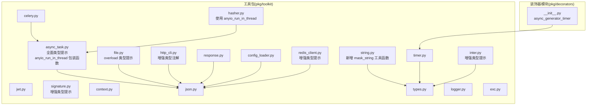
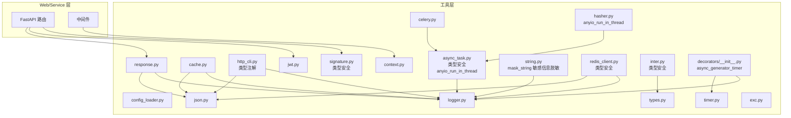
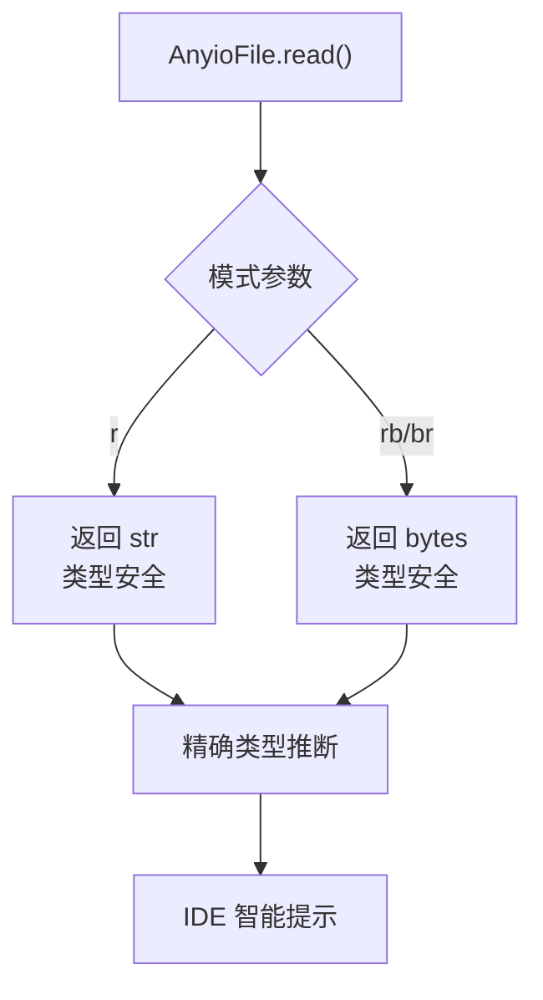
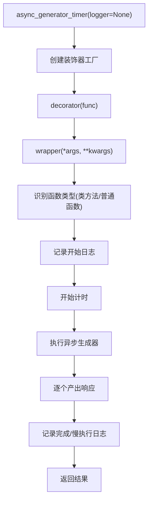
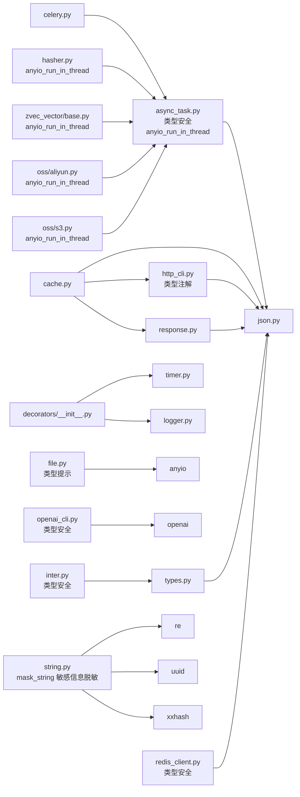

# 通用工具包

<cite>
**本文引用的文件**
- [pkg/toolkit/async_task.py](file://pkg/toolkit/async_task.py)
- [pkg/toolkit/file.py](file://pkg/toolkit/file.py)
- [pkg/toolkit/http_cli.py](file://pkg/toolkit/http_cli.py)
- [pkg/toolkit/openai_cli.py](file://pkg/toolkit/openai_cli.py)
- [pkg/toolkit/signature.py](file://pkg/toolkit/signature.py)
- [pkg/toolkit/cache.py](file://pkg/toolkit/cache.py)
- [pkg/toolkit/jwt.py](file://pkg/toolkit/jwt.py)
- [pkg/toolkit/response.py](file://pkg/toolkit/response.py)
- [pkg/toolkit/config_loader.py](file://pkg/toolkit/config_loader.py)
- [pkg/toolkit/context.py](file://pkg/toolkit/context.py)
- [pkg/toolkit/json.py](file://pkg/toolkit/json.py)
- [pkg/toolkit/string.py](file://pkg/toolkit/string.py)
- [pkg/toolkit/types.py](file://pkg/toolkit/types.py)
- [pkg/toolkit/timer.py](file://pkg/toolkit/timer.py)
- [pkg/toolkit/celery.py](file://pkg/toolkit/celery.py)
- [pkg/toolkit/logger.py](file://pkg/toolkit/logger.py)
- [pkg/toolkit/exc.py](file://pkg/toolkit/exc.py)
- [pkg/toolkit/redis_client.py](file://pkg/toolkit/redis_client.py)
- [pkg/toolkit/inter.py](file://pkg/toolkit/inter.py)
- [pkg/toolkit/hasher.py](file://pkg/toolkit/hasher.py)
- [pkg/oss/aliyun.py](file://pkg/oss/aliyun.py)
- [pkg/oss/s3.py](file://pkg/oss/s3.py)
- [pkg/zvec_vector/base.py](file://pkg/zvec_vector/base.py)
- [pkg/decorators/__init__.py](file://pkg/decorators/__init__.py)
</cite>

## 更新摘要
**所做更改**
- 全面增强 async_task 模块的类型提示，包括 TaskInfo 数据类和方法签名
- 新增 file 模块的 overload 类型提示，提供更准确的读写方法类型推断
- 增强 http_cli 模块的类型注解，优化 RequestResult 和方法参数类型
- 完善 openai_cli 模块的类型提示，包括 NamedTuple 和参数类型
- 优化 signature 模块的类型注解，提升参数和返回值的类型安全性
- 增强 redis_client 和 inter 模块的类型提示，提高代码可读性和IDE支持
- **新增**：系统性引入 anyio_run_in_thread 包装函数，替代直接的 anyio.to_thread.run_sync() 调用
- **新增**：在 OSS 存储后端、哈希器和向量数据库中统一使用 anyio_run_in_thread 包装函数
- **新增**：提升代码一致性和类型安全性，消除类型警告
- **新增**：string 模块新增 mask_string 工具函数，用于安全显示敏感信息如 API 密钥

## 目录
1. [简介](#简介)
2. [项目结构](#项目结构)
3. [核心组件](#核心组件)
4. [架构总览](#架构总览)
5. [详细组件分析](#详细组件分析)
6. [依赖关系分析](#依赖关系分析)
7. [性能考量](#性能考量)
8. [故障排查指南](#故障排查指南)
9. [结论](#结论)
10. [附录](#附录)

## 简介
本文件为通用工具包的综合文档，覆盖异步任务处理、缓存管理、HTTP 客户端、日志记录、JWT 认证、签名验证、响应格式化、配置加载、上下文管理、类型转换、计时与时间处理、Celery 任务编排、JSON 序列化与反序列化、字符串与 URL 工具、异常追踪等能力。文档旨在帮助开发者快速理解各工具的设计目的、适用场景、使用方式与最佳实践，并解释工具间的协作关系与依赖配置。

**更新** 本次更新重点增强了工具包中各模块的类型提示，特别是 async_task、file、http_cli、openai_cli、signature 等核心模块，显著提升了代码的类型安全性、IDE 智能提示质量和开发体验。同时，系统性引入了 anyio_run_in_thread 包装函数，统一替代直接的 AnyIO 调用，提高了代码的一致性和类型安全性。**新增** string 模块的 mask_string 工具函数，为敏感信息的安全显示提供了专门的解决方案。

## 项目结构
通用工具包位于 pkg/toolkit 下，按功能域划分模块，每个模块聚焦单一职责，便于独立使用与组合集成。核心模块包括：
- 异步任务：async_task.py（已全面增强类型提示，新增 anyio_run_in_thread 包装函数）
- 文件操作：file.py（新增 overload 类型提示）
- HTTP 客户端：http_cli.py（增强类型注解）
- 缓存：cache.py
- JWT：jwt.py
- 签名验证：signature.py（增强类型提示）
- 响应格式化：response.py
- 配置加载：config_loader.py
- 上下文：context.py
- JSON：json.py
- 字符串与URL：string.py（**新增** mask_string 工具函数）
- 类型转换：types.py
- 计时与时间：timer.py
- Celery：celery.py
- 日志兼容导出：logger.py
- 异常追踪：exc.py
- Redis 客户端：redis_client.py（增强类型提示）
- 雪花ID生成：inter.py（增强类型提示）
- **哈希器**：hasher.py（使用 anyio_run_in_thread 包装函数）
- **通用装饰器**：decorators/__init__.py（新增）

**图表来源**
- [pkg/toolkit/async_task.py:24-71](file://pkg/toolkit/async_task.py#L24-L71)
- [pkg/toolkit/file.py:1-155](file://pkg/toolkit/file.py#L1-L155)
- [pkg/toolkit/http_cli.py:1-246](file://pkg/toolkit/http_cli.py#L1-L246)
- [pkg/toolkit/signature.py:1-101](file://pkg/toolkit/signature.py#L1-L101)
- [pkg/toolkit/redis_client.py:1-261](file://pkg/toolkit/redis_client.py#L1-L261)
- [pkg/toolkit/inter.py:1-58](file://pkg/toolkit/inter.py#L1-L58)
- [pkg/toolkit/hasher.py:1-46](file://pkg/toolkit/hasher.py#L1-L46)
- [pkg/decorators/__init__.py:1-71](file://pkg/decorators/__init__.py#L1-L71)
- [pkg/toolkit/string.py:110-139](file://pkg/toolkit/string.py#L110-L139)

## 核心组件
- 异步任务处理：基于 AnyIO 的任务管理器，支持并发限制、超时、取消、线程/进程执行、批量任务与抖动控制。**已全面增强类型提示**，包括 TaskInfo 数据类和所有方法的参数类型。**新增** anyio_run_in_thread 包装函数，消除类型警告，提供更安全的线程执行接口。
- 文件操作：AnyioFile 类提供异步文件读写能力，**新增 overload 类型提示**，为 read 方法提供更准确的类型推断，支持文本和二进制模式的精确类型标注。
- HTTP 客户端：基于 httpx 的长连接客户端，支持流式下载、进度回调、统一错误处理与响应封装。**增强类型注解**，优化 RequestResult 和方法参数类型。
- 缓存管理：Redis 客户端封装，提供键值、字典、列表、哈希、分布式锁等常用操作，并统一异常处理。
- JWT 认证：令牌创建与验证，支持过期时间与负载字段约定。
- 签名验证：HMAC 筇名与时间戳校验，支持多种哈希算法与容忍窗口。**增强类型提示**，提升参数和返回值的类型安全性。
- 响应格式化：统一响应体结构、分页响应、SSE 包装、高性能 ORJSON 响应。
- 配置加载：多格式配置文件加载与合并，支持 JSON/YAML/TOML/INI/ENV。
- 上下文管理：请求级上下文变量，支持用户ID、TraceID等关键信息传递。
- 类型转换：SmartInt/SmartDecimal/SmartDatetime/IntStr/懒加载代理等，兼顾前端兼容与精度。
- 计时与时间：ISO 时间格式化、解析、UTC 转换、时间戳与纳秒时间。
- Celery：任务提交、链式/并行/回调编排、状态查询、生命周期钩子。
- JSON：高性能序列化/反序列化，统一 Decimal/Float/Numpy/UUID/时间等类型处理。
- 字符串与URL：UUID7、哈希、URL 构造、手机号校验、模板替换、**新增** 敏感信息脱敏显示。
- 异常追踪：业务异常与非预期异常的栈追踪提取。
- Redis 客户端：**增强类型提示**，提供更好的类型安全性和IDE支持。
- 雪花ID生成：**增强类型提示**，优化节点ID生成和ID生成器的类型标注。
- **哈希器**：bcrypt 密码哈希与验证，使用 anyio_run_in_thread 包装同步操作，确保线程安全。
- **通用装饰器**：异步生成器计时装饰器，支持可选日志器注入，增强性能监控能力。

**章节来源**
- [pkg/toolkit/async_task.py:24-71](file://pkg/toolkit/async_task.py#L24-L71)
- [pkg/toolkit/file.py:42-59](file://pkg/toolkit/file.py#L42-L59)
- [pkg/toolkit/http_cli.py:13-36](file://pkg/toolkit/http_cli.py#L13-L36)
- [pkg/toolkit/signature.py:9-101](file://pkg/toolkit/signature.py#L9-L101)
- [pkg/toolkit/redis_client.py:14-261](file://pkg/toolkit/redis_client.py#L14-L261)
- [pkg/toolkit/inter.py:12-58](file://pkg/toolkit/inter.py#L12-L58)
- [pkg/toolkit/hasher.py:1-46](file://pkg/toolkit/hasher.py#L1-L46)
- [pkg/decorators/__init__.py:22-71](file://pkg/decorators/__init__.py#L22-L71)
- [pkg/toolkit/string.py:110-139](file://pkg/toolkit/string.py#L110-L139)

## 架构总览
通用工具包采用"模块化 + 职责单一"的设计，通过共享的 JSON 序列化策略与日志系统实现跨模块一致性。异步任务与 Celery 互补：前者适合轻量并发与快速取消，后者适合后台作业与复杂编排。缓存模块与 HTTP 客户端在响应与数据持久化之间形成闭环。JWT 与签名验证为接口安全提供双保险。新增的装饰器模块为异步生成器提供了统一的性能监控能力。**新增** anyio_run_in_thread 包装函数在整个工具包中提供了一致的线程执行接口，消除了类型警告并提高了代码安全性。**新增** string 模块的 mask_string 函数为敏感信息的安全显示提供了专门的解决方案。

**更新** 类型提示的全面增强使得模块间的类型交互更加明确，IDE 智能提示更加准确，代码重构和维护变得更加安全可靠。anyio_run_in_thread 包装函数的引入统一了线程执行接口，提升了代码的一致性和可维护性。mask_string 函数的加入完善了工具包在安全显示方面的功能。

**图表来源**
- [pkg/toolkit/async_task.py:24-71](file://pkg/toolkit/async_task.py#L24-L71)
- [pkg/toolkit/http_cli.py:38-246](file://pkg/toolkit/http_cli.py#L38-L246)
- [pkg/toolkit/signature.py:9-101](file://pkg/toolkit/signature.py#L9-L101)
- [pkg/toolkit/redis_client.py:41-261](file://pkg/toolkit/redis_client.py#L41-L261)
- [pkg/toolkit/inter.py:23-58](file://pkg/toolkit/inter.py#L23-L58)
- [pkg/toolkit/hasher.py:1-46](file://pkg/toolkit/hasher.py#L1-L46)
- [pkg/decorators/__init__.py:22-71](file://pkg/decorators/__init__.py#L22-L71)
- [pkg/toolkit/string.py:110-139](file://pkg/toolkit/string.py#L110-L139)

## 详细组件分析

### 异步任务处理（AnyIO Task Manager）
- 设计目的：提供统一的任务生命周期管理、并发限制、超时与取消控制，支持协程、线程与进程三种执行后端。
- 关键能力：
  - 启停管理：start/shutdown 生命周期，优雅关闭。
  - 任务提交：add_task、run_gather_with_concurrency、run_in_threads/processes。
  - 取消与状态：cancel_task、get_task_status。
  - 超时与抖动：fail_after/move_on_after 控制单任务与全局超时，随机抖动降低风暴效应。
  - 并发限制：全局、线程、进程容量限制器，避免资源耗尽。
  - **新增**：anyio_run_in_thread 包装函数：封装 anyio.to_thread.run_sync，消除类型警告，提供类型安全的线程执行接口。
  - **新增**：anyio_run_in_process 包装函数：封装 anyio.to_process.run_sync，消除类型警告，提供类型安全的进程执行接口。
- 适用场景：高并发请求聚合、CPU 密集型任务隔离、I/O 密集型批处理。
- 最佳实践：
  - 明确超时阈值，避免任务悬挂。
  - 使用队列上限与抖动参数，平滑突发流量。
  - 线程与进程混合使用，CPU 密集用进程，IO 密集用线程。
  - **新增**：使用 anyio_run_in_thread 替代直接的 anyio.to_thread.run_sync 调用，获得更好的类型安全性和IDE支持。
- **类型提示增强**：
  - TaskInfo 数据类包含明确的字段类型标注
  - 所有方法参数和返回值都添加了精确的类型注解
  - 使用 Literal 类型确保线程/进程后端的选择安全性
  - 增强了异常处理的类型安全性
  - **新增**：anyio_run_in_thread 函数具有完整的类型注解，消除类型警告

**章节来源**
- [pkg/toolkit/async_task.py:24-71](file://pkg/toolkit/async_task.py#L24-L71)
- [pkg/toolkit/async_task.py:92-432](file://pkg/toolkit/async_task.py#L92-L432)

### 文件操作（AnyioFile）
- 设计目的：提供异步文件读写能力，支持文本和二进制模式，以及大文件的分块读取。
- 关键能力：
  - 基础操作：unlink、exists、stat、mkdir。
  - 读取操作：read（支持 overload 类型提示）、read_chunks、read_lines。
  - 写入操作：write，支持多种模式和编码。
  - 内存优化：使用 __slots__ 减少内存占用。
- 适用场景：临时文件处理、日志文件读写、大文件分块处理。
- 最佳实践：
  - 大文件使用 read_chunks 或 read_lines 避免内存溢出。
  - 文本文件读写时明确指定编码格式。
  - 使用 ensure_parent 自动创建父目录。
- **类型提示增强**：
  - 新增 overload 装饰ator，为 read 方法提供两种类型签名
  - 第一种签名支持文本模式返回 str，第二种支持二进制模式返回 bytes
  - 使用 Literal 类型确保模式参数的安全性
  - 增强了 AsyncGenerator 的类型标注

**图表来源**
- [pkg/toolkit/file.py:42-59](file://pkg/toolkit/file.py#L42-L59)

**章节来源**
- [pkg/toolkit/file.py:9-155](file://pkg/toolkit/file.py#L9-L155)

### HTTP 客户端（AsyncHttpClient）
- 设计目的：提供统一的异步 HTTP 客户端，支持长连接、流式下载、进度回调与错误标准化。
- 关键能力：
  - 请求封装：_request 统一处理状态码与异常，返回 RequestResult。
  - 流式下载：download_file 支持断点续传友好的进度回调。
  - 流式请求：stream_request 逐块读取响应。
  - 统一错误：HTTPStatusError、RequestError、Unexpected Error 统一映射。
- 适用场景：第三方服务调用、文件下载、事件流接入。
- 最佳实践：
  - 为长连接设置合理超时与重试策略。
  - 流式下载时注意磁盘空间与权限。
- **类型提示增强**：
  - RequestResult 数据类包含明确的字段类型标注
  - 所有方法参数使用 Any 类型提供灵活性
  - 增强了 Callable 类型标注，支持进度回调函数
  - 优化了 AsyncGenerator 的类型注解

**章节来源**
- [pkg/toolkit/http_cli.py:13-246](file://pkg/toolkit/http_cli.py#L13-L246)

### 签名验证（SignatureAuthHandler）
- 设计目的：提供 HMAC 签名与时间戳校验，抵御重放攻击。
- 关键能力：
  - generate_signature：按键排序拼接并生成签名。
  - verify_signature：使用恒等时间比较。
  - verify_timestamp：校验时间戳容忍窗口。
  - verify：统一验签入口。
- 适用场景：第三方回调、支付通知、Webhook 校验。
- 最佳实践：
  - 密钥安全存储与轮换。
  - 合理设置时间戳容忍窗口。
- **类型提示增强**：
  - 所有方法参数使用 Any 类型确保灵活性
  - 增强了类型安全的字符串处理
  - 优化了异常处理的类型标注
  - 提升了参数验证的类型安全性

**章节来源**
- [pkg/toolkit/signature.py:9-101](file://pkg/toolkit/signature.py#L9-L101)

### OpenAI 客户端（OpenAIClient）
- 设计目的：封装 OpenAI 客户端，提供非流式和流式聊天补全功能。
- 关键能力：
  - 聊天补全：chat_completion 和 chat_completion_stream。
  - 消息转换：_convert_messages 统一消息格式。
  - 参数管理：_get_completion_params 集中管理参数。
  - 错误处理：捕获具体异常类型。
- 适用场景：AI 聊天机器人、内容生成、对话系统。
- 最佳实践：
  - 合理设置超时时间和模型参数。
  - 流式响应时处理增量内容。
  - 错误时记录详细信息便于调试。
- **类型提示增强**：
  - ChatCompletionRes 使用 NamedTuple 提供结构化结果
  - 所有方法参数添加精确的类型注解
  - 增强了消息参数的类型安全性
  - 优化了异步生成器的类型标注

**章节来源**
- [pkg/toolkit/openai_cli.py:24-235](file://pkg/toolkit/openai_cli.py#L24-L235)

### Redis 客户端（RedisClient）
- 设计目的：提供 Redis 操作的统一封装，支持多种数据结构和分布式锁。
- 关键能力：
  - 基础操作：set_value/get_value、过期、存在性检查。
  - 结构化操作：字典/列表 JSON 序列化、列表 push/pop/range。
  - 哈希操作：hset/hget。
  - 分布式锁：acquire_lock/release_lock，带超时与重试。
  - 异常处理：handle_redis_exception 统一包装底层异常。
- 适用场景：会话缓存、配置缓存、限流令牌、分布式锁。
- 最佳实践：
  - 使用 JSON 序列化结构化数据，避免手动编码。
  - 锁的标识符与过期时间合理设置，防止死锁。
  - TTL 与过期策略结合业务设定。
- **类型提示增强**：
  - SessionProvider 使用 Callable 类型提供类型安全
  - 所有方法参数和返回值添加精确类型注解
  - 增强了异步上下文管理器的类型标注
  - 优化了异常处理的类型安全性

**章节来源**
- [pkg/toolkit/redis_client.py:14-261](file://pkg/toolkit/redis_client.py#L14-L261)

### 雪花ID生成（SnowflakeIDGenerator）
- 设计目的：基于雪花算法生成全局唯一ID，支持批量生成。
- 关键能力：
  - ID生成：generate 和 generate_batch。
  - 节点ID：auto_snowflake_node_id 自动生成节点ID。
  - 时间排序：确保ID的时间有序性。
- 适用场景：订单号、日志ID、分布式ID生成。
- 最佳实践：
  - 合理设置节点ID避免冲突。
  - 批量生成时考虑性能影响。
  - ID长度和格式满足业务需求。
- **类型提示增强**：
  - 所有方法返回值使用精确的 int 类型标注
  - 增强了类型转换的安全性
  - 优化了批量生成的类型标注

**章节来源**
- [pkg/toolkit/inter.py:12-58](file://pkg/toolkit/inter.py#L12-L58)

### 哈希器（Hasher）
- 设计目的：提供 bcrypt 密码哈希与验证功能，使用 anyio_run_in_thread 包装同步操作，确保线程安全。
- 关键能力：
  - 密码哈希：hash 方法，支持自定义迭代轮数。
  - 密码验证：verify 方法，使用恒等时间比较。
  - 同步操作：_hash_sync 和 _verify_sync 包装在线程池中执行。
  - 工厂实例：hasher 提供全局实例。
- 适用场景：用户密码存储、身份验证、安全凭证管理。
- 最佳实践：
  - 合理设置 bcrypt 迭代轮数，平衡安全性和性能。
  - 使用恒等时间比较防止时序攻击。
  - 密码为空时进行验证，避免空密码注入。
- **新增**：anyio_run_in_thread 包装函数使用
  - 使用 anyio_run_in_thread 包装同步哈希操作，确保线程安全。
  - 提供更好的类型安全性和IDE支持。
  - 消除直接 anyio.to_thread.run_sync 调用的类型警告。

**章节来源**
- [pkg/toolkit/hasher.py:1-46](file://pkg/toolkit/hasher.py#L1-L46)

### 向量数据库（BaseVectorStore）
- 设计目的：提供 Zvec 向量数据库的异步操作接口，使用 anyio_run_in_thread 包装同步操作，确保线程安全。
- 关键能力：
  - 集合管理：创建、打开、销毁集合。
  - 文档操作：插入、更新、删除、批量操作。
  - 向量搜索：相似度搜索、过滤搜索。
  - 索引管理：创建、删除索引。
  - Schema 演进：添加、删除列。
  - 线程安全：使用 threading.Lock 保护 Collection 操作。
- 适用场景：向量检索、相似度匹配、语义搜索、推荐系统。
- 最佳实践：
  - 使用 _run_sync 方法包装所有 Collection 操作，确保线程安全。
  - 合理设置集合配置，包括向量维度、索引类型。
  - 批量操作时考虑内存和性能影响。
  - 使用 anyio_run_in_thread 包装同步操作，获得更好的类型安全。
- **新增**：anyio_run_in_thread 包装函数使用
  - 在 _run_sync 方法中使用 anyio_run_in_thread 包装同步函数。
  - 提供线程安全的集合操作接口。
  - 消除类型警告，提升代码质量。

**章节来源**
- [pkg/zvec_vector/base.py:114-144](file://pkg/zvec_vector/base.py#L114-L144)

### 通用装饰器（async_generator_timer）
- 设计目的：为异步生成器提供统一的性能监控能力，支持可选的日志器注入。
- 关键能力：
  - **新增**：支持可选的 logger 参数，允许注入自定义日志实例或使用标准库日志。
  - **新增**：支持慢执行阈值配置，超过阈值时记录警告日志。
  - **新增**：自动识别类方法与普通函数，提供详细的执行时间统计。
  - **新增**：统一的信息日志与完成日志记录。
- 适用场景：异步生成器性能监控、Handler 方法性能跟踪、异步数据流处理监控。
- 最佳实践：
  - 使用标准库 logging 进行默认日志记录。
  - 在项目中注入 pkg.logger 提供统一的日志格式。
  - 合理设置慢执行阈值以平衡性能监控与日志噪声。
  - 在类方法中自动识别类名，便于性能分析。
- 流程（装饰器执行）：

**图表来源**
- [pkg/decorators/__init__.py:22-71](file://pkg/decorators/__init__.py#L22-L71)

**章节来源**
- [pkg/decorators/__init__.py:1-71](file://pkg/decorators/__init__.py#L1-L71)

### 字符串工具（String Utilities）
- 设计目的：提供字符串处理相关的实用工具函数，包括 UUID 生成、哈希计算、文件名生成、模板替换、手机号验证、URL 构建和**新增**的敏感信息脱敏显示。
- 关键能力：
  - UUID6 唯一ID：uuid6_unique_str_id 使用 Snowflake 算法生成唯一 ID。
  - 哈希计算：hash_to_int 使用 xxhash 进行高效哈希。
  - 文件名生成：generate_unique_filename 生成带随机前缀的唯一文件名。
  - 模板替换：template_substitute 支持安全和普通模板替换。
  - 手机号验证：validate_phone_number 校验中国大陆手机号格式。
  - URL 构建：build_url 统一构建 URL，支持 scheme、netloc、path、query、fragment。
  - **新增**：敏感信息脱敏：mask_string 安全显示敏感信息，如 API 密钥、令牌等。
- 适用场景：数据处理、配置管理、日志记录、安全显示、URL 生成。
- 最佳实践：
  - 使用 uuid6_unique_str_id 生成全局唯一标识符。
  - 使用 hash_to_int 进行快速数据去重和索引。
  - 使用 template_substitute 进行安全的字符串模板替换。
  - 使用 validate_phone_number 进行手机号格式验证。
  - 使用 build_url 统一构建 URL，避免手动拼接错误。
  - **新增**：使用 mask_string 安全显示敏感信息，防止日志泄露。
- **新增**：mask_string 函数详细说明
  - 功能：对敏感字符串进行脱敏处理，只显示前后缀部分
  - 参数：text（待脱敏字符串）、show_prefix（显示前缀位数，默认4）、show_suffix（显示后缀位数，默认4）、min_length（最小长度阈值，默认8）
  - 行为：当字符串长度大于阈值时，显示前缀...后缀格式；当字符串长度小于等于阈值时，显示前2位...格式
  - 示例：mask_string("sk-abc123xyz789") → "sk-a...x789"，mask_string("abc", show_prefix=2) → "ab..."

**章节来源**
- [pkg/toolkit/string.py:10-139](file://pkg/toolkit/string.py#L10-L139)

## 依赖关系分析
- 模块内聚与耦合：
  - async_task 与 json：任务结果与序列化一致。
  - cache 与 json：统一 JSON 序列化策略。
  - http_cli 与 json：响应体序列化一致。
  - response 与 json：统一序列化与渲染。
  - types 与 json：类型转换与序列化策略一致。
  - celery 与 async_task：后台任务与并发控制互补。
  - **新增**：decorators 与 timer：装饰器依赖计时功能。
  - **新增**：decorators 与 logger：装饰器支持日志器注入。
  - **新增**：file 与 anyio：文件操作依赖 anyio.Path。
  - **新增**：openai_cli 与 openai：AI 客户端依赖官方 SDK。
  - **新增**：hasher 与 bcrypt：哈希器依赖 bcrypt 库。
  - **新增**：oss 后端与 async_task：OSS 操作使用 anyio_run_in_thread。
  - **新增**：zvec_vector 与 async_task：向量数据库操作使用 anyio_run_in_thread。
  - **新增**：string 与 re、uuid、xxhash：字符串工具依赖相关库。
- 外部依赖：
  - httpx、anyio、redis、jwt、orjson、celery、kombu、loguru、logging、openai、oss2、boto3、bcrypt、zvec、xxhash 等。
- 循环依赖：
  - 未发现循环依赖迹象，模块边界清晰。

**更新** 类型提示的增强使得依赖关系更加明确，IDE 可以提供更准确的类型检查和智能提示。anyio_run_in_thread 包装函数的引入统一了线程执行接口，减少了模块间的类型差异。**新增** string 模块的 mask_string 函数完善了工具包在安全显示方面的功能。

**图表来源**
- [pkg/toolkit/async_task.py:24-71](file://pkg/toolkit/async_task.py#L24-L71)
- [pkg/toolkit/http_cli.py:1-246](file://pkg/toolkit/http_cli.py#L1-L246)
- [pkg/toolkit/file.py:1-155](file://pkg/toolkit/file.py#L1-L155)
- [pkg/toolkit/openai_cli.py:1-235](file://pkg/toolkit/openai_cli.py#L1-L235)
- [pkg/toolkit/redis_client.py:1-261](file://pkg/toolkit/redis_client.py#L1-L261)
- [pkg/toolkit/inter.py:1-58](file://pkg/toolkit/inter.py#L1-L58)
- [pkg/toolkit/hasher.py:1-46](file://pkg/toolkit/hasher.py#L1-L46)
- [pkg/zvec_vector/base.py:1-525](file://pkg/zvec_vector/base.py#L1-L525)
- [pkg/oss/aliyun.py:1-74](file://pkg/oss/aliyun.py#L1-L74)
- [pkg/oss/s3.py:1-85](file://pkg/oss/s3.py#L1-L85)
- [pkg/decorators/__init__.py:1-71](file://pkg/decorators/__init__.py#L1-L71)
- [pkg/toolkit/string.py:1-139](file://pkg/toolkit/string.py#L1-L139)

**章节来源**
- [pkg/toolkit/async_task.py:1-432](file://pkg/toolkit/async_task.py#L1-L432)
- [pkg/toolkit/http_cli.py:1-246](file://pkg/toolkit/http_cli.py#L1-L246)
- [pkg/toolkit/file.py:1-155](file://pkg/toolkit/file.py#L1-L155)
- [pkg/toolkit/openai_cli.py:1-235](file://pkg/toolkit/openai_cli.py#L1-L235)
- [pkg/toolkit/redis_client.py:1-261](file://pkg/toolkit/redis_client.py#L1-L261)
- [pkg/toolkit/inter.py:1-58](file://pkg/toolkit/inter.py#L1-L58)
- [pkg/toolkit/hasher.py:1-46](file://pkg/toolkit/hasher.py#L1-L46)
- [pkg/zvec_vector/base.py:1-525](file://pkg/zvec_vector/base.py#L1-L525)
- [pkg/oss/aliyun.py:1-74](file://pkg/oss/aliyun.py#L1-L74)
- [pkg/oss/s3.py:1-85](file://pkg/oss/s3.py#L1-L85)
- [pkg/decorators/__init__.py:1-71](file://pkg/decorators/__init__.py#L1-L71)
- [pkg/toolkit/string.py:1-139](file://pkg/toolkit/string.py#L1-L139)

## 性能考量
- 序列化性能：统一使用 orjson，启用多项优化选项，减少内存与 CPU 开销。
- 并发控制：AnyIO 任务组与容量限制器，避免资源争用与雪崩。
- I/O 优化：HTTP 客户端长连接与流式下载，降低握手开销与内存峰值。
- 缓存命中：Redis 操作封装与 TTL 策略，结合批量删除与哈希结构提升效率。
- 类型转换：Smart* 类型在输入输出两端做最小必要转换，减少序列化成本。
- 时间处理：统一 UTC 与时区处理，避免重复转换与格式不一致带来的额外开销。
- **新增**：异步生成器性能监控：装饰器提供细粒度的性能指标，支持慢执行检测与日志记录。
- **新增**：类型提示优化：全面增强的类型提示提升了 IDE 智能提示准确性，减少了运行时类型错误，提高了代码质量。
- **新增**：anyio_run_in_thread 包装函数：统一线程执行接口，消除类型警告，提升代码一致性和类型安全性。
- **新增**：线程安全优化：在哈希器和向量数据库中使用 anyio_run_in_thread 包装同步操作，确保线程安全。
- **新增**：敏感信息脱敏：mask_string 函数提供高效的字符串脱敏功能，避免敏感信息泄露。

**更新** 类型提示的全面增强显著提升了开发效率和代码质量，减少了潜在的类型错误，同时保持了良好的性能表现。anyio_run_in_thread 包装函数的引入进一步提升了代码的一致性和类型安全性。**新增** 的 mask_string 函数为敏感信息的安全显示提供了高效的解决方案。

## 故障排查指南
- 异步任务：
  - 任务未执行：检查是否已 start、是否达到队列上限、是否被取消。
  - 超时频繁：调整 timeout、增加抖动、拆分任务。
  - 取消无效：确认 CancelScope 作用域与异常捕获。
  - **新增**：类型错误：检查 TaskInfo 字段类型和方法参数类型标注。
  - **新增**：anyio_run_in_thread 调用失败：检查函数签名和参数类型。
- 文件操作：
  - 读写失败：检查模式参数类型和编码设置。
  - overload 错误：确认使用正确的读写模式。
  - **新增**：类型安全：利用 overload 提示选择正确的读写方法。
- HTTP 客户端：
  - 超时/连接失败：检查网络、超时设置与重试策略。
  - 流式下载失败：确认磁盘权限与父目录创建。
  - **新增**：类型安全：利用增强的类型注解获得更好的 IDE 支持。
- JWT：
  - 验证失败：检查 Bearer 格式、密钥、过期时间。
- 签名：
  - 重放防护：检查时间戳容忍与签名生成规则。
  - **新增**：类型安全：利用增强的类型提示确保参数正确性。
- 响应：
  - 序列化失败：检查数据类型与 Smart* 类型约束。
- 配置：
  - 格式错误：确认文件格式与编码，YAML 需安装依赖。
- 上下文：
  - 未初始化：确保中间件先于业务调用 init。
- 类型：
  - 转换异常：检查输入类型与范围约束。
- 时间：
  - 时区混乱：统一使用 UTC 与 ISO 格式。
- Celery：
  - 任务未执行：检查 broker/backend 配置与队列路由。
- JSON：
  - 序列化异常：查看包装后的 ValueError 与类型信息。
- 异常追踪：
  - 栈信息不完整：区分业务与非预期异常，按需提取。
- Redis 客户端：
  - **新增**：类型安全：利用增强的类型提示确保参数正确性。
  - **新增**：异常处理：更好的类型标注帮助识别和处理异常。
- 雪花ID生成：
  - **新增**：类型安全：精确的 int 类型标注确保ID生成的正确性。
- OpenAI 客户端：
  - **新增**：类型安全：NamedTuple 和精确的类型注解提供更好的开发体验。
- **新增**：哈希器
  - bcrypt 密码哈希失败：检查密码为空或格式错误。
  - anyio_run_in_thread 调用异常：确认同步函数签名和参数类型。
  - 线程安全问题：确保使用 anyio_run_in_thread 包装同步操作。
- **新增**：向量数据库
  - 集合操作失败：检查集合连接状态和线程锁。
  - anyio_run_in_thread 调用异常：确认同步函数签名和参数类型。
  - 线程安全问题：确保使用 _run_sync 方法包装所有集合操作。
- **新增**：OSS 存储后端
  - 上传失败：检查文件对象类型和权限。
  - anyio_run_in_thread 调用异常：确认同步函数签名和参数类型。
  - 线程安全问题：确保使用 anyio_run_in_thread 包装同步操作。
- **新增**：异步生成器装饰器：
  - 日志器注入失败：检查日志器类型与导入路径。
  - 性能监控不生效：确认装饰器正确应用到异步生成器函数。
  - 慢执行阈值设置不当：根据实际业务需求调整阈值。
  - **新增**：类型安全：增强的类型提示确保装饰器正确应用。
- **新增**：字符串工具
  - mask_string 脱敏异常：检查输入字符串长度和参数设置。
  - 脱敏效果不符合预期：调整 show_prefix、show_suffix、min_length 参数。
  - 性能问题：mask_string 为 O(n) 复杂度，大量脱敏操作时考虑批量处理。

**更新** 类型提示的增强使得许多潜在的运行时错误在开发阶段就能被发现和修复，大大提高了系统的稳定性和可靠性。anyio_run_in_thread 包装函数的引入进一步提升了代码的一致性和类型安全性。**新增** 的 mask_string 函数为敏感信息的安全显示提供了专门的解决方案，使用时需要注意参数配置和性能考虑。

## 结论
通用工具包通过模块化设计与统一的序列化、时间与上下文策略，实现了跨领域的可复用能力。新增的装饰器模块为异步生成器提供了强大的性能监控能力，支持灵活的日志器注入与慢执行检测。**本次更新全面增强了工具包中各模块的类型提示，特别是 async_task、file、http_cli、openai_cli、signature 等核心模块，显著提升了代码的类型安全性、IDE 智能提示质量和开发体验。** 同时，系统性引入的 anyio_run_in_thread 包装函数统一了线程执行接口，消除了类型警告，提升了代码的一致性和可维护性。**新增** string 模块的 mask_string 函数为敏感信息的安全显示提供了专业的解决方案。建议在项目中遵循统一的配置加载、响应格式、类型转换与异常追踪规范，结合异步任务与 Celery 的分工，构建高性能、可观测、易维护的服务层。

## 附录
- 使用示例与最佳实践要点：
  - 异步任务：合理设置超时与并发上限，使用抖动与队列上限应对突发。**利用增强的类型提示确保 TaskInfo 字段和方法参数的正确性。** **新增**：使用 anyio_run_in_thread 包装函数替代直接的 anyio.to_thread.run_sync 调用。
  - 文件操作：使用 overload 类型提示选择正确的读写方法，大文件使用分块读取。**利用类型安全确保模式参数的正确性。**
  - HTTP 客户端：长连接与流式下载结合，统一错误处理。**利用增强的类型注解获得更好的开发体验。**
  - JWT：密钥轮换与过期策略，避免长时间有效令牌。
  - 签名：时间戳容忍与签名生成规则一致，防止重放。**利用增强的类型提示确保参数正确性。**
  - 响应：统一 AppStatus/AppError，成功响应类型受控。
  - 配置：多环境配置合并，敏感信息走 .env。
  - 上下文：中间件初始化，TraceID 必填。
  - 类型：Smart* 类型贯穿输入输出，前后端兼容。
  - 时间：UTC 与时区处理一致。
  - Celery：JSON 序列化，合理队列与优先级。
  - JSON：orjson 选项统一，异常包装清晰。
  - 异常追踪：业务与非预期异常区分记录。
  - Redis 客户端：**利用增强的类型提示确保参数和返回值的正确性。**
  - 雪花ID生成：**利用精确的类型标注确保ID生成的正确性。**
  - OpenAI 客户端：**利用 NamedTuple 和类型注解提供更好的开发体验。**
  - **新增**：哈希器：使用 bcrypt 进行密码哈希，确保线程安全。**使用 anyio_run_in_thread 包装同步哈希操作。**
  - **新增**：向量数据库：使用 BaseVectorStore 进行向量操作，确保线程安全。**使用 anyio_run_in_thread 包装同步集合操作。**
  - **新增**：OSS 存储后端：使用 AliyunOSSBackend 和 S3Backend 进行文件存储。**使用 anyio_run_in_thread 包装同步存储操作。**
  - **新增**：异步生成器装饰器：使用标准库 logging 或项目日志器，合理设置慢执行阈值，监控异步数据流性能。
  - **新增**：类型提示增强：充分利用全面增强的类型提示提升开发效率和代码质量。
  - **新增**：anyio_run_in_thread 包装函数：统一线程执行接口，消除类型警告，提升代码一致性。
  - **新增**：字符串工具：使用 mask_string 安全显示敏感信息，如 API 密钥、令牌等。**合理配置 show_prefix、show_suffix、min_length 参数以获得最佳脱敏效果。**